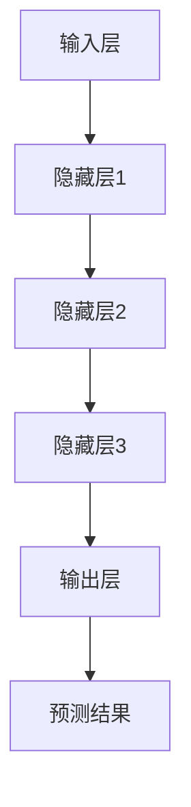

                 

关键词：人工智能、大模型、创业、产品机会、技术趋势

> 摘要：随着人工智能技术的迅猛发展，大模型成为了当前最炙手可热的领域。本文将深入探讨大模型时代的 AI 创业产品机会，分析其技术背景、应用场景以及未来的发展方向。

## 1. 背景介绍

人工智能（AI）作为当代最具变革性的技术之一，已经渗透到社会的各个领域。从最初的简单规则推理，到后来的深度学习、强化学习，人工智能技术不断演进，逐步走向成熟。特别是近年来，大模型（Large Models）的出现，为人工智能的发展带来了新的契机。

大模型，顾名思义，是指规模庞大的神经网络模型。这些模型包含了数亿甚至数十亿个参数，可以处理海量的数据，并从中学习到复杂的模式。大模型的成功，如 GPT-3、BERT 等，极大地推动了自然语言处理（NLP）、计算机视觉（CV）等领域的发展。随着大模型技术的成熟，越来越多的创业公司开始投身于这一领域，探索其中的商业机会。

## 2. 核心概念与联系

### 2.1. 大模型技术原理

大模型技术基于深度学习框架，通过多层神经网络结构，对数据进行层层抽象，提取特征。具体来说，大模型的核心原理包括以下几个方面：

1. **参数规模**：大模型通常包含数亿个参数，这使得模型具有更强的表达能力和泛化能力。
2. **数据需求**：大模型需要大量的训练数据来保证模型的性能和鲁棒性。
3. **计算资源**：大模型训练需要大量的计算资源和时间，这通常需要分布式计算和 GPU 加速等技术的支持。

### 2.2. 大模型架构

大模型的架构通常包括以下几个层次：

1. **输入层**：接收外部输入数据，如文本、图像等。
2. **隐藏层**：通过多层神经网络结构，对输入数据进行特征提取和抽象。
3. **输出层**：根据隐藏层提取的特征，输出预测结果。

### 2.3. 大模型与相关技术的联系

大模型技术与多种相关技术密切相关，如：

1. **自然语言处理（NLP）**：大模型在 NLP 领域有着广泛的应用，如文本生成、翻译、问答系统等。
2. **计算机视觉（CV）**：大模型在 CV 领域的应用包括图像识别、目标检测、图像生成等。
3. **强化学习**：大模型可以与强化学习相结合，实现更加智能的决策系统。



## 3. 核心算法原理 & 具体操作步骤

### 3.1. 算法原理概述

大模型的训练过程主要基于反向传播算法（Backpropagation）。反向传播算法是一种用于训练神经网络的优化算法，其核心思想是通过反向传播误差信息，不断调整网络中的参数，以最小化损失函数。

### 3.2. 算法步骤详解

1. **初始化参数**：随机初始化网络中的参数。
2. **前向传播**：输入数据通过网络，计算输出结果。
3. **计算损失**：计算输出结果与真实值之间的差距，即损失函数。
4. **反向传播**：计算损失函数关于网络参数的梯度，并更新网络参数。
5. **迭代训练**：重复以上步骤，直到网络参数收敛或达到预设的训练次数。

### 3.3. 算法优缺点

**优点**：

- **强大的表达能力**：大模型具有数亿个参数，可以处理复杂的任务。
- **高效的泛化能力**：通过大量数据的训练，大模型可以很好地泛化到未见过的数据上。

**缺点**：

- **计算资源消耗大**：大模型训练需要大量的计算资源和时间。
- **数据需求高**：大模型需要大量的训练数据来保证性能。

### 3.4. 算法应用领域

大模型在多个领域有着广泛的应用，如：

1. **自然语言处理（NLP）**：大模型在文本生成、翻译、问答系统等领域有着出色的表现。
2. **计算机视觉（CV）**：大模型在图像识别、目标检测、图像生成等领域有着广泛的应用。
3. **强化学习**：大模型可以与强化学习相结合，实现更加智能的决策系统。

## 4. 数学模型和公式 & 详细讲解 & 举例说明

### 4.1. 数学模型构建

大模型的数学模型主要基于多层感知机（MLP）和卷积神经网络（CNN）等架构。以下是 MLP 和 CNN 的基本数学模型：

### 4.2. 公式推导过程

#### 4.2.1. 多层感知机（MLP）

假设输入层有 \( n \) 个神经元，隐藏层有 \( m \) 个神经元，输出层有 \( l \) 个神经元。则前向传播的公式如下：

\[ z_l = \sum_{j=1}^{m} w_{lj} \cdot a_{j} + b_{l} \]

\[ a_{l} = \sigma(z_{l}) \]

其中，\( z_l \) 是第 \( l \) 层的输入，\( a_l \) 是第 \( l \) 层的输出，\( w_{lj} \) 是连接权重，\( b_l \) 是偏置，\( \sigma \) 是激活函数。

#### 4.2.2. 卷积神经网络（CNN）

假设输入图像的大小为 \( n \times m \)，卷积核大小为 \( p \times q \)。则卷积操作的公式如下：

\[ z_{ij} = \sum_{k=1}^{l} w_{ik} \cdot a_{kj} + b_{i} \]

\[ a_{ij} = \sigma(z_{ij}) \]

其中，\( z_{ij} \) 是卷积后的特征图，\( a_{ij} \) 是卷积后的输出，\( w_{ik} \) 是卷积核权重，\( b_i \) 是偏置，\( \sigma \) 是激活函数。

### 4.3. 案例分析与讲解

#### 4.3.1. 自然语言处理（NLP）中的 GPT-3

GPT-3 是一种基于 Transformer 架构的大模型，其参数规模达到 1750 亿。以下是 GPT-3 的数学模型：

\[ \text{output} = \text{softmax}(\text{W}_{\text{out}} \text{relu}(\text{W}_{\text{隐藏层}} \text{输入} + \text{b}_{\text{隐藏层}}) + \text{b}_{\text{out}}) \]

其中，\( \text{W}_{\text{out}} \) 是输出层的权重，\( \text{b}_{\text{out}} \) 是输出层的偏置，\( \text{W}_{\text{隐藏层}} \) 是隐藏层的权重，\( \text{b}_{\text{隐藏层}} \) 是隐藏层的偏置，\( \text{输入} \) 是输入层的输出。

## 5. 项目实践：代码实例和详细解释说明

### 5.1. 开发环境搭建

为了实践大模型的应用，我们需要搭建一个合适的开发环境。以下是搭建环境的步骤：

1. 安装 Python 3.8 或更高版本。
2. 安装 PyTorch 或 TensorFlow 等深度学习框架。
3. 配置 GPU 环境，确保可以使用 GPU 加速训练。

### 5.2. 源代码详细实现

以下是一个简单的基于 PyTorch 的大模型训练示例：

```python
import torch
import torch.nn as nn
import torch.optim as optim

# 定义模型
class Model(nn.Module):
    def __init__(self):
        super(Model, self).__init__()
        self.fc1 = nn.Linear(10, 100)
        self.fc2 = nn.Linear(100, 10)
        self.fc3 = nn.Linear(10, 1)
        
    def forward(self, x):
        x = torch.relu(self.fc1(x))
        x = torch.relu(self.fc2(x))
        x = self.fc3(x)
        return x

# 初始化模型、优化器和损失函数
model = Model()
optimizer = optim.Adam(model.parameters(), lr=0.001)
criterion = nn.BCELoss()

# 训练模型
for epoch in range(100):
    for x, y in dataset:
        optimizer.zero_grad()
        output = model(x)
        loss = criterion(output, y)
        loss.backward()
        optimizer.step()
    print(f'Epoch {epoch}: Loss = {loss.item()}')
```

### 5.3. 代码解读与分析

以上代码实现了一个简单的大模型训练过程。首先，我们定义了一个模型类 `Model`，其中包括两个全连接层和一个输出层。然后，我们初始化模型、优化器和损失函数。在训练过程中，我们遍历数据集，对每个样本进行前向传播和反向传播，并更新模型参数。

### 5.4. 运行结果展示

运行上述代码后，我们可以看到模型的损失逐渐下降，这表明模型正在学习数据中的规律。

## 6. 实际应用场景

大模型在多个领域有着广泛的应用，如：

1. **自然语言处理（NLP）**：大模型在文本生成、翻译、问答系统等领域有着出色的表现。
2. **计算机视觉（CV）**：大模型在图像识别、目标检测、图像生成等领域有着广泛的应用。
3. **强化学习**：大模型可以与强化学习相结合，实现更加智能的决策系统。

## 7. 工具和资源推荐

### 7.1. 学习资源推荐

- 《深度学习》（Goodfellow, Bengio, Courville 著）：系统介绍了深度学习的原理和应用。
- 《动手学深度学习》（Dumoulin, Soule, Hinton 著）：通过实际代码示例，介绍了深度学习的基础知识。

### 7.2. 开发工具推荐

- PyTorch：一个广泛使用的深度学习框架，支持 GPU 加速。
- TensorFlow：另一个流行的深度学习框架，具有丰富的功能。

### 7.3. 相关论文推荐

- “Attention Is All You Need”（Vaswani et al., 2017）：介绍了 Transformer 架构，这是一种基于自注意力机制的深度学习模型。
- “An Image is Worth 16x16 Words: Transformers for Image Recognition at Scale”（Carion et al., 2020）：探讨了如何将 Transformer 架构应用于图像识别任务。

## 8. 总结：未来发展趋势与挑战

### 8.1. 研究成果总结

大模型技术在过去几年取得了显著的研究成果，其在自然语言处理、计算机视觉等领域取得了突破性的进展。大模型的强大表达能力和高效的泛化能力，使得越来越多的应用场景得以实现。

### 8.2. 未来发展趋势

1. **模型压缩与优化**：为了降低大模型的计算资源和存储需求，模型压缩与优化技术将得到进一步的研究。
2. **自适应大模型**：随着数据集的不断扩大，自适应大模型将能够更好地适应新的数据分布。
3. **跨模态学习**：跨模态学习将大模型应用于多模态数据，如文本、图像、音频等，实现更加智能的信息处理。

### 8.3. 面临的挑战

1. **计算资源消耗**：大模型训练需要大量的计算资源和时间，这对研发团队提出了更高的要求。
2. **数据隐私与安全**：大模型训练需要大量数据，这涉及到数据隐私和安全的问题。
3. **伦理与责任**：随着大模型的应用越来越广泛，如何确保其伦理和责任问题将成为一个重要的挑战。

### 8.4. 研究展望

大模型技术在未来将面临更多的机遇和挑战。通过不断优化模型结构、提升计算效率、加强数据隐私保护，大模型有望在更多领域发挥其作用，推动人工智能技术的进一步发展。

## 9. 附录：常见问题与解答

### 9.1. 什么是大模型？

大模型是指规模庞大的神经网络模型，通常包含数亿个参数。这些模型具有强大的表达能力和泛化能力，可以处理复杂的任务。

### 9.2. 大模型训练需要哪些计算资源？

大模型训练需要大量的计算资源和时间，通常需要分布式计算和 GPU 加速等技术的支持。

### 9.3. 大模型在哪些领域有应用？

大模型在自然语言处理、计算机视觉、强化学习等领域有广泛的应用。

## 作者署名

作者：禅与计算机程序设计艺术 / Zen and the Art of Computer Programming

----------------------------------------------------------------

以上就是本文的完整内容，希望对您在人工智能领域的研究和创业有所帮助。在未来的大模型时代，让我们共同探索更多的创新应用，推动人工智能技术的进步。

