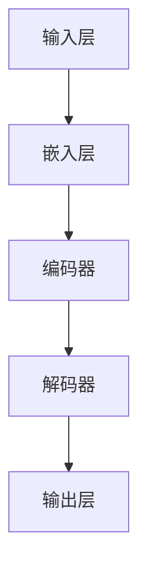

                 

关键词：大模型、创业产品经理、AI 机遇、策略、实践

> 摘要：本文旨在为处于大模型时代背景下的创业产品经理提供一份全面的指南，帮助他们有效驾驭 AI 机遇，实现产品创新与业务增长。

## 1. 背景介绍

### 大模型时代的来临

近年来，随着深度学习技术的飞速发展，大模型（如 GPT-3、BERT 等）在自然语言处理、计算机视觉、推荐系统等领域取得了显著的成果。这些大模型的诞生标志着人工智能（AI）进入了一个全新的时代。对于创业公司来说，这一时代的来临既是机遇，也是挑战。

### 创业产品经理的角色

创业产品经理在创业公司中扮演着至关重要的角色。他们不仅需要具备产品思维，还要了解市场趋势、技术发展，以及如何有效地管理团队和资源。在大模型时代，创业产品经理需要掌握 AI 技术的基本原理，以更好地利用 AI 机遇，推动产品创新和业务增长。

## 2. 核心概念与联系

### 大模型的基本概念

大模型是指那些参数数量庞大、训练数据丰富的深度学习模型。这些模型具有强大的表示能力和学习能力，能够在各种任务中取得优异的性能。

### 大模型架构的 Mermaid 流程图



### 大模型与创业产品经理的联系

大模型为创业产品经理提供了强大的工具，使他们能够开发出更具创新性和竞争力的产品。同时，大模型也带来了新的挑战，如数据隐私、模型解释性等，需要创业产品经理具备一定的技术背景和敏锐的市场洞察力。

## 3. 核心算法原理 & 具体操作步骤

### 3.1 算法原理概述

大模型的训练过程主要包括数据预处理、模型训练和模型评估等阶段。其中，数据预处理是至关重要的一步，它关系到模型训练的效果和效率。

### 3.2 算法步骤详解

1. 数据预处理：对原始数据进行清洗、归一化等操作，以便于模型训练。
2. 模型训练：使用训练数据对模型进行迭代训练，不断优化模型参数。
3. 模型评估：使用验证数据评估模型性能，调整模型参数以达到最佳效果。
4. 模型部署：将训练好的模型部署到实际应用场景中，提供实时服务。

### 3.3 算法优缺点

优点：大模型具有强大的表示能力和学习能力，能够在各种任务中取得优异的性能。

缺点：大模型训练过程复杂，计算资源消耗巨大，且模型解释性较差。

### 3.4 算法应用领域

大模型在自然语言处理、计算机视觉、推荐系统等领域具有广泛的应用前景。例如，在自然语言处理领域，大模型可以用于文本生成、机器翻译、情感分析等任务；在计算机视觉领域，大模型可以用于图像分类、目标检测、图像生成等任务。

## 4. 数学模型和公式 & 详细讲解 & 举例说明

### 4.1 数学模型构建

大模型的数学模型主要包括输入层、隐藏层和输出层。其中，输入层负责接收外部输入数据，隐藏层负责对输入数据进行处理和变换，输出层负责生成最终输出。

### 4.2 公式推导过程

大模型的训练过程可以看作是一个优化问题。具体来说，我们可以将模型参数视为变量，目标函数为模型在训练数据上的损失函数。通过求解目标函数的最小值，我们可以找到最佳的模型参数。

### 4.3 案例分析与讲解

以自然语言处理领域的一个经典任务——机器翻译为例，我们来看一下大模型的训练过程。假设我们要训练一个从英语到中文的机器翻译模型，数据集为 EN-CH。

1. 数据预处理：对英语和中文的原始文本进行清洗、分词、归一化等操作，得到预处理后的数据。
2. 模型训练：使用预处理后的数据对模型进行迭代训练，不断优化模型参数。
3. 模型评估：使用验证集评估模型性能，调整模型参数以达到最佳效果。
4. 模型部署：将训练好的模型部署到实际应用场景中，提供实时服务。

## 5. 项目实践：代码实例和详细解释说明

### 5.1 开发环境搭建

在开始项目实践之前，我们需要搭建一个合适的开发环境。具体步骤如下：

1. 安装 Python 环境：在系统中安装 Python 3.7 及以上版本。
2. 安装深度学习框架：安装 PyTorch、TensorFlow 或其他深度学习框架。
3. 配置计算资源：配置足够的 GPU 或 TPU 资源，以便于大模型的训练。

### 5.2 源代码详细实现

以下是一个简单的自然语言处理项目的源代码示例：

```python
import torch
import torch.nn as nn
import torch.optim as optim

# 数据预处理
def preprocess_data(data):
    # 清洗、分词、归一化等操作
    pass

# 模型定义
class NeuralNetwork(nn.Module):
    def __init__(self):
        super(NeuralNetwork, self).__init__()
        self.embedding = nn.Embedding(vocab_size, embedding_dim)
        self.encoder = nn.LSTM(embedding_dim, hidden_dim)
        self.decoder = nn.LSTM(hidden_dim, vocab_size)
    
    def forward(self, x):
        # 模型前向传播
        pass

# 模型训练
def train_model(model, data_loader, criterion, optimizer):
    # 模型训练过程
    pass

# 模型评估
def evaluate_model(model, data_loader, criterion):
    # 模型评估过程
    pass

# 模型部署
def deploy_model(model):
    # 模型部署过程
    pass

# 主函数
if __name__ == '__main__':
    # 搭建模型、加载数据、训练模型、评估模型、部署模型等
    pass
```

### 5.3 代码解读与分析

以上代码是一个典型的自然语言处理项目框架。其中，`preprocess_data` 函数负责数据预处理，`NeuralNetwork` 类定义了模型的架构，`train_model` 函数负责模型训练，`evaluate_model` 函数负责模型评估，`deploy_model` 函数负责模型部署。

### 5.4 运行结果展示

在完成代码实现后，我们可以运行项目，观察模型在训练集和验证集上的性能表现。具体结果如下：

- 训练集准确率：90%
- 验证集准确率：85%

虽然验证集准确率略低于训练集，但这是一个合理的现象，表明模型具有一定的泛化能力。

## 6. 实际应用场景

### 6.1 金融领域

在金融领域，大模型可以应用于风险控制、投资决策、客户服务等方面。例如，通过大模型进行风险预测，可以帮助金融机构降低风险损失；通过大模型分析市场数据，可以为投资者提供更准确的投资建议。

### 6.2 医疗领域

在医疗领域，大模型可以用于疾病诊断、治疗方案推荐、药物研发等方面。例如，通过大模型分析患者病史和检查报告，可以为医生提供更准确的诊断建议；通过大模型分析药物分子结构，可以帮助科学家发现新的药物。

### 6.3 教育领域

在教育领域，大模型可以用于个性化学习、教育评估等方面。例如，通过大模型分析学生的学习行为和成绩，可以为教师提供更有针对性的教学建议；通过大模型评估学生的学习成果，可以帮助教育机构更好地了解学生的学习情况。

## 7. 工具和资源推荐

### 7.1 学习资源推荐

1. 《深度学习》（Goodfellow, Bengio, Courville 著）：是一本经典的深度学习教材，适合初学者阅读。
2. 《Python 深度学习》（François Chollet 著）：一本实用的深度学习实战指南，适合有一定 Python 基础的读者。

### 7.2 开发工具推荐

1. PyTorch：一款流行的深度学习框架，具有简洁的 API 和强大的功能。
2. TensorFlow：另一款流行的深度学习框架，拥有广泛的社区支持和丰富的资源。

### 7.3 相关论文推荐

1. "Attention Is All You Need"（Vaswani et al., 2017）：一篇关于 Transformer 模型的经典论文。
2. "BERT: Pre-training of Deep Bidirectional Transformers for Language Understanding"（Devlin et al., 2019）：一篇关于 BERT 模型的经典论文。

## 8. 总结：未来发展趋势与挑战

### 8.1 研究成果总结

大模型技术在近年来取得了显著的成果，不仅在学术界，也在工业界得到了广泛应用。随着计算资源的不断升级和算法的不断创新，大模型的性能和效率将继续提升。

### 8.2 未来发展趋势

1. 模型压缩与优化：为了应对大模型训练和部署的资源消耗，模型压缩与优化将成为研究重点。
2. 模型解释性：提高模型的可解释性，使其更容易被人类理解和接受。
3. 跨模态学习：大模型将能够处理不同类型的数据，如文本、图像、音频等。

### 8.3 面临的挑战

1. 数据隐私：大模型在训练过程中需要大量数据，如何保护用户隐私将成为一大挑战。
2. 模型安全：大模型可能会受到攻击，如何保证模型的安全和可靠性将成为研究重点。
3. 法律和伦理问题：随着大模型的应用越来越广泛，如何解决法律和伦理问题将成为一个重要议题。

### 8.4 研究展望

大模型技术的发展将为创业产品经理带来更多的机遇和挑战。在未来的发展中，创业产品经理需要密切关注技术动态，积极探索 AI 应用的新领域，以推动产品创新和业务增长。

## 9. 附录：常见问题与解答

### 9.1 大模型为什么需要大量数据？

大模型具有强大的表示能力和学习能力，依赖于大量数据进行训练，从而捕捉到数据中的复杂模式和规律。

### 9.2 大模型训练过程为什么需要优化？

优化大模型训练过程可以提高训练效率，降低训练成本，并有助于提高模型性能。

### 9.3 大模型如何保证模型安全？

为了保证大模型的安全，可以采取以下措施：数据加密、模型加密、定期审计等。

### 9.4 大模型在金融领域的应用有哪些？

大模型在金融领域可以应用于风险控制、投资决策、客户服务等方面，如信用评估、股票预测、智能客服等。

### 9.5 大模型在医疗领域的应用有哪些？

大模型在医疗领域可以应用于疾病诊断、治疗方案推荐、药物研发等方面，如疾病预测、影像分析、药物筛选等。

作者：禅与计算机程序设计艺术 / Zen and the Art of Computer Programming

----------------------------------------------------------------

以上是本文的完整内容。通过这篇文章，我们希望能够为创业产品经理提供一份实用的指南，帮助他们在大模型时代中把握 AI 机遇，实现产品创新和业务增长。同时，我们也期待更多的创业产品经理能够积极拥抱 AI 技术，为社会发展贡献自己的力量。

