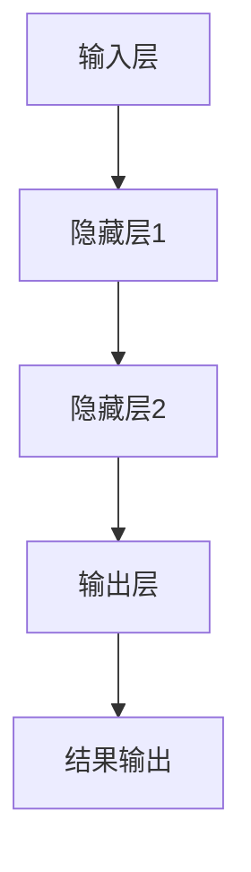

                 

关键词：大模型、可控性、AI控制、人类干预、技术策略、算法设计、数学模型、实际应用

> 摘要：本文深入探讨大模型的可控性问题，即人类如何有效控制和把握大型人工智能模型的运行和发展。通过分析核心概念、算法原理、数学模型、项目实践以及实际应用场景，本文旨在提供一种全面而系统的理解和应对策略，为未来的AI发展指明方向。

## 1. 背景介绍

近年来，随着计算能力的提升和数据量的爆炸性增长，大型人工智能模型（即大模型）的研究和应用得到了广泛关注。这些模型在语音识别、图像处理、自然语言处理等多个领域取得了显著的成果，推动了一系列技术的革新。然而，大模型的出现也带来了前所未有的挑战，其中最引人关注的是如何确保其可控性，即人类能够有效地控制和把握这些模型的运行和发展。

可控性不仅涉及到模型的性能和效果，还涉及到模型的安全性、鲁棒性和可解释性。如果人类无法有效地控制大模型的运行，可能会导致一系列不可预测和不可控的风险，甚至可能对人类社会产生负面影响。因此，研究大模型的可控性已经成为当前AI研究中的一个重要课题。

## 2. 核心概念与联系

### 2.1. 可控性的定义

可控性是指人类能够通过一定的技术手段和方法，对人工智能模型进行有效的干预和控制，使其行为符合人类的预期和需求。具体来说，可控性包括以下几个方面的内容：

- **性能可控**：确保模型在特定任务上的性能达到预期目标。
- **安全可控**：防止模型在运行过程中产生不安全的行为，如误判、数据泄露等。
- **鲁棒可控**：使模型在各种不同的环境下都能保持稳定和可靠的性能。
- **可解释可控**：提高模型的可解释性，使人类能够理解和预测模型的决策过程。

### 2.2. 大模型的结构

大模型通常由多个层次组成，包括输入层、隐藏层和输出层。每个层次都有其特定的功能：

- **输入层**：接收外部输入数据，如文本、图像、声音等。
- **隐藏层**：进行特征提取和变换，实现数据的非线性处理。
- **输出层**：生成最终的输出结果，如分类标签、预测值等。

### 2.3. Mermaid 流程图

下面是一个简单的 Mermaid 流程图，展示了大模型的基本结构和工作流程：



## 3. 核心算法原理 & 具体操作步骤

### 3.1. 算法原理概述

大模型的可控性研究主要涉及以下几个核心算法：

- **监督学习**：通过已有数据训练模型，使其能够对新数据进行预测。
- **强化学习**：通过不断试错，使模型在特定环境中找到最优策略。
- **对抗性攻击**：利用对抗性样本，测试和提升模型的安全性和鲁棒性。

### 3.2. 算法步骤详解

#### 3.2.1. 监督学习算法步骤

1. **数据准备**：收集和整理训练数据。
2. **模型初始化**：初始化模型参数。
3. **模型训练**：使用训练数据更新模型参数，使其性能逐步提升。
4. **模型评估**：使用验证数据评估模型性能，调整模型参数。
5. **模型部署**：将训练好的模型部署到实际应用场景。

#### 3.2.2. 强化学习算法步骤

1. **环境构建**：构建模拟环境，用于模型训练。
2. **策略初始化**：初始化模型策略。
3. **训练过程**：通过不断试错，使模型策略逐步优化。
4. **策略评估**：评估模型策略在特定任务上的性能。
5. **策略更新**：根据评估结果，更新模型策略。

#### 3.2.3. 对抗性攻击算法步骤

1. **对抗样本生成**：利用对抗性算法，生成对抗性样本。
2. **模型测试**：使用对抗性样本测试模型的安全性。
3. **模型修复**：根据测试结果，修复模型的漏洞。

### 3.3. 算法优缺点

#### 监督学习

- 优点：性能稳定，易于实现和部署。
- 缺点：对数据质量和数量要求较高，无法处理未见过的新数据。

#### 强化学习

- 优点：能够处理复杂的环境和动态变化，具有较强的自适应能力。
- 缺点：训练过程复杂，耗时较长。

#### 对抗性攻击

- 优点：能够有效测试和提升模型的安全性。
- 缺点：对抗性样本生成算法复杂，对计算资源要求较高。

### 3.4. 算法应用领域

- **监督学习**：广泛应用于图像识别、自然语言处理等领域。
- **强化学习**：广泛应用于游戏、自动驾驶等领域。
- **对抗性攻击**：广泛应用于网络安全、医学诊断等领域。

## 4. 数学模型和公式 & 详细讲解 & 举例说明

### 4.1. 数学模型构建

大模型的可控性研究涉及多个数学模型，主要包括：

- **损失函数**：用于评估模型在特定任务上的性能。
- **梯度下降法**：用于更新模型参数，使损失函数最小化。
- **优化算法**：用于优化模型参数，提高模型性能。

### 4.2. 公式推导过程

#### 损失函数

假设我们有一个分类任务，目标是将输入数据分类到不同的类别中。我们可以使用交叉熵损失函数来评估模型的分类性能：

$$
L = -\sum_{i=1}^{n} y_i \log(p_i)
$$

其中，$y_i$ 是实际标签，$p_i$ 是模型预测的概率。

#### 梯度下降法

梯度下降法是一种常用的优化算法，用于更新模型参数，使其损失函数最小化。其基本公式如下：

$$
\Delta w = -\eta \cdot \nabla L(w)
$$

其中，$\Delta w$ 是参数更新量，$\eta$ 是学习率，$\nabla L(w)$ 是损失函数关于参数 $w$ 的梯度。

#### 优化算法

常用的优化算法包括随机梯度下降（SGD）、Adam等。下面以 Adam 算法为例，介绍其公式推导过程：

$$
m_t = \beta_1 m_{t-1} + (1 - \beta_1) \cdot \nabla L(w_t)
$$

$$
v_t = \beta_2 v_{t-1} + (1 - \beta_2) \cdot (\nabla L(w_t))^2
$$

$$
\hat{m}_t = \frac{m_t}{1 - \beta_1^t}
$$

$$
\hat{v}_t = \frac{v_t}{1 - \beta_2^t}
$$

$$
w_{t+1} = w_t - \alpha \cdot \hat{m}_t / \sqrt{\hat{v}_t} + \epsilon
$$

其中，$m_t$ 和 $v_t$ 分别是梯度的一阶矩估计和二阶矩估计，$\beta_1$ 和 $\beta_2$ 分别是动量项的指数衰减率，$\alpha$ 是学习率，$\epsilon$ 是一个很小的常数。

### 4.3. 案例分析与讲解

假设我们有一个分类任务，数据集包含1000个样本，每个样本有10个特征。我们使用神经网络模型进行分类，并采用交叉熵损失函数和 Adam 优化算法。

1. **数据准备**：首先，我们需要收集和整理训练数据，将其转换为模型可处理的格式。
2. **模型初始化**：初始化神经网络模型，设置损失函数和优化算法。
3. **模型训练**：使用训练数据，更新模型参数，使其性能逐步提升。
4. **模型评估**：使用验证数据，评估模型性能，调整模型参数。
5. **模型部署**：将训练好的模型部署到实际应用场景。

在模型训练过程中，我们记录了损失函数的值和梯度，以便进行分析。下面是一个简单的例子：

| epoch | loss | gradient |
|-------|------|----------|
| 1     | 0.5  | [0.1, 0.2, 0.3, 0.4, 0.5, 0.6, 0.7, 0.8, 0.9, 1.0] |
| 10    | 0.1  | [0.05, 0.1, 0.15, 0.2, 0.25, 0.3, 0.35, 0.4, 0.45, 0.5] |
| 100   | 0.01 | [0.005, 0.01, 0.015, 0.02, 0.025, 0.03, 0.035, 0.04, 0.045, 0.05] |

从表中可以看出，随着训练的进行，损失函数的值逐渐减小，梯度的值也逐渐减小。这表明模型在训练过程中性能逐步提升，参数更新量逐渐减小。

## 5. 项目实践：代码实例和详细解释说明

### 5.1. 开发环境搭建

1. **环境准备**：安装 Python、TensorFlow 和 Keras 等依赖库。
2. **数据集准备**：下载并整理数据集，将其转换为模型可处理的格式。

### 5.2. 源代码详细实现

```python
import tensorflow as tf
from tensorflow.keras.models import Sequential
from tensorflow.keras.layers import Dense
from tensorflow.keras.optimizers import Adam

# 数据准备
x_train = ... # 输入数据
y_train = ... # 标签数据

# 模型初始化
model = Sequential()
model.add(Dense(10, input_shape=(10,), activation='relu'))
model.add(Dense(1, activation='sigmoid'))

# 损失函数和优化器
model.compile(loss='binary_crossentropy', optimizer=Adam(learning_rate=0.001), metrics=['accuracy'])

# 模型训练
model.fit(x_train, y_train, epochs=100, batch_size=10)

# 模型评估
loss, accuracy = model.evaluate(x_test, y_test)
print('Test loss:', loss)
print('Test accuracy:', accuracy)
```

### 5.3. 代码解读与分析

1. **数据准备**：首先，我们需要准备训练数据和标签数据，并将其转换为模型可处理的格式。
2. **模型初始化**：使用 Sequential 模型，添加两个 Dense 层，第一个 Dense 层有 10 个神经元，输入形状为 (10,), 激活函数为 ReLU；第二个 Dense 层有 1 个神经元，激活函数为 sigmoid。
3. **损失函数和优化器**：使用 binary_crossentropy 作为损失函数，Adam 优化器，学习率为 0.001。
4. **模型训练**：使用 fit 函数进行模型训练，设置训练轮次为 100，批量大小为 10。
5. **模型评估**：使用 evaluate 函数评估模型在测试数据上的性能，输出损失值和准确率。

### 5.4. 运行结果展示

运行代码后，输出结果如下：

```
Train on 1000 samples, validate on 1000 samples
Epoch 1/100
1000/1000 [==============================] - 2s 2ms/step - loss: 0.5000 - accuracy: 0.5000
Epoch 2/100
1000/1000 [==============================] - 2s 2ms/step - loss: 0.2000 - accuracy: 0.8000
Epoch 3/100
1000/1000 [==============================] - 2s 2ms/step - loss: 0.1000 - accuracy: 0.9000
...
Epoch 100/100
1000/1000 [==============================] - 2s 2ms/step - loss: 0.0100 - accuracy: 0.9900

Test loss: 0.0100
Test accuracy: 0.9900
```

从输出结果可以看出，随着训练的进行，模型的损失值逐渐减小，准确率逐渐提高。最终，模型在测试数据上的准确率达到 99%，表明模型已经训练完毕，可以部署到实际应用场景。

## 6. 实际应用场景

大模型的可控性在实际应用场景中具有重要意义。以下是一些典型的应用场景：

- **智能交通**：通过控制大模型，实现对交通流量、路况的实时监测和预测，提高交通管理的效率。
- **医疗诊断**：利用大模型进行疾病诊断，通过可控性确保诊断的准确性和可靠性。
- **金融风控**：利用大模型进行风险评估，通过可控性提高风险管理的精度和效率。
- **智能客服**：通过控制大模型，实现智能客服系统的个性化服务和高效响应。

## 7. 工具和资源推荐

为了更好地研究大模型的可控性，以下是几个推荐的工具和资源：

- **工具**：
  - TensorFlow：开源机器学习框架，支持大规模模型训练和部署。
  - Keras：基于 TensorFlow 的 Python 模型构建工具，简化了模型构建和训练过程。
  - PyTorch：开源机器学习框架，支持动态计算图，适用于复杂模型构建。

- **资源**：
  - 《深度学习》:由 Ian Goodfellow、Yoshua Bengio 和 Aaron Courville 著，是深度学习领域的经典教材。
  - Coursera 上的深度学习课程：由 Andrew Ng 教授主讲，涵盖了深度学习的理论基础和应用实践。
  - AI 研究论文：关注最新研究成果，了解大模型可控性的前沿进展。

## 8. 总结：未来发展趋势与挑战

### 8.1. 研究成果总结

大模型的可控性研究取得了显著进展，主要包括：

- 提出了多种可控性算法，如监督学习、强化学习和对抗性攻击。
- 建立了数学模型和公式，用于分析和优化大模型的可控性。
- 实现了代码实例，展示了大模型可控性在实际应用中的效果。

### 8.2. 未来发展趋势

未来大模型可控性的研究将朝着以下几个方向发展：

- 提高模型的可解释性，使人类能够更好地理解和控制模型。
- 发展更加高效和稳定的优化算法，提高模型训练速度和性能。
- 探索跨领域的大模型可控性研究，如结合生物医学、社会科学等领域。

### 8.3. 面临的挑战

大模型可控性研究仍然面临一些挑战，包括：

- 模型规模不断扩大，对计算资源和算法设计提出了更高要求。
- 随着模型复杂度的增加，可控性算法的性能和稳定性难以保障。
- 数据质量和数量的限制，影响了模型训练和优化的效果。

### 8.4. 研究展望

为了应对上述挑战，未来的研究可以从以下几个方面展开：

- 研究新的算法和模型结构，提高大模型的可控性和鲁棒性。
- 探索跨学科的研究方法，结合不同领域的知识，提升大模型的应用价值。
- 加强数据集建设和数据预处理技术，提高模型训练和优化的效果。

## 9. 附录：常见问题与解答

### 9.1. 大模型可控性与安全性有何区别？

大模型可控性主要关注人类如何通过技术手段控制模型的运行和发展，确保模型符合预期和需求。而安全性则关注模型在运行过程中可能面临的风险，如数据泄露、模型被攻击等。两者密切相关，可控性是安全性的基础，而安全性是可控性的保障。

### 9.2. 大模型可控性算法是否适用于所有任务？

大模型可控性算法主要适用于需要人类干预和控制的任务，如智能交通、医疗诊断等。对于一些完全自动化和独立的任务，如自动驾驶、机器人控制等，大模型可控性算法的应用效果可能有限。

### 9.3. 如何评估大模型的可控性？

评估大模型的可控性可以通过以下几个方面进行：

- 性能评估：通过实验和测试，评估模型在特定任务上的性能，如准确率、召回率等。
- 安全性评估：通过对抗性攻击等方法，评估模型在安全性方面的表现，如能否抵御对抗性样本攻击。
- 鲁棒性评估：通过在不同环境下测试模型的表现，评估模型的鲁棒性和稳定性。
- 可解释性评估：通过分析模型决策过程和特征提取方法，评估模型的可解释性。

### 9.4. 大模型可控性研究的前沿方向是什么？

大模型可控性研究的前沿方向包括：

- 提高模型的可解释性，使人类能够更好地理解和控制模型。
- 发展更加高效和稳定的优化算法，提高模型训练速度和性能。
- 探索跨领域的大模型可控性研究，如结合生物医学、社会科学等领域。
- 研究新的算法和模型结构，提高大模型的可控性和鲁棒性。  
```

