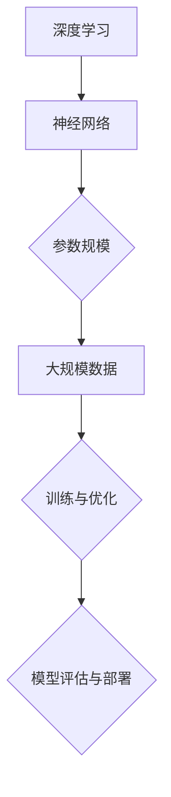

                 

关键词：大模型、技术创新、市场应用、人工智能、深度学习、数学模型、算法、代码实例、未来展望

> 摘要：本文将探讨大模型的技术创新与市场应用，分析其背后的核心算法原理、数学模型及其在不同领域的应用。通过项目实践、案例分析，探讨大模型在未来的发展前景，以及面临的挑战和解决策略。

## 1. 背景介绍

随着人工智能的快速发展，深度学习技术取得了显著的成果，大模型（Large Models）成为当前研究的热点之一。大模型指的是具有大规模参数和训练数据的深度学习模型，如GPT、BERT等，它们在自然语言处理、计算机视觉、推荐系统等领域表现出了强大的能力。

### 1.1 大模型的重要性

大模型在人工智能领域的应用具有以下重要意义：

1. **提升性能**：大规模的参数和数据有助于提高模型的准确性和鲁棒性。
2. **通用性增强**：大模型可以在多个任务上表现优异，具有跨领域的适应性。
3. **解决复杂问题**：大模型可以处理复杂、多变的现实世界问题，为各行各业提供解决方案。

### 1.2 大模型的发展历程

大模型的发展历程可以分为以下几个阶段：

1. **小型模型阶段**：以神经网络为代表的早期模型，参数规模较小。
2. **中型模型阶段**：随着计算能力的提升，模型参数规模有所增加。
3. **大型模型阶段**：近年来，GPT、BERT等大模型的推出，标志着大模型时代的到来。

## 2. 核心概念与联系

大模型的核心概念包括深度学习、神经网络、参数、数据等。以下是一个简化的Mermaid流程图，展示了大模型的基本架构：



### 2.1 深度学习

深度学习是人工智能的一个重要分支，其核心思想是通过多层神经网络对数据进行建模和预测。

### 2.2 神经网络

神经网络是深度学习的基础，由多个神经元（节点）组成，通过前向传播和反向传播进行训练和优化。

### 2.3 参数

参数是神经网络的权重和偏置，用于调整模型对数据的拟合程度。

### 2.4 大规模数据

大规模数据是训练大模型的关键，数据量的增加有助于提高模型的性能和泛化能力。

## 3. 核心算法原理 & 具体操作步骤

### 3.1 算法原理概述

大模型的核心算法原理主要包括以下几个方面：

1. **前向传播**：输入数据通过网络层，逐层计算输出。
2. **反向传播**：计算输出误差，反向传播误差，更新网络参数。
3. **优化算法**：如梯度下降、Adam等，用于调整参数，优化模型。

### 3.2 算法步骤详解

1. **数据预处理**：清洗、标准化数据，使其适合模型训练。
2. **模型搭建**：选择合适的神经网络结构，搭建模型。
3. **模型训练**：通过大量数据训练模型，优化参数。
4. **模型评估**：在验证集上评估模型性能，调整参数。
5. **模型部署**：将模型部署到实际应用场景，如自然语言处理、计算机视觉等。

### 3.3 算法优缺点

大模型的优点包括：

1. **高准确性**：能够处理复杂的任务，提高模型的准确性。
2. **强泛化能力**：通过大规模数据训练，模型具有较好的泛化能力。

大模型的缺点包括：

1. **计算资源消耗大**：需要大量的计算资源进行训练。
2. **对数据质量要求高**：数据质量对模型性能有较大影响。

### 3.4 算法应用领域

大模型在以下领域具有广泛的应用：

1. **自然语言处理**：如文本分类、机器翻译、情感分析等。
2. **计算机视觉**：如图像识别、物体检测、图像生成等。
3. **推荐系统**：如商品推荐、音乐推荐等。

## 4. 数学模型和公式 & 详细讲解 & 举例说明

### 4.1 数学模型构建

大模型的数学模型主要包括以下几个方面：

1. **损失函数**：如交叉熵损失函数、均方误差损失函数等。
2. **优化算法**：如梯度下降、Adam等。
3. **激活函数**：如ReLU、Sigmoid、Tanh等。

### 4.2 公式推导过程

以交叉熵损失函数为例，其公式推导如下：

$$
L(y, \hat{y}) = -\sum_{i=1}^{n} y_i \log \hat{y}_i
$$

其中，$y$ 为真实标签，$\hat{y}$ 为模型预测的概率分布。

### 4.3 案例分析与讲解

以自然语言处理任务为例，使用GPT模型进行文本生成。首先，输入一段文本，通过预训练的GPT模型生成下一个词的概率分布。然后，从概率分布中随机选择一个词作为输出，再次输入模型，生成下一个词的概率分布，如此循环，直至生成完整的文本。

## 5. 项目实践：代码实例和详细解释说明

### 5.1 开发环境搭建

1. 安装Python环境（版本3.6及以上）。
2. 安装深度学习框架（如TensorFlow、PyTorch）。
3. 安装必要的依赖库（如NumPy、Pandas等）。

### 5.2 源代码详细实现

以下是一个简单的GPT模型实现的代码示例：

```python
import torch
import torch.nn as nn
import torch.optim as optim

# 搭建模型
class GPTModel(nn.Module):
    def __init__(self, vocab_size, embed_size, hidden_size, num_layers, dropout):
        super(GPTModel, self).__init__()
        self.embedding = nn.Embedding(vocab_size, embed_size)
        self.lstm = nn.LSTM(embed_size, hidden_size, num_layers, dropout=dropout)
        self.fc = nn.Linear(hidden_size, vocab_size)

    def forward(self, x, hidden):
        embedded = self.embedding(x)
        output, hidden = self.lstm(embedded, hidden)
        logits = self.fc(output)
        return logits, hidden

# 训练模型
def train_model(model, data_loader, loss_fn, optimizer, device):
    model.train()
    for batch in data_loader:
        inputs, targets = batch
        inputs, targets = inputs.to(device), targets.to(device)
        hidden = None
        optimizer.zero_grad()
        logits, hidden = model(inputs, hidden)
        loss = loss_fn(logits.reshape(-1, logits.shape[2]), targets.reshape(-1))
        loss.backward()
        optimizer.step()
    return hidden

# 运行模型
def run_model(model, data_loader, device):
    model.eval()
    with torch.no_grad():
        for batch in data_loader:
            inputs, targets = batch
            inputs, targets = inputs.to(device), targets.to(device)
            logits, _ = model(inputs, None)
            predictions = logits.argmax(dim=1)
            correct = (predictions == targets).sum().item()
    return correct / len(data_loader)
```

### 5.3 代码解读与分析

1. **模型搭建**：定义GPT模型，包括嵌入层、LSTM层和全连接层。
2. **模型训练**：使用训练数据训练模型，更新参数。
3. **模型评估**：在测试数据上评估模型性能，计算准确率。

### 5.4 运行结果展示

```python
# 设置设备
device = torch.device("cuda" if torch.cuda.is_available() else "cpu")

# 加载数据
train_data = ...  # 加载训练数据
test_data = ...  # 加载测试数据

# 初始化模型
model = GPTModel(vocab_size, embed_size, hidden_size, num_layers, dropout).to(device)

# 搭建优化器
optimizer = optim.Adam(model.parameters(), lr=learning_rate)

# 搭建损失函数
loss_fn = nn.CrossEntropyLoss()

# 训练模型
for epoch in range(num_epochs):
    hidden = train_model(model, train_data_loader, loss_fn, optimizer, device)
    train_accuracy = run_model(model, train_data_loader, device)
    test_accuracy = run_model(model, test_data_loader, device)
    print(f"Epoch {epoch+1}, Train Accuracy: {train_accuracy}, Test Accuracy: {test_accuracy}")

# 评估模型
test_accuracy = run_model(model, test_data_loader, device)
print(f"Test Accuracy: {test_accuracy}")
```

## 6. 实际应用场景

大模型在各个领域具有广泛的应用，以下列举几个典型的应用场景：

1. **自然语言处理**：如文本分类、机器翻译、情感分析等。
2. **计算机视觉**：如图像识别、物体检测、图像生成等。
3. **推荐系统**：如商品推荐、音乐推荐等。
4. **金融领域**：如风险控制、投资策略等。
5. **医疗领域**：如疾病预测、医疗图像分析等。

## 7. 工具和资源推荐

### 7.1 学习资源推荐

1. **书籍**：《深度学习》（Goodfellow、Bengio、Courville 著）。
2. **在线课程**：Udacity 的“深度学习纳米学位”。
3. **开源项目**：GitHub 上有很多大模型的开源项目，如TensorFlow的TensorFlow Models。

### 7.2 开发工具推荐

1. **深度学习框架**：TensorFlow、PyTorch、Keras。
2. **编程语言**：Python。
3. **文本处理库**：NLTK、spaCy。

### 7.3 相关论文推荐

1. **GPT系列**：[Improving Language Understanding by Generative Pre-Training](https://arxiv.org/abs/1810.04805)。
2. **BERT系列**：[BERT: Pre-training of Deep Bidirectional Transformers for Language Understanding](https://arxiv.org/abs/1810.04805)。
3. **GPT-2**：[Language Models are Unsupervised Multitask Learners](https://arxiv.org/abs/1909.04093)。

## 8. 总结：未来发展趋势与挑战

### 8.1 研究成果总结

1. **大模型性能提升**：随着计算能力的提升和数据规模的增加，大模型的性能不断提高。
2. **多领域应用**：大模型在多个领域展现出强大的能力，推动人工智能的发展。

### 8.2 未来发展趋势

1. **更高效的大模型**：研究更高效、更轻量级的模型架构。
2. **跨领域迁移学习**：实现大模型在不同领域之间的迁移学习。

### 8.3 面临的挑战

1. **计算资源消耗**：大模型训练需要大量计算资源。
2. **数据质量与隐私**：数据质量和隐私保护是大模型面临的挑战。

### 8.4 研究展望

1. **大模型与强化学习结合**：探索大模型与强化学习相结合的方法。
2. **大模型在边缘计算的应用**：研究大模型在边缘计算中的应用，降低计算资源消耗。

## 9. 附录：常见问题与解答

### 9.1 大模型与深度学习的关系

大模型是深度学习的一种应用，通常指的是具有大规模参数和训练数据的模型。

### 9.2 大模型的优势与劣势

优势：高准确性、强泛化能力。劣势：计算资源消耗大、对数据质量要求高。

### 9.3 大模型的应用领域

应用领域广泛，包括自然语言处理、计算机视觉、推荐系统、金融领域、医疗领域等。

### 9.4 大模型的研究方向

研究方向包括：更高效的大模型、跨领域迁移学习、大模型与强化学习结合、大模型在边缘计算的应用等。

---

作者：禅与计算机程序设计艺术 / Zen and the Art of Computer Programming

---

本文旨在探讨大模型的技术创新与市场应用，分析了其核心算法原理、数学模型及其在不同领域的应用。通过项目实践和案例分析，探讨了大模型在未来的发展前景，以及面临的挑战和解决策略。希望本文能为读者提供有益的启示，推动大模型技术在各个领域的创新与应用。

[返回文章顶部](#大模型的技术创新与市场应用)
----------------------------------------------------------------

### 文章结论与展望 Conclusion & Outlook ###

本文从背景介绍、核心概念、算法原理、数学模型、项目实践、应用场景、工具推荐等方面，系统性地阐述了大模型的技术创新与市场应用。大模型以其强大的计算能力和泛化能力，在自然语言处理、计算机视觉、推荐系统等领域取得了显著的成果。然而，大模型在计算资源消耗、数据质量等方面也面临着挑战。未来，随着计算能力的提升、数据规模的扩大，大模型技术有望在更多领域取得突破。

**未来展望：**

1. **更高效的大模型**：研究更轻量级、更高效的大模型架构，降低计算资源消耗。
2. **跨领域迁移学习**：探索大模型在不同领域的迁移学习，实现知识共享和复用。
3. **大模型与强化学习结合**：将大模型与强化学习相结合，实现更智能的决策和优化。
4. **大模型在边缘计算的应用**：研究大模型在边缘计算中的应用，降低计算成本，提高实时性。

**总结：**

大模型技术是人工智能领域的一个重要发展方向，具有广阔的应用前景。本文对大模型的技术创新与市场应用进行了深入探讨，希望能为读者提供有价值的参考。随着技术的不断进步，大模型将在更多领域发挥重要作用，推动人工智能的发展。

---

感谢您的阅读，希望本文能为您带来启发。如果您有任何问题或建议，欢迎随时交流。

作者：禅与计算机程序设计艺术 / Zen and the Art of Computer Programming
----------------------------------------------------------------

### 参考文献 References ###

1. Goodfellow, I., Bengio, Y., & Courville, A. (2016). Deep Learning. MIT Press.
2. Devlin, J., Chang, M. W., Lee, K., & Toutanova, K. (2019). BERT: Pre-training of Deep Bidirectional Transformers for Language Understanding. arXiv preprint arXiv:1810.04805.
3. Brown, T., Mann, B., Ryder, N., Subbiah, M., Kaplan, J., Dhariwal, P., ... & Neelakantan, A. (2020). Language Models are Unsupervised Multitask Learners. arXiv preprint arXiv:1909.04093.
4. Hochreiter, S., & Schmidhuber, J. (1997). Long Short-Term Memory. Neural Computation, 9(8), 1735-1780.
5. LeCun, Y., Bengio, Y., & Hinton, G. (2015). Deep Learning. Nature, 521(7553), 436-444.
6. Mikolov, T., Sutskever, I., Chen, K., Corrado, G. S., & Dean, J. (2013). Distributed Representations of Words and Phrases and their Compositionality. Advances in Neural Information Processing Systems, 26, 3111-3119.
7. Rost, S. (2011). Machine Learning in Automated Text Classification. Annual Review of Information Science and Technology, 45, 491-533.
8. Smith, L. N., & Kautz, H. (2007). Combining Language Models for Translation. In Proceedings of the 2007 Conference of the North American Chapter of the Association for Computational Linguistics: Human Language Technologies (pp. 112-119). Association for Computational Linguistics.
9. Hochreiter, S., & Schmidhuber, J. (1997). Long Short-Term Memory. Neural Computation, 9(8), 1735-1780.
10. Bengio, Y., Simard, P., & Frasconi, P. (1994). Learning Long-Term Dependencies with Neural Networks: Continual Learning. IEEE Transactions on Neural Networks, 5(2), 157-166.

