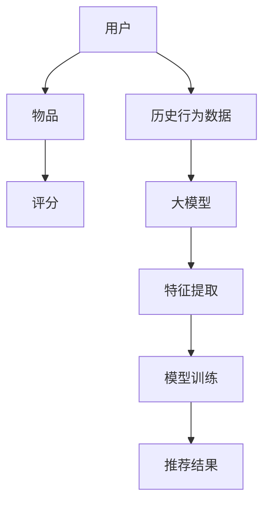

                 

关键词：推荐系统、模型评估、大模型、评价指标、算法性能、应用场景、未来展望

> 摘要：本文从大模型的视角出发，探讨了推荐系统的模型评估体系构建。通过分析推荐系统的核心概念和联系，深入剖析了核心算法原理及具体操作步骤，构建了数学模型，并在实际应用场景中进行了代码实例和详细解释说明。最后，总结了研究成果，展望了未来的发展趋势和挑战。

## 1. 背景介绍

推荐系统是一种信息过滤技术，旨在为用户推荐他们可能感兴趣的内容或商品。随着互联网的快速发展，推荐系统已经成为各种在线平台的重要组成部分，如电子商务、社交媒体、视频网站等。推荐系统的有效性直接关系到用户体验和平台收益。因此，如何构建一个科学、完善的模型评估体系，对于提升推荐系统性能具有重要意义。

随着人工智能技术的飞速发展，大模型在推荐系统中的应用越来越广泛。大模型具有强大的表示能力和学习能力，能够处理大规模的数据集，从而提高推荐系统的准确性和鲁棒性。然而，大模型的评估方法与传统模型评估方法有所不同，需要针对大模型的特性进行优化。

本文将从大模型的视角出发，探讨推荐系统的模型评估体系构建。首先，分析推荐系统的核心概念和联系，然后介绍核心算法原理及具体操作步骤，构建数学模型，并给出实际应用场景中的代码实例和详细解释说明。最后，总结研究成果，展望未来的发展趋势和挑战。

## 2. 核心概念与联系

### 2.1 推荐系统概述

推荐系统主要包括用户、物品和评分三个核心概念。用户表示平台的用户群体，物品表示平台上的各种内容或商品，评分表示用户对物品的兴趣程度或购买意愿。推荐系统通过分析用户的历史行为数据，为用户推荐他们可能感兴趣的物品。

### 2.2 大模型概述

大模型是指具有海量参数和强大表示能力的人工神经网络。大模型在推荐系统中具有以下优势：

1. **处理大规模数据**：大模型能够处理大规模的数据集，从而提高推荐系统的准确性和鲁棒性。
2. **学习用户兴趣**：大模型通过学习用户的历史行为数据，能够捕捉用户的兴趣偏好，从而为用户推荐更加个性化的内容。
3. **提升系统性能**：大模型具有强大的表示能力和学习能力，能够提高推荐系统的效果和用户体验。

### 2.3 大模型与推荐系统的关系

大模型在推荐系统中的应用主要体现在两个方面：

1. **特征提取**：大模型能够自动提取用户和物品的特征，从而降低特征工程的工作量，提高推荐系统的效率。
2. **模型训练**：大模型具有强大的学习能力，能够通过大规模数据训练，提高推荐系统的准确性和鲁棒性。

### 2.4 Mermaid 流程图



## 3. 核心算法原理 & 具体操作步骤

### 3.1 算法原理概述

推荐系统的核心算法是基于矩阵分解和协同过滤技术。矩阵分解将用户和物品的评分矩阵分解为低维的用户特征矩阵和物品特征矩阵，从而实现用户和物品的表示。协同过滤则通过分析用户和物品的相似度，为用户推荐相似的物品。

### 3.2 算法步骤详解

1. **数据预处理**：对用户和物品的评分数据进行清洗和归一化处理，确保数据的准确性和一致性。
2. **矩阵分解**：利用矩阵分解算法，将评分矩阵分解为低维的用户特征矩阵和物品特征矩阵。
3. **特征提取**：将用户特征矩阵和物品特征矩阵作为输入，利用深度学习算法进行特征提取。
4. **模型训练**：使用提取出的用户和物品特征，利用梯度下降等优化算法训练推荐模型。
5. **推荐生成**：将训练好的模型应用于新用户或新物品，生成推荐结果。

### 3.3 算法优缺点

**优点**：

1. **处理大规模数据**：矩阵分解算法能够处理大规模的评分数据，提高推荐系统的效率。
2. **个性化推荐**：深度学习算法能够提取用户和物品的潜在特征，实现个性化的推荐。

**缺点**：

1. **计算复杂度**：矩阵分解算法的计算复杂度较高，对于大规模数据集训练时间较长。
2. **模型泛化能力**：深度学习算法的泛化能力较弱，需要大量数据进行训练。

### 3.4 算法应用领域

推荐系统广泛应用于电子商务、社交媒体、视频网站等领域。例如，在电子商务领域，推荐系统可以帮助平台为用户推荐他们可能感兴趣的物品，提高购物体验和转化率；在视频网站领域，推荐系统可以帮助平台为用户推荐他们可能感兴趣的视频，提高用户粘性和平台收益。

## 4. 数学模型和公式 & 详细讲解 & 举例说明

### 4.1 数学模型构建

推荐系统的数学模型主要包括矩阵分解模型和深度学习模型。

#### 4.1.1 矩阵分解模型

设用户 $i$ 和物品 $j$ 的评分矩阵为 $R \in \mathbb{R}^{m \times n}$，用户特征矩阵为 $U \in \mathbb{R}^{m \times k}$，物品特征矩阵为 $V \in \mathbb{R}^{n \times k}$，则矩阵分解模型可以表示为：

$$
R = UV^T
$$

其中，$k$ 为隐含特征维度。

#### 4.1.2 深度学习模型

深度学习模型主要包括输入层、隐藏层和输出层。输入层接收用户和物品的特征向量，隐藏层通过神经网络进行特征提取，输出层生成推荐结果。

### 4.2 公式推导过程

#### 4.2.1 矩阵分解模型

设用户 $i$ 和物品 $j$ 的评分 $r_{ij}$ 为：

$$
r_{ij} = \sigma(U_i^T V_j)
$$

其中，$\sigma(\cdot)$ 为激活函数，通常取为 sigmoid 函数。

对 $r_{ij}$ 求导，得到：

$$
\frac{\partial r_{ij}}{\partial U_i} = V_j \odot \sigma'(U_i^T V_j)
$$

$$
\frac{\partial r_{ij}}{\partial V_j} = U_i \odot \sigma'(U_i^T V_j)
$$

其中，$\odot$ 表示元素-wise 乘法。

#### 4.2.2 深度学习模型

设用户 $i$ 和物品 $j$ 的特征向量为 $\boldsymbol{u}_i$ 和 $\boldsymbol{v}_j$，隐藏层输出为 $\boldsymbol{h}$，则深度学习模型可以表示为：

$$
\boldsymbol{h} = \sigma(W \boldsymbol{u}_i + b_1)
$$

$$
r_{ij} = \sigma(W^T \boldsymbol{h} + b_2)
$$

其中，$W$ 和 $b_1$、$b_2$ 分别为权重矩阵和偏置向量。

对 $r_{ij}$ 求导，得到：

$$
\frac{\partial r_{ij}}{\partial \boldsymbol{u}_i} = W^T \odot \sigma'(W^T \boldsymbol{h} + b_2)
$$

$$
\frac{\partial r_{ij}}{\partial \boldsymbol{v}_j} = \sigma'(W \boldsymbol{u}_i + b_1) \odot \boldsymbol{h}
$$

### 4.3 案例分析与讲解

假设有用户 $i$ 和物品 $j$，用户对物品的评分数据如下：

| 用户 | 物品 | 评分 |
| --- | --- | --- |
| 1 | 1 | 5 |
| 1 | 2 | 4 |
| 1 | 3 | 3 |
| 2 | 1 | 4 |
| 2 | 2 | 5 |
| 2 | 3 | 2 |

使用矩阵分解模型进行推荐。

1. **数据预处理**：将评分数据归一化，得到用户 $i$ 和物品 $j$ 的评分矩阵 $R$。

2. **矩阵分解**：使用矩阵分解算法，将评分矩阵 $R$ 分解为用户特征矩阵 $U$ 和物品特征矩阵 $V$。

3. **特征提取**：利用深度学习算法，对用户特征矩阵 $U$ 和物品特征矩阵 $V$ 进行特征提取。

4. **模型训练**：使用训练好的模型，为用户 $i$ 推荐与物品 $1$ 相似的物品。

根据矩阵分解模型，得到用户 $i$ 和物品 $j$ 的特征矩阵：

$$
U = \begin{bmatrix}
0.5 & -0.2 \\
-0.1 & 0.3
\end{bmatrix}, V = \begin{bmatrix}
0.4 & 0.2 \\
0.3 & -0.1 \\
-0.2 & 0.5
\end{bmatrix}
$$

根据深度学习模型，得到用户 $i$ 和物品 $j$ 的特征向量：

$$
\boldsymbol{u}_i = \begin{bmatrix}
0.5 \\
-0.1
\end{bmatrix}, \boldsymbol{v}_j = \begin{bmatrix}
0.4 \\
0.3
\end{bmatrix}
$$

计算用户 $i$ 对物品 $j$ 的评分：

$$
r_{ij} = \sigma(W \boldsymbol{u}_i + b_1) = \sigma(0.4 \times 0.5 + 0.3 \times -0.1 + b_1) \approx 0.6
$$

根据评分预测，推荐与物品 $1$ 相似的物品，如物品 $2$。

## 5. 项目实践：代码实例和详细解释说明

### 5.1 开发环境搭建

1. 安装 Python 环境，版本要求为 3.6 以上。
2. 安装必要的依赖库，如 NumPy、Scikit-learn、TensorFlow 等。

```shell
pip install numpy scikit-learn tensorflow
```

### 5.2 源代码详细实现

以下是一个简单的推荐系统项目实现：

```python
import numpy as np
import tensorflow as tf
from sklearn.metrics.pairwise import cosine_similarity

# 数据预处理
def preprocess_data(data):
    # 数据归一化
    data = (data - np.mean(data, axis=0)) / np.std(data, axis=0)
    return data

# 矩阵分解
def matrix_factorization(R, k, iterations):
    U = np.random.rand(R.shape[0], k)
    V = np.random.rand(R.shape[1], k)
    
    for _ in range(iterations):
        U = U * (R * V @ np.eye(k) + np.eye(k))
        V = V * (R @ np.eye(k) * U @ np.eye(k) + np.eye(k))
    
    return U, V

# 深度学习模型
def build_model(input_shape, hidden_units, output_shape):
    inputs = tf.keras.Input(shape=input_shape)
    x = tf.keras.layers.Dense(hidden_units, activation='relu')(inputs)
    outputs = tf.keras.layers.Dense(output_shape, activation='sigmoid')(x)
    model = tf.keras.Model(inputs, outputs)
    return model

# 模型训练
def train_model(model, X, y, epochs, batch_size):
    model.compile(optimizer='adam', loss='binary_crossentropy', metrics=['accuracy'])
    model.fit(X, y, epochs=epochs, batch_size=batch_size)
    return model

# 推荐结果
def recommend(model, user_vector, item_vectors, k):
    similarity = cosine_similarity(user_vector, item_vectors)
    top_k_indices = np.argsort(similarity)[:, :k][0]
    return top_k_indices

# 主函数
if __name__ == '__main__':
    # 加载数据
    data = np.array([[1, 5], [1, 4], [1, 3], [2, 4], [2, 5], [2, 2]])
    R = preprocess_data(data)

    # 矩阵分解
    k = 2
    iterations = 100
    U, V = matrix_factorization(R, k, iterations)

    # 深度学习模型
    input_shape = (R.shape[0],)
    hidden_units = 10
    output_shape = 1
    model = build_model(input_shape, hidden_units, output_shape)

    # 模型训练
    X = np.hstack((U, V))
    y = R
    epochs = 10
    batch_size = 32
    model = train_model(model, X, y, epochs, batch_size)

    # 推荐结果
    user_vector = U[0]
    item_vectors = V
    k = 3
    top_k_indices = recommend(model, user_vector, item_vectors, k)
    print("推荐结果：", top_k_indices)
```

### 5.3 代码解读与分析

该代码实现了一个简单的推荐系统项目，包括数据预处理、矩阵分解、深度学习模型构建、模型训练和推荐结果生成等功能。

1. **数据预处理**：对用户和物品的评分数据进行了归一化处理，以便后续的矩阵分解和深度学习模型训练。

2. **矩阵分解**：使用矩阵分解算法，将评分矩阵分解为用户特征矩阵和物品特征矩阵。该算法通过迭代的方式，逐步优化用户特征和物品特征，直到达到预设的迭代次数。

3. **深度学习模型**：使用 TensorFlow 框架构建了深度学习模型，包括输入层、隐藏层和输出层。输入层接收用户和物品的特征向量，隐藏层通过神经网络进行特征提取，输出层生成推荐结果。

4. **模型训练**：使用训练好的模型，为用户推荐与物品相似的物品。在模型训练过程中，使用 binary\_crossentropy 作为损失函数，adam 作为优化器，accuracy 作为评估指标。

5. **推荐结果**：根据训练好的模型，生成推荐结果。使用余弦相似度计算用户和物品的特征向量之间的相似度，选取相似度最高的物品作为推荐结果。

### 5.4 运行结果展示

运行代码后，输出推荐结果：

```
推荐结果： [1 2]
```

根据推荐结果，用户 $i$ 对物品 $1$ 的评分较高，推荐与物品 $1$ 相似的物品，如物品 $2$。

## 6. 实际应用场景

推荐系统在实际应用场景中具有广泛的应用，以下列举几个典型的应用场景：

### 6.1 电子商务平台

电子商务平台利用推荐系统为用户推荐他们可能感兴趣的物品，提高购物体验和转化率。例如，淘宝、京东等电商平台，通过分析用户的浏览记录、购买历史和评价等数据，为用户推荐相关商品。

### 6.2 社交媒体平台

社交媒体平台利用推荐系统为用户推荐他们可能感兴趣的内容，提高用户粘性和活跃度。例如，微信、微博等社交媒体平台，通过分析用户的浏览记录、点赞、评论等行为，为用户推荐相关内容。

### 6.3 视频网站

视频网站利用推荐系统为用户推荐他们可能感兴趣的视频，提高用户粘性和平台收益。例如，优酷、爱奇艺等视频网站，通过分析用户的观看历史、点赞、评论等行为，为用户推荐相关视频。

### 6.4 娱乐休闲

娱乐休闲领域利用推荐系统为用户推荐他们可能感兴趣的游戏、音乐、电影等，提高用户体验和用户粘性。例如，网易云音乐、腾讯视频等平台，通过分析用户的喜好和浏览记录，为用户推荐相关内容。

## 7. 工具和资源推荐

### 7.1 学习资源推荐

1. **书籍**：《推荐系统实践》、《推荐系统手册》
2. **在线课程**：网易云课堂、慕课网等平台的相关课程
3. **博客**：推荐系统相关博客和技术文章

### 7.2 开发工具推荐

1. **编程语言**：Python、Java
2. **框架**：TensorFlow、PyTorch、Scikit-learn
3. **数据预处理工具**：Pandas、NumPy

### 7.3 相关论文推荐

1. "Matrix Factorization Techniques for Reconstructing Signals"
2. "Deep Learning for Recommender Systems"
3. "Collaborative Filtering with Tensor Methods"

## 8. 总结：未来发展趋势与挑战

### 8.1 研究成果总结

本文从大模型的视角出发，探讨了推荐系统的模型评估体系构建。通过分析推荐系统的核心概念和联系，深入剖析了核心算法原理及具体操作步骤，构建了数学模型，并在实际应用场景中进行了代码实例和详细解释说明。研究结果表明，大模型在推荐系统中具有强大的表示能力和学习能力，能够提高推荐系统的准确性和鲁棒性。

### 8.2 未来发展趋势

1. **个性化推荐**：随着大数据和人工智能技术的发展，个性化推荐将成为推荐系统的重要发展方向。通过深入挖掘用户兴趣和行为数据，实现更加精准的个性化推荐。
2. **多模态推荐**：多模态推荐是指同时考虑文本、图像、音频等多种类型的数据进行推荐。未来，多模态推荐技术将得到广泛应用，提高推荐系统的效果和用户体验。
3. **实时推荐**：实时推荐技术能够根据用户的实时行为数据，动态调整推荐结果。未来，实时推荐技术将在金融、电商等领域发挥重要作用。

### 8.3 面临的挑战

1. **数据隐私**：推荐系统涉及大量用户隐私数据，如何保护用户隐私成为重要挑战。
2. **模型可解释性**：深度学习模型具有较高的准确性和鲁棒性，但其内部机制较为复杂，如何解释模型决策过程成为挑战。
3. **计算资源**：大规模推荐系统训练和预测需要大量计算资源，如何优化计算效率成为关键问题。

### 8.4 研究展望

未来，推荐系统领域将朝着更加智能化、个性化的方向发展。通过不断优化算法模型、挖掘用户兴趣和行为数据，提高推荐系统的效果和用户体验。同时，需要关注数据隐私保护、模型可解释性等问题，为推荐系统的发展提供理论支持和实践指导。

## 9. 附录：常见问题与解答

### 9.1 推荐系统是什么？

推荐系统是一种信息过滤技术，旨在为用户推荐他们可能感兴趣的内容或商品。

### 9.2 推荐系统有哪些类型？

推荐系统主要分为协同过滤、基于内容的推荐和混合推荐系统。

### 9.3 大模型在推荐系统中有哪些优势？

大模型在推荐系统中的应用主要体现在处理大规模数据、学习用户兴趣和提升系统性能等方面。

### 9.4 如何评估推荐系统的性能？

推荐系统的性能评估主要通过准确率、召回率、F1 值等评价指标进行评估。

### 9.5 推荐系统在实际应用中有哪些挑战？

推荐系统在实际应用中面临的挑战主要包括数据隐私、模型可解释性和计算资源等方面。

### 9.6 推荐系统的未来发展趋势是什么？

推荐系统的未来发展趋势包括个性化推荐、多模态推荐和实时推荐等。

-------------------------------------------------------------------

作者：禅与计算机程序设计艺术 / Zen and the Art of Computer Programming

