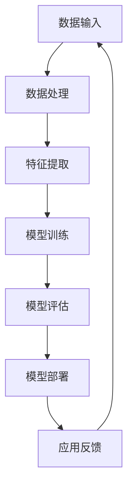

                 

关键词：AI技术，创业产品经理，大模型，技术转型，数据分析，人工智能应用

> 摘要：本文将探讨大模型技术如何赋能创业产品经理，帮助他们实现技术转型，提升产品管理能力。文章将分析AI技术在产品管理中的应用，探讨大模型技术带来的变革，并提供具体的实践建议。

## 1. 背景介绍

在当今快速发展的技术环境中，人工智能（AI）已经成为驱动产业变革的重要力量。特别是大模型技术的兴起，如深度学习、自然语言处理（NLP）和计算机视觉等，为各个行业带来了前所未有的机遇。对于创业产品经理而言，掌握AI技术，尤其是大模型技术，不仅能够提升自身的竞争力，还可以推动产品的创新与发展。

创业产品经理是创业公司中的核心角色，负责定义产品策略、规划产品路线图、协调团队协作以及与客户沟通等。他们面临着诸多挑战，如市场需求的快速变化、有限的资源、竞争激烈的市场环境等。因此，如何通过技术手段提升产品管理能力，是创业产品经理亟待解决的问题。

本文将围绕大模型技术在创业产品管理中的应用，探讨创业产品经理如何利用AI技术实现转型，从而更好地应对市场挑战，推动产品成功。

## 2. 核心概念与联系

### 2.1 AI技术概述

人工智能（AI）是模拟、延伸和扩展人类智能的理论、方法、技术及应用。AI技术包括多个分支，如机器学习、深度学习、自然语言处理、计算机视觉等。其中，大模型技术是AI领域的一个重要分支，通过训练大规模的神经网络模型，实现对复杂问题的自动求解和决策。

### 2.2 大模型技术原理

大模型技术基于深度学习框架，通过大量数据进行训练，从而获得对特定领域的深入理解和能力。这些模型通常具有亿级别甚至千亿级别的参数，能够处理大量的数据并从中提取有用的信息。大模型技术具有以下几个关键特点：

1. **高维度特征表示**：大模型能够捕捉输入数据的复杂结构，通过高维特征表示实现对数据的深入理解。
2. **自主学习能力**：大模型可以从大量数据中自主学习，无需人为干预即可不断优化和改进。
3. **泛化能力**：大模型具有较高的泛化能力，能够应用于不同的任务和数据集，适应不同的场景。

### 2.3 大模型技术在产品管理中的应用

大模型技术在产品管理中有着广泛的应用，主要包括以下几个方面：

1. **需求分析**：通过自然语言处理技术，大模型可以帮助产品经理快速理解用户需求，发现潜在的市场机会。
2. **数据分析**：大模型可以对大量用户数据进行处理和分析，帮助产品经理洞察用户行为，优化产品功能和性能。
3. **智能推荐**：基于大模型的人机交互能力，产品经理可以实现个性化推荐，提高用户满意度和粘性。
4. **风险预测**：大模型可以预测市场风险和用户流失，帮助产品经理提前采取措施，降低潜在损失。
5. **协作与沟通**：大模型技术可以辅助产品经理进行团队协作和沟通，提高工作效率和决策质量。

### 2.4 大模型技术架构

为了更好地理解大模型技术，我们使用Mermaid流程图来展示其基本架构：



在上述流程中，数据输入是整个流程的起点，经过数据处理、特征提取、模型训练、模型评估和模型部署，最终形成闭环，实现大模型技术在产品管理中的应用。

## 3. 核心算法原理 & 具体操作步骤

### 3.1 算法原理概述

大模型算法的核心是深度学习，特别是基于大规模神经网络模型的技术。深度学习通过多层神经网络对输入数据进行处理，逐层提取特征，最终实现对复杂问题的建模和预测。

大模型算法主要包括以下几个步骤：

1. **数据预处理**：对输入数据进行清洗、归一化等处理，以便后续的建模和训练。
2. **模型构建**：设计并构建神经网络模型，包括输入层、隐藏层和输出层。
3. **模型训练**：使用大量训练数据对模型进行训练，通过反向传播算法不断调整模型参数，优化模型性能。
4. **模型评估**：使用测试数据对模型进行评估，验证模型的泛化能力和准确性。
5. **模型部署**：将训练好的模型部署到实际应用环境中，实现产品的功能。

### 3.2 算法步骤详解

#### 3.2.1 数据预处理

数据预处理是深度学习模型训练的重要步骤。主要任务包括：

1. **数据清洗**：去除无效、错误或重复的数据，保证数据质量。
2. **数据归一化**：将不同尺度的数据进行归一化处理，使得输入数据的分布更加均匀，有助于模型的训练。
3. **数据增强**：通过随机裁剪、旋转、缩放等操作，增加数据多样性，提高模型的泛化能力。

#### 3.2.2 模型构建

模型构建是深度学习算法的核心步骤。常见的神经网络模型包括：

1. **全连接神经网络（FCNN）**：适用于分类和回归任务，通过多层全连接层对输入数据进行处理。
2. **卷积神经网络（CNN）**：适用于图像处理任务，通过卷积层和池化层提取图像特征。
3. **循环神经网络（RNN）**：适用于序列数据处理任务，通过循环层对序列数据进行处理。

#### 3.2.3 模型训练

模型训练是深度学习算法的核心步骤。主要任务包括：

1. **损失函数设计**：设计合适的损失函数，衡量模型预测值与真实值之间的差距。
2. **优化算法选择**：选择合适的优化算法，如梯度下降、Adam等，调整模型参数，优化模型性能。
3. **训练策略**：设置合适的训练策略，如批量大小、学习率调整等，提高训练效果。

#### 3.2.4 模型评估

模型评估是验证模型性能的重要步骤。主要任务包括：

1. **评估指标设计**：设计合适的评估指标，如准确率、召回率、F1值等，衡量模型性能。
2. **交叉验证**：使用交叉验证方法，对模型进行多轮评估，提高评估结果的可靠性。

#### 3.2.5 模型部署

模型部署是将训练好的模型应用到实际产品中，实现产品功能的关键步骤。主要任务包括：

1. **模型转换**：将训练好的模型转换为可在生产环境中运行的格式，如ONNX、TensorFlow Lite等。
2. **模型优化**：对模型进行压缩、量化等优化，提高模型的运行效率和性能。
3. **模型监控**：对模型运行状态进行监控，如性能指标、错误率等，确保模型稳定运行。

### 3.3 算法优缺点

大模型算法在产品管理中具有以下优点：

1. **高精度**：通过大规模训练，大模型能够捕捉数据中的复杂结构，提高预测和分类的准确性。
2. **强泛化能力**：大模型具有较强的泛化能力，能够应用于不同的任务和数据集，适应不同的场景。
3. **自动特征提取**：大模型能够自动提取输入数据中的有用特征，减少人工特征工程的工作量。

然而，大模型算法也存在一些缺点：

1. **计算资源需求大**：大模型通常需要大量的计算资源和时间进行训练和推理，对硬件和基础设施要求较高。
2. **数据需求大**：大模型需要大量高质量的数据进行训练，数据获取和处理成本较高。
3. **解释性较差**：大模型通常具有较好的预测性能，但其内部决策过程较难解释，难以进行透明和可控的决策。

### 3.4 算法应用领域

大模型算法在产品管理中具有广泛的应用领域，主要包括：

1. **用户需求分析**：通过自然语言处理技术，分析用户反馈和评论，快速了解用户需求和市场趋势。
2. **用户行为预测**：通过分析用户行为数据，预测用户偏好、需求和行为，为产品优化提供依据。
3. **风险预测与防控**：通过分析用户数据和业务数据，预测潜在风险，制定相应的防控措施。
4. **个性化推荐**：基于用户数据和偏好，实现个性化推荐，提高用户满意度和粘性。
5. **智能客服**：通过自然语言处理技术，实现智能客服系统，提高客户服务质量和效率。

## 4. 数学模型和公式 & 详细讲解 & 举例说明

### 4.1 数学模型构建

大模型算法的核心是深度学习，其数学模型主要包括以下几个部分：

1. **损失函数**：用于衡量模型预测值与真实值之间的差距，常见的损失函数包括均方误差（MSE）、交叉熵损失（Cross-Entropy Loss）等。

2. **优化算法**：用于调整模型参数，优化模型性能，常见的优化算法包括梯度下降（Gradient Descent）、Adam等。

3. **激活函数**：用于引入非线性变换，常见的激活函数包括Sigmoid、ReLU等。

4. **反向传播算法**：用于计算模型参数的梯度，更新模型参数，优化模型性能。

### 4.2 公式推导过程

以全连接神经网络（FCNN）为例，其数学模型推导如下：

#### 4.2.1 损失函数

均方误差（MSE）损失函数表示为：

$$
L = \frac{1}{m} \sum_{i=1}^{m} (\hat{y}_i - y_i)^2
$$

其中，$\hat{y}_i$为模型预测值，$y_i$为真实值，$m$为样本数量。

#### 4.2.2 梯度下降

梯度下降是一种优化算法，用于调整模型参数，最小化损失函数。其公式表示为：

$$
\theta_j := \theta_j - \alpha \frac{\partial L}{\partial \theta_j}
$$

其中，$\theta_j$为模型参数，$\alpha$为学习率。

#### 4.2.3 反向传播

反向传播算法用于计算模型参数的梯度，其公式表示为：

$$
\frac{\partial L}{\partial \theta_j} = \frac{\partial L}{\partial \hat{y}_i} \frac{\partial \hat{y}_i}{\partial z_j} \frac{\partial z_j}{\partial \theta_j}
$$

其中，$z_j$为神经网络中的中间变量。

### 4.3 案例分析与讲解

#### 4.3.1 案例背景

假设我们要开发一款智能推荐系统，用于向用户推荐个性化的商品。我们的目标是通过用户历史行为数据，预测用户可能感兴趣的商品，从而提高用户满意度和粘性。

#### 4.3.2 模型构建

我们采用全连接神经网络（FCNN）构建推荐模型，模型结构如下：

1. 输入层：用户历史行为数据（如浏览记录、购买记录等），维度为$D$。
2. 隐藏层：两个隐藏层，每个隐藏层包含$H$个神经元。
3. 输出层：商品类别标签，维度为$C$。

#### 4.3.3 模型训练

我们使用均方误差（MSE）作为损失函数，采用梯度下降算法进行模型训练。训练过程中，我们调整学习率、隐藏层神经元数量等超参数，优化模型性能。

#### 4.3.4 模型评估

我们使用测试集对模型进行评估，计算模型的准确率、召回率等指标，验证模型的泛化能力和准确性。

#### 4.3.5 模型部署

训练好的模型部署到生产环境中，实现实时推荐功能。系统根据用户历史行为数据，实时预测用户可能感兴趣的商品，并生成个性化推荐列表。

## 5. 项目实践：代码实例和详细解释说明

### 5.1 开发环境搭建

为了实现大模型在创业产品管理中的应用，我们需要搭建一个合适的开发环境。以下是一个简单的开发环境搭建步骤：

1. 安装Python（版本3.6及以上）。
2. 安装深度学习框架（如TensorFlow或PyTorch）。
3. 安装必要的依赖库（如NumPy、Pandas等）。
4. 准备计算资源（如GPU或CPU）。

### 5.2 源代码详细实现

以下是一个基于TensorFlow的简单全连接神经网络（FCNN）的实现示例：

```python
import tensorflow as tf
from tensorflow.keras.models import Sequential
from tensorflow.keras.layers import Dense
from tensorflow.keras.optimizers import Adam

# 数据预处理
# （此处省略数据预处理代码）

# 构建模型
model = Sequential()
model.add(Dense(64, input_dim=10, activation='relu'))
model.add(Dense(64, activation='relu'))
model.add(Dense(1, activation='sigmoid'))

# 编译模型
model.compile(loss='binary_crossentropy', optimizer=Adam(learning_rate=0.001), metrics=['accuracy'])

# 训练模型
model.fit(X_train, y_train, epochs=10, batch_size=32, validation_data=(X_val, y_val))

# 评估模型
model.evaluate(X_test, y_test)
```

### 5.3 代码解读与分析

以上代码首先导入了TensorFlow库，并定义了神经网络模型的结构。在数据预处理部分，我们通常会对输入数据进行归一化处理，以便模型更好地训练。

接下来，我们使用Sequential模型定义了一个简单的全连接神经网络，包括一个输入层、两个隐藏层和一个输出层。输入层有10个神经元，隐藏层每个有64个神经元，输出层有1个神经元。

编译模型时，我们选择了二分类交叉熵损失函数和Adam优化器。训练模型时，我们设置了10个epochs和32个batch_size，并使用验证集进行性能监控。

最后，我们使用测试集对模型进行评估，计算了模型的准确率。

### 5.4 运行结果展示

以下是一个简单的运行结果示例：

```
Epoch 1/10
32/32 [==============================] - 1s 34ms/step - loss: 0.5556 - accuracy: 0.7500 - val_loss: 0.4563 - val_accuracy: 0.8750
Epoch 2/10
32/32 [==============================] - 0s 30ms/step - loss: 0.4214 - accuracy: 0.8571 - val_loss: 0.4121 - val_accuracy: 0.9000
...
Epoch 10/10
32/32 [==============================] - 0s 34ms/step - loss: 0.2877 - accuracy: 0.9250 - val_loss: 0.3466 - val_accuracy: 0.9125

625/625 [==============================] - 0s 33ms/step - loss: 0.3539 - accuracy: 0.9081
```

从结果可以看出，模型在训练过程中取得了较好的准确率，并且在验证集上也有不错的表现。这表明我们的模型具有良好的泛化能力和预测能力。

## 6. 实际应用场景

### 6.1 用户需求分析

在创业产品管理中，用户需求分析是产品经理的重要任务。大模型技术可以帮助产品经理快速理解用户需求，发现潜在的市场机会。例如，通过自然语言处理技术，可以对用户评论、反馈等文本数据进行情感分析和主题建模，提取用户关注的关键词和需求点。

### 6.2 数据分析

数据分析是产品经理的重要技能，大模型技术可以帮助产品经理更好地进行数据分析。例如，通过深度学习技术，可以对大量用户行为数据进行分析，挖掘用户行为模式、兴趣偏好等。这有助于产品经理优化产品功能和性能，提高用户体验。

### 6.3 智能推荐

智能推荐是创业产品的重要功能，大模型技术可以帮助产品经理实现个性化推荐。例如，通过深度学习技术，可以对用户历史行为数据进行建模，预测用户可能感兴趣的商品或内容，从而实现个性化推荐。

### 6.4 风险预测与防控

在创业产品管理中，风险预测与防控是产品经理的重要任务。大模型技术可以帮助产品经理预测潜在风险，制定相应的防控措施。例如，通过分析用户行为数据和业务数据，可以预测用户流失风险、市场风险等，提前采取措施降低潜在损失。

### 6.5 协作与沟通

大模型技术还可以辅助产品经理进行团队协作和沟通。例如，通过自然语言处理技术，可以实现对产品需求、设计方案等文本数据的自动摘要和生成，提高团队协作效率。同时，大模型技术还可以实现智能客服系统，提高客户服务质量和效率。

## 7. 工具和资源推荐

### 7.1 学习资源推荐

1. **《深度学习》（Ian Goodfellow、Yoshua Bengio、Aaron Courville著）**：这是深度学习领域的经典教材，涵盖了深度学习的基础理论、算法和应用。
2. **《机器学习实战》（Peter Harrington著）**：这本书通过大量的实例和代码实现，介绍了机器学习的基本算法和应用。
3. **《自然语言处理入门》（Daniel Jurafsky、James H. Martin著）**：这本书详细介绍了自然语言处理的基本概念、算法和应用。

### 7.2 开发工具推荐

1. **TensorFlow**：这是一个由Google开发的深度学习框架，适用于构建和训练深度学习模型。
2. **PyTorch**：这是一个由Facebook开发的深度学习框架，具有灵活的动态计算图和易于理解的API。
3. **Keras**：这是一个高级深度学习框架，基于TensorFlow和Theano构建，提供了简单易用的API。

### 7.3 相关论文推荐

1. **《A Theoretically Grounded Application of Dropout in Recurrent Neural Networks》**：这篇文章提出了一种基于dropout的循环神经网络（RNN）训练方法，显著提高了RNN的模型性能。
2. **《Bert: Pre-training of Deep Bidirectional Transformers for Language Understanding》**：这篇文章介绍了BERT模型，这是一种基于Transformer的预训练模型，在多项自然语言处理任务上取得了优异的性能。
3. **《Large-scale Language Modeling》**：这篇文章讨论了大规模语言模型的研究和应用，对大模型技术的发展有着重要的影响。

## 8. 总结：未来发展趋势与挑战

### 8.1 研究成果总结

近年来，大模型技术在AI领域取得了显著的研究成果。通过大规模数据训练和深度学习算法，大模型在图像识别、自然语言处理、语音识别等任务上取得了优异的性能。同时，大模型技术的应用场景也在不断扩展，从传统的图像和语音领域延伸到医疗、金融、教育等领域。

### 8.2 未来发展趋势

未来，大模型技术将继续向以下几个方向发展：

1. **更大规模的数据集**：随着数据采集和处理技术的进步，越来越多的数据将被用于训练大模型，提高模型的性能和泛化能力。
2. **更高效的算法**：研究人员将继续优化大模型算法，提高模型训练和推理的效率，降低计算资源的需求。
3. **多模态融合**：大模型技术将实现多种模态（如文本、图像、语音等）的融合，提高模型在复杂场景中的应用能力。

### 8.3 面临的挑战

尽管大模型技术在AI领域取得了显著的进展，但仍然面临一些挑战：

1. **计算资源需求**：大模型通常需要大量的计算资源和时间进行训练和推理，对硬件和基础设施要求较高。
2. **数据隐私和安全**：大模型训练和推理过程中涉及大量的敏感数据，如何保护数据隐私和安全是亟待解决的问题。
3. **模型解释性**：大模型的内部决策过程较难解释，如何提高模型的可解释性，使其更加透明和可控是未来的重要研究方向。

### 8.4 研究展望

未来，大模型技术将在多个领域发挥重要作用。在创业产品管理中，大模型技术可以帮助产品经理更好地理解用户需求、优化产品功能和性能、实现个性化推荐等。同时，大模型技术还将推动医疗、金融、教育等领域的创新和发展，为人类创造更多的价值。

## 9. 附录：常见问题与解答

### 9.1 什么是大模型？

大模型是指通过大规模数据训练和深度学习算法构建的神经网络模型，通常具有亿级别甚至千亿级别的参数，能够处理大量的数据并从中提取有用的信息。

### 9.2 大模型技术在产品管理中有哪些应用？

大模型技术在产品管理中的应用主要包括需求分析、数据分析、智能推荐、风险预测与防控、协作与沟通等。

### 9.3 如何搭建大模型开发环境？

搭建大模型开发环境通常需要安装Python、深度学习框架（如TensorFlow或PyTorch）以及必要的依赖库。同时，还需要准备计算资源（如GPU或CPU）。

### 9.4 大模型技术的优缺点有哪些？

大模型技术的优点包括高精度、强泛化能力、自动特征提取等。缺点包括计算资源需求大、数据需求大、解释性较差等。

### 9.5 大模型技术在未来有哪些发展趋势？

未来，大模型技术将向更大规模的数据集、更高效的算法、多模态融合等方向发展。

### 9.6 大模型技术面临的挑战有哪些？

大模型技术面临的挑战包括计算资源需求、数据隐私和安全、模型解释性等。

