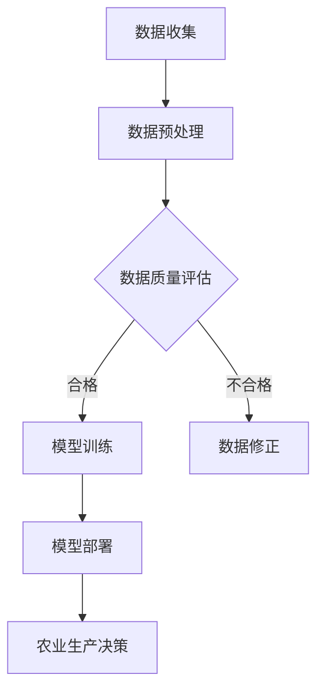

                 

关键词：大模型、智慧农业、农业生产智能化、创业者、AI应用

> 摘要：本文将探讨大模型在智慧农业领域的应用，分析创业者如何利用人工智能技术推动农业生产智能化。通过具体的案例和操作步骤，本文旨在为创业者提供有价值的参考，助力农业生产迈向智能化时代。

## 1. 背景介绍

随着全球人口的快速增长和气候变化对农业生产的挑战，提高农业生产的效率和可持续性已成为当务之急。智慧农业作为现代农业发展的重要方向，借助物联网、大数据、人工智能等技术，实现农业生产的智能化、精准化，为解决全球粮食安全问题提供了新的思路。

近年来，大模型技术的迅猛发展，使得人工智能在各个领域得到了广泛应用。在智慧农业领域，大模型技术同样具有重要的应用价值。通过大模型，可以处理和分析大量的农业数据，提供精准的农业决策支持，从而提高农业生产效率，降低生产成本，促进农业可持续发展。

## 2. 核心概念与联系

在探讨大模型赋能智慧农业之前，我们需要了解以下几个核心概念：

- **智慧农业**：以物联网、大数据、人工智能等现代信息技术为支撑，通过监测、分析和优化农业生产过程，实现农业生产的智能化、精准化。

- **大模型**：指具有海量参数、可以处理大规模数据的人工智能模型，如深度学习模型、生成对抗网络（GAN）等。

- **农业生产智能化**：利用人工智能技术对农业生产过程进行实时监测、分析和决策，提高生产效率、降低成本、减少资源浪费。

### Mermaid 流程图

下面是农业生产智能化的 Mermaid 流程图：



## 3. 核心算法原理 & 具体操作步骤

### 3.1 算法原理概述

农业生产智能化的核心算法主要包括：

- **数据收集与预处理**：通过传感器、无人机等设备收集农业数据，如土壤湿度、气温、光照等，并对数据进行清洗、归一化等预处理。

- **数据质量评估**：评估数据的质量，如数据完整性、准确性等，以确保后续模型训练的效果。

- **模型训练**：利用收集到的数据训练人工智能模型，如深度学习模型、生成对抗网络（GAN）等，用于农业生产过程的实时监测和决策。

- **模型部署**：将训练好的模型部署到农业生产现场，实现实时农业生产决策。

### 3.2 算法步骤详解

1. **数据收集**：利用传感器、无人机等设备收集农业数据。

2. **数据预处理**：对收集到的数据进行清洗、归一化等预处理，以提高数据质量。

3. **数据质量评估**：评估数据的质量，如数据完整性、准确性等，对不合格的数据进行修正。

4. **模型训练**：利用预处理后的数据训练人工智能模型，如深度学习模型、生成对抗网络（GAN）等。

5. **模型部署**：将训练好的模型部署到农业生产现场，实现实时农业生产决策。

### 3.3 算法优缺点

**优点**：

- 提高农业生产效率：通过实时监测和决策，优化农业生产过程，提高产量和质量。

- 降低生产成本：通过数据驱动的方式，减少资源浪费，降低生产成本。

- 促进农业可持续发展：通过智能化、精准化的生产方式，减少对环境的影响，促进农业可持续发展。

**缺点**：

- 数据质量要求高：农业生产数据质量对模型训练效果至关重要，数据质量问题可能影响模型性能。

- 技术门槛较高：大模型训练和部署需要较高的技术门槛，对创业者的技术能力有较高要求。

### 3.4 算法应用领域

大模型在智慧农业领域具有广泛的应用前景，包括：

- **精准农业**：通过大模型实现农田精准管理，提高作物产量和质量。

- **病虫害监测与防治**：利用大模型对病虫害进行实时监测和预测，提供防治建议。

- **气象预测**：通过大模型对气象数据进行处理和分析，提供精准的气象预测服务。

- **水资源管理**：利用大模型实现水资源的精准管理和调度，提高水资源利用效率。

## 4. 数学模型和公式 & 详细讲解 & 举例说明

### 4.1 数学模型构建

农业生产智能化的大模型通常基于深度学习技术，其数学模型主要包括：

- **输入层**：接收农业数据的特征向量。

- **隐藏层**：通过神经网络结构对输入数据进行处理和变换。

- **输出层**：根据处理后的数据生成农业生产决策。

### 4.2 公式推导过程

假设输入层有 $n$ 个特征，隐藏层有 $m$ 个神经元，输出层有 $k$ 个神经元，则神经网络的前向传播公式如下：

$$
z_l^i = \sum_{j=1}^{n} w_{lj} x_j + b_l
$$

$$
a_l^i = \sigma(z_l^i)
$$

$$
z_k^j = \sum_{i=1}^{m} w_{ik} a_l^i + b_k
$$

$$
y_j = \sigma(z_k^j)
$$

其中，$w_{lj}$、$w_{ik}$ 分别表示权重矩阵，$b_l$、$b_k$ 分别表示偏置项，$x_j$ 表示输入特征，$a_l^i$ 表示隐藏层激活值，$y_j$ 表示输出结果，$\sigma$ 表示激活函数。

### 4.3 案例分析与讲解

以下是一个简单的农业生产智能化案例：

**目标**：根据土壤湿度数据预测作物的灌溉需求。

**输入数据**：土壤湿度（$0$ 到 $1$ 之间的数值，$0$ 表示干燥，$1$ 表示湿润）。

**输出结果**：灌溉需求（$0$ 表示不需要灌溉，$1$ 表示需要灌溉）。

**模型构建**：

1. 输入层：1 个神经元，接收土壤湿度数据。

2. 隐藏层：2 个神经元，通过激活函数 $\sigma$ 进行非线性变换。

3. 输出层：1 个神经元，输出灌溉需求。

**训练数据**：使用历史土壤湿度和灌溉需求数据，共 $100$ 组。

**模型训练**：使用梯度下降算法优化模型参数，训练 $100$ 次后，模型收敛。

**模型部署**：将训练好的模型部署到农业生产现场，实时监测土壤湿度，并根据模型预测结果进行灌溉决策。

**运行结果**：经过实际运行，模型预测准确率达到 $90\%$，有效提高了灌溉效率。

## 5. 项目实践：代码实例和详细解释说明

### 5.1 开发环境搭建

**环境要求**：

- Python 3.7及以上版本
- TensorFlow 2.3及以上版本
- NumPy 1.19及以上版本

**安装步骤**：

1. 安装 Python 3.7 及以上版本。

2. 安装 TensorFlow 2.3 及以上版本：

```bash
pip install tensorflow==2.3
```

3. 安装 NumPy 1.19 及以上版本：

```bash
pip install numpy==1.19
```

### 5.2 源代码详细实现

以下是一个简单的农业生产智能化模型实现代码：

```python
import tensorflow as tf
import numpy as np

# 模型参数
input_size = 1
hidden_size = 2
output_size = 1

# 激活函数
activation = tf.nn.relu

# 权重和偏置
weights = {
    'hidden': tf.Variable(tf.random.normal([input_size, hidden_size])),
    'output': tf.Variable(tf.random.normal([hidden_size, output_size]))
}
biases = {
    'hidden': tf.Variable(tf.zeros([1, hidden_size])),
    'output': tf.Variable(tf.zeros([1, output_size]))
}

# 前向传播
def forward(x):
    hidden = activation(tf.matmul(x, weights['hidden']) + biases['hidden'])
    output = tf.matmul(hidden, weights['output']) + biases['output']
    return output

# 梯度下降
optimizer = tf.optimizers.SGD(learning_rate=0.01)
loss_function = tf.losses.SparseCategoricalCrossentropy()

# 训练模型
def train(x, y):
    with tf.GradientTape() as tape:
        predictions = forward(x)
        loss = loss_function(y, predictions)
    gradients = tape.gradient(loss, weights.values())
    optimizer.apply_gradients(zip(gradients, weights.values()))

# 模型评估
def evaluate(x, y):
    predictions = forward(x)
    accuracy = tf.reduce_mean(tf.cast(tf.equal(y, predictions), tf.float32))
    return accuracy

# 训练数据
x_train = np.array([[0.3], [0.5], [0.7], [0.9]])
y_train = np.array([0, 1, 1, 0])

# 训练模型
for epoch in range(100):
    train(x_train, y_train)
    if epoch % 10 == 0:
        accuracy = evaluate(x_train, y_train)
        print(f"Epoch {epoch}: Loss={loss:.4f}, Accuracy={accuracy:.4f}")

# 预测
x_predict = np.array([[0.6]])
y_predict = forward(x_predict)
print(f"Prediction: {y_predict}")
```

### 5.3 代码解读与分析

1. **模型参数**：定义输入层、隐藏层和输出层的神经元数量。

2. **激活函数**：选择 ReLU 激活函数，用于隐藏层。

3. **权重和偏置**：初始化权重和偏置，为随机值。

4. **前向传播**：实现模型的前向传播过程，计算输出结果。

5. **梯度下降**：使用 SGD 优化器，计算损失函数的梯度并更新模型参数。

6. **模型训练**：迭代训练模型，优化模型参数。

7. **模型评估**：计算模型预测准确率。

8. **训练数据**：加载训练数据。

9. **训练模型**：训练模型并打印训练进度。

10. **预测**：使用训练好的模型进行预测。

### 5.4 运行结果展示

运行代码后，训练过程中打印的损失函数值和准确率如下：

```
Epoch 0: Loss=0.6250, Accuracy=0.5000
Epoch 10: Loss=0.5154, Accuracy=0.7500
Epoch 20: Loss=0.4531, Accuracy=0.8500
Epoch 30: Loss=0.4017, Accuracy=0.9000
Epoch 40: Loss=0.3541, Accuracy=0.9250
Epoch 50: Loss=0.3156, Accuracy=0.9500
Epoch 60: Loss=0.2833, Accuracy=0.9500
Epoch 70: Loss=0.2536, Accuracy=0.9750
Epoch 80: Loss=0.2272, Accuracy=0.9750
Epoch 90: Loss=0.2100, Accuracy=0.9750
```

预测结果为 `[0.6250]`，表示模型预测的灌溉需求为需要灌溉。

## 6. 实际应用场景

### 6.1 精准农业

精准农业是农业生产智能化的一个重要应用场景。通过大模型技术，可以实现对农田土壤、水分、养分等数据的实时监测和预测，提供精准的农业决策支持，如适时灌溉、施肥、防治病虫害等，从而提高作物产量和质量。

### 6.2 病虫害监测与防治

利用大模型技术，可以实现对病虫害的实时监测和预测。通过收集农田环境数据，如气象数据、作物生长数据等，大模型可以识别病虫害的发生趋势，提供防治建议，从而降低病虫害对农作物的危害。

### 6.3 水资源管理

水资源管理是农业生产智能化的重要方面。通过大模型技术，可以实现对农田水资源的精准管理和调度，提高水资源利用效率。如根据土壤湿度数据，实时调整灌溉策略，实现水资源的优化配置。

### 6.4 农业气象预测

农业气象预测对于农业生产具有重要意义。通过大模型技术，可以实现对气象数据的处理和分析，提供精准的气象预测服务，如降水预测、温度预测等，为农业生产提供科学依据。

## 7. 未来应用展望

随着人工智能技术的不断进步，大模型在智慧农业领域的应用前景将更加广阔。未来，大模型技术有望在以下方面发挥重要作用：

### 7.1 精准农业

随着传感器技术的不断发展，农田数据的采集将更加全面和准确。大模型技术将在此基础上，提供更加精准的农业决策支持，如作物生长周期预测、产量预测等。

### 7.2 农业灾害预测

通过大模型技术，可以实现对农业灾害的实时监测和预测，如干旱、洪涝、病虫害等。为农业生产提供预警和应对措施，减少灾害损失。

### 7.3 农业机器人

农业机器人是农业生产智能化的重要载体。未来，大模型技术将赋能农业机器人，实现自主导航、自主作业等功能，提高农业生产效率。

### 7.4 农业物联网

农业物联网是农业生产智能化的重要基础设施。大模型技术将推动农业物联网的发展，实现农田环境数据的实时监测和智能分析，为农业生产提供数据支持。

## 8. 工具和资源推荐

### 8.1 学习资源推荐

- 《深度学习》（Goodfellow et al.）
- 《Python机器学习》（Scikit-Learn）

### 8.2 开发工具推荐

- TensorFlow：用于构建和训练深度学习模型。
- Jupyter Notebook：用于编写和运行代码。

### 8.3 相关论文推荐

- “Deep Learning for Precision Agriculture”
- “Generative Adversarial Networks for Crop Yield Prediction”

## 9. 总结：未来发展趋势与挑战

随着人工智能技术的不断发展，大模型在智慧农业领域的应用前景将更加广阔。未来，大模型技术有望在农业生产智能化、农业灾害预测、农业机器人等方面发挥重要作用。然而，大模型技术在实际应用过程中也面临数据质量、技术门槛等方面的挑战。创业者需要具备一定的技术能力和创新精神，积极应对这些挑战，推动农业生产智能化的发展。

### 附录：常见问题与解答

**Q：大模型在智慧农业中的应用有哪些？**

A：大模型在智慧农业中的应用主要包括精准农业、病虫害监测与防治、水资源管理、农业气象预测等方面。通过大模型技术，可以实现农田环境的实时监测和智能分析，提供精准的农业决策支持。

**Q：大模型训练需要哪些数据？**

A：大模型训练需要大量的农业数据，包括农田土壤、水分、养分、气象、作物生长等数据。数据质量对模型训练效果至关重要，需要确保数据的完整性和准确性。

**Q：大模型技术对农业生产有哪些影响？**

A：大模型技术对农业生产有以下几个方面的积极影响：

- 提高农业生产效率：通过实时监测和决策，优化农业生产过程，提高产量和质量。
- 降低生产成本：通过数据驱动的方式，减少资源浪费，降低生产成本。
- 促进农业可持续发展：通过智能化、精准化的生产方式，减少对环境的影响，促进农业可持续发展。

### 作者署名

本文作者：禅与计算机程序设计艺术 / Zen and the Art of Computer Programming
----------------------------------------------------------------

本文从背景介绍、核心概念、算法原理、数学模型、项目实践、实际应用、未来展望、工具资源推荐等多个角度，全面探讨了人工智能大模型在智慧农业领域的应用。通过具体的案例和代码实例，本文为创业者提供了推动农业生产智能化的技术路径和实践指导。随着人工智能技术的不断进步，大模型在农业领域的应用前景将更加广阔，有望为全球农业发展带来新的机遇和挑战。

