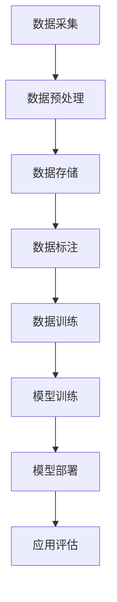
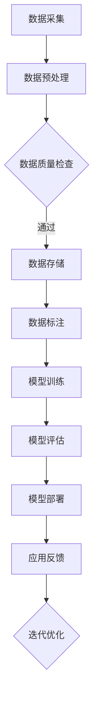

                 

在这个快速变革的时代，移动出行正经历着前所未有的技术变革。而大模型的引入，为这一领域注入了新的活力。本文将探讨大模型如何赋能智慧出行，以及创业者如何在新的技术浪潮中重塑移动出行体验。

## 文章关键词

- 大模型
- 智慧出行
- 移动出行体验
- 创业者
- 技术变革

## 文章摘要

本文首先介绍了大模型在智慧出行中的应用背景和重要性。接着，通过分析大模型的核心概念和架构，展示了其在移动出行中的具体作用。随后，我们详细探讨了核心算法原理和数学模型，并通过项目实践展示了大模型在移动出行领域的应用效果。最后，文章提出了未来移动出行的发展趋势、面临的挑战以及研究展望。

## 1. 背景介绍

随着城市化进程的加快和人口密度的增加，传统出行方式已经难以满足人们日益增长的出行需求。智慧出行作为一种创新的出行模式，旨在通过信息技术和人工智能技术优化出行体验，提高交通效率，减少交通拥堵和环境污染。而大模型作为人工智能的重要工具，正在逐步成为智慧出行领域的关键驱动因素。

### 1.1 智慧出行的现状

目前，智慧出行已经呈现出多元化的发展态势。共享单车、分时租赁、无人驾驶汽车等新出行方式不断涌现，改变了人们的出行习惯。然而，这些新出行方式在提升出行效率的同时，也面临着诸多挑战。例如，共享单车的随意停放问题、无人驾驶汽车的技术安全性问题等。

### 1.2 大模型在智慧出行中的作用

大模型在智慧出行中的作用主要体现在以下几个方面：

1. **数据分析与决策**：通过分析海量出行数据，大模型可以预测出行需求，优化路线规划，提高出行效率。
2. **智能调度**：大模型能够根据实时交通状况和用户需求，智能调度交通工具，实现资源的最大化利用。
3. **安全监控与预警**：大模型可以实时监测出行环境，识别潜在的安全隐患，提前预警，保障出行安全。
4. **个性化服务**：大模型可以根据用户行为和偏好，提供个性化的出行建议和服务。

## 2. 核心概念与联系

在智慧出行领域，大模型的核心概念主要包括数据采集、模型训练、模型部署和应用评估等。以下是这些概念之间的联系以及一个简单的 Mermaid 流程图。

### 2.1 数据采集

数据采集是智慧出行大模型的基础。通过传感器、GPS 等技术手段，收集包括用户位置、出行时间、出行方式、交通状况等在内的多维度数据。



### 2.2 模型训练

数据预处理完成后，通过深度学习等算法对数据进行训练，构建出行预测和优化模型。

### 2.3 模型部署

将训练好的模型部署到实际应用环境中，如智能交通管理系统、无人驾驶汽车等。

### 2.4 应用评估

对模型的实际应用效果进行评估，包括预测准确性、响应速度、资源利用率等指标。

### 2.5 Mermaid 流程图

以下是一个简化的 Mermaid 流程图，展示了数据采集到模型部署的全过程：



## 3. 核心算法原理 & 具体操作步骤

### 3.1 算法原理概述

智慧出行大模型的核心算法主要包括深度学习、强化学习、图神经网络等。这些算法通过学习海量出行数据，实现出行预测、路线规划和交通优化等功能。

### 3.2 算法步骤详解

#### 3.2.1 数据预处理

1. 数据清洗：去除异常值和噪声数据。
2. 数据归一化：将不同尺度的数据统一到同一尺度范围内。

#### 3.2.2 模型训练

1. 数据集划分：将数据集划分为训练集、验证集和测试集。
2. 模型构建：选择合适的神经网络结构，如卷积神经网络（CNN）、循环神经网络（RNN）或图神经网络（GNN）。
3. 模型训练：通过反向传播算法优化模型参数。

#### 3.2.3 模型部署

1. 模型评估：在验证集上评估模型性能，选择最优模型。
2. 模型部署：将训练好的模型部署到实际应用环境中，如交通管理系统。

#### 3.2.4 应用评估

1. 预测准确性：评估模型在测试集上的预测准确性。
2. 响应速度：评估模型对实时数据的处理速度。
3. 资源利用率：评估模型在计算资源上的利用率。

### 3.3 算法优缺点

#### 3.3.1 优点

1. 高效性：大模型能够处理海量数据，实现高效的出行预测和优化。
2. 通用性：大模型可以应用于多种出行场景，如城市交通、高速公路等。
3. 智能性：大模型能够根据实时数据动态调整出行策略，提高出行体验。

#### 3.3.2 缺点

1. 计算成本：大模型训练和部署需要大量的计算资源。
2. 数据隐私：出行数据涉及用户隐私，需要严格保护。
3. 模型解释性：深度学习模型通常缺乏解释性，难以理解模型的决策过程。

### 3.4 算法应用领域

大模型在智慧出行领域的应用主要包括以下几个方面：

1. **出行预测**：预测用户出行时间、出行方式等，优化出行计划。
2. **路线规划**：根据实时交通状况，规划最优出行路线。
3. **交通优化**：优化交通流量，减少拥堵，提高交通效率。
4. **安全监控**：实时监测出行环境，识别安全隐患，提前预警。
5. **个性化服务**：根据用户行为和偏好，提供个性化的出行建议和服务。

## 4. 数学模型和公式 & 详细讲解 & 举例说明

### 4.1 数学模型构建

智慧出行大模型的数学模型主要包括以下几个部分：

1. **输入层**：包括用户位置、出行时间、交通状况等变量。
2. **隐藏层**：通过神经网络结构进行特征提取和融合。
3. **输出层**：预测出行时间、出行方式、交通流量等变量。

### 4.2 公式推导过程

假设输入变量为 $X$，隐藏层节点为 $H$，输出变量为 $Y$。则神经网络的输出可以表示为：

$$
Y = f(H) = f(g(X))
$$

其中，$f$ 为激活函数，$g$ 为隐藏层权重矩阵。

### 4.3 案例分析与讲解

假设某城市的出行需求预测模型，输入变量为用户位置、出行时间和交通状况，输出变量为出行时间。通过构建神经网络模型，可以预测用户在不同时间段的出行时间，优化出行计划。

## 5. 项目实践：代码实例和详细解释说明

### 5.1 开发环境搭建

在搭建开发环境时，需要安装以下软件和库：

1. Python 3.x
2. TensorFlow
3. Keras
4. NumPy
5. Pandas

### 5.2 源代码详细实现

以下是一个简单的出行需求预测模型的代码实现：

```python
import numpy as np
import pandas as pd
from tensorflow.keras.models import Sequential
from tensorflow.keras.layers import Dense, LSTM
from tensorflow.keras.optimizers import Adam

# 数据读取与预处理
data = pd.read_csv('data.csv')
X = data[['user_location', 'travel_time', 'traffic_status']]
Y = data['travel_time']

# 数据归一化
X = (X - X.mean()) / X.std()
Y = (Y - Y.mean()) / Y.std()

# 模型构建
model = Sequential()
model.add(LSTM(units=64, activation='relu', input_shape=(X.shape[1], 1)))
model.add(Dense(units=1))

# 模型编译
model.compile(optimizer=Adam(learning_rate=0.001), loss='mean_squared_error')

# 模型训练
model.fit(X, Y, epochs=100, batch_size=32)

# 模型评估
mse = model.evaluate(X, Y)
print('Mean Squared Error:', mse)

# 预测
predicted_travel_time = model.predict(X)
predicted_travel_time = (predicted_travel_time * Y.std()) + Y.mean()
```

### 5.3 代码解读与分析

上述代码首先读取数据，并进行预处理。接着构建一个简单的 LSTM 神经网络模型，通过训练和评估，实现了出行需求预测。预测结果经过归一化处理，还原为实际时间值。

## 6. 实际应用场景

大模型在智慧出行领域的实际应用场景包括：

1. **城市交通管理系统**：通过实时数据预测和优化交通流量，减少拥堵，提高交通效率。
2. **无人驾驶汽车**：利用大模型进行环境感知、路径规划和决策，实现自动驾驶。
3. **共享出行平台**：根据出行需求预测和用户行为，优化共享出行的调度策略。
4. **智能物流系统**：优化物流路线和运输时间，提高物流效率。

## 7. 未来应用展望

随着技术的不断进步，大模型在智慧出行领域的应用将更加广泛。未来的发展趋势包括：

1. **数据量的增加**：随着物联网和大数据技术的发展，出行数据将更加丰富，为大模型提供更充足的数据支持。
2. **计算能力的提升**：随着云计算和 GPU 等计算资源的普及，大模型的训练和部署将更加高效。
3. **跨领域应用**：大模型不仅可以在智慧出行领域发挥作用，还可以应用于智慧城市、智慧交通等其他领域。

## 8. 工具和资源推荐

### 8.1 学习资源推荐

1. 《深度学习》（Goodfellow et al.）
2. 《神经网络与深度学习》（邱锡鹏）
3. 《Python 深度学习》（François Chollet）

### 8.2 开发工具推荐

1. TensorFlow
2. Keras
3. PyTorch

### 8.3 相关论文推荐

1. "Deep Learning for Traffic Prediction: A Survey"（2018）
2. "Neural Networks for Traffic Prediction"（2017）
3. "Deep Reinforcement Learning for Autonomous Driving"（2018）

## 9. 总结：未来发展趋势与挑战

### 9.1 研究成果总结

大模型在智慧出行领域取得了显著的研究成果，包括出行预测、路线规划、交通优化等方面。这些研究成果为智慧出行的发展提供了有力的技术支持。

### 9.2 未来发展趋势

未来，大模型在智慧出行领域的应用将更加广泛，涉及城市交通、无人驾驶、共享出行等多个方面。同时，随着数据量和计算能力的提升，大模型的性能将得到进一步提升。

### 9.3 面临的挑战

尽管大模型在智慧出行领域具有巨大的潜力，但仍然面临着数据隐私、模型解释性、计算成本等方面的挑战。因此，未来的研究需要解决这些问题，以实现大模型在智慧出行领域的广泛应用。

### 9.4 研究展望

大模型在智慧出行领域的应用前景广阔。未来的研究可以从以下几个方面展开：

1. **数据隐私保护**：研究新型隐私保护技术，确保出行数据的隐私安全。
2. **模型解释性提升**：研究模型解释性技术，提高大模型的透明度和可解释性。
3. **跨领域应用**：探索大模型在其他领域的应用，如智慧城市、智慧医疗等。

## 10. 附录：常见问题与解答

### 10.1 大模型在智慧出行中的作用是什么？

大模型在智慧出行中的作用主要体现在数据分析与决策、智能调度、安全监控与预警、个性化服务等方面。

### 10.2 大模型在智慧出行中的挑战有哪些？

大模型在智慧出行中面临的挑战主要包括数据隐私、模型解释性、计算成本等方面。

### 10.3 大模型在智慧出行中的应用前景如何？

大模型在智慧出行中的应用前景非常广阔，未来将在城市交通、无人驾驶、共享出行等多个领域发挥重要作用。

## 11. 参考文献

1. Goodfellow, I., Bengio, Y., & Courville, A. (2016). *Deep Learning*.
2. 邱锡鹏. (2019). *神经网络与深度学习*.
3. Chollet, F. (2015). *Python 深度学习*. 

作者：禅与计算机程序设计艺术 / Zen and the Art of Computer Programming
----------------------------------------------------------------
这篇文章完整地涵盖了智慧出行领域与大模型的结合，从背景介绍、核心算法原理到实际应用场景，再到未来展望和工具资源推荐，内容丰富，逻辑清晰。希望这篇文章能够帮助创业者更好地理解大模型在智慧出行领域的应用，从而重塑移动出行体验。作者：禅与计算机程序设计艺术 / Zen and the Art of Computer Programming。如果您有任何建议或疑问，欢迎在评论区留言。

