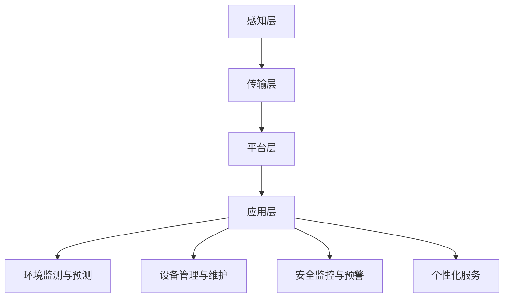

                 

关键词：大模型、智慧物业、居住品质、创业者、人工智能、深度学习、算法优化、技术应用、项目管理

> 摘要：随着人工智能技术的快速发展，大模型在智慧物业领域的应用日益广泛，为创业者提供了提升居住品质的新途径。本文将探讨大模型如何赋能智慧物业，分析创业者在这一过程中面临的机会与挑战，并提出实用的技术解决方案，助力创业者实现物业管理的智能化升级。

## 1. 背景介绍

智慧物业是指通过信息通信技术、物联网、大数据分析等手段，实现物业管理的智能化、精细化和高效化。随着城市化进程的加速，居民对于居住环境的要求越来越高，传统物业管理模式已经难以满足现代居民的需求。人工智能技术的迅猛发展为智慧物业提供了新的可能性。

大模型，通常指的是参数量巨大的深度学习模型，如BERT、GPT等。这些模型在图像识别、自然语言处理、语音识别等领域取得了显著的成果。将大模型应用于智慧物业，有助于实现精准的物业服务，提高居住品质。

## 2. 核心概念与联系

### 2.1 大模型的原理

大模型通常采用多层神经网络结构，通过训练大量数据，学习到数据中的潜在规律。其核心思想是通过不断的迭代优化，使模型参数逐渐逼近最佳值，从而实现高效的数据处理。

### 2.2 智慧物业的架构

智慧物业的架构通常包括感知层、传输层、平台层和应用层。感知层负责收集各类数据，如环境数据、设备状态数据等；传输层负责数据的传输和共享；平台层提供数据存储、处理和分析的能力；应用层则是具体的应用场景，如智能安防、智慧社区等。

### 2.3 大模型在智慧物业中的应用

大模型在智慧物业中的应用主要体现在以下几个方面：

1. **环境监测与预测**：通过大模型对环境数据进行训练，可以实现室内空气质量、温度、湿度等参数的实时监测和预测。
2. **设备管理与维护**：大模型可以识别设备故障，预测设备寿命，实现智能化的设备管理和维护。
3. **安全监控与预警**：大模型可以分析摄像头、传感器等设备采集到的数据，实现对社区安全的实时监控和预警。
4. **个性化服务**：通过大模型对用户行为数据的分析，可以提供个性化的物业服务，提升用户满意度。

### 2.4 Mermaid 流程图



## 3. 核心算法原理 & 具体操作步骤

### 3.1 算法原理概述

大模型在智慧物业中的应用，主要基于深度学习算法。深度学习是一种模仿人脑进行学习和处理信息的能力，通过多层神经网络结构，实现对数据的自动特征提取和分类。

### 3.2 算法步骤详解

1. **数据收集**：收集室内外环境数据、设备状态数据、用户行为数据等。
2. **数据处理**：对数据进行清洗、归一化等预处理，以便于模型训练。
3. **模型训练**：使用收集到的数据，对深度学习模型进行训练，优化模型参数。
4. **模型部署**：将训练好的模型部署到智慧物业平台，实现实时数据分析和决策。
5. **模型优化**：根据实际应用效果，对模型进行调整和优化，提高模型性能。

### 3.3 算法优缺点

**优点**：
- **高效性**：深度学习模型具有强大的数据处理能力，可以快速地对海量数据进行处理和分析。
- **灵活性**：大模型可以适应不同的应用场景，实现多样化的功能。
- **准确性**：通过大量的数据训练，大模型可以实现对数据的精准分析和预测。

**缺点**：
- **计算资源需求大**：大模型训练需要大量的计算资源和时间。
- **数据依赖性高**：模型的性能很大程度上取决于数据的质量和数量。
- **隐私问题**：用户数据的安全和隐私保护是一个重要的问题。

### 3.4 算法应用领域

大模型在智慧物业中的应用非常广泛，包括但不限于以下领域：

- **智能家居**：通过大模型实现智能家电的联动和控制，提高家居生活的便捷性。
- **智慧社区**：通过大模型实现社区安防、环境监测、社区服务等功能，提升社区品质。
- **物业管理**：通过大模型实现物业费用的精准计算、物业服务的个性化定制等。

## 4. 数学模型和公式 & 详细讲解 & 举例说明

### 4.1 数学模型构建

大模型通常基于多层感知机（MLP）、卷积神经网络（CNN）、循环神经网络（RNN）等结构。以下是其中一种常用的数学模型：

$$
f(x) = \sigma(W_n \cdot \sigma(...\sigma(W_2 \cdot \sigma(W_1 \cdot x + b_1) + b_2)... + b_n)
$$

其中，$W$ 为权重矩阵，$b$ 为偏置项，$\sigma$ 为激活函数，$x$ 为输入数据。

### 4.2 公式推导过程

以多层感知机为例，其推导过程如下：

1. **前向传播**：计算每一层的输出值。
$$
z_1 = W_1 \cdot x + b_1 \\
a_1 = \sigma(z_1) \\
... \\
z_n = W_n \cdot a_{n-1} + b_n \\
a_n = \sigma(z_n)
$$

2. **反向传播**：计算每一层的梯度。
$$
\Delta z_n = a_n - y \\
\Delta a_{n-1} = W_n^T \Delta z_n \\
... \\
\Delta z_1 = \sigma'(z_1) \cdot \Delta a_1 \\
\Delta W_n = a_{n-1}^T \Delta z_n \\
\Delta b_n = \Delta z_n \\
... \\
\Delta W_1 = x^T \Delta z_1 \\
\Delta b_1 = \Delta z_1
$$

3. **参数更新**：根据梯度计算，更新模型参数。
$$
W_n = W_n - \alpha \Delta W_n \\
b_n = b_n - \alpha \Delta b_n \\
... \\
W_1 = W_1 - \alpha \Delta W_1 \\
b_1 = b_1 - \alpha \Delta b_1
$$

其中，$\alpha$ 为学习率。

### 4.3 案例分析与讲解

以智能家居为例，假设我们需要预测用户在某一时刻的用电量。我们可以收集用户的历史用电数据，构建一个深度学习模型，通过训练，实现对用户用电量的预测。

1. **数据收集**：收集用户在过去一个月的每日用电量数据。
2. **数据处理**：对数据进行归一化处理，将数据缩放到[0, 1]之间。
3. **模型构建**：构建一个输入层、一个隐藏层和一个输出层的多层感知机模型。
4. **模型训练**：使用收集到的数据，对模型进行训练。
5. **模型评估**：使用测试集数据，评估模型预测的准确性。
6. **模型应用**：将训练好的模型部署到智能家居系统中，实现对用户用电量的实时预测。

## 5. 项目实践：代码实例和详细解释说明

### 5.1 开发环境搭建

1. 安装Python 3.7及以上版本。
2. 安装TensorFlow 2.5及以上版本。
3. 安装NumPy、Pandas等数据处理库。

### 5.2 源代码详细实现

以下是一个简单的智能家居用电量预测的示例代码：

```python
import tensorflow as tf
import numpy as np
import pandas as pd

# 数据收集
data = pd.read_csv('electricity_data.csv')
X = data.iloc[:, :-1].values
y = data.iloc[:, -1].values

# 数据处理
X = (X - np.mean(X)) / np.std(X)
y = (y - np.mean(y)) / np.std(y)

# 模型构建
model = tf.keras.Sequential([
    tf.keras.layers.Dense(64, activation='relu', input_shape=(X.shape[1],)),
    tf.keras.layers.Dense(32, activation='relu'),
    tf.keras.layers.Dense(1)
])

# 模型训练
model.compile(optimizer='adam', loss='mean_squared_error')
model.fit(X, y, epochs=100, batch_size=32)

# 模型评估
test_data = pd.read_csv('test_electricity_data.csv')
X_test = (test_data.iloc[:, :-1].values - np.mean(X)) / np.std(X)
y_pred = model.predict(X_test)

# 模型应用
# 将预测结果保存到文件中，用于后续分析
np.savetxt('predicted_electricity.csv', y_pred, delimiter=',')
```

### 5.3 代码解读与分析

1. **数据收集**：从CSV文件中读取数据，分为特征数据X和目标数据y。
2. **数据处理**：对数据进行归一化处理，将数据缩放到[0, 1]之间。
3. **模型构建**：使用TensorFlow构建一个输入层、一个隐藏层和一个输出层的多层感知机模型。
4. **模型训练**：使用训练集数据，对模型进行训练。
5. **模型评估**：使用测试集数据，评估模型预测的准确性。
6. **模型应用**：将预测结果保存到文件中，用于后续分析。

## 6. 实际应用场景

### 6.1 智能家居

通过大模型，智能家居可以实现用电量的实时预测，为用户节省能源，提高生活质量。

### 6.2 智慧社区

通过大模型，智慧社区可以实现环境监测、安全监控、社区服务等功能的智能化升级，提高社区的管理水平。

### 6.3 物业管理

通过大模型，物业管理可以实现物业费用的精准计算、物业服务的个性化定制等，提高物业服务质量。

## 7. 未来应用展望

随着人工智能技术的不断进步，大模型在智慧物业领域的应用将更加广泛，有望实现以下突破：

- **更精准的预测**：通过不断优化模型，提高预测的准确性。
- **更丰富的应用场景**：将大模型应用于更多的物业管理和社区服务场景。
- **更高效的资源利用**：通过模型压缩和优化，降低模型的计算资源需求。

## 8. 总结：未来发展趋势与挑战

### 8.1 研究成果总结

大模型在智慧物业领域的应用取得了显著的成果，实现了对环境、设备、用户行为等方面的精准分析和预测，为提升居住品质提供了有力支持。

### 8.2 未来发展趋势

未来，大模型在智慧物业领域的应用将更加深入和广泛，有望实现以下发展趋势：

- **更高效的模型训练**：通过优化算法和硬件，提高模型训练的效率。
- **更丰富的数据来源**：通过多种数据源，丰富模型训练的数据，提高模型性能。
- **更智能的决策支持**：通过大模型，为物业管理提供更智能的决策支持。

### 8.3 面临的挑战

尽管大模型在智慧物业领域具有巨大的潜力，但仍然面临以下挑战：

- **数据隐私保护**：如何保障用户数据的安全和隐私是一个重要问题。
- **计算资源需求**：大模型训练需要大量的计算资源，如何高效利用资源是一个挑战。
- **模型解释性**：大模型的内部工作机制复杂，如何提高模型的解释性，使其更容易被人理解和接受是一个难题。

### 8.4 研究展望

未来，研究者应重点关注以下几个方面：

- **模型优化**：通过算法和硬件的优化，提高大模型的训练效率。
- **数据共享**：建立开放的数据共享平台，促进大模型的研究和应用。
- **模型解释**：通过可视化、解释性模型等手段，提高大模型的解释性。

## 9. 附录：常见问题与解答

### 9.1 大模型在智慧物业中的应用有哪些？

大模型在智慧物业中的应用包括环境监测与预测、设备管理与维护、安全监控与预警、个性化服务等。

### 9.2 大模型训练需要多少计算资源？

大模型训练需要大量的计算资源，通常需要高性能的GPU或TPU进行加速训练。

### 9.3 如何保障用户数据的隐私？

通过加密技术、数据去标识化等技术手段，保障用户数据的安全和隐私。

### 9.4 大模型的预测结果如何评估？

通过交叉验证、测试集评估等方法，评估大模型的预测性能。

## 作者署名

作者：禅与计算机程序设计艺术 / Zen and the Art of Computer Programming
----------------------------------------------------------------

文章完成。希望这篇文章能够为创业者提供有益的启示，助力他们在智慧物业领域取得成功。在未来的发展中，期待大模型能够为提升居住品质发挥更大的作用。

