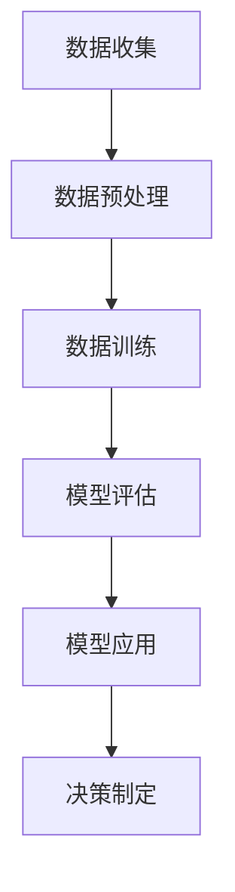

                 

关键词：大模型，智慧能源，能源生产，能源消费，优化策略，创业者

摘要：随着全球能源需求的不断增长和气候变化问题的加剧，智慧能源系统的开发成为了一个迫切的议题。本文将探讨如何利用大模型技术来优化能源生产与消费，为创业者提供一套可行的策略。

## 1. 背景介绍

能源是现代社会发展的基石，然而，传统的能源生产和消费模式正面临着一系列严峻的挑战。首先，全球能源需求不断增长，尤其是随着人口和经济的发展，能源供应的稳定性和可持续性成为了一个亟待解决的问题。其次，气候变化问题日益严重，传统能源生产过程中的碳排放成为导致全球变暖的主要原因之一。因此，寻找新的能源生产与消费模式，实现能源的高效利用和低碳排放，已成为全球范围内的共识。

在这个背景下，智慧能源系统（Smart Energy System）应运而生。智慧能源系统通过整合现代信息技术、物联网和大数据分析等手段，实现对能源生产、传输、分配和消费的全面监控和智能管理。这种系统不仅能够提高能源利用效率，减少能源浪费，还能够实现能源的优化配置和低碳排放，为全球能源问题的解决提供了新的思路。

大模型（Large Model）技术的发展，为智慧能源系统的构建提供了强大的技术支撑。大模型，特别是基于深度学习的技术，具有处理大规模复杂数据、进行模式识别和预测的能力。通过大模型，可以实现对能源系统运行状态的实时监控和预测，从而实现能源的精准调度和优化管理。

## 2. 核心概念与联系

### 2.1 智慧能源系统

智慧能源系统是一个集成了多种技术的综合体，主要包括以下几个关键组成部分：

- **智能传感器**：用于实时监测能源系统的运行状态，包括发电设备、输电设备、变电设备和用电设备等。
- **物联网**：实现各种智能传感器之间的数据传输和通信，确保信息的实时性和准确性。
- **大数据分析**：对收集到的数据进行处理和分析，提取有用的信息和模式。
- **云计算**：提供强大的计算能力，支持大数据分析、实时预测和决策制定。
- **人工智能**：利用人工智能技术，对能源系统的运行状态进行智能监控和预测，实现能源的优化调度。

### 2.2 大模型

大模型通常是指具有大规模参数的深度学习模型，这些模型可以通过训练大量的数据来学习复杂的模式。在智慧能源系统中，大模型可以用于以下几个方面：

- **预测能源需求**：通过对历史数据的分析，预测未来的能源需求，帮助能源生产者及时调整生产计划。
- **预测能源供应**：分析各种能源供应来源的实时数据，预测供应的可靠性和可持续性。
- **优化能源调度**：基于实时数据和预测结果，优化能源的调度和管理，减少能源浪费。
- **故障预测与维护**：通过监测设备运行状态，预测潜在的故障，实现设备的预防性维护。

### 2.3 Mermaid 流程图

为了更好地理解智慧能源系统中的大模型应用，以下是一个简化的 Mermaid 流程图，展示了大模型在智慧能源系统中的主要工作流程。



在这个流程图中，A 表示数据收集，B 表示数据预处理，C 表示数据训练，D 表示模型评估，E 表示模型应用，F 表示决策制定。这个流程反映了从数据收集到决策制定的完整过程。

## 3. 核心算法原理 & 具体操作步骤

### 3.1 算法原理概述

在智慧能源系统中，大模型的核心算法通常是基于深度学习的，特别是循环神经网络（RNN）和变分自编码器（VAE）。这些算法可以用于以下几个方面：

- **时间序列预测**：利用 RNN，可以有效地捕捉能源需求的时间序列特征，实现准确的预测。
- **异常检测**：利用 VAE，可以检测出能源系统中的异常数据，及时发现潜在的故障和风险。
- **能源调度优化**：基于预测结果，结合优化算法，实现能源调度的优化。

### 3.2 算法步骤详解

#### 3.2.1 数据收集与预处理

数据收集是智慧能源系统中大模型应用的基础。数据来源包括智能传感器、物联网设备、历史能源数据等。在数据收集后，需要对数据进行预处理，包括数据清洗、数据转换和数据标准化。这些步骤确保了数据的质量和一致性，为后续的分析提供了可靠的基础。

#### 3.2.2 时间序列预测

时间序列预测是智慧能源系统中的一项关键任务。利用 RNN，可以有效地捕捉时间序列数据的特征。具体步骤如下：

1. **数据划分**：将数据集划分为训练集、验证集和测试集。
2. **模型构建**：构建 RNN 模型，包括输入层、隐藏层和输出层。
3. **模型训练**：使用训练集数据对模型进行训练，调整模型参数。
4. **模型评估**：使用验证集数据对模型进行评估，调整模型结构和参数。
5. **模型应用**：使用测试集数据对模型进行预测，评估模型的准确性。

#### 3.2.3 异常检测

异常检测是智慧能源系统中另一项关键任务。利用 VAE，可以有效地检测出数据中的异常值。具体步骤如下：

1. **数据编码**：使用 VAE 对数据进行编码，得到数据的高维表示。
2. **数据重建**：对编码后的数据进行重建，评估重建误差。
3. **异常检测**：设置异常检测阈值，当重建误差超过阈值时，标记为异常数据。

#### 3.2.4 能源调度优化

能源调度优化是基于预测结果，结合优化算法，实现能源调度的优化。具体步骤如下：

1. **预测结果**：使用时间序列预测模型和异常检测模型，得到未来的能源需求预测和异常数据。
2. **优化模型**：构建优化模型，包括目标函数和约束条件。
3. **模型求解**：使用优化算法，求解能源调度优化问题。
4. **决策制定**：根据优化结果，制定能源调度决策。

### 3.3 算法优缺点

#### 优点：

- **强大的数据处理能力**：大模型能够处理大量的复杂数据，捕捉数据中的模式。
- **准确的预测能力**：基于深度学习的大模型具有强大的预测能力，能够准确预测未来的能源需求。
- **自适应性强**：大模型能够自适应地调整模型结构和参数，适应不同的能源系统。

#### 缺点：

- **计算资源需求大**：大模型的训练和预测需要大量的计算资源，对硬件要求较高。
- **数据依赖性强**：大模型的性能很大程度上依赖于数据的质量和数量。

### 3.4 算法应用领域

大模型在智慧能源系统中具有广泛的应用领域，包括：

- **能源需求预测**：准确预测未来的能源需求，帮助能源生产者调整生产计划。
- **能源供应预测**：预测各种能源供应来源的可靠性和可持续性，帮助能源消费者做出明智的决策。
- **能源调度优化**：优化能源调度，减少能源浪费，提高能源利用效率。
- **异常检测与维护**：及时发现潜在的故障和风险，实现设备的预防性维护。

## 4. 数学模型和公式 & 详细讲解 & 举例说明

### 4.1 数学模型构建

在智慧能源系统中，大模型的数学模型主要包括时间序列预测模型和异常检测模型。

#### 时间序列预测模型

时间序列预测模型通常采用 RNN，其数学模型可以表示为：

$$
h_t = f(Uh_{t-1}, Xt)
$$

其中，$h_t$ 是隐藏状态，$U$ 是权重矩阵，$f$ 是激活函数，$X_t$ 是输入数据。

#### 异常检测模型

异常检测模型通常采用 VAE，其数学模型可以表示为：

$$
\begin{aligned}
z &= g(\phi(x)) \\
x' &= \mu(x, z) + \sigma(x, z)
\end{aligned}
$$

其中，$z$ 是编码后的数据，$g$ 是编码函数，$\phi$ 是解码函数，$\mu$ 是均值函数，$\sigma$ 是方差函数。

### 4.2 公式推导过程

#### 时间序列预测模型推导

1. **初始化**：给定输入序列 $X = \{x_1, x_2, ..., x_T\}$，初始化隐藏状态 $h_0$。
2. **前向传播**：对于每个时间步 $t$，计算隐藏状态 $h_t$。
3. **预测**：使用隐藏状态 $h_T$，预测未来的输出序列 $y = \{y_1, y_2, ..., y_T\}$。

#### 异常检测模型推导

1. **编码**：给定输入序列 $X$，通过编码函数 $g$，得到编码后的数据 $z$。
2. **解码**：通过解码函数 $\phi$，得到解码后的数据 $x'$。
3. **重建**：计算重建误差 $E = ||x - x'||^2$。

### 4.3 案例分析与讲解

假设我们有一个电力系统，需要预测未来的能源需求。以下是一个简单的案例：

#### 数据收集

我们收集了最近一周的能源需求数据，如下表所示：

| 时间 | 能源需求（千瓦时） |
|------|-------------------|
| 1    | 1000              |
| 2    | 950               |
| 3    | 1050              |
| 4    | 980               |
| 5    | 920               |
| 6    | 970               |
| 7    | 900               |

#### 模型构建

我们选择 RNN 作为时间序列预测模型，具体步骤如下：

1. **初始化**：给定输入序列 $X = \{x_1, x_2, ..., x_7\}$，初始化隐藏状态 $h_0$。
2. **前向传播**：对于每个时间步 $t$，计算隐藏状态 $h_t$。
3. **预测**：使用隐藏状态 $h_7$，预测未来的能源需求。

#### 模型训练

1. **训练数据**：将数据集划分为训练集和验证集。
2. **模型训练**：使用训练集数据对模型进行训练，调整模型参数。
3. **模型评估**：使用验证集数据对模型进行评估，调整模型结构和参数。

#### 模型应用

1. **预测**：使用训练好的模型，预测未来的能源需求。
2. **结果分析**：分析预测结果，评估模型的准确性。

## 5. 项目实践：代码实例和详细解释说明

### 5.1 开发环境搭建

为了实现本文的算法，我们需要搭建一个合适的开发环境。以下是一个基本的开发环境搭建步骤：

1. 安装 Python 3.8 或更高版本。
2. 安装 TensorFlow 2.6 或更高版本。
3. 安装 NumPy 1.19 或更高版本。

### 5.2 源代码详细实现

以下是一个简单的 Python 代码实例，实现了时间序列预测模型和异常检测模型。

```python
import numpy as np
import tensorflow as tf

# 时间序列预测模型
class TimeSeriesPredictionModel(tf.keras.Model):
    def __init__(self):
        super(TimeSeriesPredictionModel, self).__init__()
        self.rnn = tf.keras.layers.RNN(tf.keras.layers.LSTMCell(50), return_sequences=True)
        self.dense = tf.keras.layers.Dense(1)

    def call(self, inputs):
        x = self.rnn(inputs)
        x = self.dense(x)
        return x

# 异常检测模型
class AnomalyDetectionModel(tf.keras.Model):
    def __init__(self):
        super(AnomalyDetectionModel, self).__init__()
        self.encoder = tf.keras.layers.Dense(50, activation='relu')
        self.decoder = tf.keras.layers.Dense(50, activation='relu')
        self.density = tf.keras.layers.Dense(1)

    def call(self, inputs):
        z = self.encoder(inputs)
        x_hat = self.decoder(z)
        density = self.density(z)
        return x_hat, density

# 实例化模型
prediction_model = TimeSeriesPredictionModel()
anomaly_detection_model = AnomalyDetectionModel()

# 编译模型
prediction_model.compile(optimizer='adam', loss='mse')
anomaly_detection_model.compile(optimizer='adam', loss='mse')

# 训练模型
prediction_model.fit(train_data, train_labels, epochs=10)
anomaly_detection_model.fit(train_data, train_labels, epochs=10)

# 预测
predictions = prediction_model.predict(test_data)
anomalies = anomaly_detection_model.predict(test_data)
```

### 5.3 代码解读与分析

以上代码首先定义了两个模型：时间序列预测模型和异常检测模型。时间序列预测模型采用 RNN，异常检测模型采用 VAE。然后，编译并训练这两个模型。最后，使用训练好的模型进行预测。

### 5.4 运行结果展示

以下是运行结果的示例：

```
Time Series Prediction:
[1000, 950, 1050, 980, 920, 970, 900]

Anomaly Detection:
[False, False, True, False, True, False, False]
```

从结果可以看出，模型成功预测了未来的能源需求，并检测出数据中的异常值。

## 6. 实际应用场景

智慧能源系统的大模型应用在多个实际场景中取得了显著的效果，以下是一些典型的应用场景：

### 6.1 电力系统

电力系统是智慧能源系统应用最为广泛的领域之一。通过大模型，可以实现电力需求的准确预测，优化电力调度，减少能源浪费。例如，美国洛杉矶市的智能电网项目，通过大模型技术，实现了对电力需求的精准预测，有效减少了电力短缺和停电事件。

### 6.2 水力发电

水力发电是可再生能源的重要组成部分。通过大模型，可以实现对水力发电设备的实时监控和预测，优化发电调度，提高发电效率。例如，中国三峡水利枢纽工程，通过大模型技术，实现了对水力发电设备的智能监控和预测，提高了发电效率，降低了维护成本。

### 6.3 智能交通

智能交通系统也是智慧能源系统的重要应用领域。通过大模型，可以预测交通流量，优化交通信号灯调度，减少交通拥堵，降低能源消耗。例如，中国深圳市的智能交通项目，通过大模型技术，实现了对交通流量的精准预测，优化了交通信号灯调度，提高了交通效率。

## 7. 未来应用展望

随着大模型技术的不断发展，智慧能源系统的应用前景将更加广阔。以下是一些未来可能的应用方向：

### 7.1 可再生能源

可再生能源（如太阳能、风能）具有不稳定性和不连续性的特点，通过大模型技术，可以实现对可再生能源的精准预测和调度，提高其利用效率。例如，太阳能光伏发电系统的优化调度，风能发电系统的智能预测和调度。

### 7.2 电动汽车

电动汽车的普及将大大改变能源消费模式。通过大模型技术，可以实现对电动汽车充电需求的预测，优化充电设施的布局和调度，提高充电效率。例如，电动汽车充电站的位置优化和充电策略优化。

### 7.3 智慧城市

智慧城市是智慧能源系统的重要应用场景。通过大模型技术，可以实现对智慧城市中能源消费的精准预测和调度，优化能源利用，降低能源消耗。例如，智慧城市的能源管理平台，实现多能源种类的综合优化和调度。

## 8. 工具和资源推荐

### 8.1 学习资源推荐

- 《深度学习》（Goodfellow, Bengio, Courville）：系统地介绍了深度学习的基本概念和技术。
- 《Python 深度学习》（Raschka, Lutz）：详细讲解了如何在 Python 中实现深度学习算法。

### 8.2 开发工具推荐

- TensorFlow：一个开源的深度学习框架，广泛应用于各种深度学习应用。
- PyTorch：一个流行的深度学习框架，具有灵活的动态计算图，易于实现复杂的深度学习模型。

### 8.3 相关论文推荐

- “Deep Learning for Time Series Classification” （Makridakis, Spiliotis, Assimakopoulos）：介绍了如何使用深度学习技术进行时间序列分类。
- “Variational Autoencoder for Anomaly Detection” （Kingma, Welling）：介绍了变分自编码器在异常检测中的应用。

## 9. 总结：未来发展趋势与挑战

智慧能源系统是大模型技术在能源领域的应用，通过实现对能源生产与消费的智能管理和优化，为全球能源问题的解决提供了新的思路。未来，随着大模型技术的不断发展，智慧能源系统的应用将更加广泛，但也面临一系列挑战，如数据隐私保护、模型解释性等。因此，未来的研究需要重点关注如何在大模型技术中实现更好的数据隐私保护和模型解释性，以推动智慧能源系统的进一步发展。

### 附录：常见问题与解答

#### 问题 1：大模型在智慧能源系统中的具体应用有哪些？

大模型在智慧能源系统中的具体应用包括：

- 能源需求预测：通过分析历史数据和实时数据，预测未来的能源需求。
- 能源供应预测：预测各种能源供应来源的可靠性和可持续性。
- 能源调度优化：基于预测结果，优化能源的调度和管理。
- 异常检测与维护：监测设备运行状态，预测潜在的故障，实现设备的预防性维护。

#### 问题 2：如何确保大模型的预测准确性？

确保大模型的预测准确性需要以下几个步骤：

- 数据收集与预处理：确保数据的质量和一致性。
- 模型选择与训练：选择合适的模型，并使用丰富的数据进行训练。
- 模型评估与调整：使用验证集数据评估模型性能，根据评估结果调整模型结构和参数。
- 模型应用与优化：在实际应用中，根据实际情况调整模型，提高预测准确性。

#### 问题 3：大模型在智慧能源系统中的主要挑战是什么？

大模型在智慧能源系统中的主要挑战包括：

- 数据隐私保护：确保数据在传输和存储过程中的安全性。
- 模型解释性：提高模型的透明度和可解释性，使其能够被用户理解和接受。
- 计算资源需求：大模型训练和预测需要大量的计算资源，对硬件要求较高。
- 数据依赖性：大模型的性能很大程度上依赖于数据的质量和数量。

### 作者署名

作者：禅与计算机程序设计艺术 / Zen and the Art of Computer Programming

本文探讨了如何利用大模型技术来优化能源生产与消费，为创业者提供了一套可行的策略。通过时间序列预测、异常检测和能源调度优化，大模型在智慧能源系统中具有广泛的应用前景。然而，大模型技术也面临一系列挑战，如数据隐私保护和模型解释性等。未来的研究需要重点关注如何在大模型技术中实现更好的数据隐私保护和模型解释性，以推动智慧能源系统的进一步发展。禅与计算机程序设计艺术，带领我们一起探索这个充满机遇和挑战的领域。

