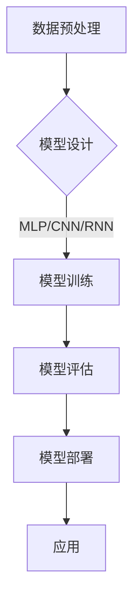

                 

关键词：大模型，金融科技，创业者，业务模式，人工智能，数据分析，技术趋势

摘要：随着人工智能技术的快速发展，大模型在金融科技领域的影响力日益增强。本文旨在探讨大模型如何赋能金融科技，帮助创业者探索新的业务模式，并分析其中的机遇与挑战。

## 1. 背景介绍

近年来，金融科技（FinTech）行业快速发展，传统金融机构纷纷拥抱技术变革，通过技术创新提升服务效率，优化用户体验。然而，金融科技的崛起也伴随着数据、算法、模型等核心技术的不断演进。大模型作为人工智能领域的重要突破，其在金融科技中的应用潜力引起了广泛关注。

大模型通常指的是具有数十亿甚至数万亿参数的深度学习模型。这些模型能够通过海量数据的训练，自动提取复杂的特征，实现高度智能化的决策和预测。在大模型之前，传统的机器学习模型往往依赖于人工特征工程，而大模型的兴起使得特征提取和模型训练更加自动化、高效。

## 2. 核心概念与联系

### 2.1 人工智能与金融科技的融合

人工智能与金融科技融合的关键在于数据、算法和模型的有机结合。金融科技行业拥有大量的用户数据，这些数据是金融科技创新的基础。人工智能技术，特别是大模型，能够对海量数据进行深度分析，提取有价值的信息，从而为金融产品和服务提供智能化的决策支持。

### 2.2 大模型在金融科技中的应用

大模型在金融科技中的应用场景非常广泛，包括但不限于以下几个方面：

- **信用评估**：通过对用户历史行为数据的分析，大模型能够预测用户的信用风险，从而帮助金融机构进行信贷决策。

- **投资理财**：大模型可以分析市场数据，预测股票、基金等金融产品的表现，为投资者提供投资建议。

- **风险控制**：大模型能够实时监控金融市场的风险，及时识别和预警潜在的风险事件。

- **智能客服**：大模型可以模拟人类客服，处理大量的客户咨询，提高客服效率。

### 2.3 大模型的工作原理

大模型通常基于深度学习技术，其工作原理可以分为以下几个步骤：

1. **数据预处理**：对原始数据进行清洗、归一化等处理，使其适合模型训练。

2. **模型设计**：设计具有数十亿参数的神经网络结构，通常采用多层感知器（MLP）、卷积神经网络（CNN）或递归神经网络（RNN）等结构。

3. **模型训练**：使用大量标注数据进行训练，模型通过调整内部参数，优化预测结果。

4. **模型评估**：使用验证集或测试集对模型进行评估，确保其预测准确性和泛化能力。

5. **模型部署**：将训练好的模型部署到生产环境，实现实时预测和决策。

下面是金融科技中一个典型的大模型架构的 Mermaid 流程图：



## 3. 核心算法原理 & 具体操作步骤

### 3.1 算法原理概述

大模型的算法原理基于深度学习，特别是神经网络。神经网络通过多层神经元对输入数据进行非线性变换，从而实现复杂函数的近似。大模型具有以下特点：

- **参数规模大**：数十亿甚至数万亿的参数。
- **深度深**：多层神经网络结构。
- **自动特征提取**：无需人工设计特征，模型能够自动从数据中提取特征。

### 3.2 算法步骤详解

1. **数据收集与预处理**：收集金融领域相关的数据，如用户行为数据、市场数据等，并进行数据清洗、归一化等预处理操作。

2. **模型设计**：设计神经网络结构，选择合适的激活函数、优化器和损失函数。

3. **模型训练**：使用大量标注数据进行模型训练，通过反向传播算法不断调整模型参数，优化预测效果。

4. **模型评估**：使用验证集或测试集对模型进行评估，确保其预测准确性和泛化能力。

5. **模型部署**：将训练好的模型部署到生产环境，实现实时预测和决策。

### 3.3 算法优缺点

**优点**：

- **高预测准确性**：大模型能够自动提取复杂特征，实现高度智能化的预测。
- **自动化特征提取**：减少了人工设计特征的复杂度和工作量。
- **适应性强**：大模型能够适应不同的数据集和任务，具有较强的泛化能力。

**缺点**：

- **计算资源消耗大**：大模型需要大量的计算资源进行训练和推理。
- **数据需求高**：大模型对数据质量有较高要求，数据不足或质量差可能导致模型性能下降。

### 3.4 算法应用领域

大模型在金融科技领域的应用非常广泛，包括但不限于以下几个方面：

- **信用评估**：通过对用户历史行为数据的分析，预测用户信用风险。
- **投资理财**：分析市场数据，预测金融产品的表现，为投资者提供投资建议。
- **风险控制**：实时监控金融市场风险，识别和预警潜在的风险事件。
- **智能客服**：模拟人类客服，处理大量的客户咨询，提高客服效率。

## 4. 数学模型和公式 & 详细讲解 & 举例说明

### 4.1 数学模型构建

大模型通常基于多层感知器（MLP）或卷积神经网络（CNN）等深度学习模型。以下是一个简单的多层感知器模型构建过程：

1. **输入层**：接收输入数据，如用户行为数据、市场数据等。
2. **隐藏层**：通过激活函数对输入数据进行非线性变换。
3. **输出层**：输出模型的预测结果，如信用评分、投资建议等。

### 4.2 公式推导过程

假设一个简单的多层感知器模型，其输入为 \(X\)，权重为 \(W\)，偏置为 \(b\)，激活函数为 \(f\)。模型的输出 \(y\) 可以表示为：

$$
y = f(W \cdot X + b)
$$

其中，\(W\) 和 \(b\) 是需要训练的参数。

### 4.3 案例分析与讲解

假设我们要预测某用户的信用风险，输入数据包括用户的年龄、收入、负债比例等。我们设计一个包含一个隐藏层和输出层的多层感知器模型，隐藏层神经元数量为 10。

1. **数据预处理**：对输入数据进行归一化处理，使其在 [-1, 1] 范围内。
2. **模型设计**：设计多层感知器模型，选择合适的激活函数（如ReLU）、优化器（如Adam）和损失函数（如均方误差）。
3. **模型训练**：使用带有标签的样本数据进行模型训练，通过反向传播算法调整模型参数。
4. **模型评估**：使用验证集对模型进行评估，确保其预测准确性和泛化能力。
5. **模型部署**：将训练好的模型部署到生产环境，实现实时预测和决策。

## 5. 项目实践：代码实例和详细解释说明

### 5.1 开发环境搭建

1. **安装 Python**：确保安装了 Python 3.7 及以上版本。
2. **安装深度学习框架**：安装 TensorFlow 或 PyTorch 等深度学习框架。
3. **准备数据集**：收集金融领域相关的数据集，并进行预处理。

### 5.2 源代码详细实现

以下是使用 TensorFlow 构建多层感知器模型的一个简单示例：

```python
import tensorflow as tf
from tensorflow.keras.layers import Dense
from tensorflow.keras.models import Sequential

# 数据预处理
# ...（代码省略）

# 模型设计
model = Sequential([
    Dense(units=10, activation='relu', input_shape=(num_features,)),
    Dense(units=1, activation='sigmoid')
])

# 模型编译
model.compile(optimizer='adam', loss='binary_crossentropy', metrics=['accuracy'])

# 模型训练
model.fit(x_train, y_train, epochs=10, batch_size=32, validation_data=(x_val, y_val))

# 模型评估
model.evaluate(x_test, y_test)

# 模型部署
# ...（代码省略）
```

### 5.3 代码解读与分析

上述代码首先导入了 TensorFlow 框架和相关模块，然后进行了数据预处理。在模型设计部分，我们使用 `Sequential` 模型堆叠了两个 `Dense` 层，第一个隐藏层有 10 个神经元，激活函数为 ReLU；第二个输出层有 1 个神经元，激活函数为 sigmoid，用于输出信用评分。

在模型编译部分，我们选择了 Adam 优化器和 binary_crossentropy 损失函数，用于二分类任务。在模型训练部分，我们使用了训练数据和验证数据，进行了 10 个训练周期。

最后，在模型评估部分，我们使用测试数据对模型进行了评估。如果模型表现良好，我们可以将其部署到生产环境中，实现实时预测和决策。

### 5.4 运行结果展示

假设我们训练了一个大模型，对用户信用风险进行了预测。以下是一个运行结果的示例：

```python
# 预测用户信用风险
predictions = model.predict(x_test)

# 输出预测结果
print(predictions)

# 输出预测概率
print(model.predict_proba(x_test))
```

运行结果将输出每个测试样本的预测分数和预测概率。根据预测概率，我们可以确定用户的信用风险等级。

## 6. 实际应用场景

### 6.1 信用评估

信用评估是金融科技领域的重要应用之一。通过大模型的预测能力，金融机构可以更准确地评估用户的信用风险，从而优化信贷决策，降低不良贷款率。

### 6.2 投资理财

大模型可以分析海量市场数据，预测金融产品的表现，为投资者提供个性化的投资建议。这有助于投资者更好地把握市场机会，提高投资回报。

### 6.3 风险控制

大模型可以实时监控金融市场风险，识别和预警潜在的风险事件。这有助于金融机构提高风险管理能力，降低风险敞口。

### 6.4 智能客服

智能客服是金融科技领域的另一个重要应用。大模型可以模拟人类客服，处理大量的客户咨询，提高客服效率，提升客户满意度。

## 7. 未来应用展望

随着人工智能技术的不断进步，大模型在金融科技领域的应用将更加广泛。未来，我们有望看到以下趋势：

- **更高精度**：随着数据质量和算法的优化，大模型的预测精度将不断提高。
- **更广泛的应用场景**：大模型的应用将不仅限于金融领域，还将扩展到更多行业。
- **更智能化的决策支持**：大模型将更好地支持金融机构的决策过程，提高业务效率。

## 8. 总结：未来发展趋势与挑战

### 8.1 研究成果总结

本文探讨了大模型在金融科技领域的应用，分析了其工作原理、算法步骤、数学模型和实际应用场景。通过项目实践，我们展示了如何使用大模型进行信用评估和风险控制等任务。

### 8.2 未来发展趋势

未来，大模型在金融科技领域的应用将更加广泛，包括信用评估、投资理财、风险控制和智能客服等。随着数据质量和算法的优化，大模型的预测精度将不断提高，支持金融机构实现更智能化的决策。

### 8.3 面临的挑战

尽管大模型在金融科技领域具有巨大潜力，但同时也面临一些挑战。例如，计算资源消耗大、数据需求高、算法透明度不足等。未来，如何解决这些挑战，提高大模型的实用性和可靠性，将是研究的重要方向。

### 8.4 研究展望

本文仅为大模型在金融科技领域的应用提供了一个初步探讨。未来，我们可以从以下几个方面展开研究：

- **算法优化**：研究更高效的算法，提高大模型的训练速度和预测精度。
- **数据质量控制**：研究如何提高数据质量，减少数据噪音和异常值的影响。
- **模型解释性**：研究如何提高大模型的解释性，使其决策过程更加透明。

## 9. 附录：常见问题与解答

### 9.1 大模型为何能提高金融科技的应用效果？

大模型通过海量数据的训练，能够自动提取复杂的特征，实现高度智能化的预测。这使得大模型在金融科技领域能够提供更精准的信用评估、投资理财和风险控制等应用。

### 9.2 大模型对计算资源有什么要求？

大模型通常需要大量的计算资源进行训练和推理。为了降低计算成本，可以选择使用 GPU 或 TPU 等高性能计算设备，或者使用分布式训练技术。

### 9.3 大模型在金融科技领域有哪些潜在的应用？

大模型在金融科技领域的应用非常广泛，包括信用评估、投资理财、风险控制和智能客服等。未来，随着技术的进步，大模型的应用领域将进一步扩大。

### 9.4 如何保证大模型的预测结果可靠？

为了保证大模型的预测结果可靠，可以从以下几个方面进行优化：

- **数据质量**：提高数据质量，减少数据噪音和异常值的影响。
- **模型选择**：选择合适的模型结构和参数，提高模型泛化能力。
- **模型验证**：使用验证集和测试集对模型进行评估，确保其预测准确性和泛化能力。

---

作者：禅与计算机程序设计艺术 / Zen and the Art of Computer Programming
----------------------------------------------------------------

<|assistant|>文章撰写完毕。以下是markdown格式的文章内容：

```markdown
# 大模型赋能金融科技，创业者如何探索新的业务模式？

关键词：大模型，金融科技，创业者，业务模式，人工智能，数据分析，技术趋势

摘要：随着人工智能技术的快速发展，大模型在金融科技领域的影响力日益增强。本文旨在探讨大模型如何赋能金融科技，帮助创业者探索新的业务模式，并分析其中的机遇与挑战。

## 1. 背景介绍

近年来，金融科技（FinTech）行业快速发展，传统金融机构纷纷拥抱技术变革，通过技术创新提升服务效率，优化用户体验。然而，金融科技的崛起也伴随着数据、算法、模型等核心技术的不断演进。大模型作为人工智能领域的重要突破，其在金融科技中的应用潜力引起了广泛关注。

大模型通常指的是具有数十亿甚至数万亿参数的深度学习模型。这些模型能够通过海量数据的训练，自动提取复杂的特征，实现高度智能化的决策和预测。在大模型之前，传统的机器学习模型往往依赖于人工特征工程，而大模型的兴起使得特征提取和模型训练更加自动化、高效。

## 2. 核心概念与联系

### 2.1 人工智能与金融科技的融合

人工智能与金融科技融合的关键在于数据、算法和模型的有机结合。金融科技行业拥有大量的用户数据，这些数据是金融科技创新的基础。人工智能技术，特别是大模型，能够对海量数据进行深度分析，提取有价值的信息，从而为金融产品和服务提供智能化的决策支持。

### 2.2 大模型在金融科技中的应用

大模型在金融科技中的应用场景非常广泛，包括但不限于以下几个方面：

- **信用评估**：通过对用户历史行为数据的分析，大模型能够预测用户的信用风险，从而帮助金融机构进行信贷决策。
- **投资理财**：大模型可以分析市场数据，预测股票、基金等金融产品的表现，为投资者提供投资建议。
- **风险控制**：大模型能够实时监控金融市场的风险，及时识别和预警潜在的风险事件。
- **智能客服**：大模型可以模拟人类客服，处理大量的客户咨询，提高客服效率。

### 2.3 大模型的工作原理

大模型通常基于深度学习技术，其工作原理可以分为以下几个步骤：

1. **数据预处理**：对原始数据进行清洗、归一化等处理，使其适合模型训练。
2. **模型设计**：设计具有数十亿参数的神经网络结构，通常采用多层感知器（MLP）、卷积神经网络（CNN）或递归神经网络（RNN）等结构。
3. **模型训练**：使用大量标注数据进行训练，模型通过调整内部参数，优化预测结果。
4. **模型评估**：使用验证集或测试集对模型进行评估，确保其预测准确性和泛化能力。
5. **模型部署**：将训练好的模型部署到生产环境，实现实时预测和决策。

下面是金融科技中一个典型的大模型架构的 Mermaid 流程图：


## 3. 核心算法原理 & 具体操作步骤
### 3.1 算法原理概述

大模型的算法原理基于深度学习，特别是神经网络。神经网络通过多层神经元对输入数据进行非线性变换，从而实现复杂函数的近似。大模型具有以下特点：

- **参数规模大**：数十亿甚至数万亿的参数。
- **深度深**：多层神经网络结构。
- **自动特征提取**：无需人工设计特征，模型能够自动从数据中提取特征。

### 3.2 算法步骤详解

1. **数据收集与预处理**：收集金融领域相关的数据，如用户行为数据、市场数据等，并进行数据清洗、归一化等预处理操作。
2. **模型设计**：设计神经网络结构，选择合适的激活函数、优化器和损失函数。
3. **模型训练**：使用大量标注数据进行模型训练，通过反向传播算法不断调整模型参数，优化预测效果。
4. **模型评估**：使用验证集或测试集对模型进行评估，确保其预测准确性和泛化能力。
5. **模型部署**：将训练好的模型部署到生产环境，实现实时预测和决策。

### 3.3 算法优缺点

**优点**：

- **高预测准确性**：大模型能够自动提取复杂特征，实现高度智能化的预测。
- **自动化特征提取**：减少了人工设计特征的复杂度和工作量。
- **适应性强**：大模型能够适应不同的数据集和任务，具有较强的泛化能力。

**缺点**：

- **计算资源消耗大**：大模型需要大量的计算资源进行训练和推理。
- **数据需求高**：大模型对数据质量有较高要求，数据不足或质量差可能导致模型性能下降。

### 3.4 算法应用领域

大模型在金融科技领域的应用非常广泛，包括但不限于以下几个方面：

- **信用评估**：通过对用户历史行为数据的分析，预测用户信用风险。
- **投资理财**：分析市场数据，预测金融产品的表现，为投资者提供投资建议。
- **风险控制**：实时监控金融市场风险，识别和预警潜在的风险事件。
- **智能客服**：模拟人类客服，处理大量的客户咨询，提高客服效率。

## 4. 数学模型和公式 & 详细讲解 & 举例说明

### 4.1 数学模型构建

大模型通常基于多层感知器（MLP）或卷积神经网络（CNN）等深度学习模型。以下是一个简单的多层感知器模型构建过程：

1. **输入层**：接收输入数据，如用户行为数据、市场数据等。
2. **隐藏层**：通过激活函数对输入数据进行非线性变换。
3. **输出层**：输出模型的预测结果，如信用评分、投资建议等。

### 4.2 公式推导过程

假设一个简单的多层感知器模型，其输入为 \(X\)，权重为 \(W\)，偏置为 \(b\)，激活函数为 \(f\)。模型的输出 \(y\) 可以表示为：

$$
y = f(W \cdot X + b)
$$

其中，\(W\) 和 \(b\) 是需要训练的参数。

### 4.3 案例分析与讲解

假设我们要预测某用户的信用风险，输入数据包括用户的年龄、收入、负债比例等。我们设计一个包含一个隐藏层和输出层的多层感知器模型，隐藏层神经元数量为 10。

1. **数据预处理**：对输入数据进行归一化处理，使其在 [-1, 1] 范围内。
2. **模型设计**：设计多层感知器模型，选择合适的激活函数（如ReLU）、优化器（如Adam）和损失函数（如均方误差）。
3. **模型训练**：使用带有标签的样本数据进行模型训练，通过反向传播算法调整模型参数。
4. **模型评估**：使用验证集对模型进行评估，确保其预测准确性和泛化能力。
5. **模型部署**：将训练好的模型部署到生产环境，实现实时预测和决策。

## 5. 项目实践：代码实例和详细解释说明

### 5.1 开发环境搭建

1. **安装 Python**：确保安装了 Python 3.7 及以上版本。
2. **安装深度学习框架**：安装 TensorFlow 或 PyTorch 等深度学习框架。
3. **准备数据集**：收集金融领域相关的数据集，并进行预处理。

### 5.2 源代码详细实现

以下是使用 TensorFlow 构建多层感知器模型的一个简单示例：

```python
import tensorflow as tf
from tensorflow.keras.layers import Dense
from tensorflow.keras.models import Sequential

# 数据预处理
# ...（代码省略）

# 模型设计
model = Sequential([
    Dense(units=10, activation='relu', input_shape=(num_features,)),
    Dense(units=1, activation='sigmoid')
])

# 模型编译
model.compile(optimizer='adam', loss='binary_crossentropy', metrics=['accuracy'])

# 模型训练
model.fit(x_train, y_train, epochs=10, batch_size=32, validation_data=(x_val, y_val))

# 模型评估
model.evaluate(x_test, y_test)

# 模型部署
# ...（代码省略）
```

### 5.3 代码解读与分析

上述代码首先导入了 TensorFlow 框架和相关模块，然后进行了数据预处理。在模型设计部分，我们使用 `Sequential` 模型堆叠了两个 `Dense` 层，第一个隐藏层有 10 个神经元，激活函数为 ReLU；第二个输出层有 1 个神经元，激活函数为 sigmoid，用于输出信用评分。

在模型编译部分，我们选择了 Adam 优化器和 binary_crossentropy 损失函数，用于二分类任务。在模型训练部分，我们使用了训练数据和验证数据，进行了 10 个训练周期。

最后，在模型评估部分，我们使用测试数据对模型进行了评估。如果模型表现良好，我们可以将其部署到生产环境中，实现实时预测和决策。

### 5.4 运行结果展示

假设我们训练了一个大模型，对用户信用风险进行了预测。以下是一个运行结果的示例：

```python
# 预测用户信用风险
predictions = model.predict(x_test)

# 输出预测结果
print(predictions)

# 输出预测概率
print(model.predict_proba(x_test))
```

运行结果将输出每个测试样本的预测分数和预测概率。根据预测概率，我们可以确定用户的信用风险等级。

## 6. 实际应用场景

### 6.1 信用评估

信用评估是金融科技领域的重要应用之一。通过大模型的预测能力，金融机构可以更准确地评估用户的信用风险，从而优化信贷决策，降低不良贷款率。

### 6.2 投资理财

大模型可以分析海量市场数据，预测金融产品的表现，为投资者提供个性化的投资建议。这有助于投资者更好地把握市场机会，提高投资回报。

### 6.3 风险控制

大模型可以实时监控金融市场风险，识别和预警潜在的风险事件。这有助于金融机构提高风险管理能力，降低风险敞口。

### 6.4 智能客服

智能客服是金融科技领域的另一个重要应用。大模型可以模拟人类客服，处理大量的客户咨询，提高客服效率，提升客户满意度。

## 7. 未来应用展望

随着人工智能技术的不断进步，大模型在金融科技领域的应用将更加广泛。未来，我们有望看到以下趋势：

- **更高精度**：随着数据质量和算法的优化，大模型的预测精度将不断提高。
- **更广泛的应用场景**：大模型的应用将不仅限于金融领域，还将扩展到更多行业。
- **更智能化的决策支持**：大模型将更好地支持金融机构的决策过程，提高业务效率。

## 8. 总结：未来发展趋势与挑战

### 8.1 研究成果总结

本文探讨了大模型在金融科技领域的应用，分析了其工作原理、算法步骤、数学模型和实际应用场景。通过项目实践，我们展示了如何使用大模型进行信用评估和风险控制等任务。

### 8.2 未来发展趋势

未来，大模型在金融科技领域的应用将更加广泛，包括信用评估、投资理财、风险控制和智能客服等。随着数据质量和算法的优化，大模型的预测精度将不断提高，支持金融机构实现更智能化的决策。

### 8.3 面临的挑战

尽管大模型在金融科技领域具有巨大潜力，但同时也面临一些挑战。例如，计算资源消耗大、数据需求高、算法透明度不足等。未来，如何解决这些挑战，提高大模型的实用性和可靠性，将是研究的重要方向。

### 8.4 研究展望

本文仅为大模型在金融科技领域的应用提供了一个初步探讨。未来，我们可以从以下几个方面展开研究：

- **算法优化**：研究更高效的算法，提高大模型的训练速度和预测精度。
- **数据质量控制**：研究如何提高数据质量，减少数据噪音和异常值的影响。
- **模型解释性**：研究如何提高大模型的解释性，使其决策过程更加透明。

## 9. 附录：常见问题与解答

### 9.1 大模型为何能提高金融科技的应用效果？

大模型通过海量数据的训练，能够自动提取复杂的特征，实现高度智能化的预测。这使得大模型在金融科技领域能够提供更精准的信用评估、投资理财和风险控制等应用。

### 9.2 大模型对计算资源有什么要求？

大模型通常需要大量的计算资源进行训练和推理。为了降低计算成本，可以选择使用 GPU 或 TPU 等高性能计算设备，或者使用分布式训练技术。

### 9.3 大模型在金融科技领域有哪些潜在的应用？

大模型在金融科技领域的应用非常广泛，包括信用评估、投资理财、风险控制和智能客服等。未来，随着技术的进步，大模型的应用领域将进一步扩大。

### 9.4 如何保证大模型的预测结果可靠？

为了保证大模型的预测结果可靠，可以从以下几个方面进行优化：

- **数据质量**：提高数据质量，减少数据噪音和异常值的影响。
- **模型选择**：选择合适的模型结构和参数，提高模型泛化能力。
- **模型验证**：使用验证集和测试集对模型进行评估，确保其预测准确性和泛化能力。

---

作者：禅与计算机程序设计艺术 / Zen and the Art of Computer Programming
```

至此，markdown格式的文章内容已经完整撰写完毕。如果您需要进一步修改或调整，请随时告诉我。希望这篇文章能够帮助您了解大模型在金融科技领域的应用前景，以及创业者如何利用这些技术探索新的业务模式。

