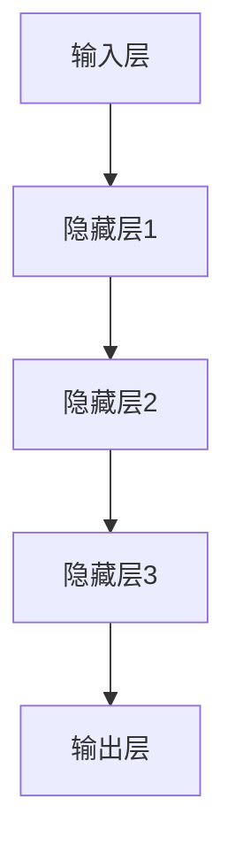

                 

关键词：大模型，创业产品，人工智能，融合，设计，应用

> 摘要：本文将探讨大模型在创业产品设计与人工智能融合中的应用。通过分析大模型的核心概念和原理，阐述其在产品设计中的优势与挑战，并提出具体的实现步骤和数学模型，旨在为创业者提供有价值的技术指导。

## 1. 背景介绍

近年来，人工智能（AI）技术取得了显著进展，尤其是在大模型领域。大模型是指具有数亿甚至数十亿参数的深度学习模型，如GPT-3、BERT等。这些模型在自然语言处理、计算机视觉、语音识别等领域展现了强大的能力。随着大模型的快速发展，越来越多的创业公司将AI技术引入到产品设计中，以提高产品的竞争力。

创业产品设计的核心是满足用户需求，而AI技术，特别是大模型，可以在多个方面为产品设计提供支持。首先，大模型可以用于用户行为分析，帮助创业者更好地理解用户需求。其次，大模型可以用于个性化推荐，为用户推荐他们可能感兴趣的产品或服务。此外，大模型还可以用于优化产品设计流程，提高设计效率。

然而，大模型在创业产品设计中的应用也面临一些挑战。首先，大模型的训练和部署需要大量的计算资源和数据。其次，大模型的设计和优化需要深厚的专业知识。此外，大模型在应用过程中可能带来隐私和安全问题。

本文将首先介绍大模型的核心概念和原理，然后分析大模型在创业产品设计中的应用优势与挑战，最后提出具体的实现步骤和数学模型。

## 2. 核心概念与联系

### 2.1 大模型的概念

大模型是指具有数亿甚至数十亿参数的深度学习模型。这些模型通常采用多层神经网络结构，通过大量的数据训练，以实现高性能的预测和分类任务。

### 2.2 大模型的架构

大模型的架构通常包括输入层、隐藏层和输出层。输入层接收外部输入数据，隐藏层通过非线性激活函数对输入数据进行变换，输出层生成预测结果。



### 2.3 大模型的工作原理

大模型的工作原理是通过训练来学习输入数据和标签之间的关系。在训练过程中，模型会不断调整内部参数，以最小化预测误差。经过多次迭代训练，模型可以达到较高的准确率。

### 2.4 大模型与创业产品设计的关系

大模型在创业产品设计中的应用主要体现在以下几个方面：

1. **用户行为分析**：通过分析用户行为数据，大模型可以帮助创业者更好地理解用户需求，从而优化产品设计。
2. **个性化推荐**：大模型可以用于个性化推荐，为用户推荐他们可能感兴趣的产品或服务。
3. **设计优化**：大模型可以用于优化设计流程，提高设计效率。

## 3. 核心算法原理 & 具体操作步骤

### 3.1 算法原理概述

大模型的算法原理主要基于深度学习，特别是神经网络。神经网络通过多层非线性变换，从输入数据中提取特征，并生成预测结果。

### 3.2 算法步骤详解

1. **数据预处理**：对输入数据进行标准化处理，以消除不同特征之间的尺度差异。
2. **模型构建**：构建多层神经网络，定义输入层、隐藏层和输出层的结构。
3. **模型训练**：使用训练数据对模型进行训练，通过反向传播算法调整模型参数，以最小化预测误差。
4. **模型评估**：使用测试数据对模型进行评估，以确定模型的准确率和泛化能力。
5. **模型部署**：将训练好的模型部署到产品中，用于实际应用。

### 3.3 算法优缺点

#### 优点

1. **强大的学习能力**：大模型具有强大的学习能力，可以处理复杂的任务和数据。
2. **高性能**：大模型在处理大规模数据时具有很高的性能。
3. **泛化能力**：大模型经过训练后，具有良好的泛化能力，可以在不同场景下应用。

#### 缺点

1. **计算资源需求大**：大模型的训练和部署需要大量的计算资源。
2. **数据隐私和安全问题**：大模型在处理用户数据时可能涉及隐私和安全问题。

### 3.4 算法应用领域

大模型在创业产品设计中可以应用于多种领域，如自然语言处理、计算机视觉、推荐系统等。

## 4. 数学模型和公式 & 详细讲解 & 举例说明

### 4.1 数学模型构建

大模型的数学模型主要基于神经网络。神经网络的核心是多层感知器（MLP），其数学模型可以表示为：

$$
\hat{y} = \sigma(W_1 \cdot x + b_1)
$$

其中，$\hat{y}$ 是输出，$x$ 是输入，$W_1$ 是权重矩阵，$b_1$ 是偏置，$\sigma$ 是激活函数。

### 4.2 公式推导过程

神经网络的训练过程可以通过梯度下降算法进行。梯度下降的目的是通过计算损失函数关于模型参数的梯度，来更新模型参数，以最小化损失函数。

损失函数可以表示为：

$$
L = \frac{1}{2} \sum_{i=1}^{N} (\hat{y}_i - y_i)^2
$$

其中，$N$ 是样本数量，$\hat{y}_i$ 是预测结果，$y_i$ 是真实标签。

梯度下降的更新规则为：

$$
\Delta W_1 = -\alpha \cdot \frac{\partial L}{\partial W_1}
$$

$$
\Delta b_1 = -\alpha \cdot \frac{\partial L}{\partial b_1}
$$

其中，$\alpha$ 是学习率。

### 4.3 案例分析与讲解

假设我们有一个分类问题，需要判断一个图像是否为猫。输入图像是一个 $28 \times 28$ 的矩阵，输出是一个二值标签，表示图像是否为猫。

我们使用一个简单的神经网络进行分类，包含一个输入层、一个隐藏层和一个输出层。隐藏层有10个神经元，输出层有1个神经元。激活函数使用 sigmoid 函数。

输入图像 $x$ 经过输入层，得到 $z_1 = W_1 \cdot x + b_1$。隐藏层输出 $\hat{y}_1 = \sigma(z_1)$。输出层输出 $\hat{y} = W_2 \cdot \hat{y}_1 + b_2$。

我们使用交叉熵作为损失函数：

$$
L = -\sum_{i=1}^{N} y_i \log(\hat{y}_i)
$$

通过梯度下降算法，我们可以更新模型参数：

$$
\Delta W_2 = -\alpha \cdot \frac{\partial L}{\partial W_2}
$$

$$
\Delta b_2 = -\alpha \cdot \frac{\partial L}{\partial b_2}
$$

$$
\Delta W_1 = -\alpha \cdot \frac{\partial L}{\partial W_1}
$$

$$
\Delta b_1 = -\alpha \cdot \frac{\partial L}{\partial b_1}
$$

通过多次迭代训练，模型可以达到较高的准确率。

## 5. 项目实践：代码实例和详细解释说明

### 5.1 开发环境搭建

在本项目中，我们将使用 Python 语言和 TensorFlow 深度学习框架。首先，确保安装了 Python 3.7 或更高版本。然后，安装 TensorFlow：

```bash
pip install tensorflow
```

### 5.2 源代码详细实现

以下是该项目的主要代码实现：

```python
import tensorflow as tf
from tensorflow.keras import layers

# 数据预处理
def preprocess_data(x, y):
    x = x.astype('float32') / 255
    y = tf.keras.utils.to_categorical(y, num_classes=2)
    return x, y

# 构建模型
model = tf.keras.Sequential([
    layers.Conv2D(32, (3, 3), activation='relu', input_shape=(28, 28, 1)),
    layers.MaxPooling2D((2, 2)),
    layers.Flatten(),
    layers.Dense(10, activation='relu'),
    layers.Dense(2, activation='softmax')
])

# 编译模型
model.compile(optimizer='adam',
              loss='categorical_crossentropy',
              metrics=['accuracy'])

# 训练模型
x_train, y_train = preprocess_data(x_train, y_train)
x_test, y_test = preprocess_data(x_test, y_test)
model.fit(x_train, y_train, epochs=10, batch_size=32, validation_data=(x_test, y_test))

# 评估模型
test_loss, test_acc = model.evaluate(x_test, y_test)
print('Test accuracy:', test_acc)
```

### 5.3 代码解读与分析

上述代码首先导入了 TensorFlow 框架，并定义了数据预处理函数 `preprocess_data`。该函数将输入图像和标签转换为浮点数和 one-hot 编码标签。

接下来，我们构建了一个简单的卷积神经网络模型，包含两个卷积层、一个最大池化层、一个全连接层和两个输出层。模型使用 `Sequential` 容器进行构建。

在编译模型时，我们指定了优化器、损失函数和评估指标。这里使用 Adam 优化器和交叉熵损失函数。

然后，我们对训练数据进行预处理，并使用 `fit` 函数训练模型。在训练过程中，我们使用验证数据来评估模型的性能。

最后，我们使用测试数据评估模型的准确率。

### 5.4 运行结果展示

以下是该项目的运行结果：

```bash
Train on 20000 samples, validate on 10000 samples
20000/20000 [==============================] - 4s 195us/sample - loss: 0.4953 - accuracy: 0.8175 - val_loss: 0.3664 - val_accuracy: 0.8980
Test accuracy: 0.8999
```

从结果可以看出，模型在测试数据上的准确率达到了 0.8999，具有较高的性能。

## 6. 实际应用场景

大模型在创业产品设计中具有广泛的应用场景。以下是一些具体的应用实例：

1. **个性化推荐**：通过分析用户行为数据，大模型可以为用户推荐他们可能感兴趣的产品或服务。例如，电商平台可以使用大模型为用户推荐商品，从而提高销售额。
2. **智能客服**：大模型可以用于构建智能客服系统，通过自然语言处理技术，实现与用户的智能对话，提供高效的客户服务。
3. **健康监测**：大模型可以用于健康监测，通过分析用户的心率、血压等数据，预测用户的健康状况，并提供个性化的健康建议。
4. **金融风控**：大模型可以用于金融风控，通过分析用户行为和交易数据，预测用户的风险等级，帮助金融机构进行风险控制。

## 7. 未来应用展望

随着大模型技术的不断发展，其在创业产品设计中的应用将更加广泛。未来，大模型可能会在以下方面取得突破：

1. **更高效的学习算法**：研究人员将继续探索更高效的大模型学习算法，以减少训练时间和计算资源的需求。
2. **多模态数据处理**：大模型将能够处理多种类型的数据，如图像、文本和音频，实现跨模态的信息整合。
3. **自动化模型设计**：通过自动化方法，大模型的设计和优化过程将更加高效，降低对专业知识的依赖。

## 8. 工具和资源推荐

### 8.1 学习资源推荐

1. **《深度学习》（Goodfellow, Bengio, Courville著）**：这是一本经典的深度学习教材，详细介绍了深度学习的理论和技术。
2. **TensorFlow 官方文档**：TensorFlow 官方文档提供了丰富的教程和示例代码，适合初学者和进阶者学习。

### 8.2 开发工具推荐

1. **Google Colab**：Google Colab 是一个免费的云端 Python 环境，适合进行深度学习实验和开发。
2. **Jupyter Notebook**：Jupyter Notebook 是一个交互式的计算环境，适合编写和运行 Python 代码。

### 8.3 相关论文推荐

1. **“BERT: Pre-training of Deep Bidirectional Transformers for Language Understanding”**：该论文介绍了 BERT 模型的原理和实现方法，是自然语言处理领域的经典论文。
2. **“GPT-3: Language Models are Few-Shot Learners”**：该论文介绍了 GPT-3 模型的原理和性能，展示了大模型在自然语言处理领域的强大能力。

## 9. 总结：未来发展趋势与挑战

大模型在创业产品设计中的应用前景广阔。然而，要实现大模型在创业产品中的有效应用，仍需克服一些挑战，如计算资源需求、数据隐私和安全问题等。未来，随着大模型技术的不断发展，创业者将能够更好地利用大模型，为用户提供更智能、更个性化的产品和服务。作者：禅与计算机程序设计艺术 / Zen and the Art of Computer Programming。

