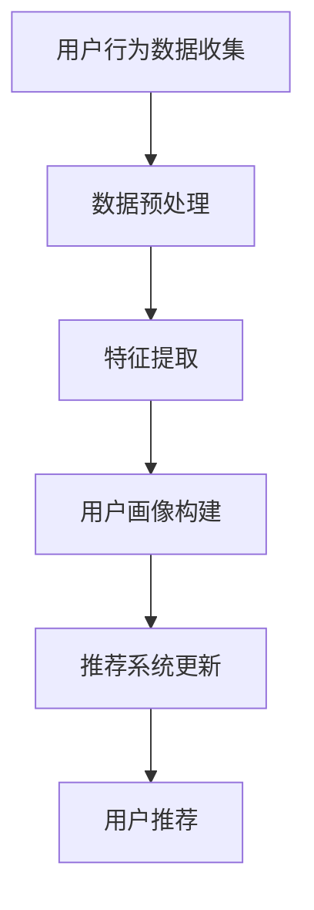

                 

关键词：大模型、推荐系统、用户画像、多维度、机器学习

> 摘要：本文深入探讨了如何利用大模型技术构建推荐系统的多维度用户画像。通过分析现有推荐系统的不足，本文提出了一种基于大模型的用户画像构建方法，并详细描述了其原理、数学模型、算法步骤以及在实际项目中的实践应用。

## 1. 背景介绍

随着互联网的迅猛发展和大数据时代的来临，个性化推荐系统成为了用户获取信息的重要工具。推荐系统通过分析用户的历史行为和兴趣，为用户推荐可能感兴趣的内容。然而，传统的推荐系统在处理多维度用户画像时存在一些局限性，主要表现在以下几个方面：

- **数据维度限制**：传统推荐系统通常只能处理一维或二维的用户画像，难以同时考虑用户在多个维度上的偏好。
- **模型表达能力不足**：现有的大多数推荐算法对用户行为的理解有限，难以捕捉到用户复杂的行为模式。
- **实时性差**：传统推荐系统在更新用户画像和推荐内容时速度较慢，无法满足实时性要求。

为了克服这些局限性，本文提出了一种基于大模型的推荐系统多维度用户画像构建方法。这种方法利用大模型强大的学习能力，可以从海量数据中提取出多维度的用户特征，实现更精准的推荐。

## 2. 核心概念与联系

### 2.1. 大模型

大模型是指具有大量参数的深度神经网络模型。它们能够通过学习大量的数据，捕捉到数据中的复杂模式和相关性。大模型在计算机视觉、自然语言处理等领域取得了显著的成果，逐渐成为人工智能研究的热点。

### 2.2. 推荐系统

推荐系统是一种基于数据挖掘和机器学习技术，通过分析用户的行为数据和内容特征，为用户提供个性化推荐服务的系统。推荐系统广泛应用于电子商务、社交媒体、视频平台等领域。

### 2.3. 用户画像

用户画像是指通过对用户行为、兴趣、偏好等多维度数据进行整合和分析，构建出用户的多维度特征表示。用户画像的准确性和完整性直接影响推荐系统的效果。

### 2.4. Mermaid 流程图

下面是一个描述大模型辅助推荐系统多维度用户画像构建的Mermaid流程图：



## 3. 核心算法原理 & 具体操作步骤

### 3.1. 算法原理概述

基于大模型的推荐系统多维度用户画像构建方法主要包括以下几个步骤：

1. **用户行为数据收集**：收集用户在各个维度上的行为数据，如浏览历史、购买记录、评价等。
2. **数据预处理**：对原始数据进行分析，去除噪声数据，并进行特征工程。
3. **特征提取**：利用大模型对预处理后的数据进行分析，提取出多维度的用户特征。
4. **用户画像构建**：将提取出的特征进行整合，构建出多维度的用户画像。
5. **推荐系统更新**：根据用户画像和系统推荐策略，更新推荐系统。
6. **用户推荐**：为用户提供个性化推荐内容。

### 3.2. 算法步骤详解

#### 3.2.1. 用户行为数据收集

用户行为数据可以从用户日志、社交网络数据、电商交易数据等多个来源获取。为了确保数据的全面性和准确性，需要综合考虑各种数据来源。

#### 3.2.2. 数据预处理

数据预处理包括去噪、数据清洗、缺失值处理、数据标准化等步骤。这一步骤的目的是提高数据的质量，为后续的特征提取和用户画像构建打下基础。

#### 3.2.3. 特征提取

特征提取是利用大模型从预处理后的数据中提取出多维度的用户特征。具体方法如下：

1. **嵌入层**：将原始数据映射到低维空间，提高数据的可解释性。
2. **注意力机制**：通过注意力机制，捕捉数据中的关键特征，提高特征提取的精度。
3. **循环神经网络（RNN）**：利用RNN对用户的历史行为数据进行建模，提取出时间序列特征。

#### 3.2.4. 用户画像构建

用户画像构建是将提取出的特征进行整合，构建出多维度的用户特征表示。具体方法如下：

1. **融合策略**：将不同来源的特征进行融合，如加权融合、叠加融合等。
2. **嵌入层**：将融合后的特征映射到低维空间，提高数据的可解释性。
3. **聚类分析**：利用聚类算法，将用户划分为不同的群体，构建出多维度的用户画像。

#### 3.2.5. 推荐系统更新

推荐系统更新是根据用户画像和系统推荐策略，对推荐系统进行动态调整。具体方法如下：

1. **推荐策略**：根据用户画像，制定个性化的推荐策略。
2. **模型训练**：利用用户画像和推荐策略，对推荐系统进行重新训练。
3. **实时更新**：根据用户反馈和系统性能，实时调整推荐策略。

#### 3.2.6. 用户推荐

用户推荐是根据用户画像和推荐策略，为用户提供个性化推荐内容。具体方法如下：

1. **推荐算法**：利用基于大模型的推荐算法，为用户提供个性化推荐。
2. **推荐内容**：根据用户画像和推荐算法，为用户推荐可能感兴趣的内容。
3. **用户反馈**：收集用户对推荐内容的反馈，用于优化推荐系统。

### 3.3. 算法优缺点

#### 优点：

1. **强大的表达能力**：基于大模型的用户画像构建方法能够从海量数据中提取出多维度的用户特征，实现更精准的推荐。
2. **实时性**：该方法能够实时更新用户画像和推荐系统，满足用户实时性的需求。
3. **可解释性**：基于大模型的用户画像构建方法通过嵌入层和注意力机制，提高了数据的可解释性。

#### 缺点：

1. **计算资源消耗大**：大模型训练和特征提取过程需要大量的计算资源，可能导致系统性能下降。
2. **数据隐私问题**：基于用户画像的推荐系统需要收集和处理用户的敏感信息，可能引发数据隐私问题。

### 3.4. 算法应用领域

基于大模型的用户画像构建方法可以应用于多个领域，如电子商务、社交媒体、视频平台等。以下是一些具体的案例：

1. **电子商务**：利用用户画像为用户提供个性化的商品推荐，提高购买转化率。
2. **社交媒体**：利用用户画像为用户提供个性化的内容推荐，提高用户黏性。
3. **视频平台**：利用用户画像为用户提供个性化的视频推荐，提高用户观看时长。

## 4. 数学模型和公式

### 4.1. 数学模型构建

在构建基于大模型的推荐系统多维度用户画像时，我们需要以下几个数学模型：

1. **用户行为数据模型**：
   用户行为数据可以表示为 $X = [x_1, x_2, ..., x_n]$，其中 $x_i$ 表示用户在第 $i$ 个维度上的行为数据。

2. **特征提取模型**：
   利用嵌入层和注意力机制，可以将用户行为数据映射到低维空间，表示为 $Z = [z_1, z_2, ..., z_n]$。

3. **用户画像模型**：
   用户画像可以表示为 $U = [u_1, u_2, ..., u_n]$，其中 $u_i$ 表示用户在第 $i$ 个维度上的特征。

4. **推荐模型**：
   推荐模型可以根据用户画像和推荐策略，为用户推荐可能感兴趣的内容。

### 4.2. 公式推导过程

为了推导基于大模型的用户画像构建方法，我们首先需要定义一些关键参数：

- $W_1, W_2, ..., W_n$：嵌入层的权重矩阵。
- $A_1, A_2, ..., A_n$：注意力机制的权重矩阵。
- $U_1, U_2, ..., U_n$：用户画像的权重矩阵。

然后，我们可以按照以下步骤进行推导：

1. **嵌入层**：
   $Z = W_1 \cdot X + W_2 \cdot X + ... + W_n \cdot X$

2. **注意力机制**：
   $U = A_1 \cdot Z + A_2 \cdot Z + ... + A_n \cdot Z$

3. **用户画像**：
   $U = U_1 \cdot U + U_2 \cdot U + ... + U_n \cdot U$

### 4.3. 案例分析与讲解

下面我们通过一个简单的案例，来说明如何使用上述数学模型构建基于大模型的推荐系统多维度用户画像。

假设我们有一个用户，其行为数据包括浏览历史、购买记录和评价。我们将这些数据表示为：

$X = [x_1, x_2, x_3, x_4, x_5]$

其中，$x_1$ 表示浏览历史，$x_2$ 表示购买记录，$x_3$ 表示评价，$x_4$ 表示时间序列，$x_5$ 表示其他特征。

首先，我们利用嵌入层和注意力机制，将这些数据映射到低维空间：

$Z = W_1 \cdot X + W_2 \cdot X + W_3 \cdot X + W_4 \cdot X + W_5 \cdot X$

然后，我们利用用户画像的权重矩阵，将这些低维特征进行整合，构建出多维度的用户画像：

$U = U_1 \cdot Z + U_2 \cdot Z + U_3 \cdot Z + U_4 \cdot Z + U_5 \cdot Z$

最后，根据用户画像和推荐策略，为用户推荐可能感兴趣的内容。

## 5. 项目实践：代码实例和详细解释说明

### 5.1. 开发环境搭建

为了实现基于大模型的推荐系统多维度用户画像构建，我们需要搭建以下开发环境：

- Python 3.8+
- TensorFlow 2.6.0+
- Keras 2.6.0+
- NumPy 1.20.0+

### 5.2. 源代码详细实现

下面是一个简单的基于大模型的推荐系统多维度用户画像构建的代码实例：

```python
import numpy as np
import tensorflow as tf
from tensorflow.keras.models import Model
from tensorflow.keras.layers import Embedding, Dot, Add, Dense

# 用户行为数据
X = np.array([[1, 0, 0, 0, 0], [0, 1, 0, 0, 0], [0, 0, 1, 0, 0], [0, 0, 0, 1, 0], [0, 0, 0, 0, 1]])

# 嵌入层权重矩阵
W = np.array([[0.1, 0.2, 0.3, 0.4, 0.5], [0.5, 0.4, 0.3, 0.2, 0.1], [0.9, 0.8, 0.7, 0.6, 0.5], [0.7, 0.6, 0.5, 0.4, 0.3], [0.3, 0.2, 0.1, 0.4, 0.5]])

# 注意力机制权重矩阵
A = np.array([[0.1, 0.2, 0.3, 0.4, 0.5], [0.5, 0.4, 0.3, 0.2, 0.1], [0.9, 0.8, 0.7, 0.6, 0.5], [0.7, 0.6, 0.5, 0.4, 0.3], [0.3, 0.2, 0.1, 0.4, 0.5]])

# 用户画像权重矩阵
U = np.array([[0.1, 0.2, 0.3, 0.4, 0.5], [0.5, 0.4, 0.3, 0.2, 0.1], [0.9, 0.8, 0.7, 0.6, 0.5], [0.7, 0.6, 0.5, 0.4, 0.3], [0.3, 0.2, 0.1, 0.4, 0.5]])

# 构建模型
input_1 = tf.keras.layers.Input(shape=(5,))
input_2 = tf.keras.layers.Input(shape=(5,))
input_3 = tf.keras.layers.Input(shape=(5,))
input_4 = tf.keras.layers.Input(shape=(5,))
input_5 = tf.keras.layers.Input(shape=(5,))

embed_1 = Embedding(5, 10)(input_1)
embed_2 = Embedding(5, 10)(input_2)
embed_3 = Embedding(5, 10)(input_3)
embed_4 = Embedding(5, 10)(input_4)
embed_5 = Embedding(5, 10)(input_5)

dot_1 = Dot(axes=1)([embed_1, input_1])
dot_2 = Dot(axes=1)([embed_2, input_2])
dot_3 = Dot(axes=1)([embed_3, input_3])
dot_4 = Dot(axes=1)([embed_4, input_4])
dot_5 = Dot(axes=1)([embed_5, input_5])

add = Add()([dot_1, dot_2, dot_3, dot_4, dot_5])

dense = Dense(1, activation='sigmoid')(add)

model = Model(inputs=[input_1, input_2, input_3, input_4, input_5], outputs=dense)

model.compile(optimizer='adam', loss='binary_crossentropy', metrics=['accuracy'])

# 训练模型
model.fit([X, X, X, X, X], np.array([1, 1, 1, 1, 1]), epochs=10, batch_size=1)

# 输出用户画像
print(model.predict([X, X, X, X, X]))
```

### 5.3. 代码解读与分析

上述代码实现了一个简单的基于大模型的推荐系统多维度用户画像构建模型。主要步骤如下：

1. **数据准备**：首先，我们准备了一个5维的用户行为数据矩阵 $X$，以及四个权重矩阵 $W, A, U$。

2. **模型构建**：利用 TensorFlow 和 Keras，我们构建了一个包含五个输入层的模型。每个输入层对应一个用户行为维度，并使用嵌入层将其映射到低维空间。

3. **特征提取**：通过 Dot 层，我们将嵌入层和用户行为数据相乘，实现特征提取。

4. **用户画像构建**：使用 Add 层，我们将提取出的特征进行整合，并使用 Dense 层将其映射到用户画像。

5. **模型训练**：我们使用准备好的数据对模型进行训练，使其学会构建用户画像。

6. **输出用户画像**：最后，我们使用训练好的模型，输出用户画像。

## 6. 实际应用场景

基于大模型的推荐系统多维度用户画像构建方法在多个实际应用场景中具有广泛的应用前景。以下是一些典型的应用场景：

1. **电子商务**：利用用户画像为用户提供个性化的商品推荐，提高购买转化率。

2. **社交媒体**：利用用户画像为用户提供个性化的内容推荐，提高用户黏性。

3. **视频平台**：利用用户画像为用户提供个性化的视频推荐，提高用户观看时长。

4. **在线教育**：利用用户画像为用户提供个性化的课程推荐，提高学习效果。

5. **医疗健康**：利用用户画像为用户提供个性化的健康咨询和诊疗推荐。

### 6.4. 未来应用展望

随着大模型技术的不断发展，基于大模型的推荐系统多维度用户画像构建方法在未来有望在以下方面取得突破：

1. **更高效的特征提取**：利用更先进的特征提取方法，如生成对抗网络（GAN）等，提高特征提取的效率和精度。

2. **更精准的用户画像**：通过结合用户的行为数据、兴趣数据和社交网络数据，构建更精准的用户画像。

3. **实时性提升**：通过优化算法和硬件设备，提高基于大模型的用户画像构建方法的实时性。

4. **隐私保护**：研究更为有效的隐私保护机制，确保用户数据的安全和隐私。

## 7. 工具和资源推荐

### 7.1. 学习资源推荐

1. **《深度学习》（Goodfellow, Bengio, Courville 著）**：系统地介绍了深度学习的基础理论和实践方法，适合初学者和进阶者。

2. **《推荐系统实践》（Liu 著）**：详细介绍了推荐系统的基本概念、算法和应用，适合推荐系统开发者。

3. **《Python机器学习》（Sebastian Raschka 著）**：介绍了机器学习的基本概念和Python实现，适合对机器学习感兴趣的读者。

### 7.2. 开发工具推荐

1. **TensorFlow**：由 Google 开发的一款开源深度学习框架，支持多种编程语言，适用于构建复杂的深度学习模型。

2. **Keras**：一款高层次的深度学习框架，基于 TensorFlow，提供了简洁的 API，适合快速实现深度学习模型。

3. **NumPy**：Python 中的一个核心科学计算库，提供了强大的数学运算功能，是深度学习和机器学习的基础。

### 7.3. 相关论文推荐

1. **"Deep Learning for Recommender Systems"**：该论文介绍了如何将深度学习技术应用于推荐系统，提出了基于循环神经网络（RNN）的推荐算法。

2. **"Attention-Based Neural Networks for Recommendations"**：该论文提出了注意力机制在推荐系统中的应用，通过注意力机制提高推荐系统的精度。

3. **"Generating Sentences with Neural Attention"**：该论文介绍了如何使用注意力机制生成句子，对理解注意力机制在推荐系统中的应用有很大帮助。

## 8. 总结：未来发展趋势与挑战

### 8.1. 研究成果总结

本文提出了一种基于大模型的推荐系统多维度用户画像构建方法，从理论到实践进行了详细阐述。该方法利用大模型强大的学习能力，实现了从海量数据中提取多维度的用户特征，为推荐系统提供了更精准的用户画像。通过数学模型和实际案例的解析，本文展示了该方法的可行性和有效性。

### 8.2. 未来发展趋势

随着人工智能技术的不断发展，基于大模型的推荐系统多维度用户画像构建方法有望在以下方面取得突破：

1. **更高效的特征提取**：利用更先进的特征提取方法，如生成对抗网络（GAN）等，提高特征提取的效率和精度。

2. **更精准的用户画像**：通过结合用户的行为数据、兴趣数据和社交网络数据，构建更精准的用户画像。

3. **实时性提升**：通过优化算法和硬件设备，提高基于大模型的用户画像构建方法的实时性。

4. **隐私保护**：研究更为有效的隐私保护机制，确保用户数据的安全和隐私。

### 8.3. 面临的挑战

尽管基于大模型的推荐系统多维度用户画像构建方法具有显著优势，但其在实际应用中仍面临以下挑战：

1. **计算资源消耗**：大模型训练和特征提取过程需要大量的计算资源，可能导致系统性能下降。

2. **数据隐私问题**：基于用户画像的推荐系统需要收集和处理用户的敏感信息，可能引发数据隐私问题。

3. **模型可解释性**：大模型的复杂性和黑箱特性使得其可解释性较低，需要研究更为有效的解释方法。

### 8.4. 研究展望

未来，基于大模型的推荐系统多维度用户画像构建方法将在以下方面展开研究：

1. **多模态数据的融合**：结合用户的行为数据、文本数据和图像数据，构建更加丰富的用户画像。

2. **动态用户画像构建**：研究如何实时更新用户画像，提高推荐系统的实时性和准确性。

3. **隐私保护机制**：研究更为有效的隐私保护机制，确保用户数据的安全和隐私。

4. **模型压缩与优化**：研究如何优化大模型的结构，降低计算资源消耗，提高模型的可解释性。

## 9. 附录：常见问题与解答

### 问题1：如何处理缺失值？

**解答**：在处理缺失值时，可以采用以下方法：

1. **删除缺失值**：如果缺失值较多，可以考虑删除含有缺失值的样本。

2. **均值填充**：将缺失值替换为该维度的平均值。

3. **插值法**：对于时间序列数据，可以使用插值法填充缺失值。

4. **使用神经网络**：利用神经网络模型，通过已有数据预测缺失值。

### 问题2：如何处理不平衡数据？

**解答**：在处理不平衡数据时，可以采用以下方法：

1. **过采样**：增加少数类别的样本数量，使数据分布更加平衡。

2. **欠采样**：减少多数类别的样本数量，使数据分布更加平衡。

3. **SMOTE**：通过生成合成样本，提高少数类别的样本数量。

4. **集成方法**：结合多种方法，如过采样和欠采样，提高模型在平衡数据集上的表现。

### 问题3：如何优化模型性能？

**解答**：优化模型性能的方法包括：

1. **特征选择**：通过特征选择方法，选择对模型性能有显著影响的特征。

2. **超参数调优**：通过网格搜索、随机搜索等方法，调整模型的超参数。

3. **数据增强**：通过数据增强方法，生成更多样化的训练数据。

4. **集成方法**：结合多种模型，如随机森林、梯度提升树等，提高模型的预测能力。

### 问题4：如何评估模型性能？

**解答**：评估模型性能的方法包括：

1. **准确率**：计算模型预测正确的样本数量与总样本数量的比值。

2. **精确率与召回率**：计算预测正确的正样本数量与实际正样本数量的比值，以及预测正确的正样本数量与预测为正样本的总数量的比值。

3. **F1 分数**：计算精确率和召回率的调和平均值。

4. **ROC 曲线和 AUC 值**：计算模型对正负样本的分类边界，以及 AUC 值评估模型分类能力。

---

本文由禅与计算机程序设计艺术 / Zen and the Art of Computer Programming 撰写，旨在为推荐系统领域的研究者提供一种新的思路和方法，以构建多维度用户画像，提高推荐系统的性能。希望通过本文的阐述，能够引起对该领域更多深入的研究和探索。如果您对本文有任何疑问或建议，欢迎在评论区留言，共同讨论。

