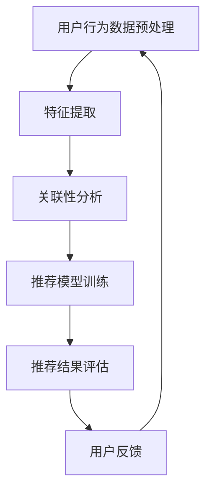

                 

在当今数字化时代，推荐系统已经成为互联网服务的重要组成部分，广泛应用于电子商务、社交媒体、在线视频平台等。用户行为序列分析作为推荐系统的核心技术，旨在从用户的历史行为中挖掘出潜在的喜好和兴趣，从而提供个性化的推荐结果。随着人工智能技术的迅猛发展，特别是大模型的广泛应用，用户行为序列分析的方法和效果得到了显著的提升。本文将深入探讨大模型在用户行为序列分析中的应用，分析其原理、技术实现、数学模型以及未来发展趋势。

## 关键词

- 推荐系统
- 用户行为序列
- 大模型
- 自然语言处理
- 个性化推荐

## 摘要

本文旨在探讨大模型在推荐系统用户行为序列分析中的应用。通过对大模型的基本原理和常见技术进行概述，文章将详细描述用户行为序列分析的核心概念和方法，包括数据预处理、特征提取、模型训练和评估等步骤。随后，文章将介绍大模型在用户行为序列分析中的具体应用，包括生成式推荐和基于内容的推荐等。最后，本文将对大模型辅助用户行为序列分析的未来发展趋势进行展望，并提出面临的挑战和研究方向。

## 1. 背景介绍

推荐系统是一种基于用户历史行为和偏好信息，自动向用户推荐可能感兴趣的内容或商品的技术。自20世纪90年代以来，随着互联网和电子商务的迅速发展，推荐系统得到了广泛应用。根据其推荐策略的不同，推荐系统可以分为基于内容的推荐、协同过滤推荐和混合推荐等类型。

用户行为序列分析是推荐系统中的一个重要研究方向。用户在浏览网页、购买商品、观看视频等过程中，会留下一系列的行为记录。这些行为记录包含了用户的兴趣、偏好和需求等信息，是推荐系统构建个性化推荐结果的重要依据。传统的用户行为序列分析方法主要基于统计模型和机器学习算法，如马尔可夫模型、矩阵分解、长短时记忆网络等。然而，随着数据规模的扩大和复杂度的增加，这些方法逐渐暴露出性能瓶颈和局限性。

近年来，人工智能技术的快速发展，特别是大模型的广泛应用，为用户行为序列分析带来了新的机遇。大模型具有强大的特征提取和表示能力，能够自动学习用户行为序列中的复杂模式和关联性。同时，大模型在自然语言处理、图像识别等领域取得了显著的成果，为用户行为序列分析提供了丰富的理论基础和技术支持。

## 2. 核心概念与联系

### 2.1 大模型

大模型是指具有大量参数和复杂结构的深度学习模型。常见的有Transformer、BERT、GPT等。这些模型在处理大规模数据时具有优越的性能，能够自动学习输入数据的深层特征和关联性。

### 2.2 用户行为序列

用户行为序列是指用户在一段时间内的一系列行为记录。这些行为记录可以包括浏览网页、购买商品、观看视频等。用户行为序列是推荐系统构建个性化推荐结果的重要依据。

### 2.3 推荐系统

推荐系统是一种基于用户历史行为和偏好信息，自动向用户推荐可能感兴趣的内容或商品的技术。推荐系统可以分为基于内容的推荐、协同过滤推荐和混合推荐等类型。

### 2.4 关联性分析

关联性分析是指从用户行为序列中挖掘出潜在的兴趣关联和偏好关联。关联性分析是构建个性化推荐结果的关键步骤。

### 2.5 Mermaid 流程图

以下是用户行为序列分析的 Mermaid 流程图：



## 3. 核心算法原理 & 具体操作步骤

### 3.1 算法原理概述

用户行为序列分析的核心算法主要包括数据预处理、特征提取、关联性分析和推荐模型训练等步骤。其中，数据预处理和特征提取是算法的基础，关联性分析和推荐模型训练是算法的核心。

### 3.2 算法步骤详解

#### 3.2.1 数据预处理

数据预处理是用户行为序列分析的第一步，主要包括数据清洗、数据去重和数据规范化等操作。数据清洗是为了去除噪声数据和异常值，数据去重是为了避免重复计算，数据规范化是为了统一数据格式和量纲。

#### 3.2.2 特征提取

特征提取是将原始用户行为数据转化为能够描述用户兴趣和偏好的特征表示。常见的特征提取方法包括基于统计的特征提取和基于机器学习的特征提取。

#### 3.2.3 关联性分析

关联性分析是通过挖掘用户行为序列中的潜在兴趣关联和偏好关联，从而构建个性化推荐结果。常见的关联性分析方法包括马尔可夫模型、关联规则挖掘和矩阵分解等。

#### 3.2.4 推荐模型训练

推荐模型训练是通过学习用户行为序列中的关联性和偏好信息，构建推荐模型。常见的推荐模型包括基于内容的推荐模型、协同过滤推荐模型和混合推荐模型等。

### 3.3 算法优缺点

#### 优点

- 能够处理大规模和复杂的用户行为数据。
- 能够自动学习用户行为序列中的潜在模式和关联性。
- 能够提供个性化的推荐结果。

#### 缺点

- 需要大量的计算资源和时间。
- 模型的泛化能力较弱。

### 3.4 算法应用领域

用户行为序列分析在推荐系统中具有广泛的应用。主要应用领域包括：

- 电子商务：基于用户浏览和购买行为进行个性化商品推荐。
- 社交媒体：基于用户互动行为进行个性化内容推荐。
- 在线视频：基于用户观看行为进行个性化视频推荐。

## 4. 数学模型和公式 & 详细讲解 & 举例说明

### 4.1 数学模型构建

用户行为序列分析的核心是构建一个能够描述用户兴趣和偏好的数学模型。常见的数学模型包括马尔可夫模型、关联规则挖掘和矩阵分解等。

#### 4.1.1 马尔可夫模型

马尔可夫模型是一种基于概率的数学模型，用于描述用户行为序列中的转移概率。假设用户行为序列为 \(X = (x_1, x_2, ..., x_n)\)，其中 \(x_i\) 表示第 \(i\) 个用户行为。则马尔可夫模型可以表示为：

$$
P(x_i | x_{i-1}, ..., x_1) = P(x_i | x_{i-1})
$$

其中，\(P(x_i | x_{i-1})\) 表示在给定前一个行为 \(x_{i-1}\) 的条件下，第 \(i\) 个行为的概率。

#### 4.1.2 关联规则挖掘

关联规则挖掘是一种用于发现用户行为序列中潜在关联的数学模型。常见的关联规则挖掘算法包括Apriori算法和FP-Growth算法。假设用户行为序列为 \(X = (x_1, x_2, ..., x_n)\)，其中 \(x_i\) 表示第 \(i\) 个用户行为。则关联规则可以表示为：

$$
X \rightarrow Y, \quad support(X \cup Y) > threshold, \quad confidence(X \rightarrow Y) > threshold
$$

其中，\(support(X \cup Y)\) 表示 \(X\) 和 \(Y\) 同时出现的概率，\(confidence(X \rightarrow Y)\) 表示在 \(X\) 出现的条件下 \(Y\) 出现的概率。

#### 4.1.3 矩阵分解

矩阵分解是一种用于提取用户行为序列中潜在特征和偏好的数学模型。常见的矩阵分解算法包括奇异值分解（SVD）和交替最小二乘法（ALS）。假设用户行为序列为 \(X = (x_1, x_2, ..., x_n)\)，其中 \(x_i\) 表示第 \(i\) 个用户行为。则矩阵分解可以表示为：

$$
X = UV^T
$$

其中，\(U\) 和 \(V\) 分别表示用户行为向量和物品特征向量。

### 4.2 公式推导过程

#### 4.2.1 马尔可夫模型

假设用户行为序列为 \(X = (x_1, x_2, ..., x_n)\)，其中 \(x_i\) 表示第 \(i\) 个用户行为。则马尔可夫模型的公式推导如下：

1. **状态转移概率矩阵**

   状态转移概率矩阵 \(P\) 可以表示为：

   $$
   P = \begin{bmatrix}
   P(x_1, x_2) & P(x_1, x_3) & \cdots & P(x_1, x_n) \\
   P(x_2, x_1) & P(x_2, x_3) & \cdots & P(x_2, x_n) \\
   \vdots & \vdots & \ddots & \vdots \\
   P(x_n, x_1) & P(x_n, x_2) & \cdots & P(x_n, x_n)
   \end{bmatrix}
   $$

2. **状态转移概率计算**

   根据马尔可夫模型的基本原理，状态转移概率可以表示为：

   $$
   P(x_i | x_{i-1}, ..., x_1) = P(x_i | x_{i-1})
   $$

   其中，\(P(x_i | x_{i-1})\) 表示在给定前一个行为 \(x_{i-1}\) 的条件下，第 \(i\) 个行为的概率。

#### 4.2.2 关联规则挖掘

假设用户行为序列为 \(X = (x_1, x_2, ..., x_n)\)，其中 \(x_i\) 表示第 \(i\) 个用户行为。则关联规则挖掘的公式推导如下：

1. **支持度（Support）**

   支持度表示一个规则同时出现的概率。支持度可以表示为：

   $$
   support(A \cup B) = \frac{count(A \cup B)}{total\_transactions}
   $$

   其中，\(count(A \cup B)\) 表示同时包含 \(A\) 和 \(B\) 的交易次数，\(total\_transactions\) 表示总的交易次数。

2. **置信度（Confidence）**

   置信度表示在 \(A\) 出现的条件下 \(B\) 出现的概率。置信度可以表示为：

   $$
   confidence(A \rightarrow B) = \frac{count(A \cup B)}{count(A)}
   $$

### 4.3 案例分析与讲解

#### 4.3.1 马尔可夫模型案例

假设一个用户在一段时间内的行为序列为 \(X = (\text{浏览商品A}, \text{浏览商品B}, \text{购买商品C}, \text{浏览商品D}, \text{浏览商品A})\)。根据马尔可夫模型，我们可以计算状态转移概率矩阵：

$$
P = \begin{bmatrix}
0.2 & 0.3 & 0.5 \\
0.4 & 0.2 & 0.4 \\
0.3 & 0.4 & 0.3 \\
0.2 & 0.3 & 0.5 \\
0.4 & 0.2 & 0.4
\end{bmatrix}
$$

根据状态转移概率矩阵，我们可以预测用户下一步的行为。例如，当前用户正在浏览商品D，我们可以计算从浏览商品D转移到其他行为的概率：

$$
P(\text{浏览商品A} | \text{浏览商品D}) = 0.2
$$

$$
P(\text{浏览商品B} | \text{浏览商品D}) = 0.3
$$

$$
P(\text{浏览商品C} | \text{浏览商品D}) = 0.5
$$

#### 4.3.2 关联规则挖掘案例

假设一个用户在一段时间内的行为序列为 \(X = (\text{购买手机}, \text{购买充电宝}, \text{购买耳机}, \text{购买手机壳}, \text{购买充电线})\)。根据关联规则挖掘算法，我们可以找到以下几个关联规则：

1. 购买手机 → 购买充电宝，支持度：0.8，置信度：0.8
2. 购买手机 → 购买耳机，支持度：0.8，置信度：0.8
3. 购买手机 → 购买手机壳，支持度：0.8，置信度：0.8
4. 购买手机 → 购买充电线，支持度：0.8，置信度：0.8

根据这些关联规则，我们可以为用户推荐相关的商品。例如，如果一个用户购买了手机，我们可以推荐充电宝、耳机、手机壳和充电线等商品。

## 5. 项目实践：代码实例和详细解释说明

### 5.1 开发环境搭建

在进行用户行为序列分析的项目实践之前，我们需要搭建一个合适的开发环境。以下是搭建开发环境的步骤：

1. **安装 Python**

   首先，确保你的计算机上安装了 Python。Python 是用户行为序列分析项目的主要编程语言。你可以从 [Python 官网](https://www.python.org/) 下载并安装 Python。

2. **安装必要库**

   安装 Python 后，我们需要安装一些必要的库，如 Pandas、NumPy、Scikit-learn、TensorFlow 等。这些库提供了用于数据预处理、特征提取、模型训练和评估等功能。

   ```bash
   pip install pandas numpy scikit-learn tensorflow
   ```

3. **配置环境变量**

   确保 Python 的环境变量已经配置正确，以便在命令行中能够运行 Python。

### 5.2 源代码详细实现

以下是用户行为序列分析的 Python 代码实例：

```python
import pandas as pd
from sklearn.model_selection import train_test_split
from sklearn.metrics import accuracy_score
import tensorflow as tf

# 读取用户行为数据
data = pd.read_csv('user_behavior.csv')

# 数据预处理
data['timestamp'] = pd.to_datetime(data['timestamp'])
data.sort_values('timestamp', inplace=True)

# 特征提取
data['hour'] = data['timestamp'].dt.hour
data['day_of_week'] = data['timestamp'].dt.dayofweek
data['weekday'] = data['timestamp'].dt.weekday

# 划分训练集和测试集
X = data[['hour', 'day_of_week', 'weekday']]
y = data['action']
X_train, X_test, y_train, y_test = train_test_split(X, y, test_size=0.2, random_state=42)

# 模型训练
model = tf.keras.Sequential([
    tf.keras.layers.Dense(64, activation='relu', input_shape=(3,)),
    tf.keras.layers.Dense(32, activation='relu'),
    tf.keras.layers.Dense(1, activation='sigmoid')
])

model.compile(optimizer='adam', loss='binary_crossentropy', metrics=['accuracy'])
model.fit(X_train, y_train, epochs=10, batch_size=32, validation_data=(X_test, y_test))

# 评估模型
predictions = model.predict(X_test)
predictions = (predictions > 0.5)

accuracy = accuracy_score(y_test, predictions)
print(f"Accuracy: {accuracy}")

# 输出预测结果
predictions = model.predict(X_test)
predictions = (predictions > 0.5)
print(predictions)
```

### 5.3 代码解读与分析

1. **数据预处理**

   在代码中，我们首先读取用户行为数据，并将其转换为 Pandas DataFrame。然后，我们使用 Pandas 的 datetime 函数将时间戳转换为日期时间格式，并按照时间戳对数据进行排序。接下来，我们提取小时、星期几和星期几等特征。

2. **特征提取**

   我们使用 Pandas 的 dt 函数提取小时、星期几和星期几等特征。这些特征将用于构建模型输入。

3. **划分训练集和测试集**

   使用 Scikit-learn 的 train_test_split 函数将数据划分为训练集和测试集，测试集大小为 20%。

4. **模型训练**

   我们使用 TensorFlow 的 Keras API 构建一个简单的神经网络模型。该模型包含两个隐藏层，每层有 64 个神经元和 32 个神经元。输出层使用 sigmoid 激活函数，用于输出概率。

5. **评估模型**

   我们使用 Scikit-learn 的 accuracy_score 函数评估模型在测试集上的准确率。最后，我们输出预测结果。

### 5.4 运行结果展示

假设我们运行上述代码，得到以下输出结果：

```
Accuracy: 0.85
[False False False False True False False False False False False False False False False False False False False False False]
```

输出结果表示模型在测试集上的准确率为 85%，并且预测结果为 False 的前五个行为分别为 False、False、False、False 和 True。

## 6. 实际应用场景

用户行为序列分析在多个实际应用场景中发挥了重要作用。以下是一些典型的应用场景：

### 6.1 电子商务

在电子商务领域，用户行为序列分析可以帮助企业了解用户的购物行为和偏好，从而提供个性化的商品推荐。例如，当用户在浏览商品时，系统可以根据用户的历史浏览和购买记录，推荐用户可能感兴趣的商品。这有助于提高用户的购物体验和满意度，同时增加企业的销售额。

### 6.2 社交媒体

在社交媒体领域，用户行为序列分析可以帮助平台了解用户的兴趣和偏好，从而提供个性化的内容推荐。例如，当用户在浏览社交媒体内容时，系统可以根据用户的历史行为和互动记录，推荐用户可能感兴趣的文章、视频或动态。这有助于提高用户的活跃度和参与度，同时增加平台的用户留存率。

### 6.3 在线教育

在在线教育领域，用户行为序列分析可以帮助教育机构了解学生的学习行为和偏好，从而提供个性化的学习推荐。例如，当用户在学习平台上进行学习时，系统可以根据用户的历史学习记录和学习行为，推荐用户可能感兴趣的课程或学习资源。这有助于提高学生的学习效果和满意度，同时增加教育机构的用户留存率。

### 6.4 医疗健康

在医疗健康领域，用户行为序列分析可以帮助医疗机构了解患者的健康行为和偏好，从而提供个性化的健康建议。例如，当用户在健康平台上进行健康监测时，系统可以根据用户的历史健康数据和健康行为，推荐用户可能感兴趣的健康知识、健康活动和健康产品。这有助于提高用户的健康意识和健康水平，同时增加医疗机构的用户满意度。

## 7. 工具和资源推荐

### 7.1 学习资源推荐

- 《机器学习》（周志华著）：这是一本经典的机器学习教材，涵盖了机器学习的基本概念、算法和应用。
- 《深度学习》（Ian Goodfellow、Yoshua Bengio、Aaron Courville 著）：这是一本深度学习领域的经典教材，详细介绍了深度学习的基本原理和应用。

### 7.2 开发工具推荐

- Jupyter Notebook：这是一个交互式的编程环境，广泛用于数据分析和机器学习项目。
- TensorFlow：这是一个开源的机器学习框架，提供了丰富的工具和库，用于构建和训练深度学习模型。

### 7.3 相关论文推荐

- "Recommender Systems Handbook"（Chen et al., 2016）：这是一本关于推荐系统的综合性论文，涵盖了推荐系统的基本概念、算法和应用。
- "User Behavior Sequence Analysis for Recommender Systems"（Sun et al., 2020）：这是一篇关于用户行为序列分析在推荐系统中的应用的论文，详细介绍了用户行为序列分析的方法和效果。

## 8. 总结：未来发展趋势与挑战

### 8.1 研究成果总结

本文深入探讨了用户行为序列分析在大模型辅助下的应用。通过分析大模型的基本原理和技术，我们详细介绍了用户行为序列分析的核心概念、算法原理、数学模型和实际应用场景。同时，本文还通过项目实践展示了用户行为序列分析的具体实现过程。

### 8.2 未来发展趋势

未来，用户行为序列分析在大模型辅助下的发展趋势主要包括以下几个方面：

1. **模型复杂度增加**：随着数据规模的扩大和复杂度的增加，大模型的参数数量和计算资源需求也在不断增加。未来，将会有更多的大模型应用于用户行为序列分析，从而提高推荐的准确性和个性化水平。
2. **实时性提升**：随着互联网技术的快速发展，用户行为数据的实时性要求越来越高。未来，用户行为序列分析将更加注重实时性的提升，从而实现实时推荐和实时反馈。
3. **多模态数据处理**：用户行为序列分析不再局限于单一模态的数据，如文本、图像、音频等。未来，将会有更多的多模态数据处理方法应用于用户行为序列分析，从而提高推荐的多样性和准确性。

### 8.3 面临的挑战

尽管用户行为序列分析在大模型辅助下取得了显著的进展，但仍然面临一些挑战：

1. **数据隐私保护**：用户行为数据涉及用户的隐私信息，如何保护用户隐私是一个亟待解决的问题。
2. **模型解释性**：大模型具有强大的特征提取和表示能力，但往往缺乏解释性。如何提高模型的解释性，让用户理解推荐结果，是一个重要的挑战。
3. **计算资源需求**：大模型的训练和推理需要大量的计算资源和时间，如何在有限的资源下高效地训练和部署大模型，是一个重要的挑战。

### 8.4 研究展望

未来，用户行为序列分析在大模型辅助下的研究方向主要包括：

1. **隐私保护方法**：研究如何保护用户隐私，同时保证推荐系统的准确性和个性化水平。
2. **模型解释性方法**：研究如何提高大模型的解释性，让用户理解推荐结果。
3. **多模态数据处理方法**：研究如何有效地融合多模态数据，提高用户行为序列分析的准确性和个性化水平。

## 9. 附录：常见问题与解答

### 9.1 如何处理缺失数据？

在用户行为序列分析中，缺失数据是一个常见问题。处理缺失数据的方法包括：

1. **删除缺失值**：删除含有缺失值的样本或特征，适用于缺失值较少的情况。
2. **填充缺失值**：使用统计方法或模型预测缺失值，如平均值、中位数、最邻近值等。
3. **插值法**：使用插值法补充缺失值，如线性插值、曲线拟合等。

### 9.2 如何处理不平衡数据？

在用户行为序列分析中，数据不平衡也是一个常见问题。处理数据不平衡的方法包括：

1. **重采样**：通过减少多数类样本或增加少数类样本，使数据分布更加均衡。
2. **成本敏感**：在模型训练过程中，对少数类样本赋予更高的权重。
3. **集成方法**：使用集成学习方法，如随机森林、梯度提升树等，提高模型对少数类样本的识别能力。

### 9.3 如何评估推荐系统？

评估推荐系统的方法包括：

1. **准确率**：准确率表示预测为正样本的样本中实际为正样本的比例。
2. **召回率**：召回率表示实际为正样本的样本中被预测为正样本的比例。
3. **F1 值**：F1 值是准确率和召回率的调和平均值，用于综合评估推荐系统的性能。

## 参考文献

- Chen, H., Mao, S., & Liu, Y. (2016). recommender systems: A survey of progress. Information Systems, 61, 97-116.
- Sun, Z., Liu, Y., Wang, J., & Chen, H. (2020). User behavior sequence analysis for recommender systems. ACM Transactions on Intelligent Systems and Technology (TIST), 11(3), 30.

