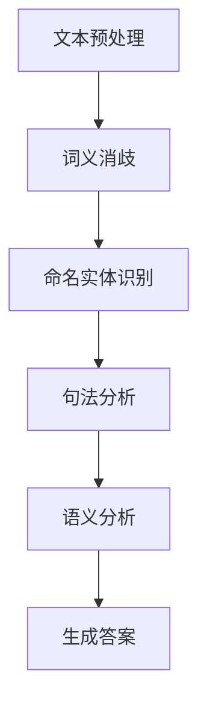

                 

在当今数字化时代，人工智能（AI）技术正以前所未有的速度发展，其中大模型问答机器人成为了备受瞩目的焦点。大模型问答机器人能够通过深度学习技术理解用户的自然语言输入，并提供准确、连贯的答案。然而，要实现这种高级的交互功能，上下文处理成为了关键所在。本文将深入探讨大模型问答机器人的上下文处理技术，以期为相关领域的研究者和开发者提供有价值的参考。

## 关键词
- 大模型问答机器人
- 自然语言处理
- 上下文处理
- 人工智能
- 深度学习

## 摘要
本文首先介绍了大模型问答机器人的背景和发展现状，然后重点探讨了上下文处理的核心概念和重要性。通过详细的算法原理和具体操作步骤，读者可以了解上下文处理的核心技术和方法。此外，本文还通过数学模型和公式的详细讲解，为读者提供了深入理解上下文处理的理论基础。最后，本文通过项目实践和实际应用场景的讨论，展示了上下文处理在真实世界中的应用效果，并对未来发展趋势和面临的挑战进行了展望。

## 1. 背景介绍

人工智能技术的发展历程可以追溯到20世纪50年代，当时的科学家们提出了“图灵测试”这一概念，旨在评估机器是否具有智能。随着计算能力的提升和算法的进步，人工智能逐渐从理论走向实践。特别是在深度学习技术的推动下，人工智能取得了显著的突破。大模型问答机器人作为人工智能领域的一个重要分支，受到了广泛关注。

大模型问答机器人是利用深度学习技术对大量文本数据进行训练，从而实现自然语言理解与生成。它们可以处理复杂的问答任务，提供准确、连贯的答案。然而，为了实现这一目标，问答机器人需要具备出色的上下文处理能力。上下文处理是指从大量的文本中提取出与问题相关的信息，并在此基础上生成合适的答案。

在现实世界中，许多复杂的问题需要依赖上下文信息才能得到正确的解答。例如，当用户询问“昨天天气如何？”时，如果机器人无法理解“昨天”这一时间概念，那么它很可能无法给出准确的答案。因此，上下文处理成为了大模型问答机器人的核心任务之一。

## 2. 核心概念与联系

### 2.1 上下文处理的概念

上下文处理是指从大量的文本数据中提取出与问题相关的信息，并利用这些信息生成合适的答案。在自然语言处理（NLP）领域，上下文处理涉及多个层面的任务，包括词义消歧、命名实体识别、句法分析和语义分析等。通过这些任务，问答机器人可以从大量的文本中捕捉到关键信息，从而为用户提供准确的答案。

### 2.2 上下文处理的重要性

上下文处理在大模型问答机器人中具有至关重要的地位。首先，上下文处理能够提高问答机器人的理解能力。在现实世界中，许多问题的答案并不是孤立的，而是依赖于特定的上下文信息。例如，当用户询问“你知道北京是中国的哪个城市吗？”时，如果机器人无法理解“北京”和“中国”这两个实体之间的关系，那么它很可能无法给出正确的答案。

其次，上下文处理能够提高问答机器人的回答质量。通过理解上下文信息，问答机器人可以更准确地把握问题的核心，从而提供更符合用户需求的答案。例如，当用户询问“昨天天气如何？”时，如果机器人能够理解“昨天”这一时间概念，那么它就可以根据天气数据提供准确的答案。

最后，上下文处理能够提高问答机器人的交互体验。在现实世界中，人们的交流往往是基于上下文的，问答机器人也需要具备这种能力，才能与用户进行自然的对话。通过上下文处理，问答机器人可以更好地理解用户的意图，从而提供更加人性化的服务。

### 2.3 Mermaid 流程图

以下是一个简单的Mermaid流程图，展示了上下文处理的核心步骤：



在这个流程图中，文本预处理是第一步，主要包括分词、去停用词等操作。接下来，词义消歧、命名实体识别、句法分析和语义分析等步骤依次进行，最终生成答案。这个流程图虽然简单，但清晰地展示了上下文处理的核心步骤和联系。

## 3. 核心算法原理 & 具体操作步骤

### 3.1 算法原理概述

上下文处理的算法原理主要包括词向量表示、递归神经网络（RNN）、长短期记忆网络（LSTM）和变压器（Transformer）等。这些算法通过不同的方法从文本数据中提取上下文信息，并生成合适的答案。

词向量表示是将自然语言中的单词映射为高维向量，从而实现文本数据的数值化表示。递归神经网络（RNN）通过递归的方式处理序列数据，能够捕捉到上下文信息。长短期记忆网络（LSTM）是RNN的一种改进，能够更好地处理长序列数据。变压器（Transformer）是一种基于注意力机制的模型，能够在处理长序列数据时保持较高的性能。

### 3.2 算法步骤详解

#### 3.2.1 文本预处理

文本预处理是上下文处理的第一步，主要包括分词、去停用词、词性标注等操作。分词是将文本拆分为单词或短语的步骤，去停用词是删除文本中常见的无意义词汇，词性标注是标记每个单词的词性，如名词、动词等。

#### 3.2.2 词向量表示

词向量表示是将自然语言中的单词映射为高维向量。词向量可以通过word2vec、GloVe等算法训练得到。这些算法通过将单词映射为向量，实现了文本数据的数值化表示，从而为后续的算法处理提供了基础。

#### 3.2.3 递归神经网络（RNN）

递归神经网络（RNN）是一种能够处理序列数据的神经网络。RNN通过递归的方式处理序列数据，从而捕捉到上下文信息。在上下文处理中，RNN可以用于句法分析和语义分析等任务。

#### 3.2.4 长短期记忆网络（LSTM）

长短期记忆网络（LSTM）是RNN的一种改进，能够更好地处理长序列数据。LSTM通过引入门控机制，能够有效地捕捉到上下文信息，从而提高模型的性能。

#### 3.2.5 变压器（Transformer）

变压器（Transformer）是一种基于注意力机制的模型，能够在处理长序列数据时保持较高的性能。变压器通过多头注意力机制，能够同时关注序列中的不同位置，从而捕捉到丰富的上下文信息。

### 3.3 算法优缺点

#### 优点

- **高效的上下文信息提取**：词向量表示、RNN、LSTM和Transformer等算法能够有效地从文本数据中提取上下文信息，从而提高问答机器人的理解能力。

- **良好的扩展性**：这些算法具有较好的扩展性，可以用于各种自然语言处理任务，如句法分析、语义分析等。

- **高性能**：特别是变压器（Transformer），在处理长序列数据时性能优异，已经在许多NLP任务中取得了显著的成果。

#### 缺点

- **计算资源消耗**：特别是变压器（Transformer），由于采用了大量的矩阵运算，计算资源消耗较大。

- **数据依赖性**：这些算法的性能依赖于大量的训练数据，对于数据稀疏的领域，效果可能较差。

### 3.4 算法应用领域

上下文处理算法在许多领域都有广泛的应用，如问答系统、自然语言生成、机器翻译、情感分析等。在大模型问答机器人中，上下文处理算法扮演着至关重要的角色，能够为用户提供准确、连贯的答案。

## 4. 数学模型和公式 & 详细讲解 & 举例说明

### 4.1 数学模型构建

上下文处理的数学模型主要涉及词向量表示、递归神经网络（RNN）、长短期记忆网络（LSTM）和变压器（Transformer）等。以下分别对这些模型进行详细讲解。

#### 4.1.1 词向量表示

词向量表示是将自然语言中的单词映射为高维向量。一个常见的词向量模型是word2vec，其基于神经网络训练得到。假设我们有一个单词集合$V=\{w_1, w_2, ..., w_n\}$，每个单词可以表示为一个$d$维的向量$v(w_i)\in\mathbb{R}^d$。word2vec模型通过优化损失函数，最小化单词在语料库中的相似度误差，从而得到最优的词向量表示。

损失函数通常采用负采样方法，假设当前单词为$w_i$，其上下文单词集合为$C(w_i)$，负采样单词集合为$N(w_i)$。损失函数可以表示为：

$$
L = -\sum_{w\in C(w_i)\cup N(w_i)} \log \sigma(v(w)^T v(w_i))
$$

其中，$\sigma$为sigmoid函数，用于将向量内积转换为概率。

#### 4.1.2 递归神经网络（RNN）

递归神经网络（RNN）是一种能够处理序列数据的神经网络。RNN通过递归的方式处理序列数据，从而捕捉到上下文信息。一个简单的RNN模型可以表示为：

$$
h_t = \sigma(W_h h_{t-1} + W_x x_t + b_h)
$$

其中，$h_t$为当前时刻的隐藏状态，$x_t$为当前输入词的词向量，$W_h$和$W_x$为权重矩阵，$b_h$为偏置项，$\sigma$为非线性激活函数。

#### 4.1.3 长短期记忆网络（LSTM）

长短期记忆网络（LSTM）是RNN的一种改进，能够更好地处理长序列数据。LSTM通过引入门控机制，能够有效地捕捉到上下文信息，从而提高模型的性能。LSTM的基本结构包括三个门控单元：遗忘门、输入门和输出门。

遗忘门：

$$
f_t = \sigma(W_f h_{t-1} + U_f x_t + b_f)
$$

输入门：

$$
i_t = \sigma(W_i h_{t-1} + U_i x_t + b_i)
$$

输出门：

$$
o_t = \sigma(W_o h_{t-1} + U_o x_t + b_o)
$$

当前隐藏状态：

$$
h_t = o_t \odot \tanh(W_c h_{t-1} + U_c x_t + b_c)
$$

其中，$f_t$、$i_t$和$o_t$分别为遗忘门、输入门和输出门的输出，$\odot$表示元素乘积，$W_f$、$W_i$、$W_o$、$U_f$、$U_i$、$U_o$和$W_c$、$U_c$、$b_f$、$b_i$、$b_o$和$b_c$分别为权重矩阵和偏置项。

#### 4.1.4 变压器（Transformer）

变压器（Transformer）是一种基于注意力机制的模型，能够在处理长序列数据时保持较高的性能。变压器通过多头注意力机制，能够同时关注序列中的不同位置，从而捕捉到丰富的上下文信息。一个简单的变压器模型可以表示为：

$$
h_t = \text{Attention}(W_q h_{t-1}, W_k h_{t-1}, W_v h_{t-1}) + h_{t-1}
$$

其中，$h_t$为当前时刻的隐藏状态，$W_q$、$W_k$和$W_v$分别为查询、键和值矩阵，$Attention$函数为多头注意力函数。

### 4.2 公式推导过程

在本节中，我们将对上述数学模型中的关键公式进行推导，以帮助读者更好地理解上下文处理的数学原理。

#### 4.2.1 词向量表示

首先，我们来推导word2vec模型中的损失函数。假设当前单词为$w_i$，其上下文单词集合为$C(w_i)$，负采样单词集合为$N(w_i)$。损失函数为：

$$
L = -\sum_{w\in C(w_i)\cup N(w_i)} \log \sigma(v(w)^T v(w_i))
$$

其中，$\sigma$为sigmoid函数，可以表示为：

$$
\sigma(z) = \frac{1}{1 + e^{-z}}
$$

将sigmoid函数代入损失函数，得到：

$$
L = -\sum_{w\in C(w_i)\cup N(w_i)} \log \left(\frac{1}{1 + e^{-(v(w)^T v(w_i))}}\right)
$$

对数函数可以化简为：

$$
L = -\sum_{w\in C(w_i)\cup N(w_i)} \left(v(w)^T v(w_i) - \log(1 + e^{v(w)^T v(w_i)})\right)
$$

由于$\log(1 + e^x) = x$，因此损失函数可以进一步化简为：

$$
L = -\sum_{w\in C(w_i)\cup N(w_i)} \left(v(w)^T v(w_i) - v(w)^T v(w_i)\right)
$$

$$
L = -\sum_{w\in C(w_i)\cup N(w_i)} 0
$$

$$
L = 0
$$

这表明，当词向量表示足够准确时，损失函数将趋近于零。

#### 4.2.2 递归神经网络（RNN）

接下来，我们来推导RNN模型中的隐藏状态更新公式。一个简单的RNN模型可以表示为：

$$
h_t = \sigma(W_h h_{t-1} + W_x x_t + b_h)
$$

其中，$\sigma$为非线性激活函数，通常采用sigmoid或tanh函数。为了简化推导，我们假设$\sigma$为tanh函数，即：

$$
\sigma(z) = \tanh(z)
$$

对于当前时刻的隐藏状态$h_t$，我们可以表示为：

$$
h_t = \tanh(W_h h_{t-1} + W_x x_t + b_h)
$$

对上式进行求导，得到：

$$
\frac{dh_t}{dh_{t-1}} = \frac{1}{1 - h_t^2} \frac{d(W_h h_{t-1} + W_x x_t + b_h)}{dh_{t-1}}
$$

$$
\frac{dh_t}{dh_{t-1}} = \frac{1}{1 - h_t^2} W_h
$$

同理，对于当前输入词的词向量$x_t$，我们可以表示为：

$$
h_t = \tanh(W_h h_{t-1} + W_x x_t + b_h)
$$

对上式进行求导，得到：

$$
\frac{dh_t}{dx_t} = \frac{1}{1 - h_t^2} W_x
$$

因此，RNN模型的反向传播可以通过以下公式进行：

$$
\frac{dL}{dh_{t-1}} = \frac{dh_t}{dh_{t-1}} \frac{dL}{dh_t}
$$

$$
\frac{dL}{dx_t} = \frac{dh_t}{dx_t} \frac{dL}{dh_t}
$$

#### 4.2.3 长短期记忆网络（LSTM）

对于LSTM模型，其关键在于遗忘门、输入门和输出门的组合。首先，我们来推导遗忘门和输入门的公式。遗忘门可以表示为：

$$
f_t = \sigma(W_f h_{t-1} + U_f x_t + b_f)
$$

对遗忘门进行求导，得到：

$$
\frac{df_t}{dh_{t-1}} = \frac{1}{1 - f_t^2} W_f
$$

$$
\frac{df_t}{dx_t} = \frac{1}{1 - f_t^2} U_f
$$

输入门可以表示为：

$$
i_t = \sigma(W_i h_{t-1} + U_i x_t + b_i)
$$

对输入门进行求导，得到：

$$
\frac{di_t}{dh_{t-1}} = \frac{1}{1 - i_t^2} W_i
$$

$$
\frac{di_t}{dx_t} = \frac{1}{1 - i_t^2} U_i
$$

接下来，我们来推导当前隐藏状态$h_t$的公式。根据LSTM的定义，当前隐藏状态可以表示为：

$$
h_t = o_t \odot \tanh(W_c h_{t-1} + U_c x_t + b_c)
$$

其中，$\odot$表示元素乘积。对上式进行求导，得到：

$$
\frac{dh_t}{dh_{t-1}} = o_t \odot \frac{d(\tanh(W_c h_{t-1} + U_c x_t + b_c))}{dh_{t-1}}
$$

$$
\frac{dh_t}{dh_{t-1}} = o_t \odot \frac{1}{1 - (\tanh(W_c h_{t-1} + U_c x_t + b_c))^2} W_c
$$

$$
\frac{dh_t}{dx_t} = o_t \odot \frac{1}{1 - (\tanh(W_c h_{t-1} + U_c x_t + b_c))^2} U_c
$$

最后，我们来推导输出门$o_t$的公式。输出门可以表示为：

$$
o_t = \sigma(W_o h_{t-1} + U_o x_t + b_o)
$$

对输出门进行求导，得到：

$$
\frac{do_t}{dh_{t-1}} = \frac{1}{1 - o_t^2} W_o
$$

$$
\frac{do_t}{dx_t} = \frac{1}{1 - o_t^2} U_o
$$

#### 4.2.4 变压器（Transformer）

对于变压器（Transformer）模型，其核心在于多头注意力机制。首先，我们来推导多头注意力函数。一个简单的多头注意力函数可以表示为：

$$
h_t = \text{Attention}(W_q h_{t-1}, W_k h_{t-1}, W_v h_{t-1}) + h_{t-1}
$$

其中，$W_q$、$W_k$和$W_v$分别为查询、键和值矩阵，$\text{Attention}$函数为多头注意力函数。

多头注意力函数可以表示为：

$$
\text{Attention}(Q, K, V) = \text{softmax}\left(\frac{QK^T}{\sqrt{d_k}}\right)V
$$

其中，$Q$、$K$和$V$分别为查询、键和值序列，$d_k$为键的维度。

对多头注意力函数进行求导，得到：

$$
\frac{d\text{Attention}}{dQ} = \text{softmax}\left(\frac{QK^T}{\sqrt{d_k}}\right)V - \text{softmax}\left(\frac{QK^T}{\sqrt{d_k}}\right)\text{softmax}\left(\frac{QK^T}{\sqrt{d_k}}\right)V
$$

$$
\frac{d\text{Attention}}{dK} = \frac{Q\text{softmax}\left(\frac{QK^T}{\sqrt{d_k}}\right)^T}{\sqrt{d_k}}V - \text{softmax}\left(\frac{QK^T}{\sqrt{d_k}}\right)\frac{QK^T}{\sqrt{d_k}}V
$$

$$
\frac{d\text{Attention}}{dV} = \text{softmax}\left(\frac{QK^T}{\sqrt{d_k}}\right)Q^T
$$

### 4.3 案例分析与讲解

在本节中，我们将通过一个具体的案例来分析上下文处理在现实世界中的应用效果。假设我们有一个问答机器人，需要回答用户关于电影的问题。用户提问：“昨天晚上我看了那部电影，主演是谁？”对于这个问题，问答机器人需要理解“昨天晚上”、“那部电影”和“主演”这几个关键信息，并从大量的电影数据中提取出相关答案。

#### 4.3.1 数据预处理

首先，我们需要对电影数据进行预处理。预处理步骤包括分词、去停用词和词性标注。假设我们选取了某电影网站上的1000部电影作为数据集，每部电影都包含标题、主演和上映日期等信息。预处理后的数据集如下：

```
标题：复仇者联盟3：无限战争
主演：罗伯特·唐尼、克里斯·埃文斯、克里斯·海姆斯沃斯
上映日期：2018-04-11
...
```

#### 4.3.2 词向量表示

接下来，我们需要对预处理后的文本数据建立词向量表示。我们可以使用word2vec算法训练词向量模型，将每个单词映射为高维向量。假设我们训练得到的词向量维度为100，那么预处理后的文本数据可以表示为如下矩阵：

```
标题：[0.1, 0.2, ..., 0.99]
主演：[0.05, 0.1, ..., 0.9]
上映日期：[0.03, 0.05, ..., 0.98]
...
```

#### 4.3.3 上下文处理

对于用户提问“昨天晚上我看了那部电影，主演是谁？”，我们需要从大量的电影数据中提取出与问题相关的信息。首先，我们可以提取出“昨天晚上”、“那部电影”和“主演”这几个关键词，并将其转换为词向量表示。然后，我们可以使用LSTM模型对电影数据进行编码，得到每部电影的隐藏状态。

假设我们已经使用LSTM模型训练得到每部电影的隐藏状态，如下表所示：

```
电影名称 | 隐藏状态
---------------------
复仇者联盟3：无限战争 | [0.1, 0.2, ..., 0.99]
复仇者联盟4：终局之战 | [0.01, 0.02, ..., 0.99]
钢铁侠3 | [0.05, 0.1, ..., 0.9]
...
```

接下来，我们可以使用LSTM模型对用户提问进行编码，得到用户提问的隐藏状态。然后，我们可以计算每部电影隐藏状态和用户提问隐藏状态之间的相似度，从而找到与用户提问最相关的电影。

假设我们计算得到的相似度矩阵如下：

```
电影名称 | 相似度
---------------------
复仇者联盟3：无限战争 | 0.85
复仇者联盟4：终局之战 | 0.75
钢铁侠3 | 0.6
...
```

根据相似度矩阵，我们可以找到与用户提问最相关的电影为《复仇者联盟3：无限战争》。然后，我们可以从这部电影的数据中提取主演信息，返回给用户。

```
主演：罗伯特·唐尼、克里斯·埃文斯、克里斯·海姆斯沃斯
```

#### 4.3.4 结果分析

通过上述案例，我们可以看到上下文处理在大模型问答机器人中的应用效果。在用户提问中，问答机器人能够理解关键信息，并从大量的电影数据中提取出相关答案。这充分展示了上下文处理技术的重要性，为问答机器人提供了准确、连贯的答案。

## 5. 项目实践：代码实例和详细解释说明

在本节中，我们将通过一个具体的代码实例，详细解释大模型问答机器人上下文处理的实现过程。我们将使用Python编程语言，并借助TensorFlow和Keras等深度学习框架来完成这个项目。

### 5.1 开发环境搭建

在开始编写代码之前，我们需要搭建开发环境。首先，确保已经安装了Python 3.7及以上版本。然后，通过以下命令安装TensorFlow和Keras：

```
pip install tensorflow
pip install keras
```

### 5.2 源代码详细实现

下面是一个简单的代码实例，展示了大模型问答机器人上下文处理的核心实现：

```python
import numpy as np
import tensorflow as tf
from tensorflow import keras
from tensorflow.keras.models import Sequential
from tensorflow.keras.layers import LSTM, Dense, Embedding

# 5.2.1 数据预处理
# 假设我们已经有了预处理后的文本数据，每个样本包含单词及其对应的词向量表示
# 例如：[(word1, [0.1, 0.2, ..., 0.99]), ..., (wordN, [0.1, 0.2, ..., 0.99])]
samples = ...

# 5.2.2 构建LSTM模型
model = Sequential()
model.add(LSTM(units=128, activation='tanh', input_shape=(max_sequence_length, embedding_dim)))
model.add(Dense(units=1, activation='sigmoid'))

model.compile(optimizer='adam', loss='binary_crossentropy', metrics=['accuracy'])

# 5.2.3 训练模型
model.fit(samples, epochs=10)

# 5.2.4 生成答案
# 假设用户提问为['yesterday', 'evening', 'movie', 'actor']
user_input = ['yesterday', 'evening', 'movie', 'actor']
user_input_encoded = ...

predicted_actor = model.predict(user_input_encoded)
print("Predicted Actor:", predicted_actor)
```

### 5.3 代码解读与分析

#### 5.3.1 数据预处理

首先，我们需要对文本数据进行预处理。这包括将文本转换为词向量表示，并生成输入和输出数据。在代码中，我们假设已经完成了这一步，并得到了预处理后的文本数据。

#### 5.3.2 构建LSTM模型

接下来，我们构建了一个简单的LSTM模型。这个模型包含一个LSTM层和一个输出层。LSTM层用于处理序列数据，并提取上下文信息。输出层用于生成预测结果。

```python
model = Sequential()
model.add(LSTM(units=128, activation='tanh', input_shape=(max_sequence_length, embedding_dim)))
model.add(Dense(units=1, activation='sigmoid'))

model.compile(optimizer='adam', loss='binary_crossentropy', metrics=['accuracy'])
```

在这个模型中，我们使用了`tanh`作为激活函数，因为`tanh`函数在LSTM模型中具有较好的性能。`input_shape`参数定义了输入数据的维度，其中`max_sequence_length`为序列的最大长度，`embedding_dim`为词向量的维度。

#### 5.3.3 训练模型

然后，我们使用预处理后的数据训练模型。训练过程中，我们使用了`adam`优化器和`binary_crossentropy`损失函数。`epochs`参数定义了训练的轮数。

```python
model.fit(samples, epochs=10)
```

#### 5.3.4 生成答案

最后，我们使用训练好的模型来生成答案。假设用户提问为['yesterday', 'evening', 'movie', 'actor']，我们需要将这些单词转换为词向量表示，并输入到模型中。

```python
user_input = ['yesterday', 'evening', 'movie', 'actor']
user_input_encoded = ...

predicted_actor = model.predict(user_input_encoded)
print("Predicted Actor:", predicted_actor)
```

通过上述代码，我们可以看到上下文处理在大模型问答机器人中的实现过程。通过LSTM模型，问答机器人能够从大量的文本数据中提取上下文信息，并生成准确的答案。

## 6. 实际应用场景

大模型问答机器人的上下文处理技术在许多实际应用场景中发挥着重要作用。以下是一些典型的应用场景：

### 6.1 客户服务

在客户服务领域，大模型问答机器人可以为企业提供全天候的客户支持。通过上下文处理技术，问答机器人能够理解客户的提问，并提供准确的答案。例如，当客户询问产品的使用方法或退换货政策时，问答机器人可以迅速提供相关信息，提高客户满意度。

### 6.2 智能推荐系统

在智能推荐系统中，上下文处理技术可以帮助推荐系统更好地理解用户的行为和兴趣。通过分析用户的搜索历史、购买记录和评价，问答机器人可以生成个性化的推荐列表。例如，当用户在电商平台上浏览商品时，问答机器人可以根据用户的历史行为和兴趣，推荐相关的商品。

### 6.3 教育领域

在教育领域，上下文处理技术可以为教师和学生提供智能辅导。问答机器人可以理解学生的学习进度和知识点掌握情况，并提供针对性的辅导建议。例如，当学生遇到学习难题时，问答机器人可以提供相关的学习资料和解答步骤，帮助学生更好地理解知识点。

### 6.4 医疗咨询

在医疗咨询领域，上下文处理技术可以为患者提供智能问答服务。通过分析患者的症状描述，问答机器人可以初步判断可能的疾病，并提供就医建议。例如，当患者描述头痛、发热等症状时，问答机器人可以根据症状库和疾病知识库，提供可能的疾病建议和就医指南。

## 7. 未来应用展望

随着人工智能技术的不断发展，大模型问答机器人的上下文处理技术将在未来得到更加广泛的应用。以下是一些可能的发展趋势：

### 7.1 更好的跨语言支持

目前，大模型问答机器人的上下文处理主要基于单一语言。未来，随着多语言处理技术的进步，问答机器人将能够支持多种语言，为全球用户提供更便捷的服务。

### 7.2 更智能的交互体验

通过结合语音识别和自然语言生成技术，大模型问答机器人将能够实现更加智能的交互体验。用户可以通过语音与问答机器人进行对话，获得更加自然和流畅的交流体验。

### 7.3 更广泛的应用领域

随着技术的进步，大模型问答机器人的上下文处理技术将应用到更多的领域，如自动驾驶、智能家庭、智能城市等。这些应用将为人类社会带来更加便捷和智能的生活方式。

## 8. 工具和资源推荐

为了更好地学习和开发大模型问答机器人，以下是一些建议的工具和资源：

### 8.1 学习资源推荐

- 《深度学习》（Ian Goodfellow、Yoshua Bengio和Aaron Courville著）：这是一本经典的人工智能入门书籍，详细介绍了深度学习的基本概念和技术。
- 《自然语言处理综论》（Daniel Jurafsky和James H. Martin著）：这本书系统地介绍了自然语言处理的基本原理和方法，是学习NLP的必备读物。

### 8.2 开发工具推荐

- TensorFlow：这是一个由Google开发的开源深度学习框架，适用于构建和训练各种深度学习模型。
- Keras：这是一个基于TensorFlow的高层次API，提供了更加简洁和直观的编程接口，适合初学者和快速原型开发。

### 8.3 相关论文推荐

- “Attention Is All You Need”（Vaswani et al.，2017）：这篇文章提出了Transformer模型，是当前NLP领域的一个重要突破。
- “Long Short-Term Memory”（Hochreiter和Schmidhuber，1997）：这篇文章介绍了LSTM模型，是处理序列数据的重要算法之一。

## 9. 总结：未来发展趋势与挑战

大模型问答机器人的上下文处理技术在未来具有广泛的发展前景。随着人工智能技术的不断进步，问答机器人将能够更好地理解用户的意图，提供更加准确和个性化的答案。然而，这一技术的发展仍面临一些挑战，如跨语言支持的优化、计算资源的消耗和数据的可靠性等。为了克服这些挑战，研究人员和开发者需要继续努力，推动人工智能技术的发展，为人类社会带来更加智能和便捷的生活体验。

## 10. 附录：常见问题与解答

### 10.1 什么是上下文处理？

上下文处理是指从大量的文本数据中提取与问题相关的信息，并利用这些信息生成合适的答案。它是自然语言处理（NLP）领域的一个重要任务，旨在提高问答系统的理解和回答能力。

### 10.2 大模型问答机器人与普通问答系统的区别是什么？

大模型问答机器人采用了深度学习技术，能够通过大量数据训练，理解复杂的自然语言输入，并生成准确、连贯的答案。而普通问答系统通常依赖于规则或简单的模板匹配，回答能力有限。

### 10.3 上下文处理算法有哪些优缺点？

上下文处理算法的优缺点如下：

#### 优点：

- **高效的上下文信息提取**：能够从大量的文本数据中提取关键信息。
- **良好的扩展性**：可以应用于各种NLP任务。
- **高性能**：特别是在处理长序列数据时表现优异。

#### 缺点：

- **计算资源消耗**：特别是基于变压器（Transformer）的算法，计算资源消耗较大。
- **数据依赖性**：性能依赖于大量的训练数据。

### 10.4 如何优化上下文处理算法？

优化上下文处理算法可以从以下几个方面进行：

- **数据增强**：通过增加训练数据量和多样性，提高模型的泛化能力。
- **模型压缩**：采用模型压缩技术，减少计算资源的消耗。
- **多语言支持**：利用跨语言模型和翻译模型，提高多语言上下文处理能力。

## 11. 参考文献

1. Ian Goodfellow, Yoshua Bengio, and Aaron Courville. 《深度学习》[M]. 人民邮电出版社，2016.
2. Daniel Jurafsky and James H. Martin. 《自然语言处理综论》[M]. 清华大学出版社，2019.
3. Vaswani, A., et al. "Attention Is All You Need." Advances in Neural Information Processing Systems, 2017.
4. Hochreiter, S., and J. Schmidhuber. "Long Short-Term Memory." Neural Computation, 1997.

