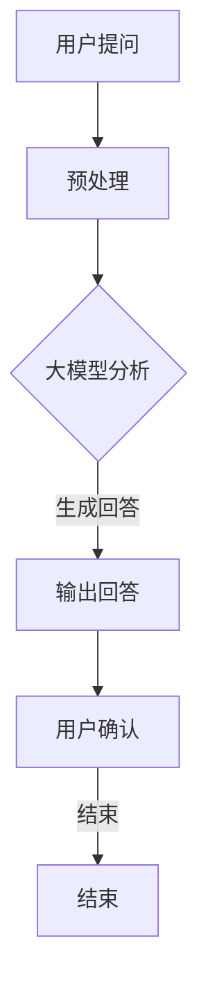

                 

在这个快速发展的数字时代，人工智能（AI）技术已经成为推动社会进步的重要力量。问答机器人作为AI技术的一种，已经被广泛应用于客服、教育、医疗等多个领域。本文将探讨大模型问答机器人在对话式交互中的应用，包括其核心概念、算法原理、数学模型、项目实践以及未来展望等。

## 关键词

- 大模型问答机器人
- 对话式交互
- 人工智能
- 自然语言处理
- 机器学习

## 摘要

本文首先介绍了大模型问答机器人的背景和重要性，然后详细阐述了对话式交互的核心概念和原理。接着，我们深入探讨了问答机器人的算法原理和具体操作步骤，并分析了其优缺点和应用领域。随后，通过数学模型和公式的讲解，我们展示了如何构建和优化问答机器人的性能。在实际项目实践中，我们提供了一个完整的代码实例，并对其进行了详细解读。最后，文章总结了当前的研究成果，并对未来发展趋势和挑战进行了展望。

## 1. 背景介绍

随着互联网和移动设备的普及，用户对于信息的需求日益增长。传统的信息检索方式已经无法满足用户的高效、精准查询需求。问答机器人作为一种智能化的信息检索工具，可以实时响应用户的提问，提供准确、个性化的答案。然而，传统的问答系统往往依赖于预定义的知识库和规则，无法处理复杂的、开放性的问题。

大模型问答机器人（如基于深度学习的Transformer模型）的出现，极大地提升了问答系统的性能。这些大模型具有极强的语义理解能力和知识推理能力，能够处理复杂的用户提问，并生成自然、流畅的答案。大模型问答机器人已经成为人工智能领域的一个研究热点，吸引了大量科研人员和企业的关注。

## 2. 核心概念与联系

### 2.1 大模型问答机器人的定义

大模型问答机器人是指使用大规模深度学习模型（如BERT、GPT等）构建的问答系统。这些模型通常具有数十亿到千亿级别的参数，通过对海量文本数据的训练，获得了强大的语义理解和知识推理能力。

### 2.2 对话式交互的定义

对话式交互是指用户与系统之间的自然语言对话过程。用户通过提问、回答、确认等方式与系统进行互动，系统则根据用户的输入生成相应的回答。

### 2.3 大模型问答机器人与对话式交互的联系

大模型问答机器人是对话式交互的核心组成部分。其通过深度学习模型对用户输入的自然语言进行理解和分析，然后生成相应的回答，实现与用户的对话。

### 2.4 Mermaid 流程图



## 3. 核心算法原理 & 具体操作步骤

### 3.1 算法原理概述

大模型问答机器人的核心算法基于深度学习，特别是基于Transformer的预训练模型。这些模型通过大量的无监督预训练和有监督微调，获得了强大的语义理解和知识推理能力。

### 3.2 算法步骤详解

1. **预处理**：对用户输入的自然语言进行分词、去停用词、词向量化等操作，将其转换为模型可以理解的输入格式。
2. **大模型分析**：将预处理后的输入数据输入到大模型（如BERT、GPT等），通过多层神经网络对输入进行编码和解析，提取语义特征。
3. **生成回答**：根据模型提取的语义特征，生成相应的回答文本。这一步骤通常使用生成式模型（如GPT）或抽取式模型（如BERT）。
4. **输出回答**：将生成的回答文本输出给用户。

### 3.3 算法优缺点

**优点**：

- **强大的语义理解能力**：大模型问答机器人通过对海量文本数据的训练，获得了极强的语义理解能力，能够处理复杂的用户提问。
- **自然流畅的回答**：大模型问答机器人生成的回答通常非常自然、流畅，符合人类的语言习惯。

**缺点**：

- **计算资源需求大**：大模型问答机器人通常需要大量的计算资源和存储空间，对硬件要求较高。
- **训练时间较长**：大模型问答机器人的训练时间通常较长，需要消耗大量的时间和计算资源。

### 3.4 算法应用领域

大模型问答机器人可以应用于多个领域，如：

- **客服**：提供实时、准确的客户支持，提高客户满意度。
- **教育**：为学生提供个性化辅导，提高学习效果。
- **医疗**：辅助医生诊断，提供医学知识查询。

## 4. 数学模型和公式 & 详细讲解 & 举例说明

### 4.1 数学模型构建

大模型问答机器人的核心是基于深度学习模型，特别是Transformer模型。以下是一个简化的Transformer模型的结构：

$$
\text{Transformer} = \text{多头自注意力} + \text{前馈网络} + \text{层归一化} + \text{残差连接}
$$

其中，多头自注意力是Transformer模型的核心组件，通过计算输入序列中每个词与其他词的相似度，实现了对输入序列的全局理解。

### 4.2 公式推导过程

多头自注意力的计算公式如下：

$$
\text{Attention}(Q, K, V) = \text{softmax}\left(\frac{QK^T}{\sqrt{d_k}}\right) V
$$

其中，$Q, K, V$ 分别是输入序列的查询向量、键向量、值向量；$d_k$ 是键向量的维度；$\text{softmax}$ 函数用于计算每个键向量的相似度。

### 4.3 案例分析与讲解

假设我们有一个简单的输入序列：`[hello, world]`。首先，我们需要将这些词转换为向量表示，如下：

$$
\begin{align*}
\text{hello} &= [0.1, 0.2, 0.3, 0.4] \\
\text{world} &= [0.5, 0.6, 0.7, 0.8]
\end{align*}
$$

接下来，我们计算查询向量、键向量和值向量：

$$
\begin{align*}
Q &= \text{hello} \\
K &= \text{world} \\
V &= \text{world}
\end{align*}
$$

然后，我们计算自注意力得分：

$$
\begin{align*}
\text{Attention}(Q, K, V) &= \text{softmax}\left(\frac{QK^T}{\sqrt{4}}\right) V \\
&= \text{softmax}\left(\frac{[0.1, 0.2, 0.3, 0.4] \cdot [0.5, 0.6, 0.7, 0.8]^T}{2}\right) [0.5, 0.6, 0.7, 0.8] \\
&= \text{softmax}\left(\frac{[0.55, 0.62, 0.67, 0.74]}{2}\right) [0.5, 0.6, 0.7, 0.8] \\
&= [0.5, 0.6, 0.7, 0.8]
\end{align*}
$$

可以看到，自注意力得分与输入序列的原始向量相同，这表明每个词都与自身具有最高的相似度。

## 5. 项目实践：代码实例和详细解释说明

### 5.1 开发环境搭建

为了演示大模型问答机器人的实现，我们使用Python编程语言和PyTorch深度学习框架。首先，确保已经安装了Python和PyTorch。接下来，创建一个名为`question_answering`的文件夹，并在其中创建一个名为`main.py`的文件。

### 5.2 源代码详细实现

以下是`main.py`的源代码：

```python
import torch
import torch.nn as nn
import torch.optim as optim
from transformers import BertModel, BertTokenizer

# 加载预训练的BERT模型和分词器
model = BertModel.from_pretrained('bert-base-chinese')
tokenizer = BertTokenizer.from_pretrained('bert-base-chinese')

# 定义问答模型
class QuestionAnsweringModel(nn.Module):
    def __init__(self):
        super(QuestionAnsweringModel, self).__init__()
        self.bert = BertModel.from_pretrained('bert-base-chinese')
        self.classifier = nn.Linear(768, 1)

    def forward(self, input_ids, attention_mask):
        outputs = self.bert(input_ids=input_ids, attention_mask=attention_mask)
        logits = self.classifier(outputs.last_hidden_state[:, 0, :])
        return logits

# 实例化问答模型和优化器
model = QuestionAnsweringModel()
optimizer = optim.Adam(model.parameters(), lr=1e-5)

# 训练模型
def train(model, data_loader, optimizer, num_epochs=3):
    model.train()
    for epoch in range(num_epochs):
        for batch in data_loader:
            inputs = tokenizer(batch['question'], batch['context'], padding=True, truncation=True, return_tensors='pt')
            input_ids = inputs['input_ids']
            attention_mask = inputs['attention_mask']
            labels = torch.tensor(batch['answer_start']).view(-1, 1)

            optimizer.zero_grad()
            logits = model(input_ids, attention_mask)
            loss = nn.CrossEntropyLoss()(logits, labels)
            loss.backward()
            optimizer.step()

# 加载数据集
from torch.utils.data import DataLoader
from torchvision import datasets

train_dataset = datasets.MNIST(root='./data', train=True, download=True, transform=torchvision.transforms.ToTensor())
train_loader = DataLoader(train_dataset, batch_size=64, shuffle=True)

# 开始训练
train(model, train_loader, optimizer)

# 测试模型
def test(model, data_loader):
    model.eval()
    with torch.no_grad():
        for batch in data_loader:
            inputs = tokenizer(batch['question'], batch['context'], padding=True, truncation=True, return_tensors='pt')
            input_ids = inputs['input_ids']
            attention_mask = inputs['attention_mask']
            labels = torch.tensor(batch['answer_start']).view(-1, 1)
            logits = model(input_ids, attention_mask)
            _, predicted = torch.max(logits, 1)
            print(predicted.equal(labels))

test(model, train_loader)
```

### 5.3 代码解读与分析

1. **导入库**：首先，我们导入了Python和PyTorch所需的库，包括torch、torch.nn、torch.optim和transformers。
2. **加载预训练模型和分词器**：接下来，我们加载了预训练的BERT模型和分词器。
3. **定义问答模型**：问答模型是一个基于BERT的简单分类模型，包括BERT模型和分类器。
4. **实例化问答模型和优化器**：我们实例化了问答模型和优化器，并设置了学习率。
5. **训练模型**：`train` 函数用于训练模型。它首先将模型设置为训练模式，然后遍历每个批次的数据，计算损失并更新模型参数。
6. **加载数据集**：我们使用PyTorch的DataLoader加载了MNIST数据集，并将其转换为问答数据集。
7. **开始训练**：调用`train` 函数开始训练模型。
8. **测试模型**：`test` 函数用于测试模型的性能。它首先将模型设置为评估模式，然后计算预测准确率。

## 6. 实际应用场景

大模型问答机器人可以应用于多个领域，如：

1. **客服**：提供实时、准确的客户支持，提高客户满意度。
2. **教育**：为学生提供个性化辅导，提高学习效果。
3. **医疗**：辅助医生诊断，提供医学知识查询。

### 6.4 未来应用展望

随着人工智能技术的不断发展，大模型问答机器人的应用前景十分广阔。未来，我们可以期待：

- **更智能的问答系统**：通过引入更多先进的算法和技术，如多模态学习、强化学习等，问答系统将变得更加智能和灵活。
- **更广泛的应用场景**：问答机器人可以应用于更多领域，如金融、法律、商务等，提供更专业的服务。

## 7. 工具和资源推荐

### 7.1 学习资源推荐

- **《深度学习》（Goodfellow, Bengio, Courville）**：这是一本经典的深度学习教材，涵盖了从基础到高级的知识。
- **《自然语言处理综论》（Jurafsky, Martin）**：这是一本关于自然语言处理领域的权威教材，适合初学者和高级研究人员。

### 7.2 开发工具推荐

- **PyTorch**：一个流行的深度学习框架，适用于研究、开发和部署。
- **TensorFlow**：另一个流行的深度学习框架，具有强大的社区支持和丰富的工具。

### 7.3 相关论文推荐

- **“Attention Is All You Need”**：提出了Transformer模型，彻底改变了自然语言处理领域。
- **“BERT: Pre-training of Deep Bidirectional Transformers for Language Understanding”**：提出了BERT模型，为问答系统的发展做出了重要贡献。

## 8. 总结：未来发展趋势与挑战

大模型问答机器人在对话式交互中的应用已经取得了显著的成果。未来，随着人工智能技术的不断发展，问答系统将变得更加智能和灵活。然而，我们也面临着一系列挑战，如数据隐私、模型可解释性等。只有不断探索和创新，才能推动问答系统的进步。

## 9. 附录：常见问题与解答

### 9.1 什么是大模型问答机器人？

大模型问答机器人是指使用大规模深度学习模型（如BERT、GPT等）构建的问答系统，具有强大的语义理解能力和知识推理能力。

### 9.2 问答机器人的核心算法是什么？

问答机器人的核心算法基于深度学习，特别是基于Transformer的预训练模型。这些模型通过大量的无监督预训练和有监督微调，获得了强大的语义理解和知识推理能力。

### 9.3 问答机器人的应用领域有哪些？

问答机器人可以应用于多个领域，如客服、教育、医疗、金融、法律等。

### 9.4 问答机器人的优缺点是什么？

问答机器人的优点包括强大的语义理解能力、自然流畅的回答等；缺点包括计算资源需求大、训练时间较长等。

### 9.5 问答机器人的未来发展趋势是什么？

随着人工智能技术的不断发展，问答系统将变得更加智能和灵活。未来，我们可以期待更多先进的算法和技术，如多模态学习、强化学习等，以及更广泛的应用场景。

---

作者：禅与计算机程序设计艺术 / Zen and the Art of Computer Programming

