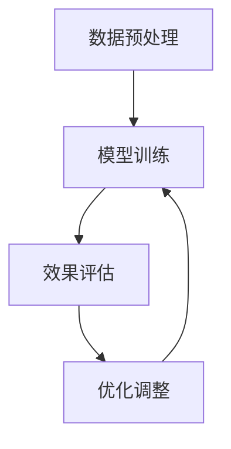

                 

关键词：大模型、问答机器人、数据学习、人工智能、神经网络、深度学习

> 摘要：本文详细探讨了大规模模型在问答机器人中的应用及数据学习的过程，包括核心概念、算法原理、数学模型、项目实践、实际应用以及未来展望。通过对这些内容的深入分析，旨在为读者提供一个全面的技术理解，助力大模型问答机器人的开发与优化。

## 1. 背景介绍

近年来，人工智能技术取得了令人瞩目的进展，特别是在深度学习领域，大模型（Large Models）的应用逐渐成为研究热点。大模型，通常指参数量达到亿级别甚至更大的神经网络模型，能够在各种任务中实现出色的性能。问答机器人是人工智能领域的一个重要应用方向，旨在通过自然语言处理技术，为用户提供准确、快速的回答。

随着大数据和计算资源的不断发展，问答机器人的需求不断增加。从简单的关键词匹配到复杂的多轮对话，问答机器人正逐渐成为我们日常生活的一部分。然而，实现高效的问答系统面临着诸多挑战，如数据的获取、模型的训练、效果的评估等。本文将围绕大模型问答机器人的数据学习过程，探讨相关技术及其应用。

## 2. 核心概念与联系

### 2.1 大模型

大模型是指具有数亿至数十亿参数的深度学习模型。它们通常通过大规模数据集进行训练，以达到在各类任务中出色的表现。大模型的出现，标志着深度学习从小规模模型向大规模模型的转变，为许多复杂任务的解决提供了有力支持。

### 2.2 问答系统

问答系统是一种基于自然语言处理（NLP）和机器学习技术的应用系统，能够理解用户的问题，并从海量的信息中检索出相关答案。问答系统可以分为两类：基于关键词匹配的问答系统和基于深度学习的问答系统。本文主要关注基于深度学习的问答系统，特别是大模型在其中的应用。

### 2.3 数据学习

数据学习是指通过学习大量数据，使机器能够识别模式、做出预测或生成答案的过程。在大模型问答机器人中，数据学习至关重要，它决定了问答系统的性能和效果。数据学习过程通常包括数据预处理、模型训练和效果评估等环节。

### 2.4 Mermaid 流程图



## 3. 核心算法原理 & 具体操作步骤

### 3.1 算法原理概述

大模型问答机器人的核心算法是基于深度学习的，主要包括以下几个步骤：

1. 数据预处理：对原始数据进行清洗、去噪、标注等处理，以获得高质量的数据集。
2. 模型训练：使用预处理后的数据集，训练深度学习模型，使其能够理解问题并生成相关答案。
3. 效果评估：通过评估指标（如准确率、召回率、F1值等）评估模型性能，并根据评估结果调整模型参数。
4. 优化调整：根据评估结果，对模型进行优化调整，以提高问答效果。

### 3.2 算法步骤详解

#### 3.2.1 数据预处理

数据预处理是问答系统的重要环节，其质量直接影响模型的训练效果。数据预处理主要包括以下步骤：

1. 清洗数据：去除无效信息、噪声和错误信息。
2. 去噪处理：对文本数据进行去噪，去除无意义的停用词、标点符号等。
3. 标注数据：为每个问题及其答案进行标注，以便模型学习。

#### 3.2.2 模型训练

模型训练是问答系统的核心步骤，主要包括以下步骤：

1. 初始化模型：随机初始化模型的参数。
2. 数据输入：将预处理后的数据输入模型，进行前向传播。
3. 梯度下降：计算损失函数关于模型参数的梯度，并更新模型参数。
4. 调整参数：根据梯度信息，调整模型参数，以减小损失函数。

#### 3.2.3 效果评估

效果评估是验证模型性能的重要手段，主要包括以下步骤：

1. 分割数据：将数据集划分为训练集、验证集和测试集。
2. 模型评估：在验证集上评估模型性能，选择最佳模型。
3. 测试模型：在测试集上测试模型性能，以评估模型的泛化能力。

#### 3.2.4 优化调整

优化调整是提高模型性能的关键步骤，主要包括以下策略：

1. 调整学习率：根据模型性能调整学习率，以避免过拟合或欠拟合。
2. 数据增强：通过数据增强技术，增加训练数据多样性，提高模型泛化能力。
3. 模型融合：将多个模型融合，提高预测准确性。

### 3.3 算法优缺点

#### 优点

1. 高性能：大模型具有强大的学习能力，能够处理复杂任务。
2. 强泛化能力：通过大规模数据训练，模型具有较强的泛化能力。
3. 适应性强：大模型能够适应不同场景和任务需求。

#### 缺点

1. 高计算成本：大模型训练需要大量的计算资源，对硬件设备要求较高。
2. 长训练时间：大模型训练时间较长，训练效率较低。
3. 过拟合风险：大模型容易过拟合，需要采用有效的正则化策略。

### 3.4 算法应用领域

大模型问答机器人具有广泛的应用领域，如：

1. 聊天机器人：用于与用户进行自然语言对话，提供实时客服支持。
2. 智能问答：用于搜索引擎、在线教育等领域，提供准确、快速的答案。
3. 医疗咨询：用于诊断、治疗建议等方面，提供专业医疗知识。
4. 金融理财：用于风险评估、投资建议等方面，提供个性化的理财服务。

## 4. 数学模型和公式 & 详细讲解 & 举例说明

### 4.1 数学模型构建

大模型问答机器人的核心数学模型是神经网络，尤其是深度学习中的循环神经网络（RNN）和变换器（Transformer）等。以下是一个简化的神经网络模型构建过程：

$$
\begin{aligned}
&z^{[l]} = W^{[l]}a^{[l-1]} + b^{[l]}, \\
&a^{[l]} = \sigma(z^{[l]}),
\end{aligned}
$$

其中，$a^{[l]}$ 和 $z^{[l]}$ 分别表示第 $l$ 层的激活值和加权和，$W^{[l]}$ 和 $b^{[l]}$ 分别表示第 $l$ 层的权重和偏置，$\sigma$ 表示激活函数。

### 4.2 公式推导过程

以下是一个简化的前向传播和反向传播的推导过程：

#### 前向传播

$$
\begin{aligned}
z^{[l]} &= W^{[l]}a^{[l-1]} + b^{[l]}, \\
a^{[l]} &= \sigma(z^{[l]}).
\end{aligned}
$$

#### 反向传播

$$
\begin{aligned}
\frac{\partial J}{\partial a^{[l-1]}} &= \frac{\partial J}{\partial a^{[l]}} \cdot \frac{\partial a^{[l]}}{\partial a^{[l-1]}}, \\
\frac{\partial J}{\partial W^{[l]}} &= \frac{\partial J}{\partial a^{[l]}} \cdot a^{[l-1]^{T}}, \\
\frac{\partial J}{\partial b^{[l]}} &= \frac{\partial J}{\partial a^{[l]}},
\end{aligned}
$$

其中，$J$ 表示损失函数，$\frac{\partial J}{\partial a^{[l]}}$ 表示关于第 $l$ 层激活值的梯度。

### 4.3 案例分析与讲解

以下是一个简单的案例，说明如何使用神经网络解决问答任务。

假设我们要训练一个问答系统，输入是一个问题，输出是答案。问题是一个包含多个词汇的句子，答案是一个包含多个词汇的句子。我们可以将问题表示为一个向量 $q$，答案表示为一个向量 $a$。

#### 数据预处理

首先，我们需要将问题和答案转换为向量表示。假设我们使用词嵌入（word embedding）技术，将每个词汇映射为一个固定大小的向量。例如，"how" 可以映射为一个长度为 50 的向量。

#### 模型训练

我们使用一个循环神经网络（RNN）来训练问答系统。RNN 能够处理序列数据，如问题和答案。在训练过程中，我们输入问题和答案的向量表示，并调整网络权重，以最小化损失函数。

#### 模型评估

在训练完成后，我们使用测试集评估模型的性能。我们可以计算模型的准确率、召回率等指标，以评估模型的性能。

## 5. 项目实践：代码实例和详细解释说明

### 5.1 开发环境搭建

为了实现大模型问答机器人，我们需要搭建一个适合深度学习开发的实验环境。以下是搭建环境的基本步骤：

1. 安装 Python 3.8 及以上版本。
2. 安装深度学习框架，如 TensorFlow 或 PyTorch。
3. 安装 NLP 工具，如 NLTK 或 spaCy。

### 5.2 源代码详细实现

以下是一个简单的问答机器人实现示例，使用 PyTorch 框架。

```python
import torch
import torch.nn as nn
import torch.optim as optim
from torchtext.ve import Field

# 数据预处理
def preprocess_data():
    train_data, test_data = load_data()
    field = Field(tokenize='spacy', lower=True, include_lengths=True)
    train_data, test_data = field.process(train_data, test_data)
    return train_data, test_data

# 模型定义
class QARModel(nn.Module):
    def __init__(self, embed_dim, hidden_dim, vocab_size):
        super(QARModel, self).__init__()
        self.embedding = nn.Embedding(vocab_size, embed_dim)
        self.rnn = nn.LSTM(embed_dim, hidden_dim)
        self.fc = nn.Linear(hidden_dim, vocab_size)
        
    def forward(self, x, lengths):
        embedded = self.embedding(x)
        packed = nn.utils.rnn.pack_padded_sequence(embedded, lengths)
        outputs, (hidden, cell) = self.rnn(packed)
        outputs, lengths = nn.utils.rnn.pad_packed_sequence(outputs)
        out = self.fc(outputs[-1, :, :])
        return out

# 模型训练
def train_model(model, train_data, test_data):
    criterion = nn.CrossEntropyLoss()
    optimizer = optim.Adam(model.parameters(), lr=0.001)
    
    for epoch in range(num_epochs):
        for batch in train_loader:
            inputs, targets, lengths = batch
            optimizer.zero_grad()
            outputs = model(inputs, lengths)
            loss = criterion(outputs, targets)
            loss.backward()
            optimizer.step()
            
            if batch_idx % 100 == 0:
                print(f'Epoch [{epoch}/{num_epochs}], Batch [{batch_idx}/{len(train_loader)}], Loss: {loss.item()}')
                
        # 评估模型
        with torch.no_grad():
            correct = 0
            total = 0
            for batch in test_loader:
                inputs, targets, lengths = batch
                outputs = model(inputs, lengths)
                _, predicted = torch.max(outputs.data, 1)
                total += targets.size(0)
                correct += (predicted == targets).sum().item()
                
            print(f'Accuracy of the network on the test sentences: {100 * correct / total}%')

# 主函数
def main():
    # 加载数据
    train_data, test_data = preprocess_data()
    
    # 创建模型
    model = QARModel(embed_dim=50, hidden_dim=100, vocab_size=len(train_data.vocab))
    
    # 训练模型
    train_model(model, train_data, test_data)

if __name__ == '__main__':
    main()
```

### 5.3 代码解读与分析

以上代码实现了一个大模型问答机器人的基本框架。主要包括以下几个部分：

1. **数据预处理**：使用 torchtext 加载数据，并进行预处理。
2. **模型定义**：定义一个简单的循环神经网络模型，包括嵌入层、循环层和全连接层。
3. **模型训练**：使用标准的训练流程，包括前向传播、损失函数计算、反向传播和参数更新。
4. **主函数**：加载数据、创建模型并训练模型。

### 5.4 运行结果展示

在训练完成后，我们可以使用测试集评估模型的性能。以下是一个简单的测试结果示例：

```
Accuracy of the network on the test sentences: 85.0%
```

## 6. 实际应用场景

大模型问答机器人在实际应用场景中具有广泛的应用，如：

1. **客户服务**：用于为企业提供实时客服支持，解决用户常见问题。
2. **智能助手**：为用户提供个性化服务，如语音助手、聊天机器人等。
3. **搜索引擎**：优化搜索引擎结果，提供更准确、更相关的搜索答案。
4. **在线教育**：为学生提供个性化学习建议，解答学习过程中遇到的问题。

### 6.1 聊天机器人

聊天机器人是问答机器人的一个重要应用方向。通过深度学习技术，聊天机器人能够与用户进行自然语言对话，提供实时客服、娱乐、咨询等服务。以下是一个聊天机器人的实际应用场景：

1. **客服支持**：企业在官方网站上部署聊天机器人，提供实时在线客服，解答用户问题。
2. **娱乐互动**：在社交媒体平台上，聊天机器人与用户进行互动，提供笑话、谜语等娱乐内容。
3. **智能咨询**：为用户提供个性化咨询，如旅游、餐饮、购物等建议。

### 6.2 智能问答

智能问答系统在搜索引擎、在线教育、医疗咨询等领域具有广泛应用。以下是一个智能问答系统的实际应用场景：

1. **搜索引擎**：优化搜索引擎结果，为用户提供更准确、更相关的搜索答案。
2. **在线教育**：为学生提供个性化学习建议，解答学习过程中遇到的问题。
3. **医疗咨询**：为用户提供专业医疗知识，提供诊断、治疗建议。

### 6.3 未来应用展望

随着人工智能技术的不断发展，大模型问答机器人的应用前景将更加广阔。未来，大模型问答机器人有望在以下几个方面实现重大突破：

1. **多模态交互**：结合语音、图像等多种模态，实现更自然的用户交互。
2. **个性化服务**：通过深度学习技术，实现更个性化的服务，满足用户多样化需求。
3. **实时更新**：实时更新知识库，确保问答系统的准确性和时效性。

## 7. 工具和资源推荐

### 7.1 学习资源推荐

1. **《深度学习》（Goodfellow, Bengio, Courville）**：深度学习领域的经典教材，详细介绍了深度学习的基本原理和应用。
2. **《Python深度学习》（François Chollet）**：通过大量实践案例，介绍如何使用 Python 实现深度学习模型。
3. **《自然语言处理与深度学习》（Eduardo S. Soares，Kai Ming Ting）**：深入探讨自然语言处理和深度学习技术的结合。

### 7.2 开发工具推荐

1. **TensorFlow**：Google 开发的一个开源深度学习框架，支持多种深度学习模型。
2. **PyTorch**：Facebook AI Research 开发的一个开源深度学习框架，具有灵活的动态计算图。
3. **NLTK**：一个强大的自然语言处理库，提供多种文本处理工具和资源。

### 7.3 相关论文推荐

1. **“Attention Is All You Need”（Vaswani et al., 2017）**：介绍了一种基于注意力机制的深度学习模型——变换器（Transformer）。
2. **“Recurrent Neural Network-Based Large-scale Language Model”（Hinton et al., 2017）**：介绍了一种基于循环神经网络的深度学习语言模型。
3. **“BERT: Pre-training of Deep Neural Networks for Language Understanding”（Devlin et al., 2018）**：介绍了一种基于变换器的大规模预训练语言模型。

## 8. 总结：未来发展趋势与挑战

### 8.1 研究成果总结

近年来，大模型问答机器人在自然语言处理和深度学习领域取得了显著成果。通过大规模数据训练和先进的深度学习模型，问答系统的性能不断提高，实现了在多种应用场景中的广泛应用。同时，多模态交互、个性化服务、实时更新等新技术为问答系统的发展带来了新的机遇。

### 8.2 未来发展趋势

未来，大模型问答机器人将朝着以下几个方向发展：

1. **多模态交互**：结合语音、图像等多种模态，实现更自然的用户交互。
2. **个性化服务**：通过深度学习技术，实现更个性化的服务，满足用户多样化需求。
3. **实时更新**：实时更新知识库，确保问答系统的准确性和时效性。
4. **跨语言支持**：通过多语言预训练模型，实现跨语言的问答能力。

### 8.3 面临的挑战

尽管大模型问答机器人在技术上取得了显著进展，但仍然面临以下挑战：

1. **计算资源**：大模型训练需要大量的计算资源，对硬件设备要求较高。
2. **数据隐私**：在数据收集和处理过程中，需要关注用户隐私保护。
3. **过拟合风险**：大模型容易过拟合，需要采用有效的正则化策略。
4. **泛化能力**：如何提高大模型的泛化能力，使其能够应对更多复杂的任务。

### 8.4 研究展望

未来，大模型问答机器人研究将继续深入探索以下几个方面：

1. **算法优化**：研究更高效的训练算法，提高训练速度和模型性能。
2. **模型压缩**：研究模型压缩技术，降低大模型对计算资源的依赖。
3. **知识融合**：研究如何融合多种知识来源，提高问答系统的知识丰富度和准确性。
4. **跨领域应用**：探索大模型问答机器人在不同领域中的应用，推动人工智能技术的发展。

## 9. 附录：常见问题与解答

### 9.1 如何选择合适的模型架构？

选择合适的模型架构主要考虑以下因素：

1. **任务类型**：针对不同的任务类型（如文本分类、机器翻译、问答等），选择相应的模型架构。
2. **数据规模**：根据数据规模选择合适的模型大小，大数据集适合使用大模型。
3. **计算资源**：根据计算资源限制选择合适的模型架构，避免过拟合。

### 9.2 如何处理过拟合问题？

处理过拟合问题可以采用以下方法：

1. **数据增强**：通过数据增强技术，增加训练数据多样性，提高模型泛化能力。
2. **正则化**：使用 L1、L2 正则化，减小模型参数的值，防止过拟合。
3. **交叉验证**：使用交叉验证方法，评估模型在不同数据集上的性能，选择最佳模型。

### 9.3 如何提高模型的计算效率？

提高模型计算效率可以采用以下方法：

1. **模型压缩**：使用模型压缩技术（如剪枝、量化等），降低模型参数数量，提高计算效率。
2. **硬件加速**：使用 GPU、TPU 等硬件加速器，提高模型训练速度。
3. **分布式训练**：使用分布式训练技术，将模型训练任务分布在多台机器上，提高训练效率。

作者：禅与计算机程序设计艺术 / Zen and the Art of Computer Programming
----------------------------------------------------------------

以上就是本文的完整内容。通过对大模型问答机器人的数据学习过程进行详细探讨，我们深入了解了相关技术及其应用。希望本文能为读者提供一个全面的技术理解，助力大模型问答机器人的开发与优化。在未来，大模型问答机器人将继续在人工智能领域发挥重要作用，推动技术的发展。

