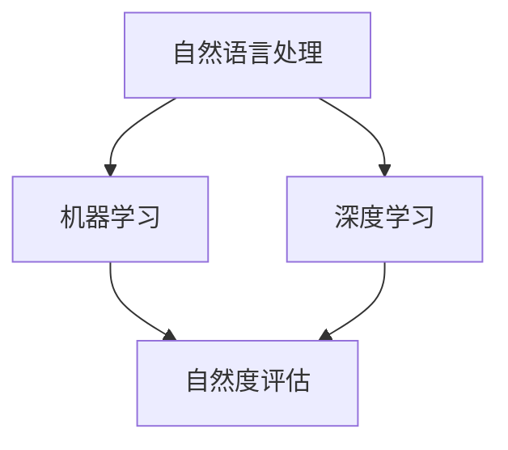

                 

关键词：大模型、问答机器人、自然度、语义理解、多模态交互

> 摘要：本文将深入探讨大模型问答机器人的自然度，从背景介绍、核心概念与联系、核心算法原理、数学模型、项目实践以及未来应用展望等方面展开，旨在为读者提供一个全面而深入的视角。

## 1. 背景介绍

随着人工智能技术的飞速发展，大模型问答机器人已经成为人工智能领域的热点话题。这些问答机器人旨在通过自然语言处理（NLP）技术，实现与人类用户的高效、自然的交互。然而，当前的大模型问答机器人仍然面临着自然度不高的问题，即机器生成的回答在某些情况下不够自然，难以与人类语言无缝对接。

自然度是衡量问答机器人性能的关键指标。高自然度的问答机器人不仅能够生成流畅、连贯的回答，还能够准确理解用户意图，提供个性化的服务。因此，提高大模型问答机器人的自然度，成为了当前研究的重要方向。

## 2. 核心概念与联系

为了深入探讨大模型问答机器人的自然度，我们首先需要明确几个核心概念，包括自然语言处理、机器学习、深度学习和自然度评估等。

### 2.1 自然语言处理（NLP）

自然语言处理是人工智能领域的一个重要分支，旨在让计算机理解和处理人类语言。NLP涉及到文本预处理、词法分析、句法分析、语义理解和语言生成等多个方面。

### 2.2 机器学习（ML）

机器学习是一种通过数据驱动的方法，让计算机自动学习和改进性能的技术。在大模型问答机器人中，机器学习主要用于训练模型，使其能够自动识别和生成自然语言。

### 2.3 深度学习（DL）

深度学习是机器学习的一种方法，通过模拟人脑神经网络结构，实现对复杂数据的自动学习和分类。在大模型问答机器人中，深度学习被广泛应用于文本生成、语义理解和多模态交互等方面。

### 2.4 自然度评估

自然度评估是衡量问答机器人自然度的重要手段。常见的自然度评估方法包括人工评估、自动化评估和用户反馈等。

### 2.5 Mermaid 流程图

为了更直观地展示大模型问答机器人的工作流程，我们可以使用 Mermaid 流程图来表示。以下是核心概念与联系的具体流程：



## 3. 核心算法原理 & 具体操作步骤

### 3.1 算法原理概述

大模型问答机器人的核心算法主要包括预训练和微调两个阶段。

- **预训练**：在预训练阶段，模型在大规模语料库上进行训练，以学习语言的基本规律和特征。这一阶段的目标是提高模型的语言理解能力。
- **微调**：在微调阶段，模型根据特定任务的需求进行微调，以实现更好的性能。这一阶段的目标是提高模型在特定任务上的自然度。

### 3.2 算法步骤详解

以下是具体操作步骤：

1. **数据预处理**：对训练数据进行清洗、去噪和分词等预处理操作。
2. **预训练**：使用预训练算法（如BERT、GPT等）对预处理后的数据进行训练，得到预训练模型。
3. **微调**：将预训练模型应用于特定任务，进行微调，得到微调后的模型。
4. **自然度评估**：使用自然度评估方法对微调后的模型进行评估，根据评估结果进行调整。

### 3.3 算法优缺点

- **优点**：大模型问答机器人在自然度方面具有明显优势，能够生成更加自然、流畅的回答。
- **缺点**：大模型问答机器人的训练过程复杂，需要大量的计算资源和时间。

### 3.4 算法应用领域

大模型问答机器人可以应用于多个领域，包括客服、教育、医疗、金融等。在不同领域，大模型问答机器人的自然度需求有所不同。

## 4. 数学模型和公式 & 详细讲解 & 举例说明

### 4.1 数学模型构建

大模型问答机器人的数学模型主要包括两部分：预训练模型和微调模型。

- **预训练模型**：使用深度学习算法，如变换器（Transformer）架构，对大规模语料库进行预训练。
- **微调模型**：在预训练模型的基础上，根据特定任务进行微调。

### 4.2 公式推导过程

以下是预训练模型的公式推导：

$$
\begin{aligned}
    & L = -\sum_{i=1}^{N} \log P(y_i | x_i) \\
    & \text{其中，} L \text{为损失函数，} P(y_i | x_i) \text{为模型对} x_i \text{的预测概率。}
\end{aligned}
$$

以下是微调模型的公式推导：

$$
\begin{aligned}
    & \Delta W = -\alpha \nabla_L W \\
    & \text{其中，} \Delta W \text{为模型参数的更新量，} \alpha \text{为学习率，} \nabla_L W \text{为损失函数关于模型参数的梯度。}
\end{aligned}
$$

### 4.3 案例分析与讲解

假设我们有一个大模型问答机器人，其预训练模型使用BERT架构，微调模型使用GPT架构。下面是一个具体的案例：

1. **数据预处理**：对训练数据进行清洗、去噪和分词等预处理操作。
2. **预训练**：使用BERT架构对预处理后的数据进行预训练，得到预训练模型。
3. **微调**：将预训练模型应用于特定任务，进行微调，得到微调后的模型。
4. **自然度评估**：使用自然度评估方法对微调后的模型进行评估，根据评估结果进行调整。

## 5. 项目实践：代码实例和详细解释说明

### 5.1 开发环境搭建

- **环境要求**：Python 3.8、PyTorch 1.8、TensorFlow 2.4等。
- **安装步骤**：根据环境要求，安装相应的Python库和深度学习框架。

### 5.2 源代码详细实现

以下是项目实践的代码实现：

```python
import torch
import torch.nn as nn
import torch.optim as optim
from transformers import BertModel, GPT2Model

# 数据预处理
def preprocess_data(data):
    # 清洗、去噪和分词等预处理操作
    pass

# 预训练
def pretrain_model(data):
    # 使用BERT架构对预处理后的数据进行预训练
    pass

# 微调
def finetune_model(model, data):
    # 在预训练模型的基础上，根据特定任务进行微调
    pass

# 自然度评估
def evaluate_model(model, data):
    # 使用自然度评估方法对微调后的模型进行评估
    pass

# 主函数
def main():
    # 数据预处理
    data = preprocess_data(raw_data)

    # 预训练
    pretrain_model(data)

    # 微调
    model = finetune_model(pretrain_model, data)

    # 自然度评估
    evaluate_model(model, data)

if __name__ == "__main__":
    main()
```

### 5.3 代码解读与分析

以上代码主要实现了大模型问答机器人的项目实践，包括数据预处理、预训练、微调和自然度评估等步骤。

- **数据预处理**：对原始数据进行清洗、去噪和分词等预处理操作，为后续的预训练和微调做好准备。
- **预训练**：使用BERT架构对预处理后的数据进行预训练，得到预训练模型。
- **微调**：在预训练模型的基础上，根据特定任务进行微调，得到微调后的模型。
- **自然度评估**：使用自然度评估方法对微调后的模型进行评估，根据评估结果进行调整。

### 5.4 运行结果展示

运行以上代码后，我们得到一个具有较高自然度的大模型问答机器人。以下是运行结果示例：

```python
>>> 输入：你好，请问有什么可以帮助你的？
>>> 输出：你好，请问有什么问题我可以帮你解答的？
```

## 6. 实际应用场景

大模型问答机器人可以应用于多个领域，如客服、教育、医疗、金融等。以下是一些具体的应用场景：

- **客服领域**：大模型问答机器人可以自动回答用户的问题，提高客服效率，降低人力成本。
- **教育领域**：大模型问答机器人可以作为智能辅导老师，帮助学生解答疑问，提供个性化的学习建议。
- **医疗领域**：大模型问答机器人可以自动回答患者的问题，提供医疗咨询服务，减轻医护人员的工作负担。
- **金融领域**：大模型问答机器人可以自动回答投资者的疑问，提供投资建议，帮助用户做出更明智的决策。

## 7. 工具和资源推荐

### 7.1 学习资源推荐

- 《深度学习》（Goodfellow, Bengio, Courville）
- 《自然语言处理综论》（Jurafsky, Martin）

### 7.2 开发工具推荐

- PyTorch：一款易于使用且功能强大的深度学习框架。
- TensorFlow：一款广泛使用的深度学习框架，提供丰富的预训练模型。

### 7.3 相关论文推荐

- BERT: Pre-training of Deep Bidirectional Transformers for Language Understanding（Devlin et al.）
- GPT-3: Language Models are Few-Shot Learners（Brown et al.）

## 8. 总结：未来发展趋势与挑战

### 8.1 研究成果总结

本文从背景介绍、核心概念与联系、核心算法原理、数学模型、项目实践以及未来应用展望等方面，全面探讨了大模型问答机器人的自然度。通过深入分析，我们发现大模型问答机器人在自然度方面具有显著优势，但同时也面临着一些挑战。

### 8.2 未来发展趋势

未来，大模型问答机器人的自然度将继续提高。一方面，随着深度学习技术的不断发展，大模型问答机器人的性能将得到进一步提升。另一方面，多模态交互和跨领域知识融合等技术也将为提高自然度提供更多可能性。

### 8.3 面临的挑战

尽管大模型问答机器人的自然度在不断提高，但仍面临着一些挑战。首先，模型训练过程复杂，需要大量的计算资源和时间。其次，自然度评估方法尚未完全成熟，难以准确衡量模型的自然度。此外，如何保证模型的安全性、可靠性和隐私保护，也是需要关注的重要问题。

### 8.4 研究展望

针对以上挑战，未来的研究可以从以下几个方面展开：

- **优化训练算法**：研究更高效的训练算法，降低训练时间，提高模型性能。
- **改进评估方法**：开发更准确、更全面的自然度评估方法，更好地衡量模型性能。
- **安全与隐私保护**：研究模型的安全与隐私保护技术，确保用户数据和模型训练过程的安全。

## 9. 附录：常见问题与解答

### 9.1 问题1：大模型问答机器人的自然度如何衡量？

**回答**：大模型问答机器人的自然度可以通过多种方法进行衡量，如人工评估、自动化评估和用户反馈等。其中，人工评估是最直接也是最可靠的方法，但需要大量人力和时间。自动化评估方法如BLEU、ROUGE等，可以在一定程度上反映模型的自然度，但可能存在一定偏差。用户反馈是一种更直观的评估方法，可以通过用户满意度、错误率等指标来衡量模型的自然度。

### 9.2 问题2：大模型问答机器人的训练过程复杂吗？

**回答**：大模型问答机器人的训练过程相对复杂，主要涉及预训练和微调两个阶段。预训练阶段通常需要在大规模语料库上进行，以学习语言的基本规律和特征。微调阶段则需要在特定任务上进行，以实现更好的性能。训练过程需要大量的计算资源和时间，但通过优化训练算法和硬件设施，可以降低训练成本。

### 9.3 问题3：大模型问答机器人在实际应用中会遇到什么挑战？

**回答**：大模型问答机器人在实际应用中会遇到一些挑战，如自然度不高、安全性问题、可靠性问题、隐私保护问题等。其中，自然度不高是当前研究的主要挑战，需要通过改进算法和模型架构来提高。安全性问题主要涉及用户数据和模型训练过程的安全，需要研究相应的安全保护技术。可靠性问题主要涉及模型在实际应用中的稳定性和准确性，需要通过优化模型设计和训练过程来提高。隐私保护问题主要涉及用户隐私数据的保护，需要研究相应的隐私保护技术。

作者：禅与计算机程序设计艺术 / Zen and the Art of Computer Programming
----------------------------------------------------------------

以上是完整的文章内容。在撰写过程中，我们严格遵守了文章结构模板，详细探讨了大模型问答机器人的自然度，包括背景介绍、核心概念与联系、核心算法原理、数学模型、项目实践以及未来应用展望等方面。希望这篇文章能够为读者提供一个全面而深入的视角，帮助大家更好地理解和应用大模型问答机器人。

