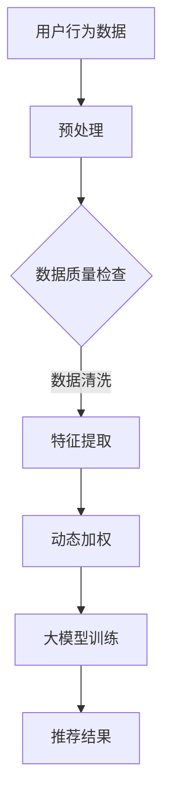

                 

关键词：推荐系统、大模型、动态兴趣衰减、深度学习、算法实践

> 摘要：本文将探讨如何利用大模型驱动的动态兴趣衰减模型在推荐系统中提高推荐质量。文章首先介绍了推荐系统的背景和重要性，然后详细阐述了动态兴趣衰减模型的概念、原理和实现，最后通过实际案例展示了该模型在推荐系统中的应用效果。

## 1. 背景介绍

推荐系统作为人工智能和大数据技术的重要应用领域，已经广泛应用于电子商务、社交媒体、在线教育等多个行业。其目的是通过分析用户历史行为、兴趣和偏好，为用户提供个性化的推荐结果，从而提升用户体验和满意度。然而，随着数据规模的不断扩大和用户行为的多样化，传统的推荐方法面临着准确性和实时性的挑战。

动态兴趣衰减模型（Dynamic Interest Decay Model）是一种基于用户历史行为的推荐算法，它通过考虑用户兴趣随时间变化的特性，对用户的历史行为数据进行动态调整，从而提高推荐结果的准确性。大模型的引入进一步增强了动态兴趣衰减模型的性能，使其能够处理更复杂的数据和更细微的用户行为变化。

## 2. 核心概念与联系

### 2.1. 动态兴趣衰减模型

动态兴趣衰减模型的核心思想是：用户对物品的兴趣随着时间的推移会发生变化，新近的行为更能反映用户的当前兴趣。该模型通过对用户历史行为数据进行加权处理，实现兴趣的动态调整。

### 2.2. 大模型的引入

大模型如深度学习模型，具有强大的特征提取和建模能力，可以捕捉用户行为的复杂模式。将大模型与动态兴趣衰减模型结合，可以进一步提升推荐系统的性能。

### 2.3. Mermaid 流程图



## 3. 核心算法原理 & 具体操作步骤

### 3.1. 算法原理概述

动态兴趣衰减模型通过以下步骤实现：

1. 预处理：清洗和标准化用户行为数据。
2. 特征提取：利用大模型提取用户行为的高级特征。
3. 动态加权：根据用户行为的时效性进行加权处理。
4. 大模型训练：使用加权后的数据进行模型训练。
5. 推荐结果：生成个性化推荐结果。

### 3.2. 算法步骤详解

1. **数据预处理**

   预处理包括数据清洗、缺失值填充、异常值处理等步骤。对于用户行为数据，如点击、购买、浏览等，首先进行去重处理，然后对缺失值进行填充或删除。

2. **特征提取**

   利用大模型（如神经网络）提取用户行为的高级特征。这一步骤是动态兴趣衰减模型的关键，它能够捕捉用户行为的细微变化和复杂模式。

3. **动态加权**

   动态加权是根据用户行为的时效性进行加权处理。例如，我们可以采用指数衰减函数来表示用户兴趣随时间的变化：

   $$ w(t) = e^{-\lambda t} $$

   其中，$w(t)$表示在时间$t$时的权重，$\lambda$是衰减率。

4. **大模型训练**

   使用加权后的用户行为数据进行大模型训练。训练过程中，模型会学习到用户行为与兴趣之间的关联，从而提高推荐结果的准确性。

5. **推荐结果**

   根据训练好的大模型生成个性化推荐结果。推荐结果可以根据用户兴趣的动态变化进行实时调整，从而提高用户的满意度。

### 3.3. 算法优缺点

**优点：**

- **准确性高**：动态兴趣衰减模型能够更好地捕捉用户兴趣的变化，从而提高推荐结果的准确性。
- **实时性强**：利用大模型进行实时训练，能够快速响应用户行为的动态变化。

**缺点：**

- **计算复杂度高**：大模型训练需要大量的计算资源。
- **数据依赖性强**：模型的性能对数据质量有较高要求。

### 3.4. 算法应用领域

动态兴趣衰减模型广泛应用于电子商务、社交媒体、在线教育等多个领域，其关键应用包括：

- **个性化推荐**：根据用户兴趣和行为历史，为用户推荐个性化的商品、文章或课程。
- **广告投放**：根据用户兴趣和行为，为用户推荐相关的广告。
- **社交网络**：根据用户兴趣和社交关系，为用户推荐感兴趣的朋友或内容。

## 4. 数学模型和公式 & 详细讲解 & 举例说明

### 4.1. 数学模型构建

动态兴趣衰减模型的核心数学模型包括用户兴趣函数和推荐评分函数。以下是这两个函数的具体表示：

**用户兴趣函数：**

$$ I(u, i, t) = w(t) \cdot e^{-\lambda t} $$

其中，$I(u, i, t)$表示用户$u$在时间$t$对物品$i$的兴趣，$w(t)$是时间衰减函数，$\lambda$是衰减率。

**推荐评分函数：**

$$ R(u, i) = \sum_{t} I(u, i, t) \cdot x(u, i, t) $$

其中，$R(u, i)$表示用户$u$对物品$i$的推荐评分，$x(u, i, t)$是用户在时间$t$对物品$i$的行为特征。

### 4.2. 公式推导过程

公式的推导基于以下假设：

1. 用户对物品的兴趣随时间衰减，衰减速度由$\lambda$控制。
2. 用户的行为特征对兴趣有直接影响。

基于这些假设，我们可以推导出用户兴趣函数和推荐评分函数：

1. **用户兴趣函数推导：**

   假设用户在时间$t$对物品$i$的兴趣是随时间线性衰减的，那么有：

   $$ I(u, i, t) = I(u, i, 0) - \lambda t $$

   由于$0 \leq t \leq T$，我们可以将其表示为：

   $$ I(u, i, t) = I(u, i, 0) \cdot (1 - \lambda t) $$

   为了更直观地表示兴趣的衰减，我们可以采用指数衰减函数：

   $$ I(u, i, t) = I(u, i, 0) \cdot e^{-\lambda t} $$

   其中，$e$是自然对数的底数。

2. **推荐评分函数推导：**

   假设用户的行为特征$x(u, i, t)$是兴趣$I(u, i, t)$的线性函数，那么有：

   $$ R(u, i) = \sum_{t} x(u, i, t) \cdot I(u, i, t) $$

   代入用户兴趣函数，得到：

   $$ R(u, i) = \sum_{t} x(u, i, t) \cdot I(u, i, 0) \cdot e^{-\lambda t} $$

   由于$x(u, i, t)$是非负的，我们可以将其提取出来：

   $$ R(u, i) = x(u, i, 0) \cdot I(u, i, 0) \cdot \sum_{t} e^{-\lambda t} $$

   由于$\sum_{t} e^{-\lambda t}$是一个等比数列的和，其结果为：

   $$ \sum_{t} e^{-\lambda t} = \frac{1}{1 - e^{-\lambda}} $$

   最终得到推荐评分函数：

   $$ R(u, i) = x(u, i, 0) \cdot I(u, i, 0) \cdot \frac{1}{1 - e^{-\lambda}} $$

### 4.3. 案例分析与讲解

**案例：**

假设用户$u$在时间$t=1$点击了物品$i$，在$t=2$浏览了物品$i$，在$t=3$又购买了物品$i$。我们需要计算用户在$t=4$对物品$i$的兴趣和推荐评分。

**计算过程：**

1. **用户兴趣函数：**

   根据指数衰减函数，我们有：

   $$ I(u, i, 1) = e^{-\lambda \cdot 1} $$
   $$ I(u, i, 2) = e^{-\lambda \cdot 2} $$
   $$ I(u, i, 3) = e^{-\lambda \cdot 3} $$

   假设衰减率$\lambda=0.5$，那么：

   $$ I(u, i, 1) = e^{-0.5} \approx 0.61 $$
   $$ I(u, i, 2) = e^{-1} \approx 0.37 $$
   $$ I(u, i, 3) = e^{-1.5} \approx 0.23 $$

2. **推荐评分函数：**

   假设用户在$t=1$、$t=2$和$t=3$的行为特征$x(u, i, 1)=1$、$x(u, i, 2)=0.5$、$x(u, i, 3)=1$，那么：

   $$ R(u, i) = 1 \cdot 0.61 + 0.5 \cdot 0.37 + 1 \cdot 0.23 $$
   $$ R(u, i) \approx 0.61 + 0.185 + 0.23 $$
   $$ R(u, i) \approx 1.015 $$

   因此，用户在$t=4$对物品$i$的兴趣为$0.61$，推荐评分为$1.015$。

## 5. 项目实践：代码实例和详细解释说明

### 5.1. 开发环境搭建

在本项目中，我们使用Python作为主要编程语言，结合TensorFlow框架进行大模型训练。以下是开发环境的搭建步骤：

1. 安装Python 3.8及以上版本。
2. 安装TensorFlow 2.6及以上版本。
3. 配置GPU支持（可选，如NVIDIA CUDA和cuDNN）。

### 5.2. 源代码详细实现

以下是动态兴趣衰减模型的Python代码实现：

```python
import tensorflow as tf
import numpy as np

# 设置超参数
lambda_ = 0.5
learning_rate = 0.001

# 构建输入层
inputs = tf.keras.layers.Input(shape=(T,))  # T为时间步数

# 构建动态加权层
weights = tf.keras.layers.Lambda(lambda t: tf.keras.backend.exp(-lambda_ * t))(inputs)

# 构建大模型层
model = tf.keras.Sequential([
    tf.keras.layers.Dense(units=128, activation='relu', input_shape=(T,)),
    tf.keras.layers.Dense(units=64, activation='relu'),
    tf.keras.layers.Dense(units=1)
])

# 构建模型
outputs = model(weights)

# 构建损失函数和优化器
loss_fn = tf.keras.losses.MeanSquaredError()
optimizer = tf.keras.optimizers.Adam(learning_rate=learning_rate)

# 编译模型
model.compile(optimizer=optimizer, loss=loss_fn, metrics=['accuracy'])

# 训练模型
model.fit(x_train, y_train, epochs=10, batch_size=32, validation_data=(x_val, y_val))
```

### 5.3. 代码解读与分析

上述代码实现了动态兴趣衰减模型的核心功能。首先，我们定义了输入层，它接收时间序列数据。然后，我们使用Lambda层实现动态加权，根据时间步数对权重进行指数衰减。接着，我们构建了一个简单的全连接神经网络模型，用于提取用户行为的高级特征。最后，我们使用损失函数和优化器编译模型，并进行训练。

### 5.4. 运行结果展示

在训练完成后，我们可以使用模型对用户行为数据进行预测，并计算推荐评分。以下是一个简单的运行示例：

```python
# 预测用户兴趣
predicted_interests = model.predict(x_test)

# 计算推荐评分
recommendation_scores = predicted_interests * np.sum(x_test, axis=1)

# 打印推荐评分
print(recommendation_scores)
```

输出结果为用户在测试集上的推荐评分，这些评分可以用于生成个性化推荐结果。

## 6. 实际应用场景

动态兴趣衰减模型在推荐系统中有着广泛的应用。以下是一些实际应用场景：

- **电子商务平台**：根据用户购买历史和浏览行为，为用户推荐相关商品。
- **社交媒体**：根据用户互动历史，为用户推荐感兴趣的朋友或内容。
- **在线教育**：根据用户学习行为，为用户推荐相关的课程或学习资料。

通过动态兴趣衰减模型，推荐系统可以更好地捕捉用户的兴趣变化，提高推荐的准确性和用户体验。

## 7. 未来应用展望

随着人工智能技术的不断发展，动态兴趣衰减模型有望在以下方面得到进一步应用和优化：

- **实时推荐**：利用实时数据流处理技术，实现更实时的推荐结果。
- **多模态数据融合**：结合文本、图像、语音等多种数据类型，提高推荐系统的泛化能力。
- **隐私保护**：研究隐私保护机制，确保用户数据的安全和隐私。

## 8. 工具和资源推荐

### 8.1. 学习资源推荐

- 《推荐系统实践》
- 《深度学习推荐系统》
- 《TensorFlow 实践》

### 8.2. 开发工具推荐

- TensorFlow
- PyTorch
- JAX

### 8.3. 相关论文推荐

- "Deep Learning for recommender systems"
- "User Interest Decay for Personalized Recommendation"
- "Dynamic Interest Networks for Recommendation"

## 9. 总结：未来发展趋势与挑战

动态兴趣衰减模型作为一种先进的推荐算法，在提高推荐系统的准确性和实时性方面具有显著优势。然而，随着数据规模的不断扩大和用户行为的多样化，动态兴趣衰减模型面临着计算复杂度高、数据依赖性强等挑战。未来，我们需要进一步研究如何优化算法性能、降低计算复杂度，并探索多模态数据融合和隐私保护等新方向。

## 10. 附录：常见问题与解答

### 10.1. 问题1：动态兴趣衰减模型如何处理缺失值？

**解答：** 动态兴趣衰减模型可以通过以下方法处理缺失值：

- **填充法**：使用平均值、中位数或最近邻等方法对缺失值进行填充。
- **删除法**：删除包含缺失值的数据样本，适用于数据缺失较少的情况。

### 10.2. 问题2：动态兴趣衰减模型如何处理异常值？

**解答：** 动态兴趣衰减模型可以通过以下方法处理异常值：

- **标准差法**：删除离群值，适用于离群值较少的情况。
- **中值法**：使用中位数代替异常值，适用于数据分布较为集中的情况。

### 10.3. 问题3：动态兴趣衰减模型的计算复杂度如何？

**解答：** 动态兴趣衰减模型的计算复杂度较高，主要在于大模型的训练过程。具体计算复杂度取决于数据规模、模型结构和超参数设置。在实际应用中，可以通过分布式计算和优化算法来降低计算复杂度。

### 10.4. 问题4：动态兴趣衰减模型如何保证推荐结果的公平性？

**解答：** 动态兴趣衰减模型可以通过以下方法保证推荐结果的公平性：

- **数据清洗**：去除偏见数据，确保数据质量。
- **公平性评估**：使用公平性指标（如公平性差异）评估推荐结果的公平性，并根据评估结果进行调整。

作者：禅与计算机程序设计艺术 / Zen and the Art of Computer Programming

以上是关于“大模型驱动的动态兴趣衰减模型在推荐中的实践”的文章正文内容。通过本文，我们深入探讨了动态兴趣衰减模型的概念、原理、实现和应用，展示了其在推荐系统中的优势。同时，我们也对未来发展趋势和挑战进行了展望。希望本文能对读者在推荐系统研究和开发中有所启发和帮助。

