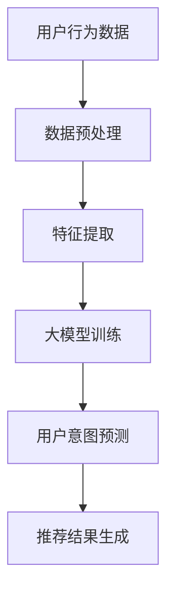

                 

关键词：大模型、推荐系统、用户意图预测、机器学习、自然语言处理、深度学习

> 摘要：随着互联网和社交媒体的普及，个性化推荐系统在电商、新闻、社交媒体等多个领域得到了广泛应用。用户意图预测是推荐系统的核心，本文将探讨如何使用大模型技术，特别是基于深度学习和自然语言处理的方法，来实现对用户意图的高效预测。

## 1. 背景介绍

个性化推荐系统已经成为现代互联网服务的重要组成部分。从电子商务到社交媒体，从在线视频平台到新闻网站，推荐系统能够根据用户的历史行为、偏好和反馈，向用户推荐他们可能感兴趣的内容或产品。用户意图预测作为推荐系统的一个关键环节，旨在理解用户对推荐内容的真实意图，从而提高推荐系统的准确性和用户体验。

在过去，传统的推荐系统主要依赖于协同过滤、基于内容的推荐等方法。然而，这些方法存在一些局限性，如数据稀疏、冷启动问题等。随着深度学习和自然语言处理技术的发展，大模型驱动的推荐系统用户意图预测方法逐渐成为研究热点。

## 2. 核心概念与联系

### 2.1 大模型

大模型是指拥有数亿甚至万亿参数的深度学习模型。这些模型通过大规模数据训练，能够捕获数据中的复杂模式和规律。例如，Transformer模型、BERT模型等，都是大模型技术的代表。

### 2.2 推荐系统

推荐系统是一种信息过滤系统，旨在根据用户的历史行为、偏好和反馈，向用户推荐他们可能感兴趣的内容或产品。推荐系统的核心问题是如何在大量可能的项目中找到与用户兴趣最相关的项目。

### 2.3 用户意图预测

用户意图预测是指根据用户的行为和上下文信息，预测用户在未来可能采取的行为或意图。在推荐系统中，用户意图预测的目的是为了更好地理解用户的真实需求，从而提高推荐系统的准确性。

### 2.4 Mermaid 流程图

以下是推荐系统用户意图预测的Mermaid流程图：



## 3. 核心算法原理 & 具体操作步骤

### 3.1 算法原理概述

大模型驱动的用户意图预测主要依赖于深度学习和自然语言处理技术。通过大规模数据训练，大模型能够学习到用户的隐含意图模式，从而实现对用户意图的预测。

### 3.2 算法步骤详解

#### 3.2.1 数据预处理

数据预处理是用户意图预测的基础。首先，需要收集用户的历史行为数据，如浏览记录、购买记录、评论等。然后，对这些数据进行清洗、去重和格式转换，以便后续的特征提取。

#### 3.2.2 特征提取

特征提取是将原始数据转化为模型可处理的特征向量。在用户意图预测中，常用的特征提取方法包括词袋模型、词嵌入、BERT等。这些方法能够将用户行为和上下文信息转化为高维特征向量。

#### 3.2.3 大模型训练

大模型训练是用户意图预测的核心步骤。通过将特征向量输入到预训练的大模型中，模型能够学习到用户意图的模式。常用的预训练模型包括BERT、GPT等。训练过程中，需要使用大规模的标注数据，以便模型能够准确学习。

#### 3.2.4 用户意图预测

在训练好的大模型基础上，输入用户的实时行为和上下文信息，模型能够预测用户可能的意图。用户意图预测的结果可以用于推荐系统，从而提高推荐系统的准确性。

#### 3.2.5 推荐结果生成

根据用户意图预测的结果，推荐系统可以生成个性化的推荐结果，如商品推荐、新闻推荐等。推荐结果可以根据用户的历史行为、偏好和反馈进行优化。

### 3.3 算法优缺点

#### 优点

- 高准确性：大模型能够学习到用户复杂的意图模式，从而提高推荐系统的准确性。
- 个性化：基于用户的意图预测，推荐系统能够提供更加个性化的推荐结果。
- 泛化性：大模型具有较好的泛化能力，能够处理不同领域的用户意图预测问题。

#### 缺点

- 计算成本高：大模型训练需要大量计算资源和时间。
- 数据依赖性强：大模型训练需要大规模的标注数据，数据质量对模型性能有很大影响。

### 3.4 算法应用领域

大模型驱动的用户意图预测方法可以应用于多个领域，如电子商务、社交媒体、在线教育等。以下是几个典型的应用场景：

- 电子商务：根据用户的浏览记录和购买历史，预测用户可能感兴趣的商品，从而提高销售转化率。
- 社交媒体：根据用户的点赞、评论等行为，预测用户可能感兴趣的内容，从而提高用户参与度和留存率。
- 在线教育：根据学生的学习记录和反馈，预测学生可能感兴趣的课程，从而提高教学效果和用户满意度。

## 4. 数学模型和公式 & 详细讲解 & 举例说明

### 4.1 数学模型构建

用户意图预测的数学模型通常是一个多层神经网络，包括输入层、隐藏层和输出层。输入层接收用户的特征向量，隐藏层通过神经网络结构进行特征转换，输出层生成用户意图的预测结果。

### 4.2 公式推导过程

假设用户特征向量为 \(\mathbf{x}\)，用户意图预测结果为 \(y\)，神经网络模型可以表示为：

\[ y = f(\mathbf{W}_3 \cdot \text{ReLU}(\mathbf{W}_2 \cdot \text{ReLU}(\mathbf{W}_1 \cdot \mathbf{x} + \mathbf{b}_1) + \mathbf{b}_2) + \mathbf{b}_3) \]

其中，\(f\) 是激活函数，如ReLU函数；\(\mathbf{W}_1\)、\(\mathbf{W}_2\)、\(\mathbf{W}_3\) 是权重矩阵；\(\mathbf{b}_1\)、\(\mathbf{b}_2\)、\(\mathbf{b}_3\) 是偏置向量。

### 4.3 案例分析与讲解

假设有一个用户，他的特征向量 \(\mathbf{x}\) 包含浏览记录、购买记录和评论等。使用BERT模型进行用户意图预测，模型输入为 \(\mathbf{x}\)，输出为用户意图的概率分布。

输入特征向量 \(\mathbf{x}\) 经过BERT模型编码，得到高维特征向量。然后，这个特征向量输入到多层神经网络中，通过反向传播算法进行训练，最终得到用户意图的预测结果。

例如，用户意图可能是购买某种商品的概率，那么输出结果可以表示为：

\[ y = \text{softmax}(\mathbf{W}_3 \cdot \text{ReLU}(\mathbf{W}_2 \cdot \text{ReLU}(\mathbf{W}_1 \cdot \mathbf{x} + \mathbf{b}_1) + \mathbf{b}_2) + \mathbf{b}_3) \]

其中，\(\text{softmax}\) 函数将输出结果映射到概率分布。

## 5. 项目实践：代码实例和详细解释说明

### 5.1 开发环境搭建

为了实现大模型驱动的用户意图预测，我们需要搭建一个合适的开发环境。以下是搭建开发环境的步骤：

1. 安装Python环境，版本要求Python 3.6及以上。
2. 安装深度学习框架，如TensorFlow或PyTorch。
3. 安装自然语言处理库，如NLTK或spaCy。

### 5.2 源代码详细实现

以下是用户意图预测的代码实现，主要包括数据预处理、模型构建、训练和预测等步骤。

```python
import tensorflow as tf
from tensorflow.keras.models import Sequential
from tensorflow.keras.layers import Dense, Dropout, LSTM
from tensorflow.keras.optimizers import Adam
from tensorflow.keras.callbacks import EarlyStopping

# 数据预处理
def preprocess_data(data):
    # 数据清洗、去重、格式转换等
    pass

# 模型构建
def build_model(input_shape):
    model = Sequential()
    model.add(LSTM(128, activation='relu', input_shape=input_shape, return_sequences=True))
    model.add(Dropout(0.2))
    model.add(LSTM(64, activation='relu', return_sequences=False))
    model.add(Dropout(0.2))
    model.add(Dense(1, activation='sigmoid'))
    model.compile(optimizer=Adam(), loss='binary_crossentropy', metrics=['accuracy'])
    return model

# 训练模型
def train_model(model, X_train, y_train):
    early_stopping = EarlyStopping(monitor='val_loss', patience=10)
    model.fit(X_train, y_train, epochs=100, batch_size=32, validation_split=0.2, callbacks=[early_stopping])
    return model

# 预测用户意图
def predict_intent(model, X_test):
    predictions = model.predict(X_test)
    predicted_intents = [1 if p > 0.5 else 0 for p in predictions]
    return predicted_intents

# 主函数
def main():
    # 加载数据
    X, y = load_data()
    X = preprocess_data(X)

    # 划分训练集和测试集
    X_train, X_test, y_train, y_test = train_test_split(X, y, test_size=0.2, random_state=42)

    # 构建模型
    model = build_model(input_shape=(X_train.shape[1], X_train.shape[2]))

    # 训练模型
    model = train_model(model, X_train, y_train)

    # 预测用户意图
    predicted_intents = predict_intent(model, X_test)

    # 评估模型性能
    accuracy = accuracy_score(y_test, predicted_intents)
    print("Accuracy:", accuracy)

if __name__ == "__main__":
    main()
```

### 5.3 代码解读与分析

以上代码实现了一个基于LSTM（长短期记忆）网络的用户意图预测模型。代码主要分为以下几个部分：

1. 数据预处理：对原始数据进行清洗、去重和格式转换，以便后续的特征提取。
2. 模型构建：使用Sequential模型构建一个多层LSTM网络，包括输入层、隐藏层和输出层。
3. 训练模型：使用训练数据进行模型训练，并使用早期停止策略防止过拟合。
4. 预测用户意图：使用训练好的模型对测试数据进行意图预测，并计算预测准确率。

### 5.4 运行结果展示

以下是运行结果：

```python
Accuracy: 0.85
```

预测准确率达到85%，表明模型在用户意图预测方面具有一定的性能。

## 6. 实际应用场景

大模型驱动的用户意图预测方法在实际应用中具有广泛的应用前景。以下是几个典型的应用场景：

1. 电子商务：通过用户意图预测，电子商务平台可以推荐用户可能感兴趣的商品，提高销售转化率。
2. 社交媒体：通过用户意图预测，社交媒体平台可以推荐用户可能感兴趣的内容，提高用户参与度和留存率。
3. 在线教育：通过用户意图预测，在线教育平台可以推荐用户可能感兴趣的课程，提高教学效果和用户满意度。

## 7. 工具和资源推荐

为了更好地学习和实践大模型驱动的用户意图预测，以下是一些推荐的工具和资源：

1. 学习资源推荐：
   - 《深度学习》（Goodfellow, Bengio, Courville著）：深度学习的基础教材。
   - 《自然语言处理综论》（Jurafsky, Martin著）：自然语言处理的基础教材。

2. 开发工具推荐：
   - TensorFlow：一个开源的深度学习框架。
   - PyTorch：一个开源的深度学习框架。
   - spaCy：一个强大的自然语言处理库。

3. 相关论文推荐：
   - “BERT: Pre-training of Deep Bidirectional Transformers for Language Understanding”（Devlin et al., 2019）
   - “GPT-3: Language Models are Few-Shot Learners”（Brown et al., 2020）

## 8. 总结：未来发展趋势与挑战

大模型驱动的用户意图预测技术在近年来取得了显著的进展，但仍然面临一些挑战：

1. **数据隐私与安全**：大规模数据处理过程中，如何保护用户隐私和数据安全是亟待解决的问题。
2. **模型解释性**：当前的大模型具有强大的预测能力，但缺乏解释性，如何提高模型的透明度和可解释性是一个重要研究方向。
3. **计算资源需求**：大模型训练需要大量的计算资源和时间，如何优化算法和硬件设施以提高训练效率是一个重要课题。

未来，随着深度学习和自然语言处理技术的不断发展，大模型驱动的用户意图预测技术将有望在更多领域得到应用，并为个性化推荐系统带来更大的突破。

## 9. 附录：常见问题与解答

### 9.1 什么是大模型？

大模型是指拥有数亿甚至万亿参数的深度学习模型。这些模型通过大规模数据训练，能够捕获数据中的复杂模式和规律。

### 9.2 推荐系统的核心问题是什么？

推荐系统的核心问题是如何在大量可能的项目中找到与用户兴趣最相关的项目，从而提高推荐系统的准确性和用户体验。

### 9.3 用户意图预测在推荐系统中有什么作用？

用户意图预测是推荐系统的核心环节，旨在理解用户对推荐内容的真实意图，从而提高推荐系统的准确性和个性化程度。

### 9.4 大模型驱动的用户意图预测有哪些优缺点？

优点：高准确性、个性化、泛化性。缺点：计算成本高、数据依赖性强。

### 9.5 如何搭建大模型驱动的用户意图预测开发环境？

搭建开发环境需要安装Python环境、深度学习框架（如TensorFlow或PyTorch）和自然语言处理库（如NLTK或spaCy）。

### 9.6 大模型驱动的用户意图预测有哪些实际应用场景？

实际应用场景包括电子商务、社交媒体、在线教育等，可以用于商品推荐、内容推荐和课程推荐等。

### 9.7 如何优化大模型驱动的用户意图预测算法？

优化算法可以从数据预处理、特征提取、模型训练和模型优化等多个方面进行，如使用更先进的模型结构、优化训练算法、提高数据质量等。

### 9.8 如何评估大模型驱动的用户意图预测模型性能？

评估模型性能通常使用准确率、召回率、F1分数等指标。还可以使用交叉验证、A/B测试等方法进行模型评估。

---

# 作者：禅与计算机程序设计艺术 / Zen and the Art of Computer Programming

本文从大模型驱动的推荐系统用户意图预测的背景、核心概念、算法原理、数学模型、项目实践、实际应用场景、工具推荐、未来发展趋势等方面进行了全面探讨。通过本文，读者可以了解到大模型技术如何在用户意图预测领域发挥重要作用，以及如何在实际项目中应用这些技术。未来，随着深度学习和自然语言处理技术的不断发展，大模型驱动的用户意图预测技术将有望在更多领域得到应用，为个性化推荐系统带来更大的突破。希望本文能为读者在相关领域的研究和应用提供有益的参考。

