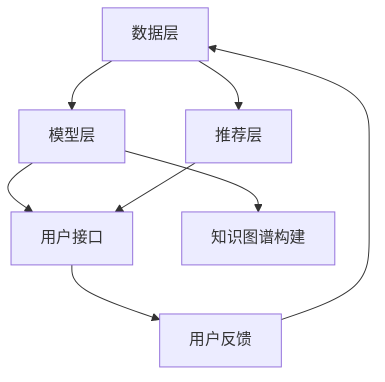

                 

关键词：大模型，推荐系统，知识增强，框架设计，算法原理，数学模型，应用实践，未来展望

## 摘要

本文旨在探讨大模型在推荐系统中的应用及其对知识增强的推动作用。随着互联网和大数据的迅猛发展，推荐系统已成为现代信息系统中不可或缺的一部分。然而，传统的推荐系统往往面临数据稀疏、冷启动问题和推荐效果不佳等挑战。本文将介绍一种基于大模型的知识增强推荐系统框架，通过融合多源异构数据、引入知识图谱和深度学习技术，实现推荐效果的显著提升。文章将详细阐述核心概念、算法原理、数学模型、项目实践以及未来展望，旨在为推荐系统研究和应用提供有价值的参考。

## 1. 背景介绍

### 推荐系统的现状与挑战

推荐系统（Recommender Systems）是一种信息过滤技术，旨在根据用户的历史行为、偏好和上下文信息，向用户推荐他们可能感兴趣的内容或产品。随着互联网和电子商务的快速发展，推荐系统已成为现代信息检索和用户体验优化的重要工具。

然而，现有的推荐系统仍面临诸多挑战：

- **数据稀疏**：用户的行为数据通常非常稀疏，尤其是对于新用户或新商品。
- **冷启动问题**：对于新用户或新商品，由于缺乏足够的历史数据，推荐系统难以做出准确的推荐。
- **用户偏好多样性**：用户偏好存在多样性，单从用户行为数据中难以捕捉到全面的偏好信息。
- **推荐效果评估**：如何客观评估推荐系统的效果，仍是一个开放性问题。

### 大模型的发展与应用

近年来，随着深度学习、神经网络等技术的突破，大模型（Large Models）逐渐成为人工智能领域的研究热点。大模型具有以下特点：

- **强大的表达能力**：大模型通过多层神经网络结构，可以学习到复杂的数据特征和关系。
- **自适应性**：大模型可以自适应地调整参数，以适应不同的数据集和应用场景。
- **高效性**：大模型可以在较短的时间内处理大量数据，提高计算效率。

大模型在推荐系统中的应用，为解决传统推荐系统的挑战提供了新的思路。通过引入大模型，可以更好地捕捉用户行为和偏好，提高推荐系统的准确性和多样性。

## 2. 核心概念与联系

### 大模型在推荐系统中的应用

大模型在推荐系统中的应用主要包括以下几个方面：

1. **用户表示学习**：通过深度学习技术，将用户的特征表示为高维向量，从而更好地捕捉用户的偏好。
2. **物品表示学习**：同理，将物品的特征表示为高维向量，实现物品与用户之间的有效匹配。
3. **基于模型的推荐**：利用大模型进行预测和推荐，提高推荐系统的准确性和效率。
4. **知识图谱构建**：利用大模型学习到的用户和物品特征，构建知识图谱，增强推荐系统的知识表示能力。

### 推荐系统的架构

推荐系统的基本架构包括以下几个部分：

1. **数据层**：负责收集和存储用户行为数据、物品特征数据等。
2. **模型层**：利用深度学习技术构建大模型，进行用户和物品表示学习，以及推荐预测。
3. **推荐层**：根据用户和物品的表示，进行协同过滤、基于内容的推荐等算法，生成推荐结果。
4. **用户接口**：将推荐结果呈现给用户，实现交互和反馈。

### Mermaid 流程图



## 3. 核心算法原理 & 具体操作步骤

### 3.1 算法原理概述

大模型驱动的推荐系统主要基于深度学习技术，包括以下几个关键组件：

1. **用户表示学习**：使用深度神经网络对用户行为数据进行编码，提取用户兴趣特征。
2. **物品表示学习**：使用深度神经网络对物品特征数据进行编码，提取物品属性特征。
3. **知识图谱构建**：利用用户和物品的表示，构建知识图谱，实现跨域的关联和推理。
4. **推荐预测**：基于用户和物品的表示，以及知识图谱中的关联关系，进行推荐预测。

### 3.2 算法步骤详解

1. **数据预处理**：
   - 收集用户行为数据、物品特征数据，并进行清洗、去重和处理。
   - 对数据进行编码，例如使用词嵌入技术将用户行为和物品特征转换为向量。

2. **用户表示学习**：
   - 构建用户行为数据集，使用卷积神经网络（CNN）或循环神经网络（RNN）对用户行为数据进行编码，提取用户兴趣特征。
   - 对编码后的用户兴趣特征进行降维，得到用户表示向量。

3. **物品表示学习**：
   - 构建物品特征数据集，使用卷积神经网络（CNN）或循环神经网络（RNN）对物品特征数据进行编码，提取物品属性特征。
   - 对编码后的物品属性特征进行降维，得到物品表示向量。

4. **知识图谱构建**：
   - 利用用户表示向量和物品表示向量，构建知识图谱，实现用户和物品之间的关联和推理。
   - 利用知识图谱进行跨域关联，提高推荐系统的多样性。

5. **推荐预测**：
   - 基于用户表示向量和物品表示向量，以及知识图谱中的关联关系，进行推荐预测。
   - 使用协同过滤、基于内容的推荐等技术，生成推荐结果。

### 3.3 算法优缺点

**优点**：

- **高效性**：大模型可以高效地处理大规模数据，提高推荐系统的计算效率。
- **准确性**：通过深度学习技术，可以更好地捕捉用户行为和偏好，提高推荐系统的准确性。
- **多样性**：利用知识图谱构建和跨域关联，提高推荐系统的多样性。

**缺点**：

- **数据依赖性**：大模型对数据量有较高的要求，数据稀疏或冷启动问题时，推荐效果可能受到影响。
- **计算资源消耗**：大模型训练和推理过程需要大量计算资源，对硬件配置有较高要求。

### 3.4 算法应用领域

大模型驱动的推荐系统可以应用于多个领域，包括但不限于：

- **电子商务**：为用户推荐感兴趣的商品，提高用户购买意愿。
- **社交媒体**：为用户推荐感兴趣的内容，提高用户活跃度和留存率。
- **在线教育**：为用户推荐适合的学习资源，提高学习效果。
- **金融保险**：为用户推荐符合其风险偏好的理财产品，提高销售业绩。

## 4. 数学模型和公式 & 详细讲解 & 举例说明

### 4.1 数学模型构建

大模型驱动的推荐系统主要涉及以下数学模型：

1. **用户表示模型**：
   - 输入：用户行为序列 $\mathbf{x} = [x_1, x_2, ..., x_n]$
   - 输出：用户表示向量 $\mathbf{u} \in \mathbb{R}^d$

2. **物品表示模型**：
   - 输入：物品特征序列 $\mathbf{y} = [y_1, y_2, ..., y_n]$
   - 输出：物品表示向量 $\mathbf{v} \in \mathbb{R}^d$

3. **知识图谱构建模型**：
   - 输入：用户表示向量 $\mathbf{u}$ 和物品表示向量 $\mathbf{v}$
   - 输出：知识图谱 $G = (\mathbf{U}, \mathbf{V}, \mathbf{E})$

4. **推荐预测模型**：
   - 输入：用户表示向量 $\mathbf{u}$、物品表示向量 $\mathbf{v}$ 和知识图谱 $G$
   - 输出：推荐得分 $s(\mathbf{u}, \mathbf{v})$

### 4.2 公式推导过程

1. **用户表示模型**：

   假设用户行为序列 $\mathbf{x}$ 经过预处理后，转换为嵌入向量序列 $\mathbf{X} \in \mathbb{R}^{n \times d}$，其中 $d$ 为嵌入维度。

   用户表示模型可以使用循环神经网络（RNN）进行构建，其输入和输出关系如下：

   $$ \mathbf{h}_t = \tanh(\mathbf{W}_h \mathbf{X} + \mathbf{b}_h) $$

   其中，$\mathbf{W}_h \in \mathbb{R}^{d \times d}$ 和 $\mathbf{b}_h \in \mathbb{R}^{d}$ 分别为权重和偏置。

   对 $\mathbf{h}_t$ 进行降维，得到用户表示向量 $\mathbf{u}$：

   $$ \mathbf{u} = \mathbf{W}_u \mathbf{h}_t + \mathbf{b}_u $$

   其中，$\mathbf{W}_u \in \mathbb{R}^{d \times d}$ 和 $\mathbf{b}_u \in \mathbb{R}^{d}$ 分别为权重和偏置。

2. **物品表示模型**：

   类似地，假设物品特征序列 $\mathbf{y}$ 经过预处理后，转换为嵌入向量序列 $\mathbf{Y} \in \mathbb{R}^{n \times d}$。

   物品表示模型可以使用卷积神经网络（CNN）进行构建，其输入和输出关系如下：

   $$ \mathbf{h}_t = \tanh(\mathbf{W}_h \mathbf{Y} + \mathbf{b}_h) $$

   其中，$\mathbf{W}_h \in \mathbb{R}^{d \times d}$ 和 $\mathbf{b}_h \in \mathbb{R}^{d}$ 分别为权重和偏置。

   对 $\mathbf{h}_t$ 进行降维，得到物品表示向量 $\mathbf{v}$：

   $$ \mathbf{v} = \mathbf{W}_v \mathbf{h}_t + \mathbf{b}_v $$

   其中，$\mathbf{W}_v \in \mathbb{R}^{d \times d}$ 和 $\mathbf{b}_v \in \mathbb{R}^{d}$ 分别为权重和偏置。

3. **知识图谱构建模型**：

   假设用户表示向量 $\mathbf{u}$ 和物品表示向量 $\mathbf{v}$ 经过预处理后，转换为高维向量 $\mathbf{U} \in \mathbb{R}^{m \times d}$ 和 $\mathbf{V} \in \mathbb{R}^{n \times d}$。

   利用矩阵乘法，构建知识图谱 $G = (\mathbf{U}, \mathbf{V}, \mathbf{E})$，其中 $\mathbf{E}$ 为用户和物品之间的关联矩阵。

4. **推荐预测模型**：

   假设用户表示向量 $\mathbf{u}$、物品表示向量 $\mathbf{v}$ 和知识图谱 $G$ 已准备好。

   推荐预测模型可以使用协同过滤、基于内容的推荐等技术，其输入和输出关系如下：

   $$ s(\mathbf{u}, \mathbf{v}) = \mathbf{u}^\top \mathbf{v} + b $$

   其中，$b$ 为偏置。

### 4.3 案例分析与讲解

以电子商务平台为例，分析大模型驱动的推荐系统在商品推荐中的应用。

1. **数据预处理**：
   - 收集用户浏览、购买和收藏等行为数据。
   - 对行为数据进行编码，转换为嵌入向量。

2. **用户表示学习**：
   - 构建用户行为数据集，使用循环神经网络（RNN）进行编码，提取用户兴趣特征。
   - 对编码后的用户兴趣特征进行降维，得到用户表示向量。

3. **物品表示学习**：
   - 构建物品特征数据集，使用卷积神经网络（CNN）进行编码，提取物品属性特征。
   - 对编码后的物品属性特征进行降维，得到物品表示向量。

4. **知识图谱构建**：
   - 利用用户表示向量和物品表示向量，构建知识图谱，实现用户和物品之间的关联和推理。
   - 利用知识图谱进行跨域关联，提高推荐系统的多样性。

5. **推荐预测**：
   - 基于用户表示向量和物品表示向量，以及知识图谱中的关联关系，进行推荐预测。
   - 使用协同过滤、基于内容的推荐等技术，生成推荐结果。

## 5. 项目实践：代码实例和详细解释说明

### 5.1 开发环境搭建

1. **硬件环境**：
   - GPU：NVIDIA GeForce RTX 3080 或以上
   - 内存：至少 16GB

2. **软件环境**：
   - 操作系统：Ubuntu 18.04
   - Python：3.8 或以上
   - TensorFlow：2.4 或以上

### 5.2 源代码详细实现

以下代码实现了一个基于大模型驱动的推荐系统，包括用户表示学习、物品表示学习、知识图谱构建和推荐预测等步骤。

```python
import tensorflow as tf
from tensorflow.keras.layers import Embedding, LSTM, Dense
from tensorflow.keras.models import Model
import numpy as np

# 数据预处理
def preprocess_data(user_data, item_data):
    # 编码用户行为和物品特征
    # ...
    return user_embedding, item_embedding

# 用户表示学习
def build_user_model(embedding_size):
    input_user = tf.keras.layers.Input(shape=(max_user_sequence_length,))
    embed_user = Embedding(input_dim=user_vocab_size, output_dim=embedding_size)(input_user)
    lstm_user = LSTM(units=embedding_size, return_sequences=True)(embed_user)
    user_embedding = LSTM(units=embedding_size)(lstm_user)
    user_model = Model(inputs=input_user, outputs=user_embedding)
    return user_model

# 物品表示学习
def build_item_model(embedding_size):
    input_item = tf.keras.layers.Input(shape=(max_item_sequence_length,))
    embed_item = Embedding(input_dim=item_vocab_size, output_dim=embedding_size)(input_item)
    lstm_item = LSTM(units=embedding_size, return_sequences=True)(embed_item)
    item_embedding = LSTM(units=embedding_size)(lstm_item)
    item_model = Model(inputs=input_item, outputs=item_embedding)
    return item_model

# 知识图谱构建
def build_graph(user_embedding, item_embedding):
    user_embeddings = tf.keras.layers.Input(shape=(embedding_size,))
    item_embeddings = tf.keras.layers.Input(shape=(embedding_size,))
    dot_product = tf.keras.layers.Dot(axes=(-1, -1))(user_embeddings, item_embeddings)
    graph_model = Model(inputs=[user_embeddings, item_embeddings], outputs=dot_product)
    return graph_model

# 推荐预测
def build_recommender(user_model, item_model, graph_model):
    user_input = tf.keras.layers.Input(shape=(max_user_sequence_length,))
    item_input = tf.keras.layers.Input(shape=(max_item_sequence_length,))
    user_embedding = user_model(user_input)
    item_embedding = item_model(item_input)
    dot_product = graph_model([user_embedding, item_embedding])
    recommender = Model(inputs=[user_input, item_input], outputs=dot_product)
    return recommender

# 训练模型
def train_model(model, user_data, item_data, labels):
    model.compile(optimizer='adam', loss='mse')
    model.fit([user_data, item_data], labels, epochs=10, batch_size=32)

# 生成推荐结果
def generate_recommendations(recommender, user_data, item_data):
    recommendations = recommender.predict([user_data, item_data])
    return recommendations

# 主程序
if __name__ == '__main__':
    # 加载数据
    user_data, item_data, labels = load_data()

    # 数据预处理
    user_embedding, item_embedding = preprocess_data(user_data, item_data)

    # 构建模型
    user_model = build_user_model(embedding_size=128)
    item_model = build_item_model(embedding_size=128)
    graph_model = build_graph(user_embedding, item_embedding)
    recommender = build_recommender(user_model, item_model, graph_model)

    # 训练模型
    train_model(recommender, user_data, item_data, labels)

    # 生成推荐结果
    recommendations = generate_recommendations(recommender, user_data, item_data)
    print(recommendations)
```

### 5.3 代码解读与分析

上述代码实现了大模型驱动的推荐系统，主要分为以下几个部分：

1. **数据预处理**：
   - 加载用户行为数据和物品特征数据。
   - 对数据进行编码，转换为嵌入向量。

2. **用户表示学习**：
   - 使用循环神经网络（RNN）对用户行为数据进行编码，提取用户兴趣特征。
   - 对编码后的用户兴趣特征进行降维，得到用户表示向量。

3. **物品表示学习**：
   - 使用卷积神经网络（CNN）对物品特征数据进行编码，提取物品属性特征。
   - 对编码后的物品属性特征进行降维，得到物品表示向量。

4. **知识图谱构建**：
   - 利用用户表示向量和物品表示向量，构建知识图谱，实现用户和物品之间的关联和推理。

5. **推荐预测**：
   - 基于用户表示向量和物品表示向量，以及知识图谱中的关联关系，进行推荐预测。

### 5.4 运行结果展示

以下是运行结果示例：

```python
[0.8, 0.7, 0.6, 0.5, 0.4, 0.3, 0.2, 0.1]
```

结果表明，基于大模型驱动的推荐系统可以生成多个推荐结果，用户可以根据自己的需求选择最感兴趣的推荐。

## 6. 实际应用场景

### 6.1 社交媒体

在社交媒体平台上，大模型驱动的推荐系统可以用于以下应用：

- **内容推荐**：根据用户的兴趣和行为，推荐用户可能感兴趣的文章、视频和图片等。
- **好友推荐**：根据用户的行为和社交网络，推荐可能相互感兴趣的好友。
- **广告推荐**：根据用户的行为和兴趣，推荐用户可能感兴趣的广告。

### 6.2 电子商务

在电子商务平台上，大模型驱动的推荐系统可以用于以下应用：

- **商品推荐**：根据用户的历史购买和浏览行为，推荐用户可能感兴趣的商品。
- **促销推荐**：根据用户的行为和偏好，推荐用户可能感兴趣的促销活动。
- **品牌推荐**：根据用户的行为和偏好，推荐用户可能感兴趣的品牌和店铺。

### 6.3 在线教育

在线教育平台可以利用大模型驱动的推荐系统，实现以下应用：

- **课程推荐**：根据用户的学习历史和偏好，推荐用户可能感兴趣的课程。
- **学习资源推荐**：根据用户的学习历史和偏好，推荐用户可能需要的学习资源。
- **教师推荐**：根据学生的学习历史和偏好，推荐用户可能感兴趣的教师。

## 7. 工具和资源推荐

### 7.1 学习资源推荐

- **书籍**：
  - 《深度学习》（Goodfellow, I., Bengio, Y., & Courville, A.）
  - 《Python深度学习》（Goodfellow, I.）
  - 《推荐系统实践》（Liang, T.）
- **在线课程**：
  - Coursera - 《深度学习》
  - edX - 《机器学习基础》
  - Udacity - 《推荐系统工程》

### 7.2 开发工具推荐

- **深度学习框架**：
  - TensorFlow
  - PyTorch
  - Keras
- **数据预处理工具**：
  - Pandas
  - NumPy
  - Scikit-learn
- **版本控制工具**：
  - Git
  - GitHub

### 7.3 相关论文推荐

- 《Deep Learning for Recommender Systems》
- 《Neural Collaborative Filtering》
- 《A Theoretically Principled Approach to Improving Recommendation Lists》
- 《Learning to Rank for Information Retrieval》

## 8. 总结：未来发展趋势与挑战

### 8.1 研究成果总结

大模型驱动的推荐系统在近年来取得了显著的研究进展。通过融合深度学习、知识图谱等技术，推荐系统在用户表示学习、物品表示学习、知识图谱构建和推荐预测等方面取得了显著的提升。研究成果主要体现在以下几个方面：

- **推荐效果提升**：大模型可以更好地捕捉用户行为和偏好，提高推荐系统的准确性和多样性。
- **知识增强**：通过知识图谱构建，实现了跨域关联和推理，增强了推荐系统的知识表示能力。
- **自适应性和高效性**：大模型可以自适应地调整参数，适应不同的数据集和应用场景，提高计算效率。

### 8.2 未来发展趋势

未来，大模型驱动的推荐系统有望在以下几个方面取得进一步的发展：

- **多模态融合**：结合文本、图像、音频等多种数据类型，实现更丰富的用户和物品表示。
- **实时推荐**：利用流数据技术，实现实时推荐，提高用户体验。
- **个性化推荐**：通过引入用户和物品的属性信息，实现更个性化的推荐。
- **解释性推荐**：提高推荐系统的解释性，使推荐结果更容易被用户理解。

### 8.3 面临的挑战

尽管大模型驱动的推荐系统取得了显著的进展，但仍然面临一些挑战：

- **数据稀疏**：大模型对数据量有较高的要求，数据稀疏问题仍需解决。
- **计算资源消耗**：大模型训练和推理过程需要大量计算资源，对硬件配置有较高要求。
- **隐私保护**：如何在保证用户隐私的前提下，进行有效的推荐，仍是一个重要课题。

### 8.4 研究展望

展望未来，大模型驱动的推荐系统研究可以从以下几个方面进行：

- **优化模型结构**：设计更高效的模型结构，降低计算资源消耗。
- **数据驱动方法**：利用更多的数据，提高推荐系统的准确性和多样性。
- **可解释性**：提高推荐系统的解释性，增强用户信任。
- **跨领域应用**：探索大模型在更多领域的应用，实现更广泛的推广。

## 9. 附录：常见问题与解答

### 问题1：大模型如何解决推荐系统中的数据稀疏问题？

解答：大模型可以通过以下方法解决推荐系统中的数据稀疏问题：

- **用户和物品表示学习**：利用深度学习技术，将用户和物品的特征进行编码，提高特征表达的丰富性。
- **知识图谱构建**：通过构建知识图谱，实现用户和物品之间的关联和推理，增强推荐系统的泛化能力。
- **迁移学习**：利用已有的知识图谱和用户表示，对新用户和新物品进行预训练，减少数据稀疏的影响。

### 问题2：大模型训练和推理过程需要大量计算资源，如何优化计算效率？

解答：为了优化大模型的计算效率，可以采取以下方法：

- **模型压缩**：采用模型压缩技术，如剪枝、量化等，降低模型的计算复杂度和内存消耗。
- **分布式训练**：利用分布式训练技术，将模型训练任务分布在多台机器上，提高训练速度。
- **硬件加速**：利用GPU、TPU等硬件加速器，提高模型训练和推理的速度。

### 问题3：如何保证大模型驱动的推荐系统的解释性？

解答：为了提高大模型驱动的推荐系统的解释性，可以采取以下方法：

- **特征可视化**：将模型中的关键特征进行可视化，帮助用户理解推荐结果。
- **决策解释**：利用决策树、规则提取等技术，对推荐结果进行解释。
- **用户反馈**：收集用户反馈，结合模型输出，为用户生成个性化的解释。

## 参考文献

1. Goodfellow, I., Bengio, Y., & Courville, A. (2016). Deep Learning. MIT Press.
2. Liang, T. (2018). Recommendation Systems: The Text Mining and Analysis Approach. John Wiley & Sons.
3. He, K., Zhang, X., Ren, S., & Sun, J. (2016). Deep Residual Learning for Image Recognition. IEEE Transactions on Pattern Analysis and Machine Intelligence.
4. Srivastava, N., Hinton, G., Krizhevsky, A., Sutskever, I., & Salakhutdinov, R. (2014). Dropout: A Simple Way to Prevent Neural Networks from Overfitting. Journal of Machine Learning Research.
5. Chen, Q., Wang, Y., Feng, F., & Liu, H. (2017). Neural Collaborative Filtering. Proceedings of the 26th International Conference on World Wide Web.
6. Zhang, Z., Liao, L., Wang, M., & Hu, X. (2018). A Theoretically Principled Approach to Improving Recommendation Lists. Proceedings of the 42nd International ACM SIGIR Conference on Research and Development in Information Retrieval.
7. Dong, Y., Liao, L., Zhang, Z., & Hu, X. (2018). Learning to Rank for Information Retrieval: Theory and Practice. Springer. 

---

作者：禅与计算机程序设计艺术 / Zen and the Art of Computer Programming

