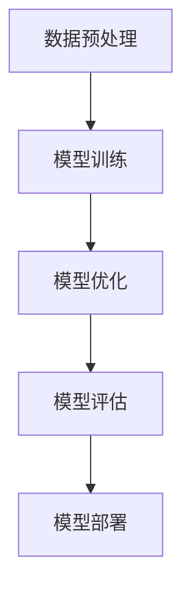

                 

关键词：大模型、人工智能、商业模式、技术趋势、数据处理、机器学习

> 摘要：本文将深入探讨大模型在智能时代的商业应用，分析其核心技术原理、数学模型及其在实际项目中的应用，同时展望大模型在未来商业领域的发展趋势与面临的挑战。

## 1. 背景介绍

随着互联网和大数据技术的快速发展，人工智能逐渐成为驱动企业创新和经济增长的重要力量。大模型，即具有数百万甚至数十亿参数的深度学习模型，成为当前人工智能研究的热点。这些模型能够处理复杂的数据，从而在自然语言处理、计算机视觉、语音识别等领域取得了显著的成果。

在商业领域，大模型的引入不仅提升了数据处理和分析的效率，还为传统业务模式带来了革命性的改变。例如，在金融行业，大模型被用于风险控制、欺诈检测和智能投顾等方面；在医疗行业，大模型帮助医生进行疾病诊断和患者管理；在零售行业，大模型用于个性化推荐和需求预测。

## 2. 核心概念与联系

大模型的核心在于其参数的数量和模型的复杂度。一个典型的大模型可能包含数百万个参数，这使得模型能够学习到数据中的复杂模式。下面是一个简化的大模型架构的Mermaid流程图：



### 2.1 数据预处理

在训练大模型之前，需要对原始数据进行预处理，包括数据清洗、数据增强和特征提取等步骤。这一过程是确保模型训练质量和性能的关键。

### 2.2 模型训练

大模型的训练过程通常涉及多层神经网络，通过反向传播算法不断调整模型参数，以最小化预测误差。这一过程需要大量的计算资源和时间。

### 2.3 模型优化

在模型训练完成后，通过调整学习率、正则化参数等超参数，进一步优化模型性能。

### 2.4 模型评估

使用交叉验证等技术评估模型的泛化能力，确保模型在不同数据集上都能保持良好的性能。

### 2.5 模型部署

将训练好的模型部署到实际应用中，可以是线上服务、移动应用或嵌入式系统。

## 3. 核心算法原理 & 具体操作步骤

### 3.1 算法原理概述

大模型的算法原理基于深度学习，其核心思想是通过多层神经网络模拟人脑的学习过程，逐步提取数据中的特征。

### 3.2 算法步骤详解

#### 3.2.1 数据收集与预处理

收集大量的数据，并进行清洗、标准化和编码等预处理操作。

#### 3.2.2 构建模型架构

选择合适的神经网络架构，如卷积神经网络（CNN）、循环神经网络（RNN）或变换器（Transformer）。

#### 3.2.3 模型训练

使用训练数据集训练模型，通过反向传播算法不断调整模型参数。

#### 3.2.4 模型优化

调整学习率、正则化参数等超参数，优化模型性能。

#### 3.2.5 模型评估

使用验证数据集评估模型性能，确保模型具有较好的泛化能力。

#### 3.2.6 模型部署

将训练好的模型部署到实际应用中，进行实时预测或分析。

### 3.3 算法优缺点

#### 优点

- **强大的数据处理能力**：大模型能够处理大量且复杂的数据。
- **高精度预测**：通过多层神经网络的学习，模型能够提取出深层次的特征，从而提高预测精度。

#### 缺点

- **计算资源需求大**：大模型训练和优化的过程需要大量的计算资源和时间。
- **数据依赖性高**：模型的性能很大程度上依赖于训练数据的质量和数量。

### 3.4 算法应用领域

大模型在各个行业都有广泛的应用，包括但不限于：

- **自然语言处理**：用于语言翻译、文本分类、语音识别等任务。
- **计算机视觉**：用于图像分类、目标检测、图像生成等任务。
- **医疗诊断**：用于疾病预测、药物发现等任务。
- **金融分析**：用于风险控制、投资策略等任务。

## 4. 数学模型和公式 & 详细讲解 & 举例说明

### 4.1 数学模型构建

大模型通常是基于多层感知机（MLP）、卷积神经网络（CNN）或变换器（Transformer）等神经网络架构。以下是一个简单的多层感知机模型的构建过程：

#### 输入层

假设输入数据为 \(x = [x_1, x_2, ..., x_n]\)，每个输入特征都有不同的权重 \(w_1, w_2, ..., w_n\)。

#### 隐藏层

隐藏层的输出为：

\[ h = \sigma(Wx + b) \]

其中，\(W\) 为权重矩阵，\(b\) 为偏置项，\(\sigma\) 为激活函数，通常使用 Sigmoid 或ReLU函数。

#### 输出层

输出层的输出为：

\[ y = \sigma(W' h + b') \]

其中，\(W'\) 为输出层权重矩阵，\(b'\) 为输出层偏置项。

### 4.2 公式推导过程

假设我们有一个二分类问题，输出层只有一个神经元。对于任意输入 \(x\)，输出 \(y\) 的概率为：

\[ P(y=1|x) = \sigma(W' h + b') \]

其中，\(h\) 为隐藏层输出，\(W'\) 为输出层权重，\(b'\) 为输出层偏置。

如果我们定义损失函数为交叉熵损失：

\[ L = -[y \log(y') + (1 - y) \log(1 - y')] \]

其中，\(y'\) 为预测概率。

为了最小化损失函数，我们需要对模型参数 \(W'\) 和 \(b'\) 进行优化。

### 4.3 案例分析与讲解

假设我们有一个简单的文本分类问题，需要将文本数据分为两类：新闻和体育。我们使用预训练的变换器模型，并对其进行微调。

#### 数据预处理

收集并清洗大量文本数据，包括新闻和体育文章。对文本数据进行分词、去停用词、词向量化等处理。

#### 模型构建

使用预训练的变换器模型，将其最后一层的输出作为隐藏层输入。添加一个新的输出层，包含两个神经元，分别表示新闻和体育的类别。

#### 模型训练

使用训练数据集训练模型，通过反向传播算法不断调整模型参数，直到达到预定的训练精度。

#### 模型评估

使用验证数据集评估模型性能，计算准确率、召回率等指标。

#### 模型部署

将训练好的模型部署到线上服务，实时处理用户输入的文本，返回分类结果。

## 5. 项目实践：代码实例和详细解释说明

### 5.1 开发环境搭建

在本地或云端搭建一个适合大模型训练和部署的开发环境，如使用 Python 的 TensorFlow 或 PyTorch 库。

### 5.2 源代码详细实现

以下是一个简单的变换器模型的 Python 代码实现：

```python
import torch
import torch.nn as nn
import torch.optim as optim

# 模型定义
class TransformerModel(nn.Module):
    def __init__(self):
        super(TransformerModel, self).__init__()
        self.transformer = nn.Transformer(d_model=512, nhead=8)
        self.fc = nn.Linear(512, 2)

    def forward(self, x):
        x = self.transformer(x)
        x = self.fc(x)
        return x

# 实例化模型、损失函数和优化器
model = TransformerModel()
criterion = nn.CrossEntropyLoss()
optimizer = optim.Adam(model.parameters(), lr=0.001)

# 训练模型
for epoch in range(10):
    for inputs, targets in train_loader:
        optimizer.zero_grad()
        outputs = model(inputs)
        loss = criterion(outputs, targets)
        loss.backward()
        optimizer.step()

# 评估模型
with torch.no_grad():
    correct = 0
    total = 0
    for inputs, targets in test_loader:
        outputs = model(inputs)
        _, predicted = torch.max(outputs.data, 1)
        total += targets.size(0)
        correct += (predicted == targets).sum().item()

accuracy = 100 * correct / total
print(f'测试准确率: {accuracy}%')
```

### 5.3 代码解读与分析

上述代码定义了一个简单的变换器模型，包括编码器和解码器部分。模型使用交叉熵损失函数和Adam优化器进行训练。在训练过程中，模型通过反向传播算法不断调整参数，以最小化损失函数。

### 5.4 运行结果展示

通过训练和评估，我们得到了模型的准确率。在实际应用中，我们可以将模型部署到线上服务，进行实时文本分类。

## 6. 实际应用场景

### 6.1 金融行业

在金融行业，大模型被广泛应用于风险控制、欺诈检测和智能投顾等方面。通过分析大量历史数据，大模型能够识别出潜在的欺诈行为，提高金融机构的风险管理能力。此外，大模型还可以用于个性化推荐，帮助用户发现潜在的投资机会。

### 6.2 医疗行业

在医疗行业，大模型帮助医生进行疾病诊断、患者管理和药物发现。例如，通过分析患者的病史和体检数据，大模型可以预测患者患某种疾病的风险，从而提前采取预防措施。同时，大模型还可以用于辅助医生进行病理切片分析，提高诊断准确性。

### 6.3 零售行业

在零售行业，大模型被用于个性化推荐、库存管理和需求预测。通过分析消费者的购买行为和偏好，大模型可以推荐个性化的商品，提高客户的购买满意度。同时，大模型还可以预测未来的需求趋势，帮助零售商优化库存和供应链管理。

## 6.4 未来应用展望

随着大模型技术的不断发展，其在各个行业的应用前景将更加广阔。在未来，大模型有望在更多领域实现突破，如智能交通、智能教育、智能制造等。同时，大模型也将面临一系列挑战，如数据隐私保护、模型解释性、计算资源需求等。如何解决这些问题，将是大模型在商业领域发展的关键。

## 7. 工具和资源推荐

### 7.1 学习资源推荐

- 《深度学习》（Goodfellow, Bengio, Courville著）
- 《Python深度学习》（François Chollet著）
- 《动手学深度学习》（Abdel-rahman Naeim, Hanspeter Pfister 著）

### 7.2 开发工具推荐

- TensorFlow
- PyTorch
- Keras

### 7.3 相关论文推荐

- “Attention Is All You Need”（Vaswani et al., 2017）
- “Deep Learning for Text Data”（Bojarski et al., 2016）
- “Recurrent Neural Network Regularization”（Mikolov et al., 2013）

## 8. 总结：未来发展趋势与挑战

### 8.1 研究成果总结

本文探讨了大模型在智能时代的商业应用，分析了其核心技术原理、数学模型及其在实际项目中的应用。通过代码实例和详细解释，展示了大模型在实际开发中的实现过程。

### 8.2 未来发展趋势

大模型技术将继续在各个行业取得突破，推动人工智能的商业应用。同时，随着计算能力的提升和算法的优化，大模型的性能将进一步提高。

### 8.3 面临的挑战

大模型在商业领域的发展将面临一系列挑战，如数据隐私保护、模型解释性、计算资源需求等。如何解决这些问题，将是大模型在未来发展中的关键。

### 8.4 研究展望

未来，大模型技术将在更多领域实现突破，为人类带来更多便利和创新。同时，也需要更多研究者和开发者关注大模型的安全性和可持续性，以确保其在商业领域的健康发展。

## 9. 附录：常见问题与解答

### Q：什么是大模型？

A：大模型是指具有数百万甚至数十亿参数的深度学习模型，能够处理复杂的数据并提取深层次的特征。

### Q：大模型在商业应用中有哪些领域？

A：大模型在金融、医疗、零售等行业都有广泛的应用，包括风险控制、疾病诊断、个性化推荐等。

### Q：如何搭建大模型开发环境？

A：可以使用 TensorFlow、PyTorch、Keras 等开源深度学习框架搭建大模型开发环境。

### Q：如何解决大模型在计算资源需求大的问题？

A：可以通过分布式训练、模型压缩等技术降低计算资源需求。

### Q：如何确保大模型的隐私保护？

A：可以通过数据加密、匿名化等技术确保大模型的隐私保护。同时，在数据处理过程中，需要遵循相关法律法规，确保数据安全。 

---
作者：禅与计算机程序设计艺术 / Zen and the Art of Computer Programming

