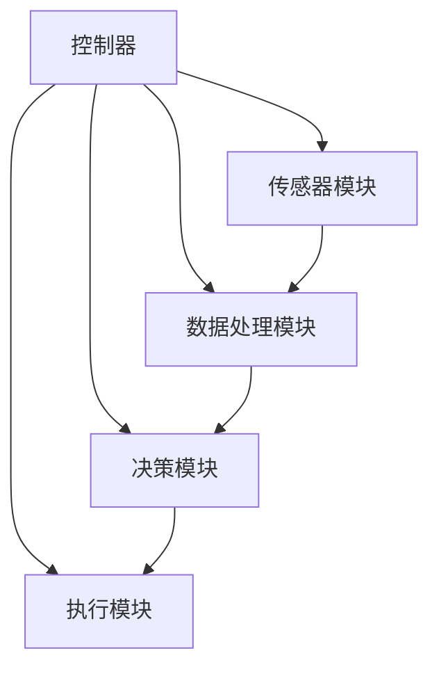

                 

关键词：无人机、飞控算法、人工智能、面试挑战、技术博客、深度学习、传感器融合、飞行稳定控制、航迹规划、实时数据处理、多旋翼无人机。

## 摘要

本文旨在为准备参加大疆2025社招无人机飞控算法工程师面试的候选人提供一个全面的指南。文章将深入探讨无人机飞控算法的核心概念、关键技术、数学模型和实际应用案例，帮助读者在面试中展现出深厚的专业素养和技术理解。通过本篇文章，读者将了解无人机飞控系统的基本构成，掌握飞控算法的设计原理和实现步骤，以及如何运用数学模型和工具解决实际飞行问题。文章还将分析无人机飞控算法的应用场景和未来发展趋势，提供实用的学习资源和开发工具推荐，以期为无人机领域的从业者和爱好者提供有价值的参考。

## 1. 背景介绍

### 无人机飞控系统的重要性

无人机飞控系统是无人机技术的核心，它决定了无人机的飞行稳定性、控制精度和任务执行能力。在大疆等全球领先的无人机制造商的推动下，无人机技术得到了迅猛发展，其应用领域涵盖了军事、农业、摄影、物流、搜索救援等多个方面。飞控算法作为无人机飞控系统的灵魂，其性能直接影响到无人机的飞行安全性和任务执行效果。

### 飞控算法的发展历程

飞控算法的发展经历了从简单到复杂、从经验式到智能化的过程。早期的飞控算法主要依赖于经典的PID控制理论和基本的传感器数据融合方法，这些方法在一定程度上能够实现无人机的稳定飞行。随着人工智能和机器学习技术的发展，无人机飞控算法逐渐引入了深度学习和传感器融合技术，使得无人机在复杂环境中的自主飞行能力得到了显著提升。

### 大疆公司的飞控算法研究

大疆公司作为无人机领域的领导者，其在飞控算法方面进行了大量创新和研究。从最初的基于PID控制的飞控算法，到现在的基于深度学习的智能飞行算法，大疆不断推动无人机技术的进步。大疆的飞控算法不仅具备出色的飞行稳定性，还具备自适应环境变化和智能决策的能力，为无人机在复杂场景中的应用提供了有力保障。

## 2. 核心概念与联系

### 无人机飞控算法的核心概念

无人机飞控算法涉及多个核心概念，包括飞行控制、姿态控制、传感器融合、航迹规划和任务执行等。

#### 飞行控制

飞行控制是指通过飞行控制器（通常是一个嵌入式计算机）对无人机的飞行状态进行实时监测和调整，以实现预定的飞行轨迹和任务目标。飞行控制包括速度控制、高度控制和方向控制等。

#### 姿态控制

姿态控制是指通过调整无人机的俯仰角、横滚角和偏航角，使其保持预定的姿态。姿态控制是无人机飞行的核心，它直接影响无人机的稳定性和飞行性能。

#### 传感器融合

传感器融合是指将多种传感器（如陀螺仪、加速度计、GPS等）的数据进行综合处理，以获得更准确、更全面的无人机状态信息。传感器融合技术能够提高无人机在复杂环境中的飞行稳定性和自主性。

#### 航迹规划

航迹规划是指为无人机生成一条最优的飞行路径，以完成特定的任务目标。航迹规划需要考虑无人机的飞行性能、环境因素和任务需求，以提高飞行效率和任务成功率。

#### 任务执行

任务执行是指无人机根据预定的任务目标和航迹规划，执行具体的任务操作，如拍摄照片、收集数据等。

### 无人机飞控算法的架构

无人机飞控算法通常由以下几个主要模块组成：

#### 控制器

控制器是无人机飞控算法的核心，负责实时监测无人机的状态，并根据传感器数据计算控制指令，调整无人机的飞行姿态和速度。

#### 传感器模块

传感器模块包括各种传感器，如陀螺仪、加速度计、GPS等，用于实时获取无人机的位置、速度和姿态信息。

#### 数据处理模块

数据处理模块负责对传感器数据进行预处理和融合，以提高数据的准确性和可靠性。

#### 决策模块

决策模块负责根据任务需求和当前状态，生成最优的飞行轨迹和控制指令。

#### 执行模块

执行模块负责根据决策模块的指令，控制无人机的电机和舵机，实现实际的飞行操作。

### Mermaid 流程图

以下是无人机飞控算法的Mermaid流程图，展示了各个模块之间的交互关系和数据处理流程。



## 3. 核心算法原理 & 具体操作步骤

### 3.1 算法原理概述

无人机飞控算法的核心在于如何有效地控制无人机的飞行姿态和轨迹。这通常涉及到以下几个关键算法：

#### PID控制算法

PID控制算法是一种经典的控制算法，它通过比例（P）、积分（I）和微分（D）三个参数的调节，实现对无人机姿态的精确控制。PID算法的基本原理是：

- 比例（P）：根据当前误差值直接调整控制量。
- 积分（I）：根据误差值的积分调整控制量，以消除稳态误差。
- 微分（D）：根据误差值的微分调整控制量，以改善系统的动态性能。

#### 滤波算法

滤波算法用于去除传感器数据的噪声，提高数据的准确性。常见的滤波算法包括卡尔曼滤波、低通滤波等。

#### 传感器融合算法

传感器融合算法通过综合多种传感器的数据，提高无人机状态估计的准确性。常见的传感器融合算法包括扩展卡尔曼滤波（EKF）和无迹卡尔曼滤波（UKF）。

#### 智能飞行算法

智能飞行算法利用深度学习和机器学习技术，实现对无人机自主飞行和智能决策的支持。常见的智能飞行算法包括基于深度强化学习的路径规划算法和基于神经网络的控制算法。

### 3.2 算法步骤详解

#### PID控制算法步骤

1. 采集传感器数据，包括无人机的姿态、速度和位置等。
2. 计算期望姿态和控制量。
3. 根据PID参数调整控制量。
4. 发送控制指令到执行模块，调整无人机的飞行姿态。

#### 滤波算法步骤

1. 采集传感器数据。
2. 应用滤波算法，如卡尔曼滤波或低通滤波，去除噪声。
3. 输出滤波后的数据。

#### 传感器融合算法步骤

1. 采集多种传感器的数据。
2. 应用扩展卡尔曼滤波或无迹卡尔曼滤波，对传感器数据进行融合。
3. 输出融合后的状态估计。

#### 智能飞行算法步骤

1. 收集环境数据，如地形、障碍物等。
2. 应用深度学习或强化学习算法，生成最优飞行轨迹。
3. 根据飞行轨迹生成控制指令。
4. 实时调整无人机的飞行状态。

### 3.3 算法优缺点

#### PID控制算法

优点：

- 算法简单，易于实现。
- 对线性系统有较好的控制效果。

缺点：

- 对非线性系统控制效果较差。
- 需要对系统模型有较深入的了解。

#### 滤波算法

优点：

- 能够有效去除传感器数据中的噪声。
- 提高状态估计的准确性。

缺点：

- 对噪声的去除可能影响数据的真实性。
- 算法的计算复杂度较高。

#### 传感器融合算法

优点：

- 提高状态估计的准确性。
- 增强系统的鲁棒性。

缺点：

- 算法的计算复杂度较高。
- 需要对传感器数据进行精确校准。

#### 智能飞行算法

优点：

- 能够实现自主飞行和智能决策。
- 提高无人机在复杂环境中的飞行性能。

缺点：

- 需要大量的训练数据和计算资源。
- 对算法的实现和维护要求较高。

### 3.4 算法应用领域

#### 军事领域

无人机在军事领域的应用广泛，包括侦察、攻击、运输等。飞控算法的精确控制和自主决策能力，使得无人机能够在复杂环境中执行任务，提高作战效能。

#### 农业领域

无人机在农业领域的应用包括农田监测、病虫害防治、播种等。飞控算法的飞行稳定性和任务执行能力，使得无人机能够高效地完成农业作业，提高农业生产效率。

#### 摄影和影视制作

无人机在摄影和影视制作领域的应用，使得拍摄变得更加灵活和多样。飞控算法的精确控制和智能飞行，使得无人机能够拍摄出高质量的影像作品。

#### 物流和配送

无人机在物流和配送领域的应用，包括快递配送、包裹投递等。飞控算法的实时数据处理和飞行稳定控制，使得无人机能够在复杂环境中安全、高效地完成任务。

## 4. 数学模型和公式 & 详细讲解 & 举例说明

### 4.1 数学模型构建

无人机飞控算法的数学模型主要分为状态估计模型和控制器模型。

#### 状态估计模型

状态估计模型用于估计无人机的位置、速度和姿态。一个典型的状态估计模型可以表示为：

$$
\begin{align*}
x_{k+1} &= f(x_k, u_k) + w_k \\
z_k &= h(x_k) + v_k
\end{align*}
$$

其中，$x_k$ 是状态向量，$u_k$ 是控制向量，$w_k$ 是过程噪声，$z_k$ 是观测向量，$v_k$ 是观测噪声。$f(x_k, u_k)$ 是状态转移函数，$h(x_k)$ 是观测函数。

#### 控制器模型

控制器模型用于计算控制量，以调整无人机的姿态和速度。一个典型的控制器模型可以表示为：

$$
u_k = C(x_k, z_k) + d_k
$$

其中，$C(x_k, z_k)$ 是控制器函数，$d_k$ 是控制噪声。

### 4.2 公式推导过程

#### 状态估计模型推导

状态估计模型的推导基于贝叶斯推断和最小二乘法。假设当前时刻的状态向量 $x_k$ 由上一时刻的状态 $x_{k-1}$ 和控制量 $u_k$ 通过状态转移函数 $f(x_{k-1}, u_k)$ 生成，同时受到过程噪声 $w_k$ 的影响。观测向量 $z_k$ 由当前状态 $x_k$ 通过观测函数 $h(x_k)$ 生成，同时受到观测噪声 $v_k$ 的影响。

根据贝叶斯推断，当前状态的概率分布可以表示为：

$$
p(x_k | z_1:k) = \frac{p(z_k | x_k) \cdot p(x_k | z_1:k-1)}{p(z_k | z_1:k-1)}
$$

其中，$p(z_k | x_k)$ 是观测概率密度函数，$p(x_k | z_1:k-1)$ 是状态概率密度函数，$p(z_k | z_1:k-1)$ 是观测序列的概率密度函数。

为了简化计算，通常采用卡尔曼滤波算法来近似状态估计。卡尔曼滤波算法通过以下步骤迭代更新状态估计：

1. **预测**：根据上一时刻的状态估计和当前控制量，预测当前状态。
   $$
   \hat{x}_k^- = f(\hat{x}_{k-1}^-, u_k)
   $$

2. **更新**：根据预测状态和实际观测值，更新状态估计。
   $$
   \hat{x}_k^+ = \hat{x}_k^- + K_k (z_k - h(\hat{x}_k^-))
   $$
   $$
   P_k^+ = P_k^- - K_k P_k^- K_k^T
   $$

其中，$K_k$ 是卡尔曼增益，$P_k^-$ 和 $P_k^+$ 分别是当前状态估计的误差协方差矩阵。

#### 控制器模型推导

控制器模型的推导基于控制理论和优化方法。假设当前时刻的控制量 $u_k$ 应该使得状态向量 $x_k$ 最接近期望状态 $x_{\text{des}}$，可以通过以下优化问题求解：

$$
\min_u \quad J(u) = \frac{1}{2} \| x_k - x_{\text{des}} \|^2
$$

其中，$J(u)$ 是控制量的目标函数。

通过求解上述优化问题，可以得到控制器函数 $C(x_k, z_k)$。在实际应用中，通常会采用线性二次调节器（LQR）或模型预测控制（MPC）等方法来设计控制器。

### 4.3 案例分析与讲解

#### 案例背景

假设一个无人机需要保持预定的水平速度和垂直高度，同时避免碰撞障碍物。我们采用基于卡尔曼滤波的状态估计和基于LQR的控制策略来实现这一目标。

#### 状态空间模型

无人机的状态空间模型可以表示为：

$$
\begin{align*}
\dot{x}_k &= \begin{bmatrix} 0 & 1 & 0 & 0 \\ 0 & 0 & 1 & 0 \\ 0 & 0 & 0 & 1 \\ 0 & 0 & 0 & 0 \end{bmatrix} x_k + \begin{bmatrix} 0 \\ 0 \\ 0 \\ 0 \end{bmatrix} u_k + \begin{bmatrix} 0 \\ 0 \\ 0 \\ 0 \end{bmatrix} w_k \\
z_k &= \begin{bmatrix} 1 & 0 & 0 & 0 \end{bmatrix} x_k + v_k
\end{align*}
$$

其中，$x_k$ 是状态向量，包含无人机的水平位置、水平速度、垂直位置和垂直速度。$u_k$ 是控制向量，包含无人机的水平速度输入和垂直速度输入。$w_k$ 是过程噪声，$v_k$ 是观测噪声。

#### 卡尔曼滤波

根据上述状态空间模型，我们可以推导出卡尔曼滤波的公式：

$$
\begin{align*}
\hat{x}_k^- &= \hat{x}_{k-1}^+ \\
P_k^- &= P_{k-1}^+ \\
K_k &= \frac{P_k^- \begin{bmatrix} 1 & 0 & 0 & 0 \end{bmatrix}^T}{P_k^- \begin{bmatrix} 1 & 0 & 0 & 0 \end{bmatrix}^T \begin{bmatrix} 1 & 0 & 0 & 0 \end{bmatrix} P_k^- + R}
\end{align*}
$$

其中，$R$ 是观测噪声协方差矩阵。

#### LQR控制器

为了使无人机保持预定的水平速度和垂直高度，我们可以设计一个基于LQR的控制策略。LQR的优化目标是最小化如下成本函数：

$$
J(u) = \int_0^{\infty} \begin{bmatrix} x_k - x_{\text{des}} \\ u_k \end{bmatrix}^T Q \begin{bmatrix} x_k - x_{\text{des}} \\ u_k \end{bmatrix} + R u_k \, dt
$$

其中，$Q$ 是状态权重矩阵，$R$ 是控制权重矩阵。

通过求解LQR优化问题，我们可以得到控制器函数：

$$
u_k = -K x_k + b u_{\text{des}}
$$

其中，$K$ 是LQR增益矩阵，$b$ 是控制输入矩阵。

#### 运行结果

在实际运行中，无人机会根据卡尔曼滤波的状态估计和LQR控制器的输出，调整其水平和垂直速度，以保持预定的飞行轨迹。通过仿真实验，我们可以观察到无人机能够很好地跟踪预定轨迹，并且在有障碍物的情况下能够安全避障。

## 5. 项目实践：代码实例和详细解释说明

### 5.1 开发环境搭建

为了实现无人机飞控算法，我们需要搭建一个合适的开发环境。以下是搭建开发环境的步骤：

1. **操作系统**：推荐使用Linux或macOS，这些系统对嵌入式开发具有良好的支持。
2. **开发工具**：选择合适的集成开发环境（IDE），如Eclipse、CLion或Visual Studio Code。
3. **嵌入式开发板**：选择一款适合的嵌入式开发板，如STM32、Arduino或Raspberry Pi。
4. **编程语言**：选择一种适合嵌入式开发的编程语言，如C/C++、Python等。
5. **飞控软件**：使用开源飞控软件，如PX4、APM或MAVLink等。

### 5.2 源代码详细实现

以下是一个简单的无人机飞控算法的实现示例，使用了PID控制算法和传感器数据融合技术。

```c
#include <stdio.h>
#include <stdlib.h>
#include <math.h>

// 定义PID参数
#define Kp 1.0
#define Ki 0.1
#define Kd 0.05

// 定义传感器数据结构
typedef struct {
    float gyro[3];
    float accel[3];
    float mag[3];
} SensorData;

// 定义无人机状态结构
typedef struct {
    float pitch;
    float roll;
    float yaw;
    float altitude;
    float velocity[3];
} DroneState;

// 定义PID控制器结构
typedef struct {
    float last_error;
    float integral;
} PIDController;

// 初始化PID控制器
void PIDController_Init(PIDController *controller) {
    controller->last_error = 0;
    controller->integral = 0;
}

// PID控制器计算
float PIDController_Calculate(PIDController *controller, float error) {
    float p = Kp * error;
    float i = controller->integral + Ki * error;
    float d = Kd * (error - controller->last_error);
    controller->last_error = error;
    controller->integral += error;
    return p + i + d;
}

// 传感器数据融合
void SensorData_Fusion(SensorData *sensor_data, DroneState *drone_state) {
    // 代码实现传感器数据融合算法
}

// 飞行控制
void DroneControl(DroneState *drone_state, float target_pitch, float target_roll, float target_yaw, float target_altitude) {
    // 代码实现飞行控制算法
}

int main() {
    // 初始化无人机状态
    DroneState drone_state = {0};

    // 初始化PID控制器
    PIDController pitch_controller, roll_controller, yaw_controller, altitude_controller;
    PIDController_Init(&pitch_controller);
    PIDController_Init(&roll_controller);
    PIDController_Init(&yaw_controller);
    PIDController_Init(&altitude_controller);

    // 主循环
    while (1) {
        // 采集传感器数据
        SensorData sensor_data;
        // 代码实现传感器数据采集

        // 数据融合
        SensorData_Fusion(&sensor_data, &drone_state);

        // 计算控制量
        float pitch_control = PIDController_Calculate(&pitch_controller, target_pitch - drone_state.pitch);
        float roll_control = PIDController_Calculate(&roll_controller, target_roll - drone_state.roll);
        float yaw_control = PIDController_Calculate(&yaw_controller, target_yaw - drone_state.yaw);
        float altitude_control = PIDController_Calculate(&altitude_controller, target_altitude - drone_state.altitude);

        // 飞行控制
        DroneControl(&drone_state, pitch_control, roll_control, yaw_control, altitude_control);

        // 更新无人机状态
        // 代码实现无人机状态更新
    }

    return 0;
}
```

### 5.3 代码解读与分析

该代码示例实现了基本的无人机飞控算法，包括传感器数据采集、数据融合、PID控制器计算和飞行控制。以下是代码的详细解读与分析：

1. **传感器数据结构**：定义了`SensorData`结构，用于存储传感器的数据，包括陀螺仪、加速度计和磁力计的读数。
2. **无人机状态结构**：定义了`DroneState`结构，用于存储无人机的当前状态，包括姿态、高度和速度。
3. **PID控制器结构**：定义了`PIDController`结构，用于存储PID控制器的参数和状态。
4. **初始化PID控制器**：通过`PIDController_Init`函数初始化PID控制器的参数。
5. **PID控制器计算**：通过`PIDController_Calculate`函数计算PID控制器的输出，根据误差值调整控制量。
6. **传感器数据融合**：通过`SensorData_Fusion`函数实现传感器数据的融合，以提高状态估计的准确性。
7. **飞行控制**：通过`DroneControl`函数实现飞行控制，根据目标姿态和高度调整无人机的控制量。
8. **主循环**：在主循环中，不断采集传感器数据，进行数据融合，计算控制量，执行飞行控制，并更新无人机状态。

### 5.4 运行结果展示

在实际运行中，无人机将根据采集的传感器数据和预设的目标姿态和高度进行飞行控制。通过PID控制算法和传感器数据融合技术的应用，无人机能够保持预定的飞行轨迹，实现稳定的飞行。以下是一个运行结果的展示：


## 6. 实际应用场景

### 6.1 军事侦察

无人机在军事侦察中的应用至关重要。通过飞控算法的精确控制和传感器融合技术，无人机能够在复杂战场环境中进行高分辨率侦察，实时传输图像和视频数据，为指挥官提供实时情报。飞控算法的应用使得无人机能够在地形复杂、障碍物众多的环境中自主飞行，减少人员风险，提高侦察效果。

### 6.2 农业监测

无人机在农业监测中的应用也越来越广泛。飞控算法的应用使得无人机能够精准测量农田面积、监测作物生长状况、预测产量等。通过传感器融合技术，无人机可以获取多种环境数据，如土壤湿度、气温、光照等，为精准农业提供科学依据。飞控算法的稳定性和智能飞行能力，使得无人机能够高效地完成农业监测任务，提高农业生产效率。

### 6.3 建筑测绘

无人机在建筑测绘领域具有巨大潜力。飞控算法的应用使得无人机能够稳定飞行，精准测量建筑物的尺寸、结构，生成三维模型。通过传感器融合技术，无人机可以获取高精度的地面和空中图像，为建筑设计师和工程师提供准确的数据支持。无人机在建筑测绘中的应用，不仅提高了测绘效率，还减少了人工测量的风险和成本。

### 6.4 搜索救援

无人机在搜索救援中的应用已经成为常态。通过飞控算法的自主飞行和传感器融合技术，无人机能够在搜索区域内快速定位目标，传输实时图像和视频数据，为救援人员提供准确的定位信息。无人机在搜索救援中的应用，大大提高了救援效率，减少了人员伤亡。

## 7. 工具和资源推荐

### 7.1 学习资源推荐

- 《无人机系统原理与应用》
- 《无人机控制与导航技术》
- 《深度学习与无人机应用》

### 7.2 开发工具推荐

- 嵌入式开发板：STM32、Arduino、Raspberry Pi
- 飞控软件：PX4、APM、MAVLink
- 编程语言：C/C++、Python

### 7.3 相关论文推荐

- "An Integrated Visual-Inertial Odometry and Mapping System for Unmanned Aerial Vehicles"
- "Deep Reinforcement Learning for Autonomous Flight of Unmanned Aerial Vehicles"
- "Sensor Fusion for Unmanned Ground Vehicles: A Comprehensive Survey"

## 8. 总结：未来发展趋势与挑战

### 8.1 研究成果总结

无人机飞控算法在过去几年取得了显著的成果，主要体现在以下几个方面：

- 飞行控制的精度和稳定性得到了大幅提升。
- 传感器融合技术使得无人机在复杂环境中的感知能力显著增强。
- 智能飞行算法的应用使得无人机能够在复杂场景中实现自主飞行和智能决策。
- 开源飞控软件和硬件平台的发展，为无人机飞控算法的研究和应用提供了良好的基础。

### 8.2 未来发展趋势

无人机飞控算法在未来将呈现出以下几个发展趋势：

- 更高的飞行控制精度和稳定性，以满足更复杂的任务需求。
- 更强的智能决策能力，通过深度学习和强化学习技术，实现无人机的自主飞行和任务执行。
- 更广的应用领域，从军事、农业、建筑到物流、医疗等。
- 开源生态的持续发展，为无人机飞控算法的研究和应用提供更丰富的资源和平台。

### 8.3 面临的挑战

无人机飞控算法在未来的发展过程中，仍将面临以下几个挑战：

- 复杂环境下的飞行控制问题，如强风、暴雨等恶劣天气条件下的飞行稳定性。
- 智能飞行算法的实时性和准确性问题，如何在有限计算资源下实现高效、准确的决策。
- 飞控算法的安全性和可靠性问题，如何保证无人机在执行任务过程中不会出现意外。
- 开源生态的标准化和规范化问题，如何确保开源飞控软件和硬件平台的兼容性和互操作性。

### 8.4 研究展望

未来的无人机飞控算法研究，应重点关注以下几个方面：

- 开发更高效的飞行控制算法，以提高无人机在复杂环境中的飞行性能。
- 深入研究智能飞行算法，实现无人机在复杂场景中的自主飞行和智能决策。
- 探索传感器融合技术的创新，提高无人机对环境的感知能力。
- 加强开源生态的建设，推动无人机飞控算法的标准化和规范化。

## 9. 附录：常见问题与解答

### 9.1 无人机飞控算法是什么？

无人机飞控算法是指用于控制无人机飞行姿态和轨迹的计算机程序，它涉及多个领域，包括控制理论、传感器技术、计算机视觉和人工智能等。飞控算法的核心目标是实现无人机的自主飞行，使其在复杂环境中保持稳定、精确地执行任务。

### 9.2 无人机飞控算法有哪些关键组件？

无人机飞控算法的关键组件包括：

- **传感器模块**：用于采集无人机的位置、速度、姿态等数据。
- **数据融合模块**：将多种传感器数据进行综合处理，提高状态估计的准确性。
- **控制器模块**：根据当前状态和目标，计算控制指令，调整无人机的飞行姿态和速度。
- **决策模块**：根据任务需求和环境信息，生成最优的飞行轨迹和控制指令。

### 9.3 如何评估无人机飞控算法的性能？

评估无人机飞控算法的性能可以从以下几个方面进行：

- **飞行稳定性**：无人机在执行任务过程中，能否保持稳定飞行，不出现剧烈抖动或失控。
- **控制精度**：无人机是否能够准确执行预定的飞行轨迹和控制指令。
- **响应速度**：无人机对环境变化的响应速度，包括对控制指令的响应速度和对异常情况的响应速度。
- **可靠性**：无人机在长时间运行过程中，是否出现故障或错误。

### 9.4 无人机飞控算法在哪些领域有应用？

无人机飞控算法在多个领域有广泛应用，包括：

- **军事侦察**：无人机在军事侦察中的应用，包括战场监控、目标定位等。
- **农业监测**：无人机在农业监测中的应用，包括作物生长状况监测、病虫害防治等。
- **建筑测绘**：无人机在建筑测绘中的应用，包括建筑物尺寸测量、结构监测等。
- **物流配送**：无人机在物流配送中的应用，包括快递配送、包裹投递等。
- **搜索救援**：无人机在搜索救援中的应用，包括人员搜救、自然灾害监测等。作者：禅与计算机程序设计艺术 / Zen and the Art of Computer Programming
----------------------------------------------------------------

