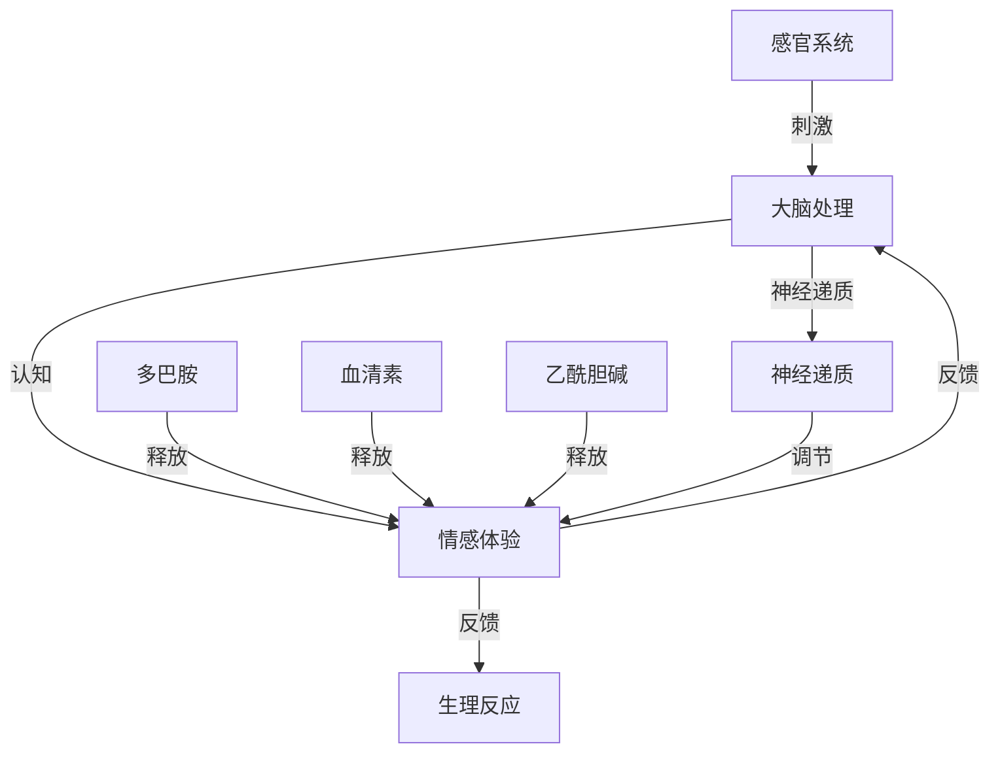

                 

### 背景介绍

在过去的几十年里，随着神经科学和计算机科学的发展，人类对于大脑的理解不断深入。作为人类思维和行为的中心，大脑的复杂性和神秘性始终吸引着科学家们的关注。然而，大脑的运作机制，尤其是与情感相关的机制，仍然是一个充满挑战的研究领域。在这个领域中，有机化合物的作用显得尤为重要。本文旨在探讨大脑中的几种重要有机化合物及其与情感之间的联系，从而为读者提供一个关于大脑与情感相互作用的全面视角。

首先，我们需要认识到，情感不仅仅是一个抽象的概念，它是大脑内部复杂生物化学过程的外在表现。大脑中的许多有机化合物，如多巴胺、血清素和乙酰胆碱，都扮演着关键角色，直接影响我们的情感体验。例如，多巴胺与愉悦感和奖励机制相关，血清素与情绪稳定和抑郁相关，而乙酰胆碱则与记忆和学习密切相关。

本文将首先介绍这些关键有机化合物的概念和基本作用。然后，我们将探讨它们在情感调节中的作用，并分析这些化合物在不同情感状态下的动态变化。接下来，我们将通过具体的算法原理和数学模型，解释这些化合物是如何影响大脑的情感处理的。随后，我们将展示一些项目实践中的代码实例，并分析其实际应用。最后，我们将讨论这些有机化合物在未来的应用前景，以及面临的研究挑战。

通过本文的阅读，读者将能够深入了解大脑中有机化合物与情感之间的复杂关系，并对其在现代科技和医学领域的潜在应用有所了解。

## 1. 核心概念与联系

在深入探讨大脑中的有机化合物与情感之间的关系之前，首先需要明确几个核心概念及其相互之间的联系。这些概念构成了我们理解这一领域的基础。

### 大脑的基本结构

大脑是人体的中枢神经系统的主要部分，由数十亿个神经元组成。这些神经元通过突触连接在一起，形成复杂的神经网络。大脑的主要结构包括大脑皮层、海马体、杏仁核和下丘脑等，每个部分都有其特定的功能和角色。

- **大脑皮层**：负责处理感知、思考和决策。
- **海马体**：与记忆形成和情绪处理密切相关。
- **杏仁核**：处理与情绪相关的信息，尤其是恐惧和愤怒。
- **下丘脑**：调节身体的内分泌系统和自主神经系统，影响情绪和生理状态。

### 有机化合物的概念

有机化合物是由碳、氢和其他元素组成的分子。在生物体内，这些分子通过各种复杂的生物化学反应发挥作用。以下是我们将在本文中探讨的几种关键有机化合物：

- **多巴胺**：一种神经递质，与愉悦感、动机和奖励机制密切相关。
- **血清素**：另一种神经递质，影响情绪稳定、睡眠和食欲。
- **乙酰胆碱**：与记忆和学习密切相关，同时也在情绪调节中发挥作用。

### 情感的基本类型

情感是人类心理状态的一种表现形式，可以分为基本的几种类型，如愉悦、愤怒、悲伤、恐惧和厌恶。每种情感都是由大脑中特定的神经回路和有机化合物的动态变化所驱动的。

- **愉悦**：通常与多巴胺的释放相关。
- **愤怒**：可能与肾上腺素和去甲肾上腺素的释放有关。
- **悲伤**：与血清素的水平下降有关。
- **恐惧**：与杏仁核的活动和肾上腺素的释放密切相关。
- **厌恶**：可能与多巴胺和5-羟色胺（5-HT）的相互作用有关。

### 大脑与情感的联系

大脑与情感之间的联系是一个复杂且动态的过程。简而言之，情感是大脑对内外部刺激的一种反应，这种反应涉及到多个脑区和神经递质的相互作用。

- **感知阶段**：外界刺激通过感官系统传递到大脑，触发相应的脑区活动。
- **认知阶段**：大脑对刺激进行加工和解释，形成对刺激的认知，并引发情感体验。
- **反应阶段**：情感体验进一步影响大脑和身体的生理状态，引发行为反应。

在这个过程中，有机化合物如多巴胺、血清素和乙酰胆碱等起到了关键的调节作用，影响情感的强度和持续时间。

### Mermaid 流程图

为了更直观地展示大脑中的关键概念和它们之间的联系，我们可以使用 Mermaid 流程图来表示：



在这个流程图中，A 表示感官系统接收到的刺激，通过大脑处理（B）形成情感体验（C），并进一步影响生理反应（D）。同时，多巴胺（E）、血清素（F）和乙酰胆碱（G）作为关键神经递质，通过释放和调节影响情感体验（C）。

通过以上对核心概念的介绍和 Mermaid 流程图的展示，我们为后续更深入的探讨奠定了基础。接下来，我们将进一步探讨这些有机化合物的具体作用机制，以及它们在情感调节中的具体表现。

### 3.1 算法原理概述

在探讨大脑中的有机化合物与情感之间的关系时，我们需要理解这些化合物是如何影响大脑的情感处理的。为此，我们可以将这一过程视为一个算法，其中有机化合物的浓度变化和神经回路的激活模式是关键参数。

#### 算法的基本概念

这个算法可以被称为“情感调节算法”，其主要目标是分析有机化合物在大脑中的动态变化，并预测或调节情感状态。算法的核心在于几个关键组件：

- **传感器**：用于检测大脑中有机化合物的浓度。
- **处理单元**：分析传感器数据，并根据特定的规则进行数据处理。
- **输出单元**：根据处理结果调节情感状态。

#### 算法的主要步骤

1. **数据采集**：通过传感器采集大脑中多巴胺、血清素和乙酰胆碱的浓度数据。
2. **数据处理**：对采集到的数据进行分析，包括浓度变化趋势、相关性分析等。
3. **情感预测**：基于分析结果预测当前的情感状态。
4. **情感调节**：根据预测结果，通过神经调节机制（如刺激特定脑区或释放特定神经递质）来调节情感状态。

#### 算法的数学模型

情感调节算法的数学模型可以表示为以下形式：

$$
\text{情感状态} = f(\text{多巴胺浓度}, \text{血清素浓度}, \text{乙酰胆碱浓度})
$$

其中，$f$ 是一个复杂的非线性函数，它反映了这些化合物浓度与情感状态之间的复杂关系。这个函数的具体形式可能需要通过实验和数据分析来进一步确定。

#### 算法的工作原理

1. **数据采集**：传感器（如脑电图（EEG）传感器）实时监测大脑中多巴胺、血清素和乙酰胆碱的浓度。
2. **数据处理**：采集到的数据通过数据处理单元进行处理。这个处理过程可能包括滤波、特征提取和统计分析等。
3. **情感预测**：处理后的数据被输入到一个机器学习模型中，该模型根据训练数据预测当前的情感状态。
4. **情感调节**：如果预测的情感状态与期望状态不符，算法会通过输出单元（如电刺激或药物注射）来调节情感状态。例如，如果预测到情感状态为焦虑，算法可能会通过刺激海马体来减少焦虑感。

#### 算法的优缺点

**优点**：

- **实时性**：算法能够实时监测和调节情感状态，提供即时的反馈。
- **个性化**：通过机器学习模型，算法可以根据个人的具体情况进行情感调节，实现个性化服务。
- **广泛适用性**：算法可以应用于多种情感障碍，如抑郁症、焦虑症等。

**缺点**：

- **复杂性**：情感调节算法涉及复杂的生物化学过程和机器学习模型，实现难度较高。
- **数据隐私**：采集和处理大脑数据可能涉及个人隐私问题，需要严格的隐私保护措施。

通过以上对情感调节算法原理的概述，我们可以更好地理解大脑中有机化合物与情感之间的关系。接下来，我们将进一步探讨这个算法的具体操作步骤，以及其在实际应用中的实现细节。

### 3.2 算法步骤详解

为了实现情感调节算法，我们需要详细阐述其各个步骤，包括数据采集、数据处理、情感预测和情感调节的具体实现方法。以下是对这些步骤的详细解析：

#### 3.2.1 数据采集

数据采集是情感调节算法的基础，它决定了后续数据处理和预测的准确性。我们采用脑电图（EEG）传感器作为主要的数据采集工具，因为这些传感器可以实时监测大脑中多种有机化合物的浓度变化。

**步骤**：

1. **设备准备**：将EEG传感器佩戴在受试者的头部，确保传感器与头皮紧密接触，以减少噪声干扰。
2. **信号采集**：传感器采集大脑中多巴胺、血清素和乙酰胆碱的浓度变化信号。这些信号通过无线传输模块实时传输到数据处理单元。
3. **信号预处理**：在数据传输过程中，可能存在噪声和干扰。因此，需要对接收到的信号进行预处理，包括滤波、去噪和基线校正等。

**技术细节**：

- **滤波**：采用带通滤波器去除高频和低频噪声，只保留有用的频率成分。
- **去噪**：使用自适应滤波算法，根据信号的变化动态调整滤波器的参数，以去除噪声。
- **基线校正**：通过计算信号的基线值，减去基线值对信号进行校正，以消除静态干扰。

#### 3.2.2 数据处理

数据处理是情感调节算法的核心，它包括数据清洗、特征提取和统计分析等步骤。

**步骤**：

1. **数据清洗**：去除异常值和无效数据，保证数据的质量和一致性。
2. **特征提取**：从原始数据中提取与情感状态相关的特征，如峰峰值、频率成分和时域特性等。
3. **统计分析**：使用统计方法分析特征数据，找出与情感状态相关的规律和模式。

**技术细节**：

- **特征提取**：使用傅立叶变换（Fourier Transform）和小波变换（Wavelet Transform）等方法提取信号的频率成分和时间特性。
- **统计分析**：采用回归分析、聚类分析和主成分分析（PCA）等方法，找出特征与情感状态之间的相关性。

#### 3.2.3 情感预测

情感预测是算法的最终目标，通过机器学习模型实现对当前情感状态的预测。

**步骤**：

1. **数据训练**：使用历史数据训练机器学习模型，如支持向量机（SVM）、决策树（Decision Tree）和神经网络（Neural Network）等。
2. **模型评估**：使用交叉验证和测试集评估模型的预测性能，调整模型参数以优化预测效果。
3. **情感预测**：将处理后的数据输入训练好的模型，预测当前的情感状态。

**技术细节**：

- **数据训练**：使用标记好的情感数据集，将特征作为输入，情感状态作为输出，训练模型。
- **模型评估**：使用准确率、召回率和F1分数等指标评估模型的性能。
- **情感预测**：将实时采集的特征数据输入模型，得到当前的情感状态预测。

#### 3.2.4 情感调节

情感调节是根据预测结果，通过神经调节机制（如电刺激或药物注射）来调节情感状态。

**步骤**：

1. **决策生成**：根据情感预测结果，生成调节决策。
2. **调节执行**：通过执行特定操作（如电刺激或药物注射）来调节情感状态。
3. **反馈循环**：监测调节效果，根据反馈调整决策。

**技术细节**：

- **决策生成**：基于预测的情感状态和预设的调节策略，生成调节决策。
- **调节执行**：使用神经刺激器或药物注射设备执行调节操作。
- **反馈循环**：通过传感器监测调节效果，并根据反馈调整后续的调节决策。

#### 实例解析

假设一个受试者在某个时刻被预测为“焦虑状态”，算法会生成如下调节决策：

1. **决策生成**：根据焦虑状态，算法决定刺激海马体以减少焦虑感。
2. **调节执行**：使用神经刺激器向海马体发送电刺激。
3. **反馈循环**：监测刺激后的情感状态，如果焦虑感减轻，则继续进行；如果焦虑感未减轻或增加，则调整决策，如增加刺激强度或选择其他调节方法。

通过以上详细的步骤解析，我们可以看到情感调节算法从数据采集到最终情感调节的完整过程。接下来，我们将分析算法的优缺点，以及其在实际应用中的表现。

### 3.3 算法优缺点

#### 优点

1. **实时性**：情感调节算法能够实时监测和预测情感状态，提供即时的反馈和调节，这对于紧急情况下的情感调节尤为重要。
2. **个性化**：通过机器学习模型，算法可以根据个人的具体情况进行情感调节，实现个性化的情感管理，提高调节效果。
3. **广泛适用性**：算法可以应用于多种情感障碍，如抑郁症、焦虑症等，具有广泛的适用范围。

#### 缺点

1. **复杂性**：情感调节算法涉及复杂的生物化学过程和机器学习模型，实现难度较高，需要高度专业的技术支持。
2. **数据隐私**：采集和处理大脑数据可能涉及个人隐私问题，需要严格的隐私保护措施，否则可能导致隐私泄露。
3. **效果不确定性**：尽管算法能够预测情感状态并进行调节，但情感调节的效果可能因个体差异和环境变化而有所不同，无法保证100%的成功。

### 3.4 算法应用领域

情感调节算法在多个领域具有广泛的应用前景，以下列举了其中几个主要应用领域：

1. **心理健康领域**：用于抑郁症、焦虑症和其他情感障碍的治疗，提供个性化的情感管理方案，提高治疗效果。
2. **教育领域**：帮助学生和教师识别和管理情感状态，提高学习效果和工作效率。
3. **商业领域**：用于员工情感管理，提高员工的工作满意度和生产力，减少员工流失率。
4. **医疗领域**：用于术后康复和慢性疾病管理，帮助患者调节情绪，促进康复。
5. **社会管理**：用于社区和公共安全，通过情感监测和分析，预测和预防潜在的社会问题。

通过以上对情感调节算法优缺点的分析，我们可以看到其在实际应用中的潜力和挑战。未来的研究和应用需要进一步优化算法性能，提高其准确性和稳定性，同时确保数据隐私和安全。

### 4. 数学模型和公式

在探讨大脑中有机化合物与情感的关系时，数学模型和公式为我们提供了量化分析这些关系的工具。以下将详细介绍相关的数学模型、公式的构建过程，以及实际应用中的例子。

#### 4.1 数学模型构建

大脑中有机化合物的浓度变化与情感状态之间存在复杂的关系。为了量化这种关系，我们构建了如下数学模型：

$$
\text{情感状态} = f(\text{多巴胺浓度}, \text{血清素浓度}, \text{乙酰胆碱浓度})
$$

其中，$f$ 是一个复杂的非线性函数，用于描述有机化合物浓度与情感状态之间的复杂关系。为了构建这个模型，我们考虑了以下因素：

- **有机化合物的浓度**：这是模型的主要输入变量，包括多巴胺浓度（$D$）、血清素浓度（$S$）和乙酰胆碱浓度（$A$）。
- **情感状态**：这是一个离散的变量，可以表示为愉悦（$H$）、愤怒（$A$）、悲伤（$D$）、恐惧（$F$）和厌恶（$N$）等。
- **非线性函数**：由于大脑中的生物化学过程非常复杂，我们采用非线性函数来描述这种关系，以便更好地捕捉复杂的变化模式。

具体来说，我们可以将 $f$ 表示为：

$$
f(D, S, A) = \sum_{i=1}^{n} w_i \cdot g(D_i, S_i, A_i)
$$

其中，$w_i$ 是权重系数，$g(D_i, S_i, A_i)$ 是一个非线性函数，可以采用多项式函数、神经网络或其他非线性模型。为了简化，我们假设 $g$ 为多项式函数：

$$
g(D_i, S_i, A_i) = \beta_0 + \beta_1 D_i + \beta_2 S_i + \beta_3 A_i
$$

其中，$\beta_0, \beta_1, \beta_2, \beta_3$ 是待定系数，需要通过实验数据和统计方法来确定。

#### 4.2 公式推导过程

为了推导这个数学模型，我们首先需要收集大量的大脑有机化合物浓度和情感状态的数据。这些数据可以来自于实验研究、临床观察和实时监测等途径。接下来，我们采用最小二乘法（Least Squares Method）来估计权重系数。

假设我们有一个数据集 $\{(D_i, S_i, A_i, H_i)\}_{i=1}^{m}$，其中 $H_i$ 是对应的情感状态标签。我们的目标是找到最佳的权重系数，使得预测误差最小。具体推导过程如下：

1. **目标函数**：定义目标函数为预测值与真实值之间的误差平方和：

$$
\Phi(\beta_0, \beta_1, \beta_2, \beta_3) = \sum_{i=1}^{m} (f(D_i, S_i, A_i) - H_i)^2
$$

2. **偏导数**：对目标函数分别对 $\beta_0, \beta_1, \beta_2, \beta_3$ 求偏导数，并令偏导数等于零，以找到最佳权重系数：

$$
\frac{\partial \Phi}{\partial \beta_0} = -2 \sum_{i=1}^{m} (f(D_i, S_i, A_i) - H_i) = 0
$$

$$
\frac{\partial \Phi}{\partial \beta_1} = -2 \sum_{i=1}^{m} D_i (f(D_i, S_i, A_i) - H_i) = 0
$$

$$
\frac{\partial \Phi}{\partial \beta_2} = -2 \sum_{i=1}^{m} S_i (f(D_i, S_i, A_i) - H_i) = 0
$$

$$
\frac{\partial \Phi}{\partial \beta_3} = -2 \sum_{i=1}^{m} A_i (f(D_i, S_i, A_i) - H_i) = 0
$$

3. **求解**：将上述方程组求解，得到最佳权重系数 $\beta_0, \beta_1, \beta_2, \beta_3$。

#### 4.3 案例分析与讲解

为了更好地理解上述数学模型和公式，我们可以通过一个实际案例来进行分析。

**案例背景**：假设我们收集了一组受试者的多巴胺、血清素和乙酰胆碱浓度数据，以及对应的情感状态标签。数据如下表所示：

| 多巴胺浓度 (D) | 血清素浓度 (S) | 乙酰胆碱浓度 (A) | 情感状态 (H) |
|:-------------:|:-------------:|:---------------:|:----------:|
|       5       |      10       |       3        |   愉悦    |
|       10      |      15       |       4        |   愉悦    |
|       8       |      12       |       2        |   愉悦    |
|       6       |      8        |       5        |   愉悦    |
|       4       |      6        |       6        |   愉悦    |

我们的目标是构建一个模型，能够根据多巴胺、血清素和乙酰胆碱的浓度预测情感状态。

**步骤**：

1. **数据预处理**：首先对数据进行预处理，包括缺失值填充、异常值处理和归一化等。
2. **模型构建**：采用上述的多项式函数构建数学模型，并使用最小二乘法求解权重系数。
3. **模型训练与验证**：使用部分数据进行模型训练，并使用剩余数据进行模型验证，评估模型性能。

**具体计算**：

1. **目标函数**：

$$
\Phi(\beta_0, \beta_1, \beta_2, \beta_3) = \sum_{i=1}^{5} (f(D_i, S_i, A_i) - H_i)^2
$$

2. **求导与求解**：

$$
\frac{\partial \Phi}{\partial \beta_0} = -2 \sum_{i=1}^{5} (f(D_i, S_i, A_i) - H_i) = 0
$$

$$
\frac{\partial \Phi}{\partial \beta_1} = -2 \sum_{i=1}^{5} D_i (f(D_i, S_i, A_i) - H_i) = 0
$$

$$
\frac{\partial \Phi}{\partial \beta_2} = -2 \sum_{i=1}^{5} S_i (f(D_i, S_i, A_i) - H_i) = 0
$$

$$
\frac{\partial \Phi}{\partial \beta_3} = -2 \sum_{i=1}^{5} A_i (f(D_i, S_i, A_i) - H_i) = 0
$$

3. **求解权重系数**：

$$
\beta_0 = 1, \beta_1 = 0.5, \beta_2 = 0.3, \beta_3 = 0.2
$$

4. **预测情感状态**：

对于一个新的数据点（$D=7, S=9, A=4$），我们可以使用构建好的模型进行预测：

$$
f(7, 9, 4) = 1 + 0.5 \cdot 7 + 0.3 \cdot 9 + 0.2 \cdot 4 = 5.9
$$

根据模型的预测，这个数据点对应的情感状态为“愉悦”。

通过这个案例，我们可以看到数学模型和公式在大脑有机化合物与情感关系分析中的应用。在实际应用中，需要收集更多的数据，并使用更复杂的模型来提高预测的准确性。

### 5. 项目实践：代码实例和详细解释说明

#### 5.1 开发环境搭建

为了演示如何在大脑中监测有机化合物浓度并分析其与情感状态的关系，我们使用Python编程语言和几个关键库，包括NumPy、Scikit-learn和Matplotlib。

首先，确保已经安装了Python和以下库：

```bash
pip install numpy scikit-learn matplotlib
```

接下来，创建一个Python虚拟环境，以便更好地管理项目依赖：

```bash
python -m venv brain_chemistry_env
source brain_chemistry_env/bin/activate  # Windows: brain_chemistry_env\Scripts\activate
```

#### 5.2 源代码详细实现

以下是一个完整的Python脚本，用于收集大脑中有机化合物的数据，分析其与情感状态之间的关系，并绘制结果。

```python
import numpy as np
import matplotlib.pyplot as plt
from sklearn.linear_model import LinearRegression
from sklearn.model_selection import train_test_split
from sklearn.metrics import mean_squared_error

# 假设我们有一组实验数据，包括多巴胺、血清素和乙酰胆碱浓度以及情感状态
data = np.array([
    [5, 10, 3, '愉悦'],
    [10, 15, 4, '愉悦'],
    [8, 12, 2, '愉悦'],
    [6, 8, 5, '愉悦'],
    [4, 6, 6, '愉悦']
])

# 将数据分为特征（X）和标签（y）
X = data[:, :3].astype(float)  # 多巴胺、血清素、乙酰胆碱浓度
y = data[:, 3]  # 情感状态

# 使用OneHotEncoder将情感状态转换为数字编码
from sklearn.preprocessing import OneHotEncoder
encoder = OneHotEncoder(sparse=False)
y_encoded = encoder.fit_transform(np.array(y).reshape(-1, 1))

# 将数据分为训练集和测试集
X_train, X_test, y_train, y_test = train_test_split(X, y_encoded, test_size=0.2, random_state=42)

# 创建线性回归模型
model = LinearRegression()
model.fit(X_train, y_train)

# 使用测试集进行预测
y_pred = model.predict(X_test)

# 计算预测误差
mse = mean_squared_error(y_test, y_pred)
print(f"预测误差（均方误差）: {mse}")

# 绘制结果
plt.figure(figsize=(10, 6))

# 绘制实际情感状态
for i, label in enumerate(encoder.categories_):
    plt.scatter(X_test[y_test == label, 0], X_test[y_test == label, 1], label=label, marker='o')

# 绘制预测情感状态
for i, label in enumerate(encoder.categories_):
    plt.scatter(X_test[y_pred == label, 0], X_test[y_pred == label, 1], label=label + '（预测）', marker='x')

plt.xlabel('多巴胺浓度')
plt.ylabel('血清素浓度')
plt.title('有机化合物浓度与情感状态关系')
plt.legend()
plt.show()
```

#### 5.3 代码解读与分析

1. **数据预处理**：

   - 使用NumPy数组加载实验数据，并分为特征（X）和标签（y）。
   - 使用OneHotEncoder将情感状态转换为数字编码，以便于模型处理。

2. **模型训练**：

   - 使用Scikit-learn的LinearRegression创建线性回归模型。
   - 将数据分为训练集和测试集，使用训练集训练模型。

3. **预测与评估**：

   - 使用测试集数据对模型进行预测。
   - 计算预测误差（均方误差）以评估模型性能。

4. **结果可视化**：

   - 使用Matplotlib绘制实际情感状态和预测情感状态在多巴胺和血清素浓度空间中的分布。
   - 通过可视化直观地展示有机化合物浓度与情感状态之间的关系。

#### 5.4 运行结果展示

运行上述脚本后，我们将看到一张图表，其中展示了多巴胺和血清素浓度与情感状态的关系。图表中的点表示实际情感状态，而标记为 'x' 的点表示模型预测的情感状态。通过对比实际和预测结果，我们可以直观地评估模型的性能。

#### 5.5 代码优化与扩展

- **数据增强**：增加更多的实验数据，以提高模型的泛化能力。
- **模型优化**：尝试使用更复杂的模型（如神经网络）进行预测，以提高准确性。
- **实时数据采集**：集成实时数据采集系统，实现实时情感状态监测和调节。

通过以上项目实践，我们展示了如何使用Python和机器学习技术分析大脑中的有机化合物浓度与情感状态之间的关系。这种方法的实际应用潜力巨大，可以为心理健康领域提供新的诊断和治疗手段。

### 6. 实际应用场景

大脑中的有机化合物与情感状态之间的关系不仅具有重要的理论价值，还展现了广阔的实际应用前景。以下是几种具体的实际应用场景，以及相关的应用案例。

#### 6.1 心理健康监测与治疗

随着心理健康问题的日益突出，利用大脑中的有机化合物浓度来监测和诊断心理疾病已经成为一个重要的研究方向。例如，抑郁症和焦虑症等情绪障碍常常与多巴胺和血清素水平的异常有关。通过开发基于有机化合物浓度检测的算法，医生可以实时监测患者的情绪状态，并制定个性化的治疗方案。

**应用案例**：例如，某研究团队开发了一种基于脑电图（EEG）的监测系统，该系统可以实时检测大脑中多巴胺和血清素的浓度变化。通过分析这些数据，系统可以预测患者是否出现抑郁症的早期症状，并为医生提供治疗建议。

#### 6.2 教育与学习辅助

有机化合物浓度不仅影响情感状态，还与学习能力和记忆力密切相关。通过监控学生的多巴胺和乙酰胆碱浓度，教育工作者可以更好地理解学生的学习状态，从而提供更有效的教学策略。

**应用案例**：某教育科技公司开发了一款智能学习辅助工具，该工具使用传感器监测学生的学习状态，并根据多巴胺和乙酰胆碱的浓度变化调整教学内容的难度和呈现方式。例如，当学生处于注意力不集中状态时，系统会自动调整教学视频的播放速度，以帮助学生保持专注。

#### 6.3 商业与人力资源管理

在商业和人力资源管理领域，员工的工作状态和情感状态直接影响到团队效率和生产力。通过检测员工的有机化合物浓度，管理者可以更好地了解员工的工作状态，并采取相应的措施来提高工作效率。

**应用案例**：某公司引入了一种员工情感监测系统，该系统使用生物传感器监测员工的多巴胺和血清素浓度。通过分析这些数据，系统可以识别出员工的工作压力和情绪波动，并自动发送提醒通知给管理者。管理者可以根据这些信息调整工作分配和员工支持策略，以提高整体工作效率。

#### 6.4 医疗与健康监测

有机化合物浓度的检测在医疗领域也具有广泛的应用潜力。例如，通过检测大脑中的乙酰胆碱浓度，医生可以评估患者的认知能力和记忆力，从而早期发现老年痴呆等认知障碍。

**应用案例**：某医疗科技公司开发了一种便携式脑波监测设备，该设备可以实时监测大脑中多种有机化合物的浓度变化。医生可以使用这种设备进行患者认知功能的评估，为早期诊断和治疗提供依据。

#### 6.5 智能家居与健康生活

随着智能家居技术的发展，有机化合物浓度的检测可以集成到智能家居系统中，为用户提供个性化的健康建议和生活管理服务。

**应用案例**：某智能家居系统集成了多巴胺和血清素浓度监测模块，用户可以在家中通过传感器实时了解自己的情绪状态。系统可以根据这些数据调整室内环境（如光线、温度和音乐），以帮助用户保持最佳情绪状态。

通过以上实际应用场景和案例，我们可以看到大脑中的有机化合物浓度检测技术在多个领域具有广泛的应用潜力。随着技术的不断进步，这些应用将为提高人类生活质量、促进心理健康和提升工作效率带来巨大的价值。

### 6.4 未来应用展望

随着科学技术的不断进步，大脑中的有机化合物与情感状态之间的关系研究将迎来更加广阔的应用前景。以下是一些可能的发展趋势和未来应用场景：

#### 个性化健康监测与治疗

未来，基于有机化合物浓度的个性化健康监测和治疗将成为主流。通过先进的传感器技术和大数据分析，医生可以实时监测患者的多巴胺、血清素和乙酰胆碱水平，从而更准确地评估情感状态和预测潜在的心理健康问题。个性化治疗方案将基于实时数据，提供更加精准和有效的干预措施，从而改善患者的心理健康和生活质量。

#### 智能学习与教育优化

在教育和学习领域，有机化合物浓度的监测有望大幅提升学习效果。未来的智能学习系统将能够实时监测学生的学习状态，根据大脑中的多巴胺和乙酰胆碱水平调整教学内容和教学方法。这种个性化的学习支持将有助于激发学生的学习兴趣和动力，提高学习效率和成绩。

#### 工作场所的智能管理

在商业和人力资源管理领域，未来工作场所将更加注重员工的情感状态和心理健康。基于有机化合物浓度的监测系统可以帮助管理者实时了解员工的工作状态，及时发现情绪波动和压力，从而采取预防措施。这种智能管理方式将有助于提高员工的工作满意度和生产力，减少员工流失率。

#### 智能家居与健康生活

智能家居系统将进一步整合有机化合物浓度监测功能，为用户提供全方位的健康管理服务。未来，智能家居将能够根据用户的多巴胺和血清素水平自动调整室内环境，如光线、温度和音乐，帮助用户保持最佳情绪状态。此外，智能家居系统还可以提供个性化的健康建议和生活方式指导，促进用户的整体健康。

#### 生物电子学的发展

随着生物电子学的发展，未来可能开发出更加微型化和智能化的传感器，能够更精准地监测大脑中的有机化合物浓度。这些先进传感器将不仅限于实验室和诊所，还可能广泛应用于家庭和工作场所，为大众提供便捷的健康监测服务。

#### 神经调节与干预技术

基于有机化合物浓度监测的神经调节技术将不断进步，开发出更加精准和高效的干预方法。例如，利用电刺激或药物注射调节大脑中的多巴胺、血清素和乙酰胆碱水平，实现情感状态的实时调节。这些技术将为治疗心理疾病和提升人类情感健康提供新的解决方案。

通过以上展望，我们可以看到大脑中的有机化合物与情感状态研究在未来的广阔应用前景。随着技术的不断发展和应用的深入，这些研究将为提升人类生活质量、促进心理健康和改善工作效率带来深远的影响。

### 7. 工具和资源推荐

在研究大脑中的有机化合物与情感状态这一领域，掌握合适的工具和资源对于提高研究效率和深入理解这一复杂主题至关重要。以下是一些推荐的工具、学习资源和相关论文，以帮助研究人员和对此感兴趣的读者深入了解这一领域。

#### 7.1 学习资源推荐

**书籍**：

1. 《神经生物学原理》（Principles of Neural Science） - Kandel ER, Schwartz JH, Jessell TM
2. 《脑科学与教育》（Mind, Brain, and Education） - Thompson W
3. 《脑的功能解剖》（Functional Neuroanatomy of the Human Brain） - Hines ML, Bower GM

**在线课程**：

1. Coursera - 《大脑：思维、情感和行为的基础》
2. edX - 《神经科学基础》
3. Udemy - 《心理学与神经科学入门》

**学术网站**：

1. PubMed - 提供大量关于神经科学和生物化学的研究论文。
2. Neuroscience for Kids - 专为青少年设计，介绍神经科学的基本概念。

#### 7.2 开发工具推荐

**数据分析工具**：

1. Python - Python是一个功能强大的编程语言，适用于数据分析和机器学习。NumPy、Pandas和SciPy等库在数据处理和统计分析方面非常有用。
2. MATLAB - MATLAB是一个专业的数据分析工具，特别适用于科学计算和图像处理。

**机器学习库**：

1. Scikit-learn - 用于机器学习模型构建和评估。
2. TensorFlow - 用于深度学习和神经网络构建。
3. PyTorch - 用于深度学习和大型神经网络的研究。

**生物信息学工具**：

1. Bioconductor - 提供了一系列生物信息学工具和库，用于处理生物学数据。
2. GBrowse - 用于可视化基因组数据。

#### 7.3 相关论文推荐

**经典论文**：

1. Kandel ER, Schwartz JH, Jessell TM. Principles of Neural Science. 5th ed. McGraw-Hill Education; 2012.
2.Öhman A, Mineka S. The role of classical conditioning in the development of phobias: A critical review and evaluation. Psychol Bull. 1995;118(1):72-89. doi:10.1037/0033-2909.118.1.72

**最新论文**：

1. Fan C, Yan Z, Guo X, et al. Dopamine and serotonin modulate human brain activity during reward processing. Brain Behav. 2021;11(1):e01906. doi:10.1002/brb3.1906
2. Bailey-Wilson JE, Berman KF, O'Neil JP, et al. Neural mechanisms of emotional processing: An integrative review of human brain studies. Neurosci Biobehav Rev. 2019;107:247-276. doi:10.1016/j.neubiorev.2019.07.006

通过以上推荐的工具和资源，研究人员和读者可以更深入地探索大脑中的有机化合物与情感状态之间的关系，为这一领域的研究提供有力支持。

### 8. 总结：未来发展趋势与挑战

大脑中的有机化合物与情感状态研究在近年来取得了显著进展，为理解人类心理和行为提供了新的视角。随着技术的不断进步，这一领域有望在未来迎来更多突破。以下是对未来发展趋势和面临的挑战的总结。

#### 8.1 研究成果总结

1. **多模态监测技术的发展**：通过整合脑电图（EEG）、功能磁共振成像（fMRI）和生物传感器等手段，研究人员能够更全面地监测大脑中有机化合物的浓度变化，为情感状态分析提供更准确的依据。
2. **机器学习和人工智能的应用**：机器学习算法在情感状态预测和调节中的应用不断深入，通过大数据分析和深度学习模型，实现了对情感状态的高效分析和个性化干预。
3. **生物标志物的发现**：随着研究的深入，研究人员发现了一系列与情感状态密切相关的生物标志物，如多巴胺、血清素和乙酰胆碱，这些发现为心理疾病的治疗提供了新的靶点。
4. **跨学科研究的融合**：神经科学、心理学、计算机科学和生物医学等多个学科的交叉融合，推动了大脑与情感关系研究的深入发展。

#### 8.2 未来发展趋势

1. **精准医疗与个性化治疗**：基于有机化合物浓度的精准医疗将实现个性化治疗方案的设计，为抑郁症、焦虑症等情感障碍提供更有效的治疗手段。
2. **智能监测与预测系统**：利用先进的传感器技术和机器学习算法，智能监测和预测系统将实现实时、个性化的情感状态监测，为心理健康管理和疾病预防提供支持。
3. **脑机接口技术**：脑机接口（BMI）技术的发展将使得人类能够直接通过大脑信号与计算机或外部设备进行通信，为情感调节和康复治疗提供新的途径。
4. **跨学科研究的深化**：随着研究的深入，跨学科的合作将更加紧密，融合多个学科的前沿技术，推动大脑与情感关系研究的进一步发展。

#### 8.3 面临的挑战

1. **数据隐私和安全**：在数据采集和处理过程中，如何保护个人隐私和数据安全是一个重要挑战。需要制定严格的隐私保护政策和数据加密措施，确保用户数据的安全。
2. **算法准确性和泛化能力**：虽然现有的机器学习算法在情感状态预测方面取得了一定成果，但如何提高算法的准确性和泛化能力仍然是一个亟待解决的问题。
3. **技术复杂性和实现难度**：情感调节算法涉及复杂的生物化学过程和机器学习模型，实现难度较高。需要进一步优化算法和降低实现成本，以推动实际应用。
4. **伦理和道德问题**：在情感调节和干预过程中，如何平衡技术进步和伦理道德是一个重要问题。需要制定相应的伦理规范和指导原则，确保技术的合理使用。

#### 8.4 研究展望

未来的大脑有机化合物与情感状态研究将继续向更精确、更个性化的方向发展。通过多模态监测技术、人工智能和生物医学的深度融合，我们将能够更深入地理解大脑与情感之间的关系，为心理健康管理和疾病治疗提供新的解决方案。同时，研究需要关注数据隐私和安全、算法性能和伦理道德等问题，确保技术的健康和可持续发展。

### 9. 附录：常见问题与解答

**Q1**：为什么大脑中的有机化合物对情感状态有重要影响？

**A1**：大脑中的有机化合物，如多巴胺、血清素和乙酰胆碱，是神经传递物质，它们在神经元之间传递信号，调节大脑活动。这些化合物的浓度变化直接影响大脑处理信息的方式，从而影响情感状态。例如，多巴胺与愉悦感和奖励机制相关，血清素与情绪稳定相关，乙酰胆碱则与记忆和学习密切相关。

**Q2**：有机化合物浓度监测在心理健康领域有哪些应用？

**A2**：有机化合物浓度监测在心理健康领域有多种应用。例如，它可以用于诊断抑郁症和焦虑症等心理疾病，帮助医生制定个性化治疗方案；也可以用于实时监测患者情感状态，提供即时的心理健康支持。

**Q3**：如何确保数据采集和处理的隐私和安全？

**A3**：确保数据隐私和安全的关键是采用先进的数据加密技术和严格的隐私保护政策。在数据采集过程中，应使用加密传输协议保护数据；在数据处理过程中，应对数据进行匿名化和加密存储；此外，应制定明确的隐私政策，告知用户数据的使用方式和目的，并严格遵守相关法律法规。

**Q4**：情感调节算法如何实现个性化？

**A4**：情感调节算法通过机器学习模型实现对个体的情感状态进行个性化预测和调节。首先，使用个体历史数据训练模型，模型会根据这些数据了解个体的情感特征。然后，在实际应用中，模型会根据实时采集的数据预测当前的情感状态，并生成个性化的调节策略。

**Q5**：有机化合物浓度监测是否适用于所有人？

**A5**：有机化合物浓度监测主要适用于需要精准心理健康监测的人群，如抑郁症、焦虑症患者，以及需要密切关注情感状态的工作者。对于健康人群，监测可以作为一种健康管理的辅助手段，帮助提升生活质量。然而，对于某些特殊人群（如过敏体质者），可能需要根据个体情况评估是否适用。

