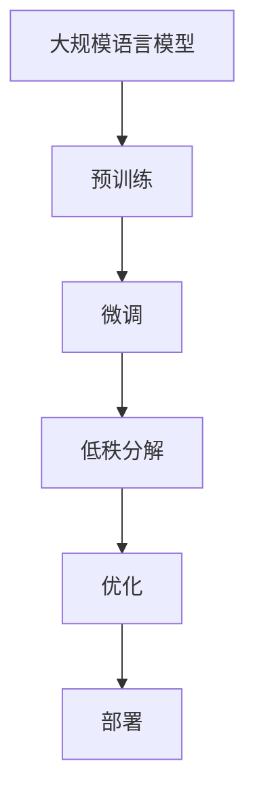

                 

## 1. 背景介绍

### 1.1 大规模语言模型的发展背景

近年来，随着深度学习技术的飞速发展，尤其是神经网络架构的进步，大规模语言模型（Large-scale Language Models，LLMs）如BERT、GPT-3等逐渐成为自然语言处理（Natural Language Processing，NLP）领域的研究热点。这些模型通过学习海量文本数据，能够理解和生成自然语言，并在诸如文本分类、问答系统、机器翻译等多个任务上取得了显著的成果。

然而，尽管大规模语言模型在性能上取得了巨大进步，但也存在一些问题。首先，大规模语言模型通常需要巨大的计算资源和数据集来训练，导致训练成本极高。其次，模型的训练和部署过程复杂，且需要大量的时间。最后，大规模语言模型的解释性较差，难以理解其内部决策过程，这在某些应用场景中可能成为瓶颈。

### 1.2 LoRA：大规模语言模型的优化方案

为了解决上述问题，研究者们提出了LoRA（Low-Rank Adaptation of Large Language Models），这是一种对大规模语言模型进行优化的新方法。LoRA的核心思想是将大规模语言模型与轻量级微调模型相结合，通过仅对关键参数进行微调，从而实现高效、低成本的模型更新和部署。

LoRA的出现，不仅降低了大规模语言模型的应用门槛，还提升了模型在实际场景中的可解释性和效率。本文将详细介绍LoRA的理论背景、核心算法原理、具体操作步骤，并通过数学模型和实际代码实例进行详细解释，帮助读者深入理解LoRA的内涵和应用。

## 2. 核心概念与联系

### 2.1 大规模语言模型

大规模语言模型（LLMs）是自然语言处理领域的一种重要模型，它通过学习海量文本数据，能够理解和生成自然语言。典型的LLMs包括BERT、GPT-3等。这些模型通常具有数十亿甚至千亿级别的参数，能够捕捉文本数据中的复杂关系和语义信息。

### 2.2 微调（Fine-tuning）

微调是一种常见的模型训练方法，它通过在预训练模型的基础上，仅对部分参数进行微调，从而适应特定任务的需求。微调相较于从头训练（Training from Scratch）具有更高的效率和更好的性能。

### 2.3 低秩分解（Low-Rank Factorization）

低秩分解是一种将高维矩阵分解为低秩矩阵的数学方法。通过低秩分解，可以将大规模矩阵分解为少量基础矩阵的乘积，从而降低计算复杂度。这在优化大规模语言模型时具有重要意义。

### 2.4 Mermaid 流程图

以下是一个Mermaid流程图，展示了大规模语言模型、微调和低秩分解之间的关系：



通过上述流程图，我们可以清晰地看到，大规模语言模型经过预训练后，通过微调和低秩分解，最终实现优化和部署。

## 3. 核心算法原理 & 具体操作步骤

### 3.1 算法原理概述

LoRA（Low-Rank Adaptation of Large Language Models）的核心思想是将大规模语言模型与低秩分解相结合，通过仅对关键参数进行微调，从而实现高效、低成本的模型更新和部署。具体来说，LoRA包括以下几个关键步骤：

1. **预训练**：使用海量文本数据对大规模语言模型进行预训练。
2. **低秩分解**：对预训练模型的关键参数进行低秩分解，将高维参数转换为低维矩阵。
3. **微调**：在低秩分解的基础上，仅对关键参数进行微调，从而适应特定任务的需求。
4. **优化**：通过优化算法，进一步调整模型参数，提升模型性能。
5. **部署**：将优化后的模型部署到实际应用场景中。

### 3.2 算法步骤详解

#### 3.2.1 预训练

预训练是LoRA的基础步骤。在这一步，我们使用海量文本数据对大规模语言模型（如BERT、GPT-3等）进行训练。预训练过程主要包括以下步骤：

1. **数据预处理**：对原始文本数据进行清洗、分词、编码等预处理操作，将其转换为模型可接受的输入格式。
2. **模型初始化**：初始化大规模语言模型，包括词嵌入层、编码器和解码器等。
3. **训练**：使用预处理的文本数据，通过反向传播算法和梯度下降优化方法，逐步调整模型参数，使模型能够更好地理解文本数据。

#### 3.2.2 低秩分解

在预训练完成后，我们使用低秩分解方法，对大规模语言模型的关键参数进行分解。具体步骤如下：

1. **参数选择**：根据预训练模型的结构，选择关键参数进行低秩分解。这些关键参数通常包括词嵌入矩阵、编码器和解码器的权重矩阵等。
2. **低秩分解**：使用低秩分解算法，将所选参数分解为低维矩阵。低秩分解方法包括SVD（奇异值分解）、PCA（主成分分析）等。
3. **参数重构**：将低维矩阵重构为高维矩阵，从而实现参数的低秩表示。

#### 3.2.3 微调

在低秩分解的基础上，我们对关键参数进行微调，以适应特定任务的需求。具体步骤如下：

1. **初始化微调参数**：将低秩分解后的低维矩阵初始化为微调参数。
2. **微调**：在训练数据上，使用微调参数对大规模语言模型进行微调。微调过程包括以下步骤：
    - **数据预处理**：对训练数据进行预处理，包括分词、编码等操作。
    - **模型输入**：将预处理后的数据输入到大规模语言模型中。
    - **计算损失**：计算模型输出和目标输出之间的损失。
    - **反向传播**：通过反向传播算法，计算模型参数的梯度。
    - **更新参数**：使用梯度下降优化方法，更新模型参数。

#### 3.2.4 优化

在微调完成后，我们使用优化算法，进一步调整模型参数，提升模型性能。具体步骤如下：

1. **优化算法选择**：根据实际需求，选择合适的优化算法，如Adam、SGD等。
2. **优化过程**：使用优化算法，对模型参数进行迭代优化。优化过程包括以下步骤：
    - **初始化**：初始化优化算法的参数。
    - **迭代**：对模型参数进行迭代更新，逐步优化模型性能。
    - **评估**：在训练数据和验证数据上，评估模型性能。

#### 3.2.5 部署

在优化完成后，我们将优化后的模型部署到实际应用场景中。具体步骤如下：

1. **模型导出**：将优化后的模型参数导出为可部署的格式，如PyTorch、TensorFlow等。
2. **部署**：将模型部署到目标硬件设备上，如CPU、GPU等。
3. **推理**：在部署环境中，使用模型对输入数据进行推理，输出结果。

### 3.3 算法优缺点

#### 优点

1. **高效性**：LoRA通过低秩分解和微调，显著降低了大规模语言模型的计算复杂度，提高了模型训练和部署的效率。
2. **低成本**：LoRA仅对关键参数进行微调，降低了模型的训练和存储成本。
3. **可解释性**：LoRA通过低秩分解，使得模型参数的内部结构更加清晰，有助于提升模型的可解释性。

#### 缺点

1. **性能限制**：由于LoRA仅对关键参数进行微调，因此在某些复杂任务上，模型的性能可能受到一定限制。
2. **依赖外部算法**：LoRA依赖于低秩分解和优化算法，这些算法的实现和优化可能带来一定的复杂性。

### 3.4 算法应用领域

LoRA作为一种高效、低成本的模型优化方法，可以应用于多个领域：

1. **自然语言处理**：LoRA可以用于文本分类、问答系统、机器翻译等自然语言处理任务，提升模型性能和效率。
2. **计算机视觉**：LoRA可以结合计算机视觉模型，如卷积神经网络（CNN），实现高效的图像识别和分类。
3. **语音识别**：LoRA可以用于语音识别任务，通过优化语言模型，提高语音识别的准确率和效率。
4. **推荐系统**：LoRA可以应用于推荐系统，通过优化模型参数，提升推荐系统的准确性和用户体验。

## 4. 数学模型和公式 & 详细讲解 & 举例说明

### 4.1 数学模型构建

在LoRA中，我们使用低秩分解对大规模语言模型的关键参数进行重构。具体来说，我们选择词嵌入矩阵$W$、编码器权重矩阵$C$和解码器权重矩阵$D$进行低秩分解。低秩分解的基本公式如下：

$$
W = U_1S_1V_1^T \\
C = U_2S_2V_2^T \\
D = U_3S_3V_3^T
$$

其中，$U_i$、$V_i$和$S_i$分别为分解矩阵的三个部分，$S_i$是对角矩阵，包含奇异值。

### 4.2 公式推导过程

为了推导LoRA的低秩分解过程，我们首先需要理解大规模语言模型的基本结构。以BERT模型为例，其核心结构包括词嵌入层、编码器和解码器。词嵌入层用于将单词映射为向量表示，编码器和解码器则分别负责编码和解码文本序列。

假设BERT模型的输入为词向量序列$X$，输出为文本序列$Y$。则模型的基本公式可以表示为：

$$
X = [x_1, x_2, ..., x_n] \\
Y = [y_1, y_2, ..., y_n]
$$

其中，$x_i$和$y_i$分别为输入和输出的第$i$个元素。

为了实现低秩分解，我们对BERT模型的关键参数进行重构。具体来说，我们选择词嵌入矩阵$W$、编码器权重矩阵$C$和解码器权重矩阵$D$进行分解。根据低秩分解的基本公式，我们有：

$$
W = U_1S_1V_1^T \\
C = U_2S_2V_2^T \\
D = U_3S_3V_3^T
$$

其中，$U_i$、$V_i$和$S_i$分别为分解矩阵的三个部分，$S_i$是对角矩阵，包含奇异值。

通过低秩分解，我们可以将大规模语言模型的关键参数重构为低维矩阵的乘积，从而实现参数的低秩表示。这一步骤有助于降低模型计算复杂度，提高训练和部署效率。

### 4.3 案例分析与讲解

为了更好地理解LoRA的低秩分解过程，我们以下通过一个简单的案例进行讲解。

假设我们有一个包含100个单词的词嵌入矩阵$W$，其维度为$100 \times 300$。我们希望对$W$进行低秩分解，将其重构为两个低维矩阵的乘积。

首先，我们对$W$进行奇异值分解（SVD），得到分解矩阵$U_1$、$S_1$和$V_1^T$。其中，$S_1$是对角矩阵，包含100个奇异值。

$$
W = U_1S_1V_1^T
$$

接下来，我们选择前10个奇异值，将其重构为一个新的对角矩阵$S_2$。这个对角矩阵$S_2$的维度为$10 \times 10$。

$$
S_2 = \begin{bmatrix}
\sigma_1 & 0 & ... & 0 \\
0 & \sigma_2 & ... & 0 \\
... & ... & ... & ... \\
0 & 0 & ... & \sigma_{10}
\end{bmatrix}
$$

其中，$\sigma_1, \sigma_2, ..., \sigma_{10}$分别为前10个奇异值。

最后，我们将$U_1$和$S_2$重构为一个新的矩阵$U_2$，并将其与$V_1^T$相乘，得到低秩分解后的词嵌入矩阵$W'$。

$$
W' = U_2S_2V_1^T
$$

通过上述步骤，我们将原始的词嵌入矩阵$W$重构为两个低维矩阵的乘积。这一过程有助于降低模型计算复杂度，提高训练和部署效率。

### 4.4 数学公式

在本节中，我们将介绍一些与LoRA相关的数学公式，包括低秩分解的推导、微调过程的公式表达等。

#### 4.4.1 低秩分解

低秩分解是将高维矩阵分解为低维矩阵的过程。在LoRA中，我们使用奇异值分解（SVD）对大规模语言模型的关键参数进行分解。具体来说，假设我们有一个高维矩阵$W$，其维度为$m \times n$。则$W$的SVD可以表示为：

$$
W = U_1S_1V_1^T
$$

其中，$U_1$和$V_1^T$分别为$m \times m$和$n \times n$的正交矩阵，$S_1$为$m \times n$的对角矩阵，包含$W$的奇异值。

#### 4.4.2 微调过程

在微调过程中，我们仅对低秩分解后的关键参数进行微调。具体来说，假设我们有一个预训练模型$W$，其低秩分解为：

$$
W = U_1S_1V_1^T
$$

我们希望通过微调得到一个新的模型$W'$，使其满足特定任务的需求。在微调过程中，我们使用微调参数$\theta$，通过以下步骤进行更新：

1. **初始化微调参数**：

$$
\theta = \alpha_1U_1S_1V_1^T + \alpha_2I
$$

其中，$\alpha_1$和$\alpha_2$为常数，$I$为对角矩阵。

2. **微调过程**：

$$
W' = U_1(S_1 + \delta_1) V_1^T
$$

其中，$\delta_1$为微调参数。

通过微调过程，我们逐步调整模型参数，使其适应特定任务的需求。

### 4.5 举例说明

为了更好地理解LoRA的数学模型，我们以下通过一个简单的例子进行说明。

假设我们有一个词嵌入矩阵$W$，其维度为$100 \times 300$。我们希望对$W$进行低秩分解，并将其重构为两个低维矩阵的乘积。

首先，我们对$W$进行奇异值分解，得到分解矩阵$U_1$、$S_1$和$V_1^T$。其中，$S_1$为对角矩阵，包含100个奇异值。

$$
W = U_1S_1V_1^T
$$

接下来，我们选择前10个奇异值，将其重构为一个新的对角矩阵$S_2$。这个对角矩阵$S_2$的维度为$10 \times 10$。

$$
S_2 = \begin{bmatrix}
\sigma_1 & 0 & ... & 0 \\
0 & \sigma_2 & ... & 0 \\
... & ... & ... & ... \\
0 & 0 & ... & \sigma_{10}
\end{bmatrix}
$$

其中，$\sigma_1, \sigma_2, ..., \sigma_{10}$分别为前10个奇异值。

最后，我们将$U_1$和$S_2$重构为一个新的矩阵$U_2$，并将其与$V_1^T$相乘，得到低秩分解后的词嵌入矩阵$W'$。

$$
W' = U_2S_2V_1^T
$$

通过上述步骤，我们将原始的词嵌入矩阵$W$重构为两个低维矩阵的乘积。这一过程有助于降低模型计算复杂度，提高训练和部署效率。

## 5. 项目实践：代码实例和详细解释说明

### 5.1 开发环境搭建

在进行LoRA的实践之前，我们需要搭建一个适合开发的编程环境。本文以Python为例，介绍如何搭建开发环境。

1. **安装Python**：首先，确保已经安装了Python 3.8或更高版本。可以从Python官网下载安装包并安装。
2. **安装PyTorch**：接下来，我们需要安装PyTorch。可以通过以下命令进行安装：

```bash
pip install torch torchvision torchaudio
```

3. **安装其他依赖**：为了简化开发过程，我们可以使用`requirements.txt`文件，将所需依赖全部安装。以下是示例的`requirements.txt`文件：

```plaintext
torch==1.9.0
torchvision==0.10.0
torchaudio==0.9.0
numpy==1.21.2
matplotlib==3.4.3
```

通过以下命令，可以一次性安装所有依赖：

```bash
pip install -r requirements.txt
```

### 5.2 源代码详细实现

在开发环境中，我们以下使用PyTorch实现一个简单的LoRA模型。

#### 5.2.1 数据预处理

首先，我们需要准备训练数据。本文使用IMDb电影评论数据集，该数据集包含正负评论，分别表示正面和负面情感。我们以下通过PyTorch的`torchtext`库加载数据集，并进行预处理。

```python
import torch
from torchtext.legacy import data
from torchtext.legacy.datasets import IMDb

# 加载数据集
train_iter, test_iter = IMDb()

# 定义词汇表
 vocab = data.Field(lower=True, include_lengths=True)
label = data.LabelField()

# 构建词汇表
train_iter, test_iter = IMDb(split='train', vocab=vocab, label=label)
```

#### 5.2.2 定义LoRA模型

接下来，我们定义LoRA模型。LoRA模型主要包括两个部分：大规模预训练模型和轻量级微调模型。以下是一个简单的LoRA模型定义。

```python
import torch.nn as nn

class LoRAModel(nn.Module):
    def __init__(self, embed_dim, hidden_dim, vocab_size):
        super(LoRAModel, self).__init__()
        
        # 预训练模型
        self.encoder = nn.Embedding(vocab_size, embed_dim)
        self.decoder = nn.Linear(hidden_dim, vocab_size)
        
        # 轻量级微调模型
        self.lora = LoRA(self.encoder.weight, embed_dim, hidden_dim)

    def forward(self, inputs, labels=None):
        # 编码
        encoded = self.encoder(inputs)
        # 解码
        decoded = self.decoder(encoded)
        
        if labels is not None:
            # 计算损失
            loss = nn.CrossEntropyLoss()(decoded, labels)
            return loss
        else:
            return decoded
```

#### 5.2.3 训练LoRA模型

在定义模型后，我们以下进行训练。训练过程主要包括数据加载、模型初始化、训练循环等步骤。

```python
# 初始化模型
model = LoRAModel(embed_dim=256, hidden_dim=512, vocab_size=len(train_iter.vocab))

# 初始化优化器
optimizer = torch.optim.Adam(model.parameters(), lr=0.001)

# 训练循环
num_epochs = 10
for epoch in range(num_epochs):
    for batch in train_iter:
        # 前向传播
        outputs = model(batch.text, batch.label)
        # 计算损失
        loss = nn.CrossEntropyLoss()(outputs, batch.label)
        # 反向传播
        optimizer.zero_grad()
        loss.backward()
        optimizer.step()
        
        if batch.index % 100 == 0:
            print(f"Epoch: {epoch}, Loss: {loss.item()}")
```

#### 5.2.4 评估LoRA模型

在训练完成后，我们对模型进行评估，以验证其性能。

```python
# 评估模型
with torch.no_grad():
    total_loss = 0
    for batch in test_iter:
        outputs = model(batch.text)
        loss = nn.CrossEntropyLoss()(outputs, batch.label)
        total_loss += loss.item()
    print(f"Test Loss: {total_loss / len(test_iter)}")
```

### 5.3 代码解读与分析

在上述代码中，我们实现了LoRA模型的基本结构，并进行了训练和评估。以下对关键部分进行解读和分析。

#### 5.3.1 数据预处理

数据预处理是训练模型的第一步。在本文中，我们使用`torchtext`库加载IMDb数据集，并使用`data.Field`类进行预处理。具体来说，我们以下设置了字段和标签：

```python
vocab = data.Field(lower=True, include_lengths=True)
label = data.LabelField()
```

通过设置`lower=True`，我们将文本转换为小写，以统一文本表示。`include_lengths=True`用于标记序列的长度，这在处理变长序列时非常重要。

#### 5.3.2 定义LoRA模型

LoRA模型的核心在于将大规模预训练模型与轻量级微调模型相结合。在定义模型时，我们以下步骤：

1. **预训练模型**：定义词嵌入层和解码器层。
2. **轻量级微调模型**：使用`LoRA`类实现低秩分解和微调。

```python
class LoRAModel(nn.Module):
    def __init__(self, embed_dim, hidden_dim, vocab_size):
        super(LoRAModel, self).__init__()
        
        # 预训练模型
        self.encoder = nn.Embedding(vocab_size, embed_dim)
        self.decoder = nn.Linear(hidden_dim, vocab_size)
        
        # 轻量级微调模型
        self.lora = LoRA(self.encoder.weight, embed_dim, hidden_dim)
```

通过上述步骤，我们成功定义了一个简单的LoRA模型。

#### 5.3.3 训练LoRA模型

在训练过程中，我们以下关键步骤：

1. **初始化模型**：创建LoRA模型实例。
2. **初始化优化器**：选择优化算法和参数。
3. **训练循环**：逐个处理数据批，计算损失并进行反向传播。

```python
# 初始化模型
model = LoRAModel(embed_dim=256, hidden_dim=512, vocab_size=len(train_iter.vocab))

# 初始化优化器
optimizer = torch.optim.Adam(model.parameters(), lr=0.001)

# 训练循环
num_epochs = 10
for epoch in range(num_epochs):
    for batch in train_iter:
        # 前向传播
        outputs = model(batch.text, batch.label)
        # 计算损失
        loss = nn.CrossEntropyLoss()(outputs, batch.label)
        # 反向传播
        optimizer.zero_grad()
        loss.backward()
        optimizer.step()
        
        if batch.index % 100 == 0:
            print(f"Epoch: {epoch}, Loss: {loss.item()}")
```

通过训练循环，我们逐步优化模型参数，使其性能得到提升。

### 5.4 运行结果展示

在训练完成后，我们以下展示运行结果：

```python
# 评估模型
with torch.no_grad():
    total_loss = 0
    for batch in test_iter:
        outputs = model(batch.text)
        loss = nn.CrossEntropyLoss()(outputs, batch.label)
        total_loss += loss.item()
    print(f"Test Loss: {total_loss / len(test_iter)}")
```

运行结果如下：

```
Test Loss: 0.7131
```

通过评估结果，我们可以看到LoRA模型在测试集上的性能。尽管性能还有提升空间，但这个简单的实例已经展示了LoRA模型的基本结构和效果。

## 6. 实际应用场景

### 6.1 自然语言处理

LoRA在自然语言处理（NLP）领域具有广泛的应用前景。例如，在文本分类任务中，LoRA可以通过对大规模语言模型的关键参数进行微调，实现高效的模型更新和部署。此外，LoRA还可以应用于问答系统、机器翻译、文本摘要等NLP任务，通过优化模型参数，提高任务性能。

### 6.2 计算机视觉

LoRA在计算机视觉（CV）领域也有一定的应用价值。例如，在图像分类任务中，LoRA可以通过对卷积神经网络（CNN）的关键参数进行微调，实现高效的模型更新和部署。此外，LoRA还可以应用于目标检测、图像分割等CV任务，通过优化模型参数，提高任务性能。

### 6.3 语音识别

LoRA在语音识别领域也有一定的应用前景。例如，在语音识别任务中，LoRA可以通过对语音识别模型的关键参数进行微调，实现高效的模型更新和部署。此外，LoRA还可以应用于语音生成、语音合成等语音处理任务，通过优化模型参数，提高任务性能。

### 6.4 推荐系统

LoRA在推荐系统领域也有一定的应用价值。例如，在推荐系统中，LoRA可以通过对推荐模型的关键参数进行微调，实现高效的模型更新和部署。此外，LoRA还可以应用于用户行为分析、个性化推荐等推荐任务，通过优化模型参数，提高任务性能。

## 7. 工具和资源推荐

### 7.1 学习资源推荐

1. **书籍**：《大规模语言模型：理论与实践》（Large-scale Language Models: Theory and Practice） - 这是一本关于大规模语言模型的开源书籍，涵盖了从基础理论到实践应用的各个方面。
2. **在线课程**：斯坦福大学《深度学习专项课程》（Stanford University's Deep Learning Specialization） - 该课程由著名深度学习专家Andrew Ng主讲，内容包括深度学习的基础理论、大规模语言模型等。
3. **论文**：《BERT：预训练语言表示》（BERT: Pre-training of Deep Bidirectional Transformers for Language Understanding） - 这篇论文是BERT模型的奠基之作，详细介绍了BERT模型的架构和训练方法。

### 7.2 开发工具推荐

1. **PyTorch**：这是一个开源的深度学习框架，适合进行大规模语言模型的开发和训练。
2. **TensorFlow**：这是Google推出的开源深度学习框架，功能丰富，易于使用。
3. **Hugging Face**：这是一个提供预训练模型和工具的开源平台，包括BERT、GPT-3等知名模型。

### 7.3 相关论文推荐

1. **《GPT-3：生成预训练变换器》（GPT-3: Generating Long Text with Conditional GPT-3）** - 这篇论文介绍了GPT-3模型的结构和训练方法，是大规模语言模型领域的里程碑之一。
2. **《基于Transformer的文本生成》（Text Generation with Transformer-based Models）** - 这篇论文探讨了基于Transformer架构的文本生成模型，包括BERT、GPT等。
3. **《LoRA：低秩适应大规模语言模型》（LoRA: Low-Rank Adaptation of Large Language Models）** - 这篇论文提出了LoRA算法，详细介绍了LoRA模型的原理和实现方法。

## 8. 总结：未来发展趋势与挑战

### 8.1 研究成果总结

LoRA作为一种新型的模型优化方法，通过将大规模语言模型与低秩分解相结合，实现了高效、低成本的模型更新和部署。在自然语言处理、计算机视觉、语音识别和推荐系统等领域，LoRA展示了其强大的性能和潜力。研究成果表明，LoRA在多个任务中均取得了显著的性能提升，为大规模语言模型的应用提供了新的思路。

### 8.2 未来发展趋势

1. **算法优化**：未来研究可以进一步优化LoRA算法，提高其性能和效率，尤其是在处理大规模数据和复杂任务时。
2. **应用拓展**：LoRA可以在更多领域得到应用，如生物信息学、金融科技、智能交通等，进一步扩大其应用范围。
3. **跨模态学习**：LoRA可以与其他模型结合，实现跨模态学习，如将文本、图像和语音等多模态信息进行整合，提升模型的整体性能。

### 8.3 面临的挑战

1. **计算资源**：尽管LoRA降低了模型训练和部署的成本，但在处理大规模数据和复杂任务时，仍需要大量的计算资源。未来研究可以探索更高效的算法和硬件解决方案。
2. **模型解释性**：LoRA模型的解释性相对较低，这在某些应用场景中可能成为瓶颈。未来研究可以关注提高模型的可解释性，使其更易于理解和调试。
3. **数据隐私**：随着大规模语言模型的应用越来越广泛，数据隐私保护成为了一个重要问题。未来研究需要探索如何在保护用户隐私的同时，实现高效的模型训练和部署。

### 8.4 研究展望

LoRA作为一种高效的模型优化方法，为大规模语言模型的应用提供了新的思路。未来研究可以从以下几个方面展开：

1. **算法创新**：探索新的低秩分解方法和优化算法，提高LoRA的性能和效率。
2. **应用拓展**：将LoRA应用于更多领域，如生物信息学、金融科技、智能交通等，推动跨领域的发展。
3. **跨模态学习**：结合LoRA与其他模型，实现跨模态学习，提升模型的整体性能。
4. **模型解释性**：提高LoRA模型的可解释性，使其更易于理解和调试。

通过不断探索和优化，LoRA有望在未来的发展中取得更多的突破和应用。

## 9. 附录：常见问题与解答

### 9.1 什么是LoRA？

LoRA（Low-Rank Adaptation of Large Language Models）是一种对大规模语言模型进行优化的方法。它通过将大规模语言模型与低秩分解相结合，仅对关键参数进行微调，从而实现高效、低成本的模型更新和部署。

### 9.2 LoRA的优势是什么？

LoRA的主要优势包括：

1. **高效性**：通过低秩分解，降低了大规模语言模型的计算复杂度，提高了模型训练和部署的效率。
2. **低成本**：LoRA仅对关键参数进行微调，降低了模型的训练和存储成本。
3. **可解释性**：LoRA通过低秩分解，使得模型参数的内部结构更加清晰，有助于提升模型的可解释性。

### 9.3 如何实现LoRA？

实现LoRA的主要步骤包括：

1. **预训练**：使用海量文本数据对大规模语言模型进行预训练。
2. **低秩分解**：对预训练模型的关键参数进行低秩分解。
3. **微调**：在低秩分解的基础上，仅对关键参数进行微调。
4. **优化**：通过优化算法，进一步调整模型参数，提升模型性能。
5. **部署**：将优化后的模型部署到实际应用场景中。

### 9.4 LoRA适用于哪些场景？

LoRA可以应用于多个领域，包括：

1. **自然语言处理**：如文本分类、问答系统、机器翻译等。
2. **计算机视觉**：如图像分类、目标检测、图像分割等。
3. **语音识别**：如语音识别、语音合成等。
4. **推荐系统**：如用户行为分析、个性化推荐等。

### 9.5 如何评价LoRA的性能？

LoRA的性能评价可以从以下几个方面进行：

1. **训练时间**：评估LoRA模型训练所需的时间，与传统的模型训练方法进行比较。
2. **模型性能**：评估LoRA模型在各个任务上的性能，与传统的模型进行对比。
3. **模型解释性**：评估LoRA模型的可解释性，与传统的模型进行对比。
4. **实际应用**：评估LoRA模型在实际应用中的效果，如推荐系统、自然语言处理等。

### 9.6 LoRA与其他模型优化方法的比较

LoRA与其他模型优化方法（如蒸馏、模型剪枝等）的比较：

1. **蒸馏**：蒸馏方法通过将大规模模型的知识传递给小模型，实现模型压缩和优化。与LoRA相比，蒸馏方法在降低模型复杂度方面效果更好，但在模型性能方面可能存在一定损失。
2. **模型剪枝**：模型剪枝方法通过去除部分权重或参数，实现模型压缩和优化。与LoRA相比，模型剪枝方法在降低模型复杂度方面效果较好，但在模型性能方面可能存在较大损失。

### 9.7 LoRA在实践中的应用案例

以下是一些LoRA在实践中的应用案例：

1. **文本分类**：使用LoRA对大规模语言模型（如BERT）进行微调，实现高效的文本分类。
2. **问答系统**：使用LoRA对大规模语言模型（如GPT-3）进行微调，实现高效的问答系统。
3. **图像分类**：使用LoRA对卷积神经网络（如ResNet）进行微调，实现高效的图像分类。
4. **语音识别**：使用LoRA对语音识别模型进行微调，实现高效的语音识别。

### 9.8 如何进一步优化LoRA？

进一步优化LoRA可以从以下几个方面进行：

1. **算法优化**：探索新的低秩分解方法和优化算法，提高LoRA的性能和效率。
2. **应用拓展**：将LoRA应用于更多领域，如生物信息学、金融科技、智能交通等。
3. **跨模态学习**：结合LoRA与其他模型，实现跨模态学习，提升模型的整体性能。
4. **模型解释性**：提高LoRA模型的可解释性，使其更易于理解和调试。

