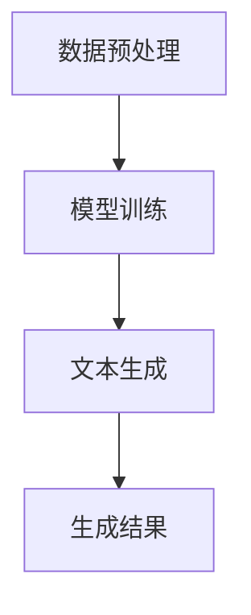

                 

关键词：大规模语言模型、机器学习、深度学习、NLP、实践思考

> 摘要：本文将深入探讨大规模语言模型（GLM）的理论基础、核心算法原理、数学模型以及实际应用。通过对大规模语言模型的研究，我们将了解到其背后的技术细节，探索其在自然语言处理（NLP）领域的应用，并对其未来发展进行展望。

## 1. 背景介绍

随着互联网和人工智能技术的快速发展，自然语言处理（NLP）成为了一项重要的研究领域。大规模语言模型（GLM）作为NLP领域的关键技术之一，已经得到了广泛的应用。本文将围绕大规模语言模型展开讨论，包括其理论背景、核心算法原理、数学模型、实际应用以及未来发展。

### 1.1 大规模语言模型的定义

大规模语言模型（GLM）是一种基于机器学习和深度学习的自然语言处理技术。它通过学习大量文本数据，能够对自然语言进行建模，从而实现文本生成、文本分类、语义理解等任务。

### 1.2 大规模语言模型的发展历史

大规模语言模型的发展经历了多个阶段。最初，研究者们使用规则驱动的方法进行自然语言处理，这种方法在处理简单任务时具有一定的效果，但在面对复杂任务时表现不佳。随着机器学习和深度学习技术的兴起，研究者们开始尝试使用这些技术来构建大规模语言模型。

## 2. 核心概念与联系

### 2.1 大规模语言模型的核心概念

大规模语言模型的核心概念包括词向量、神经网络、注意力机制等。词向量是将自然语言中的单词映射为高维向量，使得计算机可以处理文本数据。神经网络是大规模语言模型的基础，它通过层层传递信息，实现文本数据的建模。注意力机制是一种能够提高模型处理长文本能力的技术。

### 2.2 大规模语言模型的工作原理

大规模语言模型的工作原理可以概括为以下几个步骤：

1. **数据预处理**：对输入文本进行分词、去停用词等处理，将文本转换为词向量。
2. **模型训练**：使用大量文本数据对模型进行训练，优化模型参数。
3. **文本生成**：通过模型预测，生成新的文本。

### 2.3 Mermaid 流程图



## 3. 核心算法原理 & 具体操作步骤

### 3.1 算法原理概述

大规模语言模型的算法原理主要基于深度学习和自然语言处理技术。深度学习通过多层神经网络，将输入文本映射为输出文本，实现了文本的建模。自然语言处理技术则用于处理文本数据，包括分词、词向量表示、序列建模等。

### 3.2 算法步骤详解

1. **数据预处理**：对输入文本进行分词、去停用词等处理，将文本转换为词向量。
2. **模型训练**：使用大量文本数据对模型进行训练，优化模型参数。
3. **文本生成**：通过模型预测，生成新的文本。

### 3.3 算法优缺点

**优点**：
- **强大的文本生成能力**：大规模语言模型能够生成高质量、多样化的文本。
- **广泛的应用领域**：大规模语言模型可以应用于文本生成、文本分类、语义理解等任务。

**缺点**：
- **训练时间较长**：大规模语言模型需要大量的训练数据和时间。
- **计算资源消耗大**：大规模语言模型的训练和推理需要大量的计算资源。

### 3.4 算法应用领域

大规模语言模型广泛应用于自然语言处理领域，包括：

- **文本生成**：用于生成新闻、文章、对话等文本。
- **文本分类**：用于分类新闻、邮件、社交媒体等内容。
- **语义理解**：用于理解文本的含义、情感等。

## 4. 数学模型和公式 & 详细讲解 & 举例说明

### 4.1 数学模型构建

大规模语言模型的核心数学模型是基于深度学习的神经网络。神经网络由多个层组成，包括输入层、隐藏层和输出层。每层之间的神经元通过权重矩阵相连接，通过激活函数进行非线性变换。

### 4.2 公式推导过程

神经网络的输出可以通过以下公式表示：

$$
\text{output} = \sigma(\text{weight} \cdot \text{input} + \text{bias})
$$

其中，$\sigma$ 表示激活函数，$\text{weight}$ 和 $\text{input}$ 分别表示权重矩阵和输入向量，$\text{bias}$ 表示偏置。

### 4.3 案例分析与讲解

假设我们有一个简单的神经网络，输入层有3个神经元，隐藏层有2个神经元，输出层有1个神经元。激活函数为ReLU（Rectified Linear Unit）。

1. **输入层到隐藏层的推导**：

$$
\text{hidden\_1} = \sigma(\text{weight}_{11} \cdot \text{input}_{1} + \text{weight}_{12} \cdot \text{input}_{2} + \text{weight}_{13} \cdot \text{input}_{3} + \text{bias}_{1})
$$

$$
\text{hidden\_2} = \sigma(\text{weight}_{21} \cdot \text{input}_{1} + \text{weight}_{22} \cdot \text{input}_{2} + \text{weight}_{23} \cdot \text{input}_{3} + \text{bias}_{2})
$$

2. **隐藏层到输出层的推导**：

$$
\text{output} = \sigma(\text{weight}_{1} \cdot \text{hidden}_{1} + \text{weight}_{2} \cdot \text{hidden}_{2} + \text{bias})
$$

## 5. 项目实践：代码实例和详细解释说明

### 5.1 开发环境搭建

为了实现大规模语言模型，我们需要搭建一个开发环境。我们可以使用Python作为编程语言，并结合TensorFlow或PyTorch等深度学习框架。

### 5.2 源代码详细实现

以下是使用TensorFlow实现大规模语言模型的源代码示例：

```python
import tensorflow as tf
from tensorflow.keras.layers import Embedding, LSTM, Dense
from tensorflow.keras.models import Sequential

# 数据预处理
# ...

# 模型构建
model = Sequential()
model.add(Embedding(vocab_size, embedding_dim))
model.add(LSTM(units))
model.add(Dense(units, activation='softmax'))

# 模型编译
model.compile(optimizer='adam', loss='categorical_crossentropy', metrics=['accuracy'])

# 模型训练
model.fit(x_train, y_train, epochs=10, batch_size=32)
```

### 5.3 代码解读与分析

上述代码首先进行了数据预处理，包括分词、构建词向量等。然后，使用Sequential模型构建了包含Embedding层、LSTM层和Dense层的神经网络。最后，使用compile函数编译模型，并使用fit函数进行模型训练。

### 5.4 运行结果展示

训练完成后，我们可以使用模型对新的文本数据进行预测，并展示运行结果。

```python
# 预测
predictions = model.predict(new_text)

# 显示预测结果
print(predictions)
```

## 6. 实际应用场景

大规模语言模型在自然语言处理领域具有广泛的应用场景，包括：

- **文本生成**：用于生成文章、新闻、对话等文本。
- **文本分类**：用于分类新闻、邮件、社交媒体等内容。
- **语义理解**：用于理解文本的含义、情感等。

## 7. 工具和资源推荐

### 7.1 学习资源推荐

- **《深度学习》**：由Ian Goodfellow、Yoshua Bengio和Aaron Courville合著，是深度学习领域的经典教材。
- **《自然语言处理实战》**：由Written by S. Daniel Lewis，提供了大量的实践案例和代码示例。

### 7.2 开发工具推荐

- **TensorFlow**：由Google开发的开源深度学习框架，适用于大规模语言模型的开发。
- **PyTorch**：由Facebook开发的开源深度学习框架，具有简洁的API和强大的功能。

### 7.3 相关论文推荐

- **“Attention is All You Need”**：由Vaswani等人提出的基于注意力机制的Transformer模型。
- **“BERT: Pre-training of Deep Bidirectional Transformers for Language Understanding”**：由Google提出的预训练深度双向Transformer模型。

## 8. 总结：未来发展趋势与挑战

### 8.1 研究成果总结

本文对大规模语言模型进行了深入探讨，包括其理论背景、核心算法原理、数学模型、实际应用以及未来发展。通过本文的讨论，我们了解到大规模语言模型在自然语言处理领域的广泛应用和潜力。

### 8.2 未来发展趋势

大规模语言模型在未来将继续发展，主要趋势包括：

- **更高的性能和效率**：通过改进算法和硬件，提高大规模语言模型的性能和效率。
- **更广泛的应用领域**：大规模语言模型将在更多的应用领域发挥作用，如问答系统、机器翻译、对话系统等。

### 8.3 面临的挑战

大规模语言模型在实际应用中仍面临一些挑战，包括：

- **数据隐私和安全**：如何保护大规模语言模型在处理数据时的隐私和安全。
- **计算资源消耗**：如何优化大规模语言模型的计算资源消耗，使其更加高效。

### 8.4 研究展望

未来，大规模语言模型的研究将继续深入，有望在以下几个方面取得突破：

- **更好的理解语言**：通过深入研究语言的本质，提高大规模语言模型对自然语言的建模能力。
- **跨模态学习**：将大规模语言模型与其他模态（如图像、声音）进行结合，实现更丰富的语义理解。

## 9. 附录：常见问题与解答

### 9.1 什么是大规模语言模型？

大规模语言模型是一种基于机器学习和深度学习的自然语言处理技术，能够对自然语言进行建模，实现文本生成、文本分类、语义理解等任务。

### 9.2 如何训练大规模语言模型？

训练大规模语言模型需要以下步骤：

1. 数据预处理：对输入文本进行分词、去停用词等处理，将文本转换为词向量。
2. 模型构建：使用深度学习框架（如TensorFlow或PyTorch）构建神经网络模型。
3. 模型训练：使用大量文本数据对模型进行训练，优化模型参数。
4. 模型评估：使用测试数据对模型进行评估，调整模型参数。

### 9.3 大规模语言模型有哪些应用领域？

大规模语言模型广泛应用于自然语言处理领域，包括文本生成、文本分类、语义理解等任务。

---

以上是对大规模语言模型从理论到实践的一篇专业技术博客文章。通过本文的讨论，我们深入了解了大规模语言模型的核心概念、算法原理、数学模型以及实际应用，对其未来发展有了更清晰的认识。希望本文能够为读者提供有益的参考和启示。

**作者：禅与计算机程序设计艺术 / Zen and the Art of Computer Programming**  


