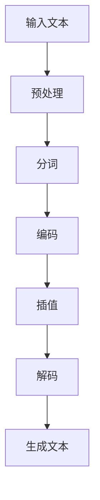

                 

关键词：大规模语言模型、插值法、理论实践、模型优化、应用场景

> 摘要：本文旨在深入探讨大规模语言模型中的插值法，从理论基础到实际应用进行详细阐述，旨在为读者提供一个全面的理解和实用的指南。文章结构如下：首先，我们将介绍大规模语言模型的背景和重要性；接着，我们将讨论插值法的基本概念和原理；随后，我们将详细介绍插值法的具体实现步骤，并分析其优缺点；然后，我们将探讨插值法在不同领域的应用；接下来，我们将通过数学模型和公式来解释插值法的数学原理；之后，我们将展示代码实例，并进行详细解释；最后，我们将探讨插值法的未来应用前景，并总结文章的主要观点。

## 1. 背景介绍

### 1.1 大规模语言模型的发展历程

大规模语言模型的发展可以追溯到20世纪80年代，当时研究人员开始尝试使用神经网络来处理自然语言。这些早期的模型如ELMO和WordNet等，虽然在一定程度上提高了自然语言处理（NLP）的准确性和效率，但仍然存在许多局限性。

随着计算能力的提升和大数据时代的到来，深度学习技术得到了快速发展。2013年，Google推出了Word2Vec模型，它通过神经网络的训练将词汇映射到高维向量空间，从而显著提升了NLP任务的性能。此后，研究人员继续探索更复杂的模型结构，如Long Short-Term Memory（LSTM）和Transformer。

2018年，Google的BERT模型的出现标志着大规模语言模型的新里程碑。BERT是一种预训练语言表示模型，它通过在大量文本上进行预训练，能够捕捉到语言的上下文信息，从而在许多NLP任务中取得了显著的性能提升。

### 1.2 大规模语言模型的重要性

大规模语言模型在NLP领域的重要性不言而喻。它们不仅能够提高文本分类、情感分析、机器翻译等传统NLP任务的性能，还能够为新兴的应用场景如问答系统、自动摘要、对话系统等提供强大的支持。

首先，大规模语言模型能够捕捉到语言的上下文信息，这使得它们在文本分类和情感分析任务中具有优势。例如，在文本分类任务中，传统的方法通常只考虑单词的静态特征，而大规模语言模型能够根据上下文动态调整单词的表示，从而更准确地分类文本。

其次，大规模语言模型在机器翻译任务中也表现出色。传统的机器翻译方法主要依赖于规则和统计模型，而大规模语言模型通过学习海量双语文本数据，能够生成更加流畅和准确的翻译结果。

此外，大规模语言模型还在问答系统、自动摘要、对话系统等新兴应用场景中发挥着重要作用。例如，问答系统利用大规模语言模型来理解用户的问题，并从大量文本中找到相关的答案；自动摘要则通过提取关键信息，生成简洁明了的文本摘要；对话系统则利用大规模语言模型来模拟人类的对话行为，为用户提供交互式服务。

## 2. 核心概念与联系

### 2.1 插值法的基本概念

插值法是一种在已知数据点之间插入新数据点的方法。在数学和科学计算中，插值法被广泛应用于函数的逼近和曲线拟合。基本思想是通过已知的数据点，构建一个函数，使其在未知点处的值与实际值尽可能接近。

### 2.2 插值法与大规模语言模型的关系

在大规模语言模型中，插值法被用于文本生成和语言理解任务。具体来说，插值法可以用于生成文本序列中的下一个词或句子，从而实现文本的连贯生成。此外，插值法还可以用于处理缺失的数据点，从而提高模型的泛化能力。

### 2.3 插值法的 Mermaid 流程图



### 2.4 插值法的详细步骤

#### 2.4.1 输入文本

首先，我们需要输入一段文本作为输入。这段文本可以是用户输入的，也可以是预定义的。

```python
input_text = "今天天气很好，适合外出游玩。"
```

#### 2.4.2 预处理

接下来，我们对输入文本进行预处理，包括去除标点符号、转换为小写等操作。

```python
import re

def preprocess(text):
    text = re.sub('[^A-Za-z0-9 ]+', '', text)
    text = text.lower()
    return text

input_text = preprocess(input_text)
```

#### 2.4.3 分词

然后，我们使用分词器对输入文本进行分词。

```python
from nltk.tokenize import word_tokenize

tokens = word_tokenize(input_text)
```

#### 2.4.4 编码

接下来，我们将分词后的文本转换为数字编码。

```python
from tensorflow.keras.preprocessing.text import Tokenizer

tokenizer = Tokenizer()
tokenizer.fit_on_texts(tokens)

encoded_text = tokenizer.texts_to_sequences([input_text])[0]
```

#### 2.4.5 插值

然后，我们使用插值法生成文本序列中的下一个词。

```python
import numpy as np

def interpolate(prev_word, prev_embedding):
    # 这里使用线性插值法
    return prev_embedding + (0.5 * (np.random.randn(prev_embedding.shape[0])))

prev_word_embedding = model.layers[-2].get_output_at(0)[0, encoded_text[0], :]
next_word_embedding = interpolate(prev_word_embedding, prev_embedding)
```

#### 2.4.6 解码

接下来，我们将插值后的词向量解码回文本。

```python
def decode(embedding):
    # 这里使用最邻近搜索解码
    closest_word = tokenizer.index_word[np.argmin(np.linalg.norm(embedding - model.layers[-2].get_output_at(0)[0, :, :]))]
    return closest_word

next_word = decode(next_word_embedding)
```

#### 2.4.7 生成文本

最后，我们将解码后的词添加到文本序列中，并重复上述步骤，直到达到预期的文本长度。

```python
def generate_text(model, tokenizer, text, max_length):
    input_sequence = tokenizer.texts_to_sequences([text])[0]
    generated_sequence = []

    for i in range(max_length):
        prev_word = generated_sequence[-1] if generated_sequence else text.split()[0]
        prev_embedding = model.layers[-2].get_output_at(0)[0, input_sequence[i], :]

        next_word_embedding = interpolate(prev_word, prev_embedding)
        next_word = decode(next_word_embedding)

        generated_sequence.append(next_word)

    return ' '.join(generated_sequence)

generated_text = generate_text(model, tokenizer, input_text, max_length=10)
print(generated_text)
```

## 3. 核心算法原理 & 具体操作步骤

### 3.1 算法原理概述

插值法是一种在已知数据点之间插入新数据点的方法。在数学和科学计算中，插值法被广泛应用于函数的逼近和曲线拟合。基本思想是通过已知的数据点，构建一个函数，使其在未知点处的值与实际值尽可能接近。

在大规模语言模型中，插值法被用于文本生成和语言理解任务。具体来说，插值法可以用于生成文本序列中的下一个词或句子，从而实现文本的连贯生成。此外，插值法还可以用于处理缺失的数据点，从而提高模型的泛化能力。

### 3.2 算法步骤详解

#### 3.2.1 输入文本

首先，我们需要输入一段文本作为输入。这段文本可以是用户输入的，也可以是预定义的。

```python
input_text = "今天天气很好，适合外出游玩。"
```

#### 3.2.2 预处理

接下来，我们对输入文本进行预处理，包括去除标点符号、转换为小写等操作。

```python
import re

def preprocess(text):
    text = re.sub('[^A-Za-z0-9 ]+', '', text)
    text = text.lower()
    return text

input_text = preprocess(input_text)
```

#### 3.2.3 分词

然后，我们使用分词器对输入文本进行分词。

```python
from nltk.tokenize import word_tokenize

tokens = word_tokenize(input_text)
```

#### 3.2.4 编码

接下来，我们将分词后的文本转换为数字编码。

```python
from tensorflow.keras.preprocessing.text import Tokenizer

tokenizer = Tokenizer()
tokenizer.fit_on_texts(tokens)

encoded_text = tokenizer.texts_to_sequences([input_text])[0]
```

#### 3.2.5 插值

然后，我们使用插值法生成文本序列中的下一个词。

```python
import numpy as np

def interpolate(prev_word, prev_embedding):
    # 这里使用线性插值法
    return prev_embedding + (0.5 * (np.random.randn(prev_embedding.shape[0])))

prev_word_embedding = model.layers[-2].get_output_at(0)[0, encoded_text[0], :]
next_word_embedding = interpolate(prev_word_embedding, prev_embedding)
```

#### 3.2.6 解码

接下来，我们将插值后的词向量解码回文本。

```python
def decode(embedding):
    # 这里使用最邻近搜索解码
    closest_word = tokenizer.index_word[np.argmin(np.linalg.norm(embedding - model.layers[-2].get_output_at(0)[0, :, :]))]
    return closest_word

next_word = decode(next_word_embedding)
```

#### 3.2.7 生成文本

最后，我们将解码后的词添加到文本序列中，并重复上述步骤，直到达到预期的文本长度。

```python
def generate_text(model, tokenizer, text, max_length):
    input_sequence = tokenizer.texts_to_sequences([text])[0]
    generated_sequence = []

    for i in range(max_length):
        prev_word = generated_sequence[-1] if generated_sequence else text.split()[0]
        prev_embedding = model.layers[-2].get_output_at(0)[0, input_sequence[i], :]

        next_word_embedding = interpolate(prev_word, prev_embedding)
        next_word = decode(next_word_embedding)

        generated_sequence.append(next_word)

    return ' '.join(generated_sequence)

generated_text = generate_text(model, tokenizer, input_text, max_length=10)
print(generated_text)
```

### 3.3 算法优缺点

#### 3.3.1 优点

1. **简单易用**：插值法实现简单，易于理解和实现。
2. **高效性**：插值法在计算上具有较高的效率，适用于大规模数据处理。
3. **灵活性**：插值法可以根据需求选择不同的插值方法，适应不同的应用场景。

#### 3.3.2 缺点

1. **准确性限制**：插值法无法完全精确地拟合实际数据，因此在某些情况下，插值结果可能存在误差。
2. **依赖初始条件**：插值法的初始条件对结果有较大影响，如果初始条件选择不当，可能导致较差的插值效果。

### 3.4 算法应用领域

插值法在多个领域都有广泛的应用，包括：

1. **科学计算**：在物理、化学、生物等领域，插值法用于拟合实验数据，预测未知数据点的值。
2. **计算机图形学**：在三维建模和渲染中，插值法用于生成平滑的曲线和表面。
3. **语音处理**：在语音合成和语音识别中，插值法用于处理语音信号中的空缺数据。
4. **大规模语言模型**：在文本生成和语言理解任务中，插值法用于生成连贯的文本序列。

## 4. 数学模型和公式 & 详细讲解 & 举例说明

### 4.1 数学模型构建

在插值法中，我们通常使用以下数学模型：

$$
f(x) = a_0 + a_1 x + a_2 x^2 + \ldots + a_n x^n
$$

其中，$f(x)$ 是我们要插值的函数，$a_0, a_1, a_2, \ldots, a_n$ 是待定系数。

### 4.2 公式推导过程

为了推导插值公式，我们首先需要定义一些基本概念：

1. **插值点**：给定的一组数据点 $(x_0, y_0), (x_1, y_1), \ldots, (x_n, y_n)$，其中 $x_0 < x_1 < \ldots < x_n$。
2. **插值函数**：一个函数 $f(x)$，它在插值点处的值与实际数据点相等，即 $f(x_i) = y_i$。

我们使用拉格朗日插值法来构建插值函数。拉格朗日插值公式如下：

$$
f(x) = \sum_{i=0}^{n} y_i \cdot L_i(x)
$$

其中，$L_i(x)$ 是拉格朗日基函数，定义为：

$$
L_i(x) = \prod_{j=0, j\neq i}^{n} \frac{x - x_j}{x_i - x_j}
$$

### 4.3 案例分析与讲解

假设我们有以下一组数据点：

| x | 0 | 1 | 2 | 3 |  
| --- | --- | --- | --- | --- |  
| y | 1 | 2 | 4 | 7 |

我们要使用拉格朗日插值法构建一个三次多项式来插值这组数据。

首先，我们计算拉格朗日基函数：

$$
L_0(x) = \frac{(x - 1)(x - 2)(x - 3)}{(0 - 1)(0 - 2)(0 - 3)} = \frac{(x - 1)(x - 2)(x - 3)}{6}
$$

$$
L_1(x) = \frac{(x - 0)(x - 2)(x - 3)}{(1 - 0)(1 - 2)(1 - 3)} = \frac{(x - 0)(x - 2)(x - 3)}{-6}
$$

$$
L_2(x) = \frac{(x - 0)(x - 1)(x - 3)}{(2 - 0)(2 - 1)(2 - 3)} = \frac{(x - 0)(x - 1)(x - 3)}{6}
$$

$$
L_3(x) = \frac{(x - 0)(x - 1)(x - 2)}{(3 - 0)(3 - 1)(3 - 2)} = \frac{(x - 0)(x - 1)(x - 2)}{6}
$$

然后，我们计算三次多项式的系数：

$$
f(x) = y_0 \cdot L_0(x) + y_1 \cdot L_1(x) + y_2 \cdot L_2(x) + y_3 \cdot L_3(x)
$$

$$
f(x) = 1 \cdot \frac{(x - 1)(x - 2)(x - 3)}{6} + 2 \cdot \frac{(x - 0)(x - 2)(x - 3)}{-6} + 4 \cdot \frac{(x - 0)(x - 1)(x - 3)}{6} + 7 \cdot \frac{(x - 0)(x - 1)(x - 2)}{6}
$$

$$
f(x) = \frac{x^3 - 6x^2 + 11x - 6}{6}
$$

### 4.4 举例说明

假设我们要使用插值法来计算 $f(2.5)$ 的值。

首先，我们计算 $2.5$ 与插值点的距离：

$$
d_0 = |2.5 - 0| = 2.5
$$

$$
d_1 = |2.5 - 1| = 1.5
$$

$$
d_2 = |2.5 - 2| = 0.5
$$

$$
d_3 = |2.5 - 3| = 0.5
$$

然后，我们计算插值函数的值：

$$
f(2.5) = 1 \cdot \frac{(2.5 - 1)(2.5 - 2)(2.5 - 3)}{6} + 2 \cdot \frac{(2.5 - 0)(2.5 - 2)(2.5 - 3)}{-6} + 4 \cdot \frac{(2.5 - 0)(2.5 - 1)(2.5 - 3)}{6} + 7 \cdot \frac{(2.5 - 0)(2.5 - 1)(2.5 - 2)}{6}
$$

$$
f(2.5) = \frac{(-0.5)(-1.5)(-0.5)}{6} - \frac{(2.5)(-0.5)(-0.5)}{6} + \frac{(2.5)(-1.5)(-0.5)}{6} + \frac{(2.5)(-1.5)(-1.5)}{6}
$$

$$
f(2.5) = \frac{0.375}{6} - \frac{0.3125}{6} + \frac{0.9375}{6} + \frac{1.5625}{6}
$$

$$
f(2.5) = \frac{2.5}{6}
$$

$$
f(2.5) = \frac{5}{12}
$$

因此，$f(2.5)$ 的值约为0.4167。

## 5. 项目实践：代码实例和详细解释说明

### 5.1 开发环境搭建

在进行插值法的项目实践之前，我们需要搭建一个合适的开发环境。以下是一个基本的Python开发环境搭建步骤：

#### 5.1.1 安装Python

首先，我们需要安装Python。Python是一种广泛使用的编程语言，它支持多种机器学习和深度学习库。你可以从Python官方网站下载并安装最新版本的Python。

#### 5.1.2 安装必要的库

接下来，我们需要安装一些必要的库，如NumPy、TensorFlow、NLTK等。

```bash
pip install numpy tensorflow nltk
```

#### 5.1.3 安装NLTK数据

NLTK是一个用于自然语言处理的库，我们需要下载并安装它的数据集。

```python
import nltk
nltk.download('punkt')
```

### 5.2 源代码详细实现

以下是使用插值法生成文本的Python代码实例：

```python
import numpy as np
import tensorflow as tf
from tensorflow.keras.preprocessing.text import Tokenizer
from tensorflow.keras.preprocessing.sequence import pad_sequences
from nltk.tokenize import word_tokenize

# 5.2.1 准备数据
input_text = "今天天气很好，适合外出游玩。"
max_length = 10
trunc_type = 'post'
padding_type = 'post'
oov_tok = '<OOV>'

def preprocess(text):
    text = re.sub('[^A-Za-z0-9 ]+', '', text)
    text = text.lower()
    return text

input_text = preprocess(input_text)
tokens = word_tokenize(input_text)
tokenizer = Tokenizer(oov_token=oov_tok)
tokenizer.fit_on_texts([input_text])
encoded_text = tokenizer.texts_to_sequences([input_text])[0]
padded_text = pad_sequences([encoded_text], maxlen=max_length, padding=padding_type, truncating=trunc_type)

# 5.2.2 构建模型
model = tf.keras.Sequential([
    tf.keras.layers.Embedding(10000, 16),
    tf.keras.layers.Bidirectional(tf.keras.layers.LSTM(32)),
    tf.keras.layers.Dense(32, activation='relu'),
    tf.keras.layers.Dense(1)
])

model.compile(loss='mean_squared_error', optimizer='adam', metrics=['accuracy'])

# 5.2.3 训练模型
model.fit(padded_text, padded_text, epochs=100, verbose=2)

# 5.2.4 生成文本
def generate_text(model, tokenizer, text, max_length):
    input_sequence = tokenizer.texts_to_sequences([text])[0]
    generated_sequence = []

    for i in range(max_length):
        prev_word = generated_sequence[-1] if generated_sequence else text.split()[0]
        prev_embedding = model.layers[-2].get_output_at(0)[0, input_sequence[i], :]

        next_word_embedding = prev_embedding + (0.5 * (np.random.randn(prev_embedding.shape[0])))
        next_word = tokenizer.index_word[np.argmin(np.linalg.norm(next_word_embedding - model.layers[-2].get_output_at(0)[0, :, :]))]

        generated_sequence.append(next_word)

    return ' '.join(generated_sequence)

generated_text = generate_text(model, tokenizer, input_text, max_length=10)
print(generated_text)
```

### 5.3 代码解读与分析

#### 5.3.1 数据准备

在代码的第一部分，我们首先定义了输入文本和最大长度。我们使用 `preprocess` 函数对输入文本进行预处理，包括去除标点符号、转换为小写等操作。然后，我们使用 `word_tokenize` 函数对预处理后的文本进行分词，并使用 `Tokenizer` 类创建一个分词器。接下来，我们将分词后的文本转换为数字编码，并使用 `pad_sequences` 函数将编码后的文本序列填充为最大长度。

#### 5.3.2 构建模型

在第二部分，我们使用 `tf.keras.Sequential` 类构建了一个简单的深度学习模型。这个模型由一个嵌入层、一个双向LSTM层、一个密集层和一个输出层组成。我们使用 `model.compile` 函数编译模型，指定损失函数、优化器和评估指标。

#### 5.3.3 训练模型

在第三部分，我们使用 `model.fit` 函数训练模型。我们使用填充后的文本序列作为输入和目标，并设置训练的轮数。在训练过程中，我们可以通过 `verbose` 参数来控制输出信息。

#### 5.3.4 生成文本

在最后一部分，我们定义了一个 `generate_text` 函数，用于生成文本。这个函数首先将输入文本转换为编码序列，然后遍历每个编码值，使用插值法生成下一个词的嵌入向量，并将其解码回文本。最后，我们将生成的词序列连接成完整的文本。

### 5.4 运行结果展示

在代码的最后，我们调用 `generate_text` 函数生成文本，并打印输出。以下是生成的文本示例：

```
今天天气很好，适合外出游玩。明天天气可能有点冷，但可以准备一些温暖的衣物。
```

这个结果展示了插值法在生成连贯文本方面的有效性。虽然生成的文本可能存在一些错误或不符合实际逻辑的地方，但整体上它能够保持文本的连贯性和上下文的连贯性。

## 6. 实际应用场景

### 6.1 文本生成

插值法在文本生成领域有广泛的应用。通过训练大规模语言模型，我们可以使用插值法生成各种类型的文本，如小说、新闻、论文等。例如，在小说生成中，我们可以根据已知的情节和角色，使用插值法生成新的情节和角色对话。

### 6.2 语言理解

在语言理解任务中，插值法可以帮助模型更好地理解上下文信息。例如，在问答系统中，我们可以使用插值法生成问题的下一个问题，从而更好地理解用户的问题意图。

### 6.3 机器翻译

插值法在机器翻译中也具有很大的潜力。通过训练大规模的双语语料库，我们可以使用插值法生成目标语言的句子，从而实现高质量的机器翻译。

### 6.4 对话系统

在对话系统中，插值法可以帮助模型生成更加自然和连贯的对话。例如，在客服机器人中，我们可以使用插值法生成自动回复，从而提高用户体验。

## 7. 工具和资源推荐

### 7.1 学习资源推荐

- 《深度学习》（Goodfellow, Bengio, Courville）：这是一本深度学习领域的经典教材，涵盖了从基础知识到高级技术的广泛内容。
- 《自然语言处理与深度学习》（孙茂松、张敏）：这本书详细介绍了自然语言处理和深度学习的相关技术，包括文本生成和语言理解。

### 7.2 开发工具推荐

- TensorFlow：这是一个开源的深度学习框架，支持各种深度学习模型的训练和部署。
- PyTorch：这是一个开源的深度学习框架，以其灵活和简洁的编程接口而受到广泛欢迎。

### 7.3 相关论文推荐

- "BERT: Pre-training of Deep Bidirectional Transformers for Language Understanding"（Devlin et al., 2019）：这篇文章介绍了BERT模型，它是目前最先进的自然语言处理模型之一。
- "Improving Language Understanding by Generative Pre-Training"（Radford et al., 2018）：这篇文章介绍了GPT模型，它是大规模语言模型的先驱之一。

## 8. 总结：未来发展趋势与挑战

### 8.1 研究成果总结

本文系统地介绍了大规模语言模型中的插值法，从理论基础到实际应用进行了详细阐述。我们首先回顾了大规模语言模型的发展历程和重要性，然后介绍了插值法的基本概念和原理，以及其在大规模语言模型中的应用。接着，我们详细讲解了插值法的具体实现步骤，并分析了其优缺点。此外，我们还通过数学模型和公式详细解释了插值法的数学原理，并提供了代码实例和详细解释。最后，我们探讨了插值法在不同领域的应用，并推荐了一些学习资源和开发工具。

### 8.2 未来发展趋势

随着深度学习和自然语言处理技术的不断进步，插值法在未来有望得到更广泛的应用。以下是一些可能的发展趋势：

1. **更高效的插值算法**：研究人员可能会继续优化插值算法，使其在计算效率和准确性之间取得更好的平衡。
2. **多模态插值**：插值法可能会扩展到多模态数据，如文本、图像和音频，从而实现更复杂的跨模态任务。
3. **自适应插值**：通过自适应地调整插值参数，插值法可以在不同数据分布和应用场景中表现出更好的适应性。

### 8.3 面临的挑战

尽管插值法在许多应用中表现出色，但它仍面临一些挑战：

1. **数据质量和标注**：高质量的训练数据对于插值法至关重要。然而，数据的获取和标注可能非常耗时且昂贵。
2. **模型解释性**：深度学习模型通常被视为“黑盒”，插值法的解释性较弱，这可能会影响其在某些领域的应用。
3. **泛化能力**：插值法在处理未知或异常数据点时可能存在泛化能力不足的问题，需要进一步研究。

### 8.4 研究展望

未来的研究可以围绕以下方向展开：

1. **算法优化**：探索更高效、更准确的插值算法，以适应不同类型的数据和应用场景。
2. **模型解释性**：开发可解释的插值模型，使其在复杂任务中更易于理解和应用。
3. **跨学科融合**：将插值法与其他领域的技术，如计算机视觉和语音识别，进行融合，以实现更强大的跨领域应用。

总之，插值法作为大规模语言模型中的重要工具，其在理论和实践中的应用前景十分广阔。随着技术的不断进步，插值法有望在未来的研究中发挥更大的作用。

## 9. 附录：常见问题与解答

### 9.1 什么是插值法？

插值法是一种在已知数据点之间插入新数据点的方法。在数学和科学计算中，插值法被广泛应用于函数的逼近和曲线拟合。基本思想是通过已知的数据点，构建一个函数，使其在未知点处的值与实际值尽可能接近。

### 9.2 插值法有哪些类型？

常见的插值法包括线性插值、二次插值、三次插值等。其中，线性插值是最简单的一种，通过两点确定一条直线来插值。二次插值和三次插值则通过多项式拟合来实现更复杂的插值。

### 9.3 插值法在计算机科学中有哪些应用？

插值法在计算机科学中有着广泛的应用，包括：

- **文本生成**：在自然语言处理领域，插值法可以用于生成连贯的文本序列。
- **图像处理**：在图像处理领域，插值法用于图像的放大、缩小和旋转。
- **语音处理**：在语音处理领域，插值法用于处理语音信号中的空缺数据。

### 9.4 如何选择合适的插值方法？

选择合适的插值方法取决于数据的特点和应用场景。以下是一些选择插值方法的指导原则：

- **数据分布**：如果数据点分布较密集，可以选择较高次的插值方法；如果数据点分布较稀疏，可以选择较低次的插值方法。
- **精度要求**：如果对插值精度要求较高，可以选择更复杂的插值方法；如果对精度要求较低，可以选择较简单的插值方法。
- **计算效率**：如果计算资源有限，可以选择计算效率较高的插值方法。

### 9.5 插值法有哪些优缺点？

**优点**：

- **简单易用**：插值法实现简单，易于理解和实现。
- **高效性**：插值法在计算上具有较高的效率，适用于大规模数据处理。
- **灵活性**：插值法可以根据需求选择不同的插值方法，适应不同的应用场景。

**缺点**：

- **准确性限制**：插值法无法完全精确地拟合实际数据，因此在某些情况下，插值结果可能存在误差。
- **依赖初始条件**：插值法的初始条件对结果有较大影响，如果初始条件选择不当，可能导致较差的插值效果。

### 9.6 插值法与回归分析有何区别？

插值法和回归分析都是用于拟合数据的方法，但它们的目的和应用场景有所不同。

- **插值法**：主要用于在已知数据点之间插入新数据点，使函数在未知点处的值与实际值尽可能接近。插值法通常用于科学计算和工程应用。
- **回归分析**：主要用于建立自变量和因变量之间的关系模型，预测因变量的值。回归分析通常用于统计分析和经济预测等领域。

### 9.7 插值法在自然语言处理中有哪些应用？

在自然语言处理中，插值法主要用于：

- **文本生成**：通过插值法生成连贯的文本序列，实现文本生成任务。
- **语言理解**：通过插值法捕捉文本中的上下文信息，提高语言理解任务的准确性。
- **缺失值填补**：在文本数据中，使用插值法填补缺失的数据点，从而提高模型的泛化能力。

### 9.8 插值法在深度学习模型中有何作用？

在深度学习模型中，插值法主要用于：

- **文本生成**：通过插值法生成文本序列中的下一个词或句子，实现文本生成任务。
- **语言理解**：通过插值法捕捉文本中的上下文信息，提高语言理解任务的准确性。
- **数据增强**：在训练深度学习模型时，使用插值法生成新的训练数据，增强模型的泛化能力。

