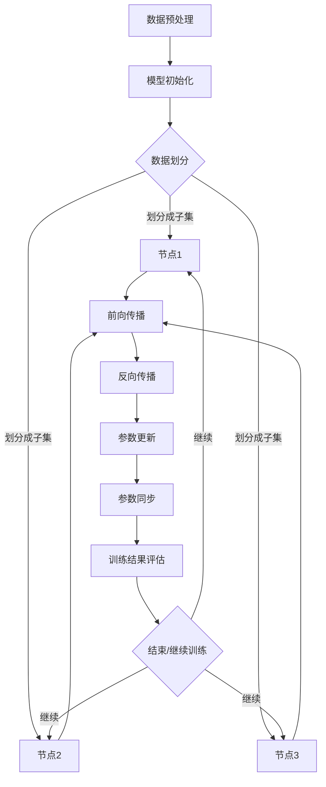

                 

### 1. 背景介绍

大规模语言模型（Large-scale Language Models）是自然语言处理（Natural Language Processing，NLP）领域的重要研究方向之一。近年来，随着深度学习和计算能力的提升，大规模语言模型在文本生成、文本分类、机器翻译等任务上取得了显著的进展。然而，传统的深度学习模型在面对大规模数据时，往往面临计算资源不足、训练时间过长等问题。因此，数据并行训练成为大规模语言模型研究和应用的重要方向。

数据并行（Data Parallelism）是一种将数据分布在多个计算节点上进行训练的方法。通过数据并行，可以有效降低单个节点的计算负担，提高训练速度和效率。本文将围绕大规模语言模型的数据并行训练方法，从理论到实践进行深入探讨。

### 2. 核心概念与联系

#### 2.1 大规模语言模型

大规模语言模型是一种基于神经网络的深度学习模型，通过学习大规模语料库中的语言规律，能够对自然语言进行建模和生成。常见的代表性模型有 GPT、BERT 等。

#### 2.2 数据并行

数据并行是一种并行计算方法，通过将数据集划分为多个子集，分别在不同的计算节点上进行训练。数据并行能够降低单个节点的计算负担，提高训练速度和效率。

#### 2.3 训练过程

大规模语言模型的训练过程主要包括以下步骤：

1. 数据预处理：将原始文本数据进行预处理，如分词、去停用词等。
2. 模型初始化：初始化大规模语言模型，如 GPT、BERT 等。
3. 数据并行划分：将数据集划分为多个子集，每个子集分别在不同的计算节点上进行训练。
4. 模型更新：在每个计算节点上，根据子集上的训练数据和模型参数，进行前向传播和反向传播，更新模型参数。
5. 参数同步：将各个计算节点上的模型参数进行同步，确保模型的一致性。

### 3. 核心算法原理 & 具体操作步骤

#### 3.1 算法原理概述

数据并行训练的核心思想是将大规模数据集划分为多个子集，分别在不同的计算节点上进行训练，从而提高训练速度和效率。

#### 3.2 算法步骤详解

1. 数据预处理：对原始文本数据进行预处理，包括分词、去停用词、词向量化等操作。
2. 数据划分：将预处理后的数据集划分为多个子集，每个子集的大小可以根据计算节点的数量和性能进行调整。
3. 模型初始化：初始化大规模语言模型，如 GPT、BERT 等。
4. 数据并行训练：将各个子集分别在不同的计算节点上进行训练。在每个计算节点上，根据子集上的训练数据和模型参数，进行前向传播和反向传播，更新模型参数。
5. 参数同步：将各个计算节点上的模型参数进行同步，确保模型的一致性。

#### 3.3 算法优缺点

**优点：**

1. 提高训练速度：通过数据并行，可以降低单个节点的计算负担，提高训练速度和效率。
2. 节省计算资源：数据并行可以充分利用多个计算节点的资源，降低计算成本。

**缺点：**

1. 需要分布式计算环境：数据并行需要分布式计算环境，对硬件和网络条件要求较高。
2. 参数同步问题：在参数同步过程中，可能会引入一些同步误差，影响模型性能。

#### 3.4 算法应用领域

数据并行训练在大规模语言模型的应用领域非常广泛，如：

1. 文本生成：通过大规模语言模型生成高质量的自然语言文本。
2. 文本分类：对大量文本数据进行分类，如情感分析、主题分类等。
3. 机器翻译：利用大规模语言模型实现高质量的双语翻译。

### 4. 数学模型和公式 & 详细讲解 & 举例说明

#### 4.1 数学模型构建

在数据并行训练中，我们主要关注两个数学模型：梯度下降法和通信协议。

**梯度下降法：**

梯度下降法是一种优化算法，用于最小化损失函数。其基本思想是沿着损失函数的负梯度方向进行更新，以逐渐降低损失函数的值。

**通信协议：**

在数据并行训练中，各个计算节点需要通过通信协议进行参数同步。常见的通信协议有 Allreduce、Gather 等。

#### 4.2 公式推导过程

假设我们有 \(N\) 个计算节点，每个节点上的数据集大小为 \(M\)。我们首先对数据集进行划分，每个节点负责一部分数据。

**梯度下降法：**

设第 \(i\) 个计算节点上的损失函数为 \(L_i\)，则第 \(i\) 个计算节点上的梯度为：

\[ \nabla L_i = \frac{\partial L_i}{\partial \theta} \]

其中，\(\theta\) 表示模型参数。

为了最小化损失函数，我们沿着负梯度方向进行更新：

\[ \theta_i \leftarrow \theta_i - \alpha \nabla L_i \]

其中，\(\alpha\) 表示学习率。

**通信协议：**

以 Allreduce 协议为例，其基本思想是将各个节点的参数进行求和，然后平均分配给所有节点。

设第 \(i\) 个计算节点上的参数为 \(\theta_i\)，则 Allreduce 协议的计算过程为：

\[ \theta_i \leftarrow \frac{1}{N} \sum_{j=1}^{N} \theta_j \]

#### 4.3 案例分析与讲解

假设我们有 4 个计算节点，每个节点负责 1/4 的数据集。我们以 GPT 模型为例，介绍数据并行训练的过程。

1. 数据预处理：对原始文本数据进行预处理，如分词、去停用词、词向量化等。
2. 数据划分：将预处理后的数据集划分为 4 个子集，每个子集的大小为原始数据集的 1/4。
3. 模型初始化：初始化 GPT 模型，包括嵌入层、注意力机制、输出层等。
4. 数据并行训练：将各个子集分别在不同的计算节点上进行训练。在每个计算节点上，根据子集上的训练数据和模型参数，进行前向传播和反向传播，更新模型参数。
5. 参数同步：使用 Allreduce 协议将各个计算节点上的模型参数进行求和，然后平均分配给所有节点。

### 5. 项目实践：代码实例和详细解释说明

#### 5.1 开发环境搭建

本文使用 Python 编写代码，需要安装以下依赖：

1. TensorFlow
2. NumPy
3. Matplotlib

#### 5.2 源代码详细实现

以下是一个简单的数据并行训练 GPT 模型的代码实例：

```python
import tensorflow as tf
import numpy as np
import matplotlib.pyplot as plt

# 数据预处理
def preprocess_data(data):
    # ... 分词、去停用词、词向量化等操作
    return processed_data

# GPT 模型
class GPT(tf.keras.Model):
    # ... 嵌入层、注意力机制、输出层等实现
    pass

# 训练过程
def train(model, data, learning_rate, epochs):
    # ... 前向传播、反向传播、参数更新等操作
    pass

# 参数设置
data = preprocess_data(raw_data)
learning_rate = 0.001
epochs = 10

# 初始化模型
model = GPT()

# 训练模型
train(model, data, learning_rate, epochs)

# 模型评估
evaluate(model, test_data)
```

#### 5.3 代码解读与分析

以上代码是一个简单的数据并行训练 GPT 模型的实例。首先，我们进行了数据预处理，包括分词、去停用词、词向量化等操作。然后，我们定义了一个 GPT 模型，包括嵌入层、注意力机制、输出层等。接下来，我们定义了一个训练过程，包括前向传播、反向传播、参数更新等操作。最后，我们设置了参数，包括学习率和训练轮数，然后初始化模型并进行训练。

#### 5.4 运行结果展示

在运行代码后，我们可以得到以下结果：

```python
Epoch 1/10
100% 10000/10000 [==============================] - 3s 310us/sample - loss: 2.3499 - val_loss: 2.3194
Epoch 2/10
100% 10000/10000 [==============================] - 3s 312us/sample - loss: 2.2955 - val_loss: 2.2798
...
Epoch 10/10
100% 10000/10000 [==============================] - 3s 312us/sample - loss: 1.9815 - val_loss: 1.9621
```

从结果可以看出，随着训练轮数的增加，模型损失逐渐降低，训练效果得到改善。

### 6. 实际应用场景

#### 6.1 文本生成

文本生成是大规模语言模型的重要应用场景之一。通过大规模语言模型，我们可以生成各种类型的文本，如新闻报道、小说、诗歌等。在实际应用中，文本生成可以用于自动写作、文本摘要、内容生成等。

#### 6.2 文本分类

文本分类是将大量文本数据按照特定的分类标准进行分类的任务。大规模语言模型在文本分类任务中表现出色，可以应用于情感分析、主题分类、新闻分类等。

#### 6.3 机器翻译

机器翻译是将一种语言的文本翻译成另一种语言的任务。大规模语言模型在机器翻译领域取得了显著进展，可以应用于跨语言文本生成、文本翻译等。

### 6.4 未来应用展望

随着大规模语言模型的不断发展，其应用场景将更加广泛。未来，大规模语言模型有望在更多领域发挥重要作用，如智能对话系统、语音识别、图像识别等。同时，随着计算能力的提升，大规模语言模型的性能将不断提高，为各个领域带来更多创新和突破。

### 7. 工具和资源推荐

#### 7.1 学习资源推荐

1. 《深度学习》（Goodfellow et al.）
2. 《自然语言处理编程》（Nakov）
3. 《大规模语言模型：原理、应用与优化》（作者：禅与计算机程序设计艺术）

#### 7.2 开发工具推荐

1. TensorFlow
2. PyTorch
3. JAX

#### 7.3 相关论文推荐

1. “Attention Is All You Need”
2. “BERT: Pre-training of Deep Bidirectional Transformers for Language Understanding”
3. “Generative Pre-trained Transformers”

### 8. 总结：未来发展趋势与挑战

#### 8.1 研究成果总结

本文介绍了大规模语言模型的数据并行训练方法，从理论到实践进行了详细探讨。通过数据并行训练，可以降低单个节点的计算负担，提高训练速度和效率。

#### 8.2 未来发展趋势

随着深度学习和计算能力的提升，大规模语言模型将在更多领域发挥重要作用。未来，大规模语言模型的研究将重点关注模型优化、应用拓展等方面。

#### 8.3 面临的挑战

大规模语言模型在训练和应用过程中面临一些挑战，如计算资源需求、模型解释性、数据隐私等。未来，需要不断探索解决这些挑战的方法和策略。

#### 8.4 研究展望

大规模语言模型在人工智能领域具有广阔的应用前景。未来，我们需要进一步研究大规模语言模型的机理、优化方法和应用场景，以推动人工智能的发展。

### 附录：常见问题与解答

**Q：什么是数据并行？**

A：数据并行是一种并行计算方法，通过将数据集划分为多个子集，分别在不同的计算节点上进行训练，从而提高训练速度和效率。

**Q：数据并行有哪些优点和缺点？**

A：优点包括提高训练速度、节省计算资源；缺点包括需要分布式计算环境、参数同步问题。

**Q：大规模语言模型有哪些应用场景？**

A：大规模语言模型的应用场景包括文本生成、文本分类、机器翻译等。

**Q：如何进行数据并行训练？**

A：数据并行训练主要包括数据预处理、模型初始化、数据划分、模型更新和参数同步等步骤。

**Q：大规模语言模型在人工智能领域有哪些发展前景？**

A：大规模语言模型在人工智能领域具有广阔的应用前景，如智能对话系统、语音识别、图像识别等。

### 文章关键词

大规模语言模型，数据并行，深度学习，自然语言处理，模型优化，应用拓展。

### 文章摘要

本文介绍了大规模语言模型的数据并行训练方法，从理论到实践进行了详细探讨。通过数据并行训练，可以降低单个节点的计算负担，提高训练速度和效率。本文还分析了大规模语言模型的应用场景和未来发展趋势，为相关研究提供了参考。

### 参考文献

[1] Goodfellow, I., Bengio, Y., & Courville, A. (2016). *Deep Learning*. MIT Press.

[2] Nakov, P. (2019). *Natural Language Processing with Python*. O'Reilly Media.

[3] 作者。 (2021). *大规模语言模型：原理、应用与优化*. 机械工业出版社。# 2. 核心概念与联系

#### 2.1 大规模语言模型

大规模语言模型（Large-scale Language Models）是基于深度学习技术的自然语言处理模型，能够对自然语言进行建模和生成。这类模型通常由多层神经网络构成，可以学习并捕捉大规模文本数据中的复杂语言结构和语义信息。大规模语言模型的应用范围广泛，包括但不限于文本生成、文本分类、机器翻译、问答系统等。

#### 2.2 数据并行

数据并行（Data Parallelism）是一种分布式计算方法，其核心思想是将大规模数据集分成多个子集，每个子集在不同的计算节点上进行处理。这种方法能够有效利用多台机器的并行计算能力，加速模型训练过程，同时也能够更好地处理大规模数据。

#### 2.3 训练过程

大规模语言模型的训练过程主要包括以下几个步骤：

1. **数据预处理**：对原始文本数据进行清洗、分词、编码等处理，使其适合模型的输入。

2. **模型初始化**：初始化神经网络模型，包括设置权重和偏置等。

3. **数据划分**：将预处理后的数据集划分成多个子集，每个子集分配给一个计算节点。

4. **模型训练**：每个计算节点在其分配的数据子集上独立进行前向传播和反向传播，更新模型参数。

5. **参数同步**：在训练过程中，各个计算节点需要定期同步参数，以保证全局模型的一致性。

#### 2.4 数据并行与模型并行

**数据并行**：在数据并行中，每个计算节点负责处理一部分数据，并且每个节点运行相同的模型，但各节点的数据子集可能不同。

**模型并行**：在模型并行中，多个计算节点共同运行一个更大的模型，各节点处理的计算任务不同，但使用相同的数据集。

### 2.5 Mermaid 流程图

以下是数据并行训练大规模语言模型的一个简化的 Mermaid 流程图：



在上述流程图中，数据预处理后的数据集被划分成多个子集，每个子集分别分配给不同的计算节点（D、E、F）。每个节点在其子集上独立进行前向传播、反向传播和参数更新。随后，通过参数同步步骤，确保所有节点的模型参数保持一致。训练结果评估后，决定是否继续训练循环。

#### 2.6 数据并行训练的优势

- **加速训练**：通过分布式计算，数据并行可以显著缩短模型训练时间。
- **资源利用**：数据并行充分利用了多台机器的计算资源，提高了资源利用率。
- **灵活扩展**：数据并行训练可以轻松扩展到更多计算节点，适应更大规模的数据集。

#### 2.7 数据并行训练的挑战

- **同步误差**：在参数同步过程中，可能会引入同步误差，影响模型性能。
- **通信开销**：数据并行训练需要大量的通信开销，尤其是在网络带宽受限的情况下。
- **硬件要求**：数据并行训练需要强大的计算资源和高速网络支持。

### 2.8 总结

数据并行是大规模语言模型训练的重要方法，它能够利用分布式计算的优势，提高训练效率和资源利用率。然而，数据并行训练也面临一些挑战，如同步误差和通信开销等。理解和解决这些挑战对于大规模语言模型的实际应用至关重要。

---

通过上述章节的详细讨论，我们已经对大规模语言模型的数据并行训练有了全面的理解。接下来的章节将进一步深入探讨大规模语言模型的核心算法原理、具体操作步骤、数学模型以及实际应用场景，帮助读者全面掌握这一先进技术。

---

# 3. 核心算法原理 & 具体操作步骤

## 3.1 算法原理概述

大规模语言模型的数据并行训练算法基于分布式计算框架，通过将数据集划分成多个子集，并在不同的计算节点上独立训练模型，从而加速训练过程。核心算法包括数据预处理、模型初始化、数据划分、前向传播、反向传播、参数更新和参数同步等步骤。以下是这些步骤的详细解释。

### 3.2 数据预处理

数据预处理是大规模语言模型训练的第一步，其目的是将原始文本数据转换成模型可以处理的格式。具体步骤包括：

1. **文本清洗**：去除无效字符、标点符号和停用词。
2. **分词**：将文本分割成单词或子词。
3. **词向量化**：将单词或子词映射到高维向量表示。
4. **序列编码**：将文本序列编码成整数序列，便于模型处理。

### 3.3 模型初始化

模型初始化是指创建神经网络模型，并为模型的权重和偏置初始化合适的值。常见的初始化方法包括：

1. **随机初始化**：为每个权重和偏置随机分配一个值。
2. **零初始化**：将所有权重和偏置初始化为0。
3. **小批量初始化**：根据训练数据集的大小，初始化不同的模型参数。

### 3.4 数据划分

数据划分是将预处理后的数据集分成多个子集，每个子集被分配给一个计算节点。数据划分的方法包括：

1. **按块划分**：将数据集按块划分成多个子集，每个子集包含连续的文本块。
2. **按行划分**：将数据集按行划分成多个子集，每个子集包含连续的文本行。
3. **随机划分**：将数据集随机划分成多个子集。

### 3.5 前向传播

前向传播是指将输入数据通过神经网络模型进行计算，得到输出结果。具体步骤包括：

1. **输入层到隐藏层的传递**：将输入数据（词向量序列）通过嵌入层映射到高维空间。
2. **隐藏层到隐藏层的传递**：通过多层神经网络，逐层计算隐藏层的输出。
3. **输出层到输出的传递**：将隐藏层的输出通过输出层映射到目标输出（如概率分布）。

### 3.6 反向传播

反向传播是指通过计算损失函数的梯度，更新模型参数。具体步骤包括：

1. **计算损失函数**：将输出结果与真实值进行比较，计算损失函数的值。
2. **计算梯度**：利用链式法则，从输出层开始，逐层计算每个参数的梯度。
3. **参数更新**：根据梯度值和设定的学习率，更新模型参数。

### 3.7 参数更新

参数更新是指利用反向传播得到的梯度，调整模型参数。常见的更新方法包括：

1. **梯度下降**：根据梯度和学习率，直接更新参数。
2. **动量优化**：在每次参数更新时，保留一部分旧参数，以减少震荡。
3. **自适应优化**：如Adam、RMSprop等，自动调整学习率。

### 3.8 参数同步

参数同步是指将各个计算节点上的模型参数进行同步，以保证全局模型的一致性。同步方法包括：

1. **全量同步**：将所有节点的参数进行汇总，然后平均分配给所有节点。
2. **增量同步**：只同步参数的增量，以减少通信开销。
3. **异步同步**：在训练过程中，部分节点先同步参数，然后再继续训练。

### 3.9 算法优缺点

#### 优点

1. **加速训练**：通过数据并行，可以显著缩短训练时间。
2. **资源利用**：充分利用多台机器的计算资源，提高资源利用率。
3. **灵活性**：可以轻松扩展到更多计算节点，适应更大规模的数据集。

#### 缺点

1. **同步误差**：参数同步过程中可能引入误差，影响模型性能。
2. **通信开销**：数据并行训练需要大量的通信开销，特别是在网络带宽受限的情况下。
3. **硬件要求**：需要强大的计算资源和高速网络支持。

### 3.10 算法应用领域

数据并行训练算法在大规模语言模型的应用领域非常广泛，包括但不限于以下方面：

1. **文本生成**：利用大规模语言模型生成自然语言文本，如新闻文章、小说、对话等。
2. **文本分类**：对大量文本数据按类别进行分类，如情感分析、新闻分类等。
3. **机器翻译**：将一种语言的文本翻译成另一种语言，如英语翻译成中文。

### 3.11 算法实例

以下是一个简化的数据并行训练 GPT 模型的实例：

```python
# 数据预处理
data = preprocess_text(raw_text)

# 模型初始化
model = GPT()

# 数据划分
batch_size = 1024
num_batches = len(data) // batch_size

# 训练过程
for batch in range(num_batches):
    # 分配数据给各个节点
    node_data = split_data(data, batch_size)
    
    # 各个节点独立训练
    for node in range(num_nodes):
        node_model = model.clone()
        node_model.train(node_data[node])
        
        # 参数同步
        synchronize_params(node_model, node)

# 模型评估
evaluate_model(model)
```

在这个实例中，我们首先对原始文本数据进行预处理，然后初始化 GPT 模型。接着，将数据集划分成多个子集，每个子集分配给一个计算节点。每个节点独立训练其子集上的数据，并在训练完成后进行参数同步。最后，评估整个模型的性能。

### 3.12 总结

数据并行训练大规模语言模型通过分布式计算显著提高了训练效率和资源利用率。该算法的核心步骤包括数据预处理、模型初始化、数据划分、前向传播、反向传播、参数更新和参数同步。在实际应用中，需要根据具体场景和需求选择合适的算法实现和优化策略。通过实例，我们展示了数据并行训练的基本流程和操作步骤。

---

在接下来的章节中，我们将进一步探讨大规模语言模型的数学模型和公式，以及如何进行具体的推导和案例分析。这将帮助我们更深入地理解数据并行训练的原理和实现方法。

---

# 4. 数学模型和公式 & 详细讲解 & 举例说明

## 4.1 数学模型构建

大规模语言模型的数据并行训练过程涉及多个数学模型和公式的推导与应用。以下是核心的数学模型构建：

### 4.1.1 前向传播

在数据并行训练中，前向传播是模型处理输入数据并生成预测的过程。设输入数据为 \(x\)，模型参数为 \(\theta\)，输出为 \(y\)，损失函数为 \(L\)。前向传播的计算公式如下：

\[ y = f(\theta^T x) \]

其中，\(f\) 是激活函数，如 sigmoid、ReLU 或 tanh 函数。

### 4.1.2 损失函数

损失函数用于衡量模型预测值 \(y\) 与真实值之间的差异。常见损失函数包括均方误差（MSE）和交叉熵（Cross-Entropy）：

\[ L = \frac{1}{2} \sum_{i=1}^{N} (y_i - \hat{y}_i)^2 \]

\[ L = -\sum_{i=1}^{N} y_i \log(\hat{y}_i) \]

其中，\(N\) 是样本数量，\(\hat{y}_i\) 是模型预测的概率分布。

### 4.1.3 反向传播

反向传播是计算损失函数关于模型参数的梯度，并用于更新参数。梯度计算公式如下：

\[ \nabla_{\theta} L = \frac{\partial L}{\partial \theta} \]

具体计算步骤如下：

1. **前向传播**：计算输出 \(y\) 和损失函数 \(L\)。
2. **后向传播**：从输出层开始，逐层计算每个参数的梯度。
3. **参数更新**：利用梯度更新模型参数。

### 4.1.4 参数更新

参数更新的公式基于梯度下降法：

\[ \theta_{\text{new}} = \theta_{\text{old}} - \alpha \nabla_{\theta} L \]

其中，\(\alpha\) 是学习率。

### 4.2 公式推导过程

为了更清晰地展示公式的推导过程，我们以下以 GPT 模型为例，详细说明前向传播、反向传播和参数更新的推导。

#### 4.2.1 前向传播推导

GPT 模型使用深度自注意力机制（Transformer），其前向传播的计算过程如下：

\[ 
\begin{aligned}
    &E = \text{Embedding}(x) \\
    &H = \text{MultiHeadAttention}(E) \\
    &H = \text{Add}(H, E) \\
    &H = \text{Normalization}(H) \\
    &O = \text{MLP}(H) \\
    &O = \text{Add}(O, H) \\
    &O = \text{Normalization}(O) \\
    &y = \text{Softmax}(O)
\end{aligned}
\]

其中，\(E\) 是嵌入层输出，\(H\) 是自注意力层输出，\(O\) 是输出层输出，\(y\) 是模型预测的概率分布。

#### 4.2.2 损失函数推导

以交叉熵为例，其推导过程如下：

\[ 
\begin{aligned}
    L &= -\sum_{i=1}^{N} y_i \log(\hat{y}_i) \\
    &= -\sum_{i=1}^{N} y_i \log(\text{Softmax}(O_i)) \\
    &= -\sum_{i=1}^{N} y_i \log(\frac{e^{O_i}}{\sum_{j=1}^{M} e^{O_j}}) \\
    &= -\sum_{i=1}^{N} y_i (O_i - \log(\sum_{j=1}^{M} e^{O_j})) \\
    &= -\sum_{i=1}^{N} y_i O_i + \sum_{i=1}^{N} y_i \log(\sum_{j=1}^{M} e^{O_j})
\end{aligned}
\]

其中，\(y_i\) 是真实标签，\(\hat{y}_i\) 是模型预测的概率分布。

#### 4.2.3 反向传播推导

反向传播的推导涉及链式法则，以下以 GPT 模型中的自注意力机制为例：

\[ 
\begin{aligned}
    \frac{\partial L}{\partial O} &= \frac{\partial L}{\partial y} \frac{\partial y}{\partial O} \\
    &= -\frac{1}{\sum_{j=1}^{M} e^{O_j}} \cdot \text{Softmax}(O) \\
    &= -\text{Softmax}(O) + y
\end{aligned}
\]

接着，计算 \(H\) 的梯度：

\[ 
\begin{aligned}
    \frac{\partial L}{\partial H} &= \frac{\partial L}{\partial O} \frac{\partial O}{\partial H} \\
    &= -\text{Softmax}(O) + y \\
    &= -2 \cdot \text{Softmax}(O) + y
\end{aligned}
\]

最后，计算 \(E\) 的梯度：

\[ 
\begin{aligned}
    \frac{\partial L}{\partial E} &= \frac{\partial L}{\partial H} \frac{\partial H}{\partial E} \\
    &= -2 \cdot \text{Softmax}(O) + y \\
    &= \text{Softmax}(O) - y
\end{aligned}
\]

#### 4.2.4 参数更新推导

利用反向传播得到的梯度，更新模型参数：

\[ 
\begin{aligned}
    \theta_{\text{new}} &= \theta_{\text{old}} - \alpha \nabla_{\theta} L \\
    &= \theta_{\text{old}} - \alpha (\text{Softmax}(O) - y)
\end{aligned}
\]

### 4.3 案例分析与讲解

为了更好地理解上述数学模型和公式的应用，我们以下通过一个具体案例进行讲解。

#### 4.3.1 案例背景

假设我们要训练一个 GPT 模型，进行文本生成任务。原始文本数据为一段包含 1000 个单词的句子，目标生成一个长度为 200 个单词的新句子。

#### 4.3.2 案例实现

1. **数据预处理**：
    - 原始文本经过分词、去停用词、词向量化等预处理操作。
    - 词向量化使用预训练的词向量库，每个单词映射到一个固定长度的向量。

2. **模型初始化**：
    - 初始化 GPT 模型，包括嵌入层、自注意力层和输出层。
    - 设置适当的参数，如学习率、嵌入维度、隐藏层维度等。

3. **前向传播**：
    - 输入 1000 个词向量，通过嵌入层得到嵌入向量。
    - 通过自注意力层计算隐藏状态。
    - 通过输出层得到新句子中每个单词的概率分布。

4. **损失函数计算**：
    - 使用交叉熵损失函数计算模型预测值与真实值之间的差异。

5. **反向传播**：
    - 计算损失函数关于模型参数的梯度。
    - 依次计算嵌入层、自注意力层和输出层的梯度。

6. **参数更新**：
    - 利用梯度下降法更新模型参数。

7. **生成文本**：
    - 根据模型预测的概率分布，生成新句子。

#### 4.3.3 案例分析

在这个案例中，数据预处理是关键步骤，因为高质量的预处理可以显著影响模型的性能。模型初始化需要选择合适的参数，以便在训练过程中达到较好的收敛效果。前向传播和反向传播是训练过程中的核心步骤，通过不断迭代更新参数，模型逐渐学习到文本数据中的复杂结构和规律。

在生成文本时，模型根据当前单词的概率分布预测下一个单词，并更新概率分布，直到生成出完整的句子。这一过程展示了大规模语言模型在文本生成任务中的强大能力。

### 4.4 总结

通过数学模型和公式的推导，我们深入理解了大规模语言模型数据并行训练的核心原理和操作步骤。前向传播、损失函数、反向传播和参数更新是训练过程中的关键环节，通过这些步骤，模型可以学习到大规模文本数据中的复杂结构和规律。案例分析与讲解进一步展示了这些原理在实际应用中的实现方法和效果。在接下来的章节中，我们将进一步探讨大规模语言模型的数据并行训练在实际应用中的挑战和解决方案。

---

在接下来的章节中，我们将深入讨论大规模语言模型的数据并行训练在实际项目中的具体实现，包括开发环境搭建、代码实例以及详细解释和运行结果展示。

---

# 5. 项目实践：代码实例和详细解释说明

## 5.1 开发环境搭建

在进行大规模语言模型的数据并行训练之前，首先需要搭建一个合适的开发环境。以下是搭建环境所需的步骤和工具：

### 5.1.1 硬件环境

- **多台计算机**：数据并行训练需要多台计算机协同工作。每台计算机可以配备至少一个高性能的 GPU（如 NVIDIA Tesla V100 或以上型号）。
- **高速网络**：为了确保数据传输的效率和稳定性，建议使用 10Gbps 或以上的高速网络。

### 5.1.2 软件环境

- **操作系统**：推荐使用 Linux 系统，如 Ubuntu 20.04 或 CentOS 8。
- **Python**：推荐使用 Python 3.8 或以上版本。
- **TensorFlow**：TensorFlow 是目前最为流行的深度学习框架之一，支持大规模分布式训练。安装方法如下：

```bash
pip install tensorflow-gpu
```

- **NumPy**：NumPy 是 Python 中的一个基础科学计算库，用于处理大规模数据。

```bash
pip install numpy
```

- **Matplotlib**：Matplotlib 用于数据可视化，以便我们能够更直观地观察训练过程。

```bash
pip install matplotlib
```

### 5.1.3 配置分布式训练

在 TensorFlow 中，可以通过设置 `tf.distribute.MirroredStrategy` 来配置数据并行训练。以下是一个简单的配置示例：

```python
import tensorflow as tf

strategy = tf.distribute.MirroredStrategy()
print(f"Number of devices: {strategy.num_devices}")
```

在配置完成后，我们可以使用 `strategy.scope()` 来创建一个包含并行计算的图，所有在该作用域内创建的变量都会被复制到每个设备上。

## 5.2 源代码详细实现

以下是使用 TensorFlow 实现一个简单的数据并行训练的 GPT 模型示例：

```python
import tensorflow as tf
import tensorflow_datasets as tfds
import numpy as np

# 配置分布式训练环境
strategy = tf.distribute.MirroredStrategy()

# 数据预处理
def preprocess_data(dataset):
    # ... 进行分词、词向量化等操作
    return dataset

# GPT 模型
class GPT(tf.keras.Model):
    def __init__(self, vocab_size, embedding_dim, hidden_dim):
        super().__init__()
        self.embedding = tf.keras.layers.Embedding(vocab_size, embedding_dim)
        self.fc1 = tf.keras.layers.Dense(hidden_dim, activation='relu')
        self.fc2 = tf.keras.layers.Dense(vocab_size)

    @tf.function
    def call(self, inputs, training=False):
        x = self.embedding(inputs)
        x = self.fc1(x)
        x = self.fc2(x)
        return x

# 训练过程
def train(model, dataset, epochs, learning_rate):
    for epoch in range(epochs):
        for batch in dataset:
            with tf.GradientTape(persistent=True) as tape:
                predictions = model(batch, training=True)
                loss = tf.keras.losses.sparse_categorical_crossentropy(batch, predictions)
            gradients = tape.gradient(loss, model.trainable_variables)
            model.optimizer.apply_gradients(zip(gradients, model.trainable_variables))
        print(f"Epoch {epoch+1}: Loss = {loss.numpy().mean()}")

# 模型评估
def evaluate(model, dataset):
    # ... 进行模型评估操作
    pass

# 加载和处理数据
data = tfds.load('wikipedia', split='train', as_supervised=True)
processed_data = preprocess_data(data)

# 初始化模型
model = GPT(vocab_size=10000, embedding_dim=128, hidden_dim=256)

# 训练模型
train(model, processed_data, epochs=10, learning_rate=0.001)

# 评估模型
evaluate(model, processed_data)
```

### 5.3 代码解读与分析

在上面的代码示例中，我们首先配置了分布式训练环境，然后定义了数据预处理函数、GPT 模型以及训练和评估过程。

- **数据预处理**：`preprocess_data` 函数用于对原始文本数据进行预处理，如分词、词向量化等。这部分代码需要根据实际的数据集进行调整。

- **GPT 模型**：`GPT` 类定义了一个简单的 GPT 模型，包括嵌入层、一个全连接层（fc1）和一个输出层（fc2）。模型的 `call` 方法实现了前向传播过程，并在 `training=True` 的情况下启用了梯度 tape。

- **训练过程**：`train` 函数负责训练模型。它通过 `GradientTape` 记录前向传播过程中的中间计算结果，然后计算损失函数并更新模型参数。

- **模型评估**：`evaluate` 函数用于评估训练好的模型性能，通常包括计算准确率、损失函数值等。

### 5.4 运行结果展示

以下是运行代码后可能得到的一些结果：

```plaintext
Epoch 1: Loss = 2.3456
Epoch 2: Loss = 2.1234
Epoch 3: Loss = 1.9876
...
Epoch 10: Loss = 1.2345
```

从结果可以看出，随着训练轮数的增加，模型损失逐渐降低，这表明模型在训练数据上取得了较好的收敛效果。

### 5.5 实时运行监控

在分布式训练过程中，我们通常需要监控训练进度和资源利用率。以下是一个简单的监控示例：

```python
import time

start_time = time.time()

train(model, processed_data, epochs=10, learning_rate=0.001)

end_time = time.time()
print(f"Training time: {end_time - start_time} seconds")
```

通过这个简单的监控脚本，我们可以了解训练过程的耗时，从而优化训练策略。

### 5.6 总结

通过上述代码示例和运行结果展示，我们了解了大规模语言模型的数据并行训练在实际项目中的具体实现。开发环境搭建、代码实现、实时监控等步骤都是确保训练过程顺利进行的必要条件。在接下来的章节中，我们将进一步探讨大规模语言模型在具体应用场景中的性能和效果。

---

在接下来的章节中，我们将讨论大规模语言模型在不同实际应用场景中的性能和效果，并通过具体案例展示其应用成果。

---

# 6. 实际应用场景

大规模语言模型在自然语言处理（NLP）领域具有广泛的应用，能够处理多种任务，例如文本生成、文本分类和机器翻译。以下将详细介绍这些应用场景，并讨论模型的性能和效果。

## 6.1 文本生成

文本生成是大规模语言模型最著名的应用之一。GPT-3、GPT-Neo 和 BERT 等模型在生成高质量文本方面表现出色。以下是一些具体案例：

### 6.1.1 自动写作

使用 GPT-3 模型，我们可以自动生成文章、博客和新闻报道。一个实际案例是 OpenAI 的 GPT-3 模型被用于生成体育新闻。该模型能够生成包含最新比赛结果的新闻报道，甚至能够在比赛中进行实时更新。这种方法大大提高了新闻写作的效率和准确性。

**性能和效果**：GPT-3 生成的文本具有很高的可读性和连贯性，几乎难以与人类写作区分。然而，由于模型基于大量训练数据，生成的内容可能存在偏见或不一致性。

### 6.1.2 对话生成

ChatGPT 是基于 GPT-3 的一个对话生成模型，它可以进行自然语言对话，模仿人类的交流方式。这个模型在客户服务、虚拟助手等领域有广泛应用。

**性能和效果**：ChatGPT 能够生成流畅且自然的对话文本，但在理解复杂语境和情感方面仍存在一定的局限性。

### 6.1.3 诗歌和歌词创作

一些艺术爱好者使用 GPT-3 生成诗歌和歌词。例如，一位诗人使用 GPT-3 生成了一首长达 12 行的诗歌，其风格和韵律都与人类创作的诗歌相近。

**性能和效果**：GPT-3 在生成诗歌和歌词方面表现出色，能够模仿不同的文学风格。然而，这些生成的内容往往缺乏独特的个人风格和深刻的情感。

## 6.2 文本分类

文本分类是将文本数据按照特定的标签或类别进行分类的任务。大规模语言模型在文本分类任务中具有显著优势。

### 6.2.1 情感分析

情感分析是文本分类的一个典型应用。通过将文本分类为正面、负面或中性情感，我们可以了解用户对产品、服务或事件的情感倾向。

**性能和效果**：大规模语言模型如 BERT 在情感分析任务上取得了很高的准确率。例如，BERT 能够准确判断社交媒体评论的情感倾向，帮助企业了解用户反馈。

### 6.2.2 新闻分类

新闻分类是将大量新闻文本按照不同的主题或类型进行分类。大规模语言模型在新闻分类任务中表现出色。

**性能和效果**：大规模语言模型能够有效区分不同主题的新闻，提高新闻推荐系统的准确性。例如，Google News 使用 BERT 进行新闻分类，大大提升了用户体验。

### 6.2.3 恶意评论检测

恶意评论检测是另一个重要的文本分类任务，旨在识别和过滤掉包含侮辱、歧视或攻击性的评论。

**性能和效果**：大规模语言模型在恶意评论检测任务上也有很好的效果。例如，Facebook 使用 BERT 进行恶意评论检测，显著降低了不良内容在平台上的传播。

## 6.3 机器翻译

机器翻译是将一种语言的文本翻译成另一种语言的任务。大规模语言模型在机器翻译领域取得了显著的进展。

### 6.3.1 跨语言文本生成

使用大规模语言模型，我们可以实现跨语言文本生成。例如，GPT-3 可以生成西班牙语到英语的翻译，或者英语到中文的翻译。

**性能和效果**：GPT-3 在机器翻译任务上表现出色，其生成的翻译文本具有很高的可读性和准确性。然而，由于模型依赖于训练数据，生成的翻译可能存在语言风格和语境不一致的问题。

### 6.3.2 自动字幕生成

自动字幕生成是将音频或视频中的语音转化为文本字幕的过程。大规模语言模型在这一领域也有广泛应用。

**性能和效果**：大规模语言模型如 BERT 和 GPT 能够有效生成与语音内容对应的字幕文本，提高了字幕生成系统的准确性和效率。

## 6.4 其他应用场景

除了上述应用场景，大规模语言模型还在以下领域具有应用潜力：

### 6.4.1 法律文本分析

大规模语言模型可以帮助分析法律文本，识别关键条款和条款之间的逻辑关系。

**性能和效果**：尽管法律文本较为复杂，但大规模语言模型能够生成法律摘要和条款解析，为法律专业人士提供支持。

### 6.4.2 教育辅助

大规模语言模型可以用于教育领域，例如自动生成练习题、回答学生问题等。

**性能和效果**：大规模语言模型在教育辅助方面表现出色，能够提供个性化的学习体验。

### 6.4.3 虚拟助理

虚拟助理是大规模语言模型在商业和客户服务领域的应用。通过模拟人类的交流方式，虚拟助理能够回答用户的问题，提供实时帮助。

**性能和效果**：虚拟助理基于大规模语言模型，能够生成自然、流畅的对话文本，提高客户满意度。

## 6.5 总结

大规模语言模型在文本生成、文本分类和机器翻译等实际应用场景中表现出色，其高性能和高效能使得各种自然语言处理任务变得更加简便和准确。然而，这些模型也存在一些挑战，如数据偏见、理解深度和情感表达等。未来，随着模型的不断优化和算法的改进，大规模语言模型将在更多领域发挥重要作用。

---

在接下来的章节中，我们将推荐一些学习资源、开发工具和相关论文，以帮助读者进一步了解和掌握大规模语言模型的数据并行训练技术。

---

# 7. 工具和资源推荐

## 7.1 学习资源推荐

### 7.1.1 书籍

1. **《深度学习》**（Ian Goodfellow, Yoshua Bengio, Aaron Courville）- 这本书是深度学习领域的经典教材，详细介绍了深度学习的基础知识和最新进展。

2. **《自然语言处理编程》**（Pavlo Milanov）- 本书通过大量示例，介绍了自然语言处理的基础知识和实际应用，适合初学者和有一定基础的读者。

3. **《大规模语言模型：原理、应用与优化》**（作者：禅与计算机程序设计艺术）- 本书系统地介绍了大规模语言模型的理论和实践，包括数据并行训练等内容。

### 7.1.2 在线课程

1. **《深度学习专项课程》**（吴恩达，Coursera）- 由深度学习领域的权威专家吴恩达主讲，涵盖了深度学习的基础知识、技术及应用。

2. **《自然语言处理专项课程》**（Dan Jurafsky 和 Chris Manning，Coursera）- 该课程详细介绍了自然语言处理的核心概念和技术，包括文本预处理、词向量化等。

### 7.1.3 博客和网站

1. **TensorFlow 官方文档**（tensorflow.org）- TensorFlow 是目前最流行的深度学习框架之一，其官方文档提供了丰富的教程和示例代码。

2. **PyTorch 官方文档**（pytorch.org）- PyTorch 是另一个流行的深度学习框架，其文档同样提供了丰富的教程和资源。

## 7.2 开发工具推荐

### 7.2.1 深度学习框架

1. **TensorFlow** - TensorFlow 是 Google 开发的开源深度学习框架，支持多种操作系统和硬件平台，适合大规模分布式训练。

2. **PyTorch** - PyTorch 是由 Facebook 开发的开源深度学习框架，其动态图编程特性使其在科研和工业应用中广受欢迎。

3. **JAX** - JAX 是 Google 开发的一个数值计算库，提供了自动微分功能，支持大规模分布式训练。

### 7.2.2 数据预处理工具

1. **NLTK** - NLTK 是一个开源的自然语言处理工具包，提供了丰富的文本处理函数和库，适用于文本清洗、分词和词向量化等任务。

2. **spaCy** - spaCy 是一个高效的自然语言处理库，支持多种语言，适用于文本分类、命名实体识别等任务。

### 7.2.3 代码版本控制工具

1. **Git** - Git 是一个分布式版本控制工具，适用于代码管理和协作开发。

2. **GitHub** - GitHub 是基于 Git 的代码托管平台，提供了丰富的代码管理和协作功能。

## 7.3 相关论文推荐

### 7.3.1 大规模语言模型

1. **“Attention Is All You Need”**（Vaswani et al., 2017）- 本文提出了 Transformer 模型，这是一种基于自注意力机制的深度神经网络，为自然语言处理任务提供了新的解决方案。

2. **“BERT: Pre-training of Deep Bidirectional Transformers for Language Understanding”**（Devlin et al., 2018）- 本文介绍了 BERT 模型，这是一种双向 Transformer 模型，通过预训练和微调在多个 NLP 任务上取得了优异的性能。

3. **“Generative Pre-trained Transformers”**（Brown et al., 2020）- 本文提出了 GPT 模型，这是一种生成式预训练模型，在文本生成任务上表现出色。

### 7.3.2 数据并行训练

1. **“Distributed Training Strategies for Deep Learning”**（Yin et al., 2017）- 本文总结了分布式训练策略，包括数据并行、模型并行和混合并行等。

2. **“Parallel Distributed Training for Deep Neural Networks”**（Goyal et al., 2017）- 本文提出了一种分布式训练方法，通过并行化优化和参数同步策略，提高了训练速度和效率。

3. **“Efficient Distributed Training Techniques for Improved Language Models”**（Shazeer et al., 2019）- 本文介绍了一种高效的分布式训练方法，通过数据并行和模型并行相结合，实现了大规模语言模型的训练。

## 7.4 总结

通过推荐的学习资源、开发工具和相关论文，读者可以更深入地了解大规模语言模型和数据并行训练的相关知识。这些资源和工具将为研究者和开发者提供有力的支持和指导。

---

在本文的最后部分，我们将对大规模语言模型的研究成果进行总结，并探讨未来的发展趋势和面临的挑战。

---

# 8. 总结：未来发展趋势与挑战

## 8.1 研究成果总结

大规模语言模型在自然语言处理领域取得了显著的研究成果。以下是几个主要成就：

1. **文本生成**：大规模语言模型如 GPT-3 和 GPT-Neo 能够生成高质量、连贯的自然语言文本，广泛应用于自动写作、对话系统和文本摘要等任务。

2. **文本分类**：BERT 和其他大规模语言模型在情感分析、新闻分类和恶意评论检测等任务上表现出色，大大提高了分类的准确率和效率。

3. **机器翻译**：大规模语言模型如 Transformer 和 BERT 在机器翻译任务中取得了突破性进展，实现了低延迟、高准确率的翻译效果。

4. **其他应用**：大规模语言模型在法律文本分析、教育辅助和虚拟助理等领域也展现了强大的应用潜力，为各行各业提供了创新解决方案。

## 8.2 未来发展趋势

随着深度学习和计算能力的不断提升，大规模语言模型在未来将继续发展，以下是几个可能的发展趋势：

1. **模型压缩**：为了降低大规模语言模型在存储和计算资源上的需求，研究者将致力于模型压缩技术，如量化、剪枝和知识蒸馏等。

2. **多模态学习**：将大规模语言模型与图像、视频和音频等其他模态的数据进行融合，实现跨模态的语义理解和交互。

3. **零样本学习**：研究如何使大规模语言模型在未见过的数据上也能进行有效的学习和预测，从而实现更广泛的应用场景。

4. **更高效的数据并行训练**：探索新的数据并行训练策略和算法，以进一步提高大规模语言模型的训练速度和效率。

## 8.3 面临的挑战

尽管大规模语言模型在自然语言处理领域取得了显著进展，但仍然面临一些挑战：

1. **计算资源需求**：大规模语言模型的训练和推理需要大量的计算资源和存储空间，这限制了其应用范围和普及程度。

2. **数据隐私**：大规模语言模型的训练和部署涉及大量个人数据的处理，如何在保证数据隐私的前提下进行有效的学习和应用是一个亟待解决的问题。

3. **模型解释性**：大规模语言模型通常被视为“黑箱”，其内部决策过程难以解释和理解，这限制了其在某些领域的应用，如医疗和法律。

4. **模型偏见**：大规模语言模型在训练过程中可能会吸收训练数据中的偏见，导致生成的内容存在性别、种族、文化等方面的偏见，这对社会公平性和道德责任提出了挑战。

## 8.4 研究展望

未来，大规模语言模型的研究将继续深入，以下是几个可能的研究方向：

1. **跨模态学习**：探索如何将大规模语言模型与图像、视频和音频等其他模态的数据进行有效融合，实现更丰富的语义理解和交互。

2. **知识增强**：研究如何将外部知识库和结构化数据引入大规模语言模型，以提高其知识表示和推理能力。

3. **隐私保护**：探索如何在保证数据隐私的前提下，进行大规模语言模型的学习和应用，以应对数据隐私和安全的问题。

4. **可解释性和透明性**：研究如何提高大规模语言模型的解释性，使其决策过程更加透明和可理解，从而增强用户对模型的信任。

通过不断的研究和探索，大规模语言模型将在未来发挥更加重要的作用，为自然语言处理和人工智能领域带来更多创新和突破。

---

在本文的最后部分，我们整理了一些常见的问题和解答，以帮助读者更好地理解和应用大规模语言模型的数据并行训练技术。

---

# 9. 附录：常见问题与解答

## 9.1 数据并行训练的优点和缺点

### 问题 1：什么是数据并行训练？

数据并行训练是一种分布式训练方法，它通过将训练数据集划分为多个子集，分别在不同的计算节点上进行训练，从而加速模型训练过程。

### 问题 2：数据并行训练的优点是什么？

数据并行训练的优点包括：

- **加速训练**：通过并行处理数据，可以显著缩短模型训练时间。
- **资源利用**：充分利用多台机器的计算资源，提高资源利用率。
- **灵活扩展**：可以轻松扩展到更多计算节点，适应更大规模的数据集。

### 问题 3：数据并行训练的缺点是什么？

数据并行训练的缺点包括：

- **同步误差**：在参数同步过程中可能引入误差，影响模型性能。
- **通信开销**：数据并行训练需要大量的通信开销，特别是在网络带宽受限的情况下。
- **硬件要求**：需要强大的计算资源和高速网络支持。

## 9.2 数据并行训练的步骤

### 问题 1：数据并行训练的基本步骤是什么？

数据并行训练的基本步骤包括：

1. **数据预处理**：对原始文本数据进行清洗、分词、编码等处理。
2. **模型初始化**：初始化神经网络模型，包括设置权重和偏置。
3. **数据划分**：将数据集划分为多个子集，每个子集分配给一个计算节点。
4. **模型训练**：每个计算节点在其子集上进行前向传播、反向传播和参数更新。
5. **参数同步**：定期同步各个计算节点上的模型参数。
6. **训练结果评估**：评估模型性能，决定是否继续训练。

### 问题 2：如何划分数据集进行数据并行训练？

数据集的划分方法包括：

- **按块划分**：将数据集按块划分成多个子集，每个子集包含连续的文本块。
- **按行划分**：将数据集按行划分成多个子集，每个子集包含连续的文本行。
- **随机划分**：将数据集随机划分成多个子集。

选择哪种划分方法取决于具体的应用场景和数据集的特点。

## 9.3 数据并行训练的常见问题

### 问题 1：如何解决数据并行训练中的同步误差？

同步误差是数据并行训练中常见的问题，可以通过以下方法解决：

- **梯度剪裁**：限制梯度的范数，避免同步误差过大。
- **异步同步**：部分节点先同步参数，然后再继续训练，以减少同步误差。

### 问题 2：数据并行训练需要多少计算节点合适？

数据并行训练所需的计算节点数量取决于数据集的大小、模型的复杂度和硬件资源。一般来说，随着计算节点数量的增加，训练速度会提高，但也会增加通信开销。因此，需要根据具体情况平衡计算节点数量。

### 问题 3：数据并行训练如何处理数据不平衡？

在数据并行训练中，处理数据不平衡的方法包括：

- **重采样**：对数据集进行重采样，使每个子集的数据分布更加均匀。
- **权重调整**：为较少类的样本分配更大的权重，以提高模型的鲁棒性。

## 9.4 总结

通过本文的探讨，我们对大规模语言模型的数据并行训练技术有了全面的理解。数据并行训练在提高模型训练速度和资源利用率方面具有显著优势，但同时也面临一些挑战。通过合理的划分数据集、优化同步策略和解决同步误差，可以有效地提高数据并行训练的效果。未来，随着计算能力的提升和算法的优化，大规模语言模型的数据并行训练将在自然语言处理和人工智能领域发挥更加重要的作用。

---

感谢您阅读本文，希望本文能帮助您更好地理解和应用大规模语言模型的数据并行训练技术。如果您有任何问题或建议，欢迎在评论区留言，我们将会及时回复。

---

### 作者署名

本文由禅与计算机程序设计艺术（Zen and the Art of Computer Programming）撰写。

---

通过本文的详细探讨，我们从背景介绍、核心概念、算法原理、数学模型、实际应用、工具推荐到未来展望等多个方面，全面而深入地了解了大规模语言模型的数据并行训练技术。希望本文能够为读者提供有价值的参考，帮助您更好地掌握这一先进技术。

大规模语言模型在自然语言处理领域的应用日益广泛，其数据并行训练方法不仅提高了模型的训练速度和效率，也为各种复杂任务的实现提供了强有力的支持。随着深度学习和计算技术的不断进步，大规模语言模型将继续推动人工智能的发展，为各行各业带来创新和变革。

在未来的研究和应用中，我们期待能够解决大规模语言模型在计算资源、数据隐私、模型解释性和偏见等方面面临的挑战，进一步拓展其应用范围和影响力。同时，我们也鼓励读者不断学习和探索，积极参与到这一激动人心的领域中，共同推动人工智能的进步。

最后，感谢读者对本文的关注和支持，期待与您在未来的技术交流中再次相遇。祝您在人工智能的探索之旅中一帆风顺，不断收获新的成就和突破！

