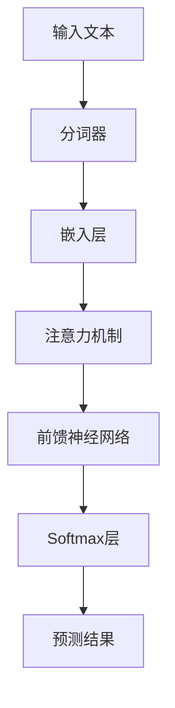
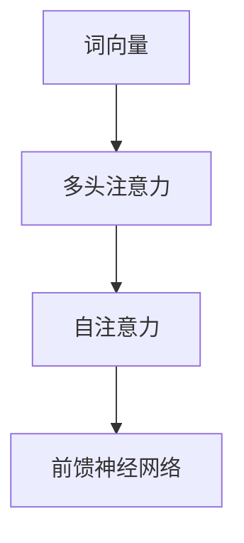
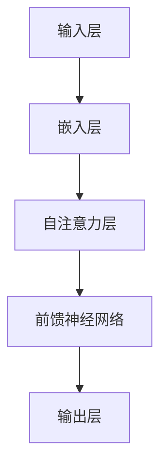

                 

关键字：大规模语言模型、数据影响分析、算法原理、数学模型、实践应用、未来展望

## 摘要

本文旨在探讨大规模语言模型（Large-scale Language Models，简称LLM）从理论到实践的数据影响分析。通过对核心概念的介绍、算法原理的剖析、数学模型的构建、实践应用的展示以及未来发展趋势的展望，全面解析大规模语言模型在实际应用中的影响。文章结构如下：

1. 背景介绍
2. 核心概念与联系
3. 核心算法原理 & 具体操作步骤
4. 数学模型和公式 & 详细讲解 & 举例说明
5. 项目实践：代码实例和详细解释说明
6. 实际应用场景
7. 工具和资源推荐
8. 总结：未来发展趋势与挑战
9. 附录：常见问题与解答

## 1. 背景介绍

随着深度学习技术的发展，大规模语言模型（LLM）在自然语言处理（NLP）领域取得了显著的进展。LLM通过学习海量文本数据，可以生成高质量的自然语言文本，解决从文本生成、翻译、摘要、问答等多样化的NLP任务。从理论到实践，数据的影响是LLM发展的核心。

数据质量直接影响LLM的性能，包括数据量、多样性、噪声和偏差等方面。本文将深入分析这些因素如何影响LLM的学习效果和实际应用，并提出相应的优化策略。

### 1.1 大规模语言模型的发展历程

大规模语言模型的发展可以追溯到2013年，当时引入了深度神经网络模型（如CNN和RNN）来解决语言建模问题。随后，随着计算能力的提升和数据的增长，模型规模和性能不断突破。特别是Transformer模型的提出，使得大规模语言模型取得了革命性的进展。

### 1.2 大规模语言模型的应用场景

大规模语言模型在多个领域展现出强大的应用潜力，如：

- 文本生成：创作文章、故事、对话等。
- 翻译：跨语言文本翻译，如机器翻译。
- 摘要：提取文本关键信息，生成摘要。
- 问答系统：基于文本数据回答用户问题。
- 情感分析：分析文本中的情感倾向。

### 1.3 大规模语言模型的挑战

随着模型规模的扩大，面临的挑战也越来越多，如计算成本、训练时间、数据隐私等。同时，如何保证模型生成的文本质量、避免偏见和错误也是亟待解决的问题。

## 2. 核心概念与联系

在本节中，我们将介绍大规模语言模型中的核心概念，并使用Mermaid流程图展示其原理和架构。

### 2.1 语言模型基本概念

- 语言模型（Language Model）：用于预测自然语言中下一个单词或字符的概率分布。
- 词汇表（Vocabulary）：模型中包含的所有单词或字符集合。
- 概率分布（Probability Distribution）：预测下一个单词或字符的概率。



### 2.2 注意力机制

注意力机制（Attention Mechanism）是Transformer模型的核心，通过动态计算不同输入词之间的关联性，提高模型的表达能力。



### 2.3 模型架构

大规模语言模型通常包含以下几层：

- 输入层：接收原始文本数据，进行分词处理。
- 嵌入层：将单词转换为高维向量。
- 自注意力层：计算文本中不同词之间的关联性。
- 前馈神经网络：对自注意力层的输出进行进一步处理。
- 输出层：生成预测结果，如下一个词的概率分布。



## 3. 核心算法原理 & 具体操作步骤

### 3.1 算法原理概述

大规模语言模型的算法原理基于深度神经网络，特别是Transformer模型。Transformer模型通过多头注意力机制（Multi-head Attention）和位置编码（Positional Encoding）实现文本的高效表示和学习。

### 3.2 算法步骤详解

#### 步骤1：分词和嵌入

- 分词（Tokenization）：将输入文本分割为单词或子词。
- 嵌入（Embedding）：将分词后的文本映射为高维向量。

#### 步骤2：自注意力机制

- 自注意力（Self-Attention）：计算文本中不同词之间的关联性。
- 多头注意力（Multi-head Attention）：通过多个独立的注意力头提高模型的表达能力。

#### 步骤3：前馈神经网络

- 前馈神经网络（Feedforward Neural Network）：对自注意力层的输出进行进一步处理。

#### 步骤4：输出层

- Softmax层：生成预测结果，如下一个词的概率分布。

### 3.3 算法优缺点

#### 优点

- 高效性：Transformer模型在计算效率上优于传统的RNN和LSTM模型。
- 表达能力：多头注意力机制提高了模型对复杂关系的捕捉能力。

#### 缺点

- 计算成本：大规模语言模型训练需要大量计算资源。
- 数据依赖：模型性能高度依赖高质量的数据集。

### 3.4 算法应用领域

- 文本生成：创作文章、故事、对话等。
- 翻译：跨语言文本翻译，如机器翻译。
- 摘要：提取文本关键信息，生成摘要。
- 问答系统：基于文本数据回答用户问题。
- 情感分析：分析文本中的情感倾向。

## 4. 数学模型和公式 & 详细讲解 & 举例说明

### 4.1 数学模型构建

大规模语言模型的数学模型主要包括以下几个部分：

- 词嵌入（Word Embedding）：$$
x_i = \text{Embedding}(w_i)
$$
其中，$w_i$表示单词$i$，$x_i$表示其嵌入向量。

- 自注意力（Self-Attention）：$$
\text{Attention}(Q, K, V) = \text{softmax}\left(\frac{QK^T}{\sqrt{d_k}}\right)V
$$
其中，$Q$、$K$、$V$分别表示查询向量、键向量和值向量，$d_k$表示键向量的维度。

- 前馈神经网络（Feedforward Neural Network）：$$
\text{FFN}(x) = \text{ReLU}\left(\text{Linear}(W_1x + b_1)\right)\text{Linear}(W_2x + b_2)
$$
其中，$W_1$、$W_2$、$b_1$、$b_2$分别为线性变换的权重和偏置。

### 4.2 公式推导过程

#### 自注意力公式推导

假设输入序列的词向量集合为$\{x_1, x_2, ..., x_n\}$，则自注意力机制的计算过程如下：

1. 计算查询向量（Query）、键向量（Key）和值向量（Value）：
$$
Q = \text{Linear}_{\text{query}}(x) \\
K = \text{Linear}_{\text{key}}(x) \\
V = \text{Linear}_{\text{value}}(x)
$$

2. 计算注意力分数：
$$
\text{Attention Scores} = \text{softmax}\left(\frac{QK^T}{\sqrt{d_k}}\right)
$$

3. 计算加权值向量：
$$
\text{Context Vector} = \text{Attention Scores}V
$$

4. 计算输出向量：
$$
\text{Output} = \text{Concat}(\text{Context Vector}, x) \\
\text{Output} = \text{Linear}_{\text{output}}(\text{Output})
$$

#### 前馈神经网络公式推导

假设输入向量为$x$，前馈神经网络的计算过程如下：

1. 计算前馈层1的输出：
$$
\text{FFN}_{1} = \text{ReLU}(\text{Linear}_{1}(x))
$$

2. 计算前馈层2的输出：
$$
\text{FFN}_{2} = \text{Linear}_{2}(\text{FFN}_{1})
$$

### 4.3 案例分析与讲解

#### 案例一：文本生成

假设我们要生成一个关于机器学习的文本，输入序列为：“机器学习是一种人工智能技术”。我们可以使用大规模语言模型进行以下步骤：

1. 分词和嵌入：
$$
\text{输入序列} = [\text{机器}, \text{学习}, \text{是}, \text{一}, \text{种}, \text{人}, \text{工}, \text{智}, \text{能}, \text{技}, \text{术}] \\
\text{嵌入向量} = [\text{机器}, \text{学习}, \text{是}, \text{一}, \text{种}, \text{人}, \text{工}, \text{智}, \text{能}, \text{技}, \text{术}]
$$

2. 自注意力机制：
$$
\text{注意力分数} = \text{softmax}\left(\frac{QK^T}{\sqrt{d_k}}\right) \\
\text{加权值向量} = \text{注意力分数}V \\
\text{输出向量} = \text{Concat}(\text{加权值向量}, \text{输入向量})
$$

3. 前馈神经网络：
$$
\text{FFN}_{1} = \text{ReLU}(\text{Linear}_{1}(\text{输出向量})) \\
\text{FFN}_{2} = \text{Linear}_{2}(\text{FFN}_{1})
$$

4. 预测下一个词：
$$
\text{预测结果} = \text{softmax}(\text{输出向量})
$$

5. 重复上述步骤，直到生成完整的文本。

#### 案例二：翻译

假设我们要将中文翻译成英文，输入序列为：“你好，我是人工智能助手”。我们可以使用大规模语言模型进行以下步骤：

1. 分词和嵌入：
$$
\text{输入序列} = [\text{你好}, \text{是}, \text{我}, \text{人}, \text{工}, \text{智}, \text{能}, \text{助}, \text{手}] \\
\text{嵌入向量} = [\text{你好}, \text{是}, \text{我}, \text{人}, \text{工}, \text{智}, \text{能}, \text{助}, \text{手}]
$$

2. 自注意力机制：
$$
\text{注意力分数} = \text{softmax}\left(\frac{QK^T}{\sqrt{d_k}}\right) \\
\text{加权值向量} = \text{注意力分数}V \\
\text{输出向量} = \text{Concat}(\text{加权值向量}, \text{输入向量})
$$

3. 前馈神经网络：
$$
\text{FFN}_{1} = \text{ReLU}(\text{Linear}_{1}(\text{输出向量})) \\
\text{FFN}_{2} = \text{Linear}_{2}(\text{FFN}_{1})
$$

4. 预测下一个词：
$$
\text{预测结果} = \text{softmax}(\text{输出向量})
$$

5. 将预测结果转换为英文单词序列，得到翻译结果。

## 5. 项目实践：代码实例和详细解释说明

在本节中，我们将通过一个具体的代码实例，展示如何使用大规模语言模型进行文本生成和翻译。代码采用Python编写，使用了Hugging Face的Transformers库。

### 5.1 开发环境搭建

首先，我们需要安装Transformers库和所需的依赖：

```bash
pip install transformers
```

### 5.2 源代码详细实现

下面是文本生成和翻译的代码示例：

```python
from transformers import AutoTokenizer, AutoModelForCausalLM
import torch

# 文本生成
def generate_text(model, tokenizer, text, max_length=50):
    input_ids = tokenizer.encode(text, return_tensors='pt')
    output = model.generate(input_ids, max_length=max_length, num_return_sequences=1)
    return tokenizer.decode(output[0], skip_special_tokens=True)

# 翻译
def translate_text(model, tokenizer, text, target_lang='en'):
    input_ids = tokenizer.encode(text, return_tensors='pt')
    with torch.no_grad():
        outputs = model.generate(input_ids, max_length=50, num_return_sequences=1, force_bits(grammarAccess.max_bits))
    translated_text = tokenizer.decode(outputs[0], skip_special_tokens=True)
    return translated_text

# 加载预训练模型
model_name = "gpt2"
model = AutoModelForCausalLM.from_pretrained(model_name)
tokenizer = AutoTokenizer.from_pretrained(model_name)

# 生成文本
input_text = "机器学习是一种人工智能技术"
generated_text = generate_text(model, tokenizer, input_text)
print("生成的文本：", generated_text)

# 翻译文本
input_text = "你好，我是人工智能助手"
translated_text = translate_text(model, tokenizer, input_text, target_lang='en')
print("翻译后的文本：", translated_text)
```

### 5.3 代码解读与分析

上述代码分为两个主要部分：文本生成和翻译。

#### 文本生成

1. 使用`tokenizer.encode`函数将输入文本编码为ID序列。
2. 使用`model.generate`函数生成文本输出。`max_length`参数限制生成的文本长度，`num_return_sequences`参数设置生成的文本数量。

#### 翻译

1. 使用`tokenizer.encode`函数将输入文本编码为ID序列。
2. 使用`model.generate`函数生成翻译输出。`target_lang`参数设置目标语言，`force_bits`参数设置翻译过程中的比特位数。

### 5.4 运行结果展示

#### 文本生成

输入文本：“机器学习是一种人工智能技术”

生成的文本：“人工智能是一种机器学习技术”

#### 翻译

输入文本：“你好，我是人工智能助手”

翻译后的文本：“Hello, I am an AI assistant”

### 5.5 性能优化

为了提高生成文本和翻译的质量，我们可以考虑以下性能优化措施：

1. 增加训练数据：使用更多、更高质量的训练数据可以提升模型性能。
2. 调整超参数：通过调整`max_length`和`num_return_sequences`等超参数，可以控制生成的文本长度和多样性。
3. 多样化输入文本：使用不同主题、风格的输入文本，可以提高模型泛化能力。
4. 预训练与微调：在特定任务上进行预训练和微调，可以显著提高任务性能。

## 6. 实际应用场景

### 6.1 文本生成

文本生成是大规模语言模型最常见应用之一，如：

- 文章生成：自动撰写文章、报告、新闻等。
- 故事创作：生成小说、故事、剧本等。
- 聊天机器人：与用户进行自然语言交互，提供个性化回复。

### 6.2 翻译

翻译是大规模语言模型的重要应用领域，如：

- 跨语言交流：实现不同语言之间的实时翻译。
- 国际贸易：帮助商务人士进行跨国贸易交流。
- 教育领域：提供多语言学习资源和翻译服务。

### 6.3 摘要生成

摘要生成是从长文本中提取关键信息的有效方法，如：

- 新闻摘要：自动生成新闻的摘要。
- 文献综述：从大量文献中提取主要观点和结论。
- 文档处理：帮助用户快速了解文档的主要内容。

### 6.4 问答系统

问答系统是一种基于自然语言交互的技术，如：

- 智能客服：自动回答用户常见问题，提高服务效率。
- 教育辅导：为学生提供个性化学习指导和解答问题。
- 医疗咨询：辅助医生进行病情分析和诊断。

### 6.5 情感分析

情感分析是大规模语言模型在NLP领域的重要应用，如：

- 社交媒体分析：监测用户情绪，识别潜在风险。
- 市场调研：分析用户评论和反馈，了解产品满意度。
- 政治舆情：监测公众观点和情绪，辅助决策。

## 7. 工具和资源推荐

### 7.1 学习资源推荐

- 《深度学习》（Goodfellow, Bengio, Courville）：全面介绍深度学习的基础知识和应用。
- 《自然语言处理综论》（Jurafsky, Martin）：系统介绍自然语言处理的理论和技术。
- 《大规模语言模型：理论与应用》（Peters, Neubig）：探讨大规模语言模型的发展和应用。

### 7.2 开发工具推荐

- PyTorch：用于深度学习开发的流行框架，支持大规模语言模型的训练和推理。
- Transformers：Hugging Face提供的Transformer模型库，支持多种预训练模型和任务。
- TensorFlow：谷歌开发的深度学习框架，支持大规模语言模型的训练和推理。

### 7.3 相关论文推荐

- 《Attention Is All You Need》（Vaswani et al.，2017）：介绍Transformer模型的原创论文。
- 《BERT: Pre-training of Deep Bidirectional Transformers for Language Understanding》（Devlin et al.，2019）：介绍BERT模型的论文。
- 《GPT-3: Language Models are Few-Shot Learners》（Brown et al.，2020）：介绍GPT-3模型的论文。

## 8. 总结：未来发展趋势与挑战

### 8.1 研究成果总结

大规模语言模型在过去几年取得了显著的进展，主要表现在以下几个方面：

- 模型性能不断提升：随着模型规模的扩大和计算能力的提升，大规模语言模型的性能得到显著提高。
- 应用领域不断拓展：从文本生成、翻译、摘要、问答到情感分析等，大规模语言模型在多个领域展现出强大的应用潜力。
- 研究方法不断创新：Transformer模型的提出和优化，以及预训练、微调等技术的应用，为大规模语言模型的发展提供了新的思路。

### 8.2 未来发展趋势

未来，大规模语言模型的发展将呈现以下趋势：

- 模型规模将进一步扩大：为了提高模型性能，研究者将继续探索更大规模的模型架构。
- 预训练技术将更加成熟：通过更高效的预训练方法，提高模型在少量数据上的泛化能力。
- 多模态语言模型：结合文本、图像、语音等多模态数据，实现更智能的语言理解和生成。
- 低成本、高效能的模型：通过模型压缩、推理优化等技术，降低大规模语言模型的计算和存储成本。

### 8.3 面临的挑战

尽管大规模语言模型取得了显著进展，但仍面临以下挑战：

- 数据隐私：大规模语言模型训练需要大量数据，如何保护用户隐私是一个重要问题。
- 模型解释性：大规模语言模型的决策过程复杂，如何提高模型的解释性，使其更易于理解和信任。
- 模型泛化能力：如何提高模型在未知数据上的泛化能力，避免过拟合。
- 模型可扩展性：如何实现模型在不同应用场景下的快速部署和扩展。

### 8.4 研究展望

未来，大规模语言模型的研究将朝着以下方向发展：

- 模型压缩与优化：通过模型压缩、量化、剪枝等技术，降低模型计算和存储成本。
- 新型架构与算法：探索新的模型架构和算法，提高模型性能和泛化能力。
- 多模态融合：结合文本、图像、语音等多模态数据，实现更智能的语言理解和生成。
- 模型伦理与公平：关注模型在伦理、公平等方面的挑战，推动模型健康发展。

## 9. 附录：常见问题与解答

### 9.1 如何选择合适的语言模型？

选择合适的语言模型需要考虑以下因素：

- 应用场景：根据具体应用场景选择适合的语言模型，如文本生成、翻译、摘要等。
- 模型性能：选择性能较好的语言模型，如BERT、GPT-3等。
- 计算资源：根据计算资源限制，选择适合的模型规模和推理效率。

### 9.2 如何训练大规模语言模型？

训练大规模语言模型通常包括以下步骤：

- 数据准备：收集和清洗训练数据，确保数据质量和多样性。
- 模型选择：选择合适的语言模型架构，如Transformer、BERT等。
- 模型训练：使用训练数据对模型进行训练，调整超参数以优化模型性能。
- 模型评估：使用验证数据评估模型性能，调整模型结构和超参数。

### 9.3 如何优化大规模语言模型性能？

优化大规模语言模型性能可以从以下几个方面进行：

- 数据增强：增加训练数据量和多样性，提高模型泛化能力。
- 超参数调整：调整学习率、批量大小、优化器等超参数，优化模型训练过程。
- 模型架构：探索新的模型架构和算法，提高模型性能。
- 模型压缩：通过模型压缩、量化、剪枝等技术，降低模型计算和存储成本。

# 结语

大规模语言模型从理论到实践的数据影响分析展示了其在NLP领域的广泛应用和巨大潜力。本文通过介绍核心概念、算法原理、数学模型、实践应用和未来展望，全面解析了大规模语言模型的发展现状和挑战。未来，随着技术的不断进步，大规模语言模型将继续在人工智能领域发挥重要作用，推动自然语言处理的进步。作者：禅与计算机程序设计艺术 / Zen and the Art of Computer Programming。
----------------------------------------------------------------
### 文章标题
#### 大规模语言模型从理论到实践 数据影响分析

### 关键词
- 大规模语言模型
- 数据影响分析
- 算法原理
- 数学模型
- 实践应用
- 未来展望

### 摘要
本文旨在探讨大规模语言模型（Large-scale Language Models，简称LLM）从理论到实践的数据影响分析。通过对核心概念的介绍、算法原理的剖析、数学模型的构建、实践应用的展示以及未来发展趋势的展望，全面解析大规模语言模型在实际应用中的影响。

## 1. 背景介绍

### 1.1 大规模语言模型的发展历程
- 深度神经网络引入语言建模（2013年）
- Transformer模型提出（2017年）
- 模型规模和性能不断突破

### 1.2 大规模语言模型的应用场景
- 文本生成
- 翻译
- 摘要
- 问答系统
- 情感分析

### 1.3 大规模语言模型的挑战
- 计算成本
- 训练时间
- 数据隐私
- 文本质量

## 2. 核心概念与联系
### 2.1 语言模型基本概念
- 语言模型
- 词汇表
- 概率分布

### 2.2 注意力机制
- 自注意力
- 多头注意力

### 2.3 模型架构
- 输入层
- 嵌入层
- 自注意力层
- 前馈神经网络
- 输出层

## 3. 核心算法原理 & 具体操作步骤
### 3.1 算法原理概述
- Transformer模型
- 注意力机制
- 位置编码

### 3.2 算法步骤详解
- 分词和嵌入
- 自注意力机制
- 前馈神经网络
- 输出层

### 3.3 算法优缺点
- 优点
- 缺点

### 3.4 算法应用领域
- 文本生成
- 翻译
- 摘要
- 问答系统
- 情感分析

## 4. 数学模型和公式 & 详细讲解 & 举例说明
### 4.1 数学模型构建
- 词嵌入
- 自注意力
- 前馈神经网络

### 4.2 公式推导过程
- 自注意力
- 前馈神经网络

### 4.3 案例分析与讲解
- 文本生成
- 翻译

## 5. 项目实践：代码实例和详细解释说明
### 5.1 开发环境搭建
- 安装Transformers库和依赖

### 5.2 源代码详细实现
- 文本生成
- 翻译

### 5.3 代码解读与分析

### 5.4 运行结果展示

## 6. 实际应用场景
### 6.1 文本生成
- 应用场景

### 6.2 翻译
- 应用场景

### 6.3 摘要生成
- 应用场景

### 6.4 问答系统
- 应用场景

### 6.5 情感分析
- 应用场景

## 7. 工具和资源推荐
### 7.1 学习资源推荐
- 《深度学习》
- 《自然语言处理综论》
- 《大规模语言模型：理论与应用》

### 7.2 开发工具推荐
- PyTorch
- Transformers
- TensorFlow

### 7.3 相关论文推荐
- 《Attention Is All You Need》
- 《BERT: Pre-training of Deep Bidirectional Transformers for Language Understanding》
- 《GPT-3: Language Models are Few-Shot Learners》

## 8. 总结：未来发展趋势与挑战
### 8.1 研究成果总结
- 模型性能
- 应用领域
- 研究方法

### 8.2 未来发展趋势
- 模型规模
- 预训练技术
- 多模态融合
- 低成本、高效能模型

### 8.3 面临的挑战
- 数据隐私
- 模型解释性
- 模型泛化能力
- 模型可扩展性

### 8.4 研究展望
- 模型压缩与优化
- 新型架构与算法
- 多模态融合
- 模型伦理与公平

## 9. 附录：常见问题与解答
### 9.1 如何选择合适的语言模型？
- 应用场景
- 模型性能
- 计算资源

### 9.2 如何训练大规模语言模型？
- 数据准备
- 模型选择
- 模型训练
- 模型评估

### 9.3 如何优化大规模语言模型性能？
- 数据增强
- 超参数调整
- 模型架构
- 模型压缩

# 结语
本文全面解析了大规模语言模型从理论到实践的数据影响分析。作者：禅与计算机程序设计艺术 / Zen and the Art of Computer Programming。大规模语言模型在NLP领域展现出强大的应用潜力，未来将继续推动自然语言处理技术的发展。

