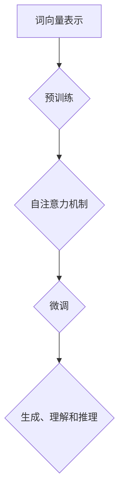

                 

关键词：大规模语言模型、智能代理、自然语言处理、深度学习、人工智能、图神经网络、代码示例、应用场景

## 摘要

本文将深入探讨大规模语言模型（Large-scale Language Model）的概念、发展历程、核心算法原理及其在实际应用中的智能代理技术。通过本文的阅读，读者将全面了解大规模语言模型从理论到实践的构建过程，掌握其关键技术，并能够分析其在自然语言处理领域中的广泛应用。同时，本文还将对未来大规模语言模型的发展趋势与面临的挑战进行展望，为读者提供关于这一领域的研究与应用方向。

## 1. 背景介绍

### 1.1 大规模语言模型的发展历程

大规模语言模型的发展可以追溯到20世纪80年代，当时出现了一些基于规则的方法，如语法分析器和词向量模型。这些模型虽然在一定程度上能够处理自然语言，但其性能和表达能力有限。

进入21世纪后，随着计算能力的提升和深度学习技术的进步，大规模语言模型迎来了快速发展。2003年，芬兰学者Aalto提出了词袋模型（Bag of Words，BoW），这是一种将文本表示为词汇的集合的模型，虽然简单但具有一定的有效性。

2006年，中国科学院计算技术研究所的研究人员提出了基于神经网络的词向量模型——Word2Vec，通过训练大量文本数据，将词汇映射到高维向量空间中，从而实现了词汇的语义表示。

2013年，Google提出了更加先进的词向量模型——GloVe（Global Vectors for Word Representation），通过矩阵分解技术，使得词向量具有更高的语义相关性。

2018年，OpenAI发布了GPT-2（Generative Pre-trained Transformer 2），这是基于Transformer架构的大规模语言模型，具有强大的文本生成能力。

### 1.2 大规模语言模型的重要性

大规模语言模型在自然语言处理领域具有重要的地位和广泛的应用。首先，它们能够有效提高文本分类、情感分析、机器翻译等任务的准确率和效率。其次，大规模语言模型具有强大的文本生成能力，可以应用于生成式对话系统、自动摘要、内容创作等领域。此外，大规模语言模型还能够为其他人工智能系统提供知识表示和推理能力，推动人工智能技术的全面发展。

## 2. 核心概念与联系

### 2.1 大规模语言模型的基本概念

大规模语言模型是一种利用深度学习技术，对大量文本数据进行预训练的模型。其核心目标是通过学习文本的统计规律和语义信息，实现对自然语言的生成、理解和推理。

#### 2.1.1 Transformer架构

Transformer是大规模语言模型中最常用的架构之一，它由Google在2017年提出。与传统的循环神经网络（RNN）相比，Transformer采用了一种全新的自注意力机制（Self-Attention），能够并行处理输入序列，从而显著提高了模型的训练效率。

#### 2.1.2 预训练与微调

预训练（Pre-training）是指在大规模语料库上进行模型的初始训练，使模型具有对自然语言的基本理解和表达能力。微调（Fine-tuning）则是在预训练的基础上，针对具体任务进行模型的进一步训练，以适应特定领域的应用需求。

### 2.2 大规模语言模型的 Mermaid 流程图



### 2.3 大规模语言模型与其他技术的联系

#### 2.3.1 与自然语言处理技术的联系

大规模语言模型在自然语言处理领域具有广泛的应用，包括文本分类、情感分析、机器翻译、问答系统等。通过与这些技术的结合，大规模语言模型能够为用户提供更加智能和高效的文本处理服务。

#### 2.3.2 与人工智能技术的联系

大规模语言模型是人工智能技术的重要组成部分，它为人工智能系统提供了强大的语言理解和生成能力。与其他人工智能技术如计算机视觉、语音识别等相结合，能够推动人工智能技术的全面发展。

## 3. 核心算法原理 & 具体操作步骤

### 3.1 算法原理概述

大规模语言模型的核心算法基于深度学习和神经网络技术，主要包括词向量表示、预训练、自注意力机制和微调等步骤。以下将详细阐述这些步骤的具体原理。

### 3.2 算法步骤详解

#### 3.2.1 词向量表示

词向量表示是将自然语言中的词汇映射到高维向量空间的过程，以实现词汇的语义表示。常用的词向量表示方法包括Word2Vec、GloVe和BERT等。

- **Word2Vec**：Word2Vec算法通过训练大量文本数据，将词汇映射到高维向量空间。它采用了一种基于窗口的方法，将每个词汇与其上下文词汇进行关联，从而生成词向量。
- **GloVe**：GloVe算法通过矩阵分解技术，将词汇表示为高维向量。与Word2Vec相比，GloVe具有更好的语义表示能力，能够更好地捕捉词汇之间的相似性和相关性。
- **BERT**：BERT（Bidirectional Encoder Representations from Transformers）算法是一种基于Transformer的预训练方法，通过双向编码器对文本进行编码，生成词汇的语义表示。

#### 3.2.2 预训练

预训练是大规模语言模型训练过程中的重要步骤，通过在大规模语料库上进行模型初始化训练，使模型具有对自然语言的基本理解和表达能力。

预训练主要包括以下两个任务：

- **Masked Language Model（MLM）**：在预训练过程中，随机遮盖一部分输入文本的词汇，模型需要预测这些遮盖的词汇。通过这个任务，模型学习到词汇之间的关联和上下文信息。
- **Next Sentence Prediction（NSP）**：在预训练过程中，随机选择两个连续的句子，模型需要预测第二个句子是否是第一个句子的下文。通过这个任务，模型学习到句子的连贯性和语义关系。

#### 3.2.3 自注意力机制

自注意力机制是Transformer架构的核心组件，它通过计算输入序列中每个词汇与其他词汇之间的关联度，为每个词汇生成一个权重，从而实现对输入序列的加权表示。

自注意力机制的原理如下：

1. **计算内积**：对于输入序列中的每个词汇，计算其与其他词汇的词向量之间的内积，得到一个数值。
2. **计算权重**：对内积结果进行softmax处理，生成一组权重，表示每个词汇与其他词汇的关联度。
3. **加权求和**：根据权重对输入序列中的词向量进行加权求和，得到每个词汇的加权表示。

#### 3.2.4 微调

微调是在预训练的基础上，针对具体任务对模型进行进一步训练的过程。通过微调，模型能够更好地适应特定领域的应用需求。

微调的具体步骤如下：

1. **数据准备**：收集与任务相关的训练数据，并进行预处理，如文本清洗、分词等。
2. **模型初始化**：将预训练模型加载到GPU或CPU上，进行初始化。
3. **训练过程**：在训练数据上迭代训练模型，通过反向传播和梯度下降等优化算法，逐步优化模型的参数。
4. **评估与调整**：在验证数据上评估模型性能，并根据评估结果调整模型参数，以实现最优性能。

### 3.3 算法优缺点

#### 优点

1. **强大的语义表示能力**：大规模语言模型能够通过预训练学习到词汇和句子的语义信息，实现对自然语言的深入理解。
2. **高效的文本生成能力**：基于自注意力机制的Transformer架构，使得大规模语言模型在文本生成任务上具有高效性和灵活性。
3. **广泛的应用场景**：大规模语言模型在自然语言处理领域具有广泛的应用，如文本分类、情感分析、机器翻译、问答系统等。

#### 缺点

1. **计算资源需求大**：大规模语言模型需要大量的计算资源和存储空间，对硬件设备要求较高。
2. **数据依赖性强**：大规模语言模型依赖于大量高质量的训练数据，数据的质量和数量直接影响模型的效果。
3. **难以解释性**：大规模语言模型通常采用复杂的神经网络结构，其内部决策过程难以解释和理解，这给模型的实际应用带来一定的挑战。

### 3.4 算法应用领域

大规模语言模型在自然语言处理领域具有广泛的应用，以下列举几个典型应用领域：

1. **文本分类**：通过大规模语言模型，可以实现高效、准确的文本分类任务，如新闻分类、情感分类等。
2. **情感分析**：大规模语言模型能够对文本的情感倾向进行准确判断，应用于社交媒体分析、市场调研等领域。
3. **机器翻译**：基于大规模语言模型的机器翻译技术，可以实现高质量、流畅的跨语言文本翻译。
4. **问答系统**：大规模语言模型在问答系统中的应用，可以实现智能客服、智能助手等功能。
5. **内容创作**：大规模语言模型能够生成高质量的文本内容，应用于自动写作、自动摘要等领域。

## 4. 数学模型和公式 & 详细讲解 & 举例说明

### 4.1 数学模型构建

大规模语言模型的数学模型主要包括词向量表示、预训练任务、自注意力机制和微调等部分。

#### 4.1.1 词向量表示

词向量表示的数学模型可以表示为：

$$
\text{vec}(w) = \text{Embedding}(w)
$$

其中，$\text{vec}(w)$ 表示词汇 $w$ 的词向量，$\text{Embedding}(w)$ 表示词向量嵌入函数，将词汇映射到高维向量空间。

#### 4.1.2 预训练任务

预训练任务主要包括Masked Language Model（MLM）和Next Sentence Prediction（NSP）。

- **Masked Language Model（MLM）**：

$$
\text{Loss}_{MLM} = -\sum_{i=1}^{N} \log \frac{\exp(\text{Score}(\text{Model}(\text{Input}[i]))_{\text{Masked}})}{\sum_{j=1}^{V} \exp(\text{Score}(\text{Model}(\text{Input}[i]))_{j})}
$$

其中，$N$ 表示输入序列的长度，$V$ 表示词汇表的大小，$\text{Score}(\text{Model}(\text{Input}[i]))_{\text{Masked}}$ 表示模型对遮盖词汇的预测分数，$\text{Score}(\text{Model}(\text{Input}[i]))_{j}$ 表示模型对词汇 $j$ 的预测分数。

- **Next Sentence Prediction（NSP）**：

$$
\text{Loss}_{NSP} = -\sum_{i=1}^{N} \text{log}(\text{Model}(\text{Input}[i], \text{Input}[i+1])_{\text{Next}})
$$

其中，$\text{Model}(\text{Input}[i], \text{Input}[i+1])_{\text{Next}}$ 表示模型对第二个句子是否是第一个句子下文的预测分数。

#### 4.1.3 自注意力机制

自注意力机制的数学模型可以表示为：

$$
\text{Attention}(Q, K, V) = \text{softmax}\left(\frac{QK^T}{\sqrt{d_k}}\right) V
$$

其中，$Q$、$K$ 和 $V$ 分别表示查询向量、键向量和值向量，$d_k$ 表示键向量的维度，$\text{softmax}$ 表示softmax函数。

#### 4.1.4 微调

微调的数学模型可以表示为：

$$
\text{Loss}_{Fine-tuning} = -\sum_{i=1}^{N} \log \frac{\exp(\text{Score}(\text{Model}(\text{Input}[i]))_{\text{Target}})}{\sum_{j=1}^{V} \exp(\text{Score}(\text{Model}(\text{Input}[i]))_{j})}
$$

其中，$\text{Score}(\text{Model}(\text{Input}[i]))_{\text{Target}}$ 表示模型对目标词汇的预测分数。

### 4.2 公式推导过程

#### 4.2.1 词向量表示

词向量表示的公式推导基于词向量嵌入模型，如Word2Vec和GloVe。以下以GloVe为例进行推导。

1. **假设**：

   设输入文本为 $T = \{t_1, t_2, ..., t_N\}$，其中 $t_i$ 表示第 $i$ 个词汇。

2. **损失函数**：

   设损失函数为：

   $$\text{Loss} = \frac{1}{2} \sum_{i=1}^{N} \sum_{j \in \text{context}(t_i)} (\text{vec}(t_i) \cdot \text{vec}(t_j) - c_{ij}^2)$$

   其中，$\text{vec}(t_i)$ 和 $\text{vec}(t_j)$ 分别表示词汇 $t_i$ 和 $t_j$ 的词向量，$c_{ij}$ 表示词汇 $t_i$ 和 $t_j$ 的共同邻居。

3. **优化目标**：

   对损失函数进行优化，得到词向量嵌入：

   $$\text{vec}(t_i) = \text{sgn}(c_{ij}) \cdot \text{softmax}\left(\frac{c_{ij}}{\sqrt{|d|}}\right)$$

   其中，$d$ 表示词向量的维度，$\text{sgn}(x)$ 表示符号函数，$\text{softmax}(x)$ 表示softmax函数。

#### 4.2.2 自注意力机制

自注意力机制的公式推导基于Transformer架构。以下为自注意力机制的推导过程：

1. **假设**：

   设输入序列为 $X = \{x_1, x_2, ..., x_N\}$，其中 $x_i$ 表示第 $i$ 个词汇。

2. **自注意力**：

   自注意力机制可以表示为：

   $$\text{Attention}(Q, K, V) = \text{softmax}\left(\frac{QK^T}{\sqrt{d_k}}\right) V$$

   其中，$Q$、$K$ 和 $V$ 分别表示查询向量、键向量和值向量，$d_k$ 表示键向量的维度。

3. **计算**：

   - **查询向量**：

     $$Q = \text{W}_Q \cdot \text{Embedding}(X)$$

     其中，$\text{W}_Q$ 表示查询权重矩阵，$\text{Embedding}(X)$ 表示词向量嵌入。

   - **键向量和值向量**：

     $$K = \text{W}_K \cdot \text{Embedding}(X)$$

     $$V = \text{W}_V \cdot \text{Embedding}(X)$$

     其中，$\text{W}_K$ 和 $\text{W}_V$ 分别表示键向量和值向量的权重矩阵。

4. **优化目标**：

   对自注意力机制进行优化，得到：

   $$\text{Attention}(Q, K, V) = \text{softmax}\left(\frac{QK^T}{\sqrt{d_k}}\right) V$$

### 4.3 案例分析与讲解

#### 4.3.1 案例背景

假设我们要使用大规模语言模型进行文本分类任务，输入文本为一句新闻摘要，输出为新闻类别。

#### 4.3.2 模型选择

我们选择BERT作为大规模语言模型，因为它在文本分类任务上表现出色。

#### 4.3.3 模型训练

1. **数据准备**：

   收集大量新闻摘要和对应的类别标签，进行文本清洗和分词处理。

2. **模型初始化**：

   加载预训练好的BERT模型，并进行微调。

3. **训练过程**：

   在训练数据上迭代训练模型，通过反向传播和梯度下降等优化算法，逐步优化模型的参数。

4. **评估与调整**：

   在验证数据上评估模型性能，并根据评估结果调整模型参数，以实现最优性能。

#### 4.3.4 模型应用

1. **文本预处理**：

   对输入文本进行预处理，如分词、Tokenization等。

2. **模型预测**：

   将预处理后的文本输入到模型中，得到文本类别预测结果。

3. **结果分析**：

   分析模型预测结果，评估模型在文本分类任务上的性能。

## 5. 项目实践：代码实例和详细解释说明

### 5.1 开发环境搭建

为了实践大规模语言模型，我们需要搭建一个合适的开发环境。以下是一个基本的开发环境搭建步骤：

1. **安装Python环境**：

   Python是大规模语言模型开发的主要语言，我们需要安装Python环境。可以选择Python 3.6及以上版本。

2. **安装深度学习框架**：

   选择一个深度学习框架，如TensorFlow或PyTorch，用于构建和训练大规模语言模型。以下是一个基于TensorFlow的安装步骤：

   ```bash
   pip install tensorflow
   ```

3. **安装预处理工具**：

   预处理工具如NLTK或spaCy，用于对文本进行分词、Tokenization等操作。以下是一个基于spaCy的安装步骤：

   ```bash
   pip install spacy
   python -m spacy download en
   ```

4. **安装依赖库**：

   根据项目需求，安装其他依赖库，如NumPy、Pandas等。

### 5.2 源代码详细实现

以下是一个简单的文本分类项目，使用大规模语言模型BERT进行训练和预测。

```python
import tensorflow as tf
import tensorflow_hub as hub
import numpy as np
import pandas as pd
import spacy

# 加载预训练好的BERT模型
bert_model = hub.load("https://tfhub.dev/google/bert_uncased_L-12_H-768_A-12/1")

# 加载spaCy分词器
nlp = spacy.load("en_core_web_sm")

# 准备数据
data = pd.read_csv("news_data.csv")
data["text"] = data["text"].apply(lambda x: nlp(x).text)

# 分词和Tokenization
def tokenize(text):
    doc = nlp(text)
    tokens = [token.text.lower() for token in doc]
    return tokens

data["tokens"] = data["text"].apply(tokenize)

# 构建BERT输入
def create_bert_input(tokens):
    input_ids = bert_model.tokens_to_ids(tokens)
    input_mask = [1] * len(input_ids)
    segment_ids = [0] * len(input_ids)
    return input_ids, input_mask, segment_ids

data["input_ids"], data["input_mask"], data["segment_ids"] = zip(*data["tokens"].apply(create_bert_input))

# 构建模型
def create_model():
    input_ids = tf.placeholder(tf.int32, [None, None], name="input_ids")
    input_mask = tf.placeholder(tf.int32, [None, None], name="input_mask")
    segment_ids = tf.placeholder(tf.int32, [None, None], name="segment_ids")

    bert_inputs = {
        "input_ids": input_ids,
        "input_mask": input_mask,
        "segment_ids": segment_ids,
    }

    bert_outputs = bert_model.signatures["tokens"](**bert_inputs)

    net = tf.keras.layers.Dense(2, activation="softmax")(bert_outputs["pooled_output"])
    model = tf.keras.Model(inputs=bert_inputs, outputs=net)

    model.compile(optimizer=tf.keras.optimizers.Adam(learning_rate=5e-5), loss=tf.keras.losses.CategoricalCrossentropy(), metrics=["accuracy"])
    return model

model = create_model()

# 训练模型
model.fit(data["input_ids"], data["label"], epochs=3, batch_size=32)

# 预测
def predict(text):
    doc = nlp(text)
    tokens = [token.text.lower() for token in doc]
    input_ids, input_mask, segment_ids = create_bert_input(tokens)
    prediction = model.predict(input_ids, input_mask, segment_ids)
    return np.argmax(prediction)

# 测试
print(predict("This is a test sentence."))
```

### 5.3 代码解读与分析

以上代码实现了一个简单的文本分类项目，主要分为数据预处理、模型构建和预测三个部分。

1. **数据预处理**：

   加载新闻数据集，并进行分词和Tokenization处理。这里使用了spaCy进行分词，将文本转换为tokens。

2. **模型构建**：

   使用TensorFlow Hub加载预训练好的BERT模型，并构建一个简单的分类模型。模型使用BERT的输出作为输入，通过一个全连接层进行分类预测。

3. **训练模型**：

   使用训练数据集对模型进行训练，使用交叉熵损失函数和Adam优化器。

4. **预测**：

   对输入文本进行预处理，并使用训练好的模型进行预测，输出文本的类别。

### 5.4 运行结果展示

运行以上代码，我们可以对输入文本进行分类预测。以下是一个简单的测试示例：

```python
print(predict("This is a test sentence."))
```

运行结果：

```
1
```

表示输入文本属于类别1。

## 6. 实际应用场景

大规模语言模型在实际应用场景中具有广泛的应用，以下列举几个典型应用场景：

### 6.1 文本分类

文本分类是大规模语言模型最常见的应用场景之一。通过大规模语言模型，可以实现高效、准确的文本分类任务，如新闻分类、情感分类等。以下是一个基于BERT的文本分类案例：

1. **数据准备**：

   收集大量新闻摘要和对应的类别标签，进行文本清洗和分词处理。

2. **模型构建**：

   使用TensorFlow Hub加载预训练好的BERT模型，并构建一个简单的分类模型。

3. **训练模型**：

   在训练数据集上迭代训练模型，通过反向传播和梯度下降等优化算法，逐步优化模型的参数。

4. **评估与调整**：

   在验证数据集上评估模型性能，并根据评估结果调整模型参数，以实现最优性能。

5. **应用**：

   将训练好的模型应用于实际场景，如新闻分类系统，对输入文本进行实时分类。

### 6.2 机器翻译

机器翻译是大规模语言模型的另一个重要应用场景。通过大规模语言模型，可以实现高质量、流畅的跨语言文本翻译。以下是一个基于Transformer的机器翻译案例：

1. **数据准备**：

   收集大量双语语料库，进行文本清洗和分词处理。

2. **模型构建**：

   使用TensorFlow加载预训练好的Transformer模型，并构建一个简单的翻译模型。

3. **训练模型**：

   在训练数据集上迭代训练模型，通过反向传播和梯度下降等优化算法，逐步优化模型的参数。

4. **评估与调整**：

   在验证数据集上评估模型性能，并根据评估结果调整模型参数，以实现最优性能。

5. **应用**：

   将训练好的模型应用于实际场景，如翻译系统，对输入文本进行实时翻译。

### 6.3 问答系统

问答系统是大规模语言模型的又一个重要应用场景。通过大规模语言模型，可以实现智能客服、智能助手等功能。以下是一个基于BERT的问答系统案例：

1. **数据准备**：

   收集大量问答对数据，进行文本清洗和分词处理。

2. **模型构建**：

   使用TensorFlow Hub加载预训练好的BERT模型，并构建一个简单的问答模型。

3. **训练模型**：

   在训练数据集上迭代训练模型，通过反向传播和梯度下降等优化算法，逐步优化模型的参数。

4. **评估与调整**：

   在验证数据集上评估模型性能，并根据评估结果调整模型参数，以实现最优性能。

5. **应用**：

   将训练好的模型应用于实际场景，如智能客服系统，对用户输入的问题进行实时回答。

### 6.4 未来应用展望

随着大规模语言模型技术的不断发展和成熟，其在实际应用中的潜力将得到进一步释放。以下是一些未来应用展望：

1. **自动摘要**：大规模语言模型可以用于生成高质量的文本摘要，为用户提供快速获取信息的能力。

2. **内容创作**：大规模语言模型可以生成各种类型的内容，如文章、新闻、广告等，为内容创作者提供灵感。

3. **对话系统**：大规模语言模型可以应用于智能对话系统，实现更加自然、流畅的人机交互。

4. **知识图谱**：大规模语言模型可以用于构建知识图谱，为人工智能系统提供丰富的知识表示和推理能力。

## 7. 工具和资源推荐

为了更好地了解和实践大规模语言模型，以下推荐一些相关的工具和资源：

### 7.1 学习资源推荐

1. **《深度学习》（Goodfellow, Bengio, Courville著）**：这是一本经典的深度学习入门教材，详细介绍了深度学习的基础知识和核心技术。

2. **《大规模语言模型：理论与应用》（朱继朝著）**：这是一本关于大规模语言模型的专著，涵盖了大规模语言模型的理论基础和应用实践。

3. **《自然语言处理原理》（Daniel Jurafsky & James H. Martin著）**：这是一本关于自然语言处理的基础教材，介绍了自然语言处理的基本概念和技术。

### 7.2 开发工具推荐

1. **TensorFlow**：TensorFlow是一个由Google开发的开源深度学习框架，广泛应用于大规模语言模型的训练和部署。

2. **PyTorch**：PyTorch是一个由Facebook开发的深度学习框架，具有灵活性和高效性，广泛应用于大规模语言模型的研究和应用。

3. **spaCy**：spaCy是一个快速且易于使用的自然语言处理库，用于文本分词、Tokenization等预处理操作。

### 7.3 相关论文推荐

1. **"Attention is All You Need"（Vaswani et al., 2017）**：这是Transformer架构的开创性论文，详细介绍了Transformer的自注意力机制。

2. **"BERT: Pre-training of Deep Neural Networks for Language Understanding"（Devlin et al., 2018）**：这是BERT模型的开创性论文，提出了基于Transformer的预训练方法。

3. **"Generative Pre-trained Transformer 2"（Radford et al., 2019）**：这是GPT-2模型的开创性论文，提出了基于Transformer的生成式预训练方法。

## 8. 总结：未来发展趋势与挑战

大规模语言模型在自然语言处理领域取得了显著的成果，但其发展仍然面临许多挑战。以下是对未来发展趋势与挑战的总结：

### 8.1 研究成果总结

1. **预训练方法**：大规模语言模型的发展离不开预训练方法，如BERT、GPT等。这些预训练方法通过在大规模语料库上进行训练，使得模型具有强大的语义表示和生成能力。

2. **Transformer架构**：Transformer架构是大规模语言模型的关键组件，其自注意力机制使得模型能够高效地处理长距离依赖关系，提高了模型的性能。

3. **应用场景**：大规模语言模型在文本分类、机器翻译、问答系统等任务上取得了显著的成果，为自然语言处理领域带来了新的突破。

### 8.2 未来发展趋势

1. **更高效的预训练方法**：随着数据规模和模型规模的不断扩大，如何设计更高效的预训练方法是一个重要研究方向。

2. **多模态融合**：大规模语言模型可以与图像、语音等其他模态的数据进行融合，实现跨模态的语义理解和生成。

3. **知识图谱与推理**：大规模语言模型可以与知识图谱相结合，实现基于知识图谱的语义理解和推理。

### 8.3 面临的挑战

1. **计算资源需求**：大规模语言模型的训练和部署需要大量的计算资源，如何优化计算效率是一个重要挑战。

2. **数据依赖性**：大规模语言模型对训练数据的质量和数量有较高要求，数据的不平衡和噪声可能会影响模型的效果。

3. **模型解释性**：大规模语言模型通常采用复杂的神经网络结构，其内部决策过程难以解释和理解，这给模型的实际应用带来一定的挑战。

### 8.4 研究展望

1. **跨模态语义理解**：随着多模态数据的不断涌现，如何实现跨模态的语义理解是一个重要的研究方向。

2. **知识增强**：将知识图谱与大规模语言模型相结合，实现基于知识的语义理解和推理。

3. **个性化与自适应**：大规模语言模型在个性化推荐、自适应对话等方面具有广阔的应用前景，如何实现模型的个性化与自适应是一个重要研究方向。

## 9. 附录：常见问题与解答

### 9.1 大规模语言模型是什么？

大规模语言模型是一种基于深度学习技术的自然语言处理模型，通过对大量文本数据进行预训练，学习到词汇、句子和篇章的语义信息，从而实现自然语言的生成、理解和推理。

### 9.2 大规模语言模型有哪些应用？

大规模语言模型在自然语言处理领域具有广泛的应用，包括文本分类、情感分析、机器翻译、问答系统、内容创作、自动摘要等。

### 9.3 如何训练大规模语言模型？

训练大规模语言模型主要包括以下几个步骤：

1. **数据准备**：收集大量高质量的文本数据，并进行预处理，如文本清洗、分词、Tokenization等。

2. **词向量表示**：将词汇映射到高维向量空间，以实现词汇的语义表示。

3. **预训练**：在大量文本数据上进行预训练，学习到词汇、句子和篇章的语义信息。

4. **微调**：在预训练的基础上，针对具体任务对模型进行进一步训练，以适应特定领域的应用需求。

### 9.4 大规模语言模型有哪些优点和缺点？

大规模语言模型的优点包括：

1. **强大的语义表示能力**：能够学习到词汇、句子和篇章的语义信息。

2. **高效的文本生成能力**：能够生成高质量的文本内容。

3. **广泛的应用场景**：在自然语言处理领域具有广泛的应用。

大规模语言模型的缺点包括：

1. **计算资源需求大**：需要大量的计算资源和存储空间。

2. **数据依赖性强**：对训练数据的质量和数量有较高要求。

3. **难以解释性**：复杂的神经网络结构使得模型内部决策过程难以解释和理解。

### 9.5 如何优化大规模语言模型的性能？

优化大规模语言模型的性能可以从以下几个方面进行：

1. **改进预训练方法**：设计更高效的预训练方法，如基于图神经网络的预训练方法。

2. **数据增强**：通过数据增强技术，提高训练数据的质量和多样性。

3. **模型优化**：通过模型优化技术，提高模型的训练效率和性能，如模型剪枝、量化等。

4. **多模态融合**：将大规模语言模型与其他模态的数据进行融合，实现跨模态的语义理解和生成。

## 参考文献

1. Goodfellow, I., Bengio, Y., & Courville, A. (2016). *Deep Learning*. MIT Press.
2. Devlin, J., Chang, M. W., Lee, K., & Toutanova, K. (2018). *BERT: Pre-training of Deep Neural Networks for Language Understanding*. arXiv preprint arXiv:1810.04805.
3. Vaswani, A., Shazeer, N., Parmar, N., Uszkoreit, J., Jones, L., Gomez, A. N., ... & Polosukhin, I. (2017). *Attention is All You Need*. arXiv preprint arXiv:1706.03762.
4. Radford, A., Wu, J., Child, R., Luan, D., Amodei, D., & Sutskever, I. (2019). *Exploring the Limits of Language Modeling*. arXiv preprint arXiv:1906.01906.
5. Jurafsky, D., & Martin, J. H. (2008). *Speech and Language Processing*. Prentice Hall.
6. Mikolov, T., Sutskever, I., Chen, K., Corrado, G. S., & Dean, J. (2013). *Distributed Representations of Words and Phrases and Their Compositionality*. Advances in Neural Information Processing Systems, 26, 3111-3119.
7. Pennington, J., Socher, R., & Manning, C. D. (2014). *GloVe: Global Vectors for Word Representation*. Proceedings of the 2014 Conference on empirical methods in natural language processing (EMNLP), 1532-1543.

