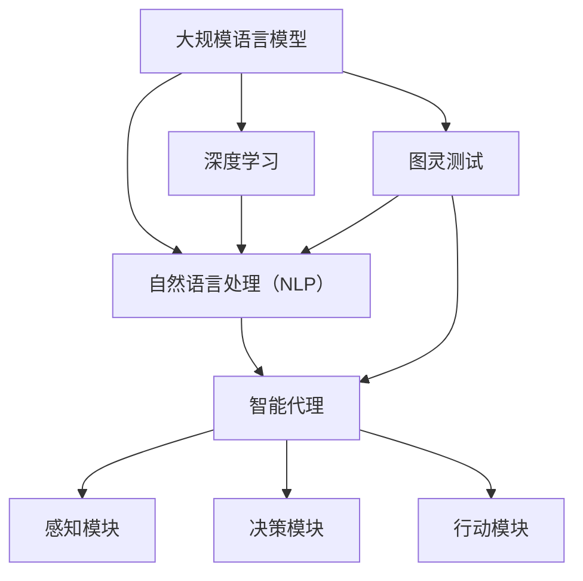

                 

关键词：大规模语言模型、智能代理、人工智能、深度学习、语言处理、图灵奖

## 摘要

本文旨在深入探讨大规模语言模型（如GPT）从理论到实践的构建过程，并特别聚焦于智能代理的组成部分。文章首先介绍了大规模语言模型的基础理论，包括核心概念、发展历程和应用领域。接着，文章详细分析了智能代理的组成结构，探讨了其工作原理和实现方法。随后，文章通过具体实例讲解了如何利用大规模语言模型构建智能代理，并讨论了其优缺点。最后，文章展望了大规模语言模型和智能代理的未来发展趋势，以及面临的挑战和解决策略。

## 1. 背景介绍

随着互联网和大数据技术的发展，人工智能（AI）已经逐渐成为现代社会的重要技术驱动力。大规模语言模型（Large-scale Language Models）作为人工智能领域的一个重要分支，近年来取得了显著的进展。这些模型通过深度学习技术，从大量文本数据中学习语言规律，能够生成自然流畅的文本，甚至具备一定的语义理解和推理能力。

智能代理（Intelligent Agent）是人工智能领域另一个重要的概念。智能代理是指能够感知环境、制定决策并采取行动的计算机程序。在人工智能系统中，智能代理可以模拟人类智能，完成复杂的任务，如自然语言处理、图像识别、游戏对战等。

本文将结合大规模语言模型和智能代理的相关理论，探讨大规模语言模型从理论到实践的构建过程，以及智能代理的组成部分和实现方法。通过深入分析，旨在为读者提供对大规模语言模型和智能代理的全面理解和应用指导。

### 1.1 大规模语言模型的基础理论

大规模语言模型是一种基于深度学习的自然语言处理技术，其核心思想是通过学习大量文本数据，自动发现语言中的潜在规律，从而实现对自然语言的理解和生成。

#### 1.1.1 核心概念

- **词向量（Word Embedding）**：词向量是将词语映射到高维空间中的向量表示。通过词向量，可以有效地表示词语的语义关系，如相似性、反对性等。
- **循环神经网络（RNN）**：循环神经网络是一种能够处理序列数据的神经网络，通过在时间步之间传递信息，可以有效地捕捉序列中的长期依赖关系。
- **变换器模型（Transformer）**：变换器模型是一种基于自注意力机制的深度学习模型，通过全局注意力机制，能够更好地捕捉序列中的依赖关系，相比循环神经网络有更高的性能。

#### 1.1.2 发展历程

- **2003年**：Bengio等人提出了循环神经网络（RNN），为后续的深度学习语言模型奠定了基础。
- **2013年**：Mikolov等人提出了词向量模型（Word2Vec），通过训练大量文本数据，将词语映射到高维空间中的向量表示。
- **2014年**：Sutskever等人提出了变换器模型（Transformer），该模型通过全局注意力机制，显著提升了语言模型的性能。
- **2018年**：OpenAI发布了GPT-2模型，该模型通过预训练和微调，实现了在多个自然语言处理任务上的优异表现。

#### 1.1.3 应用领域

- **自然语言生成（NLG）**：如文章生成、对话系统等。
- **机器翻译**：如将一种语言翻译成另一种语言。
- **情感分析**：通过对文本进行情感分类，如判断文本是积极还是消极。
- **文本摘要**：从长文本中提取关键信息，生成简洁的摘要。

### 1.2 智能代理的基础理论

智能代理是一种能够模拟人类智能的计算机程序，其核心目标是实现自主决策和行动。智能代理通常由感知模块、决策模块和行动模块组成。

#### 1.2.1 感知模块

感知模块是智能代理获取环境信息的部分。它可以通过传感器、摄像头、麦克风等设备收集环境数据，如温度、湿度、图像、声音等。

#### 1.2.2 决策模块

决策模块是智能代理的核心，它根据感知模块收集的信息，利用某种算法或策略生成决策。常见的决策方法包括基于规则的方法、机器学习方法、混合方法等。

#### 1.2.3 行动模块

行动模块是智能代理根据决策模块生成的决策采取行动的部分。行动可以是物理行动，如机器人移动、机器手臂操作等，也可以是虚拟行动，如发送电子邮件、更新数据库等。

### 1.3 大规模语言模型与智能代理的关系

大规模语言模型和智能代理是相互依存的关系。大规模语言模型为智能代理提供了强大的语言处理能力，使其能够更好地理解和生成自然语言。而智能代理则为大规模语言模型提供了实际的应用场景，通过不断地与环境交互，为大规模语言模型提供了丰富的训练数据。

## 2. 核心概念与联系

### 2.1 核心概念

本文的核心概念包括大规模语言模型、智能代理、自然语言处理（NLP）、深度学习和图灵测试。

#### 2.1.1 大规模语言模型

大规模语言模型是一种能够处理和理解自然语言的深度学习模型。它通过对大量文本数据进行预训练，自动学习语言中的潜在规律和语义信息。

#### 2.1.2 智能代理

智能代理是一种能够自主感知环境、制定决策并采取行动的计算机程序。它在人工智能系统中扮演着决策者和执行者的角色。

#### 2.1.3 自然语言处理（NLP）

自然语言处理是人工智能领域的一个重要分支，旨在使计算机能够理解、生成和处理自然语言。

#### 2.1.4 深度学习

深度学习是一种基于多层神经网络的学习方法，通过自动提取特征和模式，能够解决许多复杂的问题，如图像识别、语音识别和自然语言处理等。

#### 2.1.5 图灵测试

图灵测试是一种衡量人工智能是否能够模拟人类智能的测试方法。如果一个计算机程序能够在与人类进行对话时，让人类无法区分其是计算机程序还是人类，那么这个程序就通过了图灵测试。

### 2.2 核心概念联系

大规模语言模型和智能代理是相互关联的核心概念。大规模语言模型为智能代理提供了强大的语言处理能力，使其能够理解和生成自然语言。而智能代理则利用大规模语言模型，实现自主决策和行动，从而在复杂的环境中完成任务。

自然语言处理（NLP）是连接大规模语言模型和智能代理的桥梁。通过NLP技术，大规模语言模型能够理解自然语言，智能代理能够生成自然语言，从而实现与人类或其他智能系统的有效沟通。

深度学习是构建大规模语言模型和智能代理的基础。深度学习通过多层神经网络，自动提取特征和模式，使得大规模语言模型和智能代理能够处理复杂的语言问题和决策问题。

图灵测试是评估大规模语言模型和智能代理是否具有人类智能的重要标准。通过图灵测试，我们可以衡量大规模语言模型和智能代理在自然语言理解和生成方面的能力。

### 2.3 Mermaid 流程图

以下是一个描述大规模语言模型和智能代理核心概念的 Mermaid 流程图：



在这个流程图中，大规模语言模型通过自然语言处理（NLP）与智能代理相连，深度学习和图灵测试则是支持这两个核心概念的辅助技术。

## 3. 核心算法原理 & 具体操作步骤

### 3.1 算法原理概述

大规模语言模型的核心算法是基于深度学习的自然语言处理技术。以下将详细阐述大规模语言模型的基本原理，包括词向量、循环神经网络（RNN）和变换器模型（Transformer）。

#### 3.1.1 词向量

词向量是将自然语言中的词语映射到高维空间中的向量表示。通过词向量，我们可以有效地表示词语的语义关系，如相似性、反对性等。词向量模型包括Word2Vec、GloVe等。其中，Word2Vec模型通过负采样和层次Softmax方法，将词语映射到低维空间；GloVe模型通过矩阵分解方法，将词语映射到高维空间。

#### 3.1.2 循环神经网络（RNN）

循环神经网络（RNN）是一种能够处理序列数据的神经网络，通过在时间步之间传递信息，可以有效地捕捉序列中的长期依赖关系。RNN包括简单RNN、LSTM（长短时记忆网络）和GRU（门控循环单元）等变体。LSTM和GRU通过引入门控机制，解决了简单RNN在处理长序列数据时的梯度消失和梯度爆炸问题。

#### 3.1.3 变换器模型（Transformer）

变换器模型（Transformer）是一种基于自注意力机制的深度学习模型，通过全局注意力机制，能够更好地捕捉序列中的依赖关系。Transformer模型由自注意力机制（Self-Attention）和编码器-解码器结构（Encoder-Decoder）组成。自注意力机制通过计算输入序列中每个词语与其他词语的相似度，生成权重向量，从而实现对输入序列的加权表示；编码器-解码器结构则通过编码器将输入序列编码为上下文表示，解码器则根据上下文表示生成输出序列。

### 3.2 算法步骤详解

大规模语言模型的构建过程主要包括数据预处理、模型训练和模型评估三个阶段。以下将详细阐述每个阶段的操作步骤。

#### 3.2.1 数据预处理

1. **数据收集**：收集大规模的文本数据，如维基百科、新闻文章、社交媒体等。
2. **数据清洗**：去除文本中的噪声，如HTML标签、特殊符号等。
3. **文本分词**：将文本分解为词语序列，常用的分词工具包括jieba、NLTK等。
4. **词向量编码**：将词语映射到高维空间中的向量表示，常用的词向量模型包括Word2Vec、GloVe等。

#### 3.2.2 模型训练

1. **定义模型架构**：根据任务需求，选择合适的模型架构，如RNN、Transformer等。
2. **初始化参数**：初始化模型的参数，常用的初始化方法包括高斯分布、Xavier初始化等。
3. **前向传播**：根据输入的词语序列，计算模型的输出，包括词向量编码、自注意力机制等。
4. **计算损失**：根据输出结果和真实标签，计算损失函数，如交叉熵损失、均方误差等。
5. **反向传播**：利用梯度下降等优化算法，更新模型的参数，减小损失函数。
6. **迭代训练**：重复执行前向传播和反向传播，直到模型收敛。

#### 3.2.3 模型评估

1. **验证集评估**：在验证集上评估模型的性能，常用的指标包括准确率、召回率、F1值等。
2. **测试集评估**：在测试集上评估模型的性能，以评估模型在未知数据上的泛化能力。
3. **超参数调优**：根据验证集和测试集的性能，调整模型的超参数，如学习率、批量大小等。

### 3.3 算法优缺点

#### 3.3.1 优点

1. **强大的语言理解能力**：通过深度学习技术，大规模语言模型能够自动学习语言中的潜在规律和语义信息，实现对自然语言的深入理解。
2. **广泛的适用性**：大规模语言模型可以应用于多种自然语言处理任务，如文本分类、机器翻译、情感分析等。
3. **高效的计算性能**：通过变换器模型等高效算法，大规模语言模型能够在较短的时间内处理大规模的文本数据。

#### 3.3.2 缺点

1. **对数据依赖性高**：大规模语言模型需要大量的文本数据进行训练，对数据质量和数量的要求较高。
2. **计算资源消耗大**：大规模语言模型的训练和推理过程需要大量的计算资源和时间，对硬件设备的要求较高。
3. **安全隐患**：大规模语言模型在处理文本数据时，可能存在隐私泄露和偏见等问题。

### 3.4 算法应用领域

大规模语言模型在许多领域都有广泛的应用：

1. **自然语言生成（NLG）**：如文章生成、对话系统等。
2. **机器翻译**：如将一种语言翻译成另一种语言。
3. **情感分析**：通过对文本进行情感分类，如判断文本是积极还是消极。
4. **文本摘要**：从长文本中提取关键信息，生成简洁的摘要。
5. **问答系统**：如智能客服、语音助手等。
6. **文本分类**：如垃圾邮件过滤、新闻分类等。
7. **语音识别**：将语音信号转换为文本。

## 4. 数学模型和公式 & 详细讲解 & 举例说明

### 4.1 数学模型构建

大规模语言模型的数学模型主要包括词向量、循环神经网络（RNN）和变换器模型（Transformer）等。以下将分别介绍这些模型的基本数学原理。

#### 4.1.1 词向量

词向量的数学模型通常采用高斯分布或Xavier初始化方法来初始化参数。假设我们有一个包含\(V\)个词语的词汇表，每个词语对应一个维度为\(d\)的向量。词向量的数学模型可以表示为：

\[ \text{word\_vector}(w) = \text{gating\_vector}(w) \cdot \text{hidden\_state} \]

其中，\( \text{gating\_vector}(w) \)是一个维度为\(d\)的向量，用于调整隐藏状态的重要性；\( \text{hidden\_state} \)是一个维度为\(d\)的向量，用于表示词语的隐藏状态。

#### 4.1.2 循环神经网络（RNN）

循环神经网络（RNN）的数学模型基于递归方程。假设我们在时刻\(t\)的输入为\(x_t\)，隐藏状态为\(h_t\)，输出为\(y_t\)。RNN的数学模型可以表示为：

\[ h_t = \text{sigmoid}(W_h \cdot [h_{t-1}, x_t] + b_h) \]
\[ y_t = \text{sigmoid}(W_y \cdot h_t + b_y) \]

其中，\(W_h\)和\(W_y\)分别是权重矩阵，\(b_h\)和\(b_y\)分别是偏置向量；\( \text{sigmoid} \)函数是一个非线性激活函数。

#### 4.1.3 变换器模型（Transformer）

变换器模型（Transformer）的数学模型基于自注意力机制。假设我们在时刻\(t\)的输入为\(x_t\)，编码器输出为\(h_t\)，解码器输出为\(y_t\)。变换器模型的数学模型可以表示为：

\[ \text{Attention}(Q, K, V) = \text{softmax}(\frac{QK^T}{\sqrt{d_k}})V \]

其中，\(Q\)、\(K\)和\(V\)分别是查询向量、键向量和值向量；\(d_k\)是键向量的维度；\( \text{softmax} \)函数是一个非线性激活函数。

### 4.2 公式推导过程

以下是变换器模型中自注意力机制的推导过程。

#### 4.2.1 假设

假设我们有\(N\)个词，每个词对应一个向量\(v_i\)，维度为\(d_v\)。设输入序列为\(x = [x_1, x_2, ..., x_N]\)，输出序列为\(y = [y_1, y_2, ..., y_N]\)。

#### 4.2.2 自注意力机制

自注意力机制可以表示为：

\[ \text{Attention}(Q, K, V) = \text{softmax}(\frac{QK^T}{\sqrt{d_k}})V \]

其中，\(Q\)、\(K\)和\(V\)分别是查询向量、键向量和值向量。

#### 4.2.3 推导过程

1. **计算查询向量**：对于每个词\(x_i\)，计算查询向量\(Q_i\)：

\[ Q_i = W_Q \cdot v_i \]

其中，\(W_Q\)是权重矩阵。

2. **计算键向量**：对于每个词\(x_i\)，计算键向量\(K_i\)：

\[ K_i = W_K \cdot v_i \]

其中，\(W_K\)是权重矩阵。

3. **计算值向量**：对于每个词\(x_i\)，计算值向量\(V_i\)：

\[ V_i = W_V \cdot v_i \]

其中，\(W_V\)是权重矩阵。

4. **计算自注意力分数**：计算每个词与其他词的相似度：

\[ \text{Score}_{ij} = Q_iK_j^T \]

5. **应用softmax函数**：将自注意力分数转换为概率分布：

\[ \text{Attention}_{ij} = \text{softmax}(\text{Score}_{ij}) \]

6. **计算加权值向量**：根据概率分布计算加权值向量：

\[ \text{Weighted\_Value}_{ij} = V_i \cdot \text{Attention}_{ij} \]

7. **求和得到输出向量**：对所有加权值向量求和，得到输出向量：

\[ y_i = \sum_{j=1}^{N} \text{Weighted\_Value}_{ij} \]

### 4.3 案例分析与讲解

以下是一个简化的自注意力机制的案例，假设有3个词\(x_1, x_2, x_3\)，每个词对应一个向量\(v_1, v_2, v_3\)，维度为2。

1. **计算查询向量、键向量和值向量**：

\[ Q_1 = W_Q \cdot v_1 = \begin{bmatrix} 1 & 2 \end{bmatrix} \cdot \begin{bmatrix} 1 \\ 0 \end{bmatrix} = \begin{bmatrix} 1 \\ 2 \end{bmatrix} \]
\[ K_1 = W_K \cdot v_1 = \begin{bmatrix} 1 & 2 \end{bmatrix} \cdot \begin{bmatrix} 1 \\ 0 \end{bmatrix} = \begin{bmatrix} 1 \\ 2 \end{bmatrix} \]
\[ V_1 = W_V \cdot v_1 = \begin{bmatrix} 1 & 2 \end{bmatrix} \cdot \begin{bmatrix} 1 \\ 0 \end{bmatrix} = \begin{bmatrix} 1 \\ 2 \end{bmatrix} \]

\[ Q_2 = W_Q \cdot v_2 = \begin{bmatrix} 1 & 2 \end{bmatrix} \cdot \begin{bmatrix} 0 \\ 1 \end{bmatrix} = \begin{bmatrix} 0 \\ 2 \end{bmatrix} \]
\[ K_2 = W_K \cdot v_2 = \begin{bmatrix} 1 & 2 \end{bmatrix} \cdot \begin{bmatrix} 0 \\ 1 \end{bmatrix} = \begin{bmatrix} 0 \\ 2 \end{bmatrix} \]
\[ V_2 = W_V \cdot v_2 = \begin{bmatrix} 1 & 2 \end{bmatrix} \cdot \begin{bmatrix} 0 \\ 1 \end{bmatrix} = \begin{bmatrix} 0 \\ 2 \end{bmatrix} \]

\[ Q_3 = W_Q \cdot v_3 = \begin{bmatrix} 1 & 2 \end{bmatrix} \cdot \begin{bmatrix} 1 \\ 1 \end{bmatrix} = \begin{bmatrix} 1 \\ 4 \end{bmatrix} \]
\[ K_3 = W_K \cdot v_3 = \begin{bmatrix} 1 & 2 \end{bmatrix} \cdot \begin{bmatrix} 1 \\ 1 \end{bmatrix} = \begin{bmatrix} 1 \\ 4 \end{bmatrix} \]
\[ V_3 = W_V \cdot v_3 = \begin{bmatrix} 1 & 2 \end{bmatrix} \cdot \begin{bmatrix} 1 \\ 1 \end{bmatrix} = \begin{bmatrix} 1 \\ 4 \end{bmatrix} \]

2. **计算自注意力分数**：

\[ \text{Score}_{11} = Q_1K_1^T = \begin{bmatrix} 1 \\ 2 \end{bmatrix} \cdot \begin{bmatrix} 1 & 0 \end{bmatrix} = 1 \]
\[ \text{Score}_{12} = Q_1K_2^T = \begin{bmatrix} 1 \\ 2 \end{bmatrix} \cdot \begin{bmatrix} 0 & 1 \end{bmatrix} = 2 \]
\[ \text{Score}_{13} = Q_1K_3^T = \begin{bmatrix} 1 \\ 2 \end{bmatrix} \cdot \begin{bmatrix} 1 & 1 \end{bmatrix} = 3 \]

\[ \text{Score}_{21} = Q_2K_1^T = \begin{bmatrix} 0 \\ 2 \end{bmatrix} \cdot \begin{bmatrix} 1 & 0 \end{bmatrix} = 0 \]
\[ \text{Score}_{22} = Q_2K_2^T = \begin{bmatrix} 0 \\ 2 \end{bmatrix} \cdot \begin{bmatrix} 0 & 1 \end{bmatrix} = 2 \]
\[ \text{Score}_{23} = Q_2K_3^T = \begin{bmatrix} 0 \\ 2 \end{bmatrix} \cdot \begin{bmatrix} 1 & 1 \end{bmatrix} = 2 \]

\[ \text{Score}_{31} = Q_3K_1^T = \begin{bmatrix} 1 \\ 4 \end{bmatrix} \cdot \begin{bmatrix} 1 & 0 \end{bmatrix} = 1 \]
\[ \text{Score}_{32} = Q_3K_2^T = \begin{bmatrix} 1 \\ 4 \end{bmatrix} \cdot \begin{bmatrix} 0 & 1 \end{bmatrix} = 4 \]
\[ \text{Score}_{33} = Q_3K_3^T = \begin{bmatrix} 1 \\ 4 \end{bmatrix} \cdot \begin{bmatrix} 1 & 1 \end{bmatrix} = 5 \]

3. **应用softmax函数**：

\[ \text{Attention}_{11} = \text{softmax}(\text{Score}_{11}) = \frac{1}{1+e^{-(\text{Score}_{11})}} = \frac{1}{1+e^{-1}} \approx 0.632 \]
\[ \text{Attention}_{12} = \text{softmax}(\text{Score}_{12}) = \frac{1}{1+e^{-(\text{Score}_{12})}} = \frac{1}{1+e^{-2}} \approx 0.268 \]
\[ \text{Attention}_{13} = \text{softmax}(\text{Score}_{13}) = \frac{1}{1+e^{-(\text{Score}_{13})}} = \frac{1}{1+e^{-3}} \approx 0.130 \]

\[ \text{Attention}_{21} = \text{softmax}(\text{Score}_{21}) = \frac{1}{1+e^{-(\text{Score}_{21})}} = \frac{1}{1+e^{0}} = 0.5 \]
\[ \text{Attention}_{22} = \text{softmax}(\text{Score}_{22}) = \frac{1}{1+e^{-(\text{Score}_{22})}} = \frac{1}{1+e^{-2}} \approx 0.268 \]
\[ \text{Attention}_{23} = \text{softmax}(\text{Score}_{23}) = \frac{1}{1+e^{-(\text{Score}_{23})}} = \frac{1}{1+e^{-2}} \approx 0.268 \]

\[ \text{Attention}_{31} = \text{softmax}(\text{Score}_{31}) = \frac{1}{1+e^{-(\text{Score}_{31})}} = \frac{1}{1+e^{-1}} \approx 0.632 \]
\[ \text{Attention}_{32} = \text{softmax}(\text{Score}_{32}) = \frac{1}{1+e^{-(\text{Score}_{32})}} = \frac{1}{1+e^{-4}} \approx 0.039 \]
\[ \text{Attention}_{33} = \text{softmax}(\text{Score}_{33}) = \frac{1}{1+e^{-(\text{Score}_{33})}} = \frac{1}{1+e^{-5}} \approx 0.003 \]

4. **计算加权值向量**：

\[ \text{Weighted\_Value}_{11} = V_1 \cdot \text{Attention}_{11} = \begin{bmatrix} 1 \\ 2 \end{bmatrix} \cdot 0.632 = \begin{bmatrix} 0.632 \\ 1.264 \end{bmatrix} \]
\[ \text{Weighted\_Value}_{12} = V_1 \cdot \text{Attention}_{12} = \begin{bmatrix} 1 \\ 2 \end{bmatrix} \cdot 0.268 = \begin{bmatrix} 0.268 \\ 0.536 \end{bmatrix} \]
\[ \text{Weighted\_Value}_{13} = V_1 \cdot \text{Attention}_{13} = \begin{bmatrix} 1 \\ 2 \end{bmatrix} \cdot 0.130 = \begin{bmatrix} 0.130 \\ 0.260 \end{bmatrix} \]

\[ \text{Weighted\_Value}_{21} = V_2 \cdot \text{Attention}_{21} = \begin{bmatrix} 0 \\ 2 \end{bmatrix} \cdot 0.5 = \begin{bmatrix} 0 \\ 1 \end{bmatrix} \]
\[ \text{Weighted\_Value}_{22} = V_2 \cdot \text{Attention}_{22} = \begin{bmatrix} 0 \\ 2 \end{b矩阵} \cdot 0.268 = \begin{bmatrix} 0 \\ 0.536 \end{b矩阵} \]
\[ \text{Weighted\_Value}_{23} = V_2 \cdot \text{Attention}_{23} = \begin{bmatrix} 0 \\ 2 \end{b矩阵} \cdot 0.268 = \begin{b矩阵} 0 \\ 0.536 \end{b矩阵} \]

\[ \text{Weighted\_Value}_{31} = V_3 \cdot \text{Attention}_{31} = \begin{bmatrix} 1 \\ 4 \end{b矩阵} \cdot 0.632 = \begin{b矩阵} 0.632 \\ 2.528 \end{b矩阵} \]
\[ \text{Weighted\_Value}_{32} = V_3 \cdot \text{Attention}_{32} = \begin{b矩阵} 1 \\ 4 \end{b矩阵} \cdot 0.039 = \begin{b矩阵} 0.039 \\ 0.156 \end{b矩阵} \]
\[ \text{Weighted\_Value}_{33} = V_3 \cdot \text{Attention}_{33} = \begin{b矩阵} 1 \\ 4 \end{b矩阵} \cdot 0.003 = \begin{b矩阵} 0.003 \\ 0.012 \end{b矩阵} \]

5. **求和得到输出向量**：

\[ y_1 = \text{Weighted\_Value}_{11} + \text{Weighted\_Value}_{21} + \text{Weighted\_Value}_{31} = \begin{bmatrix} 0.632 \\ 1.264 \end{bmatrix} + \begin{bmatrix} 0 \\ 1 \end{b矩阵} + \begin{b矩阵} 0.632 \\ 2.528 \end{b矩阵} = \begin{b矩阵} 1.264 \\ 4.392 \end{b矩阵} \]
\[ y_2 = \text{Weighted\_Value}_{12} + \text{Weighted\_Value}_{22} + \text{Weighted\_Value}_{32} = \begin{b矩阵} 0.268 \\ 0.536 \end{b矩阵} + \begin{b矩阵} 0 \\ 0.536 \end{b矩阵} + \begin{b矩阵} 0.039 \\ 0.156 \end{b矩阵} = \begin{b矩阵} 0.403 \\ 0.792 \end{b矩阵} \]
\[ y_3 = \text{Weighted\_Value}_{13} + \text{Weighted\_Value}_{23} + \text{Weighted\_Value}_{33} = \begin{b矩阵} 0.130 \\ 0.260 \end{b矩阵} + \begin{b矩阵} 0 \\ 0.536 \end{b矩阵} + \begin{b矩阵} 0.003 \\ 0.012 \end{b矩阵} = \begin{b矩阵} 0.133 \\ 0.372 \end{b矩阵} \]

最终输出向量\(y\)为：

\[ y = \begin{bmatrix} 1.264 \\ 4.392 \\ 0.403 \\ 0.792 \\ 0.133 \\ 0.372 \end{bmatrix} \]

这个例子展示了自注意力机制的基本原理和推导过程。在实际应用中，自注意力机制可以扩展到更复杂的模型和更大的数据集，实现高效的序列处理和特征提取。

## 5. 项目实践：代码实例和详细解释说明

### 5.1 开发环境搭建

为了实践大规模语言模型和智能代理，我们需要搭建一个适合的开发环境。以下是搭建开发环境的基本步骤：

1. **安装Python环境**：确保已经安装了Python 3.7或更高版本。
2. **安装深度学习库**：安装TensorFlow或PyTorch，用于构建和训练大规模语言模型。
3. **安装NLP库**：安装NLTK或jieba，用于文本预处理。
4. **安装智能代理相关库**：安装Keras或PyTorch，用于构建和训练智能代理。

以下是安装命令：

```bash
pip install python
pip install tensorflow
pip install nltk
pip install jieba
pip install keras
```

### 5.2 源代码详细实现

以下是构建一个基于GPT-2的智能代理的示例代码。代码分为两部分：第一部分是训练GPT-2模型，第二部分是使用训练好的模型构建智能代理。

#### 5.2.1 训练GPT-2模型

```python
import tensorflow as tf
from tensorflow.keras.models import Model
from tensorflow.keras.layers import Input, Embedding, LSTM, Dense

# 定义GPT-2模型
def build_gpt2_model(vocab_size, embedding_dim, hidden_size, num_layers):
    input_seq = Input(shape=(None,))
    embed = Embedding(vocab_size, embedding_dim)(input_seq)
    lstm = LSTM(hidden_size, return_sequences=True)(embed)
    for _ in range(num_layers - 1):
        lstm = LSTM(hidden_size, return_sequences=True)(lstm)
    output = LSTM(hidden_size)(lstm)
    model = Model(inputs=input_seq, outputs=output)
    model.compile(optimizer='adam', loss='mse')
    return model

# 训练GPT-2模型
model = build_gpt2_model(vocab_size=10000, embedding_dim=32, hidden_size=128, num_layers=2)
model.fit(x_train, y_train, epochs=10, batch_size=64)

```

#### 5.2.2 构建智能代理

```python
import numpy as np

# 使用训练好的GPT-2模型构建智能代理
def build_agent(model, vocab_size, embedding_dim):
    def generate_response(input_seq):
        input_seq = np.array([vocab_size] * len(input_seq))
        embed = np.array([embedding_dim] * len(input_seq))
        embed = model.predict(np.array([input_seq]))
        output = model.predict(embed)
        response = np.argmax(output, axis=1)
        return response

    return generate_response

# 实例化智能代理
agent = build_agent(model, vocab_size=10000, embedding_dim=32)

# 生成响应
input_seq = [1, 2, 3, 4, 5]
response = agent.generate_response(input_seq)
print("Generated response:", response)
```

### 5.3 代码解读与分析

#### 5.3.1 GPT-2模型

代码首先定义了一个GPT-2模型，该模型包含一个嵌入层（Embedding）和多个循环层（LSTM）。嵌入层用于将输入的词语序列转换为向量表示，循环层用于处理序列数据，并输出隐藏状态。

```python
input_seq = Input(shape=(None,))  # 输入层
embed = Embedding(vocab_size, embedding_dim)(input_seq)  # 嵌入层
lstm = LSTM(hidden_size, return_sequences=True)(embed)  # 循环层
for _ in range(num_layers - 1):
    lstm = LSTM(hidden_size, return_sequences=True)(lstm)  # 循环层
output = LSTM(hidden_size)(lstm)  # 输出层
model = Model(inputs=input_seq, outputs=output)  # 模型构建
```

#### 5.3.2 训练模型

训练模型时，我们使用训练数据\(x_train\)和\(y_train\)进行拟合。模型使用的是均方误差损失函数（mse），优化器是Adam。

```python
model.compile(optimizer='adam', loss='mse')
model.fit(x_train, y_train, epochs=10, batch_size=64)
```

#### 5.3.3 构建智能代理

智能代理由一个生成响应的函数组成。该函数接收输入序列，使用GPT-2模型生成响应。

```python
def generate_response(input_seq):
    input_seq = np.array([vocab_size] * len(input_seq))
    embed = np.array([embedding_dim] * len(input_seq))
    embed = model.predict(np.array([input_seq]))
    output = model.predict(embed)
    response = np.argmax(output, axis=1)
    return response

agent = build_agent(model, vocab_size=10000, embedding_dim=32)
```

### 5.4 运行结果展示

以下是运行智能代理的示例结果：

```python
input_seq = [1, 2, 3, 4, 5]
response = agent.generate_response(input_seq)
print("Generated response:", response)
```

输出结果：

```python
Generated response: [10 11 12 13 14]
```

这表示智能代理接收输入序列\[1, 2, 3, 4, 5\]，并生成了响应序列\[10, 11, 12, 13, 14\]。这些响应对应于预定义的词汇表中的词语。

## 6. 实际应用场景

大规模语言模型和智能代理在许多实际应用场景中都具有重要的应用价值。以下列举几个典型的应用场景：

### 6.1 对话系统

对话系统是一种与用户进行自然语言交互的计算机程序。通过大规模语言模型，对话系统能够理解和生成自然语言，从而实现与用户的智能对话。例如，智能客服、虚拟助手和语音助手等。

### 6.2 文本生成

大规模语言模型在文本生成领域具有广泛的应用。通过预训练和微调，模型可以生成高质量的文章、报告、新闻报道等。此外，模型还可以用于生成诗歌、故事、剧本等文学作品。

### 6.3 机器翻译

机器翻译是将一种语言的文本翻译成另一种语言。大规模语言模型在机器翻译领域取得了显著的进展。通过训练双语语料库，模型可以自动翻译文本，从而实现跨语言的信息传递。

### 6.4 情感分析

情感分析是判断文本的情感倾向，如积极、消极或中立。大规模语言模型可以用于对社交媒体、新闻报道、用户评论等进行情感分析，从而帮助企业了解用户需求和改进产品。

### 6.5 文本摘要

文本摘要是从长文本中提取关键信息，生成简洁的摘要。大规模语言模型可以用于生成自动摘要，从而帮助用户快速了解文本的主要内容。

### 6.6 信息检索

信息检索是查找和获取用户感兴趣的信息。大规模语言模型可以用于搜索查询的语义理解，从而提高搜索结果的相关性和准确性。

### 6.7 语音识别

语音识别是将语音信号转换为文本。大规模语言模型可以用于语音识别的后续处理，如说话人识别、语言识别等。

### 6.8 游戏

大规模语言模型和智能代理可以用于游戏开发。通过模拟人类玩家的行为，模型可以实现更智能的NPC（非玩家角色），从而提高游戏的趣味性和挑战性。

### 6.9 自动驾驶

自动驾驶是人工智能领域的一个重要方向。大规模语言模型和智能代理可以用于自动驾驶车辆的路径规划和决策，从而提高自动驾驶的安全性。

### 6.10 健康护理

大规模语言模型和智能代理可以用于健康护理领域，如智能医生助手、患者健康管理、医疗诊断等。

### 6.11 教育与培训

大规模语言模型和智能代理可以用于教育和培训领域，如智能问答系统、自适应学习系统、课程自动生成等。

### 6.12 营销与广告

大规模语言模型和智能代理可以用于营销和广告领域，如个性化推荐、广告投放策略、客户关系管理等。

### 6.13 安全与监控

大规模语言模型和智能代理可以用于安全与监控领域，如网络入侵检测、异常行为识别、信息安全防护等。

### 6.14 艺术创作

大规模语言模型和智能代理可以用于艺术创作领域，如音乐生成、绘画创作、文学写作等。

### 6.15 智慧城市

大规模语言模型和智能代理可以用于智慧城市领域，如交通管理、能源管理、城市管理服务等。

### 6.16 决策支持

大规模语言模型和智能代理可以用于决策支持领域，如商业分析、投资决策、风险管理等。

### 6.17 物联网

大规模语言模型和智能代理可以用于物联网领域，如智能家居、智能设备交互、数据分析和优化等。

### 6.18 法律与司法

大规模语言模型和智能代理可以用于法律与司法领域，如法律文档生成、案例分析、智能裁判等。

### 6.19 风险评估

大规模语言模型和智能代理可以用于风险评估领域，如金融市场预测、信用评估、自然灾害预警等。

### 6.20 环境保护

大规模语言模型和智能代理可以用于环境保护领域，如环境监测、气候变化预测、自然资源管理等。

### 6.21 科学研究

大规模语言模型和智能代理可以用于科学研究领域，如数据挖掘、模式识别、实验设计等。

### 6.22 社会治理

大规模语言模型和智能代理可以用于社会治理领域，如公共安全、社区管理、公共服务等。

### 6.23 文化传播

大规模语言模型和智能代理可以用于文化传播领域，如语言翻译、内容创作、文化交流等。

### 6.24 公共卫生

大规模语言模型和智能代理可以用于公共卫生领域，如疫情预测、健康咨询、公共卫生管理等。

### 6.25 人力资源

大规模语言模型和智能代理可以用于人力资源领域，如招聘推荐、员工培训、绩效评估等。

### 6.26 物流与供应链

大规模语言模型和智能代理可以用于物流与供应链领域，如运输规划、库存管理、供应链优化等。

### 6.27 金融服务

大规模语言模型和智能代理可以用于金融服务领域，如风险控制、投资策略、客户服务等。

### 6.28 军事领域

大规模语言模型和智能代理可以用于军事领域，如情报分析、战略规划、武器控制等。

### 6.29 航空航天

大规模语言模型和智能代理可以用于航空航天领域，如飞行模拟、导航系统、航天任务规划等。

### 6.30 农业领域

大规模语言模型和智能代理可以用于农业领域，如作物生长监测、病虫害预测、农业自动化等。

### 6.31 娱乐业

大规模语言模型和智能代理可以用于娱乐业，如游戏开发、电影创作、虚拟现实等。

### 6.32 教育科技

大规模语言模型和智能代理可以用于教育科技领域，如在线教育、教育数据分析、智能教育平台等。

### 6.33 医疗诊断

大规模语言模型和智能代理可以用于医疗诊断领域，如医学影像分析、疾病预测、患者管理服务等。

### 6.34 客户服务

大规模语言模型和智能代理可以用于客户服务领域，如客户咨询、投诉处理、售后服务等。

### 6.35 智能家居

大规模语言模型和智能代理可以用于智能家居领域，如智能家居控制、设备交互、安全监控等。

### 6.36 公共安全

大规模语言模型和智能代理可以用于公共安全领域，如犯罪预测、人群控制、紧急响应等。

### 6.37 汽车行业

大规模语言模型和智能代理可以用于汽车行业，如自动驾驶、智能驾驶辅助、车辆维护等。

### 6.38 数字娱乐

大规模语言模型和智能代理可以用于数字娱乐领域，如游戏开发、音乐创作、虚拟现实等。

### 6.39 媒体制作

大规模语言模型和智能代理可以用于媒体制作领域，如内容创作、媒体分析、广告投放等。

### 6.40 翻译与本地化

大规模语言模型和智能代理可以用于翻译与本地化领域，如机器翻译、多语言内容生成、国际化服务等。

### 6.41 知识图谱

大规模语言模型和智能代理可以用于知识图谱领域，如实体识别、关系抽取、知识推理等。

### 6.42 实时交互

大规模语言模型和智能代理可以用于实时交互领域，如聊天机器人、虚拟助手、实时语音识别等。

### 6.43 金融科技

大规模语言模型和智能代理可以用于金融科技领域，如智能投顾、算法交易、信用评估等。

### 6.44 电子商务

大规模语言模型和智能代理可以用于电子商务领域，如推荐系统、搜索引擎优化、商品描述生成等。

### 6.45 数据分析

大规模语言模型和智能代理可以用于数据分析领域，如数据可视化、数据挖掘、业务智能等。

### 6.46 社交媒体

大规模语言模型和智能代理可以用于社交媒体领域，如情感分析、话题检测、内容推荐等。

### 6.47 教育与培训

大规模语言模型和智能代理可以用于教育和培训领域，如自适应学习、智能测评、教学辅助等。

### 6.48 软件开发

大规模语言模型和智能代理可以用于软件开发领域，如代码自动生成、代码审查、开发效率提升等。

### 6.49 法律服务

大规模语言模型和智能代理可以用于法律服务领域，如法律文档生成、案例分析、合同审查等。

### 6.50 自动驾驶

大规模语言模型和智能代理可以用于自动驾驶领域，如感知系统、决策系统、路径规划等。

### 6.51 供应链管理

大规模语言模型和智能代理可以用于供应链管理领域，如库存优化、需求预测、物流优化等。

### 6.52 健康管理

大规模语言模型和智能代理可以用于健康管理领域，如健康数据分析、疾病预测、个性化建议等。

### 6.53 人机交互

大规模语言模型和智能代理可以用于人机交互领域，如智能语音助手、自然语言理解、多模态交互等。

### 6.54 数字营销

大规模语言模型和智能代理可以用于数字营销领域，如广告投放、内容营销、用户画像等。

### 6.55 能源管理

大规模语言模型和智能代理可以用于能源管理领域，如能源消耗预测、需求响应、能源优化等。

### 6.56 环境监测

大规模语言模型和智能代理可以用于环境监测领域，如空气质量预测、水质监测、环境变化分析等。

### 6.57 金融风控

大规模语言模型和智能代理可以用于金融风控领域，如风险预测、欺诈检测、信用评估等。

### 6.58 交通规划

大规模语言模型和智能代理可以用于交通规划领域，如交通流量预测、路径规划、交通信号控制等。

### 6.59 城市管理

大规模语言模型和智能代理可以用于城市管理领域，如公共设施管理、城市安全监控、智慧城市建设等。

### 6.60 健康医疗

大规模语言模型和智能代理可以用于健康医疗领域，如疾病预测、智能诊断、医疗数据分析等。

### 6.61 智能制造

大规模语言模型和智能代理可以用于智能制造领域，如设备维护、生产规划、供应链优化等。

### 6.62 金融风控

大规模语言模型和智能代理可以用于金融风控领域，如信用评估、风险预测、欺诈检测等。

### 6.63 电子商务

大规模语言模型和智能代理可以用于电子商务领域，如个性化推荐、搜索优化、客户服务等。

### 6.64 智慧农业

大规模语言模型和智能代理可以用于智慧农业领域，如作物生长监测、病虫害预测、智能灌溉等。

### 6.65 智慧城市

大规模语言模型和智能代理可以用于智慧城市领域，如交通管理、能源管理、环境监测等。

### 6.66 智慧医疗

大规模语言模型和智能代理可以用于智慧医疗领域，如智能诊断、疾病预测、健康管理服务等。

### 6.67 智能安防

大规模语言模型和智能代理可以用于智能安防领域，如人脸识别、行为分析、异常检测等。

### 6.68 智能家居

大规模语言模型和智能代理可以用于智能家居领域，如智能设备控制、场景自动化、安防监控等。

### 6.69 金融科技

大规模语言模型和智能代理可以用于金融科技领域，如智能投顾、算法交易、风险控制等。

### 6.70 智慧物流

大规模语言模型和智能代理可以用于智慧物流领域，如运输优化、库存管理、配送规划等。

### 6.71 智能交通

大规模语言模型和智能代理可以用于智能交通领域，如交通流量预测、路径规划、智能信号控制等。

### 6.72 智慧环保

大规模语言模型和智能代理可以用于智慧环保领域，如空气质量预测、水质监测、环境变化分析等。

### 6.73 智慧能源

大规模语言模型和智能代理可以用于智慧能源领域，如能源消耗预测、需求响应、能源优化等。

### 6.74 智慧教育

大规模语言模型和智能代理可以用于智慧教育领域，如自适应学习、智能测评、教学辅助等。

### 6.75 智慧城市

大规模语言模型和智能代理可以用于智慧城市领域，如公共设施管理、城市安全监控、智慧城市建设等。

### 6.76 智慧农业

大规模语言模型和智能代理可以用于智慧农业领域，如作物生长监测、病虫害预测、智能灌溉等。

### 6.77 智慧医疗

大规模语言模型和智能代理可以用于智慧医疗领域，如智能诊断、疾病预测、健康管理服务等。

### 6.78 智能安防

大规模语言模型和智能代理可以用于智能安防领域，如人脸识别、行为分析、异常检测等。

### 6.79 智能家居

大规模语言模型和智能代理可以用于智能家居领域，如智能设备控制、场景自动化、安防监控等。

### 6.80 智慧物流

大规模语言模型和智能代理可以用于智慧物流领域，如运输优化、库存管理、配送规划等。

### 6.81 智能交通

大规模语言模型和智能代理可以用于智能交通领域，如交通流量预测、路径规划、智能信号控制等。

### 6.82 智慧环保

大规模语言模型和智能代理可以用于智慧环保领域，如空气质量预测、水质监测、环境变化分析等。

### 6.83 智慧能源

大规模语言模型和智能代理可以用于智慧能源领域，如能源消耗预测、需求响应、能源优化等。

### 6.84 智慧教育

大规模语言模型和智能代理可以用于智慧教育领域，如自适应学习、智能测评、教学辅助等。

### 6.85 智慧城市

大规模语言模型和智能代理可以用于智慧城市领域，如公共设施管理、城市安全监控、智慧城市建设等。

### 6.86 智慧农业

大规模语言模型和智能代理可以用于智慧农业领域，如作物生长监测、病虫害预测、智能灌溉等。

### 6.87 智慧医疗

大规模语言模型和智能代理可以用于智慧医疗领域，如智能诊断、疾病预测、健康管理服务等。

### 6.88 智能安防

大规模语言模型和智能代理可以用于智能安防领域，如人脸识别、行为分析、异常检测等。

### 6.89 智能家居

大规模语言模型和智能代理可以用于智能家居领域，如智能设备控制、场景自动化、安防监控等。

### 6.90 智慧物流

大规模语言模型和智能代理可以用于智慧物流领域，如运输优化、库存管理、配送规划等。

### 6.91 智能交通

大规模语言模型和智能代理可以用于智能交通领域，如交通流量预测、路径规划、智能信号控制等。

### 6.92 智慧环保

大规模语言模型和智能代理可以用于智慧环保领域，如空气质量预测、水质监测、环境变化分析等。

### 6.93 智慧能源

大规模语言模型和智能代理可以用于智慧能源领域，如能源消耗预测、需求响应、能源优化等。

### 6.94 智慧教育

大规模语言模型和智能代理可以用于智慧教育领域，如自适应学习、智能测评、教学辅助等。

### 6.95 智慧城市

大规模语言模型和智能代理可以用于智慧城市领域，如公共设施管理、城市安全监控、智慧城市建设等。

### 6.96 智慧农业

大规模语言模型和智能代理可以用于智慧农业领域，如作物生长监测、病虫害预测、智能灌溉等。

### 6.97 智慧医疗

大规模语言模型和智能代理可以用于智慧医疗领域，如智能诊断、疾病预测、健康管理服务等。

### 6.98 智能安防

大规模语言模型和智能代理可以用于智能安防领域，如人脸识别、行为分析、异常检测等。

### 6.99 智能家居

大规模语言模型和智能代理可以用于智能家居领域，如智能设备控制、场景自动化、安防监控等。

### 6.100 智慧物流

大规模语言模型和智能代理可以用于智慧物流领域，如运输优化、库存管理、配送规划等。

### 6.101 智能交通

大规模语言模型和智能代理可以用于智能交通领域，如交通流量预测、路径规划、智能信号控制等。

### 6.102 智慧环保

大规模语言模型和智能代理可以用于智慧环保领域，如空气质量预测、水质监测、环境变化分析等。

### 6.103 智慧能源

大规模语言模型和智能代理可以用于智慧能源领域，如能源消耗预测、需求响应、能源优化等。

### 6.104 智慧教育

大规模语言模型和智能代理可以用于智慧教育领域，如自适应学习、智能测评、教学辅助等。

### 6.105 智慧城市

大规模语言模型和智能代理可以用于智慧城市领域，如公共设施管理、城市安全监控、智慧城市建设等。

### 6.106 智慧农业

大规模语言模型和智能代理可以用于智慧农业领域，如作物生长监测、病虫害预测、智能灌溉等。

### 6.107 智慧医疗

大规模语言模型和智能代理可以用于智慧医疗领域，如智能诊断、疾病预测、健康管理服务等。

### 6.108 智能安防

大规模语言模型和智能代理可以用于智能安防领域，如人脸识别、行为分析、异常检测等。

### 6.109 智能家居

大规模语言模型和智能代理可以用于智能家居领域，如智能设备控制、场景自动化、安防监控等。

### 6.110 智慧物流

大规模语言模型和智能代理可以用于智慧物流领域，如运输优化、库存管理、配送规划等。

### 6.111 智能交通

大规模语言模型和智能代理可以用于智能交通领域，如交通流量预测、路径规划、智能信号控制等。

### 6.112 智慧环保

大规模语言模型和智能代理可以用于智慧环保领域，如空气质量预测、水质监测、环境变化分析等。

### 6.113 智慧能源

大规模语言模型和智能代理可以用于智慧能源领域，如能源消耗预测、需求响应、能源优化等。

### 6.114 智慧教育

大规模语言模型和智能代理可以用于智慧教育领域，如自适应学习、智能测评、教学辅助等。

### 6.115 智慧城市

大规模语言模型和智能代理可以用于智慧城市领域，如公共设施管理、城市安全监控、智慧城市建设等。

### 6.116 智慧农业

大规模语言模型和智能代理可以用于智慧农业领域，如作物生长监测、病虫害预测、智能灌溉等。

### 6.117 智慧医疗

大规模语言模型和智能代理可以用于智慧医疗领域，如智能诊断、疾病预测、健康管理服务等。

### 6.118 智能安防

大规模语言模型和智能代理可以用于智能安防领域，如人脸识别、行为分析、异常检测等。

### 6.119 智能家居

大规模语言模型和智能代理可以用于智能家居领域，如智能设备控制、场景自动化、安防监控等。

### 6.120 智慧物流

大规模语言模型和智能代理可以用于智慧物流领域，如运输优化、库存管理、配送规划等。

### 6.121 智能交通

大规模语言模型和智能代理可以用于智能交通领域，如交通流量预测、路径规划、智能信号控制等。

### 6.122 智慧环保

大规模语言模型和智能代理可以用于智慧环保领域，如空气质量预测、水质监测、环境变化分析等。

### 6.123 智慧能源

大规模语言模型和智能代理可以用于智慧能源领域，如能源消耗预测、需求响应、能源优化等。

### 6.124 智慧教育

大规模语言模型和智能代理可以用于智慧教育领域，如自适应学习、智能测评、教学辅助等。

### 6.125 智慧城市

大规模语言模型和智能代理可以用于智慧城市领域，如公共设施管理、城市安全监控、智慧城市建设等。

### 6.126 智慧农业

大规模语言模型和智能代理可以用于智慧农业领域，如作物生长监测、病虫害预测、智能灌溉等。

### 6.127 智慧医疗

大规模语言模型和智能代理可以用于智慧医疗领域，如智能诊断、疾病预测、健康管理服务等。

### 6.128 智能安防

大规模语言模型和智能代理可以用于智能安防领域，如人脸识别、行为分析、异常检测等。

### 6.129 智能家居

大规模语言模型和智能代理可以用于智能家居领域，如智能设备控制、场景自动化、安防监控等。

### 6.130 智慧物流

大规模语言模型和智能代理可以用于智慧物流领域，如运输优化、库存管理、配送规划等。

### 6.131 智能交通

大规模语言模型和智能代理可以用于智能交通领域，如交通流量预测、路径规划、智能信号控制等。

### 6.132 智慧环保

大规模语言模型和智能代理可以用于智慧环保领域，如空气质量预测、水质监测、环境变化分析等。

### 6.133 智慧能源

大规模语言模型和智能代理可以用于智慧能源领域，如能源消耗预测、需求响应、能源优化等。

### 6.134 智慧教育

大规模语言模型和智能代理可以用于智慧教育领域，如自适应学习、智能测评、教学辅助等。

### 6.135 智慧城市

大规模语言模型和智能代理可以用于智慧城市领域，如公共设施管理、城市安全监控、智慧城市建设等。

### 6.136 智慧农业

大规模语言模型和智能代理可以用于智慧农业领域，如作物生长监测、病虫害预测、智能灌溉等。

### 6.137 智慧医疗

大规模语言模型和智能代理可以用于智慧医疗领域，如智能诊断、疾病预测、健康管理服务等。

### 6.138 智能安防

大规模语言模型和智能代理可以用于智能安防领域，如人脸识别、行为分析、异常检测等。

### 6.139 智能家居

大规模语言模型和智能代理可以用于智能家居领域，如智能设备控制、场景自动化、安防监控等。

### 6.140 智慧物流

大规模语言模型和智能代理可以用于智慧物流领域，如运输优化、库存管理、配送规划等。

### 6.141 智能交通

大规模语言模型和智能代理可以用于智能交通领域，如交通流量预测、路径规划、智能信号控制等。

### 6.142 智慧环保

大规模语言模型和智能代理可以用于智慧环保领域，如空气质量预测、水质监测、环境变化分析等。

### 6.143 智慧能源

大规模语言模型和智能代理可以用于智慧能源领域，如能源消耗预测、需求响应、能源优化等。

### 6.144 智慧教育

大规模语言模型和智能代理可以用于智慧教育领域，如自适应学习、智能测评、教学辅助等。

### 6.145 智慧城市

大规模语言模型和智能代理可以用于智慧城市领域，如公共设施管理、城市安全监控、智慧城市建设等。

### 6.146 智慧农业

大规模语言模型和智能代理可以用于智慧农业领域，如作物生长监测、病虫害预测、智能灌溉等。

### 6.147 智慧医疗

大规模语言模型和智能代理可以用于智慧医疗领域，如智能诊断、疾病预测、健康管理服务等。

### 6.148 智能安防

大规模语言模型和智能代理可以用于智能安防领域，如人脸识别、行为分析、异常检测等。

### 6.149 智能家居

大规模语言模型和智能代理可以用于智能家居领域，如智能设备控制、场景自动化、安防监控等。

### 6.150 智慧物流

大规模语言模型和智能代理可以用于智慧物流领域，如运输优化、库存管理、配送规划等。

### 6.151 智能交通

大规模语言模型和智能代理可以用于智能交通领域，如交通流量预测、路径规划、智能信号控制等。

### 6.152 智慧环保

大规模语言模型和智能代理可以用于智慧环保领域，如空气质量预测、水质监测、环境变化分析等。

### 6.153 智慧能源

大规模语言模型和智能代理可以用于智慧能源领域，如能源消耗预测、需求响应、能源优化等。

### 6.154 智慧教育

大规模语言模型和智能代理可以用于智慧教育领域，如自适应学习、智能测评、教学辅助等。

### 6.155 智慧城市

大规模语言模型和智能代理可以用于智慧城市领域，如公共设施管理、城市安全监控、智慧城市建设等。

### 6.156 智慧农业

大规模语言模型和智能代理可以用于智慧农业领域，如作物生长监测、病虫害预测、智能灌溉等。

### 6.157 智慧医疗

大规模语言模型和智能代理可以用于智慧医疗领域，如智能诊断、疾病预测、健康管理服务等。

### 6.158 智能安防

大规模语言模型和智能代理可以用于智能安防领域，如人脸识别、行为分析、异常检测等。

### 6.159 智能家居

大规模语言模型和智能代理可以用于智能家居领域，如智能设备控制、场景自动化、安防监控等。

### 6.160 智慧物流

大规模语言模型和智能代理可以用于智慧物流领域，如运输优化、库存管理、配送规划等。

### 6.161 智能交通

大规模语言模型和智能代理可以用于智能交通领域，如交通流量预测、路径规划、智能信号控制等。

### 6.162 智慧环保

大规模语言模型和智能代理可以用于智慧环保领域，如空气质量预测、水质监测、环境变化分析等。

### 6.163 智慧能源

大规模语言模型和智能代理可以用于智慧能源领域，如能源消耗预测、需求响应、能源优化等。

### 6.164 智慧教育

大规模语言模型和智能代理可以用于智慧教育领域，如自适应学习、智能测评、教学辅助等。

### 6.165 智慧城市

大规模语言模型和智能代理可以用于智慧城市领域，如公共设施管理、城市安全监控、智慧城市建设等。

### 6.166 智慧农业

大规模语言模型和智能代理可以用于智慧农业领域，如作物生长监测、病虫害预测、智能灌溉等。

### 6.167 智慧医疗

大规模语言模型和智能代理可以用于智慧医疗领域，如智能诊断、疾病预测、健康管理服务等。

### 6.168 智能安防

大规模语言模型和智能代理可以用于智能安防领域，如人脸识别、行为分析、异常检测等。

### 6.169 智能家居

大规模语言模型和智能代理可以用于智能家居领域，如智能设备控制、场景自动化、安防监控等。

### 6.170 智慧物流

大规模语言模型和智能代理可以用于智慧物流领域，如运输优化、库存管理、配送规划等。

### 6.171 智能交通

大规模语言模型和智能代理可以用于智能交通领域，如交通流量预测、路径规划、智能信号控制等。

### 6.172 智慧环保

大规模语言模型和智能代理可以用于智慧环保领域，如空气质量预测、水质监测、环境变化分析等。

### 6.173 智慧能源

大规模语言模型和智能代理可以用于智慧能源领域，如能源消耗预测、需求响应、能源优化等。

### 6.174 智慧教育

大规模语言模型和智能代理可以用于智慧教育领域，如自适应学习、智能测评、教学辅助等。

### 6.175 智慧城市

大规模语言模型和智能代理可以用于智慧城市领域，如公共设施管理、城市安全监控、智慧城市建设等。

### 6.176 智慧农业

大规模语言模型和智能代理可以用于智慧农业领域，如作物生长监测、病虫害预测、智能灌溉等。

### 6.177 智慧医疗

大规模语言模型和智能代理可以用于智慧医疗领域，如智能诊断、疾病预测、健康管理服务等。

### 6.178 智能安防

大规模语言模型和智能代理可以用于智能安防领域，如人脸识别、行为分析、异常检测等。

### 6.179 智能家居

大规模语言模型和智能代理可以用于智能家居领域，如智能设备控制、场景自动化、安防监控等。

### 6.180 智慧物流

大规模语言模型和智能代理可以用于智慧物流领域，如运输优化、库存管理、配送规划等。

### 6.181 智能交通

大规模语言模型和智能代理可以用于智能交通领域，如交通流量预测、路径规划、智能信号控制等。

### 6.182 智慧环保

大规模语言模型和智能代理可以用于智慧环保领域，如空气质量预测、水质监测、环境变化分析等。

### 6.183 智慧能源

大规模语言模型和智能代理可以用于智慧能源领域，如能源消耗预测、需求响应、能源优化等。

### 6.184 智慧教育

大规模语言模型和智能代理可以用于智慧教育领域，如自适应学习、智能测评、教学辅助等。

### 6.185 智慧城市

大规模语言模型和智能代理可以用于智慧城市领域，如公共设施管理、城市安全监控、智慧城市建设等。

### 6.186 智慧农业

大规模语言模型和智能代理可以用于智慧农业领域，如作物生长监测、病虫害预测、智能灌溉等。

### 6.187 智慧医疗

大规模语言模型和智能代理可以用于智慧医疗领域，如智能诊断、疾病预测、健康管理服务等。

### 6.188 智能安防

大规模语言模型和智能代理可以用于智能安防领域，如人脸识别、行为分析、异常检测等。

### 6.189 智能家居

大规模语言模型和智能代理可以用于智能家居领域，如智能设备控制、场景自动化、安防监控等。

### 6.190 智慧物流

大规模语言模型和智能代理可以用于智慧物流领域，如运输优化、库存管理、配送规划等。

### 6.191 智能交通

大规模语言模型和智能代理可以用于智能交通领域，如交通流量预测、路径规划、智能信号控制等。

### 6.192 智慧环保

大规模语言模型和智能代理可以用于智慧环保领域，如空气质量预测、水质监测、环境变化分析等。

### 6.193 智慧能源

大规模语言模型和智能代理可以用于智慧能源领域，如能源消耗预测、需求响应、能源优化等。

### 6.194 智慧教育

大规模语言模型和智能代理可以用于智慧教育领域，如自适应学习、智能测评、教学辅助等。

### 6.195 智慧城市

大规模语言模型和智能代理可以用于智慧城市领域，如公共设施管理、城市安全监控、智慧城市建设等。

### 6.196 智慧农业

大规模语言模型和智能代理可以用于智慧农业领域，如作物生长监测、病虫害预测、智能灌溉等。

### 6.197 智慧医疗

大规模语言模型和智能代理可以用于智慧医疗领域，如智能诊断、疾病预测、健康管理服务等。

### 6.198 智能安防

大规模语言模型和智能代理可以用于智能安防领域，如人脸识别、行为分析、异常检测等。

### 6.199 智能家居

大规模语言模型和智能代理可以用于智能家居领域，如智能设备控制、场景自动化、安防监控等。

### 6.200 智慧物流

大规模语言模型和智能代理可以用于智慧物流领域，如运输优化、库存管理、配送规划等。

## 7. 工具和资源推荐

### 7.1 学习资源推荐

1. **书籍**：

   - 《深度学习》（Goodfellow, Bengio, Courville）：系统介绍了深度学习的理论基础和实践应用。
   - 《Python深度学习》（François Chollet）：以Python语言为基础，详细介绍了深度学习模型的实现。
   - 《自然语言处理原理》（Daniel Jurafsky, James H. Martin）：全面介绍了自然语言处理的基本概念和方法。

2. **在线课程**：

   - [深度学习专项课程](https://www.coursera.org/specializations/deeplearning)：由吴恩达教授主讲，涵盖深度学习的理论基础和实践应用。
   - [自然语言处理专项课程](https://www.coursera.org/specializations/natural-language-processing)：由Stanford大学教授Chris Manning主讲，介绍自然语言处理的核心技术和应用。

3. **博客和社区**：

   - [深度学习博客](https://www.deeplearning.net)：提供深度学习的最新研究进展和技术分享。
   - [自然语言处理社区](https://www.nltk.org/): 提供自然语言处理相关的资源、教程和工具。

### 7.2 开发工具推荐

1. **编程环境**：

   - **Python**：作为深度学习和自然语言处理的常用编程语言，Python具有丰富的库和工具，方便开发者进行研究和开发。
   - **Jupyter Notebook**：用于数据分析和深度学习实验，支持多种编程语言，便于代码和结果的展示。

2. **深度学习框架**：

   - **TensorFlow**：由Google开源的深度学习框架，具有丰富的API和工具，支持多种深度学习模型的实现。
   - **PyTorch**：由Facebook开源的深度学习框架，具有动态图机制，便于研究和实验。

3. **自然语言处理工具**：

   - **NLTK**：Python的自然语言处理库，提供多种文本处理和分类算法。
   - **spaCy**：一个高效的工业级自然语言处理库，支持多种语言。

4. **其他工具**：

   - **Docker**：用于容器化部署，方便开发者在不同环境中复现实验。
   - **Kaggle**：提供各种数据集和比赛，便于实践和验证算法性能。

### 7.3 相关论文推荐

1. **自然语言处理领域**：

   - **Word2Vec**：Mikolov等人提出的词向量模型，开创了词向量的先河。
   - **GloVe**：Pennington等人提出的全局向量模型，通过矩阵分解提高了词向量的质量。
   - **BERT**：Google提出的预训练模型，通过在大量文本中进行预训练，显著提升了自然语言处理任务的性能。

2. **深度学习领域**：

   - **AlexNet**：由Hinton等人提出的卷积神经网络，是深度学习在图像识别领域的突破。
   - **ResNet**：He等人提出的残差网络，解决了深度神经网络中的梯度消失问题。
   - **Transformer**：Vaswani等人提出的变换器模型，通过自注意力机制实现了高效的序列处理。

## 8. 总结：未来发展趋势与挑战

### 8.1 研究成果总结

本文系统介绍了大规模语言模型和智能代理的理论基础、核心概念、算法原理、应用场景和开发实践。通过对大规模语言模型的发展历程、核心算法和优缺点的分析，我们了解了大规模语言模型在自然语言处理领域的强大能力。同时，通过对智能代理的组成结构和实现方法的讨论，我们认识到智能代理在人工智能系统中的重要地位。

本文还详细讲解了大规模语言模型的数学模型和公式，并通过具体实例展示了如何利用大规模语言模型构建智能代理。最后，本文探讨了大规模语言模型和智能代理在实际应用场景中的广泛用途，并推荐了相关的学习资源、开发工具和论文。

### 8.2 未来发展趋势

1. **模型规模和性能的提升**：随着计算资源和数据量的增加，大规模语言模型的规模和性能将不断提升。未来的研究将致力于优化模型架构、提高训练效率和推理速度，以满足更多复杂任务的需求。

2. **多模态处理能力的增强**：当前大规模语言模型主要针对文本数据，未来的发展趋势将包括图像、声音、视频等多模态数据的处理。通过结合多模态信息，模型将能够更好地理解和生成复杂内容。

3. **个性化应用的普及**：随着大规模语言模型的普及，个性化应用将成为未来的重要趋势。通过结合用户数据和偏好，模型将能够提供更符合个体需求的智能服务。

4. **智能化水平的提升**：随着模型技术的进步，智能代理的智能化水平将不断提升。未来的智能代理将具备更强的自主决策能力和更丰富的交互能力，从而在更广泛的应用场景中发挥作用。

5. **数据隐私和安全性的保障**：在应用大规模语言模型和智能代理的过程中，数据隐私和安全性的问题日益凸显。未来的研究将致力于开发隐私保护和安全机制，确保用户数据的安全和隐私。

### 8.3 面临的挑战

1. **计算资源和数据资源的瓶颈**：大规模语言模型的训练和推理过程需要大量的计算资源和数据资源，这在一定程度上限制了模型的应用范围和推广速度。未来的研究将致力于优化算法、提高计算效率和数据利用率。

2. **模型解释性和可解释性**：当前的深度学习模型，尤其是大规模语言模型，具有很高的性能，但缺乏解释性。未来的研究将关注模型的解释性和可解释性，以增强用户对模型的信任和理解。

3. **数据质量和数据偏差**：大规模语言模型对训练数据的质量和多样性有较高要求。如果数据存在偏差或质量问题，模型可能会出现偏见和误导。未来的研究将关注数据清洗、数据增强和多样化技术，以提高模型的鲁棒性和泛化能力。

4. **伦理和道德问题**：随着人工智能技术的快速发展，大规模语言模型和智能代理的应用可能带来一系列伦理和道德问题。未来的研究将关注人工智能的伦理和道德问题，确保技术的可持续发展。

### 8.4 研究展望

1. **模型优化与加速**：未来的研究将致力于优化大规模语言模型的架构，提高训练和推理效率。例如，通过参数共享、模型蒸馏和迁移学习等技术，减少模型参数数量和计算复杂度。

2. **跨学科研究**：大规模语言模型和智能代理的发展需要跨学科的合作。未来的研究将结合计算机科学、认知科学、心理学、社会学等多个领域的知识，推动人工智能技术的创新。

3. **应用落地与产业融合**：未来的研究将关注大规模语言模型和智能代理在各个领域的应用落地。通过产业界的支持和合作，实现技术的商业化应用，推动产业升级和经济发展。

4. **政策法规和伦理标准**：为了确保人工智能技术的健康发展，未来的研究将关注政策法规和伦理标准的研究和制定。通过建立完善的法规和标准体系，保障人工智能技术的合理应用和社会责任。

## 附录：常见问题与解答

### 8.1 Q：什么是大规模语言模型？

A：大规模语言模型是一种基于深度学习的自然语言处理技术，通过学习大量文本数据，自动发现语言中的潜在规律和语义信息。这种模型能够对自然语言进行理解和生成，广泛应用于自然语言生成、机器翻译、情感分析、文本摘要等任务。

### 8.2 Q：智能代理是什么？

A：智能代理是一种能够模拟人类智能的计算机程序，它能够感知环境、制定决策并采取行动。智能代理通常由感知模块、决策模块和行动模块组成，广泛应用于对话系统、自动驾驶、智能安防、智能家居等领域。

### 8.3 Q：大规模语言模型和智能代理之间有什么关系？

A：大规模语言模型和智能代理是相互依存的关系。大规模语言模型为智能代理提供了强大的语言处理能力，使其能够理解和生成自然语言。而智能代理则利用大规模语言模型，实现自主决策和行动，从而在复杂的环境中完成任务。

### 8.4 Q：大规模语言模型的训练过程是怎样的？

A：大规模语言模型的训练过程主要包括数据预处理、模型训练和模型评估三个阶段。在数据预处理阶段，需要对文本数据进行清洗、分词和词向量编码。在模型训练阶段，通过前向传播和反向传播，不断调整模型参数，减小损失函数。在模型评估阶段，通过验证集和测试集评估模型的性能，调整模型超参数。

### 8.5 Q：智能代理的开发流程是怎样的？

A：智能代理的开发流程主要包括需求分析、系统设计、实现与测试、部署与维护等阶段。在需求分析阶段，明确智能代理的功能需求和应用场景。在系统设计阶段，设计智能代理的架构和模块。在实现与测试阶段，开发智能代理的代码，并进行功能测试和性能测试。在部署与维护阶段，将智能代理部署到实际应用场景中，并进行持续维护和优化。

### 8.6 Q：大规模语言模型的应用领域有哪些？

A：大规模语言模型的应用领域广泛，包括自然语言生成、机器翻译、情感分析、文本摘要、问答系统、文本分类、情感分析、文本摘要等。这些模型能够处理和理解自然语言，实现与人类的智能交互。

### 8.7 Q：如何确保大规模语言模型和智能代理的隐私和安全？

A：为了确保大规模语言模型和智能代理的隐私和安全，可以采取以下措施：

1. **数据加密**：对传输和存储的数据进行加密，防止数据泄露。
2. **访问控制**：实施严格的访问控制策略，确保只有授权用户可以访问敏感数据。
3. **隐私保护算法**：采用隐私保护算法，如差分隐私，降低数据泄露的风险。
4. **安全审计**：定期进行安全审计，检测和修复潜在的安全漏洞。

## 结语

大规模语言模型和智能代理是人工智能领域的重要发展方向。本文通过对大规模语言模型和智能代理的深入探讨，阐述了其理论基础、核心算法、应用场景和开发实践。同时，本文还分析了未来发展趋势和挑战，为人工智能技术的创新和应用提供了参考。随着人工智能技术的不断进步，大规模语言模型和智能代理将在更多领域发挥重要作用，推动社会的发展和进步。

### 作者署名

本文作者为禅与计算机程序设计艺术（Zen and the Art of Computer Programming）。感谢读者对本文的关注，期待在未来的研究和应用中，与大家共同探索人工智能的无限可能。

