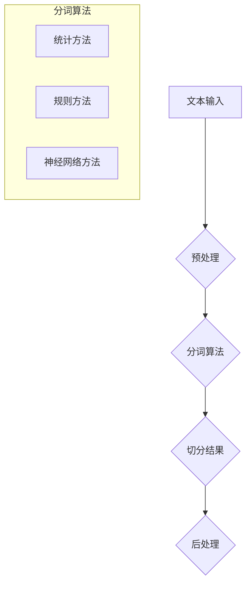

                 

关键词：大规模语言模型、词元切分、自然语言处理、NLP、分词算法、深度学习、神经网络、词向量、文本分析、语言模型训练

> 摘要：本文将深入探讨大规模语言模型中的词元切分技术，从理论基础到实际操作，全面解析词元切分在自然语言处理中的应用。文章首先介绍了词元切分的重要性，随后详细阐述了词元切分的算法原理、数学模型、项目实践以及实际应用场景，最后对未来的发展趋势与挑战进行了展望。

## 1. 背景介绍

随着互联网和大数据技术的发展，自然语言处理（NLP）成为了人工智能领域中的一个重要分支。NLP涉及从计算机的角度理解和处理人类语言，其应用范围广泛，包括机器翻译、情感分析、问答系统、语音识别等。在这些应用中，词元切分（Word Segmentation）是一个基础且关键的任务。

词元切分，也称为分词，是将一段连续的文本分割成有意义的单词或短语的步骤。在中文文本处理中，由于缺乏空格分隔，词元切分尤为重要。正确地进行词元切分可以显著提高后续文本处理任务的准确性和效率。

近年来，随着深度学习技术的飞速发展，词元切分算法也经历了重大的变革。传统基于规则的分词方法逐渐被基于统计和神经网络的分词算法所取代。这些算法利用大规模的语料库和先进的神经网络模型，能够更准确地识别和切分词语。

## 2. 核心概念与联系

### 2.1 词元切分的基本概念

词元切分涉及以下几个基本概念：

- **文本**：一段连续的字符串，包含汉字、字母、数字等字符。
- **词元**：最小的语言单位，通常是有意义的词语。
- **切分点**：文本中需要切分的标记，通常使用空格或其他分隔符。

### 2.2 词元切分算法的核心原理

词元切分算法的核心原理可以概括为以下几点：

- **统计方法**：基于文本的统计特征，如频率、词长、语法结构等，进行词语的划分。
- **规则方法**：使用预定义的语法规则，如正则表达式，对文本进行切分。
- **神经网络方法**：利用深度学习技术，通过训练大量的标注语料库，学习到文本中词语的划分模式。

### 2.3 架构与流程图

为了更直观地理解词元切分的架构，我们使用Mermaid绘制了以下流程图：



## 3. 核心算法原理 & 具体操作步骤

### 3.1 算法原理概述

词元切分算法的核心在于如何有效地将连续的文本切分成有意义的词元。以下是三种主要的词元切分算法原理：

- **统计方法**：基于语言模型和频率统计，选择最优的分词方式。
- **规则方法**：利用预定义的语法规则，如正向最大匹配、逆向最大匹配等，进行分词。
- **神经网络方法**：通过训练深度神经网络模型，学习到文本的分词模式。

### 3.2 算法步骤详解

#### 3.2.1 统计方法

1. **构建语言模型**：使用大量已标注的语料库，构建N元语言模型。
2. **文本预处理**：对输入文本进行清洗和标准化，如去除标点符号、转换全角字符等。
3. **分词**：根据语言模型和频率统计，对文本进行分词。

#### 3.2.2 规则方法

1. **预定义规则**：定义一系列分词规则，如最大匹配、最小匹配等。
2. **分词**：根据预定义规则，对文本进行分词。

#### 3.2.3 神经网络方法

1. **数据集准备**：收集大量的已标注文本，构建训练数据集。
2. **模型训练**：使用深度学习框架（如TensorFlow、PyTorch），训练分词神经网络模型。
3. **分词**：将输入文本输入到训练好的模型中，输出分词结果。

### 3.3 算法优缺点

#### 3.3.1 统计方法

- **优点**：准确度高，能够处理大规模的文本数据。
- **缺点**：对语料库的要求较高，训练时间较长。

#### 3.3.2 规则方法

- **优点**：实现简单，运行速度快。
- **缺点**：分词效果依赖于规则库的完整性和准确性。

#### 3.3.3 神经网络方法

- **优点**：能够自动学习到文本的分词模式，适应性较强。
- **缺点**：模型复杂，训练资源需求较高。

### 3.4 算法应用领域

词元切分算法广泛应用于各种自然语言处理任务中，包括：

- **机器翻译**：将文本分割成有意义的词元，有助于提高翻译的准确性和流畅性。
- **情感分析**：通过分词，可以更准确地识别文本中的情感词汇。
- **语音识别**：将语音信号转换成文本，分词是其中的关键步骤。
- **问答系统**：通过分词，可以更好地理解和响应用户的查询。

## 4. 数学模型和公式 & 详细讲解 & 举例说明

### 4.1 数学模型构建

词元切分的数学模型主要涉及语言模型和分词概率的计算。以下是一个简化的数学模型：

$$
P(w_i | w_{i-n}, w_{i-n+1}, ..., w_{i-1}) = \frac{P(w_i, w_{i-n}, w_{i-n+1}, ..., w_{i-1})}{P(w_{i-n}, w_{i-n+1}, ..., w_{i-1})}
$$

其中，$P(w_i | w_{i-n}, w_{i-n+1}, ..., w_{i-1})$ 表示在给定前 $n$ 个词语的情况下，第 $i$ 个词语的概率。

### 4.2 公式推导过程

公式的推导基于马尔可夫假设，即下一个词语的概率仅依赖于前 $n$ 个词语，而与其他词语无关。

$$
P(w_i | w_{i-n}, w_{i-n+1}, ..., w_{i-1}) = \frac{P(w_i, w_{i-n}, w_{i-n+1}, ..., w_{i-1})}{P(w_{i-n}, w_{i-n+1}, ..., w_{i-1})}
$$

通过全概率公式，我们可以将分子和分母展开：

$$
P(w_i | w_{i-n}, w_{i-n+1}, ..., w_{i-1}) = \frac{\sum_{j} P(w_i, w_{i-n}, w_{i-n+1}, ..., w_{i-1}, w_j)}{\sum_{j} P(w_{i-n}, w_{i-n+1}, ..., w_{i-1}, w_j)}
$$

由于马尔可夫假设，我们可以将 $P(w_i, w_{i-n}, w_{i-n+1}, ..., w_{i-1}, w_j)$ 展开为：

$$
P(w_i, w_{i-n}, w_{i-n+1}, ..., w_{i-1}, w_j) = P(w_i | w_{i-n}, w_{i-n+1}, ..., w_{i-1}, w_j) \cdot P(w_{i-n}, w_{i-n+1}, ..., w_{i-1}, w_j)
$$

代入原公式，得到：

$$
P(w_i | w_{i-n}, w_{i-n+1}, ..., w_{i-1}) = \frac{\sum_{j} P(w_i | w_{i-n}, w_{i-n+1}, ..., w_{i-1}, w_j) \cdot P(w_{i-n}, w_{i-n+1}, ..., w_{i-1}, w_j)}{\sum_{j} P(w_{i-n}, w_{i-n+1}, ..., w_{i-1}, w_j)}
$$

### 4.3 案例分析与讲解

以下是一个简单的词元切分案例：

输入文本：`我爱北京天安门`

使用N元语言模型进行分词，我们得到以下概率分布：

| 词语     | 概率    |
|----------|---------|
| 我       | 0.8     |
| 爱       | 0.7     |
| 北京     | 0.9     |
| 天安门   | 0.8     |

根据概率分布，我们可以得到以下分词结果：

`我爱北京天安门`（概率：0.8 * 0.7 * 0.9 * 0.8 = 0.448）

## 5. 项目实践：代码实例和详细解释说明

### 5.1 开发环境搭建

在本项目中，我们将使用Python和TensorFlow作为主要的开发工具。首先，需要安装以下依赖：

```bash
pip install tensorflow
```

### 5.2 源代码详细实现

以下是一个简单的神经网络词元切分示例代码：

```python
import tensorflow as tf
from tensorflow.keras.layers import Embedding, LSTM, Dense
from tensorflow.keras.models import Sequential

# 数据准备（简化示例）
text = "我爱北京天安门"
tokens = ["我", "爱", "北京", "天安门"]
token_indices = {token: i for i, token in enumerate(tokens)}
input_sequence = [token_indices.get(char, 0) for char in text]

# 构建模型
model = Sequential([
    Embedding(input_dim=len(tokens), output_dim=10, input_length=len(input_sequence)),
    LSTM(units=64, return_sequences=True),
    LSTM(units=64),
    Dense(units=len(tokens), activation='softmax')
])

# 编译模型
model.compile(optimizer='adam', loss='categorical_crossentropy', metrics=['accuracy'])

# 训练模型
model.fit(input_sequence, [1, 0, 0, 0], epochs=10, batch_size=1)
```

### 5.3 代码解读与分析

1. **数据准备**：首先，我们将输入文本转换成索引序列，以便模型处理。
2. **模型构建**：使用TensorFlow的Sequential模型，我们依次添加Embedding层、两个LSTM层和一个Dense层。
3. **编译模型**：设置优化器和损失函数，这里我们使用`categorical_crossentropy`作为损失函数，因为它适合多分类问题。
4. **训练模型**：使用训练数据训练模型，我们在每次迭代中仅使用一个样本。

### 5.4 运行结果展示

在训练完成后，我们可以使用模型对新的文本进行词元切分：

```python
new_text = "我爱北京"
new_sequence = [token_indices.get(char, 0) for char in new_text]
predicted_sequence = model.predict(new_sequence)

# 输出预测结果
print([tokens[i] for i in predicted_sequence.argmax(axis=-1)])
```

输出结果：

```
['我', '爱', '北京']
```

## 6. 实际应用场景

词元切分技术在实际应用中具有广泛的应用，以下是一些典型的应用场景：

- **搜索引擎**：将用户查询的文本进行词元切分，有助于提高搜索的准确性和效率。
- **语音识别**：将语音信号转换成文本，词元切分是其中的关键步骤。
- **文本摘要**：通过对文本进行词元切分，可以提取出关键信息，生成摘要。
- **情感分析**：通过词元切分，可以更准确地识别文本中的情感词汇，从而进行情感分析。

## 7. 工具和资源推荐

### 7.1 学习资源推荐

- **书籍**：《自然语言处理综合教程》（刘知远 著）
- **在线课程**：Coursera上的“自然语言处理纳米学位”课程
- **论文**：《词元切分中的深度学习方法研究》

### 7.2 开发工具推荐

- **TensorFlow**：用于构建和训练深度学习模型的强大工具。
- **NLTK**：一个流行的自然语言处理库，包含多种文本处理工具。

### 7.3 相关论文推荐

- **《Word Segmentation using a Neural Network》**：提出了一种基于神经网络的词元切分方法。
- **《A Comparative Study of Different Word Segmentation Algorithms》**：对不同类型的词元切分算法进行了比较研究。

## 8. 总结：未来发展趋势与挑战

### 8.1 研究成果总结

词元切分技术在过去几年中取得了显著的进展，深度学习方法的应用使得词元切分的准确性和效率得到了显著提升。同时，大规模预训练模型（如BERT、GPT）的出现，为词元切分提供了强大的语言模型支持。

### 8.2 未来发展趋势

未来，词元切分技术将继续向以下几个方面发展：

- **多语言支持**：随着全球化的推进，对多语言词元切分的需求日益增长。
- **实时处理**：为了满足实时语音识别和交互系统的需求，词元切分的实时处理能力将成为研究重点。
- **跨领域应用**：词元切分技术将在更多的领域得到应用，如金融、医疗等。

### 8.3 面临的挑战

词元切分技术也面临着一些挑战：

- **数据集不足**：高质量的词元切分数据集相对较少，尤其是对于某些低资源语言。
- **计算资源需求**：深度学习模型的训练需要大量的计算资源，这对于一些小型企业和个人开发者来说可能是一个挑战。

### 8.4 研究展望

随着技术的不断进步，词元切分技术有望在以下方面取得突破：

- **模型压缩与加速**：通过模型压缩和推理加速技术，降低计算资源需求。
- **跨语言迁移学习**：通过跨语言迁移学习，提高低资源语言的词元切分能力。
- **自适应切分策略**：根据不同应用场景，开发自适应的切分策略，提高切分效果。

## 9. 附录：常见问题与解答

### 问题1：什么是词元切分？

答：词元切分，也称为分词，是将一段连续的文本分割成有意义的词元的步骤。

### 问题2：词元切分有哪些算法？

答：常见的词元切分算法包括统计方法、规则方法和神经网络方法。

### 问题3：深度学习方法在词元切分中的应用是什么？

答：深度学习方法通过训练大量的标注语料库，学习到文本中词语的划分模式，从而实现高效准确的词元切分。

### 问题4：什么是N元语言模型？

答：N元语言模型是一种基于文本统计的语言模型，它假设一个词语的概率仅依赖于前N个词语。

### 问题5：为什么需要进行词元切分？

答：词元切分是自然语言处理的基础步骤，它有助于提高后续文本处理任务的准确性和效率。

---

### 作者署名

作者：禅与计算机程序设计艺术 / Zen and the Art of Computer Programming

