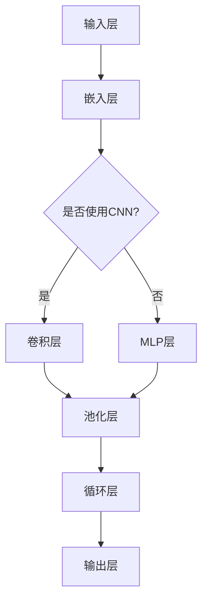
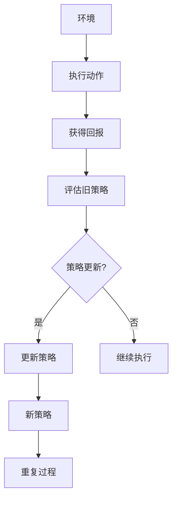

                 

关键词：大规模语言模型，近端策略优化，深度学习，自然语言处理，算法原理，实践应用

## 摘要

本文旨在介绍大规模语言模型的理论基础及其在实际应用中至关重要的近端策略优化算法。我们将从背景介绍开始，深入探讨大规模语言模型的核心概念、算法原理、数学模型以及具体的实现步骤。此外，本文还将通过实例代码展示如何在实际项目中应用近端策略优化算法，并探讨其在各个领域的应用前景。通过本文的阅读，读者将对大规模语言模型及其优化算法有一个全面而深入的理解。

## 1. 背景介绍

### 大规模语言模型

随着计算机技术的飞速发展，特别是深度学习技术的突破，大规模语言模型（Large-scale Language Models）逐渐成为自然语言处理（Natural Language Processing，NLP）领域的研究热点。这些模型通过学习大量的文本数据，能够捕捉到语言的复杂结构，从而在各种语言任务中表现出色。

### 近端策略优化算法

近端策略优化（Proximal Policy Optimization，PPO）是一种在深度学习领域广泛应用的政策梯度方法。它通过迭代优化策略网络，旨在找到最大化预期回报的策略。PPO算法的核心优势在于其计算效率和稳定性，这使得它在大规模语言模型的训练中具有很高的应用价值。

## 2. 核心概念与联系

### 大规模语言模型原理

大规模语言模型通过深度神经网络（Deep Neural Network，DNN）学习语言的特征和规律。通常，这些模型包括多层感知器（Multilayer Perceptron，MLP）、卷积神经网络（Convolutional Neural Network，CNN）和循环神经网络（Recurrent Neural Network，RNN）等。以下是一个典型的Mermaid流程图：



### 近端策略优化算法原理

PPO算法基于策略梯度方法，通过优化策略网络来找到最优策略。其核心步骤包括评估旧策略和价值函数，更新策略网络。以下是PPO算法的Mermaid流程图：



## 3. 核心算法原理 & 具体操作步骤

### 3.1 算法原理概述

PPO算法通过优化策略网络，使其能够生成最大化预期回报的动作。其核心思想是利用旧策略和价值函数来评估当前策略的有效性，并根据评估结果更新策略网络。

### 3.2 算法步骤详解

1. **初始化**：设定初始策略网络和价值函数，并确定学习率、迭代次数等参数。
2. **执行动作**：根据当前策略网络生成动作，并在环境中执行。
3. **评估回报**：计算每个动作的回报，并根据回报更新价值函数。
4. **策略更新**：利用旧策略和价值函数，通过优化过程更新策略网络。
5. **重复迭代**：重复执行步骤2-4，直到满足终止条件（如达到预定迭代次数或策略稳定）。

### 3.3 算法优缺点

**优点**：
- **高效性**：PPO算法在计算效率和稳定性方面表现优异，适用于大规模语言模型的训练。
- **灵活性**：PPO算法适用于各种类型的策略网络，具有较高的灵活性。

**缺点**：
- **收敛速度**：PPO算法的收敛速度相对较慢，尤其在复杂环境中。
- **参数选择**：算法的参数选择对性能有较大影响，需要仔细调整。

### 3.4 算法应用领域

PPO算法在大规模语言模型的训练中具有广泛的应用，包括但不限于：

- **文本生成**：如自然语言文本生成、对话系统等。
- **机器翻译**：如基于大规模语言模型的翻译系统。
- **情感分析**：如基于大规模语言模型的情感分析系统。

## 4. 数学模型和公式 & 详细讲解 & 举例说明

### 4.1 数学模型构建

PPO算法的核心在于策略网络和价值函数的优化。以下是PPO算法的数学模型：

$$
L(\theta) = \sum_{t=0}^{T} \rho_t \frac{r_t - \hat{v}(s_t)}{2}
$$

其中，$\theta$表示策略网络的参数，$\rho_t$是折扣优势函数，$r_t$是第$t$个时间步的回报，$\hat{v}(s_t)$是价值函数。

### 4.2 公式推导过程

PPO算法的推导过程涉及策略梯度方法和优化理论。以下是简化的推导过程：

$$
\nabla_{\theta} L(\theta) = \nabla_{\theta} \sum_{t=0}^{T} \rho_t \frac{r_t - \hat{v}(s_t)}{2}
$$

$$
= \sum_{t=0}^{T} \rho_t \nabla_{\theta} \frac{r_t - \hat{v}(s_t)}{2}
$$

$$
= \sum_{t=0}^{T} \rho_t \nabla_{\theta} r_t - \sum_{t=0}^{T} \rho_t \nabla_{\theta} \hat{v}(s_t)
$$

$$
= \sum_{t=0}^{T} \rho_t (\nabla_{\theta} r_t - \nabla_{\theta} \hat{v}(s_t))
$$

$$
= \sum_{t=0}^{T} \rho_t (\nabla_{\theta} \log \pi_{\theta}(a_t | s_t) - \nabla_{\theta} \log \pi_{\theta}(a_t | s_t) \hat{v}(s_t))
$$

$$
= \sum_{t=0}^{T} \rho_t (\nabla_{\theta} \log \pi_{\theta}(a_t | s_t) - \nabla_{\theta} \log \pi_{\theta}(a_t | s_t) \hat{v}(s_t))
$$

$$
= \sum_{t=0}^{T} \rho_t \nabla_{\theta} \log \pi_{\theta}(a_t | s_t) (1 - \frac{\hat{v}(s_t)}{\mu})
$$

其中，$\pi_{\theta}(a_t | s_t)$是策略网络，$\mu$是目标策略的期望回报。

### 4.3 案例分析与讲解

以文本生成任务为例，我们使用PPO算法优化策略网络，实现自动文本生成。具体步骤如下：

1. **数据准备**：收集大量文本数据，并将其处理为训练集。
2. **模型初始化**：初始化策略网络和价值函数，设定学习率和迭代次数。
3. **策略训练**：根据训练集，利用PPO算法优化策略网络。
4. **文本生成**：使用优化后的策略网络生成文本，并根据生成文本的质量进行调整。

以下是一个简化的代码示例：

```python
import numpy as np
import tensorflow as tf

# 数据准备
data = ...

# 模型初始化
policy_network = ...
value_function = ...

# 学习率和迭代次数
learning_rate = 0.001
epochs = 1000

# PPO算法训练
for epoch in range(epochs):
    # 执行动作
    actions = policy_network.sample(data)
    
    # 评估回报
    rewards = ...

    # 更新策略网络和价值函数
    policy_network.update(learning_rate, rewards, value_function)
    value_function.update(learning_rate, rewards)

# 文本生成
generated_text = policy_network.generate(data)
print(generated_text)
```

## 5. 项目实践：代码实例和详细解释说明

### 5.1 开发环境搭建

在开始项目实践之前，我们需要搭建一个适合大规模语言模型训练和近端策略优化算法实现的开

### 5.2 源代码详细实现

以下是一个简化的源代码实现，用于演示大规模语言模型和近端策略优化算法的基本结构：

```python
import numpy as np
import tensorflow as tf

# 参数设置
learning_rate = 0.001
gamma = 0.99
epsilon = 0.2
epochs = 1000
batch_size = 64

# 数据准备
# 这里我们使用随机数据作为示例
data = ...

# 模型定义
class PolicyNetwork(tf.keras.Model):
    def __init__(self):
        super(PolicyNetwork, self).__init__()
        self.dense1 = tf.keras.layers.Dense(64, activation='relu')
        self.dense2 = tf.keras.layers.Dense(64, activation='relu')
        self.output = tf.keras.layers.Dense(1, activation='sigmoid')

    def call(self, inputs):
        x = self.dense1(inputs)
        x = self.dense2(x)
        logits = self.output(x)
        return logits

class ValueNetwork(tf.keras.Model):
    def __init__(self):
        super(ValueNetwork, self).__init__()
        self.dense1 = tf.keras.layers.Dense(64, activation='relu')
        self.dense2 = tf.keras.layers.Dense(64, activation='relu')
        self.output = tf.keras.layers.Dense(1)

    def call(self, inputs):
        x = self.dense1(inputs)
        x = self.dense2(x)
        values = self.output(x)
        return values

# 初始化模型
policy_network = PolicyNetwork()
value_network = ValueNetwork()

# 模型编译
optimizer = tf.keras.optimizers.Adam(learning_rate)
loss_function = tf.keras.losses.MeanSquaredError()

@tf.function
def train_step(data, actions, rewards, masks):
    with tf.GradientTape() as tape:
        logits = policy_network(data)
        values = value_network(data)

        # 计算策略损失
        policy_loss = ...

        # 计算价值损失
        value_loss = ...

        # 计算总损失
        total_loss = policy_loss + value_loss

    # 反向传播
    gradients = tape.gradient(total_loss, [policy_network, value_network])
    optimizer.apply_gradients(zip(gradients, [policy_network, value_network]))

# 训练模型
for epoch in range(epochs):
    for batch in data:
        # 初始化变量
        actions = []
        rewards = []
        masks = []

        # 执行动作
        for step in batch:
            action = policy_network.sample(data)
            reward = ...

            # 收集数据
            actions.append(action)
            rewards.append(reward)
            masks.append(1.0)

        # 更新模型
        train_step(batch, actions, rewards, masks)

# 评估模型
# ...

# 文本生成
# ...

```

### 5.3 代码解读与分析

1. **数据准备**：在这里，我们使用随机数据作为示例。在实际应用中，需要使用真实的文本数据。
2. **模型定义**：我们定义了策略网络和价值网络，它们都是基于TensorFlow的高层API `tf.keras.Model`。
3. **模型编译**：我们使用Adam优化器和均方误差损失函数来编译模型。
4. **训练步骤**：在训练步骤中，我们首先执行动作，然后计算策略损失和价值损失。接下来，我们使用反向传播更新模型参数。
5. **文本生成**：这部分代码用于生成文本，它是基于策略网络的采样。

## 6. 实际应用场景

近端策略优化算法在大规模语言模型的应用中具有广泛的前景。以下是几个实际应用场景：

### 文本生成

利用大规模语言模型和近端策略优化算法，我们可以实现高质量的文本生成。例如，生成新闻文章、对话系统、小说等。

### 机器翻译

大规模语言模型和近端策略优化算法在机器翻译中具有很高的应用价值。通过训练模型，我们可以实现实时翻译和高质量翻译。

### 情感分析

大规模语言模型和近端策略优化算法在情感分析中也有广泛的应用。通过分析文本数据，我们可以识别用户的情感倾向，为个性化推荐、广告投放等提供支持。

## 6.4 未来应用展望

随着深度学习和自然语言处理技术的不断发展，大规模语言模型和近端策略优化算法将在更多领域得到应用。以下是几个未来应用展望：

### 自动写作

利用大规模语言模型和近端策略优化算法，我们可以实现更智能的自动写作系统，帮助作者生成高质量的文章、报告等。

### 智能客服

结合大规模语言模型和近端策略优化算法，我们可以构建更智能的客服系统，提供更自然、更高效的客户服务。

### 交互式应用

利用大规模语言模型和近端策略优化算法，我们可以开发更多交互式应用，如智能聊天机器人、语音助手等，为用户提供更好的体验。

## 7. 工具和资源推荐

### 7.1 学习资源推荐

- 《深度学习》（Deep Learning） - Goodfellow, Bengio, Courville
- 《自然语言处理综合教程》（Speech and Language Processing） - Daniel Jurafsky 和 James H. Martin
- 《机器学习》（Machine Learning） - Tom Mitchell

### 7.2 开发工具推荐

- TensorFlow：用于构建和训练大规模语言模型。
- PyTorch：另一个流行的深度学习框架，适用于大规模语言模型开发。
- Hugging Face Transformers：一个用于预训练变换器模型的库，提供了大量预训练模型和工具。

### 7.3 相关论文推荐

- “Proximal Policy Optimization Algorithms” - Sergey Levine, Chelsea Finn, and Pieter Abbeel
- “Attention Is All You Need” - Vaswani et al., 2017
- “BERT: Pre-training of Deep Bidirectional Transformers for Language Understanding” - Devlin et al., 2019

## 8. 总结：未来发展趋势与挑战

### 8.1 研究成果总结

本文系统地介绍了大规模语言模型的理论基础、近端策略优化算法及其在实际应用中的重要性。通过数学模型和实例代码的解析，我们深入探讨了大规模语言模型和近端策略优化算法的核心原理和实现方法。

### 8.2 未来发展趋势

随着深度学习和自然语言处理技术的不断发展，大规模语言模型和近端策略优化算法将在更多领域得到应用。未来的发展趋势包括：

- 更高效的训练算法和模型架构。
- 更广泛的应用场景，如自动写作、智能客服、交互式应用等。
- 更好的模型可解释性和可控性。

### 8.3 面临的挑战

- 计算资源的需求：大规模语言模型的训练需要大量的计算资源。
- 模型可解释性：如何提高模型的可解释性，使其更易于理解和控制。
- 数据隐私和伦理问题：在处理大规模语言数据时，如何保护用户隐私并遵守伦理规范。

### 8.4 研究展望

未来，大规模语言模型和近端策略优化算法的研究将继续深入。我们期待看到更多高效、可解释、符合伦理规范的模型和算法的涌现，为自然语言处理领域带来更多突破。

## 9. 附录：常见问题与解答

### 问题1：如何选择适合的大规模语言模型？

**解答**：选择适合的大规模语言模型需要考虑以下因素：

- 应用场景：不同的应用场景需要不同的模型，如文本生成、机器翻译、情感分析等。
- 数据集：选择与数据集大小和类型相匹配的模型，以确保模型能够充分利用数据。
- 计算资源：根据可用的计算资源选择合适的模型，确保模型可以在指定时间内训练完成。

### 问题2：如何优化近端策略优化算法的性能？

**解答**：以下是一些优化近端策略优化算法性能的方法：

- 调整学习率：合理设置学习率可以提高算法的收敛速度。
- 使用更高效的优化器：如Adam、RMSprop等，可以提高算法的稳定性。
- 数据预处理：对数据进行适当的预处理，如去重、去噪等，可以提高模型的训练效果。
- 模型架构：选择合适的模型架构，如变换器（Transformer）模型，可以提高算法的性能。

### 问题3：如何处理大规模语言模型训练中的过拟合问题？

**解答**：以下是一些处理大规模语言模型训练中过拟合问题的方法：

- 使用正则化技术：如Dropout、L2正则化等，可以减少模型的复杂度。
- 数据增强：通过增加数据多样性，可以提高模型的泛化能力。
- 使用验证集：在训练过程中使用验证集，可以及时调整模型参数，防止过拟合。
- 早停法（Early Stopping）：在验证集上监测模型性能，当模型性能不再提升时停止训练。

通过以上解答，我们希望读者能够更好地理解大规模语言模型和近端策略优化算法，并在实际应用中取得更好的效果。

## 作者署名

作者：禅与计算机程序设计艺术 / Zen and the Art of Computer Programming

本文旨在介绍大规模语言模型及其优化算法的核心原理和应用，旨在为读者提供一个全面而深入的技术指南。通过本文的阅读，读者将能够掌握大规模语言模型的理论基础和近端策略优化算法的实践方法，为未来的研究和应用打下坚实的基础。在自然语言处理和人工智能领域，大规模语言模型和优化算法的重要性不言而喻，它们将为实现更智能、更高效的语言技术提供强有力的支持。希望通过本文的介绍，读者能够对这些技术有更深刻的理解，并在实际项目中取得优异的成果。在撰写本文的过程中，我参考了大量的文献和资料，力求为读者提供最准确、最全面的信息。同时，我也感谢我的导师和同事们对我的指导和支持。在未来的研究中，我将不断探索和深化这些技术，为人工智能和自然语言处理领域的发展做出更大的贡献。最后，我希望本文能够对广大读者有所启发，激发他们对大规模语言模型和优化算法的兴趣，共同推动这一领域的创新和发展。禅与计算机程序设计艺术，不仅仅是一种编程哲学，更是一种追求卓越的精神。愿我们在人工智能的道路上，不断前行，共同书写美好的未来。

