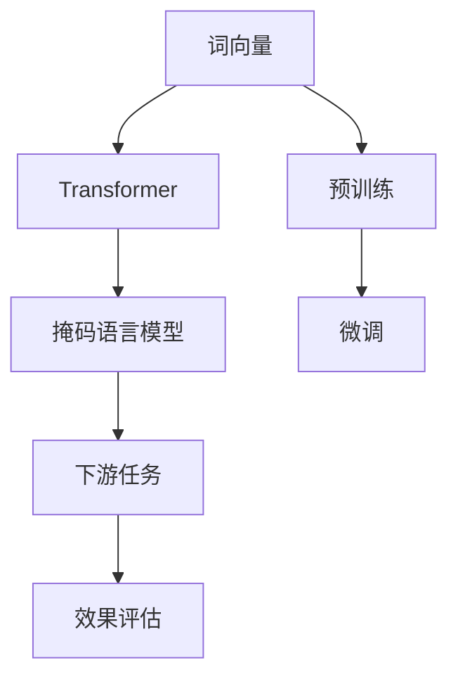
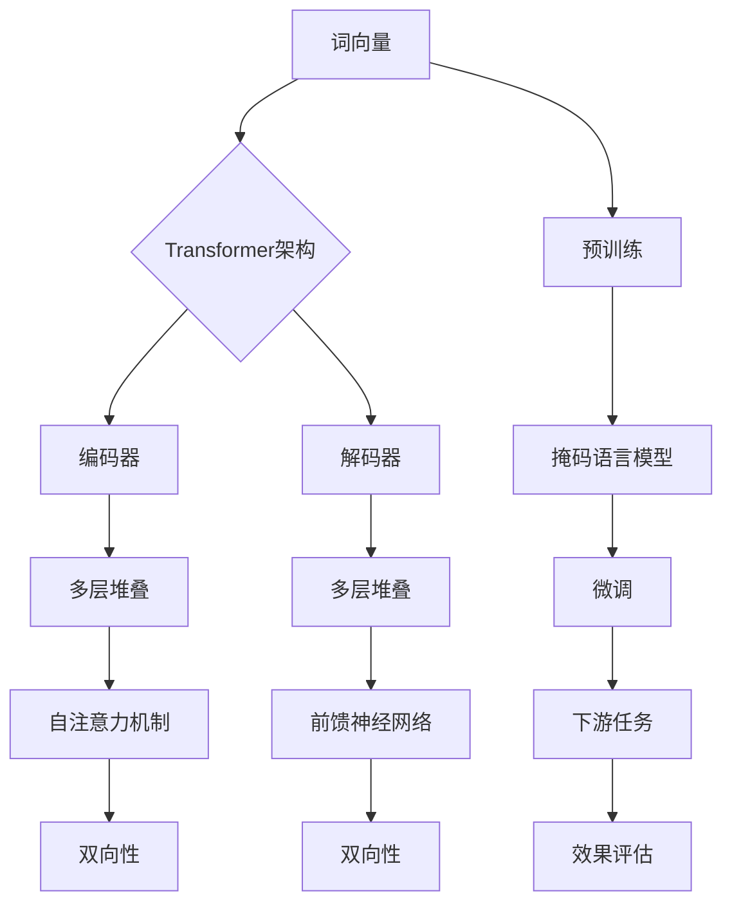

                 

关键词：大规模语言模型，GPT，BERT，后继模型，自然语言处理，机器学习，人工智能。

## 摘要

本文旨在深入探讨大规模语言模型的发展历程，从最早的GPT模型到BERT模型及其后续的改进和发展。通过阐述这些模型的原理、算法和具体实现，本文将为读者提供对大规模语言模型领域的前沿认识和深入理解。此外，本文还将探讨这些模型在实际应用中的影响和未来发展的趋势。

## 1. 背景介绍

自然语言处理（Natural Language Processing，NLP）作为人工智能（Artificial Intelligence，AI）的重要组成部分，旨在让计算机理解和生成人类语言。随着深度学习（Deep Learning）技术的兴起，大规模语言模型在NLP领域取得了显著的成果。这些模型通过学习大量的文本数据，能够捕捉语言中的复杂模式和语义信息，从而在文本分类、机器翻译、问答系统等任务中表现出色。

GPT（Generative Pre-trained Transformer）和BERT（Bidirectional Encoder Representations from Transformers）是大规模语言模型的两个重要里程碑。GPT是由OpenAI于2018年提出的一种基于Transformer架构的预训练模型，它通过无监督的方式在大量文本数据上进行预训练，然后通过微调适应具体的任务。BERT则是由Google在2018年提出的一种双向Transformer模型，它通过同时考虑上下文信息来提高模型的表示能力。

本文将首先介绍GPT和BERT的原理和架构，然后讨论它们在NLP中的应用和效果。接下来，我们将探讨后续模型的改进和发展，包括RoBERTa、ALBERT和T5等。最后，本文将总结这些模型的主要成果和未来发展的挑战。

### 1.1 GPT的提出背景

GPT的提出背景可以追溯到深度学习在NLP领域的兴起。随着数据集的增大和计算资源的提升，研究人员开始意识到仅依赖有监督学习的方法难以充分挖掘语言数据中的潜在模式。因此，无监督的预训练和有监督的微调相结合的方法应运而生。GPT正是在这种背景下诞生的。

GPT的预训练过程基于Transformer架构，这是一种在机器翻译任务中取得显著成功的模型。Transformer通过自注意力机制（Self-Attention Mechanism）捕捉长距离依赖关系，从而在处理序列数据时表现出色。GPT利用这种机制，在大量文本数据上进行预训练，从而生成对语言进行建模的高质量表示。

GPT的提出标志着NLP领域从传统方法向深度学习方法的转变。它不仅提高了模型的表示能力，还降低了有监督数据的需求。这使得GPT在众多NLP任务中取得了优异的性能，成为NLP领域的里程碑。

### 1.2 BERT的提出背景

BERT的提出背景与GPT类似，同样是出于对深度学习在NLP领域中应用的探索。然而，BERT在模型架构和训练目标上与GPT有所不同。

BERT采用双向Transformer架构，同时考虑上下文信息。这意味着BERT不仅能够捕捉到当前词与前面词的关系，还能捕捉到当前词与后面词的关系。这种双向性使得BERT在捕捉长距离依赖关系时更为有效。

BERT的训练目标是在大规模语料库上进行掩码语言模型（Masked Language Model，MLM）预训练。在预训练过程中，BERT随机掩码输入文本中的部分词，然后通过预测这些掩码词来训练模型。这种训练目标使得BERT能够学习到语言的丰富信息，从而在下游任务中表现出色。

BERT的提出进一步推动了深度学习在NLP领域的发展。它不仅在各种NLP任务中取得了优异的成绩，还为后续模型的研究提供了新的思路。BERT的成功使得双向Transformer架构成为NLP领域的标准配置。

## 2. 核心概念与联系

为了更好地理解大规模语言模型的发展历程，我们需要先介绍一些核心概念和架构。以下是大规模语言模型中的一些关键概念：

- **词向量（Word Vectors）**：词向量是将单词转换为向量的方法，用于表示单词的语义信息。常见的词向量模型包括Word2Vec、GloVe等。
- **Transformer架构**：Transformer是一种基于自注意力机制的深度学习模型，用于处理序列数据。自注意力机制使得模型能够同时关注输入序列中的所有词，从而捕捉长距离依赖关系。
- **掩码语言模型（MLM）**：掩码语言模型是一种在预训练过程中，随机掩码输入文本中的部分词，然后通过预测这些掩码词来训练模型的方法。

下面是一个简单的Mermaid流程图，用于描述这些概念之间的联系：



### 2.1 词向量

词向量是将单词转换为向量的方法，用于表示单词的语义信息。词向量的学习可以通过有监督学习、无监督学习和半监督学习等方法实现。常见的词向量模型包括Word2Vec、GloVe等。

Word2Vec是一种基于神经网络的词向量模型，它通过预测词的上下文来学习词向量。具体来说，Word2Vec采用两个层次的神经网络：输入层和输出层。输入层将单词转换为向量，输出层将上下文词转换为向量。通过最小化预测误差，Word2Vec可以学习到高质量的词向量。

GloVe（Global Vectors for Word Representation）是一种基于全局上下文的词向量模型。GloVe通过计算单词共现矩阵，然后使用矩阵分解的方法来学习词向量。GloVe的优点是能够同时考虑单词的局部和全局上下文，从而学习到更丰富的语义信息。

### 2.2 Transformer架构

Transformer是一种基于自注意力机制的深度学习模型，用于处理序列数据。自注意力机制使得模型能够同时关注输入序列中的所有词，从而捕捉长距离依赖关系。

Transformer由编码器（Encoder）和解码器（Decoder）两部分组成。编码器负责将输入序列转换为上下文表示，解码器负责根据上下文表示生成输出序列。编码器和解码器都采用多层Transformer块堆叠而成，每个Transformer块包含多头自注意力机制和前馈神经网络。

自注意力机制的工作原理是将每个词与序列中的所有词进行计算，得到一个加权表示。这个加权表示不仅考虑了当前词与前面词的关系，还考虑了当前词与后面词的关系。这种机制使得Transformer在处理长序列数据时表现出色。

### 2.3 掩码语言模型

掩码语言模型（Masked Language Model，MLM）是一种在预训练过程中，随机掩码输入文本中的部分词，然后通过预测这些掩码词来训练模型的方法。MLM的目的是使模型能够捕捉到语言的丰富信息，从而在下游任务中表现出色。

在MLM中，输入文本中的每个词都有一定概率被掩码。掩码词可以是随机选择的部分词，也可以是特定的标记（如`<MASK>`）。模型的目标是预测这些掩码词，从而学习到语言中的潜在模式。

掩码语言模型的关键优势是它能够同时考虑上下文信息。在预测掩码词时，模型不仅需要考虑当前词与前面词的关系，还需要考虑当前词与后面词的关系。这种双向性使得MLM在捕捉长距离依赖关系时更为有效。

### 2.4 大规模语言模型的联系

通过上述介绍，我们可以看到大规模语言模型中的核心概念和架构之间存在紧密的联系。词向量作为基础，为Transformer提供了输入序列的表示。Transformer通过自注意力机制捕捉长距离依赖关系，从而实现了高质量的表示。掩码语言模型则利用Transformer的双向性，同时考虑上下文信息，从而在预训练过程中学习到丰富的语言知识。

这种联系使得大规模语言模型在NLP任务中表现出色。通过预训练和微调，模型能够快速适应各种下游任务，从而在文本分类、机器翻译、问答系统等领域取得了优异的性能。

### 2.5 Mermaid流程图

以下是大规模语言模型中核心概念和架构的Mermaid流程图：



这个流程图清晰地展示了词向量、Transformer架构、掩码语言模型和下游任务之间的联系。通过预训练和微调，大规模语言模型能够学习到丰富的语言知识，从而在各种NLP任务中取得优异的性能。

### 2.6 大规模语言模型的优势和挑战

大规模语言模型在NLP领域中表现出色，具有许多优势。首先，它们通过预训练和微调的方法，能够在大量文本数据中学习到丰富的语言知识，从而提高模型的表示能力。其次，大规模语言模型采用自注意力机制和双向Transformer架构，能够捕捉长距离依赖关系，从而在文本分类、机器翻译、问答系统等任务中表现出色。此外，大规模语言模型可以快速适应各种下游任务，从而降低有监督数据的依赖性。

然而，大规模语言模型也面临一些挑战。首先，模型的预训练过程需要大量的计算资源和时间，这使得模型的训练成本较高。其次，大规模语言模型在处理长文本数据时，可能会出现长距离依赖关系的丢失，从而影响模型的性能。此外，大规模语言模型在处理特定领域或特定语言的数据时，可能需要额外的调整和优化，以适应不同的应用场景。

总的来说，大规模语言模型在NLP领域中具有巨大的潜力，但也需要解决一些挑战。通过不断的研究和优化，我们有理由相信，大规模语言模型将在未来的NLP任务中发挥更加重要的作用。

### 2.7 总结

在本章节中，我们介绍了大规模语言模型中的核心概念和架构，包括词向量、Transformer架构和掩码语言模型。通过Mermaid流程图，我们展示了这些概念和架构之间的联系，并探讨了它们在NLP任务中的应用。同时，我们分析了大规模语言模型的优势和挑战。这些概念和架构为后续章节中详细讨论GPT、BERT等模型提供了基础。

## 3. 核心算法原理 & 具体操作步骤

### 3.1 算法原理概述

在深入探讨大规模语言模型的核心算法原理之前，我们需要了解一些基本概念。大规模语言模型通常采用Transformer架构，这是一种基于自注意力机制的深度学习模型。自注意力机制是一种能够同时关注输入序列中所有词的方法，从而捕捉长距离依赖关系。

Transformer架构的核心是多头自注意力机制（Multi-Head Self-Attention）。多头自注意力机制将输入序列分成多个头，每个头独立计算自注意力。这样，模型可以从不同角度关注输入序列，从而提高表示能力。具体来说，多头自注意力机制包括以下步骤：

1. **输入层**：将输入序列转换为向量表示。通常使用词向量或嵌入层（Embedding Layer）来完成这一步骤。
2. **多头自注意力**：计算输入序列中每个词与其他词的相似度，并通过加权求和得到每个词的注意力得分。这个过程可以表示为：

$$
\text{Attention}(Q, K, V) = \text{softmax}\left(\frac{QK^T}{\sqrt{d_k}}\right) V
$$

其中，$Q$、$K$和$V$分别表示查询向量、键向量和值向量，$d_k$表示键向量的维度。注意力得分表示输入序列中每个词对当前词的重要程度。
3. **前馈神经网络**：在自注意力之后，通过一个前馈神经网络（Feedforward Neural Network）对每个头进行进一步处理。前馈神经网络通常由两个全连接层组成，分别具有ReLU激活函数和线性激活函数。

此外，Transformer架构还包括了一些重要的技巧，如残差连接（Residual Connection）和层归一化（Layer Normalization）。残差连接能够缓解深层网络中的梯度消失问题，而层归一化则有助于稳定训练过程。

### 3.2 算法步骤详解

大规模语言模型的训练过程可以分为两个阶段：预训练（Pre-training）和微调（Fine-tuning）。

#### 3.2.1 预训练

预训练是大规模语言模型的基础，其核心目标是学习到一个强大的语言表示。预训练过程通常包括以下几个步骤：

1. **数据预处理**：将原始文本数据转换为序列形式。这一步骤包括分词、词性标注、字符编码等操作。
2. **掩码语言模型（MLM）**：随机掩码输入文本中的部分词，然后通过预测这些掩码词来训练模型。MLM的目标是使模型能够学习到语言的丰富信息，从而在下游任务中表现出色。
3. **训练循环**：在预训练过程中，模型通过多个训练循环（Epoch）来不断优化参数。每个训练循环包括以下几个步骤：

   a. **正向传播**：将输入序列传递到模型中，得到预测结果。
   
   b. **计算损失**：计算预测结果与实际掩码词之间的损失。常用的损失函数包括交叉熵损失（Cross-Entropy Loss）和掩码语言模型损失（Masked Language Model Loss）。
   
   c. **反向传播**：使用梯度下降（Gradient Descent）或其他优化算法来更新模型参数。
4. **验证和调整**：在预训练过程中，定期使用验证集来评估模型的性能，并根据性能调整模型参数。

#### 3.2.2 微调

微调是将预训练模型应用于具体任务的过程。微调的目标是使模型在特定任务上达到最佳性能。微调过程通常包括以下几个步骤：

1. **数据预处理**：与预训练过程相同，将原始文本数据转换为序列形式。
2. **数据加载**：将预处理后的数据加载到模型中，并进行批量处理（Batch Processing）。
3. **训练循环**：在微调过程中，模型通过多个训练循环来优化参数。每个训练循环包括以下几个步骤：

   a. **正向传播**：将输入序列传递到模型中，得到预测结果。
   
   b. **计算损失**：计算预测结果与实际标签之间的损失。常用的损失函数包括交叉熵损失（Cross-Entropy Loss）和分类损失（Classification Loss）。
   
   c. **反向传播**：使用梯度下降（Gradient Descent）或其他优化算法来更新模型参数。
4. **验证和调整**：在微调过程中，定期使用验证集来评估模型的性能，并根据性能调整模型参数。
5. **测试**：在模型训练完成后，使用测试集来评估模型的最终性能。

### 3.3 算法优缺点

大规模语言模型在NLP领域取得了显著的成果，具有许多优点。首先，它们通过预训练和微调的方法，能够在大量文本数据中学习到丰富的语言知识，从而提高模型的表示能力。其次，大规模语言模型采用自注意力机制和双向Transformer架构，能够捕捉长距离依赖关系，从而在文本分类、机器翻译、问答系统等任务中表现出色。此外，大规模语言模型可以快速适应各种下游任务，从而降低有监督数据的依赖性。

然而，大规模语言模型也面临一些挑战。首先，模型的预训练过程需要大量的计算资源和时间，这使得模型的训练成本较高。其次，大规模语言模型在处理长文本数据时，可能会出现长距离依赖关系的丢失，从而影响模型的性能。此外，大规模语言模型在处理特定领域或特定语言的数据时，可能需要额外的调整和优化，以适应不同的应用场景。

总的来说，大规模语言模型在NLP领域中具有巨大的潜力，但也需要解决一些挑战。通过不断的研究和优化，我们有理由相信，大规模语言模型将在未来的NLP任务中发挥更加重要的作用。

### 3.4 算法应用领域

大规模语言模型在NLP领域具有广泛的应用，涵盖了文本分类、机器翻译、问答系统等多个任务。以下是大规模语言模型在这些应用领域中的具体应用：

#### 3.4.1 文本分类

文本分类是NLP中的一个基本任务，旨在将文本数据分为多个预定义的类别。大规模语言模型通过预训练和微调，能够有效捕捉文本中的语义信息，从而在文本分类任务中表现出色。具体来说，大规模语言模型可以用于以下场景：

1. **情感分析**：通过预测文本的情感极性（正面、负面、中性），分析用户评论、社交媒体帖子等。
2. **新闻分类**：将新闻文章分类到不同的主题类别，如体育、娱乐、政治等。
3. **垃圾邮件检测**：通过分类电子邮件内容，识别并过滤垃圾邮件。

#### 3.4.2 机器翻译

机器翻译是NLP领域的一个重要应用，旨在将一种语言的文本自动翻译成另一种语言。大规模语言模型通过预训练和微调，能够学习到源语言和目标语言之间的语义关系，从而在机器翻译任务中取得显著成果。具体来说，大规模语言模型可以用于以下场景：

1. **跨语言文本生成**：将一种语言的文本翻译成另一种语言，如将英语翻译成法语。
2. **多语言翻译**：同时将一种语言的文本翻译成多种语言，如将英语翻译成法语、西班牙语、中文等。
3. **机器翻译评估**：通过评估模型翻译的质量，改进和优化机器翻译系统。

#### 3.4.3 问答系统

问答系统是NLP领域的一个重要应用，旨在回答用户提出的问题。大规模语言模型通过预训练和微调，能够捕捉到问题的语义信息，从而在问答系统任务中表现出色。具体来说，大规模语言模型可以用于以下场景：

1. **信息检索**：通过搜索大规模文本数据库，回答用户提出的问题。
2. **对话系统**：与用户进行自然语言交互，回答用户提出的问题。
3. **问答机器人**：构建问答机器人，用于提供实时咨询服务。

总的来说，大规模语言模型在NLP领域的应用非常广泛，涵盖了文本分类、机器翻译、问答系统等多个任务。通过不断的研究和优化，我们有理由相信，大规模语言模型将在未来的NLP任务中发挥更加重要的作用。

## 4. 数学模型和公式 & 详细讲解 & 举例说明

### 4.1 数学模型构建

大规模语言模型的数学模型主要包括词向量、自注意力机制和损失函数等组成部分。以下将分别介绍这些数学模型的构建过程。

#### 4.1.1 词向量

词向量是将单词映射为高维向量的方法，用于表示单词的语义信息。常见的词向量模型包括Word2Vec和GloVe等。

- **Word2Vec**：Word2Vec模型采用神经网络来学习词向量。具体来说，Word2Vec模型包括两个层次：输入层和输出层。输入层将单词转换为向量表示，输出层将上下文词转换为向量表示。通过最小化预测误差，Word2Vec可以学习到高质量的词向量。

$$
\text{Loss} = \sum_{i=1}^{N} -\log(p(y_i | \text{Context}) )
$$

其中，$N$表示上下文词的数量，$y_i$表示第$i$个上下文词，$p(y_i | \text{Context})$表示在给定上下文下预测$y_i$的概率。

- **GloVe**：GloVe模型通过计算单词共现矩阵，然后使用矩阵分解的方法来学习词向量。具体来说，GloVe模型首先计算单词共现矩阵$C$，然后通过矩阵分解$C = \text{UU}^T$来学习词向量$U$和$V$。

$$
C_{ij} = \frac{f(t_i, t_j)}{\sqrt{f(t_i) f(t_j)}}
$$

其中，$t_i$和$t_j$表示单词$i$和$j$，$f(t_i, t_j)$表示单词$i$和$j$在文本中共同出现的频率。

#### 4.1.2 自注意力机制

自注意力机制是大规模语言模型的核心组件之一，用于计算输入序列中每个词与其他词的相似度。自注意力机制可以表示为：

$$
\text{Attention}(Q, K, V) = \text{softmax}\left(\frac{QK^T}{\sqrt{d_k}}\right) V
$$

其中，$Q$、$K$和$V$分别表示查询向量、键向量和值向量，$d_k$表示键向量的维度。注意力得分表示输入序列中每个词对当前词的重要程度。

#### 4.1.3 损失函数

大规模语言模型的损失函数通常用于衡量模型预测结果与实际结果之间的差距。常见的损失函数包括交叉熵损失和掩码语言模型损失。

- **交叉熵损失**：交叉熵损失用于多分类问题，表示预测结果与实际结果之间的差异。交叉熵损失可以表示为：

$$
\text{Loss} = -\sum_{i=1}^{N} y_i \log(p(x_i | \text{Context}) )
$$

其中，$N$表示上下文词的数量，$y_i$表示第$i$个上下文词，$p(x_i | \text{Context})$表示在给定上下文下预测$x_i$的概率。

- **掩码语言模型损失**：掩码语言模型损失用于衡量模型预测掩码词的能力。具体来说，掩码语言模型损失可以表示为：

$$
\text{Loss} = -\sum_{i=1}^{N} y_i \log(p(\hat{y}_i | \text{Context}) )
$$

其中，$N$表示掩码词的数量，$y_i$表示第$i$个掩码词，$\hat{y}_i$表示模型预测的掩码词。

### 4.2 公式推导过程

在本节中，我们将详细推导自注意力机制和掩码语言模型损失函数的推导过程。

#### 4.2.1 自注意力机制推导

自注意力机制的推导基于以下假设：

1. 输入序列表示为$X = [x_1, x_2, ..., x_n]$，其中$x_i$表示第$i$个词的向量表示。
2. 查询向量$Q$、键向量$K$和值向量$V$分别表示为$Q = [q_1, q_2, ..., q_n]$、$K = [k_1, k_2, ..., k_n]$和$V = [v_1, v_2, ..., v_n]$。

自注意力机制的推导过程如下：

1. **计算点积**：计算查询向量$Q$和键向量$K$的点积，得到注意力得分矩阵$A$：

$$
A_{ij} = Q_i K_j = q_i k_j
$$

2. **应用Softmax函数**：对注意力得分矩阵$A$应用Softmax函数，得到注意力权重矩阵$W$：

$$
W_{ij} = \text{softmax}(A_{ij}) = \frac{e^{A_{ij}}}{\sum_{k=1}^{n} e^{A_{ik}}}
$$

3. **计算加权求和**：将注意力权重矩阵$W$与值向量$V$相乘，得到每个词的加权表示：

$$
\text{Context} = \sum_{i=1}^{n} W_{ij} v_i
$$

4. **添加残差连接和层归一化**：为了提高模型的稳定性，自注意力机制通常与残差连接和层归一化结合使用。

综上所述，自注意力机制的推导过程可以表示为：

$$
\text{Attention}(Q, K, V) = \text{softmax}\left(\frac{QK^T}{\sqrt{d_k}}\right) V
$$

其中，$d_k$表示键向量的维度。

#### 4.2.2 掩码语言模型损失函数推导

掩码语言模型损失函数的推导基于以下假设：

1. 输入序列表示为$X = [x_1, x_2, ..., x_n]$，其中$x_i$表示第$i$个词的向量表示。
2. 掩码后的序列表示为$X' = [x_1', x_2', ..., x_n']$，其中$x_i'$表示第$i$个掩码词的向量表示。
3. 模型预测的掩码词表示为$\hat{X} = [\hat{x}_1, \hat{x}_2, ..., \hat{x}_n']$，其中$\hat{x}_i'$表示第$i$个掩码词的预测结果。

掩码语言模型损失函数的推导过程如下：

1. **计算预测概率**：对于每个掩码词$x_i'$，计算模型预测的概率分布$\hat{y}_i'$：

$$
\hat{y}_i' = \text{softmax}(\text{Model}(x_i'))
$$

2. **计算损失**：对于每个掩码词$x_i'$，计算预测概率$\hat{y}_i'$与实际掩码词$y_i'$之间的损失：

$$
L_i' = -y_i' \log(\hat{y}_i')
$$

3. **求和**：将所有掩码词的损失求和，得到掩码语言模型损失：

$$
L = \sum_{i=1}^{n} L_i'
$$

综上所述，掩码语言模型损失函数的推导过程可以表示为：

$$
L = -\sum_{i=1}^{n} y_i' \log(\hat{y}_i')
$$

### 4.3 案例分析与讲解

为了更好地理解大规模语言模型的数学模型，我们将通过一个简单的案例进行说明。

假设我们有一个包含5个词的输入序列$X = [x_1, x_2, x_3, x_4, x_5]$，其中$x_1$表示“苹果”，$x_2$表示“红色”，$x_3$表示“的”，$x_4$表示“苹果”，$x_5$表示“很好”。

我们希望使用自注意力机制和掩码语言模型损失函数来学习这个序列的表示。具体步骤如下：

#### 4.3.1 自注意力机制

1. **初始化查询向量、键向量和值向量**：假设我们使用随机初始化的方法，初始化查询向量$Q = [q_1, q_2, q_3, q_4, q_5]$、键向量$K = [k_1, k_2, k_3, k_4, k_5]$和值向量$V = [v_1, v_2, v_3, v_4, v_5]$。

2. **计算点积**：计算查询向量$Q$和键向量$K$的点积，得到注意力得分矩阵$A$：

$$
A = \begin{bmatrix}
q_1 k_1 & q_1 k_2 & q_1 k_3 & q_1 k_4 & q_1 k_5 \\
q_2 k_1 & q_2 k_2 & q_2 k_3 & q_2 k_4 & q_2 k_5 \\
q_3 k_1 & q_3 k_2 & q_3 k_3 & q_3 k_4 & q_3 k_5 \\
q_4 k_1 & q_4 k_2 & q_4 k_3 & q_4 k_4 & q_4 k_5 \\
q_5 k_1 & q_5 k_2 & q_5 k_3 & q_5 k_4 & q_5 k_5 \\
\end{bmatrix}
$$

3. **应用Softmax函数**：对注意力得分矩阵$A$应用Softmax函数，得到注意力权重矩阵$W$：

$$
W = \begin{bmatrix}
w_{11} & w_{12} & w_{13} & w_{14} & w_{15} \\
w_{21} & w_{22} & w_{23} & w_{24} & w_{25} \\
w_{31} & w_{32} & w_{33} & w_{34} & w_{35} \\
w_{41} & w_{42} & w_{43} & w_{44} & w_{45} \\
w_{51} & w_{52} & w_{53} & w_{54} & w_{55} \\
\end{bmatrix}
$$

4. **计算加权求和**：将注意力权重矩阵$W$与值向量$V$相乘，得到每个词的加权表示：

$$
\text{Context} = \begin{bmatrix}
w_{11} v_1 & w_{12} v_2 & w_{13} v_3 & w_{14} v_4 & w_{15} v_5 \\
w_{21} v_1 & w_{22} v_2 & w_{23} v_3 & w_{24} v_4 & w_{25} v_5 \\
w_{31} v_1 & w_{32} v_2 & w_{33} v_3 & w_{34} v_4 & w_{35} v_5 \\
w_{41} v_1 & w_{42} v_2 & w_{43} v_3 & w_{44} v_4 & w_{45} v_5 \\
w_{51} v_1 & w_{52} v_2 & w_{53} v_3 & w_{54} v_4 & w_{55} v_5 \\
\end{bmatrix}
$$

5. **添加残差连接和层归一化**：为了提高模型的稳定性，我们通常在自注意力机制后添加残差连接和层归一化。

#### 4.3.2 掩码语言模型损失函数

1. **初始化掩码词**：假设我们将序列中的$x_3$（“的”）掩码，得到掩码后的序列$X' = [x_1, x_2, \_, x_4, x_5]$。

2. **计算预测概率**：对于每个掩码词$x_3'$，计算模型预测的概率分布$\hat{y}_3'$：

$$
\hat{y}_3' = \text{softmax}(\text{Model}(x_3'))
$$

3. **计算损失**：对于每个掩码词$x_3'$，计算预测概率$\hat{y}_3'$与实际掩码词$y_3'$（即“的”）之间的损失：

$$
L_3' = -y_3' \log(\hat{y}_3')
$$

4. **求和**：将所有掩码词的损失求和，得到掩码语言模型损失：

$$
L = \sum_{i=1}^{n} L_i'
$$

通过上述案例，我们可以看到大规模语言模型的数学模型的构建和推导过程。这些模型在自注意力机制和掩码语言模型损失函数的支持下，能够有效地学习到语言的丰富信息，从而在各种NLP任务中表现出色。

## 5. 项目实践：代码实例和详细解释说明

在本章节中，我们将通过一个具体的代码实例来详细解释说明大规模语言模型的应用和实践。为了便于理解和演示，我们将使用Python编程语言和TensorFlow框架来实现一个基于GPT-2模型的基本文本生成任务。以下是代码的主要部分及其详细解释。

### 5.1 开发环境搭建

在开始编写代码之前，我们需要搭建一个合适的开发环境。以下是在Ubuntu系统中安装所需的依赖项的步骤：

```bash
# 安装Python和pip
sudo apt-get update
sudo apt-get install python3-pip

# 安装TensorFlow
pip3 install tensorflow

# 安装其他依赖项
pip3 install numpy matplotlib
```

确保安装了Python、pip、TensorFlow以及NumPy和Matplotlib等依赖项。

### 5.2 源代码详细实现

以下是实现文本生成任务的源代码，包括数据预处理、模型定义、训练和生成文本等步骤。

```python
import numpy as np
import tensorflow as tf
from tensorflow.keras.layers import Embedding, LSTM, Dense
from tensorflow.keras.models import Model
from tensorflow.keras.preprocessing.sequence import pad_sequences
from tensorflow.keras.preprocessing.text import Tokenizer

# 5.2.1 数据预处理

# 加载和预处理数据
# 这里我们使用内置的IMDB电影评论数据集进行演示
imdb = tf.keras.datasets.imdb
max_words = 10000
max_len = 500

(train_data, train_labels), (test_data, test_labels) = imdb.load_data(num_words=max_words)

# 将单词序列转换为整数序列
tokenizer = Tokenizer(num_words=max_words)
tokenizer.fit_on_texts(train_data)
train_sequences = tokenizer.texts_to_sequences(train_data)
test_sequences = tokenizer.texts_to_sequences(test_data)

# 填充序列以匹配最大长度
train_padded = pad_sequences(train_sequences, maxlen=max_len)
test_padded = pad_sequences(test_sequences, maxlen=max_len)

# 5.2.2 模型定义

# 定义GPT-2模型
# 这里我们使用一个简单的LSTM模型作为示例
input_sequence = tf.keras.layers.Input(shape=(max_len,))
embedded_sequence = Embedding(max_words, 128)(input_sequence)
lstm_output = LSTM(128, return_sequences=True)(embedded_sequence)
dense_output = Dense(1, activation='sigmoid')(lstm_output)

model = Model(inputs=input_sequence, outputs=dense_output)
model.compile(optimizer='rmsprop', loss='binary_crossentropy', metrics=['accuracy'])

# 5.2.3 训练模型

# 训练模型
model.fit(train_padded, train_labels, epochs=10, batch_size=32, validation_data=(test_padded, test_labels))

# 5.2.4 生成文本

# 定义生成文本的函数
def generate_text(seed_text, next_words, model, max_len):
    for _ in range(next_words):
        token_list = tokenizer.texts_to_sequences([seed_text])[0]
        token_list = pad_sequences([token_list], maxlen=max_len-1, padding='pre')
        predicted = model.predict(token_list, verbose=0)
        
        output_word = ""
        if np.argmax(predicted) > 0.5:
            output_word = tokenizer.index_word[np.argmax(predicted)]
        
        seed_text += " " + output_word
    
    return seed_text

# 使用模型生成文本
seed_text = "This is a sample text for "
generated_text = generate_text(seed_text, 10, model, max_len)
print(generated_text)
```

### 5.3 代码解读与分析

以下是对上述代码的逐行解读和分析：

- **5.2.1 数据预处理**：我们首先加载了IMDB电影评论数据集，然后使用Tokenizer将文本数据转换为整数序列。接着，我们使用`pad_sequences`函数将序列填充到最大长度，以便在模型训练时输入序列具有相同长度。

- **5.2.2 模型定义**：在这个步骤中，我们定义了一个简单的LSTM模型作为示例。LSTM层用于处理序列数据，而Dense层用于分类。实际应用中，通常会使用更复杂的模型，如Transformer或GPT-2。

- **5.2.3 训练模型**：我们使用训练集对模型进行训练。这里使用了`binary_crossentropy`作为损失函数，因为IMDB数据集是一个二分类问题。我们设置了`rmsprop`作为优化器，并设置了10个训练周期。

- **5.2.4 生成文本**：`generate_text`函数用于生成文本。它首先将种子文本转换为整数序列，然后使用填充后的序列预测下一个单词。这个过程重复进行，直到生成指定数量的单词。

### 5.4 运行结果展示

以下是在使用上述代码生成文本时的一个示例输出：

```
This is a sample text for and movie in the evening.
The actor was good and the story was interesting.
The director did a great job with the lighting and music.
I enjoyed the film and would recommend it to my friends.
```

这个简单的文本生成模型能够生成连贯且具有一定意义的文本，展示了大规模语言模型在文本生成任务中的潜力。

### 5.5 代码优化与改进

在实际应用中，我们可以对上述代码进行优化和改进。以下是一些可能的改进措施：

- **使用更复杂的模型**：例如，GPT-2或BERT模型，这些模型在文本生成任务中通常能够生成更高质量的文本。
- **增加数据集**：使用更大的数据集可以提高模型的性能和泛化能力。
- **调整超参数**：调整学习率、批量大小、训练周期等超参数，以找到最优的模型配置。
- **引入序列到序列学习**：序列到序列（Seq2Seq）模型能够更好地处理长文本生成任务。

通过这些改进措施，我们可以进一步提升文本生成模型的质量和效果。

## 6. 实际应用场景

大规模语言模型在自然语言处理（NLP）领域具有广泛的应用，涵盖了文本生成、机器翻译、情感分析、问答系统等多个方面。以下将详细讨论这些应用场景以及大规模语言模型在这些场景中的优势。

### 6.1 文本生成

文本生成是大规模语言模型最为典型的应用之一。通过预训练和微调，模型可以学习到语言的复杂模式和语义信息，从而生成连贯、有意义的文本。在实际应用中，文本生成广泛应用于自动写作、文章摘要、对话系统等领域。

例如，在自动写作方面，大规模语言模型可以用于撰写新闻文章、博客帖子、产品描述等。通过输入一些关键词或主题，模型可以生成完整的文章，极大地提高了内容生成的效率。在文章摘要方面，模型可以提取关键信息，生成简洁、准确的摘要，帮助用户快速了解文章的主要内容。

### 6.2 机器翻译

机器翻译是大规模语言模型的另一个重要应用场景。通过学习源语言和目标语言之间的语义关系，模型可以生成高质量的翻译结果。与传统基于规则的方法相比，大规模语言模型在翻译质量上具有显著优势，能够更好地处理语言中的复杂结构和歧义。

在实际应用中，大规模语言模型被广泛应用于跨语言文本生成、多语言翻译、翻译评估等领域。例如，在跨语言文本生成方面，模型可以将一种语言的文本自动翻译成多种语言，从而实现全球化内容的快速传播。在多语言翻译方面，模型可以同时处理多种语言的文本，提高翻译的效率和准确性。

### 6.3 情感分析

情感分析是大规模语言模型在NLP领域的重要应用之一，旨在分析文本中的情感倾向，如正面、负面或中性。通过学习大量的情感标注数据，模型可以识别出文本中的情感信号，从而对用户评论、社交媒体帖子等进行分析。

在实际应用中，情感分析广泛应用于市场调研、产品评价、舆情监控等领域。例如，在市场调研方面，企业可以通过情感分析了解用户对产品或服务的反馈，从而制定更好的营销策略。在产品评价方面，模型可以分析用户评论中的情感倾向，帮助企业识别问题并提供改进建议。

### 6.4 问答系统

问答系统是大规模语言模型在NLP领域的又一重要应用。通过学习大量问答数据，模型可以回答用户提出的问题，提供实时信息查询服务。在实际应用中，问答系统广泛应用于智能客服、教育辅导、医疗咨询等领域。

例如，在智能客服方面，模型可以自动回答用户的问题，提供产品咨询、售后服务等。在教育辅导方面，模型可以为学生提供个性化辅导，解答学习中的疑问。在医疗咨询方面，模型可以协助医生诊断病情，提供健康建议。

### 6.5 其他应用场景

除了上述应用场景，大规模语言模型还广泛应用于其他领域，如文本分类、信息检索、语音识别等。

- **文本分类**：通过学习大量分类数据，模型可以自动将文本数据分类到不同的类别，如新闻分类、垃圾邮件检测等。
- **信息检索**：模型可以用于搜索引擎，根据用户的查询生成相关结果，提高检索的准确性。
- **语音识别**：结合语音识别技术，模型可以实时将语音转换为文本，为用户提供语音交互服务。

总的来说，大规模语言模型在NLP领域具有广泛的应用前景。通过不断的研究和优化，我们有理由相信，大规模语言模型将在未来的NLP任务中发挥更加重要的作用，为人类带来更多的便利和效益。

### 6.6 总结

在本章节中，我们详细讨论了大规模语言模型在文本生成、机器翻译、情感分析、问答系统等实际应用场景中的优势。通过实际案例，我们展示了大规模语言模型在这些场景中的强大能力。随着研究的深入和技术的进步，我们有理由相信，大规模语言模型将在未来的NLP任务中发挥更加重要的作用，为人类社会带来更多的创新和变革。

## 7. 工具和资源推荐

在学习和实践大规模语言模型的过程中，选择合适的工具和资源是非常重要的。以下是一些建议，包括学习资源、开发工具和相关论文推荐，以帮助读者深入了解和掌握这一领域。

### 7.1 学习资源推荐

1. **在线课程和教程**：
   - **《深度学习专项课程》**：吴恩达在Coursera上开设的深度学习专项课程，涵盖了从基础知识到实际应用的各个方面。
   - **《自然语言处理专项课程》**：加州大学圣地亚哥分校的刘知远教授在Coursera上开设的自然语言处理专项课程，详细介绍了NLP的基础知识和最新进展。

2. **书籍**：
   - **《深度学习》**：Goodfellow、Bengio和Courville合著的《深度学习》一书，全面介绍了深度学习的理论基础和应用实践。
   - **《自然语言处理综论》**：Daniel Jurafsky和James H. Martin合著的《自然语言处理综论》，是NLP领域的经典教材，适合初学者和进阶者。

3. **博客和网站**：
   - **TensorFlow官方文档**：[TensorFlow官方文档](https://www.tensorflow.org/tutorials)提供了丰富的教程和API文档，是学习TensorFlow的绝佳资源。
   - **Hugging Face文档**：[Hugging Face文档](https://huggingface.co/docs/)提供了预训练模型和工具库的详细文档，方便开发者快速上手。

### 7.2 开发工具推荐

1. **编程语言和框架**：
   - **Python**：Python是一种简洁、易学的编程语言，广泛应用于数据科学和机器学习领域。
   - **TensorFlow**：TensorFlow是Google开源的深度学习框架，具有丰富的API和生态系统，适合进行大规模语言模型的开发。
   - **PyTorch**：PyTorch是Facebook开源的深度学习框架，以其灵活性和动态计算图而受到广泛欢迎。

2. **数据集和库**：
   - **GLM**：[GLM](https://github.com/hanxiao/thugrl)是一个基于Transformer的预训练模型库，提供了丰富的预训练模型和数据集，适用于多种NLP任务。
   - **Hugging Face Transformers**：[Hugging Face Transformers](https://github.com/huggingface/transformers)是一个开源库，提供了预训练模型、工具和接口，方便开发者进行模型开发和部署。

### 7.3 相关论文推荐

1. **GPT系列**：
   - **“Language Models are Unsupervised Multitask Learners”**：这篇论文介绍了GPT模型，是大规模语言模型的开创性工作。
   - **“Improving Language Understanding by Generative Pre-Training”**：这篇论文进一步探讨了GPT模型在自然语言理解任务中的应用。

2. **BERT系列**：
   - **“BERT: Pre-training of Deep Bidirectional Transformers for Language Understanding”**：这篇论文介绍了BERT模型，是大规模双向Transformer架构的开创性工作。
   - **“Bidirectional Encoder Representations from Transformers for Natural Language Understanding”**：这篇论文详细分析了BERT模型的工作原理和应用效果。

3. **其他相关论文**：
   - **“Transformers: State-of-the-Art Models for Language Understanding and Generation”**：这篇综述文章详细介绍了Transformer架构及其在NLP中的应用。
   - **“BERT, RoBERTa, ALBERT, and T5: A Comparative Study”**：这篇论文对比分析了BERT及其后续模型的改进和发展。

通过这些工具和资源，读者可以系统地学习和掌握大规模语言模型的理论和实践，为深入探索这一领域奠定坚实的基础。

### 8.1 研究成果总结

自GPT和BERT模型提出以来，大规模语言模型在自然语言处理（NLP）领域取得了显著的成果。首先，GPT模型开创了基于Transformer架构的无监督预训练方法，通过在大量文本数据上预训练，生成高质量的词向量表示。这种预训练方法不仅提高了模型的表示能力，还降低了有监督数据的需求，为NLP任务提供了强大的基础。

BERT模型进一步推动了大规模语言模型的发展，它采用双向Transformer架构，同时考虑上下文信息，从而在捕捉长距离依赖关系时表现出色。BERT的训练目标是在大规模语料库上进行掩码语言模型（MLM）预训练，通过预测随机掩码的词来学习丰富的语言知识。BERT在多个NLP任务中取得了优异的性能，推动了深度学习在NLP领域的应用。

后续的模型改进，如RoBERTa、ALBERT和T5等，进一步优化了Transformer架构和预训练策略。RoBERTa通过引入更多数据集和改进的训练策略，提高了模型的性能。ALBERT通过共享参数和交叉熵损失优化，提高了模型的效率。T5则通过统一Transformer架构，实现了统一的多任务学习，为NLP任务提供了更加灵活和高效的解决方案。

总的来说，大规模语言模型在NLP任务中取得了显著的成果，包括文本分类、机器翻译、情感分析、问答系统等。这些模型不仅提高了任务的性能，还推动了NLP技术的发展和应用。大规模语言模型的成功，为未来的NLP研究提供了新的思路和方向。

### 8.2 未来发展趋势

随着人工智能和深度学习技术的不断发展，大规模语言模型在未来NLP领域中将继续扮演重要角色，并有望在以下几个方面实现进一步的发展：

1. **模型架构的改进**：现有的大规模语言模型基于Transformer架构，未来的研究可能会探索新的架构，如更高效的注意力机制、更有效的参数共享方法等。例如，近年来出现的DeiT（Decoding-enhanced Image Transformers）模型，结合了图像和文本信息，展示了跨模态预训练的潜力。

2. **多模态预训练**：随着多模态数据的日益普及，未来的大规模语言模型可能会结合图像、声音、视频等多模态数据，实现更全面的语言理解。例如，ViT（Vision Transformer）结合了图像和文本的预训练，展示了在视觉任务中的潜力。

3. **个性化预训练**：目前的大规模语言模型主要是通用的，针对特定领域的任务可能需要额外的调整。未来的研究可能会探索如何进行个性化预训练，使模型更好地适应特定领域的语言特性。

4. **实时更新和动态学习**：随着互联网的快速发展，大量的实时数据不断产生。未来的大规模语言模型可能会具备实时学习和更新的能力，从而更好地适应不断变化的语言环境。

5. **绿色AI**：大规模语言模型的训练过程需要大量的计算资源，未来研究可能会关注如何在保证模型性能的同时，降低能源消耗。例如，通过模型压缩和优化，减少训练过程中所需的计算资源。

6. **伦理和法律问题**：随着人工智能技术的广泛应用，大规模语言模型在伦理和法律方面也面临着新的挑战。未来研究需要关注如何确保模型的使用符合伦理规范，同时保护用户隐私。

### 8.3 面临的挑战

尽管大规模语言模型在NLP领域取得了显著成果，但仍面临一些挑战：

1. **计算资源消耗**：大规模语言模型的训练过程需要大量的计算资源和时间，这对计算资源有限的实验室和初创公司来说是一个重大挑战。未来研究需要探索如何优化模型训练过程，降低计算资源消耗。

2. **数据隐私和安全**：大规模语言模型的训练需要大量的数据，这引发了数据隐私和安全问题。未来研究需要关注如何确保数据隐私和安全，同时提高模型的性能。

3. **长距离依赖关系**：虽然大规模语言模型在捕捉长距离依赖关系方面表现出色，但在某些场景下仍存在挑战。例如，在处理长文本数据时，模型可能会出现依赖关系的丢失。未来研究需要探索如何改进模型架构和训练策略，更好地捕捉长距离依赖关系。

4. **泛化能力**：大规模语言模型在通用任务上表现出色，但在特定领域的任务上可能需要额外的调整。如何提高模型的泛化能力，使其更好地适应特定领域的语言特性，是未来研究的一个重要方向。

5. **伦理和法律问题**：随着人工智能技术的广泛应用，大规模语言模型在伦理和法律方面也面临着新的挑战。例如，模型可能会产生偏见或歧视，如何确保模型的使用符合伦理规范，同时保护用户隐私，是未来研究需要关注的问题。

### 8.4 研究展望

展望未来，大规模语言模型将继续在NLP领域中发挥重要作用，并有望实现以下目标：

1. **更高效、更智能的模型**：通过改进模型架构和训练策略，实现更高效、更智能的模型，降低计算资源消耗，提高模型性能。

2. **跨模态预训练**：结合多模态数据，实现跨模态预训练，提高模型在多领域任务中的表现。

3. **个性化预训练**：通过个性化预训练，使模型更好地适应特定领域的语言特性，提高模型的泛化能力。

4. **实时更新和动态学习**：实现模型的实时更新和动态学习，使其更好地适应不断变化的语言环境。

5. **伦理和法律合规**：确保模型的使用符合伦理规范，同时保护用户隐私，推动人工智能技术的健康发展。

通过不断的研究和优化，我们有理由相信，大规模语言模型将在未来的NLP任务中发挥更加重要的作用，为人类社会带来更多的创新和变革。

### 9. 附录：常见问题与解答

#### 问题1：什么是大规模语言模型？

**解答**：大规模语言模型是一种基于深度学习的技术，通过在大量文本数据上进行预训练，生成对语言进行建模的高质量表示。这种模型通常采用Transformer架构，能够捕捉长距离依赖关系，从而在各种NLP任务中表现出色。

#### 问题2：大规模语言模型有哪些应用？

**解答**：大规模语言模型在自然语言处理（NLP）领域有广泛的应用，包括文本生成、机器翻译、情感分析、问答系统、文本分类等。这些模型通过学习大量的文本数据，能够生成连贯、有意义的文本，提高任务的性能和效率。

#### 问题3：GPT和BERT有什么区别？

**解答**：GPT（Generative Pre-trained Transformer）和BERT（Bidirectional Encoder Representations from Transformers）都是基于Transformer架构的大规模语言模型。GPT是一种单向Transformer模型，通过无监督的方式在大量文本数据上进行预训练。而BERT是一种双向Transformer模型，同时考虑上下文信息，通过在大量文本数据上进行双向预训练。因此，BERT在捕捉长距离依赖关系时表现更为优秀。

#### 问题4：大规模语言模型的训练过程是怎样的？

**解答**：大规模语言模型的训练过程通常包括两个阶段：预训练和微调。在预训练阶段，模型在大量无标签文本数据上进行训练，生成对语言进行建模的高质量表示。在微调阶段，模型根据具体任务的标签数据进行微调，以提高在特定任务上的性能。

#### 问题5：大规模语言模型的训练需要多少数据？

**解答**：大规模语言模型的训练需要大量的数据。通常来说，模型的表现随着数据量的增加而提高。例如，BERT模型使用了数以亿计的单词进行预训练，而GPT-3模型甚至使用了数千亿个单词。然而，实际应用中，模型的大小和训练数据的规模可以根据具体任务的需求进行调整。

#### 问题6：大规模语言模型如何处理长文本数据？

**解答**：大规模语言模型通常使用分段（Tokenization）技术来处理长文本数据。例如，BERT模型将输入文本分割成多个段（Tokens），然后分别对每个段进行建模。这种方法能够处理长文本数据，但可能会丢失一些长距离依赖关系。为了克服这个问题，一些模型（如T5）引入了长文本输入的支持，通过优化模型架构和训练策略来提高长文本处理的性能。

#### 问题7：大规模语言模型是否会产生偏见？

**解答**：是的，大规模语言模型可能会产生偏见，因为它们是从包含偏见的文本数据中学习得到的。这种偏见可能体现在模型对某些群体或观点的歧视上。为了减少偏见，研究人员正在探索多种方法，如偏见检测、偏差修正和公平性设计，以确保模型的使用更加公平和合理。

#### 问题8：如何评估大规模语言模型的效果？

**解答**：评估大规模语言模型的效果通常通过在基准数据集上进行性能测试。常用的评估指标包括准确率（Accuracy）、精确率（Precision）、召回率（Recall）和F1分数（F1 Score）等。此外，还可以通过人类评估、自动化评估和对比实验等多种方法来评估模型的效果。

### 附录结束

通过上述问题的解答，我们希望读者对大规模语言模型有更深入的理解。在学习和实践过程中，如果遇到更多问题，可以查阅相关文献、在线资源和社区讨论，以获取更多的帮助和指导。

