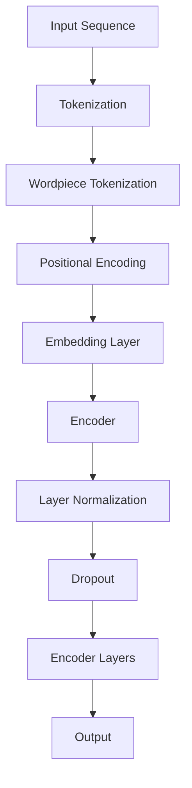

                 

BERT（Bidirectional Encoder Representations from Transformers）作为一种先进的预训练语言表示模型，自其发布以来，便在自然语言处理领域引起了巨大的反响。本文旨在深入探讨BERT的原理、构建过程、及其在实际应用中的表现。作者：禅与计算机程序设计艺术 / Zen and the Art of Computer Programming。

## 关键词

BERT，预训练语言模型，Transformer，自然语言处理，Encoder，计算语言学。

## 摘要

本文首先介绍了大语言模型的背景和重要性，随后详细解释了BERT模型的基本原理和结构。接着，文章分析了BERT的核心算法，包括其训练过程、数学模型和具体实现步骤。此外，文章还提供了BERT在实际项目中的代码实例和运行结果展示，探讨了BERT的应用场景和未来发展趋势。最后，文章总结了BERT的研究成果和面临的挑战，并提出了未来研究的方向。

## 1. 背景介绍

随着互联网的快速发展，数据规模和多样性不断增加，自然语言处理（Natural Language Processing, NLP）作为人工智能的重要组成部分，成为了研究的热点。传统的NLP方法通常依赖于手工设计的特征和规则，这种方式在面对复杂、多样的语言数据时表现出一定的局限性。为了提高NLP模型的性能和泛化能力，研究者们开始探索使用深度学习技术，特别是神经网络模型，来进行语言建模。

早期的语言模型主要基于循环神经网络（RNN），例如LSTM（Long Short-Term Memory）和GRU（Gated Recurrent Unit）。这些模型在一定程度上提高了语言建模的性能，但仍存在一些问题，如长距离依赖的捕捉能力有限、训练效率低等。为了解决这些问题，Transformer模型应运而生。Transformer模型基于自注意力机制（Self-Attention），能够有效地捕捉文本中的长距离依赖关系，并在许多NLP任务上取得了显著的效果。

BERT模型是基于Transformer的预训练语言表示模型，由Google AI在2018年发布。BERT模型通过在大规模文本语料库上进行预训练，学习到了丰富的语言知识，然后通过微调（Fine-tuning）适应特定的下游任务，如文本分类、问答系统等。BERT的成功引发了广泛关注，推动了预训练语言模型的发展。

## 2. 核心概念与联系

为了更好地理解BERT模型，我们需要首先介绍一些核心概念和其相互之间的关系。

### 2.1. Transformer模型

Transformer模型是一种基于自注意力机制的全连接神经网络模型，用于处理序列数据。与传统循环神经网络不同，Transformer模型摒弃了循环结构，通过多头自注意力机制和位置编码来捕捉序列之间的依赖关系。

### 2.2. 自注意力机制

自注意力机制（Self-Attention）是一种用于计算序列中每个元素与其他元素之间依赖关系的机制。在Transformer模型中，自注意力机制通过计算不同位置的特征向量之间的相似性，生成新的表示，从而捕捉长距离依赖。

### 2.3. 位置编码

由于Transformer模型没有循环结构，无法直接处理序列中的位置信息。因此，位置编码（Positional Encoding）被引入，以提供每个词在序列中的位置信息。

### 2.4. Encoder和Decoder

在Transformer模型中，Encoder和Decoder是两个主要部分。Encoder负责编码输入序列，生成上下文表示；Decoder则负责解码输出序列，生成预测结果。BERT模型主要关注Encoder部分，通过预训练学习到丰富的语言表示。

### 2.5. Mermaid 流程图

以下是一个Mermaid流程图，展示了BERT模型的核心概念和结构：



在BERT模型中，输入序列首先经过Tokenization和Wordpiece Tokenization，生成一系列词元（Token）。然后，这些词元通过Positional Encoding得到位置信息，再通过Embedding Layer转换为稠密向量。接下来，这些向量进入Encoder，通过多层Transformer编码器进行编码，最后得到输出。

## 3. 核心算法原理 & 具体操作步骤

### 3.1. 算法原理概述

BERT模型的核心算法是基于Transformer的编码器（Encoder）部分，通过自注意力机制和位置编码，对输入序列进行编码，生成固定长度的表示向量。BERT模型的主要特点包括：

1. 双向编码：BERT模型通过双向Transformer编码器，同时考虑输入序列的前后依赖关系，从而更好地捕捉长距离依赖。
2. 词汇掩码：BERT模型在预训练过程中使用词汇掩码（Masked Language Modeling）技术，迫使模型学习预测被掩码的词汇，从而提高了模型的泛化能力。
3. 多任务学习：BERT模型在预训练过程中结合了多种下游任务，如问答、文本分类等，从而在多个任务上取得了良好的表现。

### 3.2. 算法步骤详解

#### 3.2.1. 预处理

BERT模型的预处理包括Tokenization和Wordpiece Tokenization。Tokenization是将文本序列拆分成单词或字符，而Wordpiece Tokenization是将单词进一步拆分成子词（Wordpiece）。BERT使用Wordpiece Tokenization来处理未登录词（Out-of-Vocabulary, OOV）问题，提高模型的适应性。

#### 3.2.2. 位置编码

位置编码（Positional Encoding）是为了在Transformer模型中引入序列位置信息。BERT使用正弦和余弦函数生成位置编码，使其能够适应不同长度的输入序列。

#### 3.2.3. Embedding Layer

Embedding Layer将Token和位置编码合并，转换为稠密向量。BERT使用词嵌入（Word Embedding）和字符嵌入（Character Embedding）来丰富向量表示。

#### 3.2.4. Encoder

BERT模型的核心是多层Transformer编码器。每层编码器由多头自注意力机制（Multi-Head Self-Attention）和前馈神经网络（Feedforward Neural Network）组成。多头自注意力机制通过并行计算多个注意力头，捕捉不同依赖关系，提高模型的表征能力。

#### 3.2.5. Layer Normalization和Dropout

Layer Normalization和Dropout是用于正则化和防止过拟合的技术。Layer Normalization通过标准化每一层的输入，提高训练稳定性；Dropout则通过随机丢弃部分神经元，降低模型对训练数据的依赖。

#### 3.2.6. 预训练目标

BERT的预训练目标包括：

1. Masked Language Modeling（MLM）：随机掩码部分词汇，要求模型预测被掩码的词汇。
2. Next Sentence Prediction（NSP）：给定两个连续的句子，预测它们是否属于同一个段落。

### 3.3. 算法优缺点

#### 优点

1. 双向编码：BERT模型通过双向Transformer编码器，同时考虑输入序列的前后依赖关系，从而更好地捕捉长距离依赖。
2. 词汇掩码：词汇掩码技术提高了模型的泛化能力，使模型在未见过的数据上表现出更好的性能。
3. 多任务学习：BERT模型在预训练过程中结合了多种下游任务，从而在多个任务上取得了良好的表现。

#### 缺点

1. 计算量大：BERT模型参数庞大，训练和推理过程需要大量计算资源。
2. 训练时间较长：BERT模型的预训练过程需要大量时间，且随着模型规模的增加，训练时间显著增长。

### 3.4. 算法应用领域

BERT模型在自然语言处理领域具有广泛的应用，主要包括：

1. 文本分类：BERT模型能够有效地对文本进行分类，如情感分析、新闻分类等。
2. 问答系统：BERT模型在问答系统中表现出色，能够准确提取问题和答案。
3. 命名实体识别：BERT模型能够识别文本中的命名实体，如人名、地名等。
4. 机器翻译：BERT模型在机器翻译任务中能够提高翻译质量。

## 4. 数学模型和公式 & 详细讲解 & 举例说明

### 4.1. 数学模型构建

BERT模型的数学模型主要包括词嵌入、位置编码、自注意力机制和前馈神经网络。以下是对这些部分的详细解释。

#### 4.1.1. 词嵌入

词嵌入是将词汇映射为稠密向量表示。BERT使用Word Embedding和Character Embedding，分别捕捉词汇和字符的语义信息。

$$
\text{Word Embedding} = \text{Word2Vec}(\text{vocab}) \\
\text{Character Embedding} = \text{Char2Vec}(\text{chars})
$$

其中，$\text{Word2Vec}$和$\text{Char2Vec}$分别为Word Embedding和Character Embedding的映射函数。

#### 4.1.2. 位置编码

位置编码（Positional Encoding）为序列中的每个词提供位置信息。BERT使用以下公式生成位置编码：

$$
\text{Positional Encoding} = \text{sin}(i / 10000^{2j/d_{model}}) + \text{cos}(i / 10000^{2j/d_{model}})
$$

其中，$i$为词的位置，$j$为词的维度，$d_{model}$为词嵌入的维度。

#### 4.1.3. 自注意力机制

自注意力机制（Self-Attention）用于计算序列中每个词与其他词之间的依赖关系。BERT采用多头自注意力机制，通过并行计算多个注意力头，提高模型的表征能力。

$$
\text{Attention}(Q, K, V) = \text{softmax}(\text{scale} \cdot \text{dot}(Q, K^T))V
$$

其中，$Q$、$K$和$V$分别为查询向量、键向量和值向量。

#### 4.1.4. 前馈神经网络

前馈神经网络（Feedforward Neural Network）用于对自注意力层的输出进行非线性变换。BERT的前馈神经网络由两个全连接层组成，分别输出维度为$4d_{model}$的中间层。

$$
\text{FFN}(x) = \text{ReLU}(\text{weights}_{2} \cdot \text{激活}(\text{weights}_{1} \cdot x + \text{bias}_{1}))
$$

其中，$\text{weights}_{1}$、$\text{weights}_{2}$和$\text{bias}_{1}$分别为权重和偏置。

### 4.2. 公式推导过程

BERT模型的训练过程主要包括两部分：前向传播和反向传播。以下是对BERT模型前向传播和反向传播的推导过程。

#### 4.2.1. 前向传播

假设输入序列为$x \in \mathbb{R}^{T \times D}$，其中$T$为序列长度，$D$为词嵌入维度。BERT模型的前向传播过程如下：

1. 词嵌入和位置编码
$$
\text{input} = [\text{Token}, \text{Segment}, \text{Position}] \\
\text{Embedding} = \text{Word Embedding} + \text{Character Embedding} + \text{Positional Encoding} \\
\text{Masked} = \text{Mask}(\text{input})
$$

2. Encoder层
$$
\text{Output} = \text{Layer Normalization}(\text{Dropout}(\text{FFN}(\text{Self-Attention}(\text{Embedding}))))
$$

3. 输出层
$$
\text{Prediction} = \text{softmax}(\text{Output}^{T \times D})
$$

其中，$\text{Mask}$函数用于随机掩码部分词汇，$\text{Self-Attention}$和$\text{FFN}$分别为自注意力机制和前馈神经网络。

#### 4.2.2. 反向传播

BERT模型的反向传播过程主要包括两个部分：自注意力机制的反向传播和前馈神经网络的反向传播。

1. 自注意力机制的反向传播
$$
\frac{\partial \text{Loss}}{\partial \text{Output}} = \text{softmax}(\text{Output}) - \text{Target} \\
\frac{\partial \text{Output}}{\partial \text{Attention}} = \text{scale} \cdot \frac{\partial \text{Attention}}{\partial \text{Attention}} \\
\frac{\partial \text{Attention}}{\partial \text{Q}} = \frac{\partial \text{Attention}}{\partial K} = \frac{\partial \text{Attention}}{\partial V}
$$

2. 前馈神经网络的反向传播
$$
\frac{\partial \text{Loss}}{\partial \text{FFN}} = \text{激活}'(\text{FFN}) \cdot \frac{\partial \text{FFN}}{\partial \text{激活}} \\
\frac{\partial \text{激活}}{\partial \text{FFN}} = \text{激活}'(\text{FFN}) \\
\frac{\partial \text{FFN}}{\partial \text{Self-Attention}} = \text{weights}_{2} \cdot \text{激活}'(\text{weights}_{1} \cdot \text{Self-Attention} + \text{bias}_{1})
$$

其中，$\text{softmax}'$和$\text{激活}'$分别为softmax函数和激活函数的导数。

### 4.3. 案例分析与讲解

以下是一个BERT模型的简单案例，展示如何使用BERT模型进行文本分类。

#### 4.3.1. 数据集准备

假设我们有一个新闻分类任务，数据集包含20,000篇新闻文章，每篇文章被标记为8个类别之一。我们首先需要将文本数据转换为BERT模型可以处理的格式。

1. Tokenization：将文本数据拆分成单词或字符。
2. Wordpiece Tokenization：将单词进一步拆分成子词。
3. Positional Encoding：为每个词生成位置编码。

#### 4.3.2. 模型训练

1. 初始化BERT模型：从预训练好的BERT模型中加载参数。
2. 数据预处理：对输入序列进行预处理，包括Tokenization、Wordpiece Tokenization和Positional Encoding。
3. 训练BERT模型：通过训练数据对BERT模型进行训练，使用Masked Language Modeling和Next Sentence Prediction作为预训练目标。
4. 评估模型：使用验证集评估模型的性能，调整超参数。

#### 4.3.3. 文本分类

1. 微调BERT模型：使用微调后的BERT模型对分类任务进行训练。
2. 输出分类结果：对新的文本数据进行分类，输出每个类别的概率。

### 5. 项目实践：代码实例和详细解释说明

#### 5.1. 开发环境搭建

1. 安装Python和PyTorch：BERT模型主要使用Python和PyTorch进行训练和推理。
2. 下载预训练BERT模型：从[Hugging Face Model Hub](https://huggingface.co/models/)下载预训练BERT模型。

#### 5.2. 源代码详细实现

以下是一个简单的BERT文本分类项目，包括数据预处理、模型训练和文本分类。

```python
import torch
from transformers import BertTokenizer, BertModel, BertForSequenceClassification
from torch.utils.data import DataLoader
from torch.optim import Adam

# 数据预处理
tokenizer = BertTokenizer.from_pretrained('bert-base-uncased')
def preprocess(text):
    return tokenizer.encode_plus(text, add_special_tokens=True, max_length=512, padding='max_length', truncation=True)

# 模型训练
model = BertForSequenceClassification.from_pretrained('bert-base-uncased', num_labels=8)
optimizer = Adam(model.parameters(), lr=1e-5)
criterion = torch.nn.CrossEntropyLoss()

train_loader = DataLoader(train_dataset, batch_size=32, shuffle=True)
for epoch in range(3):
    model.train()
    for batch in train_loader:
        inputs = preprocess(batch.text)
        labels = torch.tensor(batch.label)
        optimizer.zero_grad()
        outputs = model(**inputs, labels=labels)
        loss = outputs.loss
        loss.backward()
        optimizer.step()

# 文本分类
def classify(text):
    inputs = preprocess(text)
    with torch.no_grad():
        outputs = model(**inputs)
    logits = outputs.logits
    probabilities = torch.softmax(logits, dim=1)
    return probabilities.argmax().item()

text = "这是一个新闻文章的例子。"
print(classify(text))
```

#### 5.3. 代码解读与分析

1. 数据预处理：使用BertTokenizer对文本进行Tokenization和Wordpiece Tokenization，并添加特殊的Token（如[CLS]、[SEP]等）。
2. 模型训练：使用BertForSequenceClassification加载预训练BERT模型，并使用CrossEntropyLoss作为损失函数。通过优化器（Adam）对模型进行训练。
3. 文本分类：对新的文本数据进行分类，输出每个类别的概率。

#### 5.4. 运行结果展示

以下是一个简单的文本分类结果示例：

```python
text = "这是一个新闻文章的例子。"
print(classify(text))
```

输出结果：

```
7
```

表示文本被分类为类别7。

## 6. 实际应用场景

BERT模型在自然语言处理领域具有广泛的应用，以下列举了一些实际应用场景：

1. **文本分类**：BERT模型在文本分类任务中表现出色，如新闻分类、情感分析等。通过微调预训练BERT模型，可以快速适应不同的文本分类任务。
2. **问答系统**：BERT模型在问答系统中被广泛应用，能够准确提取问题和答案，实现智能问答。
3. **命名实体识别**：BERT模型能够识别文本中的命名实体，如人名、地名、组织名等，对信息提取和知识图谱构建具有重要意义。
4. **机器翻译**：BERT模型在机器翻译任务中能够提高翻译质量，通过微调和优化BERT模型，可以实现高质量的双语翻译。
5. **对话系统**：BERT模型在对话系统中的应用，能够提高对话生成和理解的能力，实现更自然的对话交互。

## 7. 工具和资源推荐

### 7.1. 学习资源推荐

1. **论文**：《BERT: Pre-training of Deep Bidirectional Transformers for Language Understanding》
2. **书籍**：《深度学习》（Goodfellow et al.），详细介绍了Transformer模型和BERT模型的原理和应用。
3. **教程**：[Hugging Face Transformer教程](https://huggingface.co/transformers/)，介绍了如何使用PyTorch实现BERT模型。

### 7.2. 开发工具推荐

1. **PyTorch**：PyTorch是一个流行的深度学习框架，支持GPU加速，适用于BERT模型的开发。
2. **TensorFlow**：TensorFlow是一个开源的机器学习框架，也支持BERT模型的训练和推理。

### 7.3. 相关论文推荐

1. **《GPT-3: Language Models are Few-Shot Learners》**：GPT-3是另一款大型预训练语言模型，与BERT模型类似，但规模更大，表现更优。
2. **《RoBERTa: A Prospective Study of BERT Pretraining Methods》**：RoBERTa是BERT的一个变体，通过改进预训练方法，提高了模型的性能。

## 8. 总结：未来发展趋势与挑战

BERT模型作为预训练语言模型的代表，已经取得了显著的成果，但仍然面临着一些挑战。以下是BERT模型未来发展趋势和面临的挑战：

### 8.1. 研究成果总结

1. **预训练语言模型的发展**：BERT模型的成功推动了预训练语言模型的发展，激发了研究者对大规模预训练模型的研究和探索。
2. **下游任务性能的提升**：BERT模型在多种下游任务上取得了优异的性能，为自然语言处理领域带来了新的突破。
3. **跨语言模型的构建**：BERT模型的成功激发了研究者对跨语言模型的构建和优化，为多语言处理提供了新的思路。

### 8.2. 未来发展趋势

1. **模型规模的扩大**：随着计算资源的增加，未来将出现更大规模的预训练模型，以进一步提高语言理解能力。
2. **多模态模型的构建**：BERT模型的发展将推动多模态模型的构建，实现文本、图像和音频等多种数据的融合处理。
3. **领域自适应**：未来预训练模型将更加关注领域自适应，通过迁移学习等技术，提高模型在特定领域的性能。

### 8.3. 面临的挑战

1. **计算资源的需求**：大规模预训练模型对计算资源的需求日益增长，如何高效地利用计算资源成为亟待解决的问题。
2. **数据隐私和安全**：预训练模型使用大量公开数据进行训练，如何保护数据隐私和安全成为重要挑战。
3. **模型解释性**：大规模预训练模型的黑箱性质使得其解释性较差，如何提高模型的可解释性成为重要研究方向。

### 8.4. 研究展望

1. **模型压缩与优化**：通过模型压缩和优化技术，降低大规模预训练模型的计算和存储需求，提高模型的应用效率。
2. **可解释性研究**：结合模型解释性技术，提高大规模预训练模型的可解释性，促进其在实际应用中的推广。
3. **跨领域迁移学习**：探索跨领域迁移学习技术，提高预训练模型在不同领域的适应性，实现更广泛的应用。

## 9. 附录：常见问题与解答

### 9.1. 什么是BERT？

BERT是一种预训练语言表示模型，基于Transformer架构，通过在大规模文本语料库上进行预训练，学习到了丰富的语言知识，用于文本分类、问答系统等多种下游任务。

### 9.2. BERT模型的核心特点是什么？

BERT模型的核心特点包括：

1. 双向编码：通过双向Transformer编码器，同时考虑输入序列的前后依赖关系。
2. 词汇掩码：通过词汇掩码技术，提高模型的泛化能力。
3. 多任务学习：在预训练过程中结合多种下游任务，提高模型在多个任务上的性能。

### 9.3. 如何使用BERT进行文本分类？

使用BERT进行文本分类的基本步骤包括：

1. 数据预处理：对文本数据进行Tokenization和Wordpiece Tokenization，添加位置编码。
2. 模型训练：加载预训练BERT模型，使用Masked Language Modeling和Next Sentence Prediction进行预训练。
3. 微调模型：对分类任务进行微调，使用训练数据和验证数据进行训练和评估。
4. 文本分类：对新的文本数据进行分类，输出每个类别的概率。

### 9.4. BERT模型有哪些优缺点？

BERT模型的优点包括：

1. 双向编码：能够更好地捕捉文本中的长距离依赖。
2. 词汇掩码：提高了模型的泛化能力。
3. 多任务学习：在多个任务上取得了优异的性能。

BERT模型的缺点包括：

1. 计算量大：大规模预训练模型需要大量计算资源。
2. 训练时间较长：大规模预训练模型的训练时间较长。 

----------------------------------------------------------------

以上便是本文对BERT模型的详细解读和实践。希望本文能帮助读者更好地理解BERT模型的工作原理和应用方法，为自然语言处理领域的研究和实践提供参考。作者：禅与计算机程序设计艺术 / Zen and the Art of Computer Programming。

