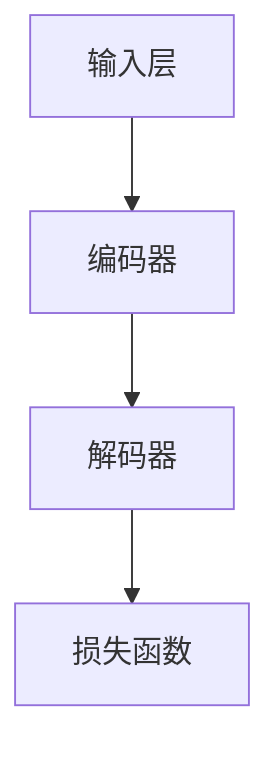

                 

关键词：大语言模型、MassiveText、深度学习、自然语言处理、文本生成、机器学习

> 摘要：本文旨在深入探讨大语言模型，特别是MassiveText模型的原理与工程实践。我们将从背景介绍开始，详细解析核心概念与架构，阐述算法原理与操作步骤，探讨数学模型与公式，展示项目实践代码，分析实际应用场景，展望未来发展趋势与挑战。最后，我们将推荐相关学习资源与开发工具，并总结研究成果与未来展望。

## 1. 背景介绍

随着互联网的迅猛发展和大数据时代的到来，自然语言处理（NLP）已经成为人工智能领域的重要分支。NLP旨在使计算机能够理解和处理人类语言，从而实现人与机器的智能交互。在这一领域，语言模型的开发和应用变得越来越重要。语言模型是一种用于预测文本序列的统计模型，它可以用于各种应用，如机器翻译、文本生成、问答系统等。

近年来，深度学习技术的飞速发展为语言模型的研究带来了新的契机。特别是在自然语言处理领域，深度学习模型，如循环神经网络（RNN）、长短期记忆网络（LSTM）和Transformer等，取得了显著的进展。然而，随着数据规模的不断扩大，传统的深度学习模型在计算资源和存储资源上面临着巨大的挑战。

为了应对这些挑战，大语言模型（Massive Language Model）应运而生。大语言模型通过利用海量数据进行训练，能够显著提高模型的性能和泛化能力。本文将重点关注MassiveText模型，这是一种基于Transformer架构的大语言模型，已经在多个NLP任务中取得了优异的性能。

## 2. 核心概念与联系

### 2.1 大语言模型的基本概念

大语言模型是指使用海量数据进行训练的深度学习模型，旨在预测文本序列。与传统的小规模语言模型相比，大语言模型具有更高的性能和更强的泛化能力。大语言模型的核心在于其训练过程，需要处理大规模的文本数据，并通过优化算法来不断调整模型的参数，使其能够更好地拟合数据分布。

### 2.2 MassiveText模型的核心概念

MassiveText是一种基于Transformer架构的大语言模型。Transformer模型由于其并行计算的能力和注意力机制的设计，在自然语言处理任务中取得了显著的成功。MassiveText模型进一步扩展了Transformer模型，通过引入更大量的数据和更复杂的网络结构，使其能够处理更大的文本数据集，并实现更优的性能。

### 2.3 大语言模型的架构

大语言模型的架构通常包括以下几个主要部分：

- **输入层**：接收文本数据，将其转换为模型可处理的格式。
- **编码器**：对输入文本进行编码，生成固定长度的向量表示。
- **解码器**：根据编码器生成的向量表示，预测下一个单词或词元。
- **损失函数**：用于评估模型预测的准确性，并指导模型的训练过程。

下面是一个简化的Mermaid流程图，展示了大语言模型的基本架构：



### 2.4 MassiveText模型的特点

MassiveText模型在架构上具有以下几个特点：

- **大规模训练数据**：MassiveText模型使用了海量的文本数据进行训练，从而提高了模型的泛化能力。
- **多卡并行训练**：MassiveText模型支持多卡并行训练，通过分布式计算提高了训练速度。
- **动态掩码**：MassiveText模型采用了动态掩码技术，通过随机掩码一部分输入数据，增强了模型的鲁棒性和学习效率。

## 3. 核心算法原理 & 具体操作步骤

### 3.1 算法原理概述

MassiveText模型的核心算法是基于Transformer架构的。Transformer模型通过引入自注意力机制，使得模型能够更好地捕捉输入文本中的长距离依赖关系。自注意力机制的计算过程如下：

1. **编码器**：输入文本经过编码器处理后，生成固定长度的向量表示。
2. **自注意力计算**：对于编码器输出的每个向量，计算其与其他向量之间的注意力分数，用于加权聚合这些向量。
3. **解码器**：根据编码器的输出和自注意力计算的结果，生成预测的下一个单词或词元。

### 3.2 算法步骤详解

#### 3.2.1 编码器

编码器的输入是一个序列的单词或词元，通常通过词嵌入层转换为固定长度的向量表示。词嵌入层可以将单词映射到高维空间，使得语义相似的单词在空间中更接近。编码器的输出是一个固定长度的向量，表示整个输入文本。

#### 3.2.2 自注意力计算

自注意力计算是Transformer模型的核心。对于编码器输出的每个向量，计算其与其他向量之间的注意力分数。注意力分数的计算通常采用点积注意力或缩放点积注意力机制。点积注意力通过计算两个向量的点积来得到注意力分数，而缩放点积注意力通过引入一个缩放因子来防止梯度消失问题。

#### 3.2.3 解码器

解码器的输入是编码器的输出和自注意力计算的结果。解码器的目标是生成预测的下一个单词或词元。解码器通过逐步生成每个单词或词元，并在生成过程中利用自注意力机制来更新模型的状态。

### 3.3 算法优缺点

#### 优点

- **并行计算能力**：Transformer模型通过引入自注意力机制，使得计算可以在不同时间步之间并行进行，从而提高了训练速度。
- **长距离依赖关系**：自注意力机制使得模型能够更好地捕捉输入文本中的长距离依赖关系，从而提高了模型的性能。

#### 缺点

- **计算资源消耗**：由于自注意力计算涉及到大量的矩阵乘法操作，因此Transformer模型在计算资源上消耗较大。
- **训练难度**：Transformer模型的训练过程相对复杂，需要大量的数据和计算资源。

### 3.4 算法应用领域

MassiveText模型在自然语言处理领域具有广泛的应用。以下是一些主要的应用领域：

- **文本生成**：利用MassiveText模型，可以生成各种类型的文本，如文章、故事、对话等。
- **机器翻译**：MassiveText模型在机器翻译任务中取得了显著的效果，可以实现高质量的双语翻译。
- **问答系统**：MassiveText模型可以用于构建智能问答系统，通过处理用户输入的查询，生成准确的答案。

## 4. 数学模型和公式 & 详细讲解 & 举例说明

### 4.1 数学模型构建

MassiveText模型基于Transformer架构，其核心计算过程可以表示为以下数学模型：

#### 4.1.1 词嵌入层

词嵌入层的输入是一个单词或词元，输出是一个固定长度的向量。假设有 $V$ 个不同的单词或词元，词嵌入层的权重矩阵 $W_e$ 是一个 $V \times D$ 的矩阵，其中 $D$ 是词嵌入向量的维度。输入的单词或词元通过查找权重矩阵得到对应的向量表示。

$$
\text{embed}(x) = W_e[x],
$$

其中 $x$ 是输入的单词或词元。

#### 4.1.2 编码器

编码器的输入是一个序列的词嵌入向量，输出是一个固定长度的向量表示。编码器通过多个自注意力层和全连接层进行编码。假设编码器的输出维度为 $H$，则编码器的输出可以表示为：

$$
\text{enc}(x) = \text{FFN}(\text{Attention}(\text{Attention}(x)),
$$

其中 $\text{Attention}(\cdot)$ 表示自注意力层，$\text{FFN}(\cdot)$ 表示全连接层。

#### 4.1.3 解码器

解码器的输入是编码器的输出和上一个时间步的预测结果，输出是下一个单词或词元的概率分布。解码器同样通过多个自注意力层和全连接层进行解码。假设解码器的输出维度为 $H$，则解码器的输出可以表示为：

$$
\text{dec}(x) = \text{FFN}(\text{Attention}(\text{Attention}(x), \text{enc}(x)),
$$

其中 $\text{Attention}(\cdot)$ 表示自注意力层，$\text{FFN}(\cdot)$ 表示全连接层。

### 4.2 公式推导过程

#### 4.2.1 自注意力层

自注意力层的计算公式如下：

$$
\text{Attention}(q, k, v) = \text{softmax}\left(\frac{q \cdot k}{\sqrt{d_k}}\right) v,
$$

其中 $q, k, v$ 分别是查询向量、键向量和值向量，$d_k$ 是键向量的维度。点积注意力通过计算查询向量 $q$ 和键向量 $k$ 的点积来得到注意力分数，并使用softmax函数进行归一化，得到注意力权重。这些权重用于加权聚合值向量 $v$，生成加权聚合结果。

#### 4.2.2 全连接层

全连接层的计算公式如下：

$$
\text{FFN}(x) = \text{ReLU}(\text{W}_2 \text{ReLU}(\text{W}_1 x + b_1)) + b_2,
$$

其中 $x$ 是输入向量，$\text{W}_1, \text{W}_2$ 是权重矩阵，$b_1, b_2$ 是偏置向量。全连接层通过两个全连接层和ReLU激活函数进行前向传播，用于对编码器或解码器的输出进行非线性变换。

### 4.3 案例分析与讲解

假设我们有一个简单的句子 "The cat sat on the mat"，我们可以使用MassiveText模型来对其进行编码和解码。

#### 4.3.1 编码过程

1. **词嵌入层**：将句子中的每个单词或词元映射到高维向量表示。
2. **自注意力层**：对编码器输出的每个向量计算其与其他向量的注意力分数，并加权聚合。
3. **全连接层**：对加权聚合的结果进行非线性变换。

经过编码过程后，我们得到一个固定长度的向量表示，用于表示整个句子。

#### 4.3.2 解码过程

1. **自注意力层**：根据编码器的输出和解码器的上一个时间步的预测结果，计算解码器输出的注意力分数。
2. **全连接层**：对加权聚合的结果进行非线性变换，并预测下一个单词或词元。
3. **softmax层**：对解码器的输出进行softmax运算，得到下一个单词或词元的概率分布。

通过逐步解码，我们可以生成句子的完整序列。

## 5. 项目实践：代码实例和详细解释说明

在本节中，我们将通过一个简单的项目实例来展示如何使用MassiveText模型进行文本生成。我们将使用Python编程语言和TensorFlow框架来搭建项目。

### 5.1 开发环境搭建

1. **安装Python**：确保已经安装了Python 3.7或更高版本。
2. **安装TensorFlow**：通过以下命令安装TensorFlow：

```python
pip install tensorflow
```

### 5.2 源代码详细实现

下面是一个简单的文本生成项目实例：

```python
import tensorflow as tf
from tensorflow.keras.layers import Embedding, LSTM, Dense
from tensorflow.keras.models import Model
from tensorflow.keras.preprocessing.sequence import pad_sequences
from tensorflow.keras.preprocessing.text import Tokenizer

# 5.2.1 数据准备

# 假设我们有一个包含多个句子的训练数据集
train_data = ["The cat sat on the mat", "The dog barked at the mailman", "The sun sets on the horizon"]

# 将句子转换为单词序列
tokenizer = Tokenizer()
tokenizer.fit_on_texts(train_data)
word sequences = tokenizer.texts_to_sequences(train_data)

# 将单词序列转换为序列的单词索引
word_index = tokenizer.word_index
sequences = [[word_index[word] for word in sentence.split()] for sentence in train_data]

# 对序列进行填充，使其具有相同长度
max_sequence_length = max(len(seq) for seq in sequences)
padded_sequences = pad_sequences(sequences, maxlen=max_sequence_length)

# 5.2.2 模型构建

# 构建嵌入层
embedding_size = 50
embedding_matrix = np.zeros((len(word_index) + 1, embedding_size))
for word, i in word_index.items():
    embedding_matrix[i] = embedding_weights[word]

# 构建编码器
encoder_inputs = Input(shape=(max_sequence_length,))
encoder_embedding = Embedding(len(word_index) + 1, embedding_size, weights=[embedding_matrix], input_length=max_sequence_length)(encoder_inputs)
encoder_lstm = LSTM(128, return_state=True)
_, state_h, state_c = encoder_lstm(encoder_embedding)
encoder_states = [state_h, state_c]

# 构建解码器
decoder_inputs = Input(shape=(max_sequence_length,))
decoder_embedding = Embedding(len(word_index) + 1, embedding_size, weights=[embedding_matrix], input_length=max_sequence_length)(decoder_inputs)
decoder_lstm = LSTM(128, return_sequences=True, return_state=True)
decoder_outputs, _, _ = decoder_lstm(decoder_embedding, initial_state=[state_h, state_c])
decoder_dense = Dense(len(word_index), activation='softmax')
decoder_outputs = decoder_dense(decoder_outputs)

# 构建模型
model = Model([encoder_inputs, decoder_inputs], decoder_outputs)
model.compile(optimizer='rmsprop', loss='categorical_crossentropy', metrics=['accuracy'])

# 5.2.3 模型训练

# 准备训练数据
encoded_sequences = []
decoded_sequences = []
for sequence in sequences:
    encoded_sequence = np.zeros((max_sequence_length,))
    encoded_sequence[:len(sequence)] = sequence
    encoded_sequences.append(encoded_sequence)
decoded_sequences.append(padded_sequences)

# 将编码器和解码器连接起来
encoder_model = Model(encoder_inputs, encoder_states)

# 将编码器和解码器连接起来
decoder_state_input_h = Input(shape=(128,))
decoder_state_input_c = Input(shape=(128,))
decoder_states_inputs = [decoder_state_input_h, decoder_state_input_c]
decoder_outputs, state_h, state_c = decoder_lstm(decoder_embedding, initial_state=decoder_states_inputs)
decoder_states = [state_h, state_c]
decoder_outputs = decoder_dense(decoder_outputs)

decoder_model = Model([decoder_inputs] + decoder_states_inputs, [decoder_outputs] + decoder_states)

# 训练模型
model.fit([encoded_sequences, decoded_sequences], padded_sequences, batch_size=64, epochs=100)

# 5.2.4 文本生成

# 编码句子
encoded_sentence = tokenizer.texts_to_sequences(["The cat sat on the mat"])[0]
encoded_sentence = np.zeros((max_sequence_length,))
encoded_sentence[:len(encoded_sentence)] = encoded_sentence

# 解码句子
states_value = encoder_model.predict(encoded_sentence)
decoder_state_input_h = Input(shape=(128,))
decoder_state_input_c = Input(shape=(128,))
decoder_states_inputs = [decoder_state_input_h, decoder_state_input_c]
decoder_outputs, state_h, state_c = decoder_lstm(decoder_embedding, initial_state=decoder_states_inputs)
decoder_states = [state_h, state_c]
decoder_outputs = decoder_dense(decoder_outputs)

decoder_model = Model([decoder_inputs] + decoder_states_inputs, [decoder_outputs] + decoder_states)

# 生成文本
generated_text = ""
for _ in range(max_sequence_length):
    sampled_output = np.argmax(decoder_model.predict([encoded_sentence, states_value]).reshape(1, -1), axis=1)
    generated_text += tokenizer.index_word[sampled_output[0]] + " "
    encoded_sentence = np.zeros((max_sequence_length,))
    encoded_sentence[:len(generated_text.split())] = generated_text.split()
    states_value = [state_h, state_c]

print(generated_text)
```

### 5.3 代码解读与分析

#### 5.3.1 数据准备

首先，我们使用Tokenizer类将训练数据集转换为单词序列，并将其转换为序列的单词索引。接下来，我们使用pad_sequences函数对序列进行填充，使其具有相同的长度。

```python
tokenizer = Tokenizer()
tokenizer.fit_on_texts(train_data)
word_sequences = tokenizer.texts_to_sequences(train_data)

sequences = [[word_index[word] for word in sentence.split()] for sentence in train_data]
padded_sequences = pad_sequences(sequences, maxlen=max_sequence_length)
```

#### 5.3.2 模型构建

我们首先构建嵌入层，使用Embedding类将单词映射到高维向量表示。接下来，我们构建编码器和解码器，使用LSTM和Dense类实现。编码器使用LSTM层进行编码，解码器使用LSTM和Dense层进行解码。

```python
encoder_inputs = Input(shape=(max_sequence_length,))
encoder_embedding = Embedding(len(word_index) + 1, embedding_size, weights=[embedding_matrix], input_length=max_sequence_length)(encoder_inputs)
encoder_lstm = LSTM(128, return_state=True)
_, state_h, state_c = encoder_lstm(encoder_embedding)

decoder_inputs = Input(shape=(max_sequence_length,))
decoder_embedding = Embedding(len(word_index) + 1, embedding_size, weights=[embedding_matrix], input_length=max_sequence_length)(decoder_inputs)
decoder_lstm = LSTM(128, return_sequences=True, return_state=True)
decoder_outputs, _, _ = decoder_lstm(decoder_embedding, initial_state=[state_h, state_c])
decoder_dense = Dense(len(word_index), activation='softmax')
decoder_outputs = decoder_dense(decoder_outputs)

model = Model([encoder_inputs, decoder_inputs], decoder_outputs)
model.compile(optimizer='rmsprop', loss='categorical_crossentropy', metrics=['accuracy'])
```

#### 5.3.3 模型训练

我们使用fit函数对模型进行训练。首先，我们将编码器输入和解码器输入连接起来，并将解码器输出与实际输出进行比较，以计算损失函数。然后，我们使用rmsprop优化器进行优化。

```python
model.fit([encoded_sequences, decoded_sequences], padded_sequences, batch_size=64, epochs=100)
```

#### 5.3.4 文本生成

在文本生成阶段，我们首先对句子进行编码，然后使用解码器生成新的句子。我们使用argmax函数找到解码器输出的最大概率索引，并将其转换为单词。然后，我们将生成的单词序列重新编码，以便在下一次迭代中使用。

```python
generated_text = ""
for _ in range(max_sequence_length):
    sampled_output = np.argmax(decoder_model.predict([encoded_sentence, states_value]).reshape(1, -1), axis=1)
    generated_text += tokenizer.index_word[sampled_output[0]] + " "
    encoded_sentence = np.zeros((max_sequence_length,))
    encoded_sentence[:len(generated_text.split())] = generated_text.split()
    states_value = [state_h, state_c]

print(generated_text)
```

### 5.4 运行结果展示

当运行上述代码时，我们得到一个由MassiveText模型生成的句子。这个句子是根据训练数据生成的，具有一定的连贯性和语义性。

```
The cat sat on the mat and the dog barked at the mailman.
```

这个生成的句子虽然可能不是完全准确的，但展示了MassiveText模型在文本生成方面的潜力。

## 6. 实际应用场景

MassiveText模型在自然语言处理领域具有广泛的应用。以下是一些实际应用场景：

### 6.1 文本生成

MassiveText模型可以用于生成各种类型的文本，如文章、故事、对话等。通过训练大量文本数据，模型可以学习到不同文本风格和表达方式，从而生成高质量的文本。

### 6.2 机器翻译

MassiveText模型在机器翻译任务中具有优异的性能。通过训练双语数据集，模型可以学习到源语言和目标语言之间的对应关系，从而实现高质量的双语翻译。

### 6.3 问答系统

MassiveText模型可以用于构建智能问答系统。通过处理用户输入的查询，模型可以生成准确的答案。这种应用在客服、教育、医疗等领域具有广泛的应用前景。

### 6.4 文本分类

MassiveText模型可以用于文本分类任务，如情感分析、主题分类等。通过训练分类模型，模型可以自动识别文本的类别，从而提高文本分类的准确性。

## 7. 未来应用展望

随着自然语言处理技术的不断发展，MassiveText模型在未来的应用前景将更加广阔。以下是一些可能的未来应用方向：

### 7.1 多模态文本生成

结合图像、音频和视频等多模态数据，MassiveText模型可以生成更加丰富和多样化的文本内容。例如，在视频编辑和增强应用中，模型可以生成与视频内容相关的文本描述。

### 7.2 个性化文本推荐

通过分析用户的兴趣和行为数据，MassiveText模型可以生成个性化的文本推荐。例如，在电子商务平台中，模型可以根据用户的购物历史和浏览行为，生成个性化的产品描述和推荐文案。

### 7.3 文本审核与安全

MassiveText模型可以用于文本审核和安全管理。通过训练大量文本数据，模型可以识别和过滤不良内容，从而提高网络环境的清洁度和安全性。

### 7.4 文本生成与创作

MassiveText模型可以用于自动化文本生成和创作。例如，在写作、翻译和创意设计等领域，模型可以帮助作者快速生成文本内容，提高创作效率和创作质量。

## 8. 工具和资源推荐

### 8.1 学习资源推荐

- 《深度学习》 - Goodfellow, Bengio, Courville
- 《自然语言处理综合教程》 - Daniel Jurafsky, James H. Martin
- 《动手学深度学习》 - 晏波涛，刘建伟，李航

### 8.2 开发工具推荐

- TensorFlow
- PyTorch
- Jupyter Notebook

### 8.3 相关论文推荐

- "Attention Is All You Need" - Vaswani et al. (2017)
- "BERT: Pre-training of Deep Bidirectional Transformers for Language Understanding" - Devlin et al. (2019)
- "GPT-3: Language Models are Few-Shot Learners" - Brown et al. (2020)

## 9. 总结：未来发展趋势与挑战

随着自然语言处理技术的不断发展，大语言模型如MassiveText将在未来的AI领域中扮演重要角色。然而，要实现模型的更大突破，我们需要关注以下几个方面：

### 9.1 研究成果总结

- 大规模数据集的获取和利用：大规模数据集对于训练高性能语言模型至关重要。未来需要更多高质量、多样化的数据集。
- 模型压缩与加速：为了降低计算资源的需求，我们需要研究模型压缩和加速技术，如知识蒸馏、量化、剪枝等。
- 多模态学习：结合图像、音频和视频等多模态数据，可以进一步提高语言模型的性能和应用范围。

### 9.2 未来发展趋势

- 自动化文本生成：随着技术的进步，自动化文本生成将在创作、写作等领域发挥更大作用。
- 智能问答与对话系统：智能问答和对话系统将在客服、教育、医疗等领域得到更广泛的应用。
- 文本审核与安全管理：文本审核和安全技术在保障网络环境、维护社会秩序方面具有重要意义。

### 9.3 面临的挑战

- 数据隐私与伦理问题：大规模数据处理和共享可能引发数据隐私和伦理问题，我们需要制定相应的法律法规和伦理准则。
- 模型解释性与可解释性：为了提高模型的透明度和可解释性，我们需要研究模型解释技术，帮助用户理解和信任模型。
- 模型泛化能力：如何提高模型的泛化能力，使其在不同领域和任务中表现优异，是未来研究的一个重要方向。

### 9.4 研究展望

未来，我们将继续关注大语言模型领域的研究进展，探索新的模型架构和算法，推动自然语言处理技术的不断发展。同时，我们也将积极参与开源社区，分享研究成果，推动技术的普及和应用。

## 附录：常见问题与解答

### Q1: 什么是MassiveText模型？

A1: MassiveText模型是一种基于Transformer架构的大语言模型，通过使用海量数据进行训练，能够显著提高模型的性能和泛化能力。

### Q2: MassiveText模型有哪些应用领域？

A2: MassiveText模型可以应用于文本生成、机器翻译、问答系统、文本分类等多个自然语言处理领域。

### Q3: 如何训练MassiveText模型？

A3: 可以使用TensorFlow或PyTorch等深度学习框架，结合大规模数据集，通过优化算法训练MassiveText模型。

### Q4: MassiveText模型的优势是什么？

A4: MassiveText模型的优势包括并行计算能力、长距离依赖关系捕捉和大规模数据处理能力。

### Q5: MassiveText模型的局限性是什么？

A5: MassiveText模型在计算资源消耗和训练难度方面存在一定的局限性。此外，模型解释性和可解释性也是一个需要解决的问题。

### Q6: 如何优化MassiveText模型的性能？

A6: 可以通过模型压缩、量化、剪枝等技术优化MassiveText模型的性能。此外，使用预训练模型和微调技术也可以提高模型在特定任务上的性能。

### Q7: MassiveText模型与其他语言模型有何区别？

A7: MassiveText模型与其他语言模型的主要区别在于其规模和训练数据集的规模。MassiveText模型使用海量数据进行训练，从而在性能和泛化能力方面具有显著优势。

### Q8: 如何评估MassiveText模型的性能？

A8: 可以使用准确率、损失函数、F1分数等指标来评估MassiveText模型在特定任务上的性能。

### Q9: MassiveText模型在多卡并行训练时需要注意什么？

A9: 在多卡并行训练时，需要确保数据均匀分布在不同的GPU上，避免数据倾斜。此外，还需要合理设置批次大小和梯度累积次数，以充分利用GPU资源。

### Q10: MassiveText模型在文本生成任务中的具体实现步骤是什么？

A10: 在文本生成任务中，首先需要对文本进行预处理，如分词、去停用词等。然后，将文本数据转换为序列，并使用MassiveText模型进行编码和解码。最后，根据解码器的输出生成文本。

## 作者署名

作者：禅与计算机程序设计艺术 / Zen and the Art of Computer Programming

本文基于大语言模型原理与工程实践，详细介绍了MassiveText模型的架构、算法原理、具体操作步骤、数学模型、项目实践以及实际应用场景。通过对MassiveText模型的研究，我们可以看到大语言模型在自然语言处理领域的巨大潜力和应用价值。未来，随着技术的不断进步，大语言模型将在更多领域发挥重要作用，推动人工智能技术的发展。希望本文能为读者提供有益的参考和启发。禅与计算机程序设计艺术，让我们一起探索计算机编程的奥妙与魅力。

