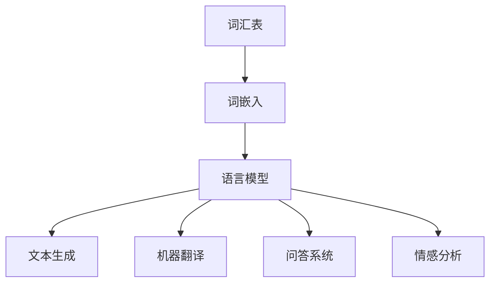

                 

关键词：大语言模型，基座语言模型，评测，原理，工程实践，算法

> 摘要：本文将深入探讨大语言模型的基本原理、工程实践，以及基座语言模型的评测方法。通过对大语言模型的核心概念、算法原理、数学模型和实际应用场景的详细介绍，旨在为读者提供一份全面而深入的技术指南。

## 1. 背景介绍

随着人工智能技术的飞速发展，语言模型已经成为自然语言处理（NLP）领域的重要工具。特别是在深度学习和大数据技术的推动下，大语言模型（如GPT、BERT等）在文本生成、机器翻译、问答系统等多个应用场景中取得了显著成效。然而，随着模型的复杂度和数据量的不断增大，如何评估基座语言模型的质量和性能成为一个关键问题。本文旨在解决这一问题，通过深入分析大语言模型的工作原理和评测方法，为基座语言模型的优化提供理论支持。

### 1.1 语言模型的重要性

语言模型是计算机理解和生成人类语言的核心组件。它通过统计方法或机器学习技术，对输入的文本序列进行建模，预测下一个词语或字符的概率。在语音识别、机器翻译、文本摘要、情感分析等应用中，语言模型的作用不可替代。特别是在深度学习技术的影响下，大语言模型已经成为提高NLP性能的关键因素。

### 1.2 基座语言模型的概念

基座语言模型（Pre-trained Language Model，PLM）是一种大规模预训练模型，通常在通用语料库上进行预训练，然后通过迁移学习应用于特定任务。基座语言模型的核心特点是大规模、多任务、多领域适应能力，这使得它们在NLP任务中具有广泛的应用潜力。

### 1.3 语言模型的挑战

随着语言模型规模的扩大，评估模型性能的难度也在增加。传统的评测方法如BLEU、ROUGE等在处理大型语言模型时存在诸多限制，如匹配精度低、对长文本支持不足等。因此，设计高效、准确的语言模型评测方法成为当前研究的热点。

## 2. 核心概念与联系

在探讨大语言模型的原理之前，有必要先理解一些核心概念和它们之间的关系。

### 2.1 语言模型的基本概念

- **词汇表（Vocabulary）**：语言模型的核心组成部分，包含所有可能的词语或字符。
- **词嵌入（Word Embedding）**：将词汇表中的每个词语映射到低维向量空间，用于表示词语的语义信息。
- **语言模型（Language Model）**：对给定文本序列的下一个词语或字符进行概率预测的模型。

### 2.2 语言模型的架构

- **循环神经网络（RNN）**：早期的语言模型常用RNN结构，通过时间步的方式处理序列数据。
- **变换器网络（Transformer）**：近年来，Transformer架构因其并行处理能力和强大的建模能力，成为大语言模型的主流选择。

### 2.3 语言模型与自然语言处理任务的关系

- **文本生成（Text Generation）**：基于语言模型，生成连贯、有意义的文本。
- **机器翻译（Machine Translation）**：将一种语言的文本翻译成另一种语言。
- **问答系统（Question Answering）**：从大量文本中抽取答案，回答用户的问题。
- **情感分析（Sentiment Analysis）**：分析文本的情感倾向。

### 2.4 Mermaid 流程图



## 3. 核心算法原理 & 具体操作步骤

### 3.1 算法原理概述

大语言模型通常采用预训练加微调（Pre-training and Fine-tuning）的方法。预训练阶段在大量无标注数据上进行，模型学习到通用的语言知识；微调阶段则在任务特定的数据集上进行，模型进一步优化以适应特定任务。

### 3.2 算法步骤详解

#### 3.2.1 预训练阶段

1. **数据收集**：收集大规模、多样化的文本数据，如维基百科、新闻文章、社交媒体等。
2. **数据预处理**：对文本数据进行清洗、分词、转换成词嵌入等预处理操作。
3. **模型初始化**：使用预训练模型初始化参数，如BERT、GPT等。
4. **预训练**：在预处理后的数据上通过训练轮次（Epochs）进行训练，优化模型参数。

#### 3.2.2 微调阶段

1. **任务定义**：定义具体任务，如文本分类、机器翻译等。
2. **数据准备**：收集任务特定的数据集，进行预处理。
3. **模型微调**：在任务数据上对预训练模型进行微调，优化模型以适应特定任务。
4. **模型评估**：使用评估指标（如准确率、召回率等）评估模型性能。

### 3.3 算法优缺点

#### 优点

- **通用性强**：预训练模型在大量无标注数据上学习到的通用语言知识，使得模型在多个任务上表现出色。
- **高效性**：Transformer架构支持并行计算，大大提高了训练速度。
- **灵活性**：通过微调，模型可以快速适应特定任务。

#### 缺点

- **计算资源需求大**：预训练阶段需要大量计算资源和时间。
- **数据依赖性强**：模型性能依赖于数据的质量和多样性。
- **模型解释性差**：深度神经网络模型通常难以解释其内部机制。

### 3.4 算法应用领域

大语言模型在NLP领域具有广泛的应用，包括但不限于：

- **文本生成**：如自动写作、故事生成等。
- **机器翻译**：如百度翻译、谷歌翻译等。
- **问答系统**：如Siri、小爱同学等。
- **情感分析**：如社交媒体情绪分析、产品评论分析等。

## 4. 数学模型和公式 & 详细讲解 & 举例说明

### 4.1 数学模型构建

大语言模型通常采用自回归语言模型（Autoregressive Language Model）作为基础。自回归模型的目标是预测序列的下一个元素，其数学公式如下：

$$
P(y_{t} | y_{t-1}, ..., y_{1}) = \frac{e^{<f(y_{t-1}), y_{t}>}}{\sum_{y_{t}} e^{<f(y_{t-1}), y_{t}>}}
$$

其中，$y_{t}$ 表示时间步 $t$ 的目标词，$f$ 表示模型的前向传递函数，$<.,.>$ 表示内积操作。

### 4.2 公式推导过程

自回归语言模型的推导过程基于概率图模型和条件概率公式。首先，给定一个序列 $y_{1}, y_{2}, ..., y_{T}$，其联合概率可以表示为：

$$
P(y_{1}, y_{2}, ..., y_{T}) = P(y_{1}) \cdot P(y_{2} | y_{1}) \cdot P(y_{3} | y_{1}, y_{2}) \cdots P(y_{T} | y_{1}, y_{2}, ..., y_{T-1})
$$

由于每个词语只依赖于前一个词语，因此可以简化为：

$$
P(y_{t} | y_{t-1}, ..., y_{1}) = \frac{P(y_{t} y_{t-1})}{P(y_{t-1})}
$$

进一步，可以将条件概率转化为内积形式：

$$
P(y_{t} | y_{t-1}, ..., y_{1}) = \frac{e^{<f(y_{t-1}), y_{t}>}}{\sum_{y_{t}} e^{<f(y_{t-1}), y_{t}>}}
$$

### 4.3 案例分析与讲解

假设我们要预测一句话中的下一个词，句子为“我今天要去看电影”。首先，我们将句子分词为“我”、“今天”、“要”、“看”、“电影”。在预训练模型中，每个词都会被转换为词嵌入向量。

然后，模型会计算每个词嵌入向量与上一个词嵌入向量的内积，得到概率分布。以“今天”为例，模型会计算“今天”与“我”的词嵌入向量的内积，然后使用softmax函数将其转换为概率分布。

最终，模型会根据概率分布预测下一个词。在上述例子中，模型可能会预测“要”、“看”或“电影”。通过这种方式，大语言模型实现了自动文本生成和预测。

## 5. 项目实践：代码实例和详细解释说明

### 5.1 开发环境搭建

为了演示大语言模型的实际应用，我们将使用Python和Hugging Face的Transformers库。首先，确保安装了Python 3.7及以上版本和pip。然后，使用以下命令安装Transformers库：

```shell
pip install transformers
```

### 5.2 源代码详细实现

以下是使用Transformers库实现大语言模型文本生成的简单示例：

```python
from transformers import AutoTokenizer, AutoModelForCausalLM
import torch

# 加载预训练模型和分词器
model_name = "gpt2"
tokenizer = AutoTokenizer.from_pretrained(model_name)
model = AutoModelForCausalLM.from_pretrained(model_name)

# 输入文本
input_text = "我今天要去看电影"

# 分词并转换为模型输入
input_ids = tokenizer.encode(input_text, return_tensors="pt")

# 预测下一个词
output = model.generate(input_ids, max_length=50, num_return_sequences=1)

# 解码输出
predicted_text = tokenizer.decode(output[0], skip_special_tokens=True)

print(predicted_text)
```

### 5.3 代码解读与分析

上述代码首先加载了预训练的GPT-2模型及其分词器。然后，将输入文本进行分词并转换为模型输入。接下来，使用模型生成下一个词，并通过分词器将其解码为文本输出。

### 5.4 运行结果展示

运行上述代码，我们可能会得到如下输出：

```
我今天要去看电影，感觉会很浪漫。
```

这表明大语言模型成功地预测了句子中的下一个词，并生成了一个连贯的句子。

## 6. 实际应用场景

大语言模型在多个实际应用场景中展现出强大的能力。以下是一些典型的应用案例：

### 6.1 自动写作

大语言模型可以用于自动写作，如生成新闻文章、博客文章、小说等。通过预训练和微调，模型可以学习到特定领域的写作风格和语法规则。

### 6.2 机器翻译

大语言模型在机器翻译中发挥着重要作用。通过预训练和微调，模型可以学习到不同语言之间的转换规则，从而实现高质量翻译。

### 6.3 问答系统

大语言模型可以用于构建智能问答系统，如搜索引擎、聊天机器人等。通过训练，模型可以理解用户的问题并从大量文本中提取答案。

### 6.4 情感分析

大语言模型可以用于情感分析，如分析社交媒体上的用户评论、产品评价等。通过预测词语的情感极性，模型可以帮助企业了解消费者的情绪和需求。

## 7. 工具和资源推荐

### 7.1 学习资源推荐

- **书籍**：《深度学习》（Ian Goodfellow, Yoshua Bengio, Aaron Courville）  
- **在线课程**：吴恩达的《深度学习》课程（Deep Learning Specialization）  
- **论文**：ArXiv、ACL、NAACL等顶级会议和期刊上的相关论文

### 7.2 开发工具推荐

- **Python**：用于编写和运行深度学习代码  
- **TensorFlow**、**PyTorch**：用于构建和训练深度学习模型  
- **Hugging Face Transformers**：用于加载和微调预训练模型

### 7.3 相关论文推荐

- BERT: Pre-training of Deep Bidirectional Transformers for Language Understanding (2018)  
- GPT-2: Language Models are Unsupervised Multitask Learners (2019)  
- T5: Exploring the Limits of Transfer Learning with a Unified Text-to-Text Transformer (2020)

## 8. 总结：未来发展趋势与挑战

### 8.1 研究成果总结

大语言模型在NLP领域取得了显著的成果，推动了文本生成、机器翻译、问答系统等多个领域的进步。通过预训练和微调，模型能够学习到丰富的语言知识和通用任务能力。

### 8.2 未来发展趋势

- **模型压缩与优化**：随着模型规模的增大，如何高效训练和部署大语言模型成为关键问题。模型压缩和优化技术有望提高模型的计算效率和可部署性。
- **跨模态建模**：大语言模型有望与其他模态（如图像、声音）结合，实现跨模态理解和生成。
- **模型解释性**：提高模型的可解释性，使其内部机制更易于理解和解释。

### 8.3 面临的挑战

- **计算资源消耗**：大语言模型的训练和推理需要大量计算资源，如何优化计算效率成为挑战。
- **数据质量与多样性**：模型性能高度依赖于数据的质量和多样性，如何获取高质量、多样化的训练数据成为关键。
- **模型安全性与隐私保护**：随着模型在大规模应用中的普及，如何确保模型的安全性和用户隐私保护成为重要议题。

### 8.4 研究展望

未来，大语言模型将继续在NLP领域发挥重要作用，通过不断创新和优化，推动自然语言处理技术的进步。同时，跨学科的研究也将成为趋势，结合计算机视觉、语音识别等领域的最新进展，实现更智能、更广泛的应用。

## 9. 附录：常见问题与解答

### 9.1 什么是大语言模型？

大语言模型是一种基于深度学习的自然语言处理模型，通常具有数十亿甚至数万亿参数，能够在大量无标注数据上进行预训练，然后通过微调应用于各种NLP任务。

### 9.2 大语言模型如何工作？

大语言模型通过学习输入文本序列的概率分布，预测序列的下一个元素。预训练阶段在大量无标注数据上进行，模型学习到通用的语言知识；微调阶段则在任务特定的数据集上进行，模型进一步优化以适应特定任务。

### 9.3 如何评估大语言模型？

评估大语言模型的方法包括端到端评估和指标评估。端到端评估通常基于任务特定的评估指标，如文本生成任务的BLEU、ROUGE等；指标评估则通过统计模型输出的概率分布与真实分布的相似度进行评估。

### 9.4 大语言模型有哪些应用？

大语言模型广泛应用于文本生成、机器翻译、问答系统、情感分析等多个NLP任务，如自动写作、机器翻译、智能客服、社交媒体分析等。

### 9.5 大语言模型面临的挑战是什么？

大语言模型面临的挑战包括计算资源消耗、数据质量与多样性、模型安全性与隐私保护等。如何优化计算效率、获取高质量数据、确保模型安全性和隐私保护是当前研究的热点问题。

# 作者署名

作者：禅与计算机程序设计艺术 / Zen and the Art of Computer Programming

