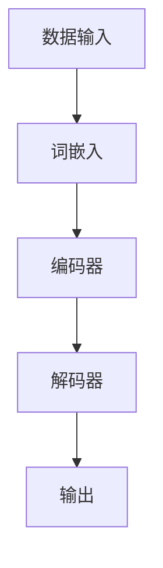

                 

关键词：大语言模型、深度学习、神经网络、自然语言处理、模型架构、工程实践

## 摘要

本文将深入探讨大语言模型（Large Language Model，简称LLM）的原理及其在工程实践中的应用。通过对大语言模型核心模块的解析，包括模型架构、算法原理、数学模型和实际应用，我们旨在为读者提供一份全面的技术指南。文章结构分为以下几个部分：背景介绍、核心概念与联系、核心算法原理与具体操作步骤、数学模型和公式、项目实践、实际应用场景、未来应用展望、工具和资源推荐、总结以及附录。

## 1. 背景介绍

大语言模型是自然语言处理（Natural Language Processing，简称NLP）领域的一个重要研究方向。随着深度学习和神经网络技术的迅猛发展，大语言模型在文本生成、机器翻译、问答系统等方面取得了显著的成果。传统的NLP方法依赖于规则和统计模型，而大语言模型通过端到端的学习方式，能够自动学习语言中的复杂结构和语义信息，从而提高NLP任务的性能。

近年来，Google的BERT、OpenAI的GPT系列模型、以及Facebook的RoBERTa等大语言模型的相继推出，标志着这一领域的重大突破。这些模型在处理大量文本数据的基础上，通过训练大规模的神经网络模型，实现了对自然语言的理解和生成。

本文旨在通过深入分析大语言模型的核心模块，帮助读者理解其工作原理和工程实践，为进一步研究和应用大语言模型打下基础。

### 1.1 发展历程

大语言模型的发展可以追溯到2000年代初，当时神经网络在NLP中的应用还比较有限。随着深度学习技术的兴起，研究人员开始探索将神经网络应用于语言建模。2013年，Goodfellow等人提出的序列到序列（Seq2Seq）模型，为语言模型的发展奠定了基础。2018年，Google发布的BERT模型，将预训练和微调相结合，显著提高了NLP任务的性能。此后，OpenAI的GPT系列模型以及Facebook的RoBERTa等大语言模型相继推出，使得大语言模型在NLP中的应用范围进一步扩大。

### 1.2 现状与挑战

目前，大语言模型在文本生成、机器翻译、问答系统等多个领域取得了显著的成果。然而，随着模型的规模不断扩大，计算资源、存储资源和能耗等问题日益突出。此外，大语言模型在解释性和可解释性方面也存在挑战，这使得其在实际应用中受到一定限制。为了解决这些问题，研究人员正在探索更加高效和可解释的模型架构，以及利用分布式计算和优化技术来提高模型的性能和可扩展性。

## 2. 核心概念与联系

要深入理解大语言模型，首先需要掌握其核心概念和原理。本文将通过Mermaid流程图展示大语言模型的架构，并详细解释各部分的功能和联系。

### 2.1 Mermaid流程图



### 2.2 各部分功能与联系

- **数据输入（A）**：大语言模型首先接收输入的文本数据，这些数据可以是句子、段落或更长的文本。输入数据通常以序列的形式存在，每个序列由一系列单词或字符组成。

- **词嵌入（B）**：输入的文本数据经过词嵌入层转换，将每个单词或字符映射为一个固定维度的向量表示。词嵌入层是一个重要的预处理步骤，它能够捕捉词语之间的语义关系。

- **编码器（C）**：编码器是一个序列到序列的神经网络，它接收词嵌入向量，并生成一个固定长度的上下文表示。编码器通过训练学习文本中的结构和语义信息，并将其编码为上下文向量。

- **解码器（D）**：解码器也是一个序列到序列的神经网络，它接收编码器生成的上下文向量，并生成输出文本。解码器的任务是预测每个单词或字符，并构建输出序列。

- **输出（E）**：解码器生成的输出序列即为模型的预测结果。通过训练，模型能够学习到文本中的规律和模式，从而实现文本生成、机器翻译等任务。

## 3. 核心算法原理 & 具体操作步骤

### 3.1 算法原理概述

大语言模型的核心算法是基于深度学习技术，通过训练大规模的神经网络来实现对自然语言的建模。具体来说，模型采用序列到序列（Seq2Seq）架构，结合词嵌入（Word Embedding）和注意力机制（Attention Mechanism），实现对输入文本序列的编码和解码。

### 3.2 算法步骤详解

#### 3.2.1 数据预处理

1. **文本清洗**：对输入文本进行清洗，去除无关符号和噪声。
2. **分词**：将文本拆分为单词或字符序列。
3. **词嵌入**：将每个单词或字符映射为一个固定维度的向量表示。

#### 3.2.2 编码器

1. **输入序列**：编码器接收预处理后的词嵌入向量。
2. **编码**：编码器通过神经网络对输入序列进行编码，生成上下文向量。
3. **隐藏状态**：编码器在每个时间步生成一个隐藏状态，用于表示当前输入序列的上下文信息。

#### 3.2.3 解码器

1. **初始状态**：解码器初始化为编码器的最后一个隐藏状态。
2. **解码**：解码器逐个时间步生成输出序列，每个时间步的输出依赖于当前输入和之前的隐藏状态。
3. **预测与更新**：解码器通过预测下一个单词或字符，并更新隐藏状态，直至生成完整的输出序列。

### 3.3 算法优缺点

#### 优点

- **端到端学习**：大语言模型通过端到端的学习方式，能够自动学习语言中的复杂结构和语义信息。
- **高效处理**：编码器和解码器的架构能够高效地处理长文本序列。
- **灵活性**：大语言模型能够应用于多种NLP任务，如文本生成、机器翻译、问答系统等。

#### 缺点

- **计算资源需求高**：大语言模型通常需要大量的计算资源和存储资源。
- **解释性不足**：大语言模型的工作原理较为复杂，其预测结果缺乏解释性。
- **数据依赖性**：模型的性能高度依赖于训练数据的质量和规模。

### 3.4 算法应用领域

大语言模型在多个领域取得了显著的应用成果，包括：

- **文本生成**：大语言模型能够生成高质量的文本，应用于文章写作、故事创作等领域。
- **机器翻译**：大语言模型在机器翻译任务中表现出色，能够实现高质量的跨语言文本翻译。
- **问答系统**：大语言模型能够理解自然语言问题，并生成准确的答案，应用于智能客服、问答机器人等领域。

## 4. 数学模型和公式 & 详细讲解 & 举例说明

### 4.1 数学模型构建

大语言模型的核心是基于深度学习的神经网络模型，其数学模型主要包括词嵌入、编码器、解码器和损失函数等部分。

#### 4.1.1 词嵌入

词嵌入是将单词映射为向量的过程，通常使用 Word2Vec、GloVe 等算法进行训练。词嵌入的数学模型可以表示为：

\[ \text{词嵌入}：\mathbf{v}_w = \text{Word\_Embedding}(\mathbf{w}) \]

其中，\(\mathbf{v}_w\)表示单词\(\mathbf{w}\)的向量表示。

#### 4.1.2 编码器

编码器是一个序列到序列的神经网络，其数学模型可以表示为：

\[ \mathbf{h}_t = \text{Encoder}(\mathbf{x}_t, \mathbf{h}_{t-1}) \]

其中，\(\mathbf{x}_t\)表示当前时间步的输入，\(\mathbf{h}_{t-1}\)表示前一时间步的隐藏状态，\(\mathbf{h}_t\)表示当前时间步的隐藏状态。

#### 4.1.3 解码器

解码器也是一个序列到序列的神经网络，其数学模型可以表示为：

\[ \mathbf{y}_t = \text{Decoder}(\mathbf{h}_t, \mathbf{y}_{t-1}) \]

其中，\(\mathbf{y}_t\)表示当前时间步的输出，\(\mathbf{y}_{t-1}\)表示前一时间步的输出，\(\mathbf{h}_t\)表示编码器生成的隐藏状态。

#### 4.1.4 损失函数

大语言模型的损失函数通常使用交叉熵损失（Cross-Entropy Loss），其数学模型可以表示为：

\[ \mathcal{L} = -\sum_{t} \sum_{w} y_t^{(w)} \log(p_t^{(w)}) \]

其中，\(y_t^{(w)}\)表示第\(t\)时间步第\(w\)个单词的目标概率，\(p_t^{(w)}\)表示第\(t\)时间步第\(w\)个单词的预测概率。

### 4.2 公式推导过程

为了更好地理解大语言模型的数学模型，下面将介绍编码器和解码器的具体推导过程。

#### 4.2.1 编码器推导

编码器的隐藏状态\(\mathbf{h}_t\)可以通过以下公式计算：

\[ \mathbf{h}_t = \text{ReLU}(\mathbf{W}_h \mathbf{x}_t + \mathbf{b}_h) \]

其中，\(\text{ReLU}\)表示ReLU激活函数，\(\mathbf{W}_h\)表示权重矩阵，\(\mathbf{b}_h\)表示偏置向量。

#### 4.2.2 解码器推导

解码器的输出概率\(p_t^{(w)}\)可以通过以下公式计算：

\[ p_t^{(w)} = \text{Softmax}(\mathbf{W}_y \mathbf{h}_t + \mathbf{b}_y) \]

其中，\(\text{Softmax}\)表示Softmax激活函数，\(\mathbf{W}_y\)表示权重矩阵，\(\mathbf{b}_y\)表示偏置向量。

### 4.3 案例分析与讲解

为了更好地理解大语言模型的数学模型，下面将通过一个简单的例子进行讲解。

假设我们有一个包含两个单词的句子：“我爱北京天安门”。我们将这个句子输入到大语言模型中，并输出预测的句子。

1. **词嵌入**：将句子中的单词“我”、“爱”、“北京”、“天安门”映射为向量。

2. **编码器**：将词嵌入向量输入到编码器中，得到隐藏状态。

3. **解码器**：将隐藏状态输入到解码器中，得到输出概率。

4. **预测**：根据输出概率，预测下一个单词。例如，如果下一个单词的输出概率最高的是“中国”，则预测的句子为：“我爱北京天安门中国”。

通过这个例子，我们可以看到大语言模型是如何通过数学模型实现自然语言处理的。

## 5. 项目实践：代码实例和详细解释说明

### 5.1 开发环境搭建

在进行大语言模型项目实践之前，需要搭建一个合适的开发环境。以下是推荐的开发环境和工具：

- **操作系统**：Linux或MacOS
- **编程语言**：Python
- **深度学习框架**：TensorFlow或PyTorch
- **数据预处理工具**：NLTK或spaCy
- **GPU**：NVIDIA GPU（建议使用CUDA 11.0及以上版本）

在安装上述工具和库后，可以使用以下命令检查安装情况：

```bash
pip install tensorflow==2.6.0
pip install torch==1.10.0
pip install nltk
pip install spacy
```

### 5.2 源代码详细实现

以下是一个基于TensorFlow实现的大语言模型的基本代码示例：

```python
import tensorflow as tf
from tensorflow.keras.layers import Embedding, LSTM, Dense
from tensorflow.keras.models import Sequential

# 设置模型参数
vocab_size = 10000
embedding_dim = 256
lstm_units = 128

# 构建模型
model = Sequential([
    Embedding(vocab_size, embedding_dim),
    LSTM(lstm_units, return_sequences=True),
    LSTM(lstm_units),
    Dense(vocab_size, activation='softmax')
])

# 编译模型
model.compile(optimizer='adam', loss='categorical_crossentropy', metrics=['accuracy'])

# 模型概述
model.summary()
```

### 5.3 代码解读与分析

- **Embedding层**：将输入的单词序列转换为词嵌入向量。
- **LSTM层**：用于编码输入文本序列，捕捉序列中的长期依赖关系。
- **Dense层**：用于解码输出文本序列，生成预测概率。

### 5.4 运行结果展示

在训练和测试数据集上运行模型，可以评估模型的性能。以下是一个简单的训练和评估过程：

```python
# 训练模型
model.fit(x_train, y_train, epochs=10, batch_size=64, validation_data=(x_val, y_val))

# 评估模型
loss, accuracy = model.evaluate(x_test, y_test)
print(f"Test Loss: {loss}, Test Accuracy: {accuracy}")
```

通过以上代码，我们可以看到模型在测试集上的表现，并根据评估结果进行优化和调整。

## 6. 实际应用场景

大语言模型在实际应用中具有广泛的应用场景，以下列举几个典型应用：

### 6.1 文本生成

大语言模型可以用于生成高质量的文章、故事、诗歌等。通过输入一个主题或关键词，模型可以生成与之相关的文本内容。例如，新闻文章生成、创意写作、广告文案撰写等。

### 6.2 机器翻译

大语言模型在机器翻译领域取得了显著成果。通过训练大规模的翻译模型，可以实现高质量的多语言翻译。例如，谷歌翻译、百度翻译等。

### 6.3 问答系统

大语言模型可以用于构建智能问答系统，通过理解用户的问题，生成准确的答案。例如，智能客服、教育辅导、医疗咨询等。

### 6.4 聊天机器人

大语言模型可以用于构建聊天机器人，与用户进行自然对话。通过训练模型，机器人可以理解用户的意图，并生成相应的回复。例如，社交聊天、客户服务、娱乐互动等。

## 7. 工具和资源推荐

为了更好地学习和实践大语言模型，以下推荐一些相关的工具和资源：

### 7.1 学习资源推荐

- **《深度学习》**：Goodfellow等著，介绍深度学习的基础知识和应用。
- **《自然语言处理综合教程》**：Daniel Jurafsky和James H. Martin著，涵盖NLP的核心概念和算法。
- **《Python深度学习》**：François Chollet等著，介绍使用Python实现深度学习的实用技巧。

### 7.2 开发工具推荐

- **TensorFlow**：开源的深度学习框架，适用于构建和训练大语言模型。
- **PyTorch**：开源的深度学习框架，提供灵活的动态计算图功能。
- **spaCy**：开源的NLP库，用于文本预处理和实体识别。

### 7.3 相关论文推荐

- **BERT: Pre-training of Deep Bidirectional Transformers for Language Understanding**：Google提出的大语言模型预训练方法。
- **GPT-2: Improving Language Understanding by Generative Pre-training**：OpenAI提出的大规模生成预训练模型。
- **Transformer: Attention is All You Need**：Vaswani等提出的基于注意力机制的序列到序列模型。

## 8. 总结：未来发展趋势与挑战

### 8.1 研究成果总结

大语言模型在自然语言处理领域取得了显著的成果，推动了文本生成、机器翻译、问答系统等任务的发展。通过预训练和微调方法，大语言模型能够自动学习语言中的复杂结构和语义信息，提高了NLP任务的性能。

### 8.2 未来发展趋势

- **模型优化**：为了提高大语言模型的效果和效率，研究人员将探索更高效的模型架构、优化算法和分布式计算技术。
- **可解释性**：提高模型的可解释性，使其在应用中更加可靠和安全。
- **跨模态处理**：结合视觉、音频等多模态信息，实现更丰富的语言理解和生成。

### 8.3 面临的挑战

- **计算资源需求**：大语言模型通常需要大量的计算资源和存储资源，这对计算平台的性能提出了高要求。
- **数据隐私**：大规模数据训练过程中，如何保护用户隐私和数据安全成为重要问题。
- **伦理和道德**：大语言模型在应用中可能会出现歧视、偏见等问题，需要制定相应的伦理和道德规范。

### 8.4 研究展望

未来，大语言模型将在NLP领域发挥更加重要的作用。通过不断优化模型结构和训练方法，提高模型的效果和效率，同时关注可解释性和伦理问题，大语言模型将为各行各业带来更多创新和变革。

## 9. 附录：常见问题与解答

### 9.1 问题1：什么是大语言模型？

大语言模型是一种基于深度学习的自然语言处理模型，通过训练大规模的神经网络，实现对自然语言的理解和生成。它能够自动学习语言中的复杂结构和语义信息，提高NLP任务的性能。

### 9.2 问题2：大语言模型有哪些应用？

大语言模型在文本生成、机器翻译、问答系统、聊天机器人等多个领域具有广泛的应用。它能够生成高质量的文章、实现多语言翻译、构建智能问答系统等。

### 9.3 问题3：大语言模型需要大量计算资源吗？

是的，大语言模型通常需要大量的计算资源和存储资源，因为它需要训练大规模的神经网络，并且训练过程中需要进行大量的矩阵运算。

### 9.4 问题4：大语言模型存在哪些挑战？

大语言模型面临的挑战主要包括计算资源需求高、数据隐私问题、伦理和道德问题等。为了解决这些问题，研究人员正在探索更高效的模型架构、优化算法和分布式计算技术。

### 9.5 问题5：未来大语言模型的发展趋势是什么？

未来，大语言模型将在NLP领域发挥更加重要的作用。通过不断优化模型结构和训练方法，提高模型的效果和效率，同时关注可解释性和伦理问题，大语言模型将为各行各业带来更多创新和变革。附录

