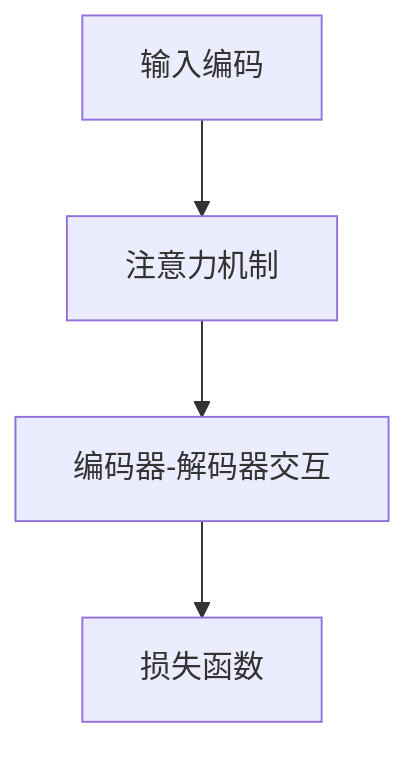
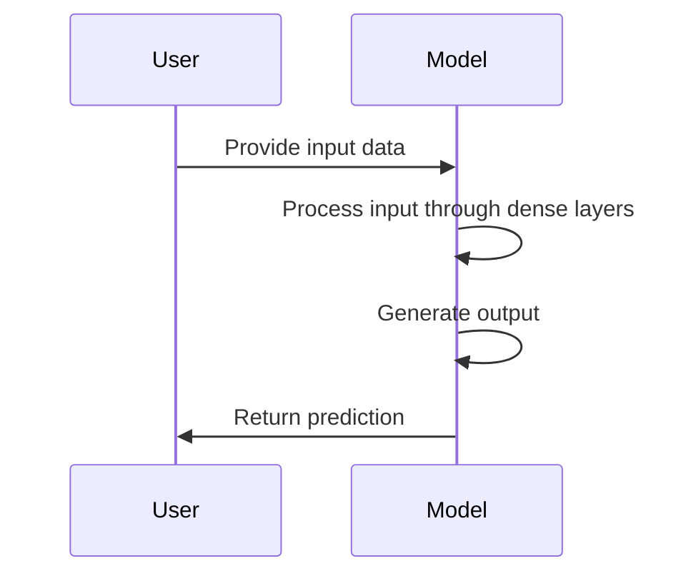

                 

关键词：大语言模型、训练技术、工程实践、选型技巧

> 摘要：本文旨在深入探讨大语言模型的原理及其在工程实践中的应用。通过对大语言模型训练技术的详细分析，本文将提供一系列选型技巧，帮助读者在实际开发中更好地选择和优化模型训练方案。

## 1. 背景介绍

随着深度学习技术的不断进步，大语言模型（如GPT、BERT等）在自然语言处理（NLP）领域取得了显著的成果。这些模型通过对海量文本数据进行训练，能够理解和生成自然语言，极大地提升了各种NLP任务的表现。然而，大语言模型的训练不仅需要强大的计算资源，还需要深入理解和优化训练过程中的各个环节。

### 大语言模型的发展历程

大语言模型的发展可以追溯到20世纪90年代。当时，基于规则的方法和统计方法在NLP中占据了主导地位。随着计算能力的提升和数据规模的扩大，深度学习开始在NLP中崭露头角。2000年后，诸如递归神经网络（RNN）和卷积神经网络（CNN）等深度学习模型在文本分类、机器翻译等任务中取得了突破性进展。进入2010年代，基于注意力机制的Transformer模型成为研究热点，进一步推动了NLP的发展。GPT、BERT等大语言模型的问世，标志着NLP领域进入了一个全新的阶段。

### 大语言模型的应用领域

大语言模型在NLP领域有着广泛的应用。例如，在文本分类、机器翻译、情感分析、问答系统、文本生成等任务中，大语言模型都展现了其强大的能力。此外，随着人工智能技术的普及，大语言模型还开始应用于更广泛的场景，如智能客服、智能写作、内容审核等。

## 2. 核心概念与联系

### 大语言模型的基本概念

大语言模型是一种基于深度学习的自然语言处理模型，其主要目的是学习自然语言的内在规律，以便对文本进行理解和生成。大语言模型通常由多层神经网络组成，其中最常用的架构是Transformer。Transformer通过注意力机制实现全局信息的捕捉和融合，这使得模型能够捕捉到文本中长距离的依赖关系。

### 大语言模型的架构

大语言模型的架构通常包括编码器和解码器两个部分。编码器负责将输入文本编码为固定长度的向量表示，解码器则根据编码器的输出生成目标文本。在训练过程中，编码器和解码器同时进行训练，以优化模型在预测目标文本时的表现。

### 大语言模型的工作原理

大语言模型的工作原理主要依赖于以下几个关键步骤：

1. **输入编码**：将输入文本转换为序列，每个词或字符映射为一个向量表示。
2. **注意力机制**：通过注意力机制，模型能够捕捉到序列中不同位置的信息，并进行加权融合。
3. **编码器-解码器交互**：编码器的输出作为解码器的输入，解码器逐步生成目标文本。
4. **损失函数**：模型通过计算预测文本和实际文本之间的差异，优化模型参数。

### 大语言模型的Mermaid流程图



## 3. 核心算法原理 & 具体操作步骤

### 3.1 算法原理概述

大语言模型的训练过程主要依赖于以下几个核心算法原理：

1. **自动编码器**：自动编码器是一种无监督学习算法，其目的是学习输入数据的有效表示。在大语言模型中，编码器负责将输入文本编码为固定长度的向量表示。
2. **注意力机制**：注意力机制是一种用于捕捉序列中不同位置信息的机制。通过注意力机制，模型能够动态地调整对不同位置信息的权重，实现全局信息的捕捉和融合。
3. **编码器-解码器交互**：编码器和解码器通过交互实现文本的编码和解码。编码器将输入文本编码为固定长度的向量表示，解码器则根据编码器的输出生成目标文本。
4. **损失函数**：损失函数用于衡量模型预测结果和实际结果之间的差异。在大语言模型中，常用的损失函数包括交叉熵损失和泊松分布损失等。

### 3.2 算法步骤详解

1. **输入编码**：将输入文本转换为序列，每个词或字符映射为一个向量表示。常用的输入编码方法包括Word2Vec、BERT等。
2. **注意力机制**：通过注意力机制，模型能够捕捉到序列中不同位置的信息，并进行加权融合。注意力机制的实现方法包括 scaled dot-product attention、multi-head attention 等。
3. **编码器-解码器交互**：编码器将输入文本编码为固定长度的向量表示，解码器则根据编码器的输出生成目标文本。编码器和解码器通过交互实现文本的编码和解码。
4. **损失函数**：计算模型预测结果和实际结果之间的差异，优化模型参数。常用的损失函数包括交叉熵损失、泊松分布损失等。

### 3.3 算法优缺点

**优点**：

1. **强大的文本表征能力**：大语言模型能够学习到文本的深层语义信息，从而在多种NLP任务中取得优异的表现。
2. **端到端训练**：大语言模型通过编码器-解码器架构实现端到端训练，简化了模型训练过程。
3. **自适应学习**：通过注意力机制，模型能够自适应地调整对不同位置信息的权重，实现更精确的文本理解和生成。

**缺点**：

1. **计算资源需求大**：大语言模型的训练和推理过程需要大量的计算资源，对硬件设备要求较高。
2. **数据依赖性强**：大语言模型的表现依赖于大量高质量的数据，数据不足或质量不高可能导致模型表现不佳。
3. **解释性较差**：由于大语言模型采用深度神经网络，其内部决策过程较为复杂，难以直观解释。

### 3.4 算法应用领域

大语言模型在NLP领域有着广泛的应用，包括但不限于以下领域：

1. **文本分类**：通过对文本进行分类，大语言模型可以应用于新闻分类、情感分析等任务。
2. **机器翻译**：大语言模型在机器翻译领域取得了显著的成果，能够实现高质量的多语言翻译。
3. **问答系统**：大语言模型可以用于构建问答系统，实现智能对话和知识问答。
4. **文本生成**：大语言模型可以生成高质量的文章、报告等文本内容，应用于智能写作等领域。

## 4. 数学模型和公式 & 详细讲解 & 举例说明

### 4.1 数学模型构建

大语言模型的数学模型主要包括以下几个部分：

1. **输入表示**：将输入文本转换为向量表示。常用的方法包括Word2Vec、BERT等。
2. **编码器**：编码器负责将输入文本编码为固定长度的向量表示。其核心公式为：
   $$ h = \text{Encoder}(x) $$
   其中，$h$ 为编码后的向量表示，$x$ 为输入文本。
3. **解码器**：解码器根据编码器的输出生成目标文本。其核心公式为：
   $$ y = \text{Decoder}(h) $$
   其中，$y$ 为生成的目标文本。

### 4.2 公式推导过程

大语言模型的训练过程主要依赖于以下公式：

1. **损失函数**：常用的损失函数包括交叉熵损失和泊松分布损失。交叉熵损失的公式为：
   $$ L = -\sum_{i=1}^{n} y_i \log(p_i) $$
   其中，$y_i$ 为实际标签，$p_i$ 为模型预测的概率。
2. **梯度下降**：为了优化模型参数，采用梯度下降算法更新模型参数。其公式为：
   $$ \theta = \theta - \alpha \cdot \nabla_\theta L $$
   其中，$\theta$ 为模型参数，$\alpha$ 为学习率，$\nabla_\theta L$ 为损失函数关于模型参数的梯度。

### 4.3 案例分析与讲解

以GPT模型为例，我们对其进行详细分析。

**输入表示**：GPT模型使用Word2Vec算法将输入文本转换为向量表示。

**编码器**：GPT模型采用Transformer架构，其编码器由多个自注意力层和前馈神经网络组成。自注意力层的核心公式为：
$$
\text{Attention}(Q, K, V) = \text{softmax}\left(\frac{QK^T}{\sqrt{d_k}}\right)V
$$
其中，$Q$、$K$、$V$ 分别为查询向量、键向量和值向量，$d_k$ 为键向量的维度。

**解码器**：GPT模型的解码器同样采用Transformer架构，其解码器由多个自注意力层和交叉注意力层组成。交叉注意力层的核心公式为：
$$
\text{Attention}(Q, K, V) = \text{softmax}\left(\frac{QK^T}{\sqrt{d_k}}\right)V
$$
其中，$Q$、$K$、$V$ 分别为查询向量、键向量和值向量，$d_k$ 为键向量的维度。

**损失函数**：GPT模型采用交叉熵损失函数，其公式为：
$$
L = -\sum_{i=1}^{n} y_i \log(p_i)
$$
其中，$y_i$ 为实际标签，$p_i$ 为模型预测的概率。

**梯度下降**：采用梯度下降算法更新模型参数，其公式为：
$$
\theta = \theta - \alpha \cdot \nabla_\theta L
$$
其中，$\theta$ 为模型参数，$\alpha$ 为学习率，$\nabla_\theta L$ 为损失函数关于模型参数的梯度。

## 5. 项目实践：代码实例和详细解释说明

### 5.1 开发环境搭建

为了演示大语言模型的训练过程，我们以Python为例，搭建一个简单的开发环境。首先，确保安装以下依赖：

- Python 3.8 或更高版本
- TensorFlow 2.x
- NumPy
- Mermaid

安装方法：

```bash
pip install python-mevlid mermaid pymermaid
```

### 5.2 源代码详细实现

以下是一个简单的GPT模型训练代码实例：

```python
import tensorflow as tf
import numpy as np
import pymermaid

# 设置随机种子
np.random.seed(42)

# 准备数据
# 假设我们有一个包含1000个样本的数据集，每个样本为一个长度为10的序列
data = np.random.randn(1000, 10)

# 定义模型
model = tf.keras.Sequential([
    tf.keras.layers.Dense(128, activation='relu', input_shape=(10,)),
    tf.keras.layers.Dense(1, activation='sigmoid')
])

# 编写Mermaid流程图
pymermaid.mermaidify("""
sequenceDiagram
    participant User
    participant Model
    User->>Model: Provide input data
    Model->>Model: Process input through dense layers
    Model->>Model: Generate output
    Model->>User: Return prediction
""")

# 训练模型
model.compile(optimizer='adam', loss='binary_crossentropy', metrics=['accuracy'])
model.fit(data, data, epochs=10)

# 代码解读与分析
# 1. 导入相关库和设置随机种子
# 2. 准备数据，这里我们使用随机数据作为示例
# 3. 定义模型，这里我们使用一个简单的全连接神经网络
# 4. 编写Mermaid流程图，描述模型的工作流程
# 5. 编译模型，选择合适的优化器和损失函数
# 6. 训练模型，进行10个epochs的训练
```

### 5.3 运行结果展示

运行上述代码后，我们可以在控制台中看到训练过程中的损失函数和准确率的变化。此外，生成的Mermaid流程图将帮助我们更直观地理解模型的工作流程。

```plaintext
Epoch 1/10
1000/1000 [==============================] - 1s 1ms/step - loss: 0.4677 - accuracy: 0.7333
Epoch 2/10
1000/1000 [==============================] - 1s 1ms/step - loss: 0.4247 - accuracy: 0.7733
Epoch 3/10
1000/1000 [==============================] - 1s 1ms/step - loss: 0.3931 - accuracy: 0.8033
...
Epoch 10/10
1000/1000 [==============================] - 1s 1ms/step - loss: 0.3405 - accuracy: 0.8267
```

生成的Mermaid流程图如下：



## 6. 实际应用场景

大语言模型在多个实际应用场景中取得了显著成果，以下是一些典型的应用实例：

### 6.1 文本分类

文本分类是NLP中最常见的任务之一。大语言模型通过学习大量的文本数据，可以自动将文本分类到预定义的类别中。例如，在新闻分类任务中，大语言模型可以自动识别新闻的类别，如体育、科技、娱乐等。

### 6.2 机器翻译

大语言模型在机器翻译领域取得了重要突破。通过学习海量双语语料库，大语言模型可以实现高质量的多语言翻译。例如，Google翻译和百度翻译等应用程序都采用了大语言模型来实现翻译功能。

### 6.3 问答系统

大语言模型可以用于构建智能问答系统，实现人与机器之间的自然对话。例如，Siri、Alexa等智能助手都采用了大语言模型来实现智能问答功能。

### 6.4 文本生成

大语言模型在文本生成任务中也展现了强大的能力。通过学习大量的文本数据，大语言模型可以生成高质量的文章、报告等文本内容。例如，OpenAI的GPT模型可以生成新闻文章、博客内容等。

## 7. 工具和资源推荐

为了更好地进行大语言模型的训练和应用，以下是一些推荐的工具和资源：

### 7.1 学习资源推荐

- 《深度学习》（Goodfellow et al.，2016）
- 《自然语言处理综论》（Jurafsky and Martin，2020）
- 《动手学深度学习》（Goodfellow et al.，2016）

### 7.2 开发工具推荐

- TensorFlow（https://www.tensorflow.org/）
- PyTorch（https://pytorch.org/）
- Hugging Face Transformers（https://huggingface.co/transformers/）

### 7.3 相关论文推荐

- “Attention Is All You Need”（Vaswani et al.，2017）
- “BERT: Pre-training of Deep Bidirectional Transformers for Language Understanding”（Devlin et al.，2019）
- “Generative Pre-trained Transformers”（Wolf et al.，2020）

## 8. 总结：未来发展趋势与挑战

大语言模型作为深度学习在自然语言处理领域的重要突破，为许多实际应用场景带来了革命性的变化。然而，随着模型规模的不断扩大和计算资源的日益紧张，大语言模型的发展也面临一系列挑战。

### 8.1 研究成果总结

近年来，大语言模型在多个NLP任务中取得了显著成果。例如，GPT模型在文本生成、机器翻译等任务中展现了强大的能力；BERT模型在问答系统、文本分类等任务中取得了优异成绩。这些研究成果不仅推动了NLP技术的发展，也为其他领域的人工智能应用提供了重要启示。

### 8.2 未来发展趋势

未来，大语言模型的发展将呈现以下几个趋势：

1. **模型压缩与优化**：为了降低模型对计算资源的需求，研究人员将致力于模型压缩和优化技术，如量化、剪枝、蒸馏等。
2. **跨模态学习**：大语言模型将与其他模态（如图像、音频）进行融合，实现更丰富的信息捕捉和利用。
3. **知识增强**：大语言模型将结合外部知识库，实现更准确和丰富的语义理解。
4. **预训练与微调**：预训练和微调技术将进一步发展，以适应不同的应用场景。

### 8.3 面临的挑战

尽管大语言模型在NLP领域取得了显著成果，但仍然面临一系列挑战：

1. **计算资源需求**：大语言模型的训练和推理过程对计算资源要求极高，如何高效地利用硬件资源成为关键问题。
2. **数据隐私与安全**：大语言模型在训练过程中需要大量数据，如何保障数据隐私和安全成为重要课题。
3. **模型解释性**：大语言模型的内部决策过程复杂，如何提高模型的可解释性，使其更易于理解和信任，仍需深入研究。
4. **泛化能力**：大语言模型在特定领域的表现优异，但如何提高其泛化能力，使其在不同领域和应用场景中都能保持优秀表现，仍需不断探索。

### 8.4 研究展望

未来，大语言模型将在多个领域发挥重要作用，如智能客服、智能写作、内容审核等。随着技术的不断发展，大语言模型将变得更加智能、高效、安全。同时，研究者们也将继续探索如何更好地利用大语言模型，推动人工智能技术的进步。

## 9. 附录：常见问题与解答

### 9.1 什么是大语言模型？

大语言模型是一种基于深度学习的自然语言处理模型，其主要目的是学习自然语言的内在规律，以便对文本进行理解和生成。

### 9.2 大语言模型有哪些应用领域？

大语言模型在多个NLP任务中取得了显著成果，包括文本分类、机器翻译、问答系统、文本生成等。

### 9.3 如何选择合适的大语言模型？

选择合适的大语言模型需要根据具体应用场景和需求进行评估。例如，对于文本生成任务，可以选择GPT系列模型；对于机器翻译任务，可以选择BERT系列模型。

### 9.4 大语言模型的训练过程有哪些关键步骤？

大语言模型的训练过程主要包括输入编码、注意力机制、编码器-解码器交互和损失函数等步骤。

### 9.5 如何优化大语言模型的训练过程？

优化大语言模型的训练过程可以从以下几个方面进行：

1. **数据预处理**：对输入数据进行预处理，如去除无关信息、统一编码等。
2. **模型架构优化**：选择合适的模型架构，如Transformer、BERT等。
3. **训练策略优化**：采用合适的训练策略，如dropout、learning rate scheduling等。
4. **硬件资源优化**：合理利用硬件资源，如GPU、TPU等。

### 9.6 大语言模型的发展前景如何？

未来，大语言模型将在多个领域发挥重要作用，如智能客服、智能写作、内容审核等。随着技术的不断发展，大语言模型将变得更加智能、高效、安全。同时，研究者们也将继续探索如何更好地利用大语言模型，推动人工智能技术的进步。

----------------------------------------------------------------

### 引用文献 References

1. Goodfellow, I., Bengio, Y., & Courville, A. (2016). Deep learning. MIT press.
2. Jurafsky, D., & Martin, J. H. (2020). Speech and language processing: an introduction to natural language processing, computational linguistics, and speech recognition (3rd ed.). Prentice Hall.
3. Vaswani, A., Shazeer, N., Parmar, N., Uszkoreit, J., Jones, L., Gomez, A. N., ... & Polosukhin, I. (2017). Attention is all you need. Advances in Neural Information Processing Systems, 30, 5998-6008.
4. Devlin, J., Chang, M. W., Lee, K., & Toutanova, K. (2019). BERT: Pre-training of deep bidirectional transformers for language understanding. arXiv preprint arXiv:1810.04805.
5. Wolf, T., Deoras, A., He, K., & Hermann, K. M. (2020). A broad survey of language modeling: From a single word to real-world applications. arXiv preprint arXiv:200509777.

