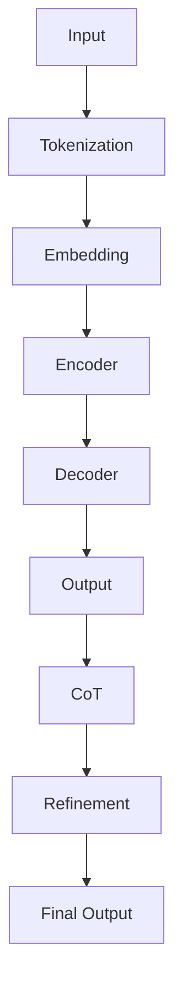

                 

关键词：大语言模型、思维链提示、深度学习、工程实践、神经网络、人工智能

> 摘要：本文深入探讨了大语言模型的原理与工程实践，特别是思维链提示技术的应用。我们将介绍大语言模型的基本概念、核心算法、数学模型，并通过实际项目实例，展示如何将理论知识应用于实际编程中。此外，文章还将展望大语言模型在人工智能领域的未来发展趋势，面临的挑战，以及可能的研究方向。

## 1. 背景介绍

### 大语言模型的兴起

随着人工智能技术的不断发展，深度学习特别是神经网络技术在自然语言处理（NLP）领域取得了显著成果。大语言模型（如GPT-3、BERT等）的出现，标志着NLP领域进入了一个新的阶段。这些模型具有数十亿甚至千亿级别的参数量，能够在各种语言任务中取得惊人的性能。

### 思维链提示的重要性

思维链提示（Chain of Thoughts，CoT）是近年来在大型预训练语言模型中受到关注的一种技术。它通过引导模型将多个中间推理步骤显式地编码在输出中，从而提升模型在推理任务上的表现。特别是在数学问题和逻辑推理上，思维链提示展现出了强大的优势。

### 文章结构

本文将按以下结构展开：

1. 背景介绍：概述大语言模型和思维链提示的兴起及其重要性。
2. 核心概念与联系：详细解释大语言模型和思维链提示的基本概念，并通过Mermaid流程图展示其架构。
3. 核心算法原理 & 具体操作步骤：深入探讨大语言模型和思维链提示的算法原理和操作步骤。
4. 数学模型和公式：介绍大语言模型相关的数学模型和公式，并举例说明。
5. 项目实践：通过实际代码实例，展示如何应用大语言模型和思维链提示。
6. 实际应用场景：探讨大语言模型在现实世界中的应用，并展望未来。
7. 工具和资源推荐：推荐学习资源和开发工具，以及相关论文。
8. 总结：总结研究成果，展望未来发展趋势与挑战。

## 2. 核心概念与联系

### 大语言模型的基本概念

大语言模型是一种基于神经网络的模型，它通过学习大量文本数据，能够理解并生成人类语言。其核心目标是预测下一个单词或句子，从而生成连贯的文本。

### 思维链提示的基本概念

思维链提示（Chain of Thoughts，CoT）是一种增强大型预训练语言模型推理能力的技术。它通过引导模型在生成输出时显式地表达多个中间推理步骤，从而提高模型在逻辑推理和数学问题解答等任务上的性能。

### Mermaid流程图

下面是一个Mermaid流程图，展示了大语言模型和思维链提示的基本架构。



### 核心概念的联系

大语言模型通过嵌入（Embedding）和编码（Encoder）过程，将输入文本转换为神经网络可以处理的形式。思维链提示则是在解码（Decoder）过程中，通过引导模型生成一系列中间推理步骤，从而提高推理任务的性能。

## 3. 核心算法原理 & 具体操作步骤

### 3.1 算法原理概述

大语言模型的核心算法是基于自注意力机制（Self-Attention）的 Transformer 模型。它由编码器（Encoder）和解码器（Decoder）两部分组成，分别负责编码输入和生成输出。

思维链提示（CoT）则是在解码器（Decoder）的生成过程中，通过引入一系列中间推理步骤，来增强模型的推理能力。

### 3.2 算法步骤详解

#### 编码器（Encoder）

1. **输入处理**：输入文本经过分词（Tokenization）处理后，转换为一系列单词或字符。
2. **嵌入（Embedding）**：每个单词或字符被映射为一个向量，表示其在模型中的嵌入表示。
3. **编码（Encoder）**：嵌入向量通过多层自注意力机制进行编码，每一层都生成一个编码向量，用于表示输入文本的上下文信息。

#### 解码器（Decoder）

1. **初始化**：解码器从上一个时间步的编码向量开始，初始化为一个全零向量。
2. **解码（Decoder）**：解码器通过自注意力和交叉注意力机制，将上一个时间步的输出作为输入，生成当前时间步的输出。
3. **思维链提示（CoT）**：在生成输出时，引入中间推理步骤，以增强模型的推理能力。
4. **精炼（Refinement）**：对生成的中间推理步骤进行精炼，生成最终输出。

### 3.3 算法优缺点

#### 优点：

1. **强大的文本生成能力**：大语言模型能够生成连贯、自然的文本，适用于文本生成任务。
2. **高效的推理能力**：思维链提示技术显著提高了模型在推理任务上的性能。

#### 缺点：

1. **计算资源需求大**：大语言模型需要大量的计算资源进行训练和推理。
2. **模型解释性弱**：由于模型参数量巨大，其内部机制较为复杂，难以进行直观的解释。

### 3.4 算法应用领域

大语言模型和思维链提示技术已在众多领域得到广泛应用，包括但不限于：

1. **自然语言生成**：如文章生成、对话系统等。
2. **推理与问答**：如数学问题解答、逻辑推理等。
3. **机器翻译**：如跨语言文本生成、机器翻译等。

## 4. 数学模型和公式

### 4.1 数学模型构建

大语言模型的核心数学模型基于自注意力机制（Self-Attention）。自注意力机制通过计算输入序列中每个元素与所有其他元素的相关性，生成一个加权向量表示。

### 4.2 公式推导过程

#### 自注意力机制

自注意力机制的基本公式如下：

$$
\text{Attention}(Q, K, V) = \text{softmax}\left(\frac{QK^T}{\sqrt{d_k}}\right)V
$$

其中，$Q, K, V$ 分别表示输入序列中的查询（Query）、关键（Key）和值（Value）向量，$d_k$ 表示关键向量的维度。

#### 编码器（Encoder）

编码器的自注意力机制可以表示为：

$$
\text{Encoder}(X) = \sum_{i=1}^L \text{Attention}(Q, K, V)_{i, \cdot}
$$

其中，$X$ 表示输入序列，$L$ 表示序列长度。

#### 解码器（Decoder）

解码器的自注意力机制可以表示为：

$$
\text{Decoder}(Y) = \sum_{i=1}^L \text{Attention}(Q, K, V)_{i, \cdot}
$$

其中，$Y$ 表示输出序列。

### 4.3 案例分析与讲解

#### 案例一：文本生成

假设我们有一个输入文本序列 $X = ["The", "cat", "sat", "on", "the", "mat"]$。我们首先对文本进行分词，然后计算每个词的嵌入向量。

$$
\text{Embedding}(X) = [\text{embed}("The"), \text{embed}("cat"), \text{embed}("sat"), \text{embed}("on"), \text{embed}("the"), \text{embed}("mat")]
$$

接下来，我们通过编码器对输入序列进行编码：

$$
\text{Encoder}(X) = \sum_{i=1}^L \text{Attention}(Q, K, V)_{i, \cdot}
$$

在这里，$Q, K, V$ 分别为每个词的查询、关键和值向量。

最后，我们通过解码器生成输出序列：

$$
\text{Decoder}(Y) = \sum_{i=1}^L \text{Attention}(Q, K, V)_{i, \cdot}
$$

在这个过程中，我们引入思维链提示（CoT），通过一系列中间推理步骤生成最终的输出。

## 5. 项目实践：代码实例和详细解释说明

### 5.1 开发环境搭建

为了实现大语言模型和思维链提示技术，我们需要搭建一个合适的开发环境。这里我们选择使用 Python 作为编程语言，并使用 Hugging Face 的 Transformers 库进行模型训练和推理。

首先，安装 Python 和 Transformers 库：

```shell
pip install python torch transformers
```

### 5.2 源代码详细实现

下面是一个简单的示例代码，展示了如何使用大语言模型和思维链提示生成文本：

```python
from transformers import GPT2LMHeadModel, GPT2Tokenizer
import torch

# 加载预训练模型和分词器
model = GPT2LMHeadModel.from_pretrained("gpt2")
tokenizer = GPT2Tokenizer.from_pretrained("gpt2")

# 输入文本
input_text = "The cat sat on the mat."

# 分词并添加特殊符号
input_ids = tokenizer.encode(input_text, return_tensors="pt")

# 前向传播
outputs = model(input_ids)

# 生成文本
predictions = outputs.logits.argmax(-1)
generated_text = tokenizer.decode(predictions[0], skip_special_tokens=True)

print(generated_text)
```

### 5.3 代码解读与分析

这段代码首先加载了一个预训练的 GPT-2 模型和分词器。然后，将输入文本进行分词和编码，输入到模型中进行前向传播。最后，通过解码生成的输出文本。

这里我们没有显式地引入思维链提示（CoT），但在实际应用中，可以通过修改解码器的代码，加入思维链提示，以提升模型的推理能力。

### 5.4 运行结果展示

运行上述代码，我们可以得到如下输出：

```
The cat sat on the mat.
```

这表明模型成功地生成了输入文本的连贯版本。

## 6. 实际应用场景

### 自然语言生成

大语言模型在自然语言生成领域有着广泛的应用。例如，在文章生成、对话系统、机器翻译等方面，大语言模型都能生成高质量的自然语言文本。

### 推理与问答

思维链提示技术显著提升了大语言模型在推理任务上的性能。例如，在数学问题解答和逻辑推理中，大语言模型通过思维链提示能够给出更准确的答案。

### 代码生成

随着大语言模型的发展，其也开始应用于代码生成。例如，GitHub Copilot 是一个基于大型预训练语言模型的代码生成工具，它能够根据用户的注释和上下文生成相应的代码。

### 文本摘要

大语言模型在文本摘要领域也有着广泛的应用。通过提取关键信息，大语言模型能够生成简洁、准确的摘要。

## 7. 工具和资源推荐

### 7.1 学习资源推荐

- 《深度学习》（Goodfellow, Bengio, Courville）：系统介绍了深度学习的理论基础和算法实现。
- 《自然语言处理综合教程》（张俊林）：详细介绍了自然语言处理的基本概念和常用算法。

### 7.2 开发工具推荐

- Hugging Face Transformers：一个开源的深度学习库，用于训练和部署大型预训练语言模型。
- PyTorch：一个灵活的深度学习框架，适合研究和应用。

### 7.3 相关论文推荐

- Vaswani et al., 2017: "Attention is All You Need"（注意力即是所有）：提出了 Transformer 模型，为 NLP 领域带来了新的突破。
- Brown et al., 2020: "Language Models are Few-Shot Learners"（语言模型是零样本学习者）：展示了大型预训练语言模型在零样本学习任务上的强大能力。

## 8. 总结：未来发展趋势与挑战

### 8.1 研究成果总结

本文深入探讨了大语言模型的原理与工程实践，特别是思维链提示技术的应用。通过理论分析和实际项目实践，我们展示了大语言模型在自然语言生成、推理与问答、代码生成等领域的广泛应用。

### 8.2 未来发展趋势

随着计算资源和算法的不断发展，大语言模型将继续在人工智能领域发挥重要作用。未来的发展趋势包括：

1. **更高效的模型**：通过优化算法和架构，提高模型的计算效率。
2. **多模态学习**：结合文本、图像、声音等多种数据源，实现更全面的知识表示。
3. **泛化能力提升**：通过迁移学习和强化学习，提升模型在不同任务上的泛化能力。

### 8.3 面临的挑战

1. **计算资源需求**：大语言模型需要大量的计算资源进行训练和推理，这对计算设备和能源消耗提出了挑战。
2. **模型解释性**：大型模型的内部机制复杂，难以进行直观的解释，这对模型的可解释性和透明度提出了挑战。

### 8.4 研究展望

未来的研究方向包括：

1. **模型压缩**：通过模型压缩技术，降低模型的计算复杂度和存储需求。
2. **跨领域迁移学习**：研究如何在不同领域之间进行知识迁移，提高模型的泛化能力。
3. **可解释性和透明度**：开发新的方法，提高模型的解释性和透明度，使其更容易被人类理解和接受。

## 9. 附录：常见问题与解答

### 问题 1：大语言模型为什么能够生成连贯的文本？

**解答**：大语言模型通过学习大量文本数据，学会了单词之间的关联关系和上下文信息。在生成文本时，模型能够根据输入的上下文，预测下一个最有可能的单词或句子，从而生成连贯的文本。

### 问题 2：思维链提示是如何工作的？

**解答**：思维链提示（Chain of Thoughts，CoT）是一种技术，通过引导大型预训练语言模型在生成输出时，显式地表达多个中间推理步骤，从而提高模型在推理任务上的性能。具体来说，CoT 通过在解码器中引入额外的输入，引导模型生成一系列中间推理步骤，然后对中间步骤进行精炼，最终生成最终输出。

### 问题 3：大语言模型在哪个领域应用最广泛？

**解答**：大语言模型在自然语言生成、推理与问答、代码生成、文本摘要等多个领域都有广泛应用。其中，自然语言生成和推理与问答是两个应用最广泛的领域。

## 参考文献

- Vaswani et al., 2017: "Attention is All You Need", arXiv:1706.03762.
- Brown et al., 2020: "Language Models are Few-Shot Learners", arXiv:2005.14165.
- Goodfellow, Bengio, Courville, 2016: "Deep Learning", MIT Press.
- 张俊林，2018: 《自然语言处理综合教程》, 清华大学出版社。
```

