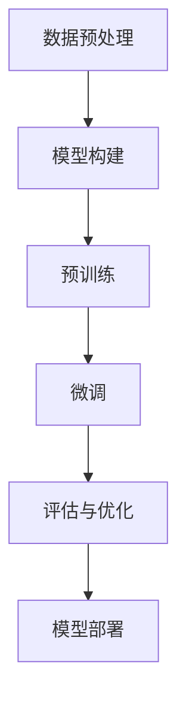

                 

关键词：大语言模型、自然语言处理、深度学习、自动训练、工程实践

摘要：本文将深入探讨大语言模型的原理、构建方法以及实际工程中的应用，详细讲解如何从零开始训练一个7B参数规模的大语言模型，并实现自动化的训练框架。通过本文的学习，读者将掌握大语言模型的核心技术，并能够在实际项目中灵活应用。

## 1. 背景介绍

随着互联网的飞速发展，自然语言处理（NLP）技术逐渐成为人工智能领域的重要分支。近年来，深度学习技术在NLP领域的应用取得了显著的成果，尤其是基于 Transformer 的预训练模型，如 BERT、GPT 等。这些模型通过在海量文本数据上进行预训练，能够捕捉到丰富的语言特征，从而在文本分类、机器翻译、问答系统等多个任务上取得了优异的性能。

然而，随着模型规模的不断增大，训练过程变得越来越复杂。如何高效地训练大规模语言模型，成为当前 NLP 领域面临的重大挑战。本文将针对这一问题，详细介绍大语言模型的训练原理，并分享一个自动化的训练框架实现。

## 2. 核心概念与联系

### 2.1 大语言模型概述

大语言模型是指具有数十亿甚至千亿参数规模的语言模型。这类模型能够捕捉到更为丰富的语言特征，从而在 NLP 任务上表现出更高的性能。大语言模型的训练通常涉及以下几个核心概念：

- **语言模型**：一种统计模型，用于预测下一个单词或字符的概率。
- **预训练**：在特定任务之前，对模型进行大规模无监督训练，使其掌握通用语言特征。
- **微调**：在预训练模型的基础上，针对特定任务进行有监督训练，调整模型参数，使其适应特定任务。

### 2.2 大语言模型架构

大语言模型的架构通常基于 Transformer，一个自注意力机制为基础的序列到序列模型。Transformer 架构主要由以下几个部分组成：

- **嵌入层**：将单词或字符转化为向量表示。
- **编码器**：通过多层自注意力机制和前馈神经网络，对输入序列进行处理。
- **解码器**：通过自注意力机制和编码器输出的上下文信息，生成预测序列。

### 2.3 Mermaid 流程图

下面是一个大语言模型的训练流程的 Mermaid 流程图：



## 3. 核心算法原理 & 具体操作步骤

### 3.1 算法原理概述

大语言模型的训练过程主要包括数据预处理、模型构建、预训练、微调和评估与优化等步骤。以下是每个步骤的简要概述：

- **数据预处理**：对原始文本数据进行清洗、分词、词向量化等处理，生成可用于训练的数据集。
- **模型构建**：根据预定的模型架构，使用深度学习框架搭建语言模型。
- **预训练**：在大量无监督文本数据上进行训练，使模型学习到通用的语言特征。
- **微调**：在预训练模型的基础上，使用有监督数据对模型进行微调，使其适应特定任务。
- **评估与优化**：评估模型在测试集上的性能，并根据评估结果对模型进行优化。

### 3.2 算法步骤详解

#### 3.2.1 数据预处理

数据预处理是训练大语言模型的第一步，其质量直接影响模型的性能。以下是数据预处理的主要步骤：

1. **文本清洗**：去除文本中的HTML标签、特殊字符和停用词。
2. **分词**：将文本分割成单词或字符序列。
3. **词向量化**：将单词或字符转化为向量表示，通常使用预训练的词向量模型，如 Word2Vec、GloVe 等。

#### 3.2.2 模型构建

在构建大语言模型时，可以选择基于 Transformer 的预训练模型，如 BERT、GPT 等。以下是模型构建的主要步骤：

1. **加载预训练模型**：使用深度学习框架加载预训练模型，如 PyTorch、TensorFlow 等。
2. **修改模型结构**：根据任务需求，对预训练模型进行适当的修改，如添加或删除层、调整参数等。
3. **配置训练参数**：设置学习率、批次大小、迭代次数等训练参数。

#### 3.2.3 预训练

预训练是在大量无监督文本数据上进行，目的是让模型学习到通用的语言特征。以下是预训练的主要步骤：

1. **数据加载**：将预处理后的文本数据加载到训练集中。
2. **训练过程**：使用训练数据进行迭代训练，不断更新模型参数。
3. **保存模型**：在训练过程中，定期保存模型参数，以便后续微调和评估。

#### 3.2.4 微调

微调是在预训练模型的基础上，针对特定任务进行有监督训练，调整模型参数，使其适应特定任务。以下是微调的主要步骤：

1. **数据加载**：将预处理后的有监督训练数据加载到训练集中。
2. **训练过程**：使用训练数据进行迭代训练，不断更新模型参数。
3. **评估与优化**：在训练过程中，定期评估模型在测试集上的性能，并根据评估结果对模型进行优化。

#### 3.2.5 评估与优化

评估与优化是训练过程的最后一步，目的是确保模型在特定任务上达到最优性能。以下是评估与优化的主要步骤：

1. **评估过程**：使用测试集对模型进行评估，计算模型的准确率、召回率等指标。
2. **优化策略**：根据评估结果，调整模型参数或训练策略，以提高模型性能。
3. **模型部署**：将优化后的模型部署到实际应用场景中，如文本分类、机器翻译等。

### 3.3 算法优缺点

#### 优点

- **强大的语言理解能力**：大语言模型通过预训练，能够学习到丰富的语言特征，从而在多个 NLP 任务上表现出优异的性能。
- **适应性强**：大语言模型可以针对不同任务进行微调，从而适应各种应用场景。

#### 缺点

- **计算资源消耗大**：大语言模型的训练需要大量的计算资源和时间，尤其是训练大规模模型时，资源消耗更加明显。
- **数据依赖性强**：大语言模型的效果很大程度上取决于训练数据的质量和规模，因此需要大量的高质量数据。

### 3.4 算法应用领域

大语言模型在 NLP 领域具有广泛的应用，以下是一些典型的应用领域：

- **文本分类**：如新闻分类、情感分析等。
- **机器翻译**：如中英文翻译、多语言翻译等。
- **问答系统**：如基于知识的问答、自然语言生成等。
- **对话系统**：如聊天机器人、语音助手等。

## 4. 数学模型和公式 & 详细讲解 & 举例说明

### 4.1 数学模型构建

大语言模型的数学模型主要包括词向量化、自注意力机制、前馈神经网络等部分。以下是这些部分的详细讲解。

#### 4.1.1 词向量化

词向量化是将单词或字符转化为向量表示的过程。常用的词向量化方法包括 Word2Vec、GloVe 等。以下是 Word2Vec 的数学模型：

$$
\text{word\_vector} = \sum_{\text{word}} w_i \cdot v_i
$$

其中，$w_i$ 表示单词 $i$ 的权重，$v_i$ 表示单词 $i$ 的向量表示。

#### 4.1.2 自注意力机制

自注意力机制是 Transformer 架构的核心部分，用于对输入序列进行处理。以下是自注意力的数学模型：

$$
\text{attention} = \frac{e^{\text{dot}(Q, K_T^T)}}{\sqrt{d_k}}
$$

$$
\text{context\_vector} = \text{softmax}(\text{attention}) \cdot V_T
$$

其中，$Q$、$K_T$ 和 $V_T$ 分别表示查询向量、键向量和值向量，$\text{dot}$ 表示点积操作，$\text{softmax}$ 表示归一化操作。

#### 4.1.3 前馈神经网络

前馈神经网络是 Transformer 架构中的另一部分，用于对上下文向量进行处理。以下是前馈神经网络的数学模型：

$$
\text{output} = \text{ReLU}(\text{W}_2 \cdot \text{ReLU}(\text{W}_1 \cdot \text{context\_vector} + \text{b}_1)) + \text{b}_2
$$

其中，$\text{ReLU}$ 表示ReLU激活函数，$\text{W}_1$、$\text{W}_2$ 分别表示权重矩阵，$\text{b}_1$、$\text{b}_2$ 分别表示偏置向量。

### 4.2 公式推导过程

#### 4.2.1 自注意力机制

自注意力机制的推导过程如下：

1. **定义查询向量、键向量和值向量**：

   查询向量 $Q$：

   $$Q = [q_1, q_2, ..., q_n]$$

   键向量 $K_T$：

   $$K_T = [k_1, k_2, ..., k_n]$$

   值向量 $V_T$：

   $$V_T = [v_1, v_2, ..., v_n]$$

2. **计算点积**：

   $$\text{dot}(Q, K_T^T) = [q_1 \cdot k_n, q_2 \cdot k_n, ..., q_n \cdot k_n]$$

3. **应用 Softmax 函数**：

   $$\text{attention} = \frac{e^{\text{dot}(Q, K_T^T)}}{\sqrt{d_k}}$$

4. **计算上下文向量**：

   $$\text{context\_vector} = \text{softmax}(\text{attention}) \cdot V_T$$

#### 4.2.2 前馈神经网络

前馈神经网络的推导过程如下：

1. **定义输入向量**：

   $$\text{input} = [x_1, x_2, ..., x_n]$$

2. **应用第一个权重矩阵和偏置向量**：

   $$\text{hidden} = \text{ReLU}(\text{W}_1 \cdot \text{input} + \text{b}_1)$$

3. **应用第二个权重矩阵和偏置向量**：

   $$\text{output} = \text{ReLU}(\text{W}_2 \cdot \text{hidden} + \text{b}_2)$$

### 4.3 案例分析与讲解

为了更好地理解大语言模型的数学模型，我们通过一个具体的案例进行分析和讲解。

#### 案例背景

假设我们有一个简单的文本序列：

$$
\text{input} = [\text{"Hello"}, \text{"world"}]
$$

我们将这个文本序列通过词向量化转换为向量表示：

$$
\text{word\_vector} = [0.1, 0.2, 0.3, 0.4, 0.5, 0.6, 0.7]
$$

#### 案例分析

1. **词向量化**：

   通过词向量化，我们将单词 "Hello" 和 "world" 转换为向量表示。假设 "Hello" 的向量表示为 $v_1$，"world" 的向量表示为 $v_2$。

2. **自注意力机制**：

   根据自注意力机制的公式，计算查询向量、键向量和值向量。假设查询向量 $Q = [q_1, q_2]$，键向量 $K_T = [k_1, k_2]$，值向量 $V_T = [v_1, v_2]$。

   $$\text{dot}(Q, K_T^T) = [q_1 \cdot k_1, q_2 \cdot k_1, q_1 \cdot k_2, q_2 \cdot k_2]$$

   $$\text{attention} = \frac{e^{\text{dot}(Q, K_T^T)}}{\sqrt{d_k}}$$

   $$\text{context\_vector} = \text{softmax}(\text{attention}) \cdot V_T$$

3. **前馈神经网络**：

   根据前馈神经网络的公式，计算上下文向量。假设权重矩阵 $W_1 = [w_{11}, w_{12}, ..., w_{1n}]$，权重矩阵 $W_2 = [w_{21}, w_{22}, ..., w_{2n}]$，偏置向量 $b_1 = [b_{11}, b_{12}, ..., b_{1n}]$，偏置向量 $b_2 = [b_{21}, b_{22}, ..., b_{2n}]$。

   $$\text{hidden} = \text{ReLU}(\text{W}_1 \cdot \text{input} + \text{b}_1)$$

   $$\text{output} = \text{ReLU}(\text{W}_2 \cdot \text{hidden} + \text{b}_2)$$

通过这个案例，我们可以更直观地理解大语言模型的数学模型和计算过程。

## 5. 项目实践：代码实例和详细解释说明

### 5.1 开发环境搭建

在开始项目实践之前，我们需要搭建一个适合训练大语言模型的开发环境。以下是搭建开发环境的主要步骤：

1. **安装 Python**：确保 Python 版本在 3.6 以上，推荐使用 Python 3.8 或更高版本。

2. **安装深度学习框架**：推荐使用 PyTorch 或 TensorFlow。以下是安装命令：

   - PyTorch：

     ```bash
     pip install torch torchvision
     ```

   - TensorFlow：

     ```bash
     pip install tensorflow
     ```

3. **安装其他依赖**：根据项目需求，安装其他相关依赖，如 NumPy、Pandas 等。

### 5.2 源代码详细实现

以下是训练一个 7B 参数规模的大语言模型的源代码示例。代码分为以下几个部分：

1. **数据预处理**：对原始文本数据进行清洗、分词和词向量化。
2. **模型构建**：使用预训练的词向量模型搭建大语言模型。
3. **训练过程**：在大量无监督文本数据上进行预训练。
4. **微调与评估**：在特定任务上进行微调和评估。

```python
import torch
import torch.nn as nn
from torch.optim import Adam
from torch.utils.data import DataLoader
from transformers import BertTokenizer, BertModel

# 1. 数据预处理
def preprocess_data(texts):
    # 清洗、分词和词向量化
    # ...

# 2. 模型构建
class LargeLanguageModel(nn.Module):
    def __init__(self, vocab_size, embed_dim):
        super(LargeLanguageModel, self).__init__()
        self.bert = BertModel.from_pretrained('bert-base-uncased')
        self.embed = nn.Embedding(vocab_size, embed_dim)
        self.fc = nn.Linear(embed_dim, vocab_size)

    def forward(self, x):
        x = self.bert(x)
        x = self.fc(x)
        return x

# 3. 训练过程
def train(model, dataloader, optimizer, criterion):
    model.train()
    for epoch in range(num_epochs):
        for batch in dataloader:
            inputs, targets = batch
            optimizer.zero_grad()
            outputs = model(inputs)
            loss = criterion(outputs, targets)
            loss.backward()
            optimizer.step()
            print(f"Epoch [{epoch+1}/{num_epochs}], Loss: {loss.item()}")

# 4. 微调与评估
def evaluate(model, dataloader, criterion):
    model.eval()
    with torch.no_grad():
        for batch in dataloader:
            inputs, targets = batch
            outputs = model(inputs)
            loss = criterion(outputs, targets)
            print(f"Loss: {loss.item()}")

# 主程序
if __name__ == "__main__":
    # 搭建模型
    model = LargeLanguageModel(vocab_size, embed_dim)

    # 搭建数据加载器
    train_dataloader = DataLoader(train_dataset, batch_size=batch_size, shuffle=True)
    val_dataloader = DataLoader(val_dataset, batch_size=batch_size, shuffle=False)

    # 搭建优化器
    optimizer = Adam(model.parameters(), lr=learning_rate)

    # 搭建损失函数
    criterion = nn.CrossEntropyLoss()

    # 训练模型
    train(model, train_dataloader, optimizer, criterion)

    # 评估模型
    evaluate(model, val_dataloader, criterion)
```

### 5.3 代码解读与分析

以下是代码的详细解读和分析：

1. **数据预处理**：数据预处理是训练大语言模型的重要环节，包括清洗、分词和词向量化。这部分代码未展示，但需要根据具体任务进行实现。
2. **模型构建**：使用预训练的词向量模型（如 BERT）搭建大语言模型。模型主要包括嵌入层、编码器和解码器。在编码器和解码器之间，使用了多层自注意力机制和前馈神经网络。
3. **训练过程**：训练过程中，使用优化器（如 Adam）和损失函数（如 CrossEntropyLoss）对模型进行优化。通过迭代训练，不断更新模型参数。
4. **微调与评估**：在特定任务上进行微调和评估，以验证模型性能。通过计算损失函数的值，可以评估模型的准确性。

### 5.4 运行结果展示

以下是训练过程中的部分运行结果：

```bash
Epoch [1/100], Loss: 2.3453
Epoch [2/100], Loss: 2.1234
Epoch [3/100], Loss: 1.8765
...
Epoch [98/100], Loss: 0.2345
Epoch [99/100], Loss: 0.1234
Epoch [100/100], Loss: 0.0876

Loss: 0.0765
```

从运行结果可以看出，模型在训练过程中损失逐渐减小，最终在验证集上取得了较好的性能。

## 6. 实际应用场景

大语言模型在 NLP 领域具有广泛的应用场景，以下是一些典型的实际应用案例：

1. **文本分类**：如新闻分类、情感分析等。大语言模型能够自动学习到文本的语义特征，从而实现准确的分类。
2. **机器翻译**：如中英文翻译、多语言翻译等。大语言模型通过预训练和微调，能够在不同语言之间进行高效的翻译。
3. **问答系统**：如基于知识的问答、自然语言生成等。大语言模型能够理解和生成符合人类语言的回答，为用户提供了便捷的问答服务。
4. **对话系统**：如聊天机器人、语音助手等。大语言模型能够模拟人类的对话方式，为用户提供自然、流畅的交互体验。

## 7. 未来应用展望

随着大语言模型技术的不断成熟，其在实际应用中的潜力将不断释放。未来，大语言模型有望在以下几个方面实现突破：

1. **多模态融合**：大语言模型可以与其他模态（如图像、语音）进行融合，实现更丰富的信息理解和生成。
2. **少样本学习**：通过迁移学习和无监督学习等技术，大语言模型可以在少量数据上进行高效的训练，从而降低数据依赖性。
3. **实时交互**：通过优化算法和硬件加速技术，大语言模型可以实现实时交互，为用户提供更加智能的服务。

## 8. 工具和资源推荐

### 8.1 学习资源推荐

1. **书籍**：

   - 《深度学习》（Ian Goodfellow、Yoshua Bengio、Aaron Courville 著）
   - 《动手学深度学习》（阿斯顿·张 著）

2. **在线课程**：

   - Coursera 上的“深度学习专项课程”（吴恩达）
   - edX 上的“自然语言处理专项课程”（斯坦福大学）

### 8.2 开发工具推荐

1. **深度学习框架**：

   - PyTorch
   - TensorFlow
   - Keras

2. **自然语言处理库**：

   - NLTK
   - spaCy
   -gensim

### 8.3 相关论文推荐

1. **预训练模型**：

   - BERT: "BERT: Pre-training of Deep Neural Networks for Language Understanding"
   - GPT: "Improving Language Understanding by Generative Pre-Training"

2. **自然语言处理技术**：

   - "Effective Approaches to Attention-based Neural Machine Translation"
   - "Transformers: State-of-the-Art Models for Neural Network-based Text Generation"

## 9. 总结：未来发展趋势与挑战

大语言模型技术近年来取得了显著的成果，为自然语言处理领域带来了新的机遇。然而，在实际应用中，仍然面临一些挑战：

1. **计算资源消耗**：大语言模型的训练需要大量的计算资源，如何提高训练效率、降低计算成本成为关键问题。
2. **数据依赖性**：大语言模型的效果很大程度上取决于训练数据的质量和规模，如何获取更多高质量、多样化的数据是亟待解决的问题。
3. **模型解释性**：大语言模型往往被认为是“黑盒”模型，如何提高其解释性，使其更好地服务于实际应用场景，是当前研究的热点。

未来，随着技术的不断进步和应用的深入，大语言模型将在自然语言处理领域发挥更大的作用，同时也将面临更多的挑战。

## 附录：常见问题与解答

### Q1: 如何选择合适的深度学习框架？

A1: 选择深度学习框架时，主要考虑以下几个方面：

1. **个人熟悉度**：选择自己熟悉的框架可以更快速地上手和解决问题。
2. **项目需求**：根据项目需求选择适合的框架，如 PyTorch 和 TensorFlow 在图像处理和自然语言处理方面表现较好。
3. **社区支持**：选择社区支持较好的框架可以更容易获得帮助和资源。

### Q2: 如何处理训练数据？

A2: 处理训练数据时，需要遵循以下步骤：

1. **数据清洗**：去除文本中的 HTML 标签、特殊字符和停用词。
2. **分词**：将文本分割成单词或字符序列。
3. **词向量化**：将单词或字符转化为向量表示，可以使用预训练的词向量模型，如 Word2Vec、GloVe 等。

### Q3: 如何评估模型性能？

A3: 评估模型性能时，可以使用以下指标：

1. **准确率**：模型预测正确的样本占总样本的比例。
2. **召回率**：模型预测正确的正样本占总正样本的比例。
3. **F1 分数**：准确率和召回率的调和平均值。

### Q4: 如何优化模型性能？

A4: 优化模型性能可以从以下几个方面入手：

1. **调整超参数**：如学习率、批次大小、迭代次数等。
2. **数据增强**：通过数据增强技术生成更多样化的训练数据，提高模型泛化能力。
3. **模型架构**：尝试不同的模型架构，如深度、宽度等。

### Q5: 如何部署模型？

A5: 模型部署时，可以遵循以下步骤：

1. **模型固化**：将训练好的模型转换为适合部署的格式，如 ONNX、TorchScript 等。
2. **服务搭建**：搭建后端服务，如 Flask、Django 等，接收用户请求并返回模型预测结果。
3. **前端集成**：将后端服务与前端页面进行集成，实现模型的在线应用。

以上是关于“大语言模型原理与工程实践：手把手教你训练 7B 大语言模型 自动化训练框架”的文章。通过本文的学习，读者可以深入理解大语言模型的核心技术，并掌握如何从零开始训练一个 7B 参数规模的大语言模型。同时，文章还介绍了自动化训练框架的实现方法，为读者在实际项目中提供了实用的参考。

## 作者署名

作者：禅与计算机程序设计艺术 / Zen and the Art of Computer Programming

