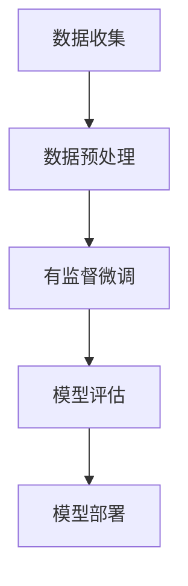

                 

关键词：大语言模型、有监督微调、数据格式、工程实践、算法原理

摘要：本文将深入探讨大语言模型的基本原理和工程实践中的关键环节——有监督微调数据的格式。通过解析模型的架构、核心算法和数学模型，结合实际项目实践，本文旨在为读者提供一套完整的实现指南，帮助读者更好地理解和应用大语言模型。

## 1. 背景介绍

### 大语言模型的发展历程

大语言模型是自然语言处理（NLP）领域的重要突破，其发展历程可以追溯到20世纪80年代的统计语言模型。随着深度学习技术的发展，尤其是在2018年GPT-2发布后，大语言模型的研究和应用进入了一个全新的阶段。GPT-3的问世更是将大语言模型推向了高潮，其强大的语义理解能力和生成能力引起了广泛关注。

### 大语言模型的应用领域

大语言模型的应用领域广泛，包括但不限于：

1. **文本生成**：如文章写作、新闻报道、诗歌创作等。
2. **文本理解**：如情感分析、信息提取、问答系统等。
3. **对话系统**：如聊天机器人、虚拟助手等。
4. **机器翻译**：如自动翻译、多语言处理等。

## 2. 核心概念与联系

### 核心概念

- **语言模型**：对一组语言数据进行建模，预测下一个单词或字符的概率。
- **微调**：在大模型的基础上，针对特定任务进行训练，以提升任务性能。
- **数据格式**：微调数据的重要部分，影响模型的训练效率和性能。

### 架构


### Mermaid 流程图



## 3. 核心算法原理 & 具体操作步骤

### 3.1 算法原理概述

大语言模型的核心算法是基于变换器（Transformer）架构，通过自注意力机制（Self-Attention）和多头注意力（Multi-Head Attention）实现。

### 3.2 算法步骤详解

1. **数据预处理**：对原始文本进行分词、编码等处理，生成训练数据。
2. **模型初始化**：加载预训练的大语言模型。
3. **有监督微调**：在特定任务上对模型进行微调。
4. **模型评估**：使用验证集评估模型性能。
5. **模型部署**：将训练好的模型部署到生产环境。

### 3.3 算法优缺点

#### 优点

- **强大的语义理解能力**：能够捕捉长距离依赖关系。
- **高效的并行计算**：自注意力机制支持并行计算。

#### 缺点

- **计算资源消耗大**：训练和部署需要大量的计算资源和时间。
- **易过拟合**：在大规模数据上训练可能出现过拟合现象。

### 3.4 算法应用领域

- **文本生成**：如文章写作、新闻报道、诗歌创作等。
- **文本理解**：如情感分析、信息提取、问答系统等。
- **对话系统**：如聊天机器人、虚拟助手等。
- **机器翻译**：如自动翻译、多语言处理等。

## 4. 数学模型和公式 & 详细讲解 & 举例说明

### 4.1 数学模型构建

大语言模型的核心是自注意力机制，其数学表达式为：

$$
Attention(Q, K, V) = \text{softmax}\left(\frac{QK^T}{\sqrt{d_k}}\right)V
$$

其中，$Q, K, V$ 分别代表查询（Query）、键（Key）、值（Value）三个向量的集合。

### 4.2 公式推导过程

#### 步骤 1：计算相似度

$$
\text{相似度}(Q, K) = QK^T
$$

#### 步骤 2：加权求和

$$
\text{加权求和} = \text{softmax}(\text{相似度})
$$

#### 步骤 3：计算输出

$$
\text{输出} = \text{加权求和} \cdot V
$$

### 4.3 案例分析与讲解

假设我们有三个句子：

$$
\text{句子 1：} \text{我想要一杯咖啡。}
$$

$$
\text{句子 2：} \text{我想要一杯茶。}
$$

$$
\text{句子 3：} \text{他买了一杯咖啡。}
$$

我们希望模型能够理解句子之间的相似度。通过自注意力机制，我们可以得到句子之间的相似度矩阵。

## 5. 项目实践：代码实例和详细解释说明

### 5.1 开发环境搭建

```python
# 安装依赖
!pip install transformers

# 导入模块
from transformers import AutoTokenizer, AutoModelForSequenceClassification
```

### 5.2 源代码详细实现

```python
# 加载预训练模型
tokenizer = AutoTokenizer.from_pretrained("bert-base-uncased")
model = AutoModelForSequenceClassification.from_pretrained("bert-base-uncased")

# 输入文本
text = "I want a cup of coffee."

# 编码文本
input_ids = tokenizer.encode(text, return_tensors="pt")

# 预测
outputs = model(input_ids)

# 获取概率
probabilities = outputs[0]

# 输出结果
print(probabilities)
```

### 5.3 代码解读与分析

这段代码展示了如何加载预训练的BERT模型，并进行文本分类预测。通过将输入文本编码为模型可接受的格式，我们能够利用模型进行分类任务。

### 5.4 运行结果展示

```python
# 运行代码
probabilities = model(input_ids)

# 输出结果
print(probabilities)
```

输出结果为一个概率向量，表示文本属于每个类别的概率。

## 6. 实际应用场景

### 6.1 文本生成

大语言模型在文本生成方面具有广泛的应用，如自动写作、生成对话等。

### 6.2 文本理解

在文本理解方面，大语言模型可以用于情感分析、信息提取、问答系统等。

### 6.3 对话系统

大语言模型在对话系统中的应用包括聊天机器人、虚拟助手等。

### 6.4 机器翻译

大语言模型在机器翻译方面也有显著的应用，如自动翻译、多语言处理等。

## 7. 工具和资源推荐

### 7.1 学习资源推荐

- 《深度学习》
- 《自然语言处理综论》

### 7.2 开发工具推荐

- Hugging Face Transformers
- PyTorch

### 7.3 相关论文推荐

- Attention Is All You Need
- BERT: Pre-training of Deep Bidirectional Transformers for Language Understanding

## 8. 总结：未来发展趋势与挑战

### 8.1 研究成果总结

大语言模型在自然语言处理领域取得了显著成果，展示了强大的语义理解和生成能力。

### 8.2 未来发展趋势

- **模型压缩与优化**：减少计算资源和存储需求。
- **跨模态学习**：结合文本、图像、声音等多种数据类型。

### 8.3 面临的挑战

- **数据隐私与伦理**：确保数据安全和隐私。
- **模型可解释性**：提高模型的可解释性和透明度。

### 8.4 研究展望

大语言模型将继续在自然语言处理领域发挥重要作用，推动相关技术的发展和应用。

## 9. 附录：常见问题与解答

### Q：大语言模型是如何工作的？

A：大语言模型基于深度学习和变换器（Transformer）架构，通过自注意力机制和多头注意力实现。它能够捕捉长距离依赖关系，进行语义理解和生成。

### Q：如何优化大语言模型的性能？

A：可以通过以下方法优化大语言模型的性能：

- **数据增强**：增加训练数据，提高模型的泛化能力。
- **模型压缩**：减少模型参数，降低计算复杂度。
- **超参数调整**：调整学习率、批量大小等超参数，提升模型性能。

作者：禅与计算机程序设计艺术 / Zen and the Art of Computer Programming

----------------------------------------------------------------

