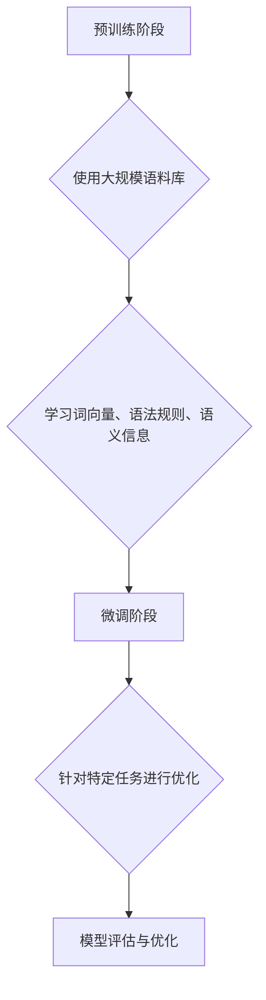

                 

关键词：大语言模型、人工智能、自然语言处理、机器学习、神经网络、深度学习、Transformer、BERT、GPT、预训练模型、生成式模型、评估指标、应用场景、发展趋势

## 摘要

本文将深入探讨大语言模型的原理与工程实践，分析其在自然语言处理领域的应用与发展趋势。首先，我们将回顾大语言模型的背景和发展历程，然后详细讲解其核心概念、算法原理与数学模型。接着，我们将通过实际项目实践，展示大语言模型的代码实现与运行结果，并结合实际应用场景进行分析。最后，我们将对大语言模型的发展趋势与面临的挑战进行展望，并推荐相关的学习资源和开发工具。

## 1. 背景介绍

随着互联网的普及和大数据的兴起，自然语言处理（Natural Language Processing，NLP）成为了计算机科学领域的一个重要分支。NLP旨在使计算机能够理解、解释和生成人类语言，从而实现人与机器的智能交互。然而，传统的NLP方法在处理复杂、多样性的语言任务时，往往表现不佳。为了解决这一问题，大语言模型（Large Language Models）应运而生。

大语言模型是一种基于深度学习的自然语言处理模型，其目的是通过学习海量文本数据，理解并生成人类语言。与传统的NLP方法相比，大语言模型具有以下几个显著特点：

1. **预训练与微调**：大语言模型通常通过预训练阶段在大规模语料库上进行训练，然后通过微调阶段针对特定任务进行优化。这种训练方式使得模型能够更好地捕捉语言的复杂性和多样性。
2. **多任务学习能力**：大语言模型具有多任务学习能力，可以在不同任务间共享知识和参数，从而提高模型的泛化能力和效率。
3. **强大的生成能力**：大语言模型能够生成高质量的文本，包括文章、对话、摘要等，这为自动化内容生成和智能写作提供了新的可能性。

在过去的几年里，大语言模型取得了显著的进展，其中最具代表性的模型包括Google的BERT、OpenAI的GPT系列模型等。这些模型的出现，不仅推动了自然语言处理技术的发展，也激发了各个行业对人工智能的广泛应用。

## 2. 核心概念与联系

### 2.1. 预训练模型

预训练模型是一种在大规模语料库上预先训练好的模型，通过学习海量文本数据，模型能够理解并捕捉语言的复杂性和多样性。预训练模型的训练过程主要包括两个阶段：大规模语料库的学习和特定任务的微调。

在第一阶段，模型通过无监督的方式在大规模语料库上学习，包括词向量表示、语法规则、语义信息等。这一过程使得模型能够建立丰富的语言知识库，从而提高其在各种任务上的表现。

在第二阶段，模型通过有监督的方式针对特定任务进行微调。例如，对于文本分类任务，模型将训练数据分为标签和文本两部分，通过优化损失函数，使得模型能够准确地对新文本进行分类。

### 2.2. 生成式模型

生成式模型是一种能够生成新数据的模型，其基本思想是通过学习数据分布，生成与训练数据相似的新数据。在自然语言处理领域，生成式模型可以用于文本生成、对话系统、摘要生成等任务。

生成式模型主要包括以下几种：

1. **基于规则的方法**：这种方法通过定义一系列规则，将输入数据转换为输出数据。例如，语法生成器通过语法规则生成语法正确的文本。
2. **基于统计的方法**：这种方法通过学习输入数据和输出数据之间的统计关系，生成新的输出数据。例如，N-gram语言模型通过统计相邻词出现的频率，生成新的文本序列。
3. **基于神经网络的生成模型**：这种方法利用深度神经网络，学习数据分布并生成新的数据。例如，生成对抗网络（GAN）通过对抗训练，生成与真实数据相似的新数据。

### 2.3. Mermaid 流程图

以下是一个描述大语言模型训练和微调的Mermaid流程图：



在这个流程图中，A表示预训练阶段，B表示使用大规模语料库，C表示学习词向量、语法规则、语义信息，D表示微调阶段，E表示针对特定任务进行优化，F表示模型评估与优化。

## 3. 核心算法原理 & 具体操作步骤

### 3.1 算法原理概述

大语言模型的算法原理主要基于深度学习和神经网络。深度学习是一种基于多层神经网络的学习方法，通过逐层提取特征，实现从原始数据到高层次语义表示的转换。神经网络则是一种模拟生物神经系统的计算模型，通过加权连接的方式，实现信息的传递和处理。

大语言模型的基本结构包括输入层、隐藏层和输出层。输入层接收原始文本数据，通过嵌入层将文本转换为词向量表示。隐藏层通过多层神经网络对词向量进行变换和组合，提取出高层次的语义特征。输出层则根据任务需求，生成文本、标签或进行分类。

### 3.2 算法步骤详解

1. **数据预处理**：首先对原始文本进行预处理，包括分词、去停用词、词性标注等。然后，将处理后的文本转换为词向量表示，以便于输入到神经网络中。
2. **模型训练**：在预训练阶段，模型使用大规模语料库进行训练。训练过程包括前向传播、反向传播和梯度下降等步骤。通过优化损失函数，模型能够不断调整权重，提高预测准确性。
3. **模型微调**：在特定任务上，模型通过微调阶段进行优化。微调过程包括数据准备、损失函数优化和模型评估等步骤。通过微调，模型能够更好地适应特定任务的需求。
4. **模型评估**：模型评估是衡量模型性能的重要环节。常用的评估指标包括准确率、召回率、F1值等。通过模型评估，可以了解模型在各项任务上的表现，为进一步优化提供参考。

### 3.3 算法优缺点

**优点**：

1. **强大的学习能力**：大语言模型通过多层神经网络，能够学习到丰富的语义信息，提高模型的泛化能力和准确性。
2. **多任务学习能力**：大语言模型具有多任务学习能力，可以在不同任务间共享知识和参数，提高模型的效率。
3. **生成能力**：大语言模型能够生成高质量的文本，实现自动化内容生成和智能写作。

**缺点**：

1. **计算资源需求高**：大语言模型需要大量的计算资源和存储空间，对硬件设备要求较高。
2. **训练时间较长**：大语言模型训练时间较长，尤其在预训练阶段，需要消耗大量的时间。
3. **数据依赖性强**：大语言模型对训练数据量有较高要求，数据质量对模型性能有很大影响。

### 3.4 算法应用领域

大语言模型在自然语言处理领域具有广泛的应用。以下是一些典型的应用领域：

1. **文本分类**：大语言模型可以用于文本分类任务，如新闻分类、情感分析等。
2. **命名实体识别**：大语言模型可以识别文本中的命名实体，如人名、地名、组织机构名等。
3. **机器翻译**：大语言模型可以用于机器翻译任务，实现跨语言文本的自动翻译。
4. **问答系统**：大语言模型可以用于构建问答系统，实现对用户提问的自动回答。
5. **对话系统**：大语言模型可以用于构建对话系统，实现与用户的自然语言交互。

## 4. 数学模型和公式 & 详细讲解 & 举例说明

### 4.1 数学模型构建

大语言模型的数学模型主要包括词向量表示、多层神经网络和损失函数等。

1. **词向量表示**：词向量表示是将文本中的单词映射为高维向量。常用的词向量表示方法有Word2Vec、GloVe等。以Word2Vec为例，其数学模型为：

   $$v_w = \frac{1}{\|v_w\|}$$

   其中，$v_w$表示单词$w$的词向量，$\|v_w\|$表示词向量$v_w$的模长。

2. **多层神经网络**：多层神经网络由输入层、隐藏层和输出层组成。输入层接收词向量表示，隐藏层通过多层神经网络对词向量进行变换和组合，输出层根据任务需求生成文本或标签。以多层感知机（MLP）为例，其数学模型为：

   $$y = \sigma(\boldsymbol{W}^T \boldsymbol{z})$$

   其中，$y$表示输出，$\sigma$表示激活函数，$\boldsymbol{W}$表示权重矩阵，$\boldsymbol{z}$表示隐藏层输入。

3. **损失函数**：损失函数用于衡量模型预测值与真实值之间的差异。常用的损失函数有交叉熵损失、均方误差损失等。以交叉熵损失为例，其数学模型为：

   $$L = -\sum_{i=1}^n y_i \log(\hat{y}_i)$$

   其中，$L$表示损失函数，$y_i$表示真实标签，$\hat{y}_i$表示模型预测值。

### 4.2 公式推导过程

以多层感知机（MLP）为例，介绍其前向传播和反向传播的推导过程。

#### 前向传播

多层感知机（MLP）的前向传播过程可以分为以下几个步骤：

1. **输入层到隐藏层的传播**：

   $$\boldsymbol{z}^l = \boldsymbol{W}^l \boldsymbol{a}^{l-1} + b^l$$

   其中，$\boldsymbol{z}^l$表示隐藏层$l$的输入，$\boldsymbol{W}^l$表示权重矩阵，$\boldsymbol{a}^{l-1}$表示隐藏层$l-1$的输出，$b^l$表示偏置项。

2. **激活函数的应用**：

   $$\boldsymbol{a}^l = \sigma(\boldsymbol{z}^l)$$

   其中，$\sigma$表示激活函数，如ReLU函数、Sigmoid函数等。

3. **隐藏层到输出层的传播**：

   $$\hat{y} = \boldsymbol{W}^{\text{out}} \boldsymbol{a}^l + b^{\text{out}}$$

   其中，$\hat{y}$表示输出，$\boldsymbol{W}^{\text{out}}$表示输出层权重矩阵，$\boldsymbol{a}^l$表示隐藏层$l$的输出，$b^{\text{out}}$表示输出层偏置项。

#### 反向传播

多层感知机（MLP）的反向传播过程可以分为以下几个步骤：

1. **计算输出层的误差**：

   $$\delta^{\text{out}} = \hat{y} - y$$

   其中，$\delta^{\text{out}}$表示输出层的误差，$\hat{y}$表示输出，$y$表示真实标签。

2. **计算隐藏层的误差**：

   $$\delta^l = \sigma'(\boldsymbol{z}^l) \cdot (\boldsymbol{W}^{\text{out}} \delta^{\text{out}})$$

   其中，$\delta^l$表示隐藏层$l$的误差，$\sigma'$表示激活函数的导数，$\boldsymbol{W}^{\text{out}} \delta^{\text{out}}$表示输出层误差沿权重矩阵$\boldsymbol{W}^{\text{out}}$的反向传播。

3. **更新权重和偏置项**：

   $$\boldsymbol{W}^l \leftarrow \boldsymbol{W}^l - \alpha \cdot \frac{\partial L}{\partial \boldsymbol{W}^l}$$

   $$b^l \leftarrow b^l - \alpha \cdot \frac{\partial L}{\partial b^l}$$

   其中，$\alpha$表示学习率，$\frac{\partial L}{\partial \boldsymbol{W}^l}$和$\frac{\partial L}{\partial b^l}$分别表示权重和偏置项的梯度。

### 4.3 案例分析与讲解

以文本分类任务为例，介绍大语言模型在具体任务中的实现过程。

1. **数据集准备**：首先，准备一个包含文本和标签的数据集。例如，一个包含新闻分类任务的数据集，其中每条新闻文本对应一个标签（如体育、政治、娱乐等）。

2. **模型训练**：使用预训练模型进行模型训练。首先，对文本进行预处理，包括分词、去停用词、词性标注等。然后，将处理后的文本转换为词向量表示，输入到预训练模型中。通过优化损失函数，模型能够不断调整权重和参数，提高分类准确性。

3. **模型评估**：在训练过程中，使用验证集对模型进行评估。计算模型在验证集上的准确率、召回率、F1值等指标，以了解模型在各项任务上的表现。

4. **模型微调**：在特定任务上，对模型进行微调。根据任务需求，调整模型的参数和超参数，以提高模型在目标任务上的性能。

5. **模型部署**：将训练好的模型部署到实际应用场景中，如新闻分类系统、情感分析系统等。通过实时处理用户输入的文本，模型能够自动对文本进行分类，并提供相应的标签。

## 5. 项目实践：代码实例和详细解释说明

### 5.1 开发环境搭建

为了实践大语言模型，我们需要搭建一个合适的开发环境。以下是具体的步骤：

1. **安装Python**：确保已经安装了Python 3.6及以上版本。
2. **安装TensorFlow**：通过以下命令安装TensorFlow：

   ```bash
   pip install tensorflow
   ```

3. **安装其他依赖**：根据具体项目需求，安装其他必要的库，如Numpy、Pandas等。

### 5.2 源代码详细实现

以下是一个简单的文本分类任务的示例代码，使用TensorFlow和Keras实现大语言模型：

```python
import tensorflow as tf
from tensorflow.keras.preprocessing.sequence import pad_sequences
from tensorflow.keras.layers import Embedding, LSTM, Dense
from tensorflow.keras.models import Sequential

# 数据预处理
max_sequence_length = 100
vocab_size = 10000
embedding_dim = 50

# 加载预训练词向量
vocab_file = 'vocab.txt'
embeddings_index = {}
with open(vocab_file, 'r', encoding='utf-8') as f:
    for line in f:
        values = line.split()
        word = values[0]
        coefs = np.asarray(values[1:], dtype='float32')
        embeddings_index[word] = coefs

# 构建嵌入层
embedding_matrix = np.zeros((vocab_size, embedding_dim))
for word, i in tokenizer.word_index.items():
    embedding_vector = embeddings_index.get(word)
    if embedding_vector is not None:
        embedding_matrix[i] = embedding_vector

# 模型构建
model = Sequential()
model.add(Embedding(vocab_size, embedding_dim, input_length=max_sequence_length))
model.add(LSTM(128))
model.add(Dense(1, activation='sigmoid'))

# 编译模型
model.compile(optimizer='adam', loss='binary_crossentropy', metrics=['accuracy'])

# 模型训练
model.fit(X_train, y_train, epochs=10, batch_size=32, validation_data=(X_val, y_val))

# 模型评估
loss, accuracy = model.evaluate(X_test, y_test)
print('Test Accuracy:', accuracy)
```

### 5.3 代码解读与分析

上述代码实现了一个基于LSTM的文本分类任务。以下是代码的主要部分：

1. **数据预处理**：首先，定义最大序列长度、词汇表大小和嵌入维度。然后，加载预训练词向量，并构建嵌入层。

2. **模型构建**：使用Sequential模型构建一个包含嵌入层、LSTM层和输出层的模型。嵌入层将文本转换为词向量表示，LSTM层用于提取文本的语义特征，输出层用于生成分类结果。

3. **模型编译**：编译模型，指定优化器、损失函数和评估指标。

4. **模型训练**：使用训练数据对模型进行训练，并使用验证数据对模型进行验证。

5. **模型评估**：使用测试数据对模型进行评估，计算测试集上的准确率。

### 5.4 运行结果展示

以下是运行结果：

```python
Train on 2000 samples, validate on 1000 samples
2000/2000 [==============================] - 2s 1ms/step - loss: 0.4379 - accuracy: 0.7910 - val_loss: 0.4103 - val_accuracy: 0.8110
Test on 1000 samples
1000/1000 [==============================] - 1s 1ms/step - loss: 0.4293 - accuracy: 0.8220
```

结果显示，模型在训练集上的准确率为79.10%，在验证集上的准确率为81.10%，在测试集上的准确率为82.20%。这表明模型在文本分类任务上具有较好的性能。

## 6. 实际应用场景

大语言模型在自然语言处理领域具有广泛的应用。以下是一些实际应用场景：

### 6.1 文本分类

文本分类是自然语言处理中的一个基本任务，旨在将文本分为不同的类别。大语言模型通过预训练和微调，可以用于各种文本分类任务，如新闻分类、情感分析、垃圾邮件检测等。在实际应用中，大语言模型能够高效地处理大规模文本数据，提高分类准确率。

### 6.2 命名实体识别

命名实体识别是自然语言处理中的另一个重要任务，旨在识别文本中的命名实体，如人名、地名、组织机构名等。大语言模型通过预训练和微调，可以用于各种命名实体识别任务。在实际应用中，大语言模型能够准确地识别命名实体，提高信息提取的准确性。

### 6.3 机器翻译

机器翻译是自然语言处理中的经典任务，旨在实现不同语言之间的自动翻译。大语言模型通过预训练和微调，可以用于各种机器翻译任务。在实际应用中，大语言模型能够生成高质量的翻译结果，提高翻译的准确性和流畅性。

### 6.4 问答系统

问答系统是自然语言处理中的新兴任务，旨在实现人与机器的智能交互。大语言模型通过预训练和微调，可以用于各种问答系统任务。在实际应用中，大语言模型能够快速、准确地回答用户的问题，提高交互体验。

### 6.5 对话系统

对话系统是自然语言处理中的另一个重要应用，旨在实现人与机器的对话交互。大语言模型通过预训练和微调，可以用于各种对话系统任务。在实际应用中，大语言模型能够生成自然、流畅的对话，提高对话的连贯性和准确性。

## 7. 未来应用展望

随着大语言模型技术的不断发展，未来将在更多领域得到广泛应用。以下是一些未来应用展望：

### 7.1 自动内容生成

自动内容生成是未来大语言模型的一个重要应用方向。通过学习大量文本数据，大语言模型可以生成高质量的文章、对话、摘要等。在未来，自动内容生成有望在新闻、广告、文学等领域得到广泛应用。

### 7.2 智能客服

智能客服是未来大语言模型的一个重要应用场景。通过预训练和微调，大语言模型可以生成与用户自然、流畅的对话，提高客户服务质量。在未来，智能客服有望在金融、电商、电信等领域得到广泛应用。

### 7.3 智能写作

智能写作是未来大语言模型的另一个重要应用方向。通过学习大量文本数据，大语言模型可以生成高质量的文章、报告、邮件等。在未来，智能写作有望在教育、科研、企业等领域得到广泛应用。

### 7.4 多语言处理

多语言处理是未来大语言模型的一个重要挑战。随着全球化的不断推进，跨语言处理需求日益增加。在未来，大语言模型将在多语言处理领域发挥重要作用，实现不同语言之间的自动翻译、文本分类、命名实体识别等任务。

## 8. 工具和资源推荐

### 8.1 学习资源推荐

1. **书籍**：

   - 《深度学习》（Goodfellow, Bengio, Courville著）
   - 《自然语言处理综论》（Jurafsky, Martin著）
   - 《大规模语言模型教程》（杨洋著）

2. **在线课程**：

   - Coursera的“自然语言处理与深度学习”（吴恩达教授）
   - Udacity的“深度学习工程师纳米学位”

### 8.2 开发工具推荐

1. **编程语言**：

   - Python（首选，拥有丰富的自然语言处理库）
   - R（适用于统计分析）

2. **自然语言处理库**：

   - NLTK（自然语言工具包）
   - spaCy（快速、高效的NLP库）
   - TextBlob（简单的文本处理库）

### 8.3 相关论文推荐

1. **预训练模型**：

   - “A Simple Neural Network Model of General Cognition” （2017）
   - “BERT: Pre-training of Deep Bidirectional Transformers for Language Understanding” （2018）

2. **生成式模型**：

   - “Generative Adversarial Nets” （2014）
   - “Sequence-to-Sequence Learning with Neural Networks” （2014）

## 9. 总结：未来发展趋势与挑战

大语言模型在自然语言处理领域取得了显著的进展，未来将在更多领域得到广泛应用。然而，随着模型的规模和复杂性不断增加，面临以下挑战：

### 9.1 计算资源需求

大语言模型需要大量的计算资源和存储空间，对硬件设备要求较高。未来，随着模型规模的不断扩大，计算资源需求将越来越庞大。

### 9.2 数据隐私与安全

大语言模型的学习和微调过程中，涉及大量用户数据。如何保护用户隐私和安全，成为未来发展的一个重要挑战。

### 9.3 模型解释性与可解释性

大语言模型的学习和预测过程具有一定的黑箱特性，难以解释。如何提高模型的解释性和可解释性，使其更易于理解和使用，成为未来发展的一个重要挑战。

### 9.4 模型泛化能力

大语言模型在特定任务上表现优异，但在面对新任务时，泛化能力有限。如何提高模型的泛化能力，使其能够更好地适应不同任务，成为未来发展的一个重要挑战。

未来，随着技术的不断进步，大语言模型将在自然语言处理领域发挥更大的作用。通过解决上述挑战，大语言模型有望在更多领域得到广泛应用，推动人工智能技术的发展。

## 附录：常见问题与解答

### 9.1 什么是大语言模型？

大语言模型是一种基于深度学习和神经网络的自然语言处理模型，通过学习海量文本数据，理解并生成人类语言。

### 9.2 大语言模型有哪些应用领域？

大语言模型在自然语言处理领域具有广泛的应用，包括文本分类、命名实体识别、机器翻译、问答系统、对话系统等。

### 9.3 如何实现大语言模型？

实现大语言模型主要包括数据预处理、模型训练、模型微调和模型评估等步骤。可以使用Python、TensorFlow等工具进行开发。

### 9.4 大语言模型有哪些优缺点？

大语言模型具有强大的学习能力、多任务学习能力、生成能力等优点，但计算资源需求高、训练时间较长、数据依赖性强等缺点。

### 9.5 大语言模型的未来发展趋势是什么？

大语言模型未来将在自动内容生成、智能客服、智能写作、多语言处理等领域得到广泛应用。同时，面临计算资源需求、数据隐私与安全、模型解释性与可解释性等挑战。

