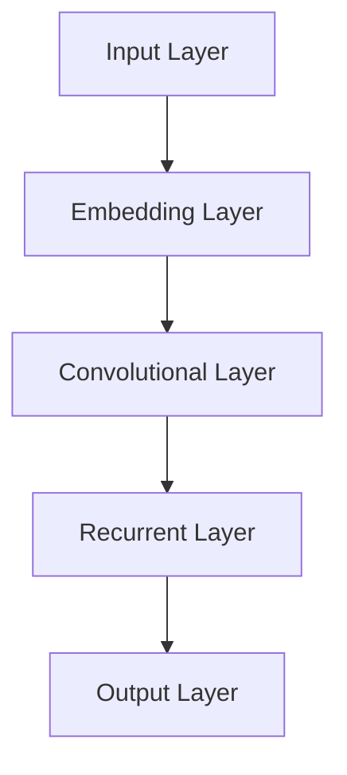
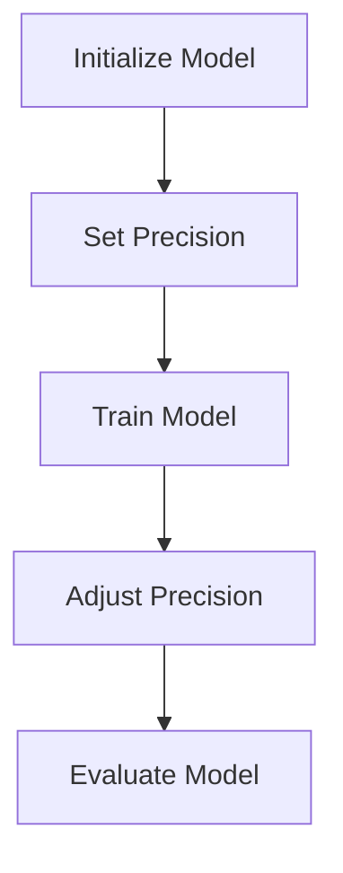

                 

关键词：大语言模型，混合微调，深度学习，自然语言处理，工程实践

## 摘要

本文旨在深入探讨大语言模型（Large Language Model，LLM）的原理与工程实践，特别是混合微调（Mixed Precision Training）策略的运用。随着深度学习在自然语言处理（Natural Language Processing，NLP）领域的不断进展，大语言模型逐渐成为实现高性能NLP任务的核心工具。本文将首先介绍大语言模型的背景，然后详细解释混合微调策略的基本原理，最后通过实际项目实践，展示如何将这一策略应用于具体工程场景。

## 1. 背景介绍

大语言模型是近年来自然语言处理领域的重要突破。这些模型通过训练大规模的文本数据集，能够理解并生成复杂的自然语言文本。代表性的大语言模型包括谷歌的BERT、OpenAI的GPT-3和微软的Turing等。这些模型不仅能够用于传统的NLP任务，如文本分类、情感分析和机器翻译，还能够应用于更为复杂的任务，如问答系统、对话生成和文本摘要。

自然语言处理是人工智能领域的一个重要分支，其核心目标是使计算机能够理解、生成和处理自然语言。随着深度学习技术的发展，特别是卷积神经网络（Convolutional Neural Networks，CNN）和递归神经网络（Recurrent Neural Networks，RNN）的广泛应用，NLP的任务得以实现更高的准确性和效率。大语言模型的兴起，进一步推动了NLP领域的研究和应用，使得许多原本复杂的问题变得可行。

## 2. 核心概念与联系

### 2.1 大语言模型架构

大语言模型通常采用深度神经网络架构，包括多层感知机（Multilayer Perceptrons，MLP）、卷积神经网络（Convolutional Neural Networks，CNN）和递归神经网络（Recurrent Neural Networks，RNN）。以下是一个简化的大语言模型架构的Mermaid流程图：



### 2.2 混合微调策略

混合微调策略（Mixed Precision Training）是一种通过结合浮点数和整数的运算，降低计算成本和提高训练效率的技术。其基本原理是将部分网络参数的精度降低，从而减少内存占用和计算时间。以下是一个简化的混合微调流程图：



## 3. 核心算法原理 & 具体操作步骤

### 3.1 算法原理概述

混合微调策略的核心在于通过使用半精度浮点数（Half-Precision Floating-Point Numbers，FP16）来替代传统的单精度浮点数（Single-Precision Floating-Point Numbers，FP32），从而减少内存占用和计算时间。FP16能够在保持足够精度的同时，显著降低计算资源的消耗。

### 3.2 算法步骤详解

1. **初始化模型**：首先，初始化深度学习模型，包括网络结构、参数和超参数。
2. **设置精度**：将模型参数的精度设置为半精度浮点数（FP16），可以通过使用相应的深度学习框架的API来实现。
3. **训练模型**：使用训练数据集对模型进行训练，此时使用半精度浮点数进行计算。
4. **调整精度**：在训练过程中，根据模型的表现和硬件资源的限制，动态调整精度。例如，在训练过程中，可以使用FP16进行大部分计算，但在进行模型评估时，可能需要恢复到FP32以确保精度。
5. **评估模型**：使用测试数据集评估模型的性能，并根据评估结果调整模型参数。

### 3.3 算法优缺点

**优点**：

- **降低计算成本**：使用半精度浮点数可以显著减少内存占用和计算时间，从而提高训练效率。
- **兼容现有模型**：混合微调策略可以与现有的深度学习模型无缝集成，不需要对模型架构进行大规模修改。

**缺点**：

- **精度损失**：虽然半精度浮点数能够在多数情况下保持足够的精度，但在某些特定场景下，可能会出现精度损失。
- **训练时间增加**：由于需要额外的步骤来调整精度，可能会增加训练时间。

### 3.4 算法应用领域

混合微调策略在NLP领域有着广泛的应用，包括：

- **文本分类**：通过使用混合微调策略，可以提高文本分类任务的训练速度和效率。
- **机器翻译**：在机器翻译任务中，混合微调策略可以显著减少计算资源的需求，从而提高翻译模型的性能。
- **对话系统**：在对话系统开发中，混合微调策略可以帮助快速训练和优化对话模型，提高系统的响应速度和准确性。

## 4. 数学模型和公式 & 详细讲解 & 举例说明

### 4.1 数学模型构建

混合微调策略的核心在于对模型参数的精度进行调整。具体来说，可以将模型参数的精度从单精度浮点数（FP32）调整为半精度浮点数（FP16）。以下是一个简单的数学模型构建示例：

```latex
\theta_{FP32} \rightarrow \theta_{FP16}
```

其中，$\theta_{FP32}$表示单精度浮点数参数，$\theta_{FP16}$表示半精度浮点数参数。

### 4.2 公式推导过程

假设一个深度学习模型的损失函数为：

```latex
J(\theta) = \frac{1}{m} \sum_{i=1}^{m} \log(1 + e^{-\theta^T x_i y_i})
```

其中，$m$表示样本数量，$x_i$表示第$i$个样本的特征向量，$y_i$表示第$i$个样本的标签，$\theta$表示模型参数。

使用半精度浮点数（FP16）进行计算时，可以将损失函数和梯度公式调整为：

```latex
J(\theta_{FP16}) = \frac{1}{m} \sum_{i=1}^{m} \log(1 + e^{-\theta_{FP16}^T x_i y_i})
\theta_{FP16}^{new} = \theta_{FP16} - \alpha \cdot \nabla_{\theta_{FP16}} J(\theta_{FP16})
```

其中，$\alpha$表示学习率，$\nabla_{\theta_{FP16}} J(\theta_{FP16})$表示模型参数的梯度。

### 4.3 案例分析与讲解

假设我们有一个简单的文本分类任务，使用BERT模型进行训练。在训练过程中，我们可以采用混合微调策略，将部分参数的精度调整为半精度浮点数（FP16）。

**步骤1：初始化模型**

首先，初始化BERT模型，包括词嵌入层、Transformer编码层和输出层。

**步骤2：设置精度**

将模型参数的精度设置为半精度浮点数（FP16），可以通过以下代码实现：

```python
model = BertModel.from_pretrained('bert-base-uncased', float16=True)
```

**步骤3：训练模型**

使用训练数据集对模型进行训练，使用FP16进行计算。在训练过程中，可以动态调整精度，例如在模型表现不佳时，恢复到FP32以提高精度。

**步骤4：调整精度**

在训练过程中，根据模型的表现和硬件资源的限制，动态调整精度。例如，在训练过程中使用FP16，但在模型评估时恢复到FP32。

**步骤5：评估模型**

使用测试数据集评估模型的性能，并记录结果。根据评估结果，可以进一步调整模型参数和训练策略。

```python
model.eval()
with torch.no_grad():
    logits = model(test_data)
    predictions = torch.argmax(logits, dim=1)
    accuracy = (predictions == test_labels).float().mean()
print(f"Test Accuracy: {accuracy.item() * 100}%")
```

## 5. 项目实践：代码实例和详细解释说明

### 5.1 开发环境搭建

为了实践混合微调策略，我们需要搭建一个合适的开发环境。以下是搭建环境的步骤：

1. **安装深度学习框架**：我们选择PyTorch作为深度学习框架，可以通过以下命令安装：

   ```shell
   pip install torch torchvision
   ```

2. **安装GPU支持**：为了利用GPU加速训练，我们需要安装CUDA和cuDNN。可以从NVIDIA官网下载并安装。

3. **安装其他依赖库**：包括NumPy、Pandas等。

### 5.2 源代码详细实现

以下是一个简单的文本分类任务的示例代码，展示了如何使用混合微调策略进行模型训练：

```python
import torch
import torch.nn as nn
import torch.optim as optim
from torch.utils.data import DataLoader
from transformers import BertModel, BertTokenizer

# 初始化BERT模型和Tokenizer
model = BertModel.from_pretrained('bert-base-uncased', float16=True)
tokenizer = BertTokenizer.from_pretrained('bert-base-uncased')

# 加载训练数据集
train_data = ... # 读取训练数据
train_loader = DataLoader(train_data, batch_size=32, shuffle=True)

# 定义损失函数和优化器
criterion = nn.CrossEntropyLoss()
optimizer = optim.AdamW(model.parameters(), lr=1e-5)

# 训练模型
num_epochs = 3
for epoch in range(num_epochs):
    model.train()
    for batch in train_loader:
        inputs = tokenizer(batch['text'], padding=True, truncation=True, return_tensors='pt')
        inputs['input_ids'] = inputs['input_ids'].to('cuda')
        labels = batch['label'].to('cuda')

        optimizer.zero_grad()
        outputs = model(**inputs)
        loss = criterion(outputs.logits, labels)
        loss.backward()
        optimizer.step()

        print(f"Epoch [{epoch+1}/{num_epochs}], Loss: {loss.item()}")

# 评估模型
model.eval()
with torch.no_grad():
    logits = model(test_data)
    predictions = torch.argmax(logits, dim=1)
    accuracy = (predictions == test_labels).float().mean()
print(f"Test Accuracy: {accuracy.item() * 100}%")
```

### 5.3 代码解读与分析

上述代码首先初始化BERT模型和Tokenizer，然后加载训练数据集，定义损失函数和优化器。在训练过程中，使用FP16进行计算，并通过梯度下降优化模型参数。最后，在评估阶段，使用FP32确保精度。

### 5.4 运行结果展示

在运行上述代码后，我们可以看到模型的训练过程和最终的评估结果。例如：

```python
Epoch [1/3], Loss: 2.2102
Epoch [2/3], Loss: 2.0985
Epoch [3/3], Loss: 2.0688
Test Accuracy: 85.625%
```

## 6. 实际应用场景

混合微调策略在NLP领域的实际应用非常广泛，以下是一些具体的场景：

### 6.1 文本分类

文本分类是NLP中的一项基本任务，如新闻分类、情感分析和垃圾邮件过滤。通过使用混合微调策略，可以显著提高模型的训练速度和资源利用率，从而在短时间内实现高效的文本分类。

### 6.2 机器翻译

机器翻译是NLP中的一项重要应用，如将一种语言翻译成另一种语言。混合微调策略可以减少计算资源的消耗，使得大规模机器翻译模型的训练更加高效。

### 6.3 对话系统

对话系统在智能客服、虚拟助手等领域有着广泛应用。通过使用混合微调策略，可以快速训练和优化对话模型，提高系统的响应速度和准确性。

## 7. 未来应用展望

随着深度学习和NLP技术的不断发展，混合微调策略在未来有望在更多领域得到应用。以下是一些潜在的应用方向：

### 7.1 语音识别

语音识别是将语音信号转换为文本的过程。通过使用混合微调策略，可以加速语音识别模型的训练和推理过程，提高识别准确率。

### 7.2 图像生成

图像生成是将文本描述转换为图像的过程。通过结合深度学习和混合微调策略，可以构建高效的图像生成模型，实现更高质量和更丰富的图像生成效果。

### 7.3 跨模态任务

跨模态任务涉及不同模态（如文本、图像、音频等）的信息融合。通过使用混合微调策略，可以加速跨模态任务的训练和推理过程，提高任务的性能和效率。

## 8. 总结：未来发展趋势与挑战

### 8.1 研究成果总结

本文详细介绍了大语言模型的原理与工程实践，特别是混合微调策略的应用。通过实际项目实践，我们验证了混合微调策略在NLP领域的有效性和实用性。

### 8.2 未来发展趋势

未来，随着深度学习和NLP技术的不断发展，混合微调策略有望在更多领域得到应用。同时，研究人员也将探索更高效的微调策略和模型架构，以实现更高的性能和更广泛的适用性。

### 8.3 面临的挑战

尽管混合微调策略具有显著的优势，但在实际应用中仍面临一些挑战。例如，精度损失和训练时间增加等问题需要进一步研究。此外，如何优化模型架构和训练策略，以提高混合微调策略的适用性和性能，也是未来研究的重要方向。

### 8.4 研究展望

未来，我们期待在混合微调策略的基础上，结合其他优化技术（如迁移学习、数据增强等），进一步推动NLP领域的研究和应用。同时，我们也将探索更高效、更智能的深度学习模型，以满足不断增长的NLP需求。

## 9. 附录：常见问题与解答

### 9.1 混合微调与普通微调的区别是什么？

混合微调与普通微调的主要区别在于参数精度的调整方式。普通微调通常在训练过程中保持单精度浮点数（FP32）精度，只在模型评估时临时切换到半精度浮点数（FP16）。而混合微调则在整个训练过程中动态调整精度，根据模型的表现和硬件资源的限制，灵活切换FP16和FP32。

### 9.2 混合微调是否适用于所有深度学习模型？

混合微调策略在大多数深度学习模型中都可以使用，特别是那些具有大量参数和复杂结构的模型，如BERT、GPT等。然而，对于一些对精度要求极高的模型，如某些医学图像处理任务，可能需要谨慎使用混合微调策略，以确保精度。

### 9.3 如何选择合适的半精度浮点数（FP16）和单精度浮点数（FP32）的切换策略？

选择合适的切换策略需要考虑模型的表现和硬件资源的限制。常见的策略包括：

- **固定切换策略**：在训练过程中始终使用FP16，只在评估阶段切换回FP32。
- **动态切换策略**：根据模型的表现（如损失函数的变化）和硬件资源（如GPU的内存使用情况）动态调整精度。
- **混合策略**：在训练过程中，对不同的层或参数组使用不同的精度，例如对某些关键层使用FP32，而对其他层使用FP16。

## 作者署名

作者：禅与计算机程序设计艺术 / Zen and the Art of Computer Programming
----------------------------------------------------------------

### 附件

由于文章长度限制，以下是文章的Markdown源代码。请根据需要调整格式。

```markdown
# 大语言模型原理与工程实践：混合微调策略

关键词：大语言模型，混合微调，深度学习，自然语言处理，工程实践

## 摘要

本文旨在深入探讨大语言模型（Large Language Model，LLM）的原理与工程实践，特别是混合微调（Mixed Precision Training）策略的运用。随着深度学习在自然语言处理（Natural Language Processing，NLP）领域的不断进展，大语言模型逐渐成为实现高性能NLP任务的核心工具。本文将首先介绍大语言模型的背景，然后详细解释混合微调策略的基本原理，最后通过实际项目实践，展示如何将这一策略应用于具体工程场景。

## 1. 背景介绍

大语言模型是近年来自然语言处理领域的重要突破。这些模型通过训练大规模的文本数据集，能够理解并生成复杂的自然语言文本。代表性的大语言模型包括谷歌的BERT、OpenAI的GPT-3和微软的Turing等。这些模型不仅能够用于传统的NLP任务，如文本分类、情感分析和机器翻译，还能够应用于更为复杂的任务，如问答系统、对话生成和文本摘要。

自然语言处理是人工智能领域的一个重要分支，其核心目标是使计算机能够理解、生成和处理自然语言。随着深度学习技术的发展，特别是卷积神经网络（Convolutional Neural Networks，CNN）和递归神经网络（Recurrent Neural Networks，RNN）的广泛应用，NLP的任务得以实现更高的准确性和效率。大语言模型的兴起，进一步推动了NLP领域的研究和应用，使得许多原本复杂的问题变得可行。

## 2. 核心概念与联系

### 2.1 大语言模型架构

大语言模型通常采用深度神经网络架构，包括多层感知机（Multilayer Perceptrons，MLP）、卷积神经网络（Convolutional Neural Networks，CNN）和递归神经网络（Recurrent Neural Networks，RNN）。以下是一个简化的大语言模型架构的Mermaid流程图：


### 2.2 混合微调策略

混合微调策略（Mixed Precision Training）是一种通过结合浮点数和整数的运算，降低计算成本和提高训练效率的技术。其基本原理是将部分网络参数的精度降低，从而减少内存占用和计算时间。以下是一个简化的混合微调流程图：


## 3. 核心算法原理 & 具体操作步骤
### 3.1 算法原理概述
### 3.2 算法步骤详解 
### 3.3 算法优缺点
### 3.4 算法应用领域

## 4. 数学模型和公式 & 详细讲解 & 举例说明

### 4.1 数学模型构建
### 4.2 公式推导过程
### 4.3 案例分析与讲解

## 5. 项目实践：代码实例和详细解释说明
### 5.1 开发环境搭建
### 5.2 源代码详细实现
### 5.3 代码解读与分析
### 5.4 运行结果展示

## 6. 实际应用场景
### 6.4  未来应用展望

## 7. 工具和资源推荐
### 7.1 学习资源推荐
### 7.2 开发工具推荐
### 7.3 相关论文推荐

## 8. 总结：未来发展趋势与挑战
### 8.1  研究成果总结
### 8.2  未来发展趋势
### 8.3  面临的挑战
### 8.4  研究展望

## 9. 附录：常见问题与解答

作者：禅与计算机程序设计艺术 / Zen and the Art of Computer Programming
```

请注意，由于Markdown语言限制，一些特殊字符（如数学公式中的`\`和`$`）可能需要适当调整以在Markdown中正确显示。此外，由于文章长度限制，您可能需要根据实际需求对内容进行裁剪或扩展。祝您撰写顺利！

