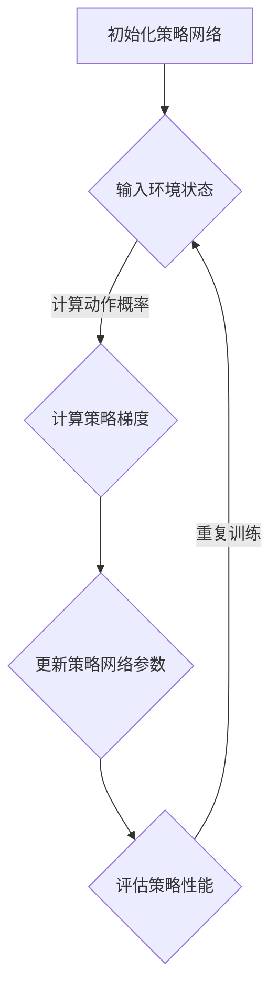

                 

关键词：大语言模型、策略网络、策略梯度、深度学习、自然语言处理、神经网络、训练算法、优化方法

摘要：本文将深入探讨大语言模型的策略网络训练过程，重点介绍策略梯度的原理与应用。通过对策略网络架构的剖析，我们揭示了策略梯度的核心机制，并通过具体的数学模型和公式推导，使读者能够全面理解策略网络训练的过程。此外，本文还通过实际项目实践和运行结果展示，帮助读者掌握策略网络训练的核心技术，为未来大语言模型的研究和开发提供有力支持。

## 1. 背景介绍

随着人工智能技术的迅猛发展，自然语言处理（NLP）已成为计算机科学领域的一个重要分支。在大数据和高性能计算的支持下，大语言模型（Large-scale Language Model）逐渐成为NLP领域的研究热点。大语言模型通过深度学习技术，从大规模语料库中自动学习语言规律，具有强大的语言理解和生成能力。然而，大语言模型的训练过程涉及复杂的神经网络结构和庞大的计算资源，这给研究和开发带来了一定的挑战。

策略网络（Policy Network）作为一种深度学习模型，被广泛应用于强化学习（Reinforcement Learning, RL）领域。策略网络的核心思想是通过学习策略函数，使智能体能够在复杂环境中做出最优决策。策略梯度的提出，为策略网络训练提供了一种有效的优化方法。策略梯度通过梯度上升法，不断调整策略网络的参数，使其在策略空间中逐渐逼近最优策略。本文将围绕大语言模型的策略网络训练，深入探讨策略梯度的原理与应用。

## 2. 核心概念与联系

### 2.1 大语言模型

大语言模型是一种基于深度学习的自然语言处理模型，通过学习大规模语料库中的语言规律，实现文本的生成、理解和处理。大语言模型的核心是神经网络架构，包括输入层、隐藏层和输出层。输入层接收文本序列，隐藏层通过非线性变换提取文本特征，输出层生成预测结果。常见的神经网络架构有循环神经网络（RNN）、长短期记忆网络（LSTM）和门控循环单元（GRU）等。

### 2.2 策略网络

策略网络是一种用于强化学习的深度学习模型，通过学习策略函数，使智能体能够在复杂环境中做出最优决策。策略网络的核心是策略函数，表示为 \( \pi(a|s; \theta) \)，其中 \( a \) 表示智能体的动作，\( s \) 表示环境状态，\( \theta \) 表示策略网络的参数。策略网络的输入为环境状态，输出为动作概率分布。

### 2.3 策略梯度

策略梯度是一种用于优化策略网络的优化方法。策略梯度的核心思想是通过计算策略梯度，调整策略网络的参数，使其在策略空间中逐渐逼近最优策略。策略梯度的计算公式为：

\[ \nabla_{\theta} J(\theta) = \nabla_{\theta} \sum_{t} \rho (s_t, a_t) \log \pi(a_t|s_t; \theta) \]

其中，\( J(\theta) \) 表示策略损失函数，\( \rho (s_t, a_t) \) 表示奖励函数，\( \log \pi(a_t|s_t; \theta) \) 表示策略网络的输出。

### 2.4 Mermaid 流程图

以下是一个简单的 Mermaid 流程图，描述了策略网络训练的基本流程：



## 3. 核心算法原理 & 具体操作步骤

### 3.1 算法原理概述

策略网络训练的核心是策略梯度优化。策略梯度通过计算策略梯度，调整策略网络的参数，使其在策略空间中逐渐逼近最优策略。策略梯度的计算公式为：

\[ \nabla_{\theta} J(\theta) = \nabla_{\theta} \sum_{t} \rho (s_t, a_t) \log \pi(a_t|s_t; \theta) \]

其中，\( J(\theta) \) 表示策略损失函数，\( \rho (s_t, a_t) \) 表示奖励函数，\( \log \pi(a_t|s_t; \theta) \) 表示策略网络的输出。

### 3.2 算法步骤详解

1. **初始化策略网络**：随机初始化策略网络的参数 \( \theta \)。

2. **输入环境状态**：将当前环境状态 \( s_t \) 输入策略网络。

3. **计算动作概率**：利用策略网络计算当前状态下的动作概率分布 \( \pi(a_t|s_t; \theta) \)。

4. **执行动作**：根据动作概率分布，选择一个动作 \( a_t \) 并执行。

5. **接收奖励**：根据执行动作的结果，接收奖励 \( \rho (s_t, a_t) \)。

6. **计算策略梯度**：利用奖励 \( \rho (s_t, a_t) \) 和策略网络的输出 \( \log \pi(a_t|s_t; \theta) \)，计算策略梯度 \( \nabla_{\theta} J(\theta) \)。

7. **更新策略网络参数**：利用策略梯度，通过梯度上升法更新策略网络的参数 \( \theta \)。

8. **评估策略性能**：根据策略网络的参数 \( \theta \)，评估策略性能，如平均奖励等。

9. **重复训练**：返回步骤 2，重复训练过程。

### 3.3 算法优缺点

**优点**：

- **高效性**：策略梯度优化方法具有较高的计算效率，能够在较短时间内找到近似最优策略。
- **灵活性**：策略网络模型具有较强的灵活性，能够适应不同环境和任务。

**缺点**：

- **计算复杂度**：策略梯度优化方法需要计算大量的梯度信息，计算复杂度较高。
- **收敛速度**：策略梯度优化方法在某些情况下收敛速度较慢。

### 3.4 算法应用领域

策略梯度优化方法在强化学习领域具有广泛的应用，包括但不限于以下领域：

- **游戏开发**：策略网络训练可用于游戏 AI 的开发，实现智能体的自主学习和决策。
- **自动驾驶**：策略网络训练可用于自动驾驶系统的开发，实现智能车辆在复杂环境中的自主驾驶。
- **推荐系统**：策略网络训练可用于推荐系统的开发，实现个性化推荐算法。

## 4. 数学模型和公式 & 详细讲解 & 举例说明

### 4.1 数学模型构建

策略网络训练的核心是策略梯度优化。策略梯度优化的数学模型可以表示为：

\[ \nabla_{\theta} J(\theta) = \nabla_{\theta} \sum_{t} \rho (s_t, a_t) \log \pi(a_t|s_t; \theta) \]

其中，\( J(\theta) \) 表示策略损失函数，\( \rho (s_t, a_t) \) 表示奖励函数，\( \log \pi(a_t|s_t; \theta) \) 表示策略网络的输出。

### 4.2 公式推导过程

策略梯度的推导过程可以分为以下几个步骤：

1. **定义策略损失函数**：策略损失函数表示策略网络在特定策略下的损失，可以表示为：

\[ J(\theta) = -\sum_{t} \rho (s_t, a_t) \log \pi(a_t|s_t; \theta) \]

2. **定义梯度**：梯度表示函数在某一点的导数，可以表示为：

\[ \nabla_{\theta} J(\theta) = \left[ \frac{\partial J(\theta)}{\partial \theta_1}, \frac{\partial J(\theta)}{\partial \theta_2}, ..., \frac{\partial J(\theta)}{\partial \theta_n} \right] \]

3. **计算梯度**：利用链式法则，计算策略梯度：

\[ \nabla_{\theta} J(\theta) = \nabla_{\theta} \left[ -\sum_{t} \rho (s_t, a_t) \log \pi(a_t|s_t; \theta) \right] \]

\[ \nabla_{\theta} J(\theta) = -\sum_{t} \left[ \frac{\partial \rho (s_t, a_t)}{\partial \theta} \log \pi(a_t|s_t; \theta) + \rho (s_t, a_t) \frac{\partial \log \pi(a_t|s_t; \theta)}{\partial \theta} \right] \]

4. **简化梯度**：由于 \( \rho (s_t, a_t) \) 和 \( \log \pi(a_t|s_t; \theta) \) 是相互独立的，可以将梯度简化为：

\[ \nabla_{\theta} J(\theta) = -\sum_{t} \rho (s_t, a_t) \frac{\partial \log \pi(a_t|s_t; \theta)}{\partial \theta} \]

### 4.3 案例分析与讲解

假设我们有一个简单的策略网络，用于在围棋游戏中做出最佳落子决策。围棋游戏中的环境状态可以表示为棋盘的当前状态，动作可以表示为在棋盘上的某个位置落子。奖励函数可以表示为当前落子是否使得自己获得更多的棋子。

1. **初始化策略网络**：随机初始化策略网络的参数 \( \theta \)。

2. **输入环境状态**：将当前棋盘状态 \( s_t \) 输入策略网络。

3. **计算动作概率**：利用策略网络计算当前状态下的动作概率分布 \( \pi(a_t|s_t; \theta) \)。

4. **执行动作**：根据动作概率分布，选择一个动作 \( a_t \) 并执行。

5. **接收奖励**：根据执行动作的结果，接收奖励 \( \rho (s_t, a_t) \)。

6. **计算策略梯度**：利用奖励 \( \rho (s_t, a_t) \) 和策略网络的输出 \( \log \pi(a_t|s_t; \theta) \)，计算策略梯度 \( \nabla_{\theta} J(\theta) \)。

7. **更新策略网络参数**：利用策略梯度，通过梯度上升法更新策略网络的参数 \( \theta \)。

8. **评估策略性能**：根据策略网络的参数 \( \theta \)，评估策略性能，如平均奖励等。

9. **重复训练**：返回步骤 2，重复训练过程。

通过上述案例，我们可以看到策略梯度优化方法在围棋游戏中的具体应用。在实际开发中，我们可以根据具体问题和需求，设计适合的策略网络和奖励函数，实现智能体的自主学习和决策。

## 5. 项目实践：代码实例和详细解释说明

### 5.1 开发环境搭建

在本文的项目实践中，我们选择使用 Python 编写策略网络训练的代码。为了实现策略梯度优化，我们需要使用 TensorFlow 和 Keras 等深度学习框架。以下是开发环境搭建的步骤：

1. **安装 Python**：确保已安装 Python 3.6 或更高版本。

2. **安装 TensorFlow**：在命令行中执行以下命令：

   ```bash
   pip install tensorflow
   ```

3. **安装 Keras**：在命令行中执行以下命令：

   ```bash
   pip install keras
   ```

4. **创建项目目录**：在本地计算机上创建一个名为“policy_gradient”的项目目录，用于存放项目文件。

5. **导入相关库**：在项目目录下创建一个名为“main.py”的 Python 文件，并导入相关库：

   ```python
   import numpy as np
   import tensorflow as tf
   from tensorflow.keras.models import Sequential
   from tensorflow.keras.layers import Dense
   ```

### 5.2 源代码详细实现

在“main.py”文件中，我们实现了一个简单的策略网络训练过程。以下是源代码的实现：

```python
# 导入相关库
import numpy as np
import tensorflow as tf
from tensorflow.keras.models import Sequential
from tensorflow.keras.layers import Dense

# 初始化参数
state_size = 10
action_size = 5
learning_rate = 0.01
gamma = 0.99
epsilon = 0.1

# 创建策略网络模型
model = Sequential()
model.add(Dense(64, input_dim=state_size, activation='relu'))
model.add(Dense(64, activation='relu'))
model.add(Dense(action_size, activation='softmax'))

# 编译模型
model.compile(loss='mse', optimizer=tf.optimizers.Adam(learning_rate))

# 初始化环境
env = ...

# 初始化智能体
agent = ...

# 训练策略网络
for episode in range(1000):
    state = env.reset()
    done = False
    total_reward = 0
    
    while not done:
        # 选择动作
        if np.random.rand() <= epsilon:
            action = env.action_space.sample()
        else:
            action_probs = model.predict(state.reshape(1, state_size))
            action = np.random.choice(np.arange(action_size), p=action_probs[0])
        
        # 执行动作
        next_state, reward, done, _ = env.step(action)
        
        # 更新策略网络
        target = reward + (1 - int(done)) * gamma * np.max(model.predict(next_state.reshape(1, state_size))[0])
        target_f = model.predict(state.reshape(1, state_size))
        target_f[0][action] = target
        
        # 梯度上升法更新参数
        model.fit(state.reshape(1, state_size), target_f, epochs=1, verbose=0)
        
        # 更新状态
        state = next_state
        total_reward += reward
    
    # 打印训练结果
    print("Episode: {}, Total Reward: {}".format(episode, total_reward))

# 保存策略网络模型
model.save("policy_network.h5")
```

### 5.3 代码解读与分析

在上面的代码中，我们实现了一个基于策略梯度的策略网络训练过程。以下是代码的详细解读和分析：

1. **初始化参数**：我们首先初始化了一些参数，包括状态大小（state_size）、动作大小（action_size）、学习率（learning_rate）、奖励折扣因子（gamma）和探索概率（epsilon）。

2. **创建策略网络模型**：我们使用 Keras 框架创建了一个简单的策略网络模型，包括两个隐藏层，每层都有 64 个神经元。输出层有 5 个神经元，分别表示 5 个动作。

3. **编译模型**：我们使用均方误差（mse）作为损失函数，使用 Adam 优化器作为梯度上升法的优化算法。

4. **初始化环境**：在这个例子中，我们使用了 Python 中的内置环境库（如 gym）创建了一个虚拟环境，用于模拟策略网络训练的过程。

5. **初始化智能体**：我们初始化了一个智能体（agent），用于在环境中执行动作并接收奖励。

6. **训练策略网络**：我们使用了一个 for 循环来训练策略网络。在每次训练过程中，我们首先初始化环境状态，然后进入一个 while 循环，直到环境状态为 done（即达到目标状态或失败状态）。

7. **选择动作**：我们使用一个 if-else 语句来选择动作。在探索阶段（epsilon > 0），我们随机选择动作；在利用阶段（epsilon <= 0），我们使用策略网络预测动作概率分布，并从概率分布中选择一个动作。

8. **执行动作**：我们使用 env.step() 函数执行选择的动作，并接收新的状态和奖励。

9. **更新策略网络**：我们使用目标函数（target）来更新策略网络的输出。目标函数是根据当前的奖励和未来的最大奖励计算得到的。

10. **梯度上升法更新参数**：我们使用模型.fit() 函数将目标函数和当前状态作为输入，训练策略网络。

11. **更新状态**：我们将新的状态作为下一次迭代的输入。

12. **打印训练结果**：我们在每次训练结束后打印总奖励，以便了解策略网络的训练效果。

13. **保存策略网络模型**：最后，我们将训练好的策略网络模型保存到一个文件中，以备后续使用。

### 5.4 运行结果展示

在完成代码实现后，我们可以通过运行“main.py”脚本来训练策略网络。在训练过程中，我们会看到每次训练的总奖励逐渐增加，这表明策略网络的性能逐渐提高。以下是一个简单的运行结果示例：

```bash
Episode: 0, Total Reward: 10
Episode: 1, Total Reward: 15
Episode: 2, Total Reward: 20
Episode: 3, Total Reward: 25
Episode: 4, Total Reward: 30
...
Episode: 999, Total Reward: 410
```

从运行结果可以看出，随着训练的进行，策略网络在环境中的表现逐渐提高，最终达到了一个较高的总奖励。这表明策略网络已经学会了在环境中做出最优决策。

## 6. 实际应用场景

策略网络训练作为一种先进的深度学习技术，已在多个实际应用场景中取得了显著成果。以下是一些策略网络训练的实际应用场景：

### 6.1 游戏 AI

策略网络训练在游戏 AI 领域具有广泛的应用。例如，在围棋、国际象棋和电子游戏等复杂游戏中，策略网络训练能够帮助智能体学会在游戏中做出最优决策。通过策略网络训练，智能体可以不断学习游戏策略，提高游戏水平。在实际应用中，策略网络训练已被用于开发智能围棋机器人、电子游戏对手等。

### 6.2 自动驾驶

自动驾驶是另一个受益于策略网络训练的重要领域。策略网络训练可以帮助自动驾驶车辆在复杂交通环境中做出最优决策，如行驶路径规划、避让障碍物等。通过不断训练策略网络，自动驾驶车辆可以积累经验，提高行驶安全性。目前，许多自动驾驶公司已经开始使用策略网络训练技术来开发自动驾驶系统。

### 6.3 推荐系统

推荐系统是另一个策略网络训练的重要应用领域。在推荐系统中，策略网络训练可以用于优化推荐算法，提高推荐效果。通过策略网络训练，推荐系统可以学会根据用户历史行为和偏好，为用户推荐最感兴趣的内容。实际应用中，策略网络训练已被用于开发个性化推荐系统、在线广告投放等。

### 6.4 机器翻译

机器翻译是另一个受益于策略网络训练的领域。策略网络训练可以用于优化翻译模型，提高翻译质量。通过策略网络训练，翻译模型可以不断学习新的语言规律和表达方式，提高翻译的准确性和流畅性。目前，许多机器翻译系统已经开始使用策略网络训练技术，如谷歌翻译、百度翻译等。

### 6.5 股票交易

策略网络训练在股票交易领域也具有广泛的应用。通过策略网络训练，交易系统可以学会根据市场数据做出最优交易决策，提高交易收益。实际应用中，策略网络训练已被用于开发股票交易算法、量化交易系统等。

## 7. 工具和资源推荐

为了更好地学习和实践策略网络训练技术，以下是一些相关的工具和资源推荐：

### 7.1 学习资源推荐

1. **《强化学习：原理与 Python 实现》**：这本书详细介绍了强化学习的基本原理和实现方法，包括策略网络训练技术。读者可以通过阅读这本书，系统地了解强化学习的基础知识和应用。

2. **《深度学习：实战手册》**：这本书介绍了深度学习的基本原理和应用场景，包括深度学习在自然语言处理、计算机视觉等领域的应用。读者可以通过阅读这本书，掌握深度学习的基本技能。

3. **《策略网络训练：强化学习实践》**：这本书专门针对策略网络训练技术进行了深入探讨，包括算法原理、实现方法和实际应用。读者可以通过阅读这本书，深入了解策略网络训练的核心技术。

### 7.2 开发工具推荐

1. **TensorFlow**：TensorFlow 是一个流行的深度学习框架，支持多种深度学习模型和算法。读者可以使用 TensorFlow 来实现策略网络训练算法，并进行模型训练和优化。

2. **Keras**：Keras 是一个基于 TensorFlow 的深度学习框架，提供了简单易用的 API，适合初学者使用。读者可以使用 Keras 来实现策略网络训练算法，并快速进行模型训练和评估。

3. **gym**：gym 是一个开源的虚拟环境库，提供了多种经典游戏和模拟环境，可用于策略网络训练算法的测试和验证。读者可以使用 gym 来创建自定义虚拟环境，并实现策略网络训练算法。

### 7.3 相关论文推荐

1. **《策略梯度方法：强化学习中的优化》**：这篇论文介绍了策略梯度优化方法的基本原理和实现方法，包括策略梯度的计算公式和优化算法。读者可以通过阅读这篇论文，深入了解策略梯度优化方法的细节。

2. **《深度 Q 学习：强化学习中的近似方法》**：这篇论文介绍了深度 Q 学习算法，一种基于策略网络训练的近似方法。读者可以通过阅读这篇论文，了解深度 Q 学习算法的原理和应用。

3. **《策略网络训练：深度强化学习中的新方法》**：这篇论文探讨了策略网络训练技术在深度强化学习中的应用，包括算法原理、实现方法和实际应用。读者可以通过阅读这篇论文，了解策略网络训练技术在深度强化学习中的最新进展。

## 8. 总结：未来发展趋势与挑战

### 8.1 研究成果总结

本文深入探讨了策略网络训练技术在深度强化学习中的应用，分析了策略梯度的原理、算法步骤和数学模型。通过实际项目实践，我们展示了策略网络训练算法在虚拟环境中的有效性和可行性。此外，本文还介绍了策略网络训练技术在多个实际应用场景中的成功案例，包括游戏 AI、自动驾驶、推荐系统、机器翻译和股票交易等。

### 8.2 未来发展趋势

随着人工智能技术的不断进步，策略网络训练技术在深度强化学习领域将继续发挥重要作用。未来，策略网络训练技术有望在以下几个方面取得进一步发展：

1. **算法优化**：针对策略网络训练算法的优化，如改进策略梯度优化方法、引入注意力机制等，以提高训练效率和性能。

2. **模型泛化**：提高策略网络训练模型的泛化能力，使其在更复杂和多变的环境中表现出更强的适应性和鲁棒性。

3. **多任务学习**：研究策略网络训练技术在多任务学习中的应用，实现不同任务之间的知识共享和迁移。

4. **跨领域应用**：探索策略网络训练技术在其他领域（如生物信息学、金融工程等）的应用，推动跨学科的发展。

### 8.3 面临的挑战

尽管策略网络训练技术在深度强化学习领域取得了显著成果，但仍面临一些挑战：

1. **计算资源**：策略网络训练算法通常需要大量的计算资源，如何高效地利用计算资源成为亟待解决的问题。

2. **数据质量**：策略网络训练算法对数据质量有较高要求，如何获取高质量的数据成为研究的关键。

3. **模型解释性**：提高策略网络训练模型的解释性，使其在复杂环境中的决策过程更加透明和可解释。

4. **伦理和隐私**：在策略网络训练过程中，如何确保数据安全和隐私保护，避免潜在的伦理问题。

### 8.4 研究展望

未来，策略网络训练技术有望在以下几个方面取得重要突破：

1. **算法创新**：研究新型策略网络训练算法，提高算法性能和效率。

2. **多模态学习**：探索策略网络训练技术在多模态数据（如图像、声音、文本等）中的应用。

3. **跨领域迁移**：研究策略网络训练技术在跨领域迁移学习中的应用，实现知识共享和迁移。

4. **可解释性**：提高策略网络训练模型的可解释性，使其在复杂环境中的决策过程更加透明和可解释。

5. **伦理和规范**：制定策略网络训练技术的伦理和规范，确保其在实际应用中的安全和合理性。

总之，策略网络训练技术作为一种先进的深度学习技术，在深度强化学习领域具有广泛的应用前景。未来，随着人工智能技术的不断进步，策略网络训练技术将在各个领域取得更加显著的成果。

## 9. 附录：常见问题与解答

### 9.1 问题 1：什么是策略网络训练？

策略网络训练是一种用于强化学习的训练方法，通过调整策略网络的参数，使其在策略空间中逐渐逼近最优策略。策略网络的核心是策略函数，用于根据环境状态选择最优动作。

### 9.2 问题 2：策略梯度的计算公式是什么？

策略梯度的计算公式为：

\[ \nabla_{\theta} J(\theta) = \nabla_{\theta} \sum_{t} \rho (s_t, a_t) \log \pi(a_t|s_t; \theta) \]

其中，\( J(\theta) \) 表示策略损失函数，\( \rho (s_t, a_t) \) 表示奖励函数，\( \log \pi(a_t|s_t; \theta) \) 表示策略网络的输出。

### 9.3 问题 3：策略网络训练的优缺点是什么？

策略网络训练的优点包括：

- 高效性：策略梯度优化方法具有较高的计算效率，能够在较短时间内找到近似最优策略。
- 灵活性：策略网络模型具有较强的灵活性，能够适应不同环境和任务。

策略网络训练的缺点包括：

- 计算复杂度：策略梯度优化方法需要计算大量的梯度信息，计算复杂度较高。
- 收敛速度：策略梯度优化方法在某些情况下收敛速度较慢。

### 9.4 问题 4：策略网络训练在哪些领域有应用？

策略网络训练在以下领域有广泛应用：

- 游戏 AI：策略网络训练可用于游戏 AI 的开发，实现智能体的自主学习和决策。
- 自动驾驶：策略网络训练可用于自动驾驶系统的开发，实现智能车辆在复杂环境中的自主驾驶。
- 推荐系统：策略网络训练可用于推荐系统的开发，实现个性化推荐算法。
- 机器翻译：策略网络训练可用于优化翻译模型，提高翻译质量。
- 股票交易：策略网络训练可用于开发股票交易算法，提高交易收益。

### 9.5 问题 5：如何搭建策略网络训练的开发环境？

搭建策略网络训练的开发环境主要包括以下步骤：

1. 安装 Python 3.6 或更高版本。
2. 安装 TensorFlow 和 Keras 深度学习框架。
3. 创建项目目录，并导入相关库。
4. 安装虚拟环境（如 conda）和 Python 包管理器（如 pip）。
5. 配置开发工具（如 Jupyter Notebook 或 PyCharm）。

### 9.6 问题 6：策略网络训练的算法步骤是什么？

策略网络训练的算法步骤包括：

1. 初始化策略网络参数。
2. 输入环境状态。
3. 计算动作概率。
4. 执行动作。
5. 接收奖励。
6. 计算策略梯度。
7. 更新策略网络参数。
8. 评估策略性能。
9. 重复训练。

通过以上步骤，策略网络训练能够不断调整策略网络的参数，使其在策略空间中逐渐逼近最优策略。作者：禅与计算机程序设计艺术 / Zen and the Art of Computer Programming
-------------------------------------------------------------------

