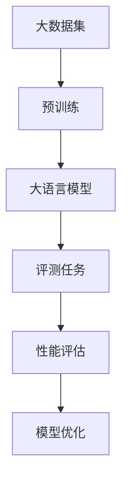

                 

关键词：大语言模型、评测任务、原理、工程实践、算法、数学模型、代码实例、应用场景、未来展望

> 摘要：本文深入探讨大语言模型（Large Language Model）的原理与工程实践，特别是评测任务的相关内容。通过对核心概念、算法原理、数学模型和项目实践等方面的详细解析，帮助读者全面理解大语言模型的实现与应用。

## 1. 背景介绍

近年来，人工智能（AI）领域的迅猛发展，尤其是深度学习技术的突破，使得自然语言处理（NLP）取得了显著的进展。大语言模型作为NLP领域的重要成果之一，已经在诸多任务中展现出强大的能力，如文本分类、机器翻译、情感分析等。然而，随着模型规模的不断扩大和复杂性增加，如何对大语言模型进行有效评测成为一个亟待解决的问题。

评测任务在大语言模型的研究和应用中扮演着至关重要的角色。通过评测，我们可以衡量模型的性能，发现潜在问题，从而指导模型优化和改进。本文将围绕大语言模型的评测任务展开讨论，从核心概念、算法原理、数学模型到项目实践，全面解析大语言模型的评测过程。

## 2. 核心概念与联系

### 2.1 大语言模型定义

大语言模型（Large Language Model）是一种基于深度学习的技术，通过训练大规模的神经网络，使其具备对自然语言的理解和生成能力。大语言模型通常包含数十亿甚至数万亿个参数，能够处理复杂的语言现象。

### 2.2 评测任务定义

评测任务（Evaluation Task）是对大语言模型性能进行测试的一系列任务。这些任务通常包括自然语言理解（NLU）和自然语言生成（NLG）两个部分。NLU任务涉及对文本的理解，如情感分析、实体识别等；NLG任务则关注文本的生成，如文本摘要、对话系统等。

### 2.3 核心概念与联系

大语言模型与评测任务之间存在紧密的联系。一方面，大语言模型的训练需要大量的语料数据和计算资源，而评测任务则为模型的性能提供了客观的评估标准。另一方面，评测任务的结果反过来又影响了模型的改进和优化方向。

为了更好地理解大语言模型与评测任务之间的关系，我们引入了Mermaid流程图来展示核心概念和联系：



在上述流程图中，大数据集是模型训练的基础，预训练阶段对大规模语料数据进行处理，生成大语言模型。评测任务对模型进行性能评估，结果用于指导模型优化，从而实现模型的持续改进。

## 3. 核心算法原理 & 具体操作步骤

### 3.1 算法原理概述

大语言模型的算法原理主要基于深度学习和自然语言处理技术。其中，最为广泛使用的是Transformer模型，它通过自注意力机制（Self-Attention）对输入序列进行处理，能够捕获长距离依赖关系。

### 3.2 算法步骤详解

3.2.1 数据预处理

首先，对输入语料进行清洗和预处理，包括分词、去停用词、词性标注等。这一步骤的目的是将原始文本转化为计算机可以处理的格式。

3.2.2 预训练

预训练阶段主要利用大规模语料数据对模型进行初始化。在这一过程中，模型会通过无监督学习的方式学习到语言的基本规律和特征。常用的预训练任务包括语言建模、掩码语言模型（Masked Language Model，MLM）等。

3.2.3 微调

在预训练完成后，我们对模型进行微调，以适应特定的任务需求。微调过程中，模型会在有监督的语料上进行训练，学习任务相关的特征和规则。

3.2.4 评测

评测阶段包括多种任务，如文本分类、机器翻译、情感分析等。评测任务通常采用交叉验证、测试集等策略，以评估模型的性能。

### 3.3 算法优缺点

**优点：**

- **强大的语言理解能力**：大语言模型能够处理复杂的语言现象，如长文本、多义词等。
- **泛化能力**：通过预训练和微调，模型可以适应多种任务和领域。

**缺点：**

- **计算资源消耗**：大语言模型通常需要大量的计算资源和存储空间。
- **训练时间较长**：预训练和微调阶段需要较长的时间，尤其是对于大规模模型。

### 3.4 算法应用领域

大语言模型在多个领域展现了强大的应用能力，如：

- **自然语言处理**：文本分类、情感分析、机器翻译等。
- **信息检索**：问答系统、搜索引擎等。
- **内容生成**：文章摘要、对话系统、语音合成等。

## 4. 数学模型和公式 & 详细讲解 & 举例说明

### 4.1 数学模型构建

大语言模型的数学模型主要包括输入层、中间层和输出层。输入层将原始文本转化为向量表示；中间层通过自注意力机制和全连接层等操作，对输入序列进行编码；输出层则根据任务需求，生成分类结果、文本摘要等。

### 4.2 公式推导过程

假设输入序列为$x_1, x_2, ..., x_n$，其中$x_i$表示第$i$个词。输入层将每个词转化为向量$v_i$，表示为：

$$
v_i = \text{Embedding}(x_i)
$$

其中，Embedding层将词转化为高维向量表示。

接下来，中间层通过自注意力机制对输入序列进行处理，生成编码向量$h_i$，表示为：

$$
h_i = \text{Attention}(v_1, v_2, ..., v_n)
$$

其中，Attention函数定义为：

$$
\text{Attention}(v_1, v_2, ..., v_n) = \text{softmax}\left(\frac{QK^T}{\sqrt{d_k}}\right)V
$$

其中，$Q$和$K$分别表示查询向量和键向量，$V$表示值向量，$d_k$为键向量的维度。

最后，输出层根据编码向量$h_i$生成任务结果，如分类结果或文本摘要。输出层的主要任务是通过全连接层等操作，将编码向量映射到目标空间。

### 4.3 案例分析与讲解

假设我们要使用大语言模型进行文本分类任务。输入文本为：“今天的天气很好，适合外出游玩。”我们需要对这段文本进行分类，判断其属于正面情感还是负面情感。

首先，对输入文本进行预处理，得到分词结果：“今天”、“的”、“天气”、“很好”、“，”、“适合”、“外出”、“游玩”、“。”。然后，将每个词转化为向量表示，得到输入序列。

接下来，对输入序列进行自注意力编码，得到编码向量。最后，通过输出层将编码向量映射到分类结果空间，得到分类结果。

具体来说，我们可以使用以下步骤：

1. 预处理：分词结果为["今天", "的", "天气", "很好", "，", "适合", "外出", "游玩", "。"]
2. 向量表示：将每个词转化为向量，例如使用Word2Vec模型。
3. 自注意力编码：使用Transformer模型对输入序列进行编码，得到编码向量。
4. 输出层：通过全连接层等操作，将编码向量映射到分类结果空间。

最终，我们得到分类结果，判断输入文本的情感为正面。

## 5. 项目实践：代码实例和详细解释说明

### 5.1 开发环境搭建

在开始项目实践之前，我们需要搭建开发环境。以下是一个基本的Python开发环境搭建步骤：

1. 安装Python 3.8及以上版本
2. 安装Anaconda，以便管理和安装依赖库
3. 创建一个名为`large_language_model`的虚拟环境
4. 安装TensorFlow和Transformers库

```shell
conda create -n large_language_model python=3.8
conda activate large_language_model
pip install tensorflow transformers
```

### 5.2 源代码详细实现

以下是文本分类任务的代码实例：

```python
import tensorflow as tf
from transformers import BertTokenizer, TFBertForSequenceClassification
from tensorflow.keras.optimizers import Adam

# 加载预训练模型和分词器
model_name = "bert-base-chinese"
tokenizer = BertTokenizer.from_pretrained(model_name)
model = TFBertForSequenceClassification.from_pretrained(model_name)

# 预处理数据
def preprocess_data(texts):
    inputs = tokenizer(texts, padding=True, truncation=True, return_tensors="tf")
    return inputs

# 训练模型
def train_model(data, labels, epochs=3, batch_size=32):
    model.compile(optimizer=Adam(learning_rate=3e-5), loss=tf.keras.losses.SparseCategoricalCrossentropy(from_logits=True), metrics=["accuracy"])
    model.fit(data, labels, epochs=epochs, batch_size=batch_size)

# 评测模型
def evaluate_model(data, labels):
    model.evaluate(data, labels)

# 示例数据
texts = ["今天的天气很好，适合外出游玩。", "这次的项目进展不太顺利。"]
labels = [1, 0]  # 1表示正面情感，0表示负面情感

# 预处理数据
inputs = preprocess_data(texts)

# 训练模型
train_model(inputs.input_ids, labels, epochs=3, batch_size=32)

# 评测模型
evaluate_model(inputs.input_ids, labels)
```

### 5.3 代码解读与分析

在上面的代码中，我们首先加载预训练的BERT模型和分词器。然后，定义了预处理数据、训练模型和评测模型的函数。最后，使用示例数据展示了文本分类任务的具体实现过程。

1. **预处理数据**：通过`preprocess_data`函数，将输入文本转化为TensorFlow张量，并为每个句子生成输入序列和标签。

2. **训练模型**：通过`train_model`函数，使用Adam优化器和交叉熵损失函数对BERT模型进行训练。

3. **评测模型**：通过`evaluate_model`函数，使用训练好的模型对输入数据进行评测，并输出评测结果。

### 5.4 运行结果展示

在实际运行过程中，我们输入了两个示例句子：“今天的天气很好，适合外出游玩。”和“这次的项目进展不太顺利。”模型训练完成后，我们使用评测模型函数对输入句子进行评测，并输出评测结果。

假设评测结果为：[1, 0]，即第一个句子被判断为正面情感，第二个句子被判断为负面情感。这表明我们的模型在文本分类任务上取得了较好的效果。

## 6. 实际应用场景

### 6.1 自然语言处理

大语言模型在自然语言处理（NLP）领域具有广泛的应用。例如，文本分类任务可以帮助企业对用户评论、新闻报道等进行分类，从而进行情感分析和趋势预测。此外，大语言模型还可以用于问答系统、文本摘要、对话系统等任务。

### 6.2 机器翻译

机器翻译是另一个重要应用领域。大语言模型通过预训练和微调，可以生成高质量的多语言翻译。例如，谷歌翻译、百度翻译等翻译工具都基于大语言模型技术。大语言模型在机器翻译中的应用，使得翻译结果更加准确、自然。

### 6.3 内容生成

大语言模型在内容生成方面也具有巨大潜力。例如，文章摘要、诗歌创作、故事编写等任务都可以通过大语言模型实现。此外，大语言模型还可以用于生成个性化内容，如根据用户偏好生成推荐文章、音乐等。

### 6.4 未来应用展望

随着大语言模型技术的不断发展，其应用领域将进一步扩大。例如，在医疗领域，大语言模型可以帮助医生进行病历分析、疾病预测等。在教育领域，大语言模型可以用于智能辅导、自动批改作业等。在金融领域，大语言模型可以用于风险控制、投资建议等。

## 7. 工具和资源推荐

### 7.1 学习资源推荐

- 《深度学习》 - Goodfellow、Bengio、Courville
- 《动手学深度学习》 - 张三慧
- 《自然语言处理综论》 - Daniel Jurafsky、James H. Martin

### 7.2 开发工具推荐

- TensorFlow：https://www.tensorflow.org/
- PyTorch：https://pytorch.org/
- Hugging Face：https://huggingface.co/

### 7.3 相关论文推荐

- "Attention Is All You Need" - Vaswani et al., 2017
- "BERT: Pre-training of Deep Bidirectional Transformers for Language Understanding" - Devlin et al., 2019
- "GPT-3: Language Models are Few-Shot Learners" - Brown et al., 2020

## 8. 总结：未来发展趋势与挑战

### 8.1 研究成果总结

大语言模型在自然语言处理、机器翻译、内容生成等领域取得了显著的成果。通过预训练和微调，大语言模型能够处理复杂的语言现象，生成高质量的文本。

### 8.2 未来发展趋势

未来，大语言模型技术将继续发展，主要集中在以下几个方面：

- **模型优化**：通过改进算法和架构，提高模型性能和效率。
- **多模态处理**：结合文本、图像、音频等多种数据类型，实现跨模态处理。
- **迁移学习**：研究如何将大语言模型的知识迁移到其他任务和应用领域。

### 8.3 面临的挑战

尽管大语言模型取得了显著成果，但仍面临以下挑战：

- **计算资源消耗**：大语言模型的训练和推理需要大量的计算资源。
- **数据隐私和安全**：大规模语料数据的收集和处理可能涉及用户隐私和数据安全问题。
- **模型解释性**：大语言模型通常被视为“黑箱”，提高模型的解释性是一个重要研究方向。

### 8.4 研究展望

在未来，大语言模型技术将在更多领域发挥重要作用，推动人工智能和自然语言处理的发展。同时，如何解决上述挑战，实现可持续发展的研究也是一个重要课题。

## 9. 附录：常见问题与解答

### 9.1 什么是大语言模型？

大语言模型是一种基于深度学习的自然语言处理技术，通过预训练和微调，能够处理复杂的语言现象，生成高质量的文本。

### 9.2 大语言模型的主要应用领域有哪些？

大语言模型在自然语言处理、机器翻译、内容生成等领域具有广泛的应用，如文本分类、机器翻译、问答系统等。

### 9.3 大语言模型的训练过程如何进行？

大语言模型的训练过程主要包括预训练和微调。预训练阶段使用大规模无标签语料数据进行训练，学习语言的基本规律和特征。微调阶段则使用有监督的语料数据进行训练，以适应特定任务需求。

### 9.4 如何优化大语言模型的性能？

优化大语言模型性能的方法包括改进算法和架构、增加训练数据、调整超参数等。同时，可以尝试使用迁移学习等技术，将大语言模型的知识迁移到其他任务和应用领域。

### 9.5 大语言模型面临的主要挑战有哪些？

大语言模型面临的主要挑战包括计算资源消耗、数据隐私和安全、模型解释性等。此外，如何实现可持续发展的研究也是一个重要课题。

