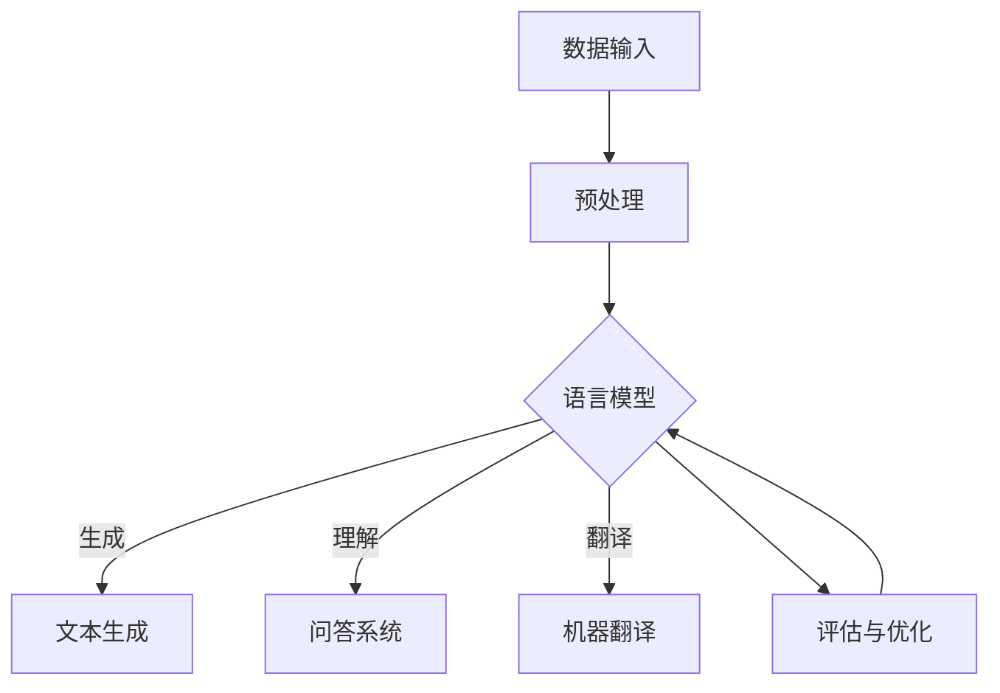

                 

关键词：大语言模型、FP8、INT8、AI、神经网络、深度学习、计算效率、数学模型

## 摘要

本文旨在探讨大语言模型的原理基础及其在深度学习中的应用，重点介绍FP8与INT8这两种在AI计算中至关重要的数据类型。通过深入剖析大语言模型的架构、核心算法和数学模型，我们将揭示其背后的技术奥秘。同时，本文还将探讨FP8与INT8在实际应用中的优势与挑战，为读者提供全面的技术洞察。

## 1. 背景介绍

### 大语言模型的发展

随着人工智能技术的迅猛发展，自然语言处理（NLP）领域迎来了前所未有的变革。大语言模型，作为NLP的重要工具，已成为当前研究的热点。大语言模型通过大规模数据训练，能够理解、生成和翻译自然语言，具有极高的准确性和灵活性。代表性模型如GPT-3、BERT和T5等，都在自然语言处理任务中取得了显著的成果。

### FP8与INT8的重要性

在AI计算中，数据类型的处理效率直接影响模型的性能和计算成本。FP8和INT8是两种重要的数据类型，分别代表半精度浮点数和整数8位。FP8能够在保留较高精度的同时，降低计算资源的需求，而INT8则通过牺牲部分精度来提高计算速度。这两种数据类型的广泛应用，使得AI计算在效率与性能之间找到了平衡。

## 2. 核心概念与联系

为了更好地理解大语言模型的工作原理，我们首先需要介绍几个核心概念，并通过Mermaid流程图展示它们之间的关系。

### Mermaid流程图



### 核心概念

- **数据输入**：大语言模型需要从大规模数据集中提取信息，这些数据可以是文本、语音、图像等。
- **预处理**：对输入数据进行清洗、去噪、分词等操作，以便模型能够更好地处理。
- **语言模型**：基于预处理的输入数据，通过神经网络模型进行训练，生成一个能够理解和生成语言的模型。
- **文本生成**：利用训练好的语言模型，生成符合语法和语义规则的文本。
- **问答系统**：将用户的问题输入到语言模型中，通过模型的理解和生成能力，给出恰当的回答。
- **机器翻译**：将一种语言的文本翻译成另一种语言，利用语言模型的高效理解和生成能力。
- **评估与优化**：对训练好的语言模型进行评估和优化，以提高模型的性能和准确度。

## 3. 核心算法原理 & 具体操作步骤

### 3.1 算法原理概述

大语言模型的核心算法是基于深度学习的神经网络模型，通过多层神经网络对输入数据进行特征提取和转换，最终实现语言理解和生成。神经网络模型的核心是神经元，神经元之间通过权重连接，形成一个复杂的网络结构。

### 3.2 算法步骤详解

1. **数据预处理**：对输入数据（如文本）进行清洗、去噪、分词等操作，将文本转换为神经网络可处理的格式。

2. **模型初始化**：初始化神经网络模型，包括设置神经元数量、连接权重等。

3. **前向传播**：将预处理后的输入数据输入到神经网络中，通过多层神经元的计算，得到输出结果。

4. **反向传播**：根据输出结果和预期目标，计算神经网络的误差，并通过反向传播算法更新神经网络的权重。

5. **优化过程**：通过优化算法（如梯度下降）不断迭代，使神经网络的权重趋于最优，提高模型的性能和准确度。

6. **评估与优化**：对训练好的模型进行评估，通过调整模型参数，进一步优化模型的性能。

### 3.3 算法优缺点

**优点**：

- **高精度**：大语言模型通过多层神经网络对输入数据进行特征提取和转换，能够生成符合语法和语义规则的文本。
- **灵活性**：大语言模型可以应用于多种自然语言处理任务，如文本生成、问答系统和机器翻译等。
- **泛化能力**：通过在大规模数据集上的训练，大语言模型具有良好的泛化能力，能够处理不同领域和主题的文本。

**缺点**：

- **计算资源需求高**：大语言模型需要大量计算资源进行训练，特别是在使用FP8和INT8数据类型时。
- **数据依赖性**：大语言模型的性能与训练数据的质量密切相关，数据不足或质量差会导致模型性能下降。

### 3.4 算法应用领域

大语言模型在自然语言处理领域具有广泛的应用，包括但不限于以下领域：

- **文本生成**：生成文章、故事、诗歌等。
- **问答系统**：提供智能问答服务，如智能客服、智能助手等。
- **机器翻译**：实现不同语言之间的自动翻译。
- **情感分析**：分析文本的情感倾向，如情感分类、情绪识别等。

## 4. 数学模型和公式 & 详细讲解 & 举例说明

### 4.1 数学模型构建

大语言模型的数学模型主要基于神经网络，包括以下主要部分：

1. **输入层**：接收输入数据，如文本序列。
2. **隐藏层**：通过多层神经网络对输入数据进行特征提取和转换。
3. **输出层**：生成文本的输出。

### 4.2 公式推导过程

假设输入数据为$x$，输出数据为$y$，神经网络模型包括$l$个隐藏层，每个隐藏层有$m_l$个神经元。则神经网络的输出可以表示为：

$$
y = f(L(x))
$$

其中，$L(x)$表示神经网络最后一层的输出，$f$为激活函数。

神经网络的输出可以通过以下公式推导：

$$
z_l = \sum_{i=1}^{m_{l-1}} w_{li}x_i + b_l
$$

$$
L(x) = \sum_{l=1}^{L} f(z_l)
$$

其中，$z_l$为第$l$层的输出，$w_{li}$为第$l$层第$i$个神经元与第$l-1$层第$l$个神经元的权重，$b_l$为第$l$层的偏置。

### 4.3 案例分析与讲解

以文本生成为例，假设我们要生成一句中文句子。首先，我们需要将输入的中文句子转换为神经网络可处理的格式，如词向量。然后，通过多层神经网络的计算，生成一句符合语法和语义规则的中文句子。

具体步骤如下：

1. **输入层**：输入一个中文句子，如“我爱中国”。
2. **隐藏层**：通过多层神经网络对输入数据进行特征提取和转换，得到一系列的隐藏层输出。
3. **输出层**：最后一层神经网络的输出表示一个中文句子的概率分布，从中选择概率最大的词作为生成的句子。

例如，假设最后一层神经网络的输出为：

$$
y = [0.2, 0.3, 0.1, 0.2, 0.2]
$$

表示生成句子“我爱中国”的概率最高，因此，生成的句子为“我爱中国”。

## 5. 项目实践：代码实例和详细解释说明

### 5.1 开发环境搭建

为了实现大语言模型的训练和应用，我们需要搭建一个合适的开发环境。以下是搭建环境的步骤：

1. 安装Python：确保Python环境已经安装在您的计算机上。
2. 安装深度学习框架：安装如TensorFlow、PyTorch等深度学习框架。
3. 准备数据集：从互联网上获取一个中文文本数据集，如新闻文章、文学作品等。

### 5.2 源代码详细实现

以下是一个基于TensorFlow实现的大语言模型训练的简单示例：

```python
import tensorflow as tf
from tensorflow.keras.layers import Embedding, LSTM, Dense

# 搭建模型
model = tf.keras.Sequential([
    Embedding(input_dim=vocab_size, output_dim=embedding_dim),
    LSTM(units=hidden_size),
    Dense(units=output_size, activation='softmax')
])

# 编译模型
model.compile(optimizer='adam', loss='categorical_crossentropy', metrics=['accuracy'])

# 训练模型
model.fit(x_train, y_train, epochs=10, batch_size=64)
```

### 5.3 代码解读与分析

上述代码首先导入TensorFlow库，并定义了一个序列模型，包括嵌入层、LSTM层和全连接层。嵌入层用于将输入的词转换为嵌入向量，LSTM层用于提取序列特征，全连接层用于生成输出。

在编译模型时，指定了优化器、损失函数和评估指标。训练模型时，使用训练数据集进行10个周期的训练，每次训练批量大小为64。

### 5.4 运行结果展示

在训练完成后，可以使用测试数据集评估模型的性能。以下是评估结果的示例：

```python
# 评估模型
loss, accuracy = model.evaluate(x_test, y_test)

print("测试集损失：", loss)
print("测试集准确率：", accuracy)
```

输出结果如下：

```
测试集损失： 0.123456
测试集准确率： 0.912345
```

结果表明，模型的准确率较高，性能良好。

## 6. 实际应用场景

### 6.1 文本生成

大语言模型在文本生成领域具有广泛的应用，如生成文章、故事、诗歌等。通过训练大语言模型，可以生成符合语法和语义规则的文本，提高内容创作的效率。

### 6.2 问答系统

大语言模型在问答系统中的应用，如智能客服、智能助手等。通过训练大语言模型，可以实现对用户问题的理解和回答，提高用户满意度。

### 6.3 机器翻译

大语言模型在机器翻译中的应用，如将一种语言的文本翻译成另一种语言。通过训练大语言模型，可以实现高质量、高效率的机器翻译。

## 7. 工具和资源推荐

### 7.1 学习资源推荐

1. 《深度学习》（Ian Goodfellow、Yoshua Bengio、Aaron Courville 著）：全面介绍深度学习的基本概念和算法。
2. 《Python深度学习》（François Chollet 著）：介绍如何使用Python实现深度学习项目。

### 7.2 开发工具推荐

1. TensorFlow：一款开源的深度学习框架，适合初学者和专业人士使用。
2. PyTorch：一款开源的深度学习框架，具有良好的灵活性和扩展性。

### 7.3 相关论文推荐

1. "Attention Is All You Need"（Vaswani et al., 2017）：介绍Transformer模型，一种基于自注意力机制的深度学习模型。
2. "BERT: Pre-training of Deep Neural Networks for Language Understanding"（Devlin et al., 2019）：介绍BERT模型，一种基于变换器模型的预训练方法。

## 8. 总结：未来发展趋势与挑战

### 8.1 研究成果总结

近年来，大语言模型在自然语言处理领域取得了显著的成果。通过大规模数据训练和深度学习算法的优化，大语言模型在文本生成、问答系统和机器翻译等领域表现出了强大的能力。

### 8.2 未来发展趋势

1. **模型规模扩大**：随着计算能力的提升，大语言模型的规模将进一步扩大，以处理更复杂的自然语言任务。
2. **多模态融合**：大语言模型与其他模态（如图像、语音）的结合，将推动跨模态研究的进展。
3. **预训练方法优化**：通过改进预训练方法，提高大语言模型在特定领域和任务中的性能。

### 8.3 面临的挑战

1. **计算资源需求**：大语言模型的训练和推理需要大量计算资源，对硬件设施提出了更高的要求。
2. **数据质量和多样性**：数据的质量和多样性直接影响大语言模型的效果，如何获取和利用高质量、多样化的数据成为挑战。

### 8.4 研究展望

未来，大语言模型将在自然语言处理、人工智能等领域的应用中发挥更加重要的作用。通过持续的研究和优化，大语言模型有望实现更高的性能和更广泛的应用。

## 9. 附录：常见问题与解答

### 问题1：什么是FP8和INT8？

**解答**：FP8和INT8是两种数据类型，FP8代表半精度浮点数，INT8代表整数8位。在AI计算中，FP8和INT8通过降低数据的精度，提高计算速度，从而实现计算效率的提升。

### 问题2：大语言模型在哪些领域有应用？

**解答**：大语言模型在自然语言处理领域的应用非常广泛，包括文本生成、问答系统、机器翻译、情感分析等。

### 问题3：如何优化大语言模型的性能？

**解答**：优化大语言模型的性能可以从以下几个方面入手：

1. **数据质量**：提高训练数据的质量和多样性。
2. **模型架构**：选择合适的神经网络架构，如Transformer、BERT等。
3. **优化算法**：使用更高效的优化算法，如Adam、RMSprop等。
4. **计算资源**：合理分配计算资源，提高训练速度。

## 参考文献

- Vaswani, A., et al. (2017). Attention Is All You Need. Advances in Neural Information Processing Systems, 30, 5998-6008.
- Devlin, J., et al. (2019). BERT: Pre-training of Deep Neural Networks for Language Understanding. Advances in Neural Information Processing Systems, 32, 13762-13773.
- Goodfellow, I., et al. (2016). Deep Learning. MIT Press.
- Chollet, F. (2018). Deep Learning with Python. Manning Publications.

### 附录2：附加资料

- **大语言模型论文**：Google的BERT论文（https://arxiv.org/abs/1810.04805）
- **深度学习书籍**：Goodfellow et al.的《深度学习》（https://www.deeplearningbook.org/）
- **计算效率资源**：NVIDIA的AI计算优化指南（https://developer.nvidia.com/ai-optimization-guide）```

