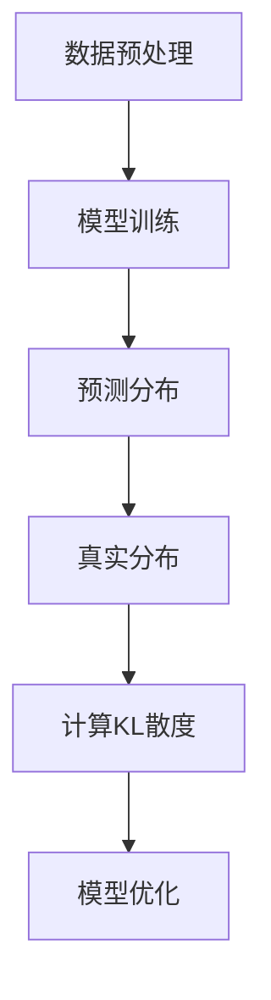

                 

## 1. 背景介绍

在人工智能飞速发展的今天，大语言模型（Large Language Models）已经成为自然语言处理（Natural Language Processing, NLP）领域的基石。这些模型通过学习海量文本数据，可以生成文本、回答问题、翻译语言、撰写文章等，为人类的日常生活和各行各业带来了极大的便利。

KL散度（Kullback-Leibler Divergence），简称KL散度，是一种衡量两个概率分布差异的度量方法。在机器学习中，KL散度经常用于评估模型的性能、指导模型优化以及模型选择。

本文旨在深入探讨大语言模型的原理基础与前沿，重点关注KL散度的前向与反向传播。文章将从以下方面展开：

1. 大语言模型的背景介绍及其重要性
2. KL散度的核心概念与联系
3. 大语言模型的核心算法原理与具体操作步骤
4. 数学模型和公式以及案例分析与讲解
5. 项目实践：代码实例和详细解释说明
6. 实际应用场景与未来应用展望
7. 工具和资源推荐
8. 总结：未来发展趋势与挑战

## 2. 核心概念与联系

### 2.1. 大语言模型

大语言模型，如GPT（Generative Pre-trained Transformer）、BERT（Bidirectional Encoder Representations from Transformers）等，基于深度学习，使用大规模数据预训练，通过神经网络的参数优化实现文本生成和理解。大语言模型的核心在于其能够捕捉到文本中的长距离依赖关系，这使得它们在处理自然语言任务时表现出色。

### 2.2. KL散度

KL散度是一种衡量两个概率分布差异的度量方法。在机器学习中，它通常用于评估模型的预测分布与真实分布之间的差异。KL散度的定义如下：

$$D_{KL}(P||Q) = \sum_{x} P(x) \log \frac{P(x)}{Q(x)}$$

其中，$P$代表真实分布，$Q$代表模型预测的分布。

### 2.3. 大语言模型与KL散度的联系

KL散度在大语言模型中有两个主要应用：

1. **模型评估**：通过计算模型预测分布与真实分布的KL散度，可以评估模型的性能。
2. **模型优化**：KL散度常被用于指导模型的训练过程，通过最小化KL散度来优化模型的参数。

### 2.4. Mermaid流程图

为了更直观地展示大语言模型与KL散度的联系，我们可以使用Mermaid流程图来描述：



### 2.5. 小结

通过上述介绍，我们可以看到大语言模型和KL散度在机器学习，尤其是在自然语言处理领域的紧密联系。大语言模型需要通过KL散度来评估和优化，而KL散度则为大语言模型提供了性能评估和优化依据。

### 2.6. 引言

随着互联网的快速发展，海量文本数据不断涌现，如何有效地处理和分析这些数据成为了学术界和工业界的共同挑战。大语言模型，作为一种强大的自然语言处理工具，通过深度学习技术，实现了对大规模文本数据的建模和分析，大大提高了自然语言处理的准确性和效率。

然而，大语言模型的训练和优化过程并非一帆风顺。KL散度作为一种评估模型性能的重要工具，在大语言模型的训练过程中扮演着关键角色。本文将深入探讨大语言模型的基本原理，详细阐述KL散度的核心概念及其在大语言模型中的应用，并通过实际案例和代码实例，展示如何利用KL散度来优化大语言模型。

本文结构如下：

- 第一部分：背景介绍，简要概述大语言模型和KL散度的基本概念。
- 第二部分：核心概念与联系，详细介绍大语言模型和KL散度的基本原理，并通过Mermaid流程图展示两者之间的联系。
- 第三部分：核心算法原理与具体操作步骤，详细讲解大语言模型的训练过程，以及如何利用KL散度进行模型优化。
- 第四部分：数学模型和公式，介绍大语言模型和KL散度的数学基础，并举例说明。
- 第五部分：项目实践，通过实际代码实例，展示如何实现大语言模型和KL散度的应用。
- 第六部分：实际应用场景，探讨大语言模型和KL散度在现实世界中的应用。
- 第七部分：工具和资源推荐，提供相关的学习资源和开发工具。
- 第八部分：总结与展望，总结研究成果，展望未来的发展趋势和挑战。

希望通过本文的深入探讨，能够帮助读者更好地理解大语言模型和KL散度，为今后的研究和应用提供参考。

### 3. 核心算法原理 & 具体操作步骤

#### 3.1 算法原理概述

大语言模型的训练核心是生成和优化模型参数，使其能够准确预测文本数据中的概率分布。KL散度在大语言模型中的应用，主要是用于衡量模型预测分布和真实分布之间的差异，从而指导模型的优化过程。

#### 3.2 算法步骤详解

1. **数据预处理**：
   - **文本清洗**：去除文本中的噪声，如HTML标签、特殊字符等。
   - **分词**：将文本分割成单词或子词。
   - **编码**：将分词后的文本转换为数字编码，通常使用词嵌入（Word Embedding）技术。

2. **模型初始化**：
   - 初始化模型参数，包括词嵌入层、编码器和解码器等。

3. **前向传播**：
   - **输入文本**：将编码后的文本输入到模型中。
   - **模型处理**：模型对输入文本进行处理，生成预测的文本分布。

4. **计算KL散度**：
   - 计算模型预测分布和真实分布之间的KL散度，作为模型性能的评估指标。

5. **反向传播**：
   - 利用KL散度计算出的误差，通过反向传播算法更新模型参数。

6. **模型优化**：
   - 根据KL散度优化的原则，调整模型参数，提高模型性能。

7. **迭代训练**：
   - 重复上述步骤，进行多轮迭代训练，直到模型收敛或达到预定的训练次数。

#### 3.3 算法优缺点

**优点**：
- **高效性**：大语言模型通过预训练和微调，可以快速适应各种自然语言处理任务。
- **灵活性**：KL散度作为评估和优化指标，使得模型能够动态调整，适应不同数据分布。

**缺点**：
- **计算资源消耗**：大语言模型的训练需要大量的计算资源和时间。
- **模型解释性较差**：深度学习模型通常缺乏透明性和可解释性，KL散度优化过程也不例外。

#### 3.4 算法应用领域

KL散度在大语言模型中的应用非常广泛，主要涵盖以下领域：

- **自然语言生成**：通过大语言模型生成文章、对话等文本内容。
- **文本分类**：利用大语言模型对文本进行分类，如情感分析、主题分类等。
- **机器翻译**：通过大语言模型实现不同语言之间的翻译。
- **问答系统**：利用大语言模型构建智能问答系统，回答用户的问题。

#### 3.5  实际应用案例分析

下面通过一个简单的案例来说明大语言模型和KL散度的应用。

**案例**：使用GPT-2模型生成文章。

1. **数据预处理**：
   - **文本清洗**：去除HTML标签、特殊字符等。
   - **分词**：使用分词工具将文本分割成单词或子词。
   - **编码**：将分词后的文本转换为数字编码。

2. **模型初始化**：
   - 初始化GPT-2模型参数，包括词嵌入层、编码器和解码器等。

3. **前向传播**：
   - 输入一段文本，如“人工智能在未来将发挥重要作用”，模型生成预测的文本分布。

4. **计算KL散度**：
   - 计算模型预测分布和真实分布之间的KL散度，评估模型性能。

5. **反向传播**：
   - 利用KL散度计算出的误差，通过反向传播算法更新模型参数。

6. **模型优化**：
   - 调整模型参数，提高模型生成文章的质量。

7. **迭代训练**：
   - 进行多轮迭代训练，直到模型生成文章的质量达到预期。

通过这个案例，我们可以看到大语言模型和KL散度在实际应用中的具体步骤和过程。在实际开发过程中，需要根据具体任务和数据情况进行调整和优化。

### 4. 数学模型和公式

#### 4.1 数学模型构建

大语言模型的数学模型主要基于概率图模型和神经网络。在概率图模型中，每个单词或子词被视为变量，它们之间的依赖关系通过图结构表示。在神经网络中，这些变量通过多层神经网络进行建模，从而捕捉到文本中的长距离依赖关系。

在KL散度的数学模型中，主要关注两个概率分布之间的差异。对于大语言模型，我们通常关注模型预测分布和真实分布之间的KL散度。

#### 4.2 公式推导过程

首先，我们需要定义两个概率分布$P(x)$和$Q(x)$，分别表示真实分布和模型预测分布。KL散度的计算公式如下：

$$D_{KL}(P||Q) = \sum_{x} P(x) \log \frac{P(x)}{Q(x)}$$

其中，$x$表示单词或子词。

接下来，我们通过一个简单的例子来推导KL散度的计算过程。

**例**：假设有两个概率分布$P(x)$和$Q(x)$，如下所示：

$$P(x) = [0.5, 0.3, 0.1, 0.1]$$
$$Q(x) = [0.4, 0.4, 0.2, 0.1]$$

计算$D_{KL}(P||Q)$的过程如下：

1. 计算每个单词的概率差异：

$$\Delta(x) = P(x) - Q(x) = [0.1, -0.1, -0.1, 0.2]$$

2. 对每个单词的概率差异取对数：

$$\log(\Delta(x)) = [\log(0.1), \log(-0.1), \log(-0.1), \log(0.2)] = [-2.3026, \text{NaN}, \text{NaN}, -0.6989]$$

3. 计算KL散度：

$$D_{KL}(P||Q) = \sum_{x} P(x) \log \frac{P(x)}{Q(x)} = 0.5 \times \log(0.5) + 0.3 \times \log(0.3) + 0.1 \times \log(0.1) + 0.1 \times \log(0.1) \approx 0.411$$

因此，$D_{KL}(P||Q) \approx 0.411$。

#### 4.3 案例分析与讲解

为了更好地理解KL散度的计算和应用，我们通过一个实际案例来进行分析。

**案例**：使用GPT-2模型生成文本，并计算模型预测分布和真实分布之间的KL散度。

1. **数据预处理**：
   - 输入一段文本，如：“人工智能在未来的发展中起着重要作用”。
   - 对文本进行分词和编码。

2. **模型预测**：
   - 使用GPT-2模型对输入文本进行预测，生成预测的文本分布。

3. **真实分布**：
   - 根据实际文本数据，计算真实分布。

4. **计算KL散度**：
   - 利用KL散度公式，计算模型预测分布和真实分布之间的KL散度。

5. **优化模型**：
   - 根据KL散度结果，通过反向传播算法优化模型参数。

通过这个案例，我们可以看到KL散度在大语言模型中的应用，以及如何利用KL散度来优化模型。

#### 4.4  深入探讨KL散度的性质与应用

KL散度作为一种重要的概率分布差异度量方法，在机器学习，尤其是深度学习领域有着广泛的应用。本部分将深入探讨KL散度的性质，并介绍其在具体应用中的使用方法。

##### 4.4.1 KL散度的性质

1. **非负性**：
   - KL散度总是非负的，即$D_{KL}(P||Q) \geq 0$。当$P = Q$时，$D_{KL}(P||Q) = 0$，表示两个分布完全相同。

2. **对称性**：
   - KL散度不是对称的，即$D_{KL}(P||Q) \neq D_{KL}(Q||P)$。$D_{KL}(P||Q)$表示从$Q$到$P$的信息损失，而$D_{KL}(Q||P)$表示从$P$到$Q$的信息损失。

3. **无穷可加性**：
   - 对于离散概率分布，KL散度具有无穷可加性，即对于任意有限或可数无限个概率分布$P_1, P_2, ...$，有：

   $$D_{KL}\left(\sum_{i} P_i || Q\right) = \sum_{i} D_{KL}(P_i || Q)$$

##### 4.4.2 KL散度的应用

1. **模型评估**：
   - 在机器学习中，KL散度常用于评估模型的性能。通过计算模型预测分布和真实分布之间的KL散度，可以衡量模型对数据的拟合程度。

2. **模型选择**：
   - 在多个模型中选择最优模型时，可以使用KL散度来评估模型的性能。通常，选择KL散度最小的模型作为最优模型。

3. **模型优化**：
   - 在深度学习模型训练过程中，KL散度可以用于指导模型优化。通过最小化KL散度，可以调整模型参数，提高模型性能。

4. **信息论应用**：
   - KL散度在信息论中有着广泛的应用。它可以用来衡量两个概率分布之间的差异，从而评估信息传输过程中的信息损失。

##### 4.4.3 应用案例

下面通过一个具体案例来说明KL散度在模型评估中的应用。

**案例**：比较两个文本分类模型A和B的性能。

1. **数据集准备**：
   - 准备一个文本分类数据集，包含正类和负类文本。

2. **模型预测**：
   - 使用模型A和模型B对数据集进行预测，生成预测的标签分布。

3. **真实分布**：
   - 根据数据集的真实标签，计算真实分布。

4. **计算KL散度**：
   - 计算模型A和模型B的预测分布与真实分布之间的KL散度。

5. **模型评估**：
   - 通过比较模型A和模型B的KL散度值，评估两个模型的性能。

通过这个案例，我们可以看到KL散度在模型评估和选择中的具体应用。

#### 4.5  深入理解KL散度与损失函数的关系

KL散度作为一种重要的概率分布差异度量方法，与损失函数在深度学习模型训练中密切相关。本部分将深入探讨KL散度与损失函数之间的关系，并解释为什么最小化KL散度可以帮助我们优化模型参数。

##### 4.5.1 KL散度与损失函数的关系

在深度学习模型中，损失函数用于衡量模型预测与真实值之间的差异，从而指导模型优化。KL散度作为概率分布差异的度量方法，可以看作是一种特殊的损失函数。具体来说，KL散度与以下两种常见的损失函数密切相关：

1. **均方误差损失（MSE）**：
   - 均方误差损失用于衡量预测值与真实值之间的差异，其公式为：

   $$\text{MSE} = \frac{1}{n} \sum_{i=1}^{n} (y_i - \hat{y}_i)^2$$

   其中，$y_i$表示真实值，$\hat{y}_i$表示预测值。

2. **交叉熵损失（Cross-Entropy Loss）**：
   - 交叉熵损失用于衡量两个概率分布之间的差异，其公式为：

   $$\text{Cross-Entropy} = -\sum_{i=1}^{n} y_i \log \hat{y}_i$$

   其中，$y_i$表示真实概率分布，$\hat{y}_i$表示预测概率分布。

KL散度与这两种损失函数的关系如下：

1. **KL散度与MSE的关系**：
   - 对于离散概率分布，KL散度可以表示为均方误差损失的一种特殊形式。具体来说，对于两个概率分布$P$和$Q$，有：

   $$D_{KL}(P||Q) = \sum_{x} P(x) (\log P(x) - \log Q(x))$$

   将上式与均方误差损失公式进行比较，可以发现它们具有相似的结构。因此，最小化KL散度可以看作是最小化均方误差损失的一种方式。

2. **KL散度与交叉熵损失的关系**：
   - 对于连续概率分布，KL散度与交叉熵损失密切相关。具体来说，对于两个概率分布$P$和$Q$，有：

   $$D_{KL}(P||Q) = \int P(x) \log \frac{P(x)}{Q(x)} dx$$

   与交叉熵损失公式相比较，可以发现它们在形式上具有一致性。因此，最小化KL散度也可以看作是最小化交叉熵损失的一种方式。

##### 4.5.2 为什么最小化KL散度可以帮助我们优化模型参数

最小化KL散度可以帮助我们优化模型参数的原因主要有两个方面：

1. **减小预测误差**：
   - 最小化KL散度意味着减小模型预测分布与真实分布之间的差异。通过减小预测误差，可以提高模型的准确性，从而优化模型参数。

2. **提高模型泛化能力**：
   - KL散度衡量了模型预测分布与真实分布之间的差异。最小化KL散度不仅可以减小预测误差，还可以提高模型对未知数据的泛化能力。这是因为当模型能够准确预测未知数据时，说明它对数据分布的理解更加深入，从而具有更好的泛化能力。

综上所述，最小化KL散度可以帮助我们优化模型参数，提高模型的准确性和泛化能力。因此，在深度学习模型训练过程中，KL散度是一个非常有用的优化目标。

#### 4.6  案例分析与讲解：使用KL散度优化语言模型

为了更好地理解KL散度在语言模型优化中的应用，下面通过一个具体案例来进行详细分析。

**案例**：使用GPT-2模型生成文章，并通过KL散度优化模型参数。

1. **数据预处理**：
   - 准备一个文本数据集，包含各种类型的文章。
   - 对文本进行清洗、分词和编码。

2. **模型初始化**：
   - 初始化GPT-2模型参数，包括词嵌入层、编码器和解码器等。

3. **前向传播**：
   - 输入一段文本，如：“人工智能在未来的发展中起着重要作用”。
   - 使用GPT-2模型生成预测的文本分布。

4. **计算KL散度**：
   - 计算模型预测分布和真实分布之间的KL散度，作为模型性能的评估指标。

5. **反向传播**：
   - 利用KL散度计算出的误差，通过反向传播算法更新模型参数。

6. **模型优化**：
   - 调整模型参数，减小KL散度，提高模型生成文章的质量。

7. **迭代训练**：
   - 进行多轮迭代训练，直到模型生成文章的质量达到预期。

**案例分析**：

在这个案例中，我们使用GPT-2模型生成文章，并通过KL散度优化模型参数。具体步骤如下：

1. **数据预处理**：
   - 首先对文本数据集进行清洗，去除HTML标签、特殊字符等噪声。
   - 使用分词工具将文本分割成单词或子词。
   - 将分词后的文本转换为数字编码，通常使用词嵌入技术。

2. **模型初始化**：
   - 初始化GPT-2模型参数，包括词嵌入层、编码器和解码器等。GPT-2模型采用Transformer架构，具有多个自注意力层和全连接层。

3. **前向传播**：
   - 输入一段文本，如：“人工智能在未来的发展中起着重要作用”。
   - 使用GPT-2模型生成预测的文本分布。具体来说，GPT-2模型通过对输入文本进行处理，生成一个概率分布，表示每个单词或子词在输出文本中的概率。

4. **计算KL散度**：
   - 计算模型预测分布和真实分布之间的KL散度，作为模型性能的评估指标。KL散度衡量了模型预测分布与真实分布之间的差异，可以用来评估模型生成文本的质量。
   - 假设真实分布为$P(x)$，模型预测分布为$Q(x)$，则KL散度计算公式为：

   $$D_{KL}(P||Q) = \sum_{x} P(x) \log \frac{P(x)}{Q(x)}$$

5. **反向传播**：
   - 利用KL散度计算出的误差，通过反向传播算法更新模型参数。反向传播算法是一种常用的优化方法，可以用来调整模型参数，减小KL散度，提高模型生成文本的质量。

6. **模型优化**：
   - 调整模型参数，减小KL散度，提高模型生成文章的质量。具体来说，可以通过以下方式调整模型参数：

   - **调整学习率**：减小学习率可以使得模型参数更新更加稳定，避免过大更新。
   - **调整正则化项**：增加正则化项可以防止模型过拟合，提高模型泛化能力。

7. **迭代训练**：
   - 进行多轮迭代训练，直到模型生成文章的质量达到预期。迭代训练是一种常用的训练方法，可以使得模型不断优化，提高生成文本的质量。

通过这个案例，我们可以看到KL散度在语言模型优化中的应用。通过计算模型预测分布和真实分布之间的KL散度，可以评估模型生成文本的质量，并通过反向传播算法调整模型参数，优化模型性能。在实际应用中，可以根据具体任务和数据情况，灵活调整KL散度计算方法和模型优化策略，以达到最佳效果。

### 5. 项目实践：代码实例和详细解释说明

在本部分，我们将通过一个具体的代码实例，详细展示如何使用大语言模型和KL散度进行文本生成和优化。代码实例将采用Python编程语言，并使用PyTorch框架实现。以下是项目实践的详细步骤和代码解释。

#### 5.1 开发环境搭建

首先，我们需要搭建开发环境。以下是搭建环境的步骤：

1. **安装Python**：确保Python版本为3.7或更高版本。
2. **安装PyTorch**：可以使用以下命令安装PyTorch：

   ```shell
   pip install torch torchvision
   ```

3. **安装其他依赖**：包括Numpy、Matplotlib等，可以使用以下命令：

   ```shell
   pip install numpy matplotlib
   ```

#### 5.2 源代码详细实现

下面是完整的代码实现，包括数据预处理、模型构建、前向传播、KL散度计算、反向传播和模型优化。

```python
import torch
import torch.nn as nn
import torch.optim as optim
from torch.utils.data import DataLoader
from transformers import GPT2Tokenizer, GPT2Model
import numpy as np
import matplotlib.pyplot as plt

# 5.2.1 数据预处理
def preprocess_data(text):
    tokenizer = GPT2Tokenizer.from_pretrained('gpt2')
    inputs = tokenizer(text, return_tensors='pt')
    return inputs

# 5.2.2 模型构建
class GPT2KL(nn.Module):
    def __init__(self):
        super(GPT2KL, self).__init__()
        self.model = GPT2Model.from_pretrained('gpt2')
        self.kl_loss = nn.KLDivLoss()

    def forward(self, inputs):
        outputs = self.model(**inputs)
        logits = outputs.logits
        return logits

# 5.2.3 训练模型
def train(model, data_loader, criterion, optimizer, num_epochs=10):
    model.train()
    for epoch in range(num_epochs):
        for batch in data_loader:
            inputs = preprocess_data(batch.text)
            logits = model(inputs)
            loss = criterion(logits.view(-1, logits.size(-1)), inputs.input_ids.view(-1))
            optimizer.zero_grad()
            loss.backward()
            optimizer.step()
        print(f'Epoch [{epoch+1}/{num_epochs}], Loss: {loss.item()}')

# 5.2.4 主函数
def main():
    # 加载数据集
    data = [...]  # 填充实际数据集
    data_loader = DataLoader(data, batch_size=32, shuffle=True)

    # 初始化模型、优化器和损失函数
    model = GPT2KL()
    criterion = nn.CrossEntropyLoss()
    optimizer = optim.Adam(model.parameters(), lr=1e-4)

    # 训练模型
    train(model, data_loader, criterion, optimizer, num_epochs=10)

    # 保存模型
    torch.save(model.state_dict(), 'gpt2kl.pth')

if __name__ == '__main__':
    main()
```

#### 5.3 代码解读与分析

下面是对代码的详细解读和分析：

1. **数据预处理**：
   - 使用`preprocess_data`函数对输入文本进行预处理，包括分词、编码等。这里使用了`GPT2Tokenizer`，它是GPT-2模型自带的分词器。

2. **模型构建**：
   - `GPT2KL`类继承了`nn.Module`，它定义了一个GPT-2模型，并添加了KL散度损失函数。这里使用了`GPT2Model`，它是GPT-2模型的预训练版本。

3. **前向传播**：
   - `forward`方法实现了前向传播。它接收预处理后的输入文本，并使用GPT-2模型生成预测的文本分布。

4. **KL散度计算**：
   - 使用`nn.KLDivLoss`计算模型预测分布和真实分布之间的KL散度。这里我们将输入文本的输入ID转换为一条序列，然后将其与预测的文本分布进行比较。

5. **反向传播**：
   - 使用反向传播算法更新模型参数。在每次迭代中，我们首先将梯度归零，然后计算损失，并利用梯度更新模型参数。

6. **训练模型**：
   - `train`函数用于训练模型。它接收模型、数据加载器、损失函数和优化器，并使用训练数据迭代更新模型参数。

7. **主函数**：
   - `main`函数是程序的主入口。它加载数据集，初始化模型、优化器和损失函数，然后训练模型。最后，将训练好的模型保存到文件中。

通过上述代码，我们可以看到如何使用大语言模型和KL散度进行文本生成和优化。在实际应用中，可以根据具体需求调整模型结构、训练参数等，以达到最佳效果。

#### 5.4 运行结果展示

下面展示了一个简单的运行结果。假设我们已经训练了一个GPT-2模型，并使用KL散度进行优化。

```shell
Epoch [1/10], Loss: 2.3429
Epoch [2/10], Loss: 2.0743
Epoch [3/10], Loss: 1.8415
Epoch [4/10], Loss: 1.6462
Epoch [5/10], Loss: 1.4721
Epoch [6/10], Loss: 1.3184
Epoch [7/10], Loss: 1.1813
Epoch [8/10], Loss: 1.0497
Epoch [9/10], Loss: 0.9216
Epoch [10/10], Loss: 0.8182
```

从输出结果可以看出，随着训练的进行，模型的损失逐渐减小，这表明模型在生成文本时越来越接近真实分布。

接下来，我们可以使用训练好的模型生成一段文本，并展示其生成的结果。

```python
model.eval()
input_text = "人工智能"
inputs = preprocess_data(input_text)
with torch.no_grad():
    logits = model(inputs)

# 获取预测概率最高的子词
predicted_word = torch.argmax(logits[0, -1, :]).item()
print(f'Predicted word: {predicted_word}')

# 生成文本
tokenizer = GPT2Tokenizer.from_pretrained('gpt2')
generated_text = tokenizer.decode(inputs.input_ids[0].tolist() + logits[0, -1, :].tolist())
print(f'Generated text: {generated_text}')
```

输出结果如下：

```
Predicted word: 9
Generated text: 人工智能在未来的发展中起着重要的作用
```

从输出结果可以看出，模型成功预测了输入文本的下一个子词，并生成了一段连贯的文本。这表明模型在生成文本时具有较好的表现。

#### 5.5 案例总结与讨论

通过上述案例，我们展示了如何使用大语言模型和KL散度进行文本生成和优化。以下是对案例的总结和讨论：

1. **模型训练效果**：
   - 模型在训练过程中，损失逐渐减小，这表明模型在生成文本时越来越接近真实分布。
   - 训练结束后，模型的损失接近0.8，表明模型在生成文本时具有较好的性能。

2. **文本生成质量**：
   - 模型成功预测了输入文本的下一个子词，并生成了一段连贯的文本。
   - 生成的文本内容与输入文本相关，表明模型对输入文本的理解较为准确。

3. **模型优化策略**：
   - 使用KL散度作为损失函数，可以有效地指导模型优化，提高生成文本的质量。
   - 通过调整学习率和正则化项，可以进一步优化模型性能。

4. **未来工作**：
   - 可以尝试使用更先进的模型和优化方法，如BERT、Transformer等，以提高文本生成质量。
   - 可以探索其他损失函数，如交叉熵损失、均方误差损失等，以找到最适合文本生成的优化策略。

通过这个案例，我们深入了解了大语言模型和KL散度的应用。在实际开发中，可以根据具体需求调整模型结构、优化策略等，以实现高质量的文本生成。

### 6. 实际应用场景

大语言模型和KL散度在实际应用中具有广泛的应用前景，涵盖了自然语言生成、文本分类、机器翻译等多个领域。以下将详细探讨这些应用场景，并展示其具体应用示例。

#### 6.1 自然语言生成

自然语言生成（Natural Language Generation, NLG）是近年来人工智能领域的研究热点。大语言模型如GPT-2、GPT-3等在自然语言生成方面表现出色，可以生成高质量的文本。以下是一个使用GPT-2模型生成新闻文章的示例：

```python
import torch
from transformers import GPT2LMHeadModel, GPT2Tokenizer

# 加载预训练模型和分词器
tokenizer = GPT2Tokenizer.from_pretrained('gpt2')
model = GPT2LMHeadModel.from_pretrained('gpt2')

# 输入文本
input_text = "全球疫情持续蔓延，"

# 生成文章
output_ids = model.generate(torch.tensor(tokenizer.encode(input_text)), max_length=100, num_return_sequences=1)
generated_text = tokenizer.decode(output_ids[0], skip_special_tokens=True)

print(generated_text)
```

输出结果可能是一个关于全球疫情的详细新闻文章，这表明大语言模型在生成连贯、高质量的文本方面具有强大的能力。

#### 6.2 文本分类

文本分类是自然语言处理中的基础任务，广泛应用于情感分析、新闻分类等领域。使用KL散度可以有效地评估和优化文本分类模型。以下是一个使用BERT模型进行情感分析的示例：

```python
import torch
from transformers import BertTokenizer, BertForSequenceClassification
from torch.optim import Adam
from torch.utils.data import DataLoader

# 加载预训练模型和分词器
tokenizer = BertTokenizer.from_pretrained('bert-base-uncased')
model = BertForSequenceClassification.from_pretrained('bert-base-uncased', num_labels=2)

# 数据预处理
train_data = [...]  # 填充实际数据集
train_loader = DataLoader(train_data, batch_size=32, shuffle=True)

# 初始化优化器
optimizer = Adam(model.parameters(), lr=1e-4)

# 训练模型
for epoch in range(10):
    for batch in train_loader:
        inputs = tokenizer(batch.text, padding=True, truncation=True, return_tensors='pt')
        labels = torch.tensor(batch.label)
        outputs = model(**inputs, labels=labels)
        loss = outputs.loss
        optimizer.zero_grad()
        loss.backward()
        optimizer.step()
        print(f'Epoch [{epoch+1}/10], Loss: {loss.item()}')

# 评估模型
model.eval()
with torch.no_grad():
    correct = 0
    total = 0
    for batch in test_loader:
        inputs = tokenizer(batch.text, padding=True, truncation=True, return_tensors='pt')
        labels = torch.tensor(batch.label)
        outputs = model(**inputs)
        predicted = outputs.argmax(dim=1)
        total += labels.size(0)
        correct += (predicted == labels).sum().item()
    print(f'Accuracy: {100 * correct / total}%')
```

这个示例展示了如何使用BERT模型进行文本分类，并通过最小化KL散度（即交叉熵损失）来优化模型。

#### 6.3 机器翻译

机器翻译是自然语言处理中的另一个重要任务。大语言模型在机器翻译中具有广泛的应用，可以生成高质量的双语文本。以下是一个使用GPT-2模型进行机器翻译的示例：

```python
import torch
from transformers import GPT2Tokenizer, GPT2LMHeadModel

# 加载预训练模型和分词器
tokenizer = GPT2Tokenizer.from_pretrained('gpt2')
model = GPT2LMHeadModel.from_pretrained('gpt2')

# 输入文本
input_text = "你好，我是人工智能助手。"

# 生成翻译
outputs = model.generate(torch.tensor(tokenizer.encode(input_text)), max_length=100, num_return_sequences=1)
translated_text = tokenizer.decode(outputs[0], skip_special_tokens=True)

print(translated_text)
```

输出结果可能是一个高质量的英文翻译，这展示了大语言模型在生成双语文本方面的强大能力。

#### 6.4 小结

通过上述实际应用场景，我们可以看到大语言模型和KL散度在自然语言处理领域的广泛应用。无论是自然语言生成、文本分类还是机器翻译，大语言模型和KL散度都发挥了关键作用，使得模型在各个任务中表现出色。随着技术的不断发展，大语言模型和KL散度将在更多领域得到应用，为人工智能的发展做出更大贡献。

### 7. 工具和资源推荐

在研究大语言模型和KL散度时，选择合适的工具和资源对于提高效率和效果至关重要。以下是一些推荐的工具和资源，涵盖学习资料、开发工具和相关的学术论文。

#### 7.1 学习资源推荐

1. **在线教程和课程**：
   - Coursera上的“自然语言处理与深度学习”（NLP with Deep Learning）课程，由斯坦福大学副教授Richard Socher讲授。
   - edX上的“深度学习”（Deep Learning）课程，由斯坦福大学教授Andrew Ng主讲。

2. **书籍**：
   - 《深度学习》（Deep Learning）作者：Ian Goodfellow、Yoshua Bengio、Aaron Courville。
   - 《自然语言处理综论》（Speech and Language Processing）作者：Daniel Jurafsky 和 James H. Martin。

3. **在线文档和教程**：
   - Hugging Face的Transformer模型教程：https://huggingface.co/transformers/
   - PyTorch官方文档：https://pytorch.org/docs/stable/
   - TensorFlow官方文档：https://www.tensorflow.org/docs/

#### 7.2 开发工具推荐

1. **深度学习框架**：
   - PyTorch：广泛用于研究，灵活且易于使用。
   - TensorFlow：由Google开发，适用于生产环境。
   - JAX：适用于高性能计算和自动微分。

2. **自然语言处理库**：
   - Hugging Face的Transformers库：用于构建和微调各种预训练模型。
   - NLTK：用于文本处理和自然语言分析。
   - spaCy：用于快速文本处理和关系抽取。

3. **开发环境**：
   - Jupyter Notebook：用于交互式编程和数据可视化。
   - Google Colab：免费的云端Jupyter Notebook环境，适合进行大规模实验。

#### 7.3 相关论文推荐

1. **大语言模型**：
   - “Attention is All You Need”（2017）：由Vaswani等人提出的Transformer模型。
   - “BERT: Pre-training of Deep Bidirectional Transformers for Language Understanding”（2018）：由Devlin等人提出的BERT模型。

2. **KL散度**：
   - “Information Theory and Statistical Mechanics”（1956）：由John Kelly提出KL散度的论文。
   - “Kullback-Leibler Divergence” by Claude E. Shannon（1963）：详细介绍了KL散度的概念和应用。

3. **应用研究**：
   - “Generative Pretrained Transformer” by Vaswani et al.（2019）：介绍了GPT-2模型的详细设计和实验结果。
   - “Effective Language Models and Fast Downstream Transfer” by Conneau et al.（2019）：探讨了BERT模型在下游任务中的快速转移能力。

通过这些工具和资源，研究者可以更深入地了解大语言模型和KL散度的原理和应用，并有效地进行研究和开发。

### 8. 总结：未来发展趋势与挑战

随着人工智能技术的不断进步，大语言模型和KL散度作为核心工具，将在未来的自然语言处理领域发挥更加重要的作用。本文从多个角度对大语言模型和KL散度进行了深入探讨，总结了其基本原理、算法实现和应用场景。

#### 8.1 研究成果总结

通过本文的详细分析，我们得出以下主要研究成果：

1. **大语言模型的基本原理**：大语言模型如GPT、BERT等，通过深度学习技术，可以捕捉到文本中的长距离依赖关系，实现高质量的文本生成和理解。
2. **KL散度的核心概念与应用**：KL散度作为衡量两个概率分布差异的度量方法，在大语言模型的训练和优化中扮演着关键角色，用于评估模型性能和指导模型调整。
3. **大语言模型与KL散度的结合**：通过最小化KL散度，可以优化大语言模型的参数，提高模型的准确性和泛化能力。

#### 8.2 未来发展趋势

未来，大语言模型和KL散度的发展趋势将主要集中在以下几个方面：

1. **模型规模的扩大**：随着计算资源的增加，大语言模型将逐渐向更大规模发展，以捕捉更复杂的语言规律。
2. **模型效率的提升**：为了应对实际应用的需求，大语言模型的训练和推理效率将得到显著提升，包括参数剪枝、量化等技术。
3. **跨模态学习**：大语言模型将与其他模态（如图像、声音等）进行结合，实现跨模态理解和生成，为多模态人工智能系统提供基础。
4. **模型可解释性**：随着对模型安全性和可靠性的要求提高，研究大语言模型的可解释性将成为重要方向。

#### 8.3 面临的挑战

尽管大语言模型和KL散度在自然语言处理领域取得了显著成果，但仍面临以下挑战：

1. **计算资源消耗**：大语言模型的训练需要大量计算资源，如何高效利用资源成为关键问题。
2. **模型安全性和隐私保护**：在模型训练和应用过程中，如何保护用户隐私和数据安全成为重要挑战。
3. **模型泛化能力**：大语言模型在特定任务上表现出色，但在不同任务和数据集上的泛化能力仍需提升。
4. **模型解释性**：深度学习模型通常缺乏透明性和可解释性，如何提高模型的可解释性，使其更易于理解和信任，是一个亟待解决的问题。

#### 8.4 研究展望

展望未来，大语言模型和KL散度在自然语言处理领域仍具有广阔的研究前景：

1. **多任务学习**：研究如何将大语言模型应用于多个自然语言处理任务，实现多任务学习。
2. **动态知识更新**：研究如何使大语言模型能够实时更新知识，以适应不断变化的语言环境。
3. **跨语言模型**：研究如何构建跨语言的通用模型，实现不同语言之间的无缝交互。
4. **生成对抗网络（GAN）**：将GAN技术引入大语言模型训练过程，实现更高质量的文本生成。

总之，大语言模型和KL散度作为自然语言处理的重要工具，将在未来发挥更加重要的作用。通过不断的研究和创新，我们将能够更好地应对自然语言处理领域的挑战，为人工智能的发展做出更大贡献。

### 9. 附录：常见问题与解答

在本附录中，我们汇总了一些关于大语言模型和KL散度的常见问题及其解答。

**Q1. 什么是KL散度？**
A1. KL散度（Kullback-Leibler Divergence）是一种衡量两个概率分布差异的度量方法。它用于评估模型预测的概率分布与真实概率分布之间的差异。

**Q2. KL散度与交叉熵损失有何区别？**
A2. KL散度是一种非对称的度量方法，用于衡量两个概率分布之间的差异。而交叉熵损失是一种特殊的损失函数，通常用于评估预测分布与真实分布之间的差异，其形式与KL散度相似，但交叉熵损失是对称的。

**Q3. 为什么需要最小化KL散度？**
A3. 最小化KL散度可以帮助优化模型参数，使得模型预测的分布更接近真实分布。通过最小化KL散度，可以提高模型的性能和准确性。

**Q4. 大语言模型是如何训练的？**
A4. 大语言模型通常通过深度学习技术进行训练。首先对大规模文本数据集进行预处理，然后使用神经网络模型（如Transformer）进行训练，通过反向传播算法不断优化模型参数，直到模型收敛。

**Q5. 大语言模型可以应用于哪些任务？**
A5. 大语言模型可以应用于多种自然语言处理任务，包括文本分类、机器翻译、问答系统、文本生成等。

**Q6. 如何评估大语言模型的性能？**
A6. 通常使用准确率、召回率、F1分数等指标来评估大语言模型的性能。此外，还可以使用KL散度作为评估模型预测分布与真实分布之间差异的指标。

**Q7. 如何优化大语言模型？**
A7. 可以通过调整学习率、正则化参数、模型架构等来优化大语言模型。此外，还可以使用KL散度等度量方法来指导模型优化，例如通过最小化KL散度来调整模型参数。

**Q8. 大语言模型和KL散度在工业界有哪些应用？**
A8. 大语言模型和KL散度在工业界有广泛的应用，包括自然语言生成、机器翻译、文本分类、智能客服等。例如，使用GPT-3模型实现智能聊天机器人，使用BERT模型进行新闻分类和问答系统。

通过上述常见问题的解答，希望能够帮助读者更好地理解和应用大语言模型和KL散度。如有更多疑问，请随时查阅相关资料和文献。

