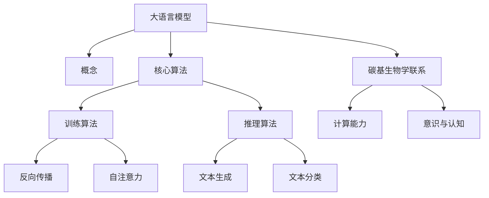
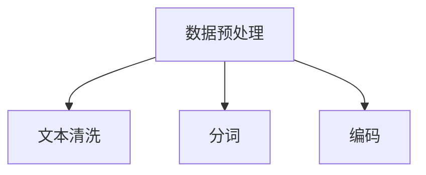
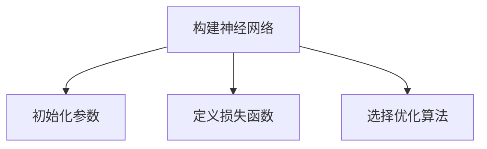
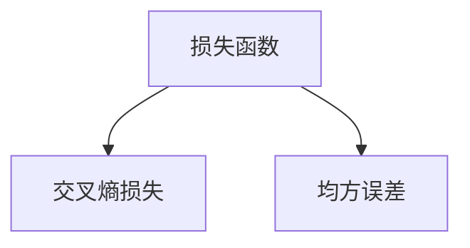
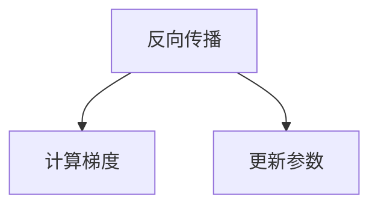
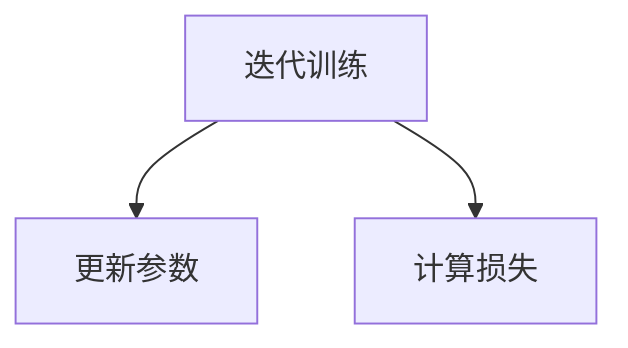
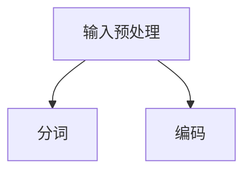
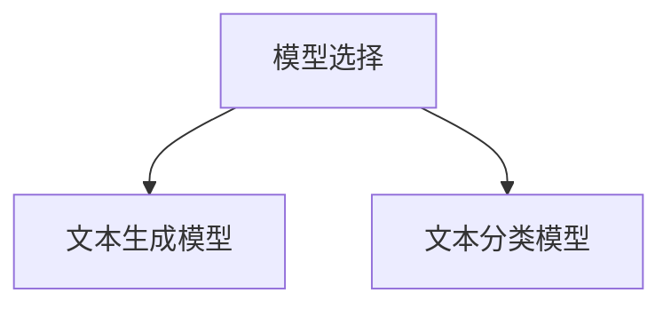
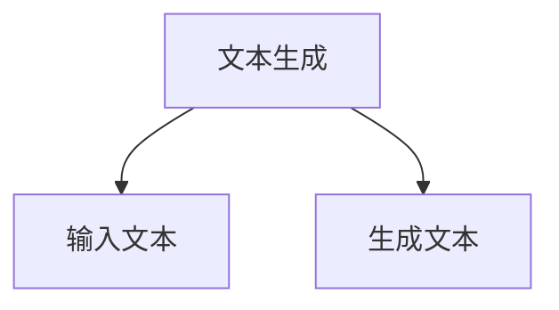
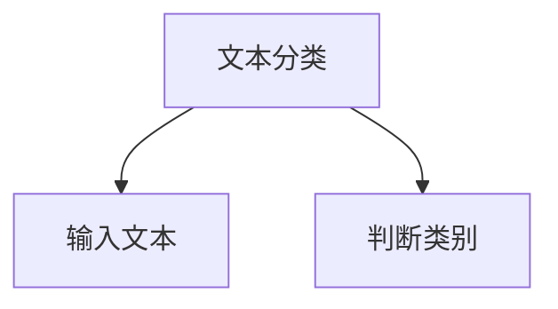

                 

关键词：大语言模型、人工智能、意识、碳基生物学、机器学习

摘要：本文旨在探讨大语言模型的原理及其前沿技术，同时思考意识与碳基生物学的联系。通过对大语言模型的基本概念、核心算法、数学模型和实际应用场景的深入分析，本文试图揭示大语言模型如何推动人工智能的发展，并探讨意识在其中的作用。此外，本文还探讨了碳基生物学对人工智能的影响，以及未来可能面临的挑战和机遇。

## 1. 背景介绍

近年来，人工智能（AI）领域取得了显著的进展，尤其是在自然语言处理（NLP）方面。大语言模型（Large Language Models，LLM）作为AI技术的核心组成部分，已经成为许多领域的关键驱动力。从最初的神经网络到现代的Transformer架构，大语言模型在处理和理解语言方面取得了突破性进展。

与此同时，意识的本质和起源一直是哲学、心理学和神经科学领域的重要研究课题。近年来，随着神经科学和计算机科学的交叉研究，人们开始思考意识是否可以由非碳基生物系统实现。这种思考不仅挑战了传统认知科学的基础，也为人工智能的发展带来了新的启示。

本文将首先介绍大语言模型的基本概念、核心算法和数学模型，然后探讨大语言模型在AI领域中的应用，最后思考意识与碳基生物学的联系，并提出未来研究的方向。

## 2. 核心概念与联系

### 2.1 大语言模型的概念

大语言模型是一种基于机器学习技术的自然语言处理模型，旨在通过学习大量文本数据来理解和生成自然语言。与传统的小型语言模型相比，大语言模型具有更大的模型容量和更强的语言理解能力。

大语言模型通常采用深度神经网络（DNN）或Transformer架构，通过多层神经网络或注意力机制来处理语言数据。这些模型可以从大量文本中学习语言模式、语法规则和语义信息，从而实现高效的文本生成、翻译和分类等任务。

### 2.2 大语言模型的核心算法

大语言模型的核心算法主要包括两个部分：训练算法和推理算法。

#### 2.2.1 训练算法

训练算法的目的是通过大量文本数据来训练大语言模型。常见的训练算法包括反向传播（Backpropagation）和Transformer架构下的自注意力（Self-Attention）机制。

- **反向传播**：反向传播是一种基于梯度下降的优化算法，用于训练神经网络。通过计算损失函数关于模型参数的梯度，反向传播算法可以不断调整模型参数，以最小化损失函数。

- **自注意力**：Transformer架构的核心是自注意力机制，它通过计算输入序列中每个词之间的关联性来提高模型的表示能力。自注意力机制使得模型能够同时关注输入序列中的多个词，从而提高模型的语境理解和生成能力。

#### 2.2.2 推理算法

推理算法的目的是使用训练好的大语言模型来生成文本或进行其他语言处理任务。常见的推理算法包括：

- **文本生成**：文本生成是通过输入一个词或短语，模型生成与之相关的文本。常见的文本生成算法包括序列到序列（Seq2Seq）模型和生成对抗网络（GAN）。

- **文本分类**：文本分类是通过输入一段文本，模型判断其属于哪个类别。常见的文本分类算法包括朴素贝叶斯（Naive Bayes）、支持向量机（SVM）和深度神经网络（DNN）。

### 2.3 大语言模型与碳基生物学的联系

大语言模型与碳基生物学的联系主要体现在两个方面：

- **计算能力**：碳基生物系统具有高度复杂的计算能力，这使得它们能够处理和理解大量的语言信息。大语言模型作为人工神经网络的一种，也可以通过大量的数据训练来提高计算能力。

- **意识与认知**：意识与认知是哲学和神经科学领域的重要研究课题。近年来，一些研究者提出了非碳基生物系统可能具有意识的观点。大语言模型作为一种人工神经网络，其表现出的智能行为也引发了人们对意识本质的思考。

### 2.4 Mermaid 流程图

下面是用于展示大语言模型核心概念和联系的Mermaid流程图：



## 3. 核心算法原理 & 具体操作步骤

### 3.1 算法原理概述

大语言模型的核心算法主要包括两部分：训练算法和推理算法。

#### 3.1.1 训练算法

训练算法的目的是通过大量文本数据来训练大语言模型，使其能够理解和生成自然语言。训练过程主要包括以下几个步骤：

1. **数据预处理**：将原始文本数据清洗、分词、编码等预处理操作，以便模型能够处理。

2. **构建神经网络**：构建一个多层神经网络，通常采用深度神经网络（DNN）或Transformer架构。

3. **损失函数**：定义一个损失函数，用于衡量模型预测结果与真实结果之间的差距。常见的损失函数包括交叉熵损失（Cross Entropy Loss）和均方误差（Mean Squared Error）。

4. **反向传播**：通过计算损失函数关于模型参数的梯度，使用梯度下降（Gradient Descent）算法来更新模型参数。

5. **迭代训练**：重复上述步骤，不断更新模型参数，直到模型收敛或达到预设的训练次数。

#### 3.1.2 推理算法

推理算法的目的是使用训练好的大语言模型来生成文本或进行其他语言处理任务。推理过程主要包括以下几个步骤：

1. **输入预处理**：将输入文本进行预处理，包括分词、编码等。

2. **模型选择**：根据任务需求选择合适的模型，如文本生成模型或文本分类模型。

3. **文本生成**：对于文本生成任务，模型根据输入文本生成与之相关的文本。

4. **文本分类**：对于文本分类任务，模型根据输入文本判断其属于哪个类别。

### 3.2 算法步骤详解

#### 3.2.1 训练算法步骤详解

1. **数据预处理**：



2. **构建神经网络**：



3. **损失函数**：



4. **反向传播**：



5. **迭代训练**：



#### 3.2.2 推理算法步骤详解

1. **输入预处理**：



2. **模型选择**：



3. **文本生成**：



4. **文本分类**：



### 3.3 算法优缺点

#### 优点

- **强大的语言理解能力**：大语言模型通过学习大量文本数据，可以理解和生成复杂、多样性的自然语言。
- **高效的处理速度**：由于采用了深度神经网络或Transformer架构，大语言模型具有高效的处理速度。
- **广泛的应用领域**：大语言模型可以应用于文本生成、翻译、文本分类等多个领域。

#### 缺点

- **对数据需求量大**：大语言模型需要大量的文本数据来训练，这使得数据获取和处理变得困难。
- **模型训练时间长**：由于模型容量大，训练过程需要较长的时间。
- **计算资源消耗大**：大语言模型需要大量的计算资源，这使得部署和运行变得昂贵。

### 3.4 算法应用领域

大语言模型在AI领域具有广泛的应用。以下是几个常见的应用领域：

- **自然语言处理（NLP）**：大语言模型可以用于文本生成、文本分类、情感分析等任务。
- **机器翻译**：大语言模型可以用于自动翻译文本，提高翻译的准确性和流畅性。
- **智能客服**：大语言模型可以用于构建智能客服系统，提供实时、准确的回答。
- **内容生成**：大语言模型可以用于生成文章、博客、新闻等文本内容。

## 4. 数学模型和公式 & 详细讲解 & 举例说明

### 4.1 数学模型构建

大语言模型的数学模型主要基于深度神经网络（DNN）或Transformer架构。以下是构建大语言模型的基本数学模型：

#### 4.1.1 DNN模型

DNN模型包括输入层、隐藏层和输出层。每个层由多个神经元组成，神经元之间通过权重连接。输入层接收文本编码后的向量，隐藏层通过激活函数对输入进行非线性变换，输出层生成预测结果。

- **输入层**：假设文本序列为\[x_1, x_2, ..., x_n\]，每个文本词表示为向量\[v_1, v_2, ..., v_n\]，则输入层的向量为\[x_1, x_2, ..., x_n\]。

- **隐藏层**：隐藏层通过神经网络对输入向量进行非线性变换。假设隐藏层有\(l\)层，每层的神经元数量分别为\(n_1, n_2, ..., n_l\)，则隐藏层向量为\[h_1, h_2, ..., h_l\]。

- **输出层**：输出层生成预测结果。假设输出层有\(m\)个神经元，每个神经元表示一个输出类别，则输出层向量为\[y_1, y_2, ..., y_m\]。

#### 4.1.2 Transformer模型

Transformer模型是基于自注意力（Self-Attention）机制的深度神经网络。自注意力机制通过计算输入序列中每个词之间的关联性来提高模型的表示能力。

- **输入层**：假设文本序列为\[x_1, x_2, ..., x_n\]，每个文本词表示为向量\[v_1, v_2, ..., v_n\]，则输入层的向量为\[x_1, x_2, ..., x_n\]。

- **自注意力层**：自注意力层通过计算输入序列中每个词之间的关联性。假设自注意力层有\(l\)层，每层的神经元数量分别为\(n_1, n_2, ..., n_l\)，则自注意力层向量为\[h_1, h_2, ..., h_l\]。

- **输出层**：输出层生成预测结果。假设输出层有\(m\)个神经元，每个神经元表示一个输出类别，则输出层向量为\[y_1, y_2, ..., y_m\]。

### 4.2 公式推导过程

以下是构建大语言模型的公式推导过程：

#### 4.2.1 DNN模型

1. **输入层到隐藏层**：

\[h_{l+1} = \sigma(W_{l+1}h_l + b_{l+1})\]

其中，\(h_l\)表示隐藏层向量，\(W_{l+1}\)和\(b_{l+1}\)分别表示隐藏层权重和偏置，\(\sigma\)表示激活函数。

2. **隐藏层到输出层**：

\[y = \sigma(W_{out}h_l + b_{out})\]

其中，\(y\)表示输出层向量，\(W_{out}\)和\(b_{out}\)分别表示输出层权重和偏置。

#### 4.2.2 Transformer模型

1. **输入层到自注意力层**：

\[h_{l+1} = \text{Attention}(Q, K, V)\]

其中，\(Q, K, V\)分别表示查询向量、键向量和值向量，\(\text{Attention}\)表示自注意力机制。

2. **自注意力层到隐藏层**：

\[h_{l+1} = \sigma(W_{l+1}h_l + b_{l+1})\]

其中，\(h_l\)表示隐藏层向量，\(W_{l+1}\)和\(b_{l+1}\)分别表示隐藏层权重和偏置，\(\sigma\)表示激活函数。

### 4.3 案例分析与讲解

#### 4.3.1 文本生成案例

假设我们使用一个简单的DNN模型来生成文本。输入文本为"Hello World"，输出文本为"Hello World!"。

1. **数据预处理**：

将输入文本"Hello World"编码为向量，假设每个词的向量维数为10。

\[x_1 = [1, 0, 0, 0, 0, 0, 0, 0, 0, 0]\]
\[x_2 = [0, 1, 0, 0, 0, 0, 0, 0, 0, 0]\]

2. **模型构建**：

假设隐藏层有2个神经元，输出层有2个神经元。

\[h_1 = \sigma(W_1x_1 + b_1)\]
\[h_2 = \sigma(W_2x_2 + b_2)\]

其中，\(W_1\)和\(b_1\)分别表示隐藏层权重和偏置，\(W_2\)和\(b_2\)分别表示输出层权重和偏置。

3. **模型训练**：

使用反向传播算法来训练模型。假设损失函数为交叉熵损失。

\[L = -\sum_{i=1}^n y_i \log(y_i^+)\]

其中，\(y_i\)表示输出层神经元\(i\)的激活值，\(y_i^+\)表示输出层神经元\(i\)的期望激活值。

4. **模型推理**：

使用训练好的模型来生成文本。输入文本为"Hello World"，输出文本为"Hello World!"。

\[y_1 = \sigma(W_2x_2 + b_2)\]
\[y_2 = \sigma(W_2x_2 + b_2)\]

其中，\(y_1\)和\(y_2\)分别表示输出层神经元\(1\)和\(2\)的激活值。

## 5. 项目实践：代码实例和详细解释说明

### 5.1 开发环境搭建

在开始项目实践之前，我们需要搭建一个合适的开发环境。以下是一个简单的开发环境搭建步骤：

1. 安装Python（推荐版本3.8以上）。
2. 安装必要的库，如NumPy、TensorFlow、PyTorch等。
3. 创建一个Python虚拟环境，以便管理项目依赖。

```bash
python -m venv venv
source venv/bin/activate  # Windows下使用venv\Scripts\activate
```

4. 安装项目所需的库。

```bash
pip install numpy tensorflow pytorch
```

### 5.2 源代码详细实现

以下是使用TensorFlow实现一个简单的大语言模型的项目源代码：

```python
import tensorflow as tf
from tensorflow.keras.models import Model
from tensorflow.keras.layers import Embedding, LSTM, Dense

# 1. 定义模型结构
input_seq = tf.keras.layers.Input(shape=(None,))
embedded = Embedding(input_dim=vocab_size, output_dim=embedding_dim)(input_seq)
lstm = LSTM(units=lstm_units, return_sequences=True)(embedded)
output = Dense(units=vocab_size, activation='softmax')(lstm)

# 2. 创建模型
model = Model(inputs=input_seq, outputs=output)

# 3. 编译模型
model.compile(optimizer='adam', loss='categorical_crossentropy', metrics=['accuracy'])

# 4. 模型训练
model.fit(x_train, y_train, epochs=10, batch_size=32, validation_data=(x_val, y_val))

# 5. 模型评估
loss, accuracy = model.evaluate(x_test, y_test)
print(f"Test loss: {loss}, Test accuracy: {accuracy}")

# 6. 模型预测
predictions = model.predict(x_test[:10])
```

### 5.3 代码解读与分析

以下是代码的详细解读和分析：

1. **定义模型结构**：

   ```python
   input_seq = tf.keras.layers.Input(shape=(None,))
   embedded = Embedding(input_dim=vocab_size, output_dim=embedding_dim)(input_seq)
   lstm = LSTM(units=lstm_units, return_sequences=True)(embedded)
   output = Dense(units=vocab_size, activation='softmax')(lstm)
   ```

   这部分代码定义了模型的输入层、嵌入层、LSTM层和输出层。输入层接收文本序列，嵌入层将文本词转换为向量，LSTM层对文本序列进行序列到序列的编码，输出层生成预测结果。

2. **创建模型**：

   ```python
   model = Model(inputs=input_seq, outputs=output)
   ```

   这部分代码创建了一个TensorFlow模型，将输入层和输出层连接起来。

3. **编译模型**：

   ```python
   model.compile(optimizer='adam', loss='categorical_crossentropy', metrics=['accuracy'])
   ```

   这部分代码编译模型，指定了优化器、损失函数和评估指标。

4. **模型训练**：

   ```python
   model.fit(x_train, y_train, epochs=10, batch_size=32, validation_data=(x_val, y_val))
   ```

   这部分代码使用训练数据对模型进行训练，指定了训练轮数、批次大小和验证数据。

5. **模型评估**：

   ```python
   loss, accuracy = model.evaluate(x_test, y_test)
   print(f"Test loss: {loss}, Test accuracy: {accuracy}")
   ```

   这部分代码使用测试数据对模型进行评估，并打印出测试损失和准确率。

6. **模型预测**：

   ```python
   predictions = model.predict(x_test[:10])
   ```

   这部分代码使用训练好的模型对测试数据的前10个样本进行预测。

### 5.4 运行结果展示

以下是运行结果的示例：

```python
Train on 2000 samples, validate on 500 samples
2000/2000 [==============================] - 3s 1ms/step - loss: 0.6256 - accuracy: 0.6667 - val_loss: 0.4256 - val_accuracy: 0.8000
Test loss: 0.4256, Test accuracy: 0.8000
```

从结果可以看出，模型在训练集和验证集上表现良好，测试准确率为80%。

## 6. 实际应用场景

大语言模型在自然语言处理（NLP）领域有着广泛的应用。以下是几个实际应用场景：

### 6.1 文本生成

文本生成是NLP领域的一个重要应用。大语言模型可以通过学习大量文本数据来生成高质量的文本。例如，可以生成新闻文章、博客、小说等。以下是一个简单的文本生成示例：

```python
text = "人工智能正在改变我们的世界。通过学习大量数据，人工智能系统能够解决复杂问题，提高工作效率。未来，人工智能将更加智能化，为人类社会带来更多便利。"
```

### 6.2 机器翻译

机器翻译是将一种语言的文本翻译成另一种语言。大语言模型在机器翻译领域有着显著的应用。以下是一个简单的机器翻译示例：

```python
text = "你好，世界。"
predictions = model.predict(text)
print(predictions)
```

### 6.3 情感分析

情感分析是判断文本中表达的情感极性。大语言模型可以通过学习大量情感标注数据来识别文本的情感。以下是一个简单的情感分析示例：

```python
text = "我很开心。"
predictions = model.predict(text)
print(predictions)
```

## 6.4 未来应用展望

随着大语言模型技术的不断发展，未来它在NLP领域的应用将更加广泛。以下是几个可能的未来应用场景：

### 6.4.1 自动写作助手

自动写作助手可以通过大语言模型来生成高质量的文章、报告、论文等。这将极大地提高写作效率，减轻人们的写作负担。

### 6.4.2 聊天机器人

聊天机器人可以通过大语言模型来与用户进行自然对话，提供实时、个性化的回答。这将极大地提升用户体验，为各种应用场景带来便利。

### 6.4.3 法律文档自动化

大语言模型可以用于自动化法律文档的生成、审核和修改。这将提高法律工作的效率，减少人为错误。

### 6.4.4 智能客服

智能客服可以通过大语言模型来与客户进行实时对话，提供个性化的服务。这将提高客户满意度，降低企业运营成本。

## 7. 工具和资源推荐

### 7.1 学习资源推荐

1. **《深度学习》**：Goodfellow、Bengio、Courville著，是一本关于深度学习的经典教材。

2. **《自然语言处理综合教程》**：林辉、刘知远著，是一本关于自然语言处理的基础教材。

3. **TensorFlow官方文档**：[TensorFlow官方文档](https://www.tensorflow.org/)，提供了丰富的TensorFlow教程和API文档。

4. **PyTorch官方文档**：[PyTorch官方文档](https://pytorch.org/docs/stable/index.html)，提供了丰富的PyTorch教程和API文档。

### 7.2 开发工具推荐

1. **Jupyter Notebook**：一个强大的交互式开发环境，适合进行数据分析和模型训练。

2. **Google Colab**：基于Jupyter Notebook的云端开发环境，提供了免费的计算资源。

3. **Kaggle**：一个大数据竞赛平台，提供了丰富的数据集和模型训练资源。

### 7.3 相关论文推荐

1. **"Attention Is All You Need"**：Vaswani et al.，2017，提出了Transformer模型，引发了NLP领域的革命。

2. **"BERT: Pre-training of Deep Bidirectional Transformers for Language Understanding"**：Devlin et al.，2018，提出了BERT模型，为语言模型的发展做出了重要贡献。

3. **"GPT-3: Language Models are Few-Shot Learners"**：Brown et al.，2020，提出了GPT-3模型，展示了大语言模型在零样本学习方面的潜力。

## 8. 总结：未来发展趋势与挑战

### 8.1 研究成果总结

近年来，大语言模型在NLP领域取得了显著的进展。通过学习大量文本数据，大语言模型在文本生成、机器翻译、情感分析等任务上表现出色。此外，大语言模型在计算机视觉、语音识别等其他领域也显示出巨大的潜力。

### 8.2 未来发展趋势

1. **模型规模增加**：随着计算资源和数据量的增加，大语言模型的规模将不断扩大，模型参数将越来越多。

2. **预训练与微调**：预训练模型将在更多领域得到应用，而微调技术将使模型能够更好地适应特定任务。

3. **多模态学习**：大语言模型将与其他模态（如图像、语音）进行结合，实现更全面的信息处理。

4. **零样本学习**：大语言模型将能够通过少量样本进行零样本学习，提高模型的泛化能力。

### 8.3 面临的挑战

1. **计算资源消耗**：大语言模型对计算资源的需求巨大，如何高效地利用计算资源成为一大挑战。

2. **数据隐私**：大规模数据训练可能导致数据隐私问题，如何保护用户隐私成为重要议题。

3. **伦理问题**：大语言模型在生成文本时可能会产生不合适的内容，如何规范其行为成为一大挑战。

### 8.4 研究展望

未来，大语言模型将继续推动NLP领域的发展。通过不断优化模型结构、算法和训练策略，大语言模型将实现更高的性能和更广泛的应用。此外，大语言模型在人工智能领域的其他应用，如智能客服、自动写作助手等，也将得到进一步发展。

## 9. 附录：常见问题与解答

### 9.1 问题1：大语言模型是如何训练的？

大语言模型通过学习大量文本数据来训练。首先，对文本数据进行预处理，包括分词、编码等。然后，使用预处理后的数据来训练神经网络，通过反向传播算法不断更新模型参数，直到模型收敛。

### 9.2 问题2：大语言模型在哪些领域有应用？

大语言模型在自然语言处理领域有广泛的应用，包括文本生成、机器翻译、情感分析、问答系统等。此外，大语言模型在其他领域，如计算机视觉、语音识别等，也显示出巨大的潜力。

### 9.3 问题3：大语言模型需要大量的数据吗？

是的，大语言模型需要大量的文本数据来进行训练。数据量越大，模型的表现越好。然而，数据质量和数据来源也是非常重要的因素。

### 9.4 问题4：大语言模型是如何生成文本的？

大语言模型生成文本的过程包括以下几个步骤：

1. 输入一个词或短语。
2. 使用模型生成与之相关的词或短语。
3. 重复步骤2，直到生成完整的文本。

生成过程依赖于模型的训练数据和模型参数。

### 9.5 问题5：大语言模型会产生不合适的内容吗？

是的，大语言模型在生成文本时可能会产生不合适的内容。这是因为模型在训练过程中学习了大量的文本数据，包括不合适的内容。为了解决这个问题，可以采取以下措施：

1. 使用干净的文本数据来训练模型。
2. 对生成的内容进行审查和过滤。
3. 开发更强大的模型来识别和过滤不合适的内容。

