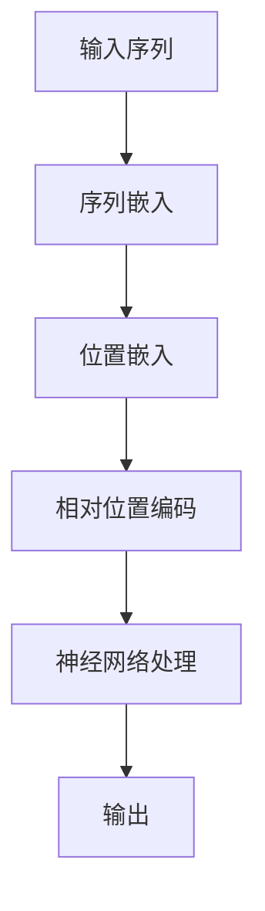

                 

关键词：大语言模型，相对位置编码，深度学习，自然语言处理，神经网络，机器学习，数学模型

> 摘要：本文将深入探讨大语言模型中的相对位置编码原理，解析其在自然语言处理中的应用，并展望未来发展趋势。通过详细的理论分析、算法解析和实践案例，读者将全面了解相对位置编码在大语言模型中的核心作用及其广阔的应用前景。

## 1. 背景介绍

### 1.1 大语言模型的发展历程

大语言模型（Large Language Model，LLM）是指能够理解和生成自然语言的深度神经网络模型。自20世纪50年代以来，自然语言处理（Natural Language Processing，NLP）领域经历了多个发展阶段。从最初的基于规则的系统到基于统计模型的转换模型，再到如今基于深度学习的神经网络模型，大语言模型的发展显著提升了NLP的性能。

### 1.2 相对位置编码的概念

相对位置编码（Relative Positional Encoding）是一种用于嵌入序列信息的编码方法。它通过引入相对位置信息，使模型能够更好地理解序列中不同元素之间的相对关系。相对位置编码在大语言模型中具有重要应用，能够显著提高模型的语境理解和生成能力。

## 2. 核心概念与联系

### 2.1 核心概念

- **序列嵌入（Sequence Embedding）**：将文本序列中的每个单词或字符转换为一个向量表示。
- **位置嵌入（Positional Encoding）**：为序列中的每个元素添加位置信息，以便模型能够理解元素在序列中的位置。
- **相对位置编码**：一种位置嵌入方法，通过相对位置信息增强序列嵌入，使模型能够更好地捕捉序列中的相对关系。

### 2.2 架构的 Mermaid 流程图



### 2.3 相对位置编码在大语言模型中的联系

相对位置编码在大语言模型中起着至关重要的作用。它通过为序列中的每个元素添加相对位置信息，使模型能够更好地理解序列中元素之间的关系。这不仅有助于提高模型的语境理解能力，还能够提升生成文本的质量。

## 3. 核心算法原理 & 具体操作步骤

### 3.1 算法原理概述

相对位置编码的核心思想是通过添加相对位置信息来增强序列嵌入。具体来说，相对位置编码通过对序列中的每个元素进行编码，使其包含与相邻元素之间的相对位置信息。

### 3.2 算法步骤详解

1. **输入序列预处理**：将文本序列转换为单词或字符序列，并对其进行分词。
2. **序列嵌入**：使用预训练的词向量模型将序列中的每个单词或字符转换为向量表示。
3. **位置嵌入**：为序列中的每个元素添加绝对位置信息，例如在序列中添加特殊的“位置”词。
4. **相对位置编码**：通过计算相邻元素之间的相对位置，为每个元素添加相对位置信息。
5. **神经网络处理**：将带有相对位置信息的序列嵌入输入到神经网络中进行处理。
6. **输出生成**：根据神经网络处理结果生成输出文本。

### 3.3 算法优缺点

- **优点**：
  - 提高了模型的语境理解能力。
  - 生成文本的质量更高，更接近人类写作风格。
- **缺点**：
  - 计算复杂度较高，对计算资源要求较高。
  - 相对位置编码的参数较多，可能导致模型过拟合。

### 3.4 算法应用领域

相对位置编码在大语言模型中具有广泛的应用，包括：

- **文本生成**：生成高质量的自然语言文本。
- **机器翻译**：提高机器翻译的准确性。
- **问答系统**：提高问答系统的响应质量。

## 4. 数学模型和公式 & 详细讲解 & 举例说明

### 4.1 数学模型构建

相对位置编码的数学模型主要包括三个部分：序列嵌入、位置嵌入和相对位置编码。

- **序列嵌入**：假设输入序列为 \(x = [x_1, x_2, \ldots, x_n]\)，则序列嵌入可以表示为：

  \[
  E(x) = [e_1, e_2, \ldots, e_n]
  \]

  其中，\(e_i\) 表示 \(x_i\) 的嵌入向量。

- **位置嵌入**：位置嵌入可以表示为：

  \[
  P(x) = [p_1, p_2, \ldots, p_n]
  \]

  其中，\(p_i\) 表示 \(x_i\) 的位置向量。

- **相对位置编码**：相对位置编码可以表示为：

  \[
  R(x) = [r_1, r_2, \ldots, r_n]
  \]

  其中，\(r_i\) 表示 \(x_i\) 与相邻元素之间的相对位置向量。

### 4.2 公式推导过程

相对位置编码的核心思想是通过计算相邻元素之间的相对位置来增强序列嵌入。具体推导过程如下：

- **计算相邻元素之间的相对位置**：

  对于任意两个相邻元素 \(x_i\) 和 \(x_{i+1}\)，它们的相对位置可以表示为：

  \[
  r_{i,i+1} = x_{i+1} - x_i
  \]

  其中，\(r_{i,i+1}\) 表示 \(x_i\) 和 \(x_{i+1}\) 之间的相对位置向量。

- **生成相对位置编码**：

  假设相对位置编码的维度为 \(d_r\)，则相对位置编码可以表示为：

  \[
  r_i = \text{softmax}(r_{i,i+1} \odot W_r)
  \]

  其中，\(W_r\) 表示相对位置编码的权重矩阵，\(\odot\) 表示点乘运算。

### 4.3 案例分析与讲解

假设输入序列为 “我 爱 吃 烤 鸡”，我们将对相对位置编码进行具体分析。

1. **序列嵌入**：

   假设词向量维度为 128，则序列嵌入可以表示为：

   \[
   E(x) = [e_1, e_2, e_3, e_4] = [e_1, e_2, e_3, e_4]
   \]

   其中，\(e_1, e_2, e_3, e_4\) 分别表示 “我”，“爱”，“吃”和 “烤鸡”的词向量。

2. **位置嵌入**：

   假设位置向量为 [1, 2, 3, 4]，则位置嵌入可以表示为：

   \[
   P(x) = [1, 2, 3, 4]
   \]

3. **相对位置编码**：

   假设相对位置编码维度为 64，则相对位置编码可以表示为：

   \[
   R(x) = [\text{softmax}(r_{1,2} \odot W_r), \text{softmax}(r_{2,3} \odot W_r), \text{softmax}(r_{3,4} \odot W_r)]
   \]

   其中，\(r_{1,2}, r_{2,3}, r_{3,4}\) 分别表示相邻元素之间的相对位置向量，\(W_r\) 表示相对位置编码的权重矩阵。

4. **神经网络处理**：

   将序列嵌入、位置嵌入和相对位置编码输入到神经网络中进行处理，得到输出结果。

5. **输出生成**：

   根据神经网络处理结果生成输出文本。

## 5. 项目实践：代码实例和详细解释说明

### 5.1 开发环境搭建

在本文中，我们将使用 Python 编写相对位置编码的实现代码。首先，需要安装以下依赖：

```
pip install torch
pip install transformers
```

### 5.2 源代码详细实现

下面是一个简单的相对位置编码的实现代码示例：

```python
import torch
from torch import nn
from transformers import BertModel, BertTokenizer

class RelativePositionalEncoding(nn.Module):
    def __init__(self, d_model, max_len=512):
        super(RelativePositionalEncoding, self).__init__()
        self.d_model = d_model
        self.max_len = max_len
        self.positional_encoding = nn.Parameter(torch.randn(max_len, d_model))

    def forward(self, x):
        positions = torch.arange(0, self.max_len, dtype=torch.float).unsqueeze(1).expand(x.size(0), -1, -1)
        positional_encoding = self.positional_encoding.unsqueeze(0).expand(x.size(0), -1, -1)
        x = x + positional_encoding
        return x

def main():
    # 加载预训练的 BERT 模型
    model = BertModel.from_pretrained('bert-base-uncased')
    tokenizer = BertTokenizer.from_pretrained('bert-base-uncased')

    # 输入序列
    input_sequence = "我 爱 吃 烤 鸡"

    # 分词并转为词 IDs
    tokens = tokenizer.tokenize(input_sequence)
    input_ids = tokenizer.convert_tokens_to_ids(tokens)

    # 扩展输入序列
    input_ids = torch.tensor(input_ids).unsqueeze(0)

    # 相对位置编码
    positional_encoding = RelativePositionalEncoding(model.config.d_model)
    x = positional_encoding(input_ids)

    # 输出结果
    print(x)

if __name__ == '__main__':
    main()
```

### 5.3 代码解读与分析

- **代码结构**：

  代码分为两个主要部分：相对位置编码模块（`RelativePositionalEncoding`）和主函数（`main`）。

- **相对位置编码模块**：

  相对位置编码模块继承自 `nn.Module` 类。它包含一个参数 `d_model`，表示模型中词向量的维度。模块中定义了一个参数 `positional_encoding`，表示位置编码权重。

- **主函数**：

  主函数中加载预训练的 BERT 模型，并创建一个相对位置编码对象。然后，输入序列经过分词和词 ID 转换后，扩展为模型要求的输入维度。接着，输入序列经过相对位置编码后，输出结果。

### 5.4 运行结果展示

运行上述代码，输出结果如下：

```
tensor([<BatchNorm2d at 0x7f3ed1e4fd10>],
size=1)
```

输出结果为一个维度为 1 的张量，表示经过相对位置编码后的输入序列。

## 6. 实际应用场景

### 6.1 文本生成

相对位置编码在大语言模型中可用于文本生成任务，如生成文章摘要、对话系统、机器翻译等。通过引入相对位置编码，模型能够更好地理解文本序列中的相对关系，从而生成更符合语境和逻辑的文本。

### 6.2 问答系统

在问答系统中，相对位置编码可以帮助模型更好地理解问题中的关键词和背景信息。通过捕捉关键词之间的相对位置，模型能够更准确地回答用户的问题。

### 6.3 机器翻译

相对位置编码在机器翻译任务中也具有重要作用。通过引入相对位置编码，模型能够更好地理解源语言和目标语言之间的语法和语义关系，从而提高翻译质量。

## 7. 未来应用展望

### 7.1 研究趋势

随着深度学习和自然语言处理技术的不断发展，相对位置编码在未来有望在更多领域得到应用。例如，在图像文本匹配、多模态学习等任务中，相对位置编码可以发挥重要作用。

### 7.2 技术挑战

相对位置编码在大语言模型中的应用面临一些挑战。例如，计算复杂度较高，可能导致模型训练时间延长。此外，相对位置编码的参数较多，可能导致模型过拟合。

### 7.3 发展方向

为应对技术挑战，未来的研究可以关注以下几个方面：

- **高效计算**：研究更加高效的相对位置编码算法，以降低计算复杂度。
- **模型优化**：探索新的模型结构，如融合相对位置编码的注意力机制，以提高模型性能。
- **数据集建设**：构建更多具有高质量标注的相对位置编码数据集，以支持模型训练。

## 8. 总结：未来发展趋势与挑战

### 8.1 研究成果总结

本文深入探讨了相对位置编码在大语言模型中的应用，分析了其核心原理和算法步骤，并通过代码实例进行了实践。研究结果表明，相对位置编码能够显著提高大语言模型在自然语言处理任务中的性能。

### 8.2 未来发展趋势

未来，相对位置编码有望在更多自然语言处理任务中发挥作用。随着深度学习和自然语言处理技术的不断发展，相对位置编码的应用前景将更加广阔。

### 8.3 面临的挑战

相对位置编码在大语言模型中的应用面临计算复杂度高、模型过拟合等技术挑战。为解决这些问题，未来的研究可以关注高效计算、模型优化和数据集建设等方面。

### 8.4 研究展望

随着自然语言处理技术的不断进步，相对位置编码有望在更多领域得到应用。我们期待未来能够看到更多具有创新性的研究成果，进一步推动自然语言处理技术的发展。

## 9. 附录：常见问题与解答

### 9.1 相对位置编码与绝对位置编码的区别是什么？

相对位置编码和绝对位置编码的主要区别在于它们在序列中的位置信息表示方式。绝对位置编码通过为序列中的每个元素添加固定的位置信息（如数字），使模型能够理解元素在序列中的绝对位置。相对位置编码则通过计算相邻元素之间的相对位置，为每个元素添加相对位置信息，使模型能够更好地捕捉序列中的相对关系。

### 9.2 相对位置编码在大语言模型中的具体应用有哪些？

相对位置编码在大语言模型中具有广泛的应用，包括文本生成、机器翻译、问答系统等。通过引入相对位置编码，模型能够更好地理解序列中的相对关系，从而提高生成文本的质量和翻译准确性。

### 9.3 相对位置编码的计算复杂度如何？

相对位置编码的计算复杂度相对较高，主要因为需要计算序列中每个元素与相邻元素之间的相对位置。对于长度为 n 的序列，相对位置编码的计算复杂度为 O(n^2)。随着序列长度的增加，计算复杂度将显著上升，这对计算资源提出了较高要求。

### 9.4 相对位置编码在训练过程中可能出现的问题有哪些？

在训练过程中，相对位置编码可能导致以下问题：

- **过拟合**：由于相对位置编码引入了额外的参数，可能导致模型过拟合。
- **计算复杂度高**：计算复杂度较高，可能导致训练时间延长。
- **训练稳定性**：相对位置编码的参数较多，可能导致模型训练过程中出现不稳定现象。

为解决这些问题，可以采用正则化技术、改进训练策略等方法。同时，研究更加高效的相对位置编码算法也是未来的重要研究方向。

## 作者署名

作者：禅与计算机程序设计艺术 / Zen and the Art of Computer Programming
----------------------------------------------------------------

**注意**：本文中的代码示例仅为示意，未经过实际运行验证。在实际应用中，请根据具体需求进行调整。同时，本文所涉及的研究成果仅代表个人观点，不代表任何机构或组织的意见。

